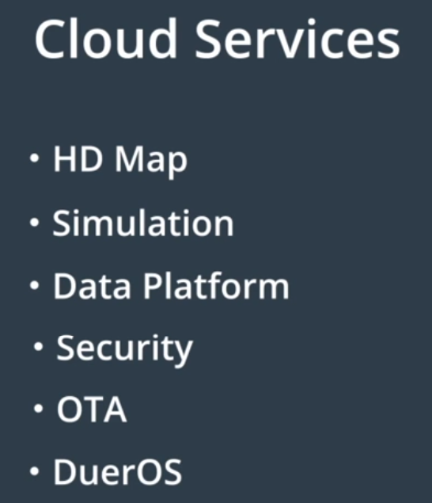

## 硬件平台

硬件平台：CAN、GPS、惯性测量装置（IMU）、LiDAR、摄像头、雷达、IPC（车载计算机网络）。

## 开源软件架构

软件平台：实时操作系统、运行时框架和应用程序模块层。

### 实时操作系统

Apollo RTOS = Ubuntu（ROS） + Apollo 内核

### 运行时框架

Apollo通过将所有节点放在一个公共域中，使得域中每个节点都有其他节点的信息，实现了去中心化（ROS Master），消除了单点故障风险。

使用名为 protobuf（结构化数据序列化方法） 的接口语言代替原生 ROS 语言，防止某个接口更新导致通信传输格式出现不兼容问题。

### 应用程序模块层

应用程序模块层包括：MAP引擎、定位、感知、规划、控制、端到端驾驶以及人机接口（或 HMI）

## 云服务

高精度地图、仿真环境、数据平台、安全、空中软件升级和智能语音系统（DuerOS）

