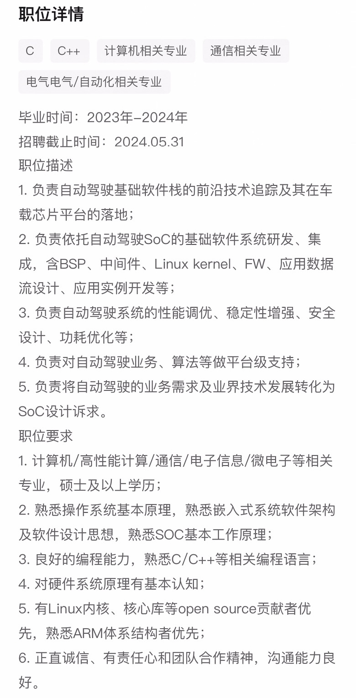
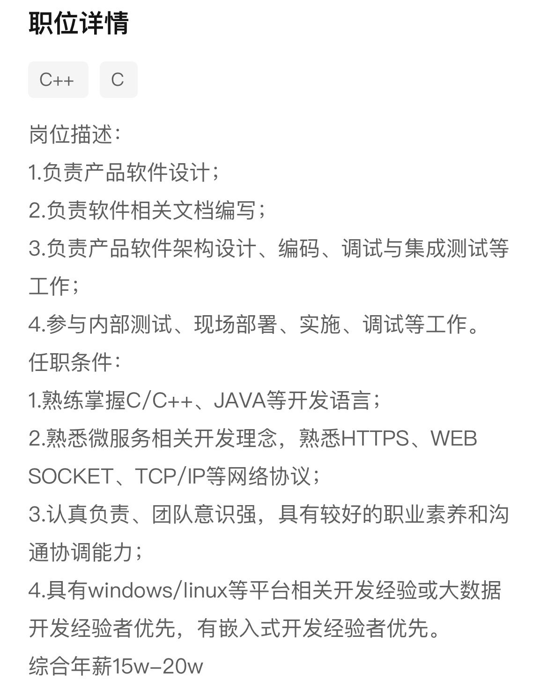
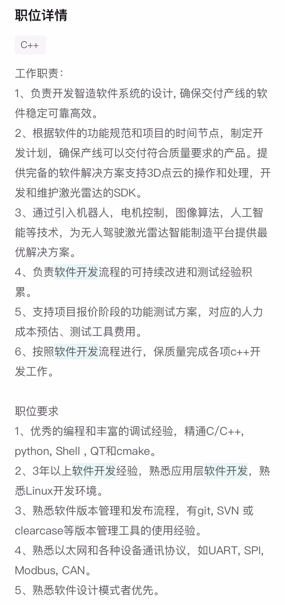
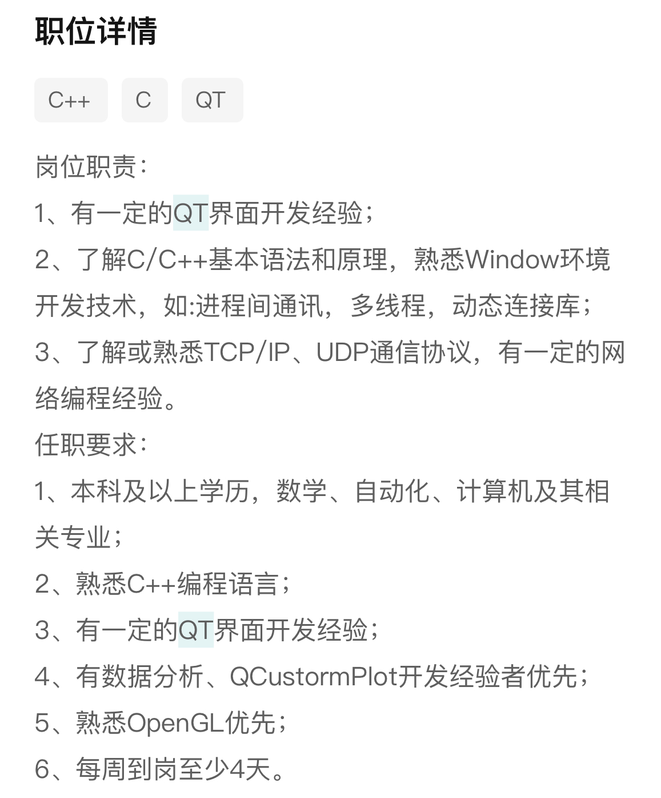

C++就业方向：

1. 桌面应用开发，QT开发工程师；一颗星
2. 工业软件开发；
3. 传统嵌入式行业；
4. AI嵌入式开发；
5. 自动驾驶的端侧；
6. 嵌入式驱动；
7. 单片机开发；
8. Linux应用开发；
9. C++后台开发；
10. 游戏后台；
11. 数字图像处理；
12. 音视频开发；
13. 逆向与安全；
14. 图形图像开发；
15. AI部署；
16. 量化；
17. slam；

ros、数据库开发工程师、区块链开发工程师、数据科学工程师、多媒体应用开发工程师、并行计算工程师、机器人控制软件工程师

冲linux后台开发保工业软件

### linux应用/C++后台开发：

1. 蔚来：芯片软件工程师

	

2. 

### 工业软件：

1. 华为：软件开发工程师

	

2. 中国航空工业集团航空测控：软件工程师

	

3. 禾赛科技：C++软件开发工程师

	

4. 中国科学院自动化研究所：QT开发实习生

	

5. 

