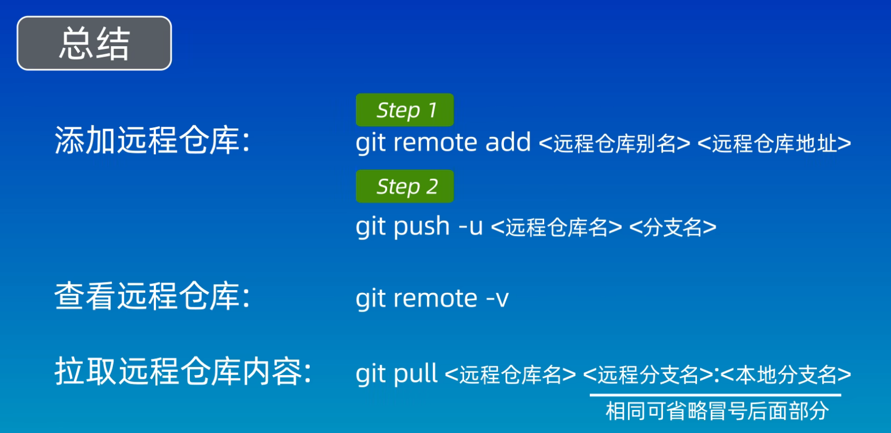
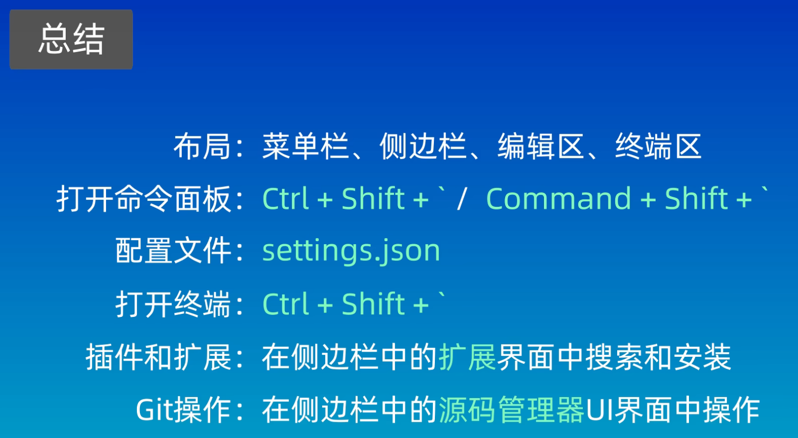

## 1、工作区域和文件状态


## 2、添加和提交文件


## 3、git reset 回退版本


## 4、使用 git diff 查看差异


## 5、`git rm`

1. 删除工作区的文件；
2. 相当于 `rm + git add`；
3. git rm 删除的文件必须是没有经过修改的，也就是说必须要和当前版本库的内容一致的。

若使用 `git rm` 只想删除暂存区中的文件，而且保留工作区中的文件：

```cpp
git rm --cached test.txt
```


## 6、github中 `gitignore` 中提供了大部分语言关于gitignore 内容的模板


## 7、创建一个远程仓库并将其关联到本地

### 使用 ssh 关联：

#### 1、报错：

终端输入远程仓库 ssh 的地址：

```
git clone git@github.com:yin-roc/git_test.git
```

会报错：

```
正克隆到 'git_test'...
git@github.com: Permission denied (publickey).
fatal: 无法读取远程仓库。

请确认您有正确的访问权限并且仓库存在。
```

#### 2、解决办法：

1、回到根目录下

```
cd ~
```

2、进入隐藏文件夹 `.ssh`

```
cd .ssh/
```

3、设置 ssh

3.1、从未设置过 ssh

3.1.1、终端输入

```
ssh-keygen -t rsa -b 4096 
```

3.1.2、连续两次回车

```
Generating public/private rsa key pair.
Enter file in which to save the key (/home/yin-roc/.ssh/id_rsa): 
Enter passphrase (empty for no passphrase): 
Enter same passphrase again: 
```

3.1.3、出现如下结果：

```
Generating public/private rsa key pair.
Enter file in which to save the key (/home/yin-roc/.ssh/id_rsa): 
Enter passphrase (empty for no passphrase): 
Enter same passphrase again: 
Your identification has been saved in /home/yin-roc/.ssh/id_rsa
Your public key has been saved in /home/yin-roc/.ssh/id_rsa.pub
The key fingerprint is:
SHA256:kAEBqbby1AAKI1ln8ywimXWA+Ti6msjjgKLdIc2vtbI yin-roc@yinroc-virtual-machine
The key's randomart image is:
+---[RSA 4096]----+
| ==+Bo.          |
|O+.+ + o         |
|B*. . =          |
|=oo. . .         |
|o..o    S        |
|+..o.            |
|=+. + .          |
|B+.o.+ .         |
|Boo E+o          |
+----[SHA256]-----+
```

3.1.4、查看当前文件夹的内容

```
ls -ltr
```

结果如下所示：

id_rsa 为秘钥

id_rsa.pub 为公钥

```
总用量 12
-rw-r--r-- 1 yin-roc yin-roc  444 4月  29 19:41 known_hosts
-rw-r--r-- 1 yin-roc yin-roc  756 4月  29 19:49 id_rsa.pub
-rw------- 1 yin-roc yin-roc 3401 4月  29 19:49 id_rsa
```

3.1.5	添加 id_rsa.pub 里面的内容（即：公钥）至 github 中的 SSH and GPG keys之中


3.2、曾经设置过 ssh 密码

3.2.1、终端输入：

```
ssh-keygen -t rsa -b 4096 
```

3.2.2、此处因为之前设置过 ssh 密钥，不能随意回车，如果回车，会覆盖之前的密码（即：以前的密码失效）

可以通过给该密钥起别名，比如我这里的 `test`：

```
Generating public/private rsa key pair.
Enter file in which to save the key (/home/yin-roc/.ssh/id_rsa): test
Enter passphrase (empty for no passphrase): 
Enter same passphrase again: 
```

3.2.3、查看密钥文件

```
ls -ltr
```

结果为：

```
总用量 20
-rw-r--r-- 1 yin-roc yin-roc  444 4月  29 19:41 known_hosts
-rw------- 1 yin-roc yin-roc 3401 4月  29 19:49 id_rsa
-rw-r--r-- 1 yin-roc yin-roc  756 4月  29 19:50 id_rsa.pub
-rw-r--r-- 1 yin-roc yin-roc  756 4月  29 20:23 test.pub
-rw------- 1 yin-roc yin-roc 3401 4月  29 20:23 test
```

3.2.4、同上，在 github 上添加密钥

添加 test.pub 里面的内容（即：公钥）至 github 中的 SSH and GPG keys之中


3.2.5、修改绑定的密钥

根目录下：

```
vim config
```

在其中写入如下内容，`~/.ssh/test` 为要绑定的密钥文件：

```
# github
Host github.com
HostName github.com
PreferredAuthentications publickey
IdentityFile ~/.ssh/test
```


4、重新回到要克隆的文件夹下执行命令：

```
git clone git@github.com:yin-roc/git_test.git
```

显示如下内容便表示成功：

```
正克隆到 'git_test'...
remote: Enumerating objects: 3, done.
remote: Counting objects: 100% (3/3), done.
remote: Total 3 (delta 0), reused 0 (delta 0), pack-reused 0
接收对象中: 100% (3/3), 完成.
```


#### 3、进入克隆的文件夹下执行相关操作

```
git add .
git commit -m "this is the first commit."
git push
```

git push：远程仓库更新至本地仓库

git pull：本地仓库上传至远程仓库


## 8、关联本地仓库和远程仓库

1、创建一个远程仓库

tips：最好创建过程中不要选择添加 ReadMe.md 文件

2、进入本地仓库目录下：

```
cd my-repo-soft/
```

```
git remote add origin git@github.com:yin-roc/first_repo.git
```

`git@github.com:yin-roc/first_repo.git` 为本地仓库的链接

3、查看是否成功

```
git remote -v
```

成功则出现：

```
origin	git@github.com:yin-roc/first_repo.git (fetch)
origin	git@github.com:yin-roc/first_repo.git (push)
```

`origin` 则是 远程仓库的别名。

也可以使用 `git remote add` 添加新的远程仓库的地址：

gitlab是仓库别名，后加仓库的地址：


4、修改当前分支名为 `main` （远程仓库也必须是 `main`）

```
git branch -M main
```

5、把本地仓库和别名为 origin 的远程仓库关联在一起，并将本地仓库的 main 分支 推送给远程仓库的 main 分支

```
git push -u origin main:main
```

6、将远程仓库（origin）的分支（main）拉取到本地仓库再进行合并

```
git pull origin main
```

当然，系统默认也是这样做，因此命令可简化为：

```
git pull
```


tips：

`git pull`：远程仓库与本地仓库没有冲突：便会成功，如有则会失败，需要手动解决冲突；

`git fetch` ：获取远程仓库的修改，并不会自动合并


5、Gitee 和 GitLab

由于本地仓库事先关联了 github 仓库，因此如果需要上传更新到 gitlab 仓库则需要指定仓库名称和分支：





## 9、GUI 工具

Github Desktop

Sourcetree

GitKraken（商用）


## 10、VSCode配置 Git




## 11、分支简介和基本操作

1、创建新分支 dev

```
git branch dev
```

2、切换分支到 dev

```
git checkout dev
```

3、git checkout 缺点

由于其也用来恢复文件，`git checkout` 默认切换分支

Git 新提供了 `git switch` 来切换分支


由下图可以发现：main 分支没有 后加入的 dev 分支的内容，但dev 分支却有：


解决方法：

在 main 分支下使用 `git merge dev` 来合并 dev 分支内容到 main中。


合并后的分支可以使用如下命令来删除：

git branch -d dev


如果未合并后的分支可以使用如下命令来强制删除：

```
git branch -D branch-name
```


## 12、解决合并冲突

在分支 dev 上修改某文件并提交，随后在 main 中修改同一文件并提交后，使用 `git merge dev` 合并该分支到 main 上时，会出现冲突：

```
自动合并 file4.txt
冲突（内容）：合并冲突于 file4.txt
自动合并失败，修正冲突然后提交修正的结果。
```

使用 git status 查看冲突：

```
位于分支 main
您的分支领先 'origin/main' 共 1 个提交。
  （使用 "git push" 来发布您的本地提交）

您有尚未合并的路径。
  （解决冲突并运行 "git commit"）
  （使用 "git merge --abort" 终止合并）

未合并的路径：
  （使用 "git add <文件>..." 标记解决方案）
	双方修改：   file4.txt

修改尚未加入提交（使用 "git add" 和/或 "git commit -a"）
```

也可以使用 git diff 查看冲突的具体内容：

```
diff --cc file4.txt
index 7cc86ad,3749383..0000000
--- a/file4.txt
+++ b/file4.txt
@@@ -1,1 -1,1 +1,5 @@@
++<<<<<<< HEAD
 +666
++=======
+ 555
++>>>>>>> dev
```


解决办法：

1、打开 main 下的冲突文件：

发现其中内容由 666 变成如下内容，也就是冲突的内容：

```
++<<<<<<< HEAD
 +666
++=======
+ 555
++>>>>>>> dev
```

2、修改该文件的内容：

```
666,555
```

3、修改完成后，推送至本地仓库

```
git add .
git commit -m "conflict commit"
```


## 13、回退和 rebase

### rebase

1、在 dev 分支下执行 `git rebase main`

找到共同祖先 main3，将 dev 分支移植到 main 后面。


2、在 main 分支下执行 `git rebase dev`


### 回退

```
git checkout -b dev 244d35
```

回退成功将会前往 dev 分支


也可以通过：`git log --oneline --graph --decorate --all` 也可以看到提交 ID

同时也需要将 main 分支下的内容回退，例如：

```
git switch main
git reset --hard b4d139
```

回退到之前的状态。


