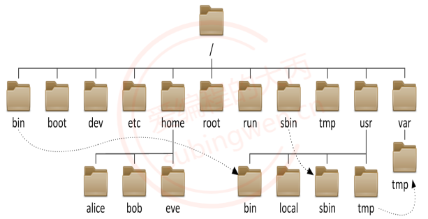
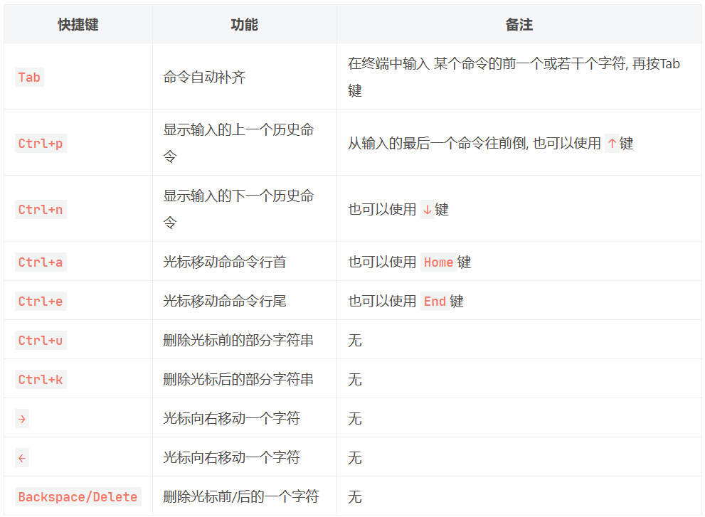
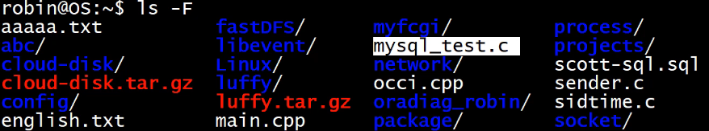
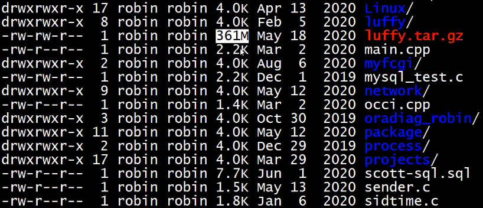
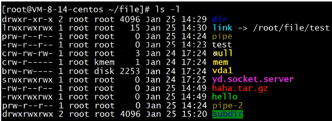
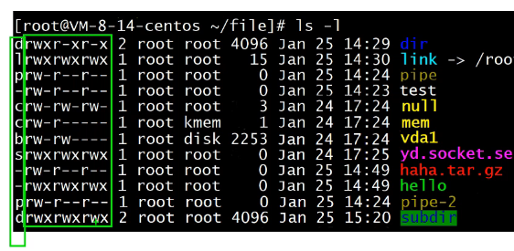
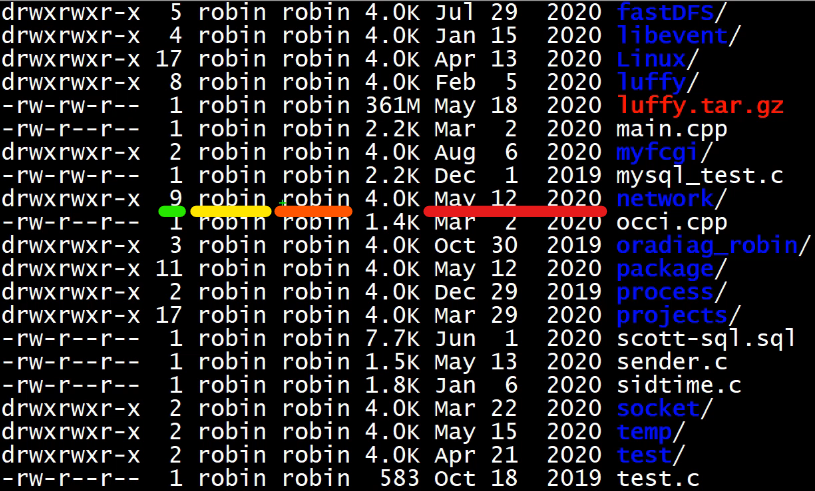
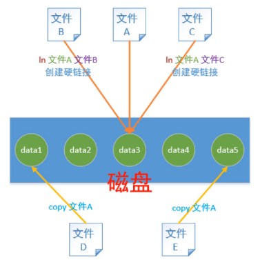
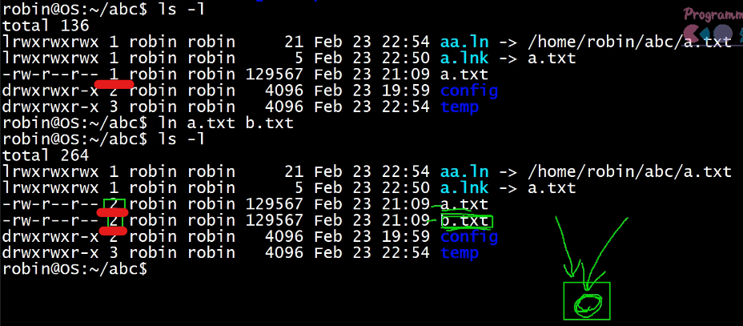
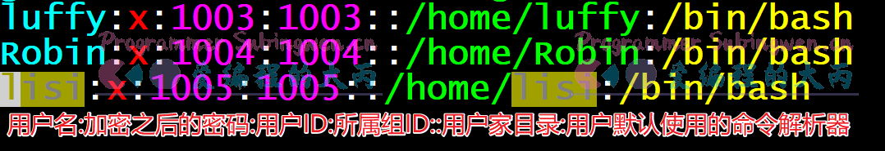

内容来自：[Linux介绍](https://subingwen.cn/linux/version-path/)

视频推荐：[Linux基础入门教程-linux命令-vim-gcc/g++ -动态库/静态库 -makefile-gdb调试](https://www.bilibili.com/video/BV13U4y1p7kB?p=6&vd_source=13217e9da4230968b7b156b59f773f16)

## day01

### 1、基础概念

Linux 是 UNIX 操作系统的一个克隆系统, 但是Linux是开源的。

Linux是一个基于文件的操作系统。操作系统需要和硬件进行交互, 对应Linux来说这些硬件都是文件，比如: 操作系统会将 硬盘, 鼠标, 键盘, 显示屏等抽象成一个设备文件来进行管理。


### 2、一些名词

GNU：Gnu’s Not Unix. 可以理解成一种口号，号召软件自由。

POSIX：（Portable Operating System Interface for Computing Systems）是由 IEEE 和 ISO/IEC 开发的一套标准。POSIX 标准是对 UNIX 操作系统的经验和实践的总结，==对操作系统调用的服务接口进行了标准化，保证所编制的应用程序在源代码一级可以在多种操作系统上进行移植==。

BSD开源协议: BSD开源协议是一个给于使用者很大自由的协议。基本上使用者可以”为所欲为”。

GPL：General Public License. GNU通用公共许可证，GPL 授予程序的接受方下述的权利，即 GPL 所倡导的“自由”：

- 可以以任何目的运行所购买的程序；
- 在得到程序代码的前提下，可以以学习为目的，对源程序进行修改；
- 可以对复制件进行再发行；
- 对所购买的程序进行改进，并进行公开发布。

自由软件：GNU项目下的所有软件都基于GPL许可证（非GNU项目也可使用GPL），都是自由软件。

### 3、版本号选择 

官方每年会发布两个版本, 每个版本的版本号由两部分组成: 主版本号 + 副版本号

- 主版本号为当年年份, 长期支持版的年份为偶数, 测试版年份为奇数
- 副版本号为月份，在4月份发布的为相对稳定版， 在10月份发布的为测试版

因此应当选择==主版本号为偶数，副版本号为 04==的版本，进行安装使用。


### 4、Linux 内核

Linux 的内核主要由 5 个子系统组成：进程调度、内存管理、虚拟文件系统、网络接口、进程间通信。

1. 进程调度 SCHED：

	- 进程调度指的是系统对进程的多种状态之间转换的策略。

	- 每启动一个可执行程序都会得到一个进程，进程的运行需要CPU的加持，而CPU的资源有限，如果要同时执行多个可执行程序（即，同时处理多个进程），需要分时复用CPU的时间片，时间的长短由内核决定。

	- 进程调度有3种策略：

		- SCHED_OTHER：分时调度策略（默认），是用于针对普通进程的时间片轮转调度策略。

		- SCHED_FIFO：实时调度策略，是针对运行的==实时性要求比较高、运行时间短==的进程调度策略。

		- SCHED_RR：实时调度策略，是针对==实时性要求比较高、运行时间比较长==的进程调度策略。

	FIFO和RR需要人为指定。

2. 内存管理 MMU：

	- 内存管理是多个进程间的内存共享策略。在Linux中，内存管理主要说的是虚拟内存。

	- 每启动一个磁盘上的可执行程序，都会得到一个虚拟地址空间。虚拟地址空间又分为内核区和用户区。只可以操作修改用户区。
	- 将虚拟地址空间里面的数据先映射到物理内存，再通过CPU对物理内存里面的数据进行处理

3. 虚拟文件系统 VFS：

	- 用程序（纯软件）将数据写入到磁盘（硬件），中间需要一个缓冲层，即操作系统提供的文件管理。

4. 网络接口：

	- 网络接口分为网络协议和驱动程序，网络协议是一种网络传输的通信标准，而网络驱动则是对硬件设备的驱动程序。Linux 支持的网络设备多种多样，几乎目前所有网络设备都有驱动程序。

5. 进程间通信：

	进程之间需要进行数据的交流才能完成控制、协同工作等功能，Linux 的进程间通信是从 UNIX 系统继承过来的。

	- 启动的多个程序若需要进行数据交互，必须要使用进程间通信。
	- Linux 下的进程间的通信方式主要有管道、信号、消息队列、共享内存和套接字等方法。


## day02

### 5、Linux目录结构

操作系统文件结构的开始，只有一个单独的顶级目录结构，叫做==根目录==。所有一切都从“根”开始，用`"/"`代表，

大致目录结构如下：



主要介绍：

1. 在linux中根目录的子目录结构相对是固定的(名字固定), 不同的目录功能是也是固定的

2. ==bin==: binary, 二进制文件目录, ==存储了可执行程序==, 今天要将的命令对应的可执行程序都在这个目录中

3. sbin: super binary, root用户使用的一些二进制可执行程序

4. ==etc==: 配置文件目录, 系统的或者用户自己安装的==应用程序的配置文件==都==存储==在这个目录中

5. ==lib==: library, 存储了一些==动态库和静态库==，给系统或者安装的软件使用

6. ==media==: 挂载目录, ==挂载外部设备==，比如: 光驱, 扫描仪

7. ==mnt==: ==临时挂载目录==, 比如我们可以将U盘临时挂载到这个目录下

8. proc: 内存使用的一个映射目录, 给操作系统使用的

9. ==tmp==: 临时目录, 存放临时数据, ==重启电脑数据就被自动删除==了

10. ==boot==: 存储了==开机相关的设置==

11. ==home==: 存储了==普通用户的家目录==，家目录名和用户名相同

12. root: root用户的家目录

13. ==dev==: device , 设备目录, Linux中一切皆文件, ==所有的硬件会抽象成文件存储起来==，比如：键盘， 鼠标

14. lost+found: 一般时候是空的, 电脑异常关闭/崩溃时用来存储这些无家可归的文件, 用于用户系统恢复

15. ==opt==: ==第三方软件的安装目录==

16. ==var==: 存储了系统使用的一些==经常会发生变化的文件==， 比如：日志文件

17. usr: unix system resource, 系统的资源目录

	- ==/usr/bin==: 可执行的==二进制应用程序==
	- /usr/games: 游戏目录
	- /usr/include: 包含的标准头文件目录

	- ==/usr/local==: 和opt目录作用相同, ==安装第三方软件==

	

### 6、相对路径

相对路径就是相对于当前文件的路径。

- `./` ：代表目前所在的目录，也可以使用 `.`表示。
- `../` ：代表当前目录的上一层目录，也可以使用 `..`表示。


### 7、绝对路径

从系统磁盘起始节点开始描述的路径。


### 8、命令提示行

```css
robin@OS:~/luffy$ whoami
```

关键字：

1. `robin`：当前的用户名，可以使用 `whoami` 输出当前的用户名；
2. `@`：连接符；
3. `OS`：当前的主机名（可手动指定）；
4. `:`：间隔符；
5. `~/luffy`：其中 `~` 代表家目录，`/luffy`：代表进入家目录的 `luffy` 目录下；
6. `$`：代表当前用户是普通用户，如果当前的用户是管理员用户，`$` 会变为 `#`；


### 9、命令解析器

命令解析器在Linux操作系统中就是一个进程(运行的应用程序)，它的名字叫做bash，通常我们更习惯将其称之为shell (即: sh)。

命令都是通过命令解析器解析完成并执行的，如果用户在终端输入是正确的内部指令，命令解析器就执行这个命令，如果不是正确的指令，则提示命令无法解析。

`usr/bin`、`bin` 存放了可执行的二进制程序。（可以使用 `which` 命令来查看命令的位置）

==命令解析器工作时先去搜索 PATH 的路径，依次搜索其中路径有没有对应的可执行程序（命令）。==

```shell
# 通过 echo 命令可以查看环境变量 PATH 中的值, 在shell中变量名前加 $ 就是取值
[root@VM-8-14-centos ~]# echo $PATH
/usr/local/sbin:/usr/local/bin:/usr/sbin:/usr/bin:/root/bin
```


### 10、命令行快捷键




### 11、cd 命令—目录切换

命令格式：

```css
$ cd 目录名
```

目录名：使用相对路径/绝对路径都可以，该路径必须是一个有效路径
特殊的目录：
`..`：表示当前目录的上一级目录, 使用 `cd ..` 或者 `cd ../` 都可以；
`.`：表示当前目录, 使用 `.` 或者 `./` 都可以，`cd . `不会切换目录。

进入到家目录的方式：

```shell
$ cd                    # 方式1
$ cd ~                  # 方式2
$ cd /home/用户名        # 方式3
```

在临近的两个目录之间切换：

```shell
# 通过cd进入到目录1:  /usr/include/c++/7.5.0/ext/pb_ds/detail/list_update_map_/
# 通过cd进入到目录2:  /home/luffy/get/onepiece/itis/a/goldfish
# 频繁在两个目录之间切换
$ cd -
```


### 12、ls 命令

ls 就是 list，打印指定的文件信息，如果是目录，显示对应目录中有哪些子文件，语法格式如下：

```python
$ ls [args]           # 查看当前目录
$ ls [args] 目录名 	# 查看指定目录
$ ls [args] 文件名 	# 查看某个文件的信息
```

1. `ls -a`

	显示指定目录中的所有文件（包括==隐藏文件==和非隐藏文件）

2. `ls -l`

	显示文件的详细信息

3. `ls -F`

	可以用来判断是文件还是目录（文件夹），即：文件名后有 `/` 代表其是一个目录，没有 `/` 代表其不是一个目录：

	

4. `ls -lFh`

	ls中的命令可以组合使用，比如 `-h` 和 `-l` 一起使用，可以将文件的大小用人类熟知的方式显示：

	==tips==：如果是一个目录，那么也只代表该目录所占的大小，并不包括目录内部的文件大小。

	

5. `ll`

	- 有些版本的Linux中 `ll` 等价于 `ls -l`；
	- 有些版本的Linux中 `ll` 等价于 `ls -laF`；


### 13、文件类型

1. `-`：普通的文件，在Linux终端中没有执行权限的为白色，压缩包为红色，可执行程序为绿色字体；
2. `d`：目录(directory)，在Linux终端中为蓝色字体，如果目录的所有权限都是开放的，有绿色的背景色；
3. `l`：软链接文件(link)，相当于windows中的快捷方式，在Linux终端中为淡蓝色(青色)字体；
4. `c`：字符设备(char)，在Linux终端中为黄色字体；
5. `b`：块设备(block)，在Linux终端中为黄色字体；
6. `p`:：管道文件(pipe)，在Linux终端中为棕黄色字体；
7. `s`：本地套接字文件(socket)，在Linux终端中为粉色字体。





### 14、Linux中的用户类型

如下图所示：第一列代表文件的类型，后九列代表用户对文件的操作权限



在Linux中有三大类用户： `文件所有者`，`文件所属组用户`，`其他人`

- 文件所有者：
	- Linux中的所有的文件都有一个所有者，就是文件的主人。
- 文件所属组：
	- ==文件的主人属于哪个组，这个文件默认也就属于哪个组==；
	- 用户组中可以有多个用户，这些组中的其他用户和所有者的权限可以是不一样的。
- 其他人：
	- 这个用户既不是文件所有者也不是文件所属组中的用户，就称之为其他人；
	- 其他人对文件也可以拥有某些权限。


### 15、用户对文件的访问权限

Linux中不同的用户可以对文件拥有不同的操作权限，权限一共有四种：读权限，写权限，执行权限，无权限。

- 读权限：使用 `r` 表示，即：`read`
- 写权限：使用 `w` 表示，即：`write`
- 执行权限：使用 `x` 表示，即：`excute`
- 没有任何权限：使用 `-` 表示

示例：

```shell
   -           rwx          rw-          r--  1 robin robin   2218 Dec  2 17:02 app
   |            |            |            |
文件类型      文件所有      文件所属     其他人权限
             者权限        组权限
```


### 16、硬链接计数

如下图所示：绿色的代表硬链接的数量。

如果这个数为N(N>=1)，就说明在一个或者多个目录下一共有N个文件，但是这N个文件并不占用多块磁盘空间，他们使用的是同一块，==如果通过其中一个文件修改了磁盘数据，那么其他文件中的内容也就变了==。每当我们给给磁盘文件创建一个硬链接（使用 ln），磁盘上就会出现一个新的文件名，硬链接计数加1，但是这新文件并不占用任何的磁盘空间，==文件名还是映射到原来的磁盘地址上==。

黄色的代表文件的所有者；

橙色的代表文件所属组；

红色的代表最近修改的日期。



给文件创建硬链接，和直接进行文件拷贝的区别，==创建硬链接只是多了一个新的文件名，拷贝文件不仅多了新的文件名在磁盘上数据也进行了拷贝==：




## day03

### 17、创建删除目录

#### 创建目录

目录的创建分为两种, 一种是创建单个目录, 另一种是一次性创建多层目录, 使用的命令是`mkdir`, 后边参数是要创建的目录的名字, 如果是多层目录需要添加参数`-p`。

```shell
# 单层目录
$ mkdir 新目录的名字

# 多层目录, 需要加参数 -p
$ mkdir parent/child/baby1/baby2 -p
```


#### 删除目录

如果要删除已经存在的路径一共有两种方式, 可以使用`rmdir`或者`rm`

- `rmdir`: 只能删除空目录，有点low，不好用
- `rm`: 可以删除文件也可以删除目录, 如果删除的的是目录, 需要加参数 `-r`, 意思是递归(recursion)

`rm`命令还有另外两个经常使用的参数:

- `-i`: 删除的时候给提示
- `-f`: 强制删除文件, 没有提示直接删除并且不能恢复, 慎用

```shell
# 1. low, 矮穷矬, 只能删除空目录
$ rmdir 目录名

# 2. 高大上, 可以删除目录也可以删除文件
# 删除目录需要加参数 -r, 递归的意思, 删除之后是不能恢复的
$ rm 目录名 -r
```


示例：

```shell
# 删除时不给提示
rm -rif c

# 删除时给提示
rm -rfi c
```

==tips==：`i` 和 `f` 同时用的话，谁写在后面谁生效。


### 18、文件的拷贝

> cp 就是copy, 拷贝, 使用这个命令可以拷贝文件也可以拷贝目录

- 拷贝文件 => `文件不存在得到新文件, 文件存在就覆盖`

	```SHELL
	# `语法: cp 要拷贝的文件  得到的文件`
	
	# `场景1: 文件A, 将A拷贝一份得到文件B`
	$ cp 文件A 文件B
	
	# `场景2: 文件A存在的, 文件B也是存在的, 执行下边的拷贝 ==> 文件A覆盖文件B`
	$ cp 文件A 文件B
	```

- 拷贝目录 ==> `目录不存在得到新目录, 该目录被拷贝到存在的目录中`

	```shell
	# 拷贝目录需要参数 -r
	# 场景1: 目录A, 通过拷贝得到不存在的目录B
	$ cp 目录A 目录B -r
	
	# 场景2: 目录A存在的, 目录B也是存在的, 执行下边的拷贝 ==> 目录A会被拷贝并将其放到目录B中
	$ cp 目录A 目录B -r
	
	# 场景3: 把A目录里的某一个或者多个文件拷贝到B目录中
	$ cp A/a.txt B	# 拷贝 A目录中的 a.txt 到目录B中
	$ cp A/* B -r	# 拷贝 A目录中的所有文件到目录B中, 不能确定A目录中是否有子目录, 因此需要加 -r
	```


### 19、mv 命令

> mv 就是move, 这个Linux命令既能移动文件所在目录也可以给文件改名。

- 文件的移动

	```shell
	# 语法: mv 要移动的文件目录
	# 有一个文件A, 移动到目录B中
	# 其中A可以是文件也可以是目录, B必须是目录而且必须是存在的
	$ mv A B
	```

- 文件改名

	```shell
	# 语法: mv 要改名的文件  新名字(原来是不存在的，这点很重要)
	# 其中A可以是文件也可以是目录，并且是存在的, B原来是不存在的
	$ mv A B
	```

- 文件覆盖

	```shell
	# 语法: mv 存在文件A  存在的文件B
	# 其中A是文件（非目录）并且是存在的, B也是一个文件（非目录）并且也存在
	# A文件中的内容覆盖B文件中的内容, A文件被删除, 只剩下B文件
	$ mv A B
	```


### 20、查看文件内容的相关命令

> 如果想要查看文件内容方式有很多, 最常用的是`vim`, 下面介绍一下`vim`以外的一些的一些方式:

- cat

	> 该命令可以将文件内容显示到终端, 由于终端是有缓存的, 因此能显示的字节数也是受限制的。 `如果文件太大数据就不能完全显示出来了，因此该命令适合查看比较小的文件内容。`

	```shell
	$ cat 文件名
	```

- more

	> 该命令比`cat`要高级一点, 我们可以以翻屏的方式查看文件中的内容，使用方式如下：

	```shell
	$ more 文件名
	# 快捷键
	- 回车: 显示下一行
	- 空格: 向下滚动一屏
	- b: 返回上一屏
	- q: 退出more
	```

- less

	> 该命令和`more`命令差不多, 我们可以以翻屏的方式查看文件中的内容，使用方式如下：

	```shell
	$ less 文件名
	# 快捷键
	- b: 向上翻页
	- 空格: 向后翻页
	- 回车: 显示下一行
	- 上下键: 上下滚动
	- q:退出
	```

- head

	> 使用该命令可以查看文件头部的若干行信息, 使用方式如下:

	```shell
	# 默认显示文件的前10行
	$ head 文件名
	# 指定显示头部的前多少行
	$ head -行数 文件名
	```

- tail

	> 使用该命令可以查看文件尾部的若干行信息, 使用方式如下:

	```shell
	# 默认显示文件的后10行
	$ tail 文件名
	# 指定显示尾部的最后多少行
	$ tail -行数 文件名
	```


### 21、给文件创建软连接或硬链接

> 链接分两种类型: `软连接`和`硬链接`。软连接相当于windows中的快捷方式，硬链接前边也已经介绍过了文件并不会进行拷贝，只是多出一个新的文件名并且硬链接计数会加1。

- 软连接

	基本语法格式: 

	```shell
	ln -s 源文件路径 软链接文件的名字(可以带路径)
	```

	示例：

	```shell
	# 查看目录文件
	[root@VM-8-14-centos ~/luffy]# ll
	total 8
	drwxr-xr-x 3 root root 4096 Jan 25 17:27 get
	-rw-r--r-- 1 root root   37 Jan 25 17:26 onepiece.txt
	
	# 给 onepiece.txt 创建软连接, 放到子目录 get 中
	[root@VM-8-14-centos ~/luffy]# ln -s /root/luffy/onepiece.txt get/link.lnk  
	[root@VM-8-14-centos ~/luffy]# ll get
	total 4
	lrwxrwxrwx 1 root root   24 Jan 25 17:27 link.lnk -> /root/luffy/onepiece.txt
	drwxr-xr-x 2 root root 4096 Jan 24 21:37 onepiece
	```

	在创建软链接的时候， 命令中的 `源文件路径`建议使用==绝对路径==, 这样才能保证创建出的软链接文件在任意目录中移动都可以访问到链接的那个源文件。

	

	==tips==：软链接文件以 `.lnk` 结尾，且==软链接更换目录后会失效==。

	

- 硬链接

	基本语法格式: 

	```shell
	ln 源文件 硬链接文件的名字(可以带路径)
	```

	示例：

	```shell
	# 创建硬链接文件, 放到子目录中
	[root@VM-8-14-centos ~/luffy]# ln onepiece.txt get/link.txt
	
	# 查看链接文件和硬链接计数, 从 1 --> 2
	[root@VM-8-14-centos ~/luffy]# ll get
	total 8
	lrwxrwxrwx 1 root root   24 Jan 25 17:27 link.lnk -> /root/luffy/onepiece.txt
	-rw-r--r-- 2 root root   37 Jan 25 17:26 link.txt
	drwxr-xr-x 2 root root 4096 Jan 24 21:37 onepiece
	```

	硬链接和软链接不同, 它是通话文件名直接找对应的硬盘地址, 而不是基于路径, 因此 `源文件`使用==相对路径==即可, 无需为其制定绝对路径。

	==tips==：

	1. 创建硬链接后，硬链接计数会增加；
	2. **目录是不允许创建硬链接的**；
	3. 硬链接源文件路径不需要绝对路径，只需要相对路径；
	4. 软链接源文件路径使用==绝对路径==。




## day04

### 22、通过文字设定法修改用户对文件的操作权限

文件权限是针对`文件所有者`，`文件所属组用户`，`其他人`这三类人而言的，对应的操作指令是`chmod`。设置方式也有两种，分别为`文字设定法`和`数字设定法`。

文字设定法是通过一些关键字`r`，`w`，`x`，`-`来描述用户对文件的操作权限。

数字设定法是通过一些数字 `0`，`1`，`2`，`4`，`5`，`6`，`7` 来描述用户对文件的操作权限。

文字设定法：

```shell
#chmod
# 语法格式: chmod who [+|-|=] mod 文件名
	- who:
		- u: user  -> 文件所有者
		- g: group -> 文件所属组用户
		- o: other -> 其他
		- a: all, 以上是三类人 u+g+o
	- 对权限的操作:
		+: 添加权限
		-: 去除权限
		=: 权限的覆盖
	- mod: 权限
		r: read, 读
		w: write, 写
		x: execute, 执行
		-: 没有权限
		
# 将文件所有者权限设置为读和执行, 也就是权限覆盖
robin@OS:~/Linux$ chmod u=rx b.txt 
robin@OS:~/Linux$ ll b.txt         
-r-xrw-r-- 2 robin robin 2929 Apr 14 18:53 b.txt*

# 给其他人添加写和执行权限
robin@OS:~/Linux$ chmod o+wx b.txt 
robin@OS:~/Linux$ ll b.txt         
-r-xrw-rwx 2 robin robin 2929 Apr 14 18:53 b.txt*

# 给文件所属组用户去掉读和执行权限
robin@OS:~/Linux$ chmod g-rx b.txt 
robin@OS:~/Linux$ ll b.txt         
-r-x-w-rwx 2 robin robin 2929 Apr 14 18:53 b.txt*

# 将文件所有者,文件所属组用户,其他人权限设置为读+写+执行
robin@OS:~/Linux$ chmod a=rwx b.txt
robin@OS:~/Linux$ ll b.txt 
-rwxrwxrwx 2 robin robin 2929 Apr 14 18:53 b.txt*
```


### 23、通过数字设定法修改文件的权限

数字设定法：

```shell
# 语法格式: chmod [+|-|=] mod 文件名
	- 对权限的操作:
		+: 添加权限
		-: 去除权限
		=: 权限的覆盖, 等号可以不写
	- mod: 权限描述, 所有权限都放开是 7
		- 4: read, r
		- 2: write, w
		- 1: execute , x
		- 0: 没有权限
		
# 分解: chmod 0567 a.txt

    0           5           6             7
  八进制     文件所有者  文件所属组用户    其他人
              r + x       r + w         r+w+x

######################### 举例 #########################
# 查看文件 c.txt 的权限			   
robin@OS:~/Linux$ ll c.txt 
-rwxrwxrwx 2 robin robin 2929 Apr 14 18:53 c.txt*

# 文件所有者去掉执行权限, 所属组用户去掉写权限, 其他人去掉读+写权限
robin@OS:~/Linux$ chmod -123 c.txt
robin@OS:~/Linux$ ll c.txt 
-rw-r-xr-- 2 robin robin 2929 Apr 14 18:53 c.txt*

# 文件所有者添加执行权限, 所属组用户和其他人权限不变
robin@OS:~/Linux$ chmod +100 c.txt
robin@OS:~/Linux$ ll c.txt 
-rwxr-xr-- 2 robin robin 2929 Apr 14 18:53 c.txt*

# 将文件所有者,文件所属组用户,其他人权限设置为读+写, 没有执行权限
robin@OS:~/Linux$ chmod 666 c.txt
robin@OS:~/Linux$ ll c.txt 
-rw-rw-rw- 2 robin robin 2929 Apr 14 18:53 c.txt
```

==tips==：不对其他用户执行任何权限，使用数字 `0`


### 24、修改文件所有者和所属组

> 默认情况下，文件是通过哪个用户创建出来的，就属于哪个用户，这个用户属于哪个组，文件就属于哪个组。如果有特殊需求，可以修改文件所有者，对应的操作命令是`chown`。因为修改文件所有者就跨用户操作，普通用户没有这个权限，需要借助管理员权限才能完成该操作。
>
> `普通用户借助管理员权限执行某些shell命令, 需要在命令前加关键字sudo, 但是普通用户默认是没有使用 sudo的资格的, 需要修改 /etc/sudoers 文件 `。

[普通用户添加sudo权限](https://subingwen.cn/linux/sudoers/)

```shell
# 语法1-只修改所有者: 
$ sudo chown 新的所有者 文件名

# 语法2-同时修改所有者和所属组: 
$ sudo chown 新的所有者:新的组名 文件名

# 查看文件所有者：b.txt 属于 robin 用户
robin@OS:~/Linux$ ll b.txt 
-rw-rw-rw- 2 robin robin 2929 Apr 14 18:53 b.txt

# 将 b.txt 的所有者修改为 luffy
robin@OS:~/Linux$ sudo chown luffy b.txt
[sudo] password for robin: 
robin@OS:~/Linux$ ll b.txt 
-rw-rw-rw- 2 luffy robin 2929 Apr 14 18:53 b.txt


# 修改文件所有者和文件所属组
# 查看文件所有者和所属组
robin@OS:~/Linux$ ll b.txt 
-rw-rw-rw- 2 luffy robin 2929 Apr 14 18:53 b.txt

# 同时修改文件所有者和文件所属组
robin@OS:~/Linux$ sudo chown robin:luffy b.txt 
robin@OS:~/Linux$ ll b.txt 
-rw-rw-rw- 2 robin luffy 2929 Apr 14 18:53 b.txt
```


> 普通用户没有修改文件所属组的权限，如果需要修改需要借助管理员权限才能完成，需要使用的命令是`chgrp`。当然了这个属性的修改也可以使用`chown`命令来完成。

```shell
# 只修改文件所属的组, 普通用户没有这个权限, 借助管理员的权限
# 语法: sudo chgrp 新的组 文件名

# 查看文件所属组信息
robin@OS:~/Linux$ ll b.txt 
-rw-rw-rw- 2 robin luffy 2929 Apr 14 18:53 b.txt

# 修改文件所属的组
robin@OS:~/Linux$ sudo chgrp robin b.txt 
robin@OS:~/Linux$ ll b.txt 
-rw-rw-rw- 2 robin robin 2929 Apr 14 18:53 b.txt
```


### 25、tree—查看目录内容

> 该命令的作用是`以树状结构显示目录`，tree工具默认是没有的，需要手动安装，系统版本不同安装方式也不尽相同：
>
> - ubuntu：`sudo apt install tree`
> - centos：`sudo yum install tree`
>
> 如果是基于管理员用户安装软件，不需要加sudo。该命令有一个常用参数 `-L`，即 (layer) 显示目录的层数。

```shell
# 语法格式
$ tree [-L n]         # 查看当前目录的结构, n为显示的目录层数
$ tree 目录名  [-L n]	# 查看指定目录的结构, n为显示的目录层数

# 只显示1层
[root@VM-8-14-centos ~]# tree -L 1
.
|-- ace
|-- file
|-- ipc.tar.gz
|-- link.lnk -> /root/luffy/onepiece.txt
`-- luffy

# 显示2层目录
[root@VM-8-14-centos ~]# tree -L 2
.
|-- ace
|   `-- brother
|-- file
|   |-- dir
|   |-- haha.tar.gz
|   |-- hello
|   |-- link -> /root/file/test
|   |-- pipe-2
|   |-- subdir
|   `-- test
|-- ipc.tar.gz
|-- link.lnk -> /root/luffy/onepiece.txt
`-- luffy
    |-- get
    `-- onepiece.txt
```


### 26、pwd—touch—which命令

#### pwd

> pwd命令用户当前所在的工作目录，没有参数，直接执行该命令即可。

```shell
# 查看当前用户在哪个目录中, 所在的目录一般称之为工作目录
[root@VM-8-14-centos ~/luffy/get/onepiece]# pwd
/root/luffy/get/onepiece		# 当前工作目录
```


#### touch

> 使用`touch`命令可以创建一个`新的空文件`，==如果指定的文件是已存在的，只会更新文件的修改日期，对内容没有任何影响。==

```shell
# 语法: touch 文件名

# 查看目录信息
[root@VM-8-14-centos ~/luffy]# ll
total 8
drwxr-xr-x 3 root root 4096 Jan 25 17:38 get
-rw-r--r-- 2 root root   37 Jan 25 17:26 onepiece.txt

# 创建一个新的文件 robin.txt
[root@VM-8-14-centos ~/luffy]# touch robin.txt

# 再次查看目录中的文件信息, 发现 robin.txt是空的, 大小为 0
[root@VM-8-14-centos ~/luffy]# ll
total 8
drwxr-xr-x 3 root root 4096 Jan 25 17:38 get
-rw-r--r-- 2 root root   37 Jan 25 17:26 onepiece.txt
-rw-r--r-- 1 root root    0 Jan 25 17:54 robin.txt

# touch 后的参数指定一个已经存在的文件名
[root@VM-8-14-centos ~/luffy]# touch onepiece.txt 

# 继续查看目录中的文件信息, 发现文件时间被更新了: 37 Jan 25 17:26 --> 37 Jan 25 17:54
[root@VM-8-14-centos ~/luffy]# ll
total 8
drwxr-xr-x 3 root root 4096 Jan 25 17:38 get
-rw-r--r-- 2 root root   37 Jan 25 17:54 onepiece.txt
-rw-r--r-- 1 root root    0 Jan 25 17:54 robin.txt
```


#### which

> which命令可以查看要执行的命令所在的实际路径，命令解析器工作的时候也会搜索这个目录。`需要注意的是该命令只能查看非内建的shell指令所在的实际路径, 有些命令是直接写到内核中的, 无法查看`。
>
> 我们使用的大部分shell命令都是放在系统的`/bin`或者`/usr/bin`目录下:

```shell
# 由于使用的Linux版本不同, 得到的路径也会有不同
[root@VM-8-14-centos ~]# which ls
alias ls='ls --color=auto'
        /usr/bin/ls
        
[root@VM-8-14-centos ~]# which date
/usr/bin/date

[root@VM-8-14-centos ~]# which cp
alias cp='cp -i'
        /usr/bin/cp
        
[root@VM-8-14-centos ~]# which mv
alias mv='mv -i'
        /usr/bin/mv
        
[root@VM-8-14-centos ~]# which pwd
/usr/bin/pwd
```


### 27、重定向操作

> 关于重定向使用最多的是就是`输出重定向`，顾名思义就是修改输出的数据的位置，通过重定向操作我们可以非常方便的进行文件的复制，或者文件内容的追加。输出重定向使用的不是某个关键字而是符号 `>`或者`>>`。
>
> - `>`：将文件内容写入到指定文件中，如果文件中已有数据，则会使用新数据覆盖原数据
> - `>>`：将输出的内容追加到指定的文件尾部

```shell
# 输出的重定向举例: printf默认是要将数据打印到终端, 可以修改默认的输出位置 => 重定向到某个文件中
# 关键字 >
# 执行一个shell指令, 获得一个输出, 这个输出默认显示到终端, 如果要将其保存到文件中, 就可以使用重定向
# 如果当前目录下test.txt不存在, 会被创建, 如果存在, 内容被覆盖
$ date > test.txt
# 日期信息被写入到文件 test.txt中
robin@OS:~/Linux$ cat test.txt 
Wed Apr 15 09:37:52 CST 2020

# 如果不希望文件被覆盖, 而是追加, 需要使用 >>
in@OS:~/Linux$ date >> test.txt
# 日期信息被追加到 test.txt中
robin@OS:~/Linux$ cat test.txt 
Wed Apr 15 09:37:52 CST 2020
Wed Apr 15 09:38:44 CST 2020

# 继续追加信息
robin@OS:~/Linux$ date >> test.txt
robin@OS:~/Linux$ cat test.txt    
Wed Apr 15 09:37:52 CST 2020
Wed Apr 15 09:38:44 CST 2020
Wed Apr 15 09:39:03 CST 2020

# 或者使用 echo
echo abcdefg >> test.txt
```


每个汉字（如 "年"、"月"、"日"、"星期"）在 UTF-8 编码中占用 `3` 个字节，其余字符（数字、空格、冒号、英文字母）在 UTF-8 编码中占用 1 个字节。


### 28、用户的切换

> Linux是一个多用户的操作系统，可以同时登陆多个用户，因此很多时候需要在多个用户之间切换，用户切换需要使用`su`或者`su -`。使用`su`只切换用户，当前的工作目录不会变化，但是使用 `su -`不仅会切换用户也会切换工作目录，工作目录切换为当前用户的家目录。
>
> 从用户A切换到用户B， 如果还想再切换回用户A，可以直接使用 `exit`。

```shell
# 只切换用户, 工作目录不变
$ su 用户名
# 举例:
robin@OS:~/Linux$ su luffy
Password:                       # 需要输入luffy用户的密码
luffy@OS:/home/robin/Linux$	    # 工作目录不变

# 切换用户和工作目录, 会自动跳转到当前用户的家目录中
$ su - 用户名
# 举例:
robin@OS:~/Linux$ su - luffy
Password: 		# 需要输入luffy用户的密码
luffy@OS:~$ pwd
/home/luffy		# 工作目录变成了luffy的家目录

# 回到原来的用户
$ exit
```


### 29、创建新用户

>作为一个普通用户是没有给系统添加新用户这个权限的，如果想要添加新用户可以先切换到root用户，或者基于普通用户为其添加管理员权限来完成新用户的添加。添加新用户需要使用`adduser/useradd`命令来完成。
>
>普通用户没有添加/删除用户的权限，需要授权，[给普通用于添加sudo权限](https://subingwen.cn/linux/sudoers/)

```shell
# 添加用户
# sudo -> 使用管理员权限执行这个命令
$ sudo adduser 用户名

# centos
$ sudo useradd 用户名

# ubuntu
$ sudo useradd -m -s /bin/bash  用户名

# 在使用 adduser 添加新用户的时候，有的Linux版本执行完命令就结束了，有的版本会提示设置密码等用户信息
robin@OS:~/Linux$ sudo adduser lisi
Adding user `lisi' ...
Adding new group `lisi' (1004) ...
Adding new user `lisi' (1004) with group `lisi' ...
Creating home directory `/home/lisi' ...
Copying files from `/etc/skel' ...
Enter new UNIX password: 
Retype new UNIX password: 
passwd: password updated successfully
Changing the user information for lisi
Enter the new value, or press ENTER for the default
        Full Name []: 
        Room Number []: 
        Work Phone []: 
        Home Phone []: 
        Other []: 
Is the information correct? [Y/n] y
```

> 当新用户添加完毕之后, 我们可以切换到新添加的用户下，用来检测是否真的添加成功了：`su - ace`；
>
> 另外我们也可以使用其他方式来检验，首先在 `/home`目录中会出现一个和用户名同名的目录，这就是新创建的用户的家目录，另外我们还可以查看 `/etc/passwd`文件，里边记录着新添加的用户的更加详细的信息:

