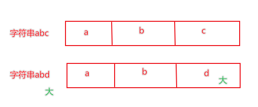
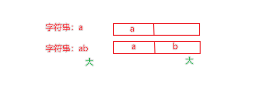
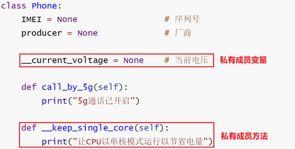
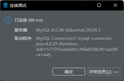
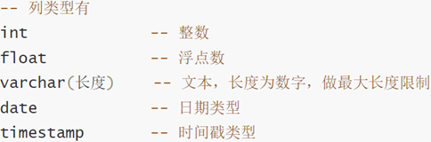
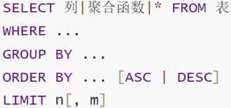

# day1

## 1、Python 软件（PyCharm）

安装：[在 Linux 环境下安装 Pycharm](https://blog.csdn.net/CNjcdyl/article/details/125158395)

插件：[汉化](https://blog.csdn.net/2301_76161259/article/details/135145727)、[翻译](https://blog.csdn.net/m0_57081622/article/details/127332289)

[设置字体大小](https://blog.csdn.net/jq_98/article/details/125266510)

常用快捷键：

- ctrl + alt + s ：打开软件设置
- ctrl + d ：复制当前行代码
- shift + alt + 上\下 ：将当前行代码上移或下移
- crtl + shift + f10 ：运行当前代码文件
- shift + f6 ：重命名文件
- ctrl + a ：全选
- ctrl + c\v\x ：复制、粘贴、剪切
- ctrl + f ：搜索


## 2、Python 流程：


# 正式开始：

## 1、字面量

字面量：在代码中，被写下来的固定的值，称之为字面量。

Python中常用的有6种值（数据）的类型：


字面量的输出程序：

```python
print(66)
print(13.14)
print("黑马程序员")
```


## 2、注释

注释：在程序代码中对程序代码进行解释说明的文字。

注释的分类

- 单行注释：以 # 开头，# 右边 的所有文字当作说明，而不是真正要执行的程序，起辅助说明作用。

	示例：

	```python
	# 写一个整数字面量
	```

	

- 多行注释：以 一对三个双引号 引起来（"""注释内容"""）来解释说明一段代码的作用使用方法.

	一般用于解释：整个PYTHON代码文件、类和方法

	示例：

	```python
	"""
	本代码演示了：
	- 各类字面量的写法
	- 通过 print 语句输出各类字面量
	"""
	```


示例程序：

```python
"""
本代码演示了：
- 各类字面量的写法
- 通过 print 语句输出各类字面量
"""

# 写一个整数字面量
666
# 写一个浮点数字面量
13.14
# 写一个字符串字面量
"黑马程序员"

# 通过 print 语句输出各类字面量
print(66)
print(13.14)
print("黑马程序员")
```


## 3、变量

变量：在程序运行时，能储存计算结果或能表示值的抽象概念。


示例：

```python
"""
本代码演示了：
- Python中变量的相关操作
"""

# 定义了一个变量，用来记录钱包余额
money = 50
# 通过 print 语句，输出变量记录的内容
print("钱包还有：", money)

# 买了一个冰淇淋，花费10元
money = money - 10
print("买了冰淇淋花费10元，还剩余：", money, "元")

# 假设，每隔一小时，输出一下钱包的余额
# ctrl+d 快速复制
print("现在是下午1点，钱包余额剩余:", money)
print("现在是下午2点，钱包余额剩余:", money)
print("现在是下午3点，钱包余额剩余:", money)
print("现在是下午4点，钱包余额剩余:", money)
```

==tips==：ctrl+d 快速复制


## 4、数据类型

我们可以通过 type() 语句来得到数据的类型

### type() 语句的使用方式


我们通过 type(变量) 可以输出类型，这==查看的是变量存储的数据的类型==。因为，变量无类型，但是它存储的数据有。

示例程序：

```python
# 方式1：使用 print 直接输出类型信息
print(type("heimachengxuyuan"))
print(type(666))
print(type(13.14))

# 方式2：使用变量存储 type() 语句的结果
string_type = type("heimachengxuyuan")
int_type = type(666)
float_type = type(13.14)
print(string_type)
print(int_type)
print(float_type)

# 方法3：使用 type() 语句，查看变量中存储的数据类型信息
name = "heimachengxuyuan"
name_type = type(name)
print(name_type)
```


### 字符串类型的三种定义方式


## 5、数据类型转换

==类型转换注意事项==

类型转换不是万能的，毕竟强扭的瓜不会甜，我们需要注意:

1. 任何类型，都可以通过str()，转换成字符串；
2. 字符串内必须真的是数字，才可以将字符串转换为数字；
3. 浮点数转为整数会丢失精度，向下丢失。

示例：

```python
# 将数字类型转换成字符串
num_str = str(11)
print(type(num_str), num_str)

float_str = str(11.345)
print(type(float_str), float_str)

# 将字符串转换成数字
num = int("11")
print(type(num), num)

num2 = float("11.345")
print(type(num2), num2)

# error
# num3 = int("heimachengxuyuan")
# print(type(num3), num3)

# 整数转浮点数
float_num = float(11)
print(type(float_num), float_num)

# 浮点数转整数
int_num = int(11.345)
print(type(int_num), int_num)
```


## 6、标识符

在 Python 程序中，我们可以给很多东西起名字，比如:

- 变量的名字
- 方法的名字
- 类的名字，等等

这些名字，我们把它统一的称之为标识符，用来做内容的标识。所以，标识符：是用户在编程的时候所使用的一系列名字，用于给变量、类、方法等命名。

### 标识符命名规则

Python中，标识符命名的规则主要有3类:

- 内容限定
- 大小写敏感
- 不可使用关键字

#### 标识符命名规则——内容限定

标识符命名中，只允许出现:

- 英文
- 中文
- 数字
- 下划线(_)

这四类元素。其余任何内容都不被允许。

==tips==：

1. 不推荐使用中文
2. 数字不可以用在开头


#### 标识符命名规则—大小写敏感

以定义变量为例：

Andy=“安迪1”；

andy=“安迪2”；

字母a的大写和小写，是完全能够区分的。


#### 标识符命名规则—不可使用关键字

Python 中有一系列单词，称之为关键字关键字；

在 Puthon 中都有特定用途，我们不可以使用它们作为标识符。


示例程序：

```python
# 规则1：内容限定，限定只能使用：中文、英文、数字、下划线，注意：不能以数字作为开头
# error
# 1_name = "张三"
# name_! = "张三"
name_ = "zhangsan"
_name = "zhangsan"
name_1 = "zhangsan"

# 规则2：大小写敏感
Itheima = "黑马"
itheima = "黑马"
print(Itheima)
print(itheima)

# 规则3：不可使用关键字
# error，错误的使用了关键字
# class = 1
# def = 1
Class = 1
Def = 1
```


### 变量命名规范

学完了标识符(变量、类、方法)的命名规则后，我们在来学习标识符的命名规范

- 变量名
- 类名
- 方法名

不同的标识符，有不同的规范。


我们目前只接触到了：变量。所以，目前学习:变量的命名规范。

- 见名知意
- 下划线命名法
- 英文字母全小写

#### 变量命名规范—见名知意

变量的命名要做到:

- 明了：尽量做到，看到名字，就知道是什么意思；
- 简洁：尽量在确保“明了”的前提下，减少名字的长度。


#### 变量命名规范—下划线命名法

多个单词组合变量名，要使用下划线做分隔。


#### 变量命名规范——英文字母全小写

命名变量中的英文字母，应全部小写。


## 7、运算符

### 算数（数学）运算符


示例：

```python
"""
演示Python的各类运算符
"""
# 算术（数学）运算符
print("1 + 1 = ", 1+1)
print("2 - 1 = ", 2-1)
print("3 * 3 = ", 3*3)
print("4 / 2 = ", 4/2)
print("11 // 2 = ", 11//2)
print("9 % 2 = ", 9%2)
print("2 ** 2 = ", 2**2)
```


### 赋值运算符


### 复合赋值运算符


示例程序：

```python
"""
演示Python的各类运算符
"""
# 算术（数学）运算符
print("1 + 1 = ", 1+1)
print("2 - 1 = ", 2-1)
print("3 * 3 = ", 3*3)
print("4 / 2 = ", 4/2)
print("11 // 2 = ", 11//2)
print("9 % 2 = ", 9%2)
print("2 ** 2 = ", 2**2)

# 赋值运算符
num = 1 + 2 + 3
# 复合复制运算符
# +=
num = 1
num += 1
print("num += 1:", num)

num -= 1
print("num -= 1:", num)

num *= 4
print("num *= 4:", num)

num /= 2
print("num /= 2:", num)

num = 3
num %= 2
print("num %= 2:", num)

num **= 2
print("num **= 2:", num)

num = 9
num //= 2
print("num //= 2:", num)
```


# day2

## 8、字符串的三种定义方式

### 字符串在Python中有多种定义形式

1. 单引号定义法：

	```python
	name = '黑马程序员'
	```

2. 双引号定义法：

	```python
	name = "黑马程序员"
	```

3. 三引号定义法：

	```python
	name = """黑马程序员"""
	```

三引号定义法，和多行注释的写法一样，同样支持换行操作。

**使用变量接收它，它就是字符串；**

**不使用变量接收它，就可以作为多行注释使用。**

```python
"""
演示字符串的三种定义方式：
- 单引号定义法
- 双引号定义法
- 三引号定义法
"""

# 单引号定义法
name = 'heima'
print(type(name))

# 双引号定义法
name = "heimachengxuyuan"
print(type(name))

# 三引号定义法，写法和多行注释是一样的
name = """
wo
shi
heima
"""
print(type(name))
```


### 字符串的引号嵌套

思考：如果我想要定义的字符串本身，是包含：单引号、双引号自身呢？如何写？

- 单引号定义法，可以内含双引号；
- 双引号定义法，可以内含单引号；
- 可以使用转移字符 \ 来将引号解除效用，变成普通字符串示例。

示例：

```python
# 在字符串内，包含双引号
name = '"heima"'
print(name)
# 在字符串内，包含单引号
name = "'chengxuyuan'"
print(name)
# 使用转义字符 \ 解除引号的作用
name = "\"heimachengxuyuan"
print(name)
name = '\'heima\''
print(name)
```


## 9、字符串的拼接

如果我们有两个字符串（文本）字面量，可以将其拼接成一个字符串，通过 + 号即可完成，如：

```python
print("学IT来黑马"+"月薪过万")
```

输出结果：学IT来黑马月薪过万

不过一般，单纯的2个字符串字面量进行拼接显得很呆，一般，==字面量和变量或变量和变量之间会使用拼接==，如：

```python
name ="黑马程序员"
print("我的名字是:"+ name +"，我可以教大家IT技能")
```

输出结果：我的名字是：黑马程序员，我可以教大家IT技能。

示例：

```python
# 字符串字面量之间的拼接
print("hello " + "world")

# 字符串字面量和字符串变量的拼接
name = "hello world"
address = "111111"
tel = 4008208820
print(name + address)
# error: can only concatenate str (not "int") to str
# print(name + address + tel)
```


## 10、字符串格式化

我们会发现，这个拼接字符串也不好用啊，==变量过多==，拼接起来实在是太麻烦了，==字符串无法和数字或其它类型完成拼接==。

我们可以通过如下语法，完成字符串和变量的快速拼接。

```python
name ="黑马程序员"
message ="学IT就来:%s" % name
print(message)
```

其中的，%s 中 % 表示：我要占位，s 表示：将==变量变成字符串==放入占位的地方，所以，综合起来的意思就是：我先占个位置，等一会有个变量过来，我把它变成字符串放到占位的位置。

那，数字类型呢?可以不可以占位?

那必须可以，我们来尝试如下代码:

```python
class_num = 57
avg_salary = 16781
message ="Python大数据学科，北京%s期，毕业平均工资:%s" %(class_num，avg_salary)
print(message)
```

输出结果：Python大数据学科，北京57期，毕业平均工资：16781

==tips==：

1. 多个变量占位
2. 变量要用括号括起来
3. 并按照占位的顺序填入


Python中，其实支持非常多的数据类型占位：


示例程序：

```python
# 通过占位的形式，完成拼接
name = "heima"
message = "hello: %s" % name
print(message)

# 通过占位的形式，完成数字和字符串的拼接
class_num = 57
avg_salary = 16781
message = "Python大数据学科，北京 %s 期，毕业平均工资: %s " % (class_num, avg_salary)
print(message)

name = "传智伯克"
setup_year = 1990
stock_price = 99.90
message = "%s, 成立于：%d, 今天的股价是：%f" % (name, setup_year, stock_price)
print(message)
```

输出：

```python
hello: heima
Python大数据学科，北京 57 期，毕业平均工资: 16781 
传智伯克, 成立于：1990, 今天的股价是：99.900000
```


## 11、格式化的精度控制

我们可以使用辅助符号"m.n"来控制数据的宽度和精度

- m，控制宽度，要求是数字(==很少使用==)，==设置的宽度小于数字自身，不生效==
- .n，控制小数点精度，要求是数字，会进行小数的四舍五入

==tips==：格式化字符串时的宽度限制（如 %5d 或 %5.3f）是指整个字段的宽度，包括数字、小数点和任何其他字符。

%5d：表示将整数的宽度控制在5位，如数字11，被设置为5d，就会变成：\[空格\]\[空格\]\[空格]11，用三个空格补足宽度。 

%5.2f：表示将宽度控制为5，将小数点精度设置为2 小数点和小数部分也算入宽度计算。如，对11.345设置了%7.2f后，结果是：\[空格\]\[空格\]11.35。2个空格补足宽度小数部分限制 2 位精度后，四舍五入为 .35

%.2f：表示不限制宽度，只设置小数点精度为2，如 11.345 设置 %.2f 后，结果是11.35

示例：

```python
num1 = 11
num2 = 11.345
print("数字11宽度限制为5，结果是：%5d " % num1)
print("数字11宽度限制为1，结果是：%1d " % num1)
print("数字11.345宽度限制为7，小数精度2，结果是：%7.2f " % num2)
print("数字11.345宽度限制为7，小数精度2，结果是：%.2f " % num2)
```

输出结果：

```python
数字11宽度限制为5，结果是：   11 
数字11宽度限制为1，结果是：11 
数字11.345宽度限制为7，小数精度2，结果是：  11.35 
数字11.345宽度限制为7，小数精度2，结果是：11.35 
```


## 12、字符串格式化的方式2

字符串格式化快速写法：

通过语法：`f"内容{变量}"` 的格式来快速格式化。

==tips==:

1. 这种写法不做精度控制
2. 也不理会类型
3. 适用于快速格式化字符串

示例：

```python
"""
演示第二种字符串格式化的方式：f"{占位}"
"""
name = "传智伯克"
setup_year = 1990
stock_price = 99.90
print(f"我是{name}，我成立于：{setup_year}年，我今天的股价是：{stock_price}")
```

输出结果：

```python
我是传智伯克，我成立于：1990年，我今天的股价是：99.9
```


## 13、对表达式进行格式化

表达式就是一个具有明确结果的代码语句，如1+1、type(“字符串”)、3*5等在变量定义的时候，如 age=11+11，等号右侧的就是表达式，也就是有具体的结果，将结果赋值给了等号左侧的变量。

如何格式化表达式?

1、`f"{表达式}"`

2、`"%s \ %d \ %f" % (表达式、表达式、表达式)`

在无需使用变量进行数据存储的时候，可以直接格式化表达式。

示例：

```python
"""
演示对表达式进行字符串格式化
"""
print("1*1 的结果是：%d" % (1*1))
print(f"1*2 的结果是：{1*2}")
print("字符串在 Python 中的类型名是：%s" % type("字符串"))
```

输出结果：

```python
1*1 的结果是：1
1*2 的结果是：2
字符串在 Python 中的类型名是：<class 'str'>
```


## 14、字符串格式化的课后练习题


示例程序：

```python
name = "chuanzhiboke"
stock_price = 19.99
stock_code = "003032"
stock_price_growth_factor = 1.2
growth_days = 7
print(f"公司：{name}，股票代码：{stock_code}，当前股价：{stock_price}")
print("每日增长系数：%2.1f, 经过 %d 天的增长,股价达到了：%5.2f" % (stock_price_growth_factor, growth_days, stock_price*(1.2**7)))
```


## 15、数据输入（ input 语句）

### input 语句（函数）

在Python中，print语句(函数)，可以完成将内容（字面量、变量等）输出到屏幕上，与之对应的还有一个input语句，用来获取键盘输入。

- 数据输出：print
- 数据输入：input

使用上也非常简单：

- 使用 input() 语句可以从键盘获取输入；
- 使用一个变量接收(存储) input 语句获取的键盘输入数据即可。

示例：

```python
"""
演示 python 中的input语句
获取键盘的输入信息
"""
print("请告诉我你是谁？")
name = input()
print("我知道了，你是: %s" % name)
```

输出结果：（绿色的为输入内容）


input()语句其实是可以在要求使用者输入内容前，输出提示内容的，方式如下:

```python
name = input("请告诉我你是谁？")
print("我知道了，你是: %s" % name)
```

输出结果：(绿色的为输入内容)


### input语句获取的数据类型

如果我们输入数字类型或其它类型，结果会如何?

可以看到，无论键盘输入何种类型的数据==最终的结果都是：字符串类型的数据==，如果需要==转换成其他类型，需要进行强制类型转换==。

示例程序：

```python
# 输入数字类型
num = input("请告诉我你的银行卡密码：")
print(type(num))
# 数据类型转换
num = int(num)
print("你的银行卡密码的类型是: ", type(num))
```

输出结果：


## 16、布尔类型和比较运算符

布尔类型的字面量：

- True 表示真(是、肯定)
- False 表示假(否、否定)

定义变量存储布尔类型数据：变量名称 = 布尔类型字面量

布尔类型不仅可以==自行定义==，同时也可以通过计算的来（也就是==使用比较运算符进行比较运算得到布尔类型的结果==。）

比较运算符：


示例：

```python
"""
演示布尔类型的定义
以及比较运算符的应用
"""
# 定义变量存储布尔类型的数据
bool_1 = True
bool_2 = False
print(f"bool_1变量的内容是:{bool_1}，类型是：{type(bool_1)}")
print(f"bool_2变量的内容是:{bool_2}，类型是：{type(bool_2)}")

# 比较运算符的使用
# ==, !=, >, <, >=, <=
# 演示进行内容的相等比较
num1 = 10
num2 = 10
print(f"10 == 10的结果是：{num1 == num2}")

num1 = 10
num2 = 15
print(f"10 != 15的结果是：{num1 != num2}")

name1 = "itcast"
name2 = "itheima"
print(f"itcast == itheima的结果是：{name1 != name2}")

# 演示大于小于，大于等于，小于等于的比较运算
num1 = 10
num2 = 5
print(f"10 > 5 的结果是：{num1 > num2}")
print(f"10 < 5 的结果是：{num1 < num2}")

num1 = 10
num2 = 11
print(f"10 >= 11的结果是：{num1 >= num2}")
print(f"10 <= 11的结果是：{num1 <= num2}")

# 数字 1 与字符串 '1' 进行比较
print(f"1 == '1'的结果是：{1 == '1'}")
```

输出结果：


## 17、if 语句的基本格式

程序中的判断

```python
if 要判断的条件:
	条件成立时，要做的事情
```

判断语句的==结果==，==必须是布尔类型True或False==

- True会执行if内的代码语句
- False则不会执行

if 语句的==注意事项==：

- 判断条件的结果一定要是布尔类型
- 不要忘记判断条件后的： 引号
- 归属于if语句的代码块，需在前方填充4个空格缩进

示例程序：

```python
"""
演示 python 判断语句：if语句的基本格式应用
"""
age = 30
if age >= 18:
    print("我已经成年了")
    print("即将步入成年生活")
print("时间过的真快阿")

age = 10
if age >= 18:
    print("我已经成年了")
    print("即将步入成年生活")
print("时间过的真快阿")
```

输出结果：


# day3

## 18、成年人判断练习


程序：

```python
print("欢迎来到游乐园")
age = int(input("请输入你的年龄："))
if age >= 18:
    print("您已成年，游玩需要补票10元")
print("祝您游玩愉快！")
```


## 19、if else 组合判断语句

基本语法格式：


==if else注意事项==：

1. else后，不需要判断条件；
2. 和 if 的代码块一样，else的代码块同样需要4个空格作为缩进。

示例程序：

```python
"""
演示 Python 中
if else 的组合判断语句
"""
age = int(input("请输入你的年龄："))
if age >= 18:
    print("您已成年，需要补票10元。")
else:
    print("您未成年，可以免费游玩。")
```


## 20、我要买票吗练习


示例程序：

```python
print("欢迎来到黑马动物园")
height = int(input("请输入你的身高(cm)："))
if height >= 120:
    print("您的身高超过120cm，游玩需要补票10元")
else:
    print("您的身高未超过120cm，可以免费游玩")
print("祝您游玩愉快。")
```


## 21、if elif else 组合使用

基本语法格式：


示例：


判断是互斥且有顺序的。

- 满足1(如图编号)将不会理会2和3；
- 满足2，将不会理会3；
- 1、2、3均不满足，进入else；
- else也可以省略不写，效果等同3个独立的if判断。

示例程序：

```python
"""
演示 if elif else 多条件判断语句的使用
"""
height = int(input("请输入你的身高(cm): "))
vip_level = int(input("请输入你的VIP等级(1-5): "))
day = int(input("请告诉我今天几号："))

# 通过 if 判断，可以使用多条件判断的语法
# 第一个条件就是 if
if height < 120:
    print("身高小于120cm，可以免费。")
elif vip_level > 3:
    print("vip级别大于3，可以免费。")
elif day == 1:
    print("今天是1号免费日，可以免费。")
else:
    print("不好意思，需要购票10元。")
print("祝您游玩愉快。")
```

输出结果：（需要统一输入所有数据，才可最终输出结果）


节省代码量的写法：

```python
# 通过 if 判断，可以使用多条件判断的语法
# 第一个条件就是 if
if int(input("请输入你的身高(cm): ")) < 120:
    print("身高小于120cm，可以免费。")
elif int(input("请输入你的VIP等级(1-5): ")) > 3:
    print("vip级别大于3，可以免费。")
elif int(input("请告诉我今天几号：")) == 1:
    print("今天是1号免费日，可以免费。")
else:
    print("不好意思，需要购票10元。")
print("祝您游玩愉快。")
```

输出结果：（一个条件满足，立即输出）


## 22、猜猜心里数字案例

对比两种写法，注意更简洁写法的整洁性

法1：

```python
num = int(input("请输入第一次猜想的数字： "))
if num == 10:
    print("猜对辣")
else:
    num_1 = int(input("不对，再猜一次： "))
    if num_1 == 10:
        print("猜对辣")
    else:
        num_2 = int(input("不对，再猜最后一次： "))
        if num_2 == 10:
            print("猜对辣")
        else:
            print("Sorry,全部猜错拉，我想的是：10")
```

法2：

```python
num = int(input("请输入第一次猜想的数字： "))
if int(input("请输入第一次猜想的数字： ")) == 10:
    print("恭喜第一次猜对辣")
elif int(input("不对，再猜一次： ")) == 10:
    print("猜对辣")
elif int(input("不对，再猜最后一次： ")) == 10:
    print("猜对辣")
else:
    print("Sorry,全部猜错拉，我想的是：10")
```


## 23、判断语句的嵌套

基础语法格式如下：


==嵌套的关键点，在于：空格缩进==

==通过空格缩进，来决定语句之间的：层次关系==

### 简单嵌套


如图：

- 判断有2层；
- 当外层 if 满足条件（图中编号1）时，才会执行内层if判断（图中编号2）；
- 当外层 if（编号1）不满足，直接执行外层 else 。


### 自由组合嵌套

自由组合嵌套，需求如下：

公司要发礼物，条件是：

1. 必须是大于等于18岁小于30岁的成年人

2. 同时入职时间需满足大于两年，或者级别大于3才可领取

示例：

```python
age = 20
year = 3
level = 1
if age >= 18:
    print("你是成年人")
    if age < 30:
        print("你的年龄达标了")
        if year > 2:
            print("恭喜你，年龄和入职时间都达标，可以领取礼物")
        elif level > 3:
            print("恭喜你，年龄和级别达标，可以领取礼物")
        else:
            print("不好意思，尽管年龄达标，但是入职时间和级别都不达标。")
    else:
        print("不好意思，年龄太大了。")
else:
    print("不好意思，小朋友不可以领取")
```


## 24、判断语句综合案例

案例需求:

定义一个数字（1~10，随机产生），通过3次判断来猜出来数字

案例要求:

1. 数字随机产生，范围1-10

2. 有3次机会猜测数字，通过3层嵌套判断实现

3. 每次猜不中，会提示大了或小了

示例程序：

```python
"""
演示判断语句的实战案例：终极猜数字
"""

# 1.构建一个随机的数字变量
import random
num = random.randint(1,10)
guess_num = int(input("输入你要猜测的数字："))

# 2.通过 if 判断语句进行数字的猜测
if guess_num == num:
    print("恭喜，第一次就猜中了。")
else:
    if guess_num > num:
        print("你猜的数字大了。")
    else:
        print("你猜的数字小了。")

    guess_num = int(input("输入你要猜测的数字："))
    if guess_num == num:
        print("恭喜，第二次猜中了。")
    else:
        if guess_num > num:
            print("你猜的数字大了。")
        else:
            print("你猜的数字小了。")

    guess_num = int(input("输入你要猜测的数字："))
    if guess_num == num:
        print("第三次猜中了。")
    else:
        print("三次机会用完了，没有猜中。")
```


## 25、while 循环的基础使用

基本语法格式：


示例程序：

```python
"""
演示 while 循环的基础应用
"""
i = 0
while i < 100:
    print("hello world")
    i += 1
```

==while循环的注意事项==：

1. 条件需提供布尔类型结果，True继续，False停止；
2. 空格缩进不能忘；
3. 请规划好循环终止条件，否则将无限循环。


## 26、求1-100的和练习

需求：通过while循环，计算从1累加到100的和：

```python
i = 1
sum = 0
while i <= 100:
    sum += i
    i += 1
print(f"sum = {sum}")
```


## 27、while 循环猜数字

设置一个范围1-100的随机整数变量，通过while循环，配合input语句，判断输入的数字是否等于随机数：

- 无限次机会，直到猜中为止
- 每一次猜不中，会提示大了或小了
- 猜完数字后，提示猜了几次

```python
import random
num = random.randint(1, 100)
count = 1
guess_num = int(input("请输入要猜测的数字: "))
while guess_num != num:
    if guess_num > num:
        print("输入的数大了")
    elif guess_num < num:
        print("输入的数小了")
    count += 1
    guess_num = int(input("请重新输入要猜测的数字: "))
print(f"一共猜了 {count} 次")
```


# day4

## 28、while 循环的嵌套应用

基本语法格式：


**注意事项**：

1. 同判断语句的嵌套一样，循环语句的嵌套，要注意空格缩进。
2. 基于空格缩进来决定层次关系
3. 注意条件的设置，避免出现无限循环（除非真的需要无限循环）

示例程序：

```python
"""
演示 while 循环的嵌套使用
"""

# 外层：表白 100 天的控制
# 内层：每天的表白都送 10 只玫瑰花的控制

i = 1
while i <= 100:
    print(f"今天是第 {i} 天，准备表白......")

    # 内层循环的控制变量
    j = 1
    while j <= 10:
        print(f"送给小美第 {j} 只玫瑰花")
        j += 1
    print("小美，我喜欢你")
    i += 1

print(f"坚持到第 {i-1} 天，表白成功。")
```


## 29、while 循环案例 — 九九乘法表

### 补充知识

1. print 输出不换行

	```python
	print("hello", end='')
	print("hello", end='')
	```

	

2. 制表符 `\t`

	```python
	print("hello\tworld")
	print("itheima\tbest")
	```


### 示例：九九乘法表

```python
i = 1
while i <= 9:
    j = 1
    while j <= i:
        print(f"{i}*{j}={i*j}\t", end='')
        j += 1
    print()
    i += 1
```

输出结果：


## 30、for 循环基本语法

### while 和 for 循环对比

- while循环的循环条件是自定义的，自行控制循环条件
- for循环是一种”轮询”机制，是对一批内容进行”逐个处理”

### for 循环


基本语法格式：


从待处理数据集中：逐个取出数据，赋值给临时变量。

### 示例

```python
"""
演示 for 循环的基础语法
"""
name = "itheima"
for x in name:
    # 将 name 的内容，挨个取出赋予 x 临时变量
    # 就可以在循环体内对 x 进行处理
    print(x)
```

for循环是将字符串的内容：**依次取出**，所以，for循环也被称之为：**遍历循环**

理论上讲，Python的for循环无法构建无限循环（**被处理的数据集不可能无限大**）


### 注意点

for循环的注意点：

- 无法定义循环条件，只能被动取出数据处理；
- 要注意，循环内的语句，需要有空格缩进。


## 31、for 循环案例—数一数有几个a


```python
name = "itheima is a brand of itcast"
count = 0
for x in name:
    if(x == 'a'):
        count += 1
print(f"itheima is a brand of itcast 中共含有：{count}个字母a")
```


## 32、range 语句


语法中的：待处理数据集，严格来说，称之为：**可迭代类型**

可迭代类型指，**其内容可以一个个依次取出的一种类型**，包括：字符串、列表、元组等。

其中，**可迭代类型可以是 range**。

1、语法1：`range(num)`

获取一个从0开始，到num结束的数字序列（不含num本身），如range(5)取得的数据是：[0, 1, 2, 3, 4]；

2、语法2：`range(num1, num2)`

获得一个从num1开始，到num2结束的数字序列(不含num2本身)，如：range(5, 10) 取得的数据是：[5, 6, 7, 8, 9]；

3、语法3：`range(num1, num2, step)`

获得一个从 num1 开始，到 num2 结束的数字序列（不含 num2 本身），数字之间的步长，以 step 为准（ step 默认为1），如，range(5, 10, 2)取得的数据是：[5, 7, 9]。

示例：

```python
"""
演示 Python 中的 range() 语句的基本使用
"""

# range 语法1：range(num)
for x in range(10):
    print(x)

# range 语法2：range(num1, num2)
for x in range(5, 10):
    # 从 5 开始，到 10 结束(不包含 10 本身)的一个数字序列
    print(x)

# range 语法3：range(num1, num2, step)
for x in range(5, 10, 2):
    # 从 5 开始，到 10 结束（不包含10本身）的一个数字序列，数字之间的间隔是2
    print(x)
```

练习：


示例程序：

```python
count = 0
num = int(input("请输入一个数:"))
for x in range(1, num):
    if(x % 2 == 0):
        count += 1
print(f"1到{num}范围内，共有{count}个偶数")
```


## 33、for 循环临时变量作用域

如果在 for 循环外部访问临时变量：

- 实际上是可以访问到的；
- 在编程规范上，是不允许、不建议这么做的。

如果**实在需要**在循环外**访问循环内的临时变量**，可以**在循环外预先定义**。


## 34、for 循环的嵌套使用

基本语法格式：


示例：

```python
"""
演示 for 循环的嵌套使用
"""
# 坚持表白 100 天，每天都送 10 朵花
for i in range(1, 101):
    print(f"今天是向小美表白的第{i}天，加油坚持。")
    # 内层循环
    for j in range(1, 11):
        print(f"给小美送的第{j}朵玫瑰花")
    print("小美我喜欢你")
print(f"第{i}天，表白成功")
```


## 35、for 循环打印九九乘法表

```python
for i in range(1, 10):
    for j in range(1, i+1):
        print(f"{i}*{j}={i*j}\t", end='')
    print()
```


## 36、continue 和 break

### continue

continue关键字用于：**中断本次循环，直接进入下一次循环**

continue可以用于：  for循环和while循环，效果一致

```python
# 演示循环中断语句 continue
for i in range(1, 6):
    print("语句1")
    continue
    print("语句2")
```

continue在循环中的嵌套使用

```python
# 演示 continue 的嵌套应用
for i in range(1, 6):
    print("语句1")
    for j in range(1, 6):
        print("语句2")
        continue
        print("语句3")
    print("语句4")
```


### break

break 关键字同样只可以控制：它所在的循环**永久中断**。

```python
# 演示循环中断语句 break
for i in range(1, 101):
    print("语句1")
    break
    print("语句2")
print("语句3")
```

break 在循环中的嵌套使用

```python
# 演示 break 的嵌套应用
for i in range(1, 6):
    print("语句1")
    for j in range(1, 6):
        print("语句2")
        break
        print("语句3")

    print("语句4")
```


## 37、循环综合案例：发工资


示例：

```python
import random
num = random.randint(1, 10)
sum = 10000
for i in range(1, 21):
    salary = 1000;
    num = random.randint(1, 10)
    if(num < 5):
        print(f"员工{i}，绩效分{num}，低于5，不发工资，下一位")
        continue
    if sum >= 1000:
        sum -= 1000
        print(f"员工{i}发放工资1000元，公司账户余额：{sum}")
    else:
        print(f"余额不足，当前余额：{sum}元，不足以发工资，下个月再来")
        break
```


# day5

## 38、函数的初体验

函数：是组织好的，**可重复使用的**，用来实现特定功能的代码段。

统计字符串的长度，不使用内置函数 len()，常规方法和函数两种方法对比：

常规方法：

```python
# 需求，统计字符串的长度，不使用内置函数 len()
str1 = "itheima"
str2 = "itcast"
str3 = "python"

# 定义一个计数变量
count = 0
for i in str1:
    count += 1
print(f"字符串{str1}的长度是:{count}")

count = 0
for i in str2:
    count += 1
print(f"字符串{str2}的长度是:{count}")

count = 0
for i in str3:
    count += 1
print(f"字符串{str3}的长度是:{count}")
```

使用函数：

```python
# 可以使用函数，来优化过程
def my_len(data):
    count = 0
    for i in data:
        count += 1
    print(f"字符串{data}的长度是{count}")

my_len(str1)
my_len(str2)
my_len(str3)
```


使用函数的好处是：

1. 将功能封装在函数内，可供随时随地重复利用；
2. 提高代码的复用性，减少重复代码，提高开发效率


## 39、函数的基础定义语法

### 函数的定义

基本语法格式：


### 函数的调用

调用格式：

```python
函数名(参数)
```


### 注意事项

1. 参数如不需要，可以省略（后续章节讲解）
2. 返回值如不需要，可以省略（后续章节讲解）
3. 函数必须先定义后使用


示例：

```python
"""
演示函数的定义语法
"""

# 定义一个函数，输出相关信息
def say_hi():
    print("Hi, hello world")

# 调用函数，让定义的函数开始工作
say_hi()
```


## 40、函数的基础定义案例练习


示例：

```python
def welcome():
    print("欢迎来到黑马程序员！")
    print("请出示你的核酸码")

welcome()
```


## 41、函数的传入参数

传入参数的功能是：在函数进行计算的时候，接受外部（调用时）提供的数据

基于函数的定义语法：


示例：

```python
"""
演示函数使用参数
"""

# 定义 2 数向家的函数，通过参数接收被计算的 2 个数字
def add(x, y):
    result = x + y
    print(f"{x} + {y}的计算结果是：{result}")
    
# 调用函数，传入被计算的 2 个数字
add(5, 6)
```


函数定义中，提供的 x 和 y，称之为：形式参数（形参），表示函数声明将要使用2个参数；

**参数之间使用逗号进行分隔**；

函数调用中，提供的5和6，称之为：实际参数（实参），表示函数执行时真正使用的参数值；

**传入的时候，按照顺序传入数据，使用逗号分隔**。


## 42、函数的传入参数案例练习——升级版自动查验核酸


```python
def check(temper):
    if temper <= 37.5:
        print(f"温度为{temper}，请进.")
    else:
        print(f"温度为{temper}，请隔离.")

check(33.6)
```


## 43、函数的返回值定义语法

​    所谓“返回值”，就是程序中函数完成事情后，最后**给调用者的结果**。

基本语法格式如下：


示例：

```python
"""
演示：定义函数返回值的语法格式
"""

# 定义一个函数，完成 2 数相加功能
def add(a, b):
    result = a + b
    # 通过返回值，将相加的结果返回给调用者
    return result

# 函数的返回值，可以通过变量去接收
r = add(5, 6)
print(r)
```

==tips==:

函数体在遇到return后就结束了，所以**写在return后的代码不会执行**。


## 44、函数返回值之None类型

Python中有一个特殊的字面量：None，其类型是：<class 'NoneType'>。

无返回值的函数，实际上就是返回了：None这个字面量。

None 表示：空的、无实际意义的意思；函数返回的 None，就表示这个函数没有返回什么有意义的内容；也就是返回了空的意思。

**None类型的应用场景**

None作为一个特殊的字面量，用于表示：空、无意义，其有非常多的应用场景。

1. 用在函数无返回值上

2. 用在 if 判断上

	- 在 if 判断中，None等同于False；
	- 一般用于在函数中主动返回 None，配合 if 判断做相关处理。

3. 用于声明无内容的变量上

	定义变量，但暂时不需要变量有具体值，可以用 **None** 来代替。

示例：

```python
"""
演示特殊字面量：None
"""

# 无 return 语句的函数返回值
def say_hi():
    print("你好呀")

result = say_hi()
print(f"无返回值函数，返回的内容是:{result}")
print(f"无返回值函数，返回的内容是:{type(result)}")

# 主动返回 None 的函数
def say_hi2():
    print("你好呀")

result = say_hi2()
print(f"无返回值函数，返回的内容是:{result}")
print(f"无返回值函数，返回的内容是:{type(result)}")

# None 用于 if 判断
def check_age(age):
    if age > 18:
        return "SUCCESS"
    else:
        return None

result = check_age(16)
if not result:
    # 进入 if 表示 result 是 None 值，也就是 False
    print("未成年，不可进入")

# None 用于声明无初始内容的变量
name = None
```


## 45、函数的说明文档

函数是纯代码语言，想要理解其含义，就需要一行行的去阅读理解代码，效率比较低。

我们可以给函数添加说明文档，辅助理解函数的作用。

语法如下：

```python
def add(x, y):
    """
    add 函数可以接受 2 个参数，进行 2 数相加的功能
    :param x: 相加的数字 1
    :param y: 相加的数字 2
    :return: 返回相加的结果
    """
    result = x + y
    print(f"2 数相加的结果是:{result}")
    return result
```

==tips==：pycharm 软件输入`""""""`，在第三个双引号后面回车，会自动补全参数注释格式。


在PyCharm编写代码时，可以通过鼠标悬停，查看调用函数的说明文档。


## 46、函数的嵌套调用

所谓函数嵌套调用指的是==一个函数里面又调用了另外一个函数==。

示例：

```python
"""
演示嵌套调用函数
"""

# 定义函数 func_b
def func_b():
    print("---2---")

# 定义函数 func_a，并在内部调用 func_b
def func_a():
    print("---1---")

    # 嵌套调用 func_b
    func_b()

    print("---3---")

# 调用函数 func_a
func_a()
```

如果函数A中，调用了另外一个函数B，那么先**把函数B中的任务都执行完毕之后才会回到上次 函数A执行的位置**


## 47、变量在函数中的作用域

变量作用域指的是变量的作用范围（变量在哪里可用，在哪里不可用）

主要分为两类：局部变量和全局变量；


1、所谓局部变量是定义在函数体内部的变量，即只在函数体内部生效

```python
# 演示局部变量
def Test_a():
    num = 100
    print(num)

Test_a()
# error: print(num)
# NameError: name 'num' is not defined
print(num)
```


变量a是定义在`testA`函数内部的变量，在函数外部访问则立即报错。

局部变量的作用：在函数体内部，临时保存数据，即当函数调用完成后，则销毁局部变量。


2、所谓全局变量，指的是在函数体内、外都能生效的变量

```python
# 演示全局变量
num = 200
def Test_a():
    print(f"test_a:{num}")

def Test_b():
    print(f"Test_b:{num}")

Test_a()
Test_b()
print(num)
```


3、函数体内修改局部变量，函数外却不能更新该变量

```python
# 在函数内修改全局变量
num = 200
def Test_a():
    print(f"test_a:{num}")

def Test_b():
    num = 500     # 局部变量
    print(f"Test_b:{num}")

Test_a()
Test_b()
print(num)
```


4、使用 global关键字 可以在函数内部声明变量为全局变量, 如下所示：

示例：

```python
# global关键字，在函数内声明变量为全局变量
num = 200
def Test_a():
    print(f"test_a:{num}")

def Test_b():
    global num      # 设置内部定义的变量为全局变量
    num = 500       # 局部变量
    print(f"Test_b:{num}")

Test_a()
Test_b()
print(num)
```


# day6

## 48、函数综合案例


示例：

```python
money = 5000000
name = input("请输入名称: ")

def check_balance():
    print("--------查询余额--------")
    print(f"{name}，你好，您的余额剩余: {money}元")

def deposit(m_money):
    print("-------- 存款 --------")
    global money
    money += m_money
    print(f"{name}，你好，您存款{m_money}元成功")
    print(f"{name}，你好，您的余额剩余: {money}元")

def withdraw(m_money):
    print("-------- 取款 --------")
    global money
    money -= m_money
    print(f"{name}，你好，您取款{m_money}元成功")
    print(f"{name}，你好，您的余额剩余: {money}元")

while name == "zhoujielun":
    print("--------主 菜单--------")
    print("查询余额 【输入1】")
    print("存款    【输入2】")
    print("取款    【输入3】")
    print("退出    【输入4】")
    choice = int(input("请输入你的选择: "))
    num = 0
    if(choice == 1):
        check_balance()
    elif(choice == 2):
        num = int(input("请输入存款的金额："))
        deposit(num)
    elif(choice == 3):
        num = int(input("请输入取款的金额："))
        withdraw(num)
    elif(choice == 4):
        break
    else:
        print("输入错误，请重新输入！")
        continue
```


## 49、数据容器入门

**学习数据容器，就是为了批量存储或批量使用多份数据**

Python中的数据容器：一种可以容纳多份数据的数据类型，容纳的每一份数据称之为1个元素。

每一个元素，可以是任意类型的数据，如字符串、数字、布尔等。

数据容器根据特点的不同，如：

- 是否支持重复元素
- 是否可以修改
- 是否有序，等

分为5类，分别是：

列表（list）、元组（tuple）、字符串（str）、集合（set）、字典（dict）


## 50、列表的定义语法

基本语法格式：


列表内的==每一个数据，称之为元素==

- 以 [] 作为标识
- 列表内每一个元素之间用, 逗号隔开


示例：

```python
"""
演示 数据容器之： list 列表
语法：[元素，元素，......]
"""

# 定义一个列表 list
my_list = ["itheima", "itcast", "python"]
print(my_list)
print(type(my_list))

my_list = ["itheima", 666, True]
print(my_list)
print(type(my_list))

# 定义一个嵌套的列表
my_list = [[1, 2, 3], [4, 5, 6]]
print(my_list)
print(type(my_list))
```

==tips==：注列表可以一次存储多个数据，且**可以为不同的数据类型**，支持嵌套


## 51、列表的下标索引

### 1、列表的下标（索引）


如图，列表中的每一个元素，都有其位置下标索引，从前向后的方向，从 0 开始，依次递增，我们只需要按照下标索引，即可取得对应位置的元素。


### 2、列表的下标（索引）— 反向

也可以反向索引，也就是从后向前：从-1开始，依次递减（-1、-2、-3......）


如图，从后向前，下标索引为：-1、-2、-3，依次递减。


### 3、嵌套列表的下标（索引）

如果列表是嵌套的列表，同样支持下标索引：


如图，下标就有2个层级了。


示例：

```python
# 通过下标索引取出对应位置的数据
my_list = ["Tom", "Lily", "Rose"]
# 列表[下标索引]，从前向后从0开始，每次+1，从后向前从-1开始，每次-1
print(my_list[0])
print(my_list[1])
print(my_list[2])
# 错误示范：通过下标索引数据，一定不要超出范围
# print(my_list[3])

# 通过下标索引取出数据（倒序输出）
print(my_list[-1])
print(my_list[-2])
print(my_list[-3])

# 取出嵌套列表的元素
my_list = [[1, 2, 3], [4, 5, 6]]
print(my_list[1][1])
```


==tips==：要注意下标索引的取值范围，超出范围无法取出元素，并且会报错


## 52、列表的常用操作方法

### 1、列表的查询功能

查找某元素的下标：

功能：查找指定元素在列表的下标，如果找不到，报错ValueError

语法：列表.index(元素)

index就是列表对象（变量）内置的方法（函数）

```python
mylist = ["itcast", "itheima", "python"]

# 1.1 查找某元素在列表内的下标索引
index = mylist.index("itheima")
print(f"itheima 在列表中的下标索引值是：{index}")

# # 1.2 如果被查找的元素不存在，会报错
# index = my_list.index("hello")
# print(f"hello 在列表中的下标索引值是：{index}")
```


### 2、列表的修改功能（方法）

#### 1、修改特定位置（索引）的元素值：

语法：列表[下标] = 值

可以使用如上语法，直接对指定下标（正向、反向下标均可）的值进行：重新赋值（修改）

```python
# 2. 修改特定位置（索引）的元素值
mylist[0] = "传智教育"
print(f"列表被修改元素之后，结果是：{mylist}")
```


#### 2、插入元素

语法：列表.insert(下标, 元素)，在指定的下标位置，插入指定的元素

```python
# 3. 在指定下标位置插入新元素
mylist.insert(1, "best")
print(f"列表插入元素后，结果是：{mylist}")
```


#### 3、追加元素

##### append

语法：列表.append(元素)，将指定元素，追加到列表的尾部

```python
# 4. 在列表尾部追加单个新元素
mylist.append("黑马程序员")
print(f"列表在追加了元素后，结果是：{mylist}")
```


##### extend

语法：列表.extend(其它数据容器)，将其它数据容器的内容取出，依次追加到列表尾部

```python
# 5. 在列表尾部追加 一批 新元素
mylist2 = [1, 2, 3]
mylist.extend(mylist2)
print(f"列表在追加了一个新的列表后，结果是：{mylist}")
```


#### 4、删除元素

##### del

语法： del 列表[下标]

```python
# 6. 删除指定下标索引的元素（2种方式）
mylist = ["itcast", "itheima", "python"]

# 6.1 方式1：del 列表[下标]
del mylist[2]
print(f"列表删除元素后，结果是：{mylist}")
```


##### pop

   语法：列表.pop(下标)

```python
# 6.2 方式2：列表.pop(下标)，可以得到被删除元素的值
mylist = ["itcast", "itheima", "python"]
element = mylist.pop(2)
print(f"通过pop方法取出元素后，列表内容：{mylist}，取出的元素是：{element}")
```


##### remove

语法：删除某元素在列表中的第一个匹配项

```python
# 7. 删除某元素在列表中的第一个匹配项
mylist = ["itcast", "itheima", "itcast", "itheima", "python"]
mylist.remove("itheima")
print(f"通过remove方法移除元素后，列表内容：{mylist}")
```


##### clear

清空列表内容，语法：列表.clear()

```python
# 8. 清空列表
mylist.clear()
print(f"列表被清空了,结果是:{mylist}")
```


##### count

统计某元素在列表内的数量，语法：列表.count(元素)

```python
# 9. 统计列表内某元素的数量
mylist = ["itcast", "itheima", "itcast", "itheima", "python"]
count = mylist.count("itheima")
print(f"列表中 itheima 的数量是: {count}")
```


### 3、列表的查询功能

统计列表内，有多少元素

语法：len(列表)

可以得到一个int数字，表示列表内的元素数量

```python
# 10. 统计列表中全部的元素数量
mylist = ["itcast", "itheima", "itcast", "itheima", "python"]
count = len(mylist)
print(f"列表的元素数量总共有: {count} 个")
```


### 方法总览

| **编号** | **使用方式**            | **作用**                                       |
| -----| ------------ | ---------------------------------------------- |
| 1      | 列表.append(元素)       | 向列表中追加一个元素                           |
| 2      | 列表.extend(容器)       | 将数据容器的内容依次取出，追加到列表尾部       |
| 3      | 列表.insert(下标, 元素) | 在指定下标处，插入指定的元素                   |
| 4      | del 列表[下标]          | 删除列表指定下标元素                           |
| 5      | 列表.pop(下标)          | 删除列表指定下标元素                           |
| 6      | 列表.remove(元素)       | 从前向后，删除此元素第一个匹配项               |
| 7      | 列表.clear()            | 清空列表                                       |
| 8      | 列表.count(元素)        | 统计此元素在列表中出现的次数                   |
| 9      | 列表.index(元素)        | 查找指定元素在列表的下标，找不到报错ValueError |
| 10     | len(列表)               | 统计容器内有多少元素                           |


示例：

```python
"""
演示数据容器之：list列表的常用操作
"""
mylist = ["itcast", "itheima", "python"]

# 1.1 查找某元素在列表内的下标索引
index = mylist.index("itheima")
print(f"itheima 在列表中的下标索引值是：{index}")

# # 1.2 如果被查找的元素不存在，会报错
# index = my_list.index("hello")
# print(f"hello 在列表中的下标索引值是：{index}")

# 2. 修改特定位置（索引）的元素值
mylist[0] = "传智教育"
print(f"列表被修改元素之后，结果是：{mylist}")

# 3. 在指定下标位置插入新元素
mylist.insert(1, "best")
print(f"列表插入元素后，结果是：{mylist}")

# 4. 在列表尾部追加单个新元素
mylist.append("黑马程序员")
print(f"列表在追加了元素后，结果是：{mylist}")

# 5. 在列表尾部追加 一批 新元素
mylist2 = [1, 2, 3]
mylist.extend(mylist2)
print(f"列表在追加了一个新的列表后，结果是：{mylist}")

# 6. 删除指定下标索引的元素（2种方式）
mylist = ["itcast", "itheima", "python"]

# 6.1 方式1：del 列表[下标]
del mylist[2]
print(f"列表删除元素后，结果是：{mylist}")

# 6.2 方式2：列表.pop(下标)，可以得到被删除元素的值
mylist = ["itcast", "itheima", "python"]
element = mylist.pop(2)
print(f"通过pop方法取出元素后，列表内容：{mylist}，取出的元素是：{element}")

# 7. 删除某元素在列表中的第一个匹配项
mylist = ["itcast", "itheima", "itcast", "itheima", "python"]
mylist.remove("itheima")
print(f"通过remove方法移除元素后，列表内容：{mylist}")

# 8. 清空列表
mylist.clear()
print(f"列表被清空了,结果是:{mylist}")

# 9. 统计列表内某元素的数量
mylist = ["itcast", "itheima", "itcast", "itheima", "python"]
count = mylist.count("itheima")
print(f"列表中 itheima 的数量是: {count}")

# 10. 统计列表中全部的元素数量
mylist = ["itcast", "itheima", "itcast", "itheima", "python"]
count = len(mylist)
print(f"列表的元素数量总共有: {count} 个")
```


# day7

## 53、列表的常用操作课后练习题

```python
# 定义这个列表，并用变量接收它
list = [21, 25, 21, 23, 22, 20]
print(f"列表为 {list}")

# 追加一个数字31，到列表的尾部
list.append(31)
print(f"追加数字 31 后，列表为: {list}")

# 追加一个新列表[29, 33, 30]，到列表的尾部
list2 = [29, 33, 30]
list.extend(list2)
print(f"追加新列表[29,33,30]后，列表为: {list}")

# 取出第一个元素（应是：21）
num1 = list[0]
print(f"第一个元素是: {num1}")

# 取出最后一个元素（应是：30）
num2 = list[-1]
print(f"最后一个元素是: {num2}")

# 查找元素31，在列表中的下标位置
index = list.index(31)
print(f"元素 31 在列表中的下标位置: {index}")
```


## 54、列表的循环遍历

### 列表的遍历—— while 循环

既然数据容器可以存储多个元素，那么，就会有需求从容器内依次取出元素进行操作。

将容器内的元素依次取出进行处理的行为，称之为：遍历、迭代。


- 如何遍历列表的元素呢？
	- 可以使用前面学过的while循环

- 如何在循环中取出列表的元素呢？
	- 使用列表[下标]的方式取出

- 循环条件如何控制？

	- 定义一个变量表示下标，从0开始

	- 循环条件为 下标值 < 列表的元素数量

基本语法格式：


示例：

```python
def list_while_func():
    """
    使用 while 循环遍历列表的演示函数
    :return: None
    """
    mylist = ["传智教育", "黑马程序员", "Python"]
    # 循环控制变量通过下标索引来控制，默认0
    # 每次循环将下标索引变量 +1
    # 循环条件：下标索引变量 < 列表的元素数量

    # 定义一个变量来标记列表的下标
    index = 0   # 初始值为 0
    while index < len(mylist):
        # 通过 index 变量取出对应下标的元素
        element = mylist[index]
        print(f"列表的元素：{element}")

        # 至关重要，将循环变量(index)每一次循环都 + 1
        index += 1
        
list_while_func()
```


### 列表的遍历—— for 循环

除了while循环外，Python中还有另外一种循环形式：for循环。

对比while，for循环更加适合对列表等数据容器进行遍历。

基本语法格式：


表示，从容器内，依次取出元素并赋值到临时变量上。

在每一次的循环中，我们可以对临时变量（元素）进行处理。

示例：

```python
def list_for_func():
    """
    使用 for 循环遍历列表的演示函数
    :return: None
    """
    mylist = [1, 2, 3, 4, 5]
    # for 临时变量 in 数据容器：
    for element in mylist:
        print(f"列表的元素有：{element}")

list_for_func()
```


### while 循环和 for 循环的对比

while循环和for循环，都是循环语句，但细节不同：

- 在循环控制上：

	- while 循环==可以自定循环条件==，并自行控制；

	- for循环==不可以自定循环条件==，只可以一个个从容器内取出数据；

- 在无限循环上：

	- while循环==可以==通过条件控制做到==无限循环==；

	- for循环==理论上不可以==，因为被遍历的容器容量不是无限的；

- 在使用场景上：

	- while 循环适用于任何想要循环的场景；

	- for循环适用于，遍历数据容器的场景或简单的固定次数循环场景。


### 练习


```python
mylist = [1, 2, 3, 4, 5, 6, 7, 8, 9, 10]

# while 循环
def while_func():
    index = 0
    mylist2 = []
    while index < len(mylist):
        if(mylist[index] % 2 == 0):
            mylist2.append(mylist[index])
        index += 1
    print(f"mylist 中的偶数为：{mylist2}")

def for_func():
    index1 = 0
    mylist2 = []
    for element in mylist:
        if element % 2 == 0:
            mylist2.append(element)
    print(f"mylist 中的偶数为：{mylist2}")

while_func()
for_func()
```


## 55、元组的定义与操作

元组同列表一样，都是可以封装多个、不同类型的元素在内。

但最大的不同点在于：

==元组一旦定义完成，就不可修改==

所以，当我们需要在程序内封装数据，又不希望封装的数据被篡改，那么元组就非常合适了

### 元组的定义

定义元组==使用小括号==，且==使用逗号隔开各个数据==，==数据可以是不同的数据类型==。


示例：

```python
# 定义元组
t1 = (1, "Hello", True)
t2 = ()
t3 = tuple()
print(f"t1 的类型是：{type(t1)}，内容是：{t1}")
print(f"t2 的类型是：{type(t2)}，内容是：{t2}")
print(f"t3 的类型是：{type(t3)}，内容是：{t3}")
```


==tips==：==元组只有一个数据，这个数据后面要添加逗号==


示例：

```python
# 定义单个元素的元组
t4 = ("hello",)
print(f"t4 的类型是: {type(t4)}, t4的内容是: {t4}")
```


==元组也支持嵌套==：


示例：

```python
# 元素的嵌套
t5 = ((1, 2, 3), (4, 5, 6))
print(f"t5 的类型是: {type(t5)}, t5的内容是: {t5}")
```


### 元组的相关操作

| **编号** | **方法**  | **作用**                                           |
| -------- | --------- | -------------------------------------------------- |
| 1        | index()   | 查找某个数据，如果数据存在返回对应的下标，否则报错 |
| 2        | count()   | 统计某个数据在当前元组出现的次数                   |
| 3        | len(元组) | 统计元组内的元素个数                               |

示例：

```python
# 下标索引取出内容
num = t5[1][2]
print(f"从嵌套元组中取出的数据是:{num}")

# 元组的操作: index 查找方法
t6 = ("传智教育", "黑马程序员", "Python")
index = t6.index("黑马程序员")
print(f"在元组 t6 中查找黑马程序员,下标是: {index}")

# 元组的操作: count 统计方法
t7 = ("传智教育", "黑马程序员", "黑马程序员", "黑马程序员", "Python")
num = t7.count("黑马程序员")
print(f"在元组 t7 中统计黑马程序员的数量有: {num}个")
# 元组的操作: len 函数统计元组元素数量
t8 = ("传智教育", "黑马程序员", "黑马程序员", "黑马程序员", "Python")
num = len(t8)
print(f"在元组 t8 中元素有: {num}个")
```


### 元组的相关操作——注意事项

- 不可以修改元组的内容，否则会直接报错；
- 可以修改元组内的 list 的内容（修改元素、增加、删除、反转等）；
- 不可以替换 list 为其它 list 或其它类型。

```python
# error: 修改元组的内容
# t8[0] = "itcast"
```


### 元组的遍历

同列表一样，元组也可以被遍历。

可以使用while循环和for循环遍历它

```python
# 元组的遍历: while
index = 0
while index < len(t8):
    print(f"1元组的元素有: {t8[index]}")
    # 至关重要
    index += 1

# 元组的遍历: for
for element in t8:
    print(f"2元组的元素有: {element}")
```


### 元组的特点

1. 可以容纳多个数据；
2. 可以容纳不同类型的数据（混装）；
3. 数据是有序存储的（下标索引）；
4. 允许重复数据存在；
5. ==不可以修改（增加或删除元素等，但是可以修改内部list的内部元素）==；
6. 支持for循环。

示例：

```python
# 定义一个元组
# 修改元组里面列表元素的内容
t9 = (1, 2, ["itheima", "itcast"])
print(f"t9 的内容是: {t9}")
t9[2][0] = "黑马程序员"
t9[2][1] = "chuanzhijiaoyu"
print(f"t9 的内容是: {t9}")
```


## 56、字符串的定义和操作

字符串是字符的容器，一个字符串可以存放任意数量的字符。

如，字符串："itheima"


### 字符串的下标（索引）

和其它容器如：列表、元组一样，字符串也可以通过下标进行访问

- 从前向后，下标从0开始
- 从后向前，下标从-1开始


示例：

```python
my_str = "itheima and itcast"
# 通过下标索引取值
value = my_str[2]
value2 = my_str[-16]
print(f"从字符串{my_str}取下标为2的元素的值是：{value},取下标为-16的元素的值是：{value2}")
```


同元组一样，字符串是一个：==无法修改==的数据容器。

所以：

- 修改指定下标的字符 （如：字符串[0] = “a”）
- 移除特定下标的字符 （如：del 字符串[0]、字符串.remove()、字符串.pop()等）
- 追加字符等 （如：字符串.append()）

==均无法完成。如果必须要做，只能得到一个新的字符串，旧的字符串是无法修改==

示例：

```python
error 修改字符串的值
my_str[2] = "H"
```


### 字符串的常用操作

1. 查找特定字符串的下标索引值

	**语法：字符串.index(字符串)**

	

	

2. 字符串的替换

	   **语法：字符串.replace(字符串1，字符串2）；**

	   功能：将字符串内的全部：字符串1，替换为字符串2；

	   注意：不是修改字符串本身，而是得到了一个新字符串；

	

	可以看到，==字符串name本身并没有发生变化，而是得到了一个新字符串对象==。

	所以结果要用新的字符串变量接收。

	

3. 字符串的分割

	   **语法：字符串.split(分隔符字符串）**；

	   功能：按照指定的分隔符字符串，将字符串划分为多个字符串，并存入列表对象中；

	   ==注意：字符串本身不变，而是得到了一个列表对象；==

	

	   可以看到，字符串按照给定的 <空格> 进行了分割，变成多个子字符串，并存入一个列表对象中。

	

4. 字符串的规整操作（去前后空格及换行符）

	**语法：字符串.strip()**

	

	

	字符串的规整操作（去前后指定字符串）

	**语法：字符串.strip(字符串)**

	

	注意，传入的是“12” 其实就是：”1”和”2”都会移除，是按照单个字符。

	

5. 统计字符串中某字符串的出现次数

	**语法：字符串.count(字符串)**

	

	

6. 统计字符串的长度

	**语法：len(字符串)**

	可以看出：

	- 数字（1、2、3...）
	- 字母（abcd、ABCD等）
	- 符号（空格、!、@、#、$等）
	- 中文

	均算作1个字符

	所以上述代码，结果20

	

### 字符串常用操作汇总

| **编号** | **操作**                             | **说明**                                                     |
| -------- | ------------------------------------ | ------------------------------------------------------------ |
| 1        | 字符串[下标]                         | 根据下标索引取出特定位置字符                                 |
| 2        | 字符串.index(字符串）                | 查找给定字符的第一个匹配项的下标                             |
| 3        | 字符串.replace(字符串1, 字符串2)     | 将字符串内的全部字符串1，替换为字符串2  不会修改原字符串，而是得到一个新的 |
| 4        | 字符串.split(字符串)                 | 按照给定字符串，对字符串进行分隔  不会修改原字符串，而是得到一个新的列表 |
| 5        | 字符串.strip()  字符串.strip(字符串) | 移除首尾的空格和换行符或指定字符串                           |
| 6        | 字符串.count(字符串)                 | 统计字符串内某字符串的出现次数                               |
| 7        | len(字符串)                          | 统计字符串的字符个数                                         |


### 字符串的遍历

#### while 循环


#### for 循环


### 字符串的特点

作为数据容器，字符串有如下特点：

- ==只可以存储字符串==
- 长度任意（取决于内存大小）
- 支持下标索引
- 允许重复字符串存在
- ==不可以修改（增加或删除元素等）==
- 支持for循环


基本和列表、元组相同

不同于列表和元组之处在于：字符串容器可以容纳的类型是单一的，只能是字符串类型。

不同于列表，相同于元组的在于：字符串不可修改


总体示例：

```python
"""
演示以数据容器的角色，学习字符串的相关操作
"""
my_str = "itheima and itcast"
# 通过下标索引取值
value = my_str[2]
value2 = my_str[-16]
print(f"从字符串{my_str}取下标为2的元素的值是：{value},取下标为-16的元素的值是：{value2}")

# error 修改字符串的值
# my_str[2] = "H"

# index 方法
value = my_str.index("and")
print(f"在字符串{my_str}中查找 and，其起始下标是：{value}")

# replace 方法
new_my_str = my_str.replace("it", "程序")
print(f"将字符串{my_str}，进行替换后得到：{new_my_str}")

# split 方法
my_str = "hello python itheima itcast"
my_str_list = my_str.split(" ")
print(f"将字符串{my_str}进行split切割后得到：{my_str_list}, 类型是：{type(my_str_list)}")

# strip 方法
my_str = "  itheima and itcast  "
new_my_str = my_str.strip()     # 不传入参数，去除首尾空格
print(f"字符串{my_str}被 strip 后，结果：{new_my_str}")

my_str = "12itheima and itcast21"
# 注意，传入的是 "12",其实就是："1" 和 "2" 都会移除，是按照单个字符。
new_my_str = my_str.strip("12")     # 不传入参数，去除首尾空格
print(f"字符串{my_str}被 strip('12') 后，结果：{new_my_str}")

# 统计字符串中某字符串的出现次数
my_str = "itheima and itcast"
count = my_str.count("it")
print(f"字符串{my_str}中 it 出现的次数是:{count}")

# 统计字符串的长度
num = len(my_str)
print(f"字符串{my_str}的长度是：{num}")
```


## 57、字符串的课后练习


```python
my_str = "itheima itcast boxuegu"
count = my_str.count("it")
print(f"{my_str}中 'it' 的出现次数为：{count}")

my_str1 = my_str.replace(" ", "|")
print(f"{my_str}中将空格换为'|'后结果为:{my_str1}")

my_str2 = my_str1.split("|")
print(f"{my_str}中按照'|'分割后结果为:{my_str2}")
```


# day8

## 58、数据容器(序列)的切片

序列是指：内容连续、有序，可使用下标索引的一类数据容器。==列表、元组、字符串，均可以可以视为序列。==


### 序列的常用操作——切片

序列支持切片，即：列表、元组、字符串，均支持进行切片操作

切片：从一个序列中，取出一个子序列

**语法：序列[起始下标:结束下标:步长]**

表示从序列中，从指定位置开始，依次取出元素，到指定位置结束，得到一个新序列：

- **起始下标**表示从何处开始，可以留空，**留空视作从头开始**
- **结束下标**（不含）表示何处结束，可以留空，留空视作截取到结尾
- 步长表示，依次取元素的间隔
- 步长 1 表示，一个个取元素；
- 步长 2 表示，每次跳过 1 个元素取；
- 步长 N 表示，每次跳过 N-1 个元素取；
- ==步长为负数表示，反向取（注意，起始下标和结束下标也要反向标记）==

注意，此操作==不会影响序列本身，而是会得到一个新的序列（列表、元组、字符串）==


示例：

```python
"""
演示对序列进行切片操作
"""

# 对 list 进行切片,从 1 开始, 4 结束,步长为 1
my_list = [0, 1, 2, 3, 4, 5, 6]
result1 = my_list[1:4]      # 步长默认是1,所以可以省略不写
print(f"结果1:{result1}")

# 对 tuple 进行切片,从头开始,到最后结束,步长为 1
my_tuple = (0, 1, 2, 3, 4, 5, 6)
result2 = my_tuple[:]     # 起始和结束不写表示从头到尾,步长为 1 可以省略
print(f"结果2:{result2}")

# 对 str 进行切片,从头开始,到最后结束,步长为 2
my_str = "01234567"
result3 = my_str[::2]
print(f"结果3:{result3}")

# 对 str 进行切片,从头开始,到最后结束,步长为 2
my_str = "01234567"
result4 = my_str[::-1]      # 等同于将序列反转了
print(f"结果4:{result4}")

# 对列表进行 my_list = [0, 1, 2, 3, 4, 5, 6] 切片,从 3 开始,到 1 结束,步长 -1
my_list = [0, 1, 2, 3, 4, 5, 6]
result5 = my_list[3:1:-1]
print(f"结果5:{result5}")

# 对元组进行切片,从头开始,到尾结束,步长 -2
my_tuple = (0, 1, 2, 3, 4, 5, 6)
result6 = my_tuple[::-2]
print(f"结果6:{result6}")
```


## 59、序列的切片课后练习


```python
# 方法1
mystr1 = "万过薪月，员序程马黑来，nohtyP学"
mystr2 = mystr1[::-1]
print(mystr2)
mystr3 = mystr2.split("，")
print(mystr3)
mystr4 = mystr3[1]
print(mystr4)
result = mystr4[1::1]
print(result)

# 方法2：
mystr1 = "万过薪月，员序程马黑来，nohtyP学"
result2 = mystr1.split("，")[1].replace("来","")[::-1]
print(result2)
```


## 60、集合的定义和操作

### 集合的定义

通过特性来分析：

- 列表**可修改**、==支持重复元素且有序==
- 元组、字符串不可修改、==支持重复元素且有序==

局限就在于：==它们都支持重复元素==。

如果场景需要对内容做去重处理，列表、元组、字符串就不方便了。

而==集合==，最主要的特点就是：==不支持元素的重复（自带去重功能）、并且内容无序==

基本语法格式：


示例：

```python
# 定义集合
my_set = {"传智教育", "黑马程序员", "itheima","传智教育", "黑马程序员", "itheima","传智教育", "黑马程序员", "itheima"}
my_set_empty = set()    # 定义空集合
print(f"my_set的内容是：{my_set},类型是：{type(my_set)}")
print(f"my_set_empty的内容是：{my_set_empty},类型是：{type(my_set_empty)}")

# 结果
my_set的内容是：{'传智教育', 'itheima', '黑马程序员'},类型是：<class 'set'>
my_set_empty的内容是：set(),类型是：<class 'set'>
```


和列表、元组、字符串等定义基本相同：

- 列表使用：[]
- 元组使用：()
- 字符串使用：""
- 集合使用：{}

### 集合的操作

因为集合是无序的，所以==集合不支持：下标索引访问==

#### 添加新元素

语法：集合.add(元素)。将指定元素，添加到集合内

结果：集合本身被修改，添加了新元素

示例：

```python
# 添加新元素
my_set = {"传智教育", "黑马程序员", "itheima"}
my_set.add("Python")
my_set.add("传智教育")
print(f"my_set添加元素后结果是：{my_set}")

# 结果
my_set添加元素后结果是：{'传智教育', 'itheima', 'Python', '黑马程序员'}
```

==tips：注意到添加已有元素，并不会重复出现在集合里==


#### 移除元素

语法：集合.remove(元素)，将指定元素，从集合内移除

结果：集合本身被修改，移除了元素

示例：

```python
# 移除元素
my_set = {"传智教育", "黑马程序员", "itheima"}
my_set.remove("黑马程序员")
print(f"my_set移除元素后结果是：{my_set}")

# 结果
my_set移除元素后结果是：{'传智教育', 'itheima'}
```


#### 从集合中随机取出元素

   语法：集合.pop()，功能，从集合中随机取出一个元素

   结果：会得到一个元素的结果。同时集合本身被修改，元素被移除

示例：

```python
# 随机取一个元素
my_set = {"传智教育", "黑马程序员", "itheima"}
element = my_set.pop()
print(f"集合被取出元素是：{element},取出元素后：{my_set}")

# 结果
集合被取出元素是：传智教育,取出元素后：{'itheima', '黑马程序员'}
```


#### 清空集合

语法：集合.clear()，功能，清空集合

结果：集合本身被清空

示例：

```python
# 清空集合
my_set = {"传智教育", "黑马程序员", "itheima"}
my_set.clear()
print(f"集合被清空啦，结果是：{my_set}")

# 结果
集合被清空啦，结果是：set()
```


#### 取出2个集合的差集

语法：集合1.difference(集合2)，功能：取出集合1和集合2的差集（集合1有而集合2没有的）

结果：得到一个新集合，集合1和集合2不变

```python
# 取 2 个集合的差集
set1 = {1, 2, 3}
set2 = {1, 5, 6}
set3 = set1.difference(set2)
print(f"取出差集后的结果是：{set3}")
print(f"取出差集后，原有的set1的内容是：{set1}")
print(f"取出差集后，原有的set3的内容是：{set2}")

# 结果
取出差集后的结果是：{2, 3}
取出差集后，原有的set1的内容是：{1, 2, 3}
取出差集后，原有的set3的内容是：{1, 5, 6}
```


#### 消除2个集合的差集

语法：集合1.difference_update(集合2)

功能：对比集合1和集合2，在集合1内，删除和集合2相同的元素。

结果：集合1被修改，集合2不变

```python
# 消除 2 个集合的差集
set1 = {1, 2, 3}
set2 = {1, 5, 6}
set1.difference_update(set2)
print(f"消除差集后，集合1结果：{set1}")
print(f"消除差集后，集合2结果：{set2}")

# 结果
消除差集后，集合1结果：{2, 3}
消除差集后，集合2结果：{1, 5, 6}
```


#### 2个集合合并

语法：集合1.union(集合2)

功能：将集合1和集合2组合成新集合

结果：得到新集合，集合1和集合2不变

```python
# 2 个集合合并为 1 个
set1 = {1, 2, 3}
set2 = {1, 5, 6}
set3 = set1.union(set2)
print(f"2集合合并结果：{set3}")
print(f"合并后集合1：{set1}")
print(f"合并后集合2：{set2}")

# 结果
2集合合并结果：{1, 2, 3, 5, 6}
合并后集合1：{1, 2, 3}
合并后集合2：{1, 5, 6}
```


#### 查看集合的元素数量

语法：len(集合)

功能：统计集合内有多少元素

结果：得到一个整数结果

````python
# 统计集合元素数量 len()
set1 = {1, 2, 3, 4, 5, 1, 2, 3, 4, 5}
num = len(set1)
print(f"集合内的元素数量有：{num}个")

# 结果
集合内的元素数量有：5个
````


#### 集合的常用操作——for循环遍历

==tips==：==集合不支持下标索引，所以也就不支持使用 while 循环==。

```python
# 集合的遍历
# 集合不支持下标索引，不能用 while 循环
# 可以用 for 循环
set1 = {1, 2, 3, 4, 5}
for element in set1:
    print(f"集合的元素有：{element}")
```


#### 集合的常用功能总结

| **编号** | **操作**                       | **说明**                                                    |
| -------- | ------------------------------ | ----------------------------------------------------------- |
| 1        | 集合.add(元素)                 | 集合内添加一个元素                                          |
| 2        | 集合.remove(元素)              | 移除集合内指定的元素                                        |
| 3        | 集合.pop()                     | 从集合中随机取出一个元素                                    |
| 4        | 集合.clear()                   | 将集合清空                                                  |
| 5        | 集合1.difference(集合2)        | 得到一个新集合，内含2个集合的差集  原有的2个集合内容不变    |
| 6        | 集合1.difference_update(集合2) | 在集合1中，删除集合2中存在的元素  集合1被修改，集合2不变    |
| 7        | 集合1.union(集合2)             | 得到1个新集合，内含2个集合的全部元素  原有的2个集合内容不变 |
| 8        | len(集合)                      | 得到一个整数，记录了集合的元素数量                          |


#### 集合的特点

1. 可以容纳多个数据；
2. 可以容纳不同类型的数据（混装）；
3. ==数据是无序存储的（不支持下标索引）==；
4. ==不允许重复数据存在==；
5. 可以修改（增加或删除元素等）；
6. 支持==for循环==。


## 61、集合的课后练习


示例：

```python
my_list = ['黑马程序员', '传智播客', '黑马程序员', '传智播客', 'itheima', 'itcast', 'itheima', 'itcast', 'best']
my_set = set()

for element in my_list:
    my_set.add(element)
print(f"存入集合后，集合结果为：{my_set}")
```


## 62、字典的定义

==字典可以实现用 key 取出 Value 的操作==

### 字典数据的获取

字典同集合一样，==不可以使用下标索引==；

但是字典可以通过 Key值 来取得对应的 Value

```python
# 定义字典
my_dict1 = {"王力宏" : 99, "周杰伦" : 88, "林俊杰" : 77}
# 定义空的字典
my_dict2 = {}   # 集合不能使用 my_set = {}, 只能使用 my_set = set()
my_dict3 = dict()
print(f"字典1的内容是：{my_dict1}，类型：{type(my_dict1)}")
print(f"字典2的内容是：{my_dict2}，类型：{type(my_dict2)}")
print(f"字典3的内容是：{my_dict3}，类型：{type(my_dict3)}")

# 定义重复 key 的字典
my_dict1 = {"王力宏" : 99, "王力宏" : 88, "林俊杰" : 77}
print(f"重复 key 的字典的内容是：{my_dict1}")

# 从字典中基于 Key 获取 Value
my_dict1 = {"王力宏" : 99, "周杰伦" : 88, "林俊杰" : 77}
score = my_dict1["王力宏"]
print(f"王力宏的考试分数是：{score}")
score = my_dict1["周杰伦"]
print(f"周杰伦的考试分数是：{score}")

# 结果
字典1的内容是：{'王力宏': 99, '周杰伦': 88, '林俊杰': 77}，类型：<class 'dict'>
字典2的内容是：{}，类型：<class 'dict'>
字典3的内容是：{}，类型：<class 'dict'>
重复 key 的字典的内容是：{'王力宏': 88, '林俊杰': 77}
王力宏的考试分数是：99
周杰伦的考试分数是：88
```

==tips：定义重复的 key，后出现的 key 所对应的 value 会覆盖掉前者的 value==


### 字典的嵌套


示例：

```python
# 定义嵌套字典
stu_score_dict = {
    "wanglihonh" : {
        "yuwen" : 77,
        "shuxue" : 66,
        "yingyu" : 33
    },
    "zhoujielun" : {
        "yuwen" : 88,
        "shuxue" : 86,
        "yingyu" : 55
    },
    "linjunjie" : {
        "yuwen" : 99,
        "shuxue" : 96,
        "yingyu" : 66
    }
}
print(f"学生的考试信息是：{stu_score_dict}")

# 结果
学生的考试信息是：{'wanglihonh': {'yuwen': 77, 'shuxue': 66, 'yingyu': 33}, 'zhoujielun': {'yuwen': 88, 'shuxue': 86, 'yingyu': 55}, 'linjunjie': {'yuwen': 99, 'shuxue': 96, 'yingyu': 66}}
```


### 嵌套字典的内容获取

```python
# 从嵌套字典中获取信息
# 看一下周杰伦的语文信息
score = stu_score_dict["zhoujielun"]["yuwen"]
print(f"zhoujielun的yuwen考试分数是：{score}")
score = stu_score_dict["linjunjie"]["yingyu"]
print(f"linjunjie的yingyu考试分数是：{score}")
```


### 字典的注意事项

1. 键值对的Key和Value可以是任意类型（==Key不可为字典==）；
2. 字典内==Key不允许重复，重复添加等同于覆盖原有数据==；
3. 字典==不可用下标索引，而是通过Key检索Value==。


## 63、字典的常用操作

### 新增元素

 语法：字典[Key] = Value，结果：字典被修改，新增了元素

```python
my_dict = {"王力宏" : 99, "周杰伦" : 88, "林俊杰" : 77}
# 新增元素
my_dict["张信哲"] = 66
print(f"字典经过新增元素后，结果：{my_dict}")

# 结果
字典经过新增元素后，结果：{'王力宏': 99, '周杰伦': 88, '林俊杰': 77, '张信哲': 66}
```


### 更新元素

 语法：字典[Key] = Value，结果：字典被修改，元素被更新

==tips==：==字典Key不可以重复，所以对已存在的Key执行上述操作，就是更新Value值==

```python
# 更新元素
my_dict["周杰伦"] = 33
print(f"字典经过更新元素后，结果：{my_dict}")

# 结果
字典经过更新元素后，结果：{'王力宏': 99, '周杰伦': 33, '林俊杰': 77, '张信哲': 66}
```


### 删除元素

 语法：字典.pop(Key)，结果：获得指定Key的Value，同时字典被修改，指定Key的数据被删除

```python
# 删除元素
score = my_dict.pop("周杰伦")
print(f"字典经过删除元素后，结果：{my_dict}，周杰伦的考试分数为：{score}")

# 结果
字典经过删除元素后，结果：{'王力宏': 99, '林俊杰': 77, '张信哲': 66}，周杰伦的考试分数为：33
```


### 清空字典

 语法：字典.clear()，结果：字典被修改，元素被清空

```python
# 清空元素
my_dict.clear()
print(f"字典被清空了，内容是：{my_dict}")

# 结果
字典被清空了，内容是：{}
```


### 获取全部的key

 语法：字典.keys()，结果：得到字典中的全部Key

```python
# 获取全部的 key
my_dict = {"王力宏" : 99, "周杰伦" : 88, "林俊杰" : 77}
keys = my_dict.keys()
print(f"字典的全部keys是：{keys}")

# 结果
字典的全部keys是：dict_keys(['王力宏', '周杰伦', '林俊杰'])
```


### 遍历字典

 语法：for key in 字典.keys()

==tips：字典不支持下标索引，所以同样不可以用 while 循环遍历==

```python
# 遍历字典
# 方式1：通过获取到全部的 key 来完成遍历
for key in keys:
    print(f"字典的key是：{key}")
    print(f"字典的value是：{my_dict[key]}")

# 方式2：直接对字典进行 for 循环，每一次循环都是直接得到 key
for key in my_dict:
    print(f"字典的key是：{key}")
    print(f"字典的value是：{my_dict[key]}")
    
# 结果
字典的key是：王力宏
字典的value是：99
字典的key是：周杰伦
字典的value是：88
字典的key是：林俊杰
字典的value是：77
字典的key是：王力宏
字典的value是：99
字典的key是：周杰伦
字典的value是：88
字典的key是：林俊杰
字典的value是：77
```


### 计算字典内的全部元素（键值对）数量

 语法：len(字典)

 结果：得到一个整数，表示字典内元素（键值对）的数量

```python
# 统计字典内的元素的数量
num = len(my_dict)
print(f"字典中的元素数量有：{num}个")

# 结果
字典中的元素数量有：3个
```


### 字典的常用操作总结

| **编号** | **操作**          | **说明**                                      |
| -------- | ----------------- | --------------------------------------------- |
| 1        | 字典[Key]         | 获取指定Key对应的Value值                      |
| 2        | 字典[Key] = Value | 添加或更新键值对                              |
| 3        | 字典.pop(Key)     | 取出Key对应的Value并在字典内删除此Key的键值对 |
| 4        | 字典.clear()      | 清空字典                                      |
| 5        | 字典.keys()       | 获取字典的全部Key，可用于for循环遍历字典      |
| 6        | len(字典)         | 计算字典内的元素数量                          |


### 字典的特点

- 可以容纳多个数据
- 可以容纳不同类型的数据
- 每一份数据是 KeyValue 键值对
- 可以通过 Key 获取到 Value，==Key不可重复（重复会覆盖）==
- ==不支持下标索引==
- 可以修改（增加或删除更新元素等）
- ==支持for循环，不支持while循环==


# day9

## 64、字典课后习题


```python
my_dict = {"王力宏" : {
            "部门" : "科技部", "工资" : 3000, "级别" : 1
            },
           "周杰伦" : {
            "部门" : "市场部", "工资" : 5000, "级别" : 2
           },
           "林俊杰" : {
            "部门": "市场部", "工资": 7000, "级别": 3
           },
           "张学友" : {
            "部门": "科技部", "工资": 4000, "级别": 1
           },
           "刘德华" : {
            "部门": "市场部", "工资": 6000, "级别": 2
           }}

print(f"全体员工当前信息如下：{my_dict}")

for element in my_dict:
    if my_dict[element]["级别"] == 1:
        my_dict[element]["工资"] += 1000
        my_dict[element]["级别"] += 1
print(f"全体员工级别为1的员工完成升职加薪操作，操作后：{my_dict}")

# 结果
全体员工当前信息如下：{'王力宏': {'部门': '科技部', '工资': 3000, '级别': 1}, '周杰伦': {'部门': '市场部', '工资': 5000, '级别': 2}, '林俊杰': {'部门': '市场部', '工资': 7000, '级别': 3}, '张学友': {'部门': '科技部', '工资': 4000, '级别': 1}, '刘德华': {'部门': '市场部', '工资': 6000, '级别': 2}}
全体员工级别为1的员工完成升职加薪操作，操作后：{'王力宏': {'部门': '科技部', '工资': 4000, '级别': 2}, '周杰伦': {'部门': '市场部', '工资': 5000, '级别': 2}, '林俊杰': {'部门': '市场部', '工资': 7000, '级别': 3}, '张学友': {'部门': '科技部', '工资': 5000, '级别': 2}, '刘德华': {'部门': '市场部', '工资': 6000, '级别': 2}}
```


## 65、5类数据容器的总结对比

### 数据容器分类

数据容器可以从以下视角进行简单的分类：

- 是否支持下标索引
	- 支持：列表、元组、字符串——序列类型
	- 不支持：集合、字典非序列类型
- 是否支持重复元素：
	- 支持：列表、元组、字符串——序列类型
	- 不支持：集合、字典——非序列类型
- 是否可以修改
	- 支持：列表、集合、字典
	- 不支持：元组、字符串


### 数据容器特点对比

|          | **列表**                         | **元组**                           | **字符串**         | **集合**               | **字典**                                           |
| -------- | -------------------------------- | ---------------------------------- | ------------------ | ---------------------- | -------------------------------------------------- |
| 元素数量 | 支持多个                         | 支持多个                           | 支持多个           | 支持多个               | 支持多个                                           |
| 元素类型 | 任意                             | 任意                               | 仅字符             | 任意                   | Key：Value  Key：除字典外任意类型  Value：任意类型 |
| 下标索引 | 支持                             | 支持                               | 支持               | 不支持                 | 不支持                                             |
| 重复元素 | 支持                             | 支持                               | 支持               | 不支持                 | 不支持                                             |
| 可修改性 | 支持                             | 不支持                             | 不支持             | 支持                   | 支持                                               |
| 数据有序 | 是                               | 是                                 | 是                 | 否                     | 否                                                 |
| 使用场景 | 可修改、可重复的一批数据记录场景 | 不可修改、可重复的一批数据记录场景 | 一串字符的记录场景 | 不可重复的数据记录场景 | 以Key检索Value的数据记录场景                       |


## 66、数据容器的通用操作

### 遍历

在遍历上：

- 5类数据容器都支持for循环遍历；
- 列表、元组、字符串支持while循环，集合、字典不支持（无法下标索引）。


### 统计

#### len、max 和 min

```python
my_list = [1, 2, 3, 4, 5]
my_tuple = (1, 2, 3, 4, 5)
my_str = "abcdefg"
my_set = {1, 2, 3, 4, 5}
my_dict = {"key1" : 1, "key2" : 2, "key3" : 3, "key4" : 4, "key5" : 5}

# len 元素个数
print(f"列表元素个数有：{len(my_list)}")
print(f"元组元素个数有：{len(my_tuple)}")
print(f"字符串元素个数有：{len(my_str)}")
print(f"集合元素个数有：{len(my_set)}")
print(f"字典元素个数有：{len(my_dict)}")

# max 最大元素max
print(f"列表最大的元素是：{max(my_list)}")
print(f"元组最大的元素是：{max(my_tuple)}")
print(f"字符串最大的元素是：{max(my_str)}")
print(f"集合最大的元素是：{max(my_set)}")
print(f"字典最大的元素是：{max(my_dict)}")

# min 最小元素min
print(f"列表最小的元素是：{min(my_list)}")
print(f"元组最小的元素是：{min(my_tuple)}")
print(f"字符串最小的元素是：{min(my_str)}")
print(f"集合最小的元素是：{min(my_set)}")
print(f"字典最小的元素是：{min(my_dict)}")

# 结果
列表元素个数有：5
元组元素个数有：5
字符串元素个数有：7
集合元素个数有：5
字典元素个数有：5
列表最大的元素是：5
元组最大的元素是：5
字符串最大的元素是：g
集合最大的元素是：5
字典最大的元素是：key5
列表最小的元素是：1
元组最小的元素是：1
字符串最小的元素是：a
集合最小的元素是：1
字典最小的元素是：key1
```


### 转换

#### list(容器)、tuple(容器)、str(容器)、set(容器)

```python
# 类型转换:容器转列表
print(f"列表转列表的结果是：{list(my_list)}")
print(f"元组转列表的结果是：{list(my_tuple)}")
print(f"字符串转列表的结果是：{list(my_str)}")
print(f"集合转列表的结果是：{list(my_set)}")
print(f"字典转列表的结果是：{list(my_dict)}")

# 类型转换:容器转元组
print(f"列表转元组的结果是：{tuple(my_list)}")
print(f"元组转元组的结果是：{tuple(my_tuple)}")
print(f"字符串转元组的结果是：{tuple(my_str)}")
print(f"集合转元组的结果是：{tuple(my_set)}")
print(f"字典转元组的结果是：{tuple(my_dict)}")

# 类型转换:容器转字符串
print(f"列表转字符串的结果是str：{str(my_list)}")  # 实际上是: "[1, 2, 3, 4, 5]"
print(f"元组转字符串字符串的结果是：{str(my_tuple)}")  # 实际上是: "(1, 2, 3, 4, 5)"
print(f"字符串转字符串的结果是：{str(my_str)}")
print(f"集合转字符串的结果是：{str(my_set)}")
print(f"字典转字符串的结果是：{str(my_dict)}")

# 类型转换:容器转集合set
print(f"列表转集合的结果是：{set(my_list)}")
print(f"元组转集合的结果是：{set(my_tuple)}")
print(f"字符串转集合的结果是：{set(my_str)}")
print(f"集合转集合的结果是：{set(my_set)}")
print(f"字典转集合的结果是：{set(my_dict)}")

# 结果
列表转列表的结果是：[1, 2, 3, 4, 5]
元组转列表的结果是：[1, 2, 3, 4, 5]
字符串转列表的结果是：['a', 'b', 'c', 'd', 'e', 'f', 'g']
集合转列表的结果是：[1, 2, 3, 4, 5]
字典转列表的结果是：['key1', 'key2', 'key3', 'key4', 'key5']
列表转元组的结果是：(1, 2, 3, 4, 5)
元组转元组的结果是：(1, 2, 3, 4, 5)
字符串转元组的结果是：('a', 'b', 'c', 'd', 'e', 'f', 'g')
集合转元组的结果是：(1, 2, 3, 4, 5)
字典转元组的结果是：('key1', 'key2', 'key3', 'key4', 'key5')
列表转字符串的结果是str：[1, 2, 3, 4, 5]
元组转字符串字符串的结果是：(1, 2, 3, 4, 5)
字符串转字符串的结果是：abcdefg
集合转字符串的结果是：{1, 2, 3, 4, 5}
字典转字符串的结果是：{'key1': 1, 'key2': 2, 'key3': 3, 'key4': 4, 'key5': 5}
列表转集合的结果是：{1, 2, 3, 4, 5}
元组转集合的结果是：{1, 2, 3, 4, 5}
字符串转集合的结果是：{'e', 'a', 'b', 'f', 'c', 'd', 'g'}
集合转集合的结果是：{1, 2, 3, 4, 5}
字典转集合的结果是：{'key4', 'key5', 'key1', 'key3', 'key2'}
```


### 排序

```python
sorted(容器, [reverse=True])
```

将给定容器进行排序

==tips：排序后都会得到列表（list）对象。==

```python
# 进行容器的排序
# 排序的结果都是存入列表中
my_list = [3, 1, 2, 5, 4]
my_tuple = (3, 1, 2, 5, 4)
my_str = "dbfgeac"
my_set = {3, 1, 2, 5, 4}
my_dict = {"key3" : 1, "key1" : 2, "key2" : 3, "key5" : 4, "key5" : 4}

print(f"列表对象的排序结果:{sorted(my_list)}")
print(f"列表对象的排序结果:{sorted(my_tuple)}")
print(f"列表对象的排序结果:{sorted(my_str)}")
print(f"列表对象的排序结果:{sorted(my_set)}")
print(f"列表对象的排序结果:{sorted(my_dict)}")

print(f"列表对象的反向排序结果:{sorted(my_list, reverse=True)}")
print(f"列表对象的反向排序结果:{sorted(my_tuple, reverse=True)}")
print(f"列表对象的反向排序结果:{sorted(my_str, reverse=True)}")
print(f"列表对象的反向排序结果:{sorted(my_set, reverse=True)}")
print(f"列表对象的反向排序结果:{sorted(my_dict, reverse=True)}")

# 结果
列表对象的排序结果:[1, 2, 3, 4, 5]
列表对象的排序结果:[1, 2, 3, 4, 5]
列表对象的排序结果:['a', 'b', 'c', 'd', 'e', 'f', 'g']
列表对象的排序结果:[1, 2, 3, 4, 5]
列表对象的排序结果:['key1', 'key2', 'key3', 'key4', 'key5']
列表对象的反向排序结果:[5, 4, 3, 2, 1]
列表对象的反向排序结果:[5, 4, 3, 2, 1]
列表对象的反向排序结果:['g', 'f', 'e', 'd', 'c', 'b', 'a']
列表对象的反向排序结果:[5, 4, 3, 2, 1]
列表对象的反向排序结果:['key5', 'key4', 'key3', 'key2', 'key1']
```


### 容器通用功能总览

| **功能**                     | **描述**                                         |
| ---------------------------- | ------------------------------------------------ |
| 通用for循环                  | 遍历容器（字典是遍历key）                        |
| max                          | 容器内最大元素                                   |
| min()                        | 容器内最小元素                                   |
| len()                        | 容器元素个数                                     |
| list()                       | 转换为列表                                       |
| tuple()                      | 转换为元组                                       |
| str()                        | 转换为字符串                                     |
| set()                        | 转换为集合                                       |
| sorted(序列, [reverse=True]) | 排序，reverse=True表示降序  得到一个排好序的列表 |


## 67、拓展——字符串的大小比较

### ASCII码表

在程序中，字符串所用的所有字符如：

- 大小写英文单词
- 数字
- 特殊符号(`!`、`\`、`|`、`@`、`#`、`空格`等）

都有其对应的ASCII码表值

每一个字符都能对应上一个：数字的码值

字符串进行比较就是基于数字的码值大小进行比较的。


### 字符串比较

字符串是按位比较，也就是一位位进行对比，只要有一位大，那么整体就大。






## 68、函数的多返回值

基本语法格式：


- 按照返回值的顺序，写对应顺序的多个变量接收即可；
- 变量之间用逗号隔开；
- 支持不同类型的数据 return。


示例：

```python
"""
演示函数的多返回值示例
"""

# 演示使用多个变量，接收多个返回值
def Test_return():
    return 1, "hello", True

x, y, z = Test_return()
print(x)
print(y)
print(z)
```


## 69、函数的多种参数使用形式

### 函数参数种类

使用方式上的不同, 函数有4中常见参数使用方式:

- 位置参数
- 关键字参数
- 缺省参数
- 不定长参数

### 位置参数

**位置参数：**调用函数时根据函数定义的参数位置来传递参数。


==tips==：传递的参数和定义的参数的顺序及个数必须一致

```python
def userinfo(name, age, gender):
    print(f"姓名是:{name}, 年龄是:{age}, 性别:{gender}")

# 位置参数 — 默认使用形式
userinfo('小明', 20, '男')

# 结果
姓名是:小明, 年龄是:20, 性别:男
```


### 关键字参数

**关键字参数**：函数调用时通过“键=值”形式传递参数；

**作用**: 可以让函数更加清晰、容易使用，同时也清除了参数的顺序需求。


==tips：函数调用时，如果有位置参数时，位置参数必须在关键字参数的前面，但关键字参数之间不存在先后顺序。==

```python
def userinfo(name, age, gender):
    print(f"姓名是:{name}, 年龄是:{age}, 性别:{gender}")
# 关键字参数
userinfo(name='小王', age=11, gender='女')
userinfo(age=10, gender='女', name='潇潇')   # 可以不按照参数的定义顺序传参
userinfo('甜甜', gender='女', age=9)

# 结果
姓名是:小王, 年龄是:11, 性别:女
姓名是:潇潇, 年龄是:10, 性别:女
姓名是:甜甜, 年龄是:9, 性别:女
```


### 缺省参数

**缺省参数：**缺省参数也叫默认参数，用于定义函数，为参数提供默认值，调用函数时可不传该默认参数的值（注意：所有位置参数必须出现在默认参数前，包括函数定义和调用）。

**作用**：当调用函数时没有传递参数, 就会使用默认是用缺省参数对应的值。


==tips：函数调用时，如果为缺省参数传值则修改默认参数值, 否则使用这个默认值。==

```python
# 缺省参数（默认值）
def userinfo(name, age, gender='男'):
    print(f"姓名是:{name}, 年龄是:{age}, 性别:{gender}")
userinfo('小天', 13)
userinfo('小天', 13, gender='女')

# 结果
姓名是:小天, 年龄是:13, 性别:男
姓名是:小天, 年龄是:13, 性别:女
```


### 不定长参数

**不定长参数：**不定长参数也叫可变参数。用于不确定调用的时候会传递多少个参数(不传参也可以)的场景。

**作用**：当调用函数时不确定参数个数时, 可以使用不定长参数。

**不定长参数的类型**:

- 位置传递
- 关键字传递

位置不定长传递以 `*` 号标记一个形式参数，以元组的形式接受参数，形式参数一般命名为 `args`；

关键字不定长传递以**号标记一个形式参数，以字典的形式接受参数，形式参数一般命名为 `kwargs`。

#### 位置传递


==tips：传进的所有参数都会被args变量收集，它会根据传进参数的位置合并为一个元组(tuple)，args是元组类型，这就是位置传递。==

```python
# 不定长 — 位置不定长，*号
# 不定长定义的形式参数会作为元组存在，接收不定长数量的参数传入
def user_info(*args):
    print(f"args参数的类型是：{type(args)},内容是：{args}")

user_info(1, 2, 3, '小明', '男孩')

# 结果
args参数的类型是：<class 'tuple'>,内容是：(1, 2, 3, '小明', '男孩')
```


#### 关键字传递


tips：参数是 "键=值" 形式的形式的情况下, 所有的 "键=值" 都会被 kwargs 接受, 同时会根据 "键=值" 组成字典。

```python
# 不定长 — 关键字不定长，**号  key-value
def user_info(**args):
    print(f"args参数的类型是：{type(args)},内容是：{args}")
user_info(name='小王', age=11, gender='男孩')

# 结果
args参数的类型是：<class 'dict'>,内容是：{'name': '小王', 'age': 11, 'gender': '男孩', 'hello': 'world'}
```


## 70、函数作为参数传递


函数compute，作为参数，传入了 test_func 函数中使用。

- test_func 需要一个函数作为参数传入，这个函数需要接收2个数字进行计算，计算逻辑由这个被传入函数决定；
- compute 函数接收 2 个数字对其进行计算，compute 函数作为参数，传递给了test_func 函数使用；
- 最终，在 test_func 函数内部，由传入的 compute 函数，完成了对数字的计算操作。

所以，这是一种，==计算逻辑的传递，而非数据的传递==。

就像上述代码那样，不仅仅是相加，相见、相除、等==任何逻辑都可以自行定义并作为函数传入==。

```python
"""
演示函数作为参数传递
"""

# 定义一个函数，接收另一个函数作为传入参数
def Test_func(compute):
    result = compute(1, 2)  # 确定 compute是函数
    print(type(compute))
    print(f"compute 参数的类型是：{type(compute)}")
    print(f"计算结果：{result}")

# 定义一个函数，准备作为参数传入另一个函数
def compute(x, y):
    return x + y

# 调用，并传入参数
Test_func(compute)

# 结果
<class 'function'>
compute 参数的类型是：<class 'function'>
计算结果：3
```


## 71、lambda 匿名函数

函数的定义中

- def 关键字，可以定义==带有名称的函数==
- lambda 关键字，可以定义==匿名函数==（无名称）

有名称的函数，可以基于名称==重复使用==。

无名称的匿名函数，只可==临时使用一次==。


匿名函数定义语法：


- lambda 是关键字，表示定义匿名函数；
- 传入参数表示匿名函数的形式参数，如：x, y 表示接收2个形式参数；
- 函数体，就是函数的执行逻辑，要注意：只能写一行，无法写多行代码。


如下图代码，我们可以：

- 通过 def 关键字，定义一个函数，并传入，如下图：


- 也可以通过 lambda 关键字，传入一个一次性使用的lambda匿名函数


使用 def 和使用 lambda，定义的函数功能完全一致，只是 lambda 关键字定义的函数是匿名的，无法二次使用。

```python
"""
演示 lambda 匿名函数
"""

# 定义一个函数，接受其他函数输入
def Test_func(compute):
    result = compute(1, 2)
    print(f"结果是：{result}")

# 通过 lambda 匿名函数的形式，将匿名函数作为参数传入
Test_func(lambda x, y: x+y)

# 对比
def add(x, y):
    return x+y
Test_func(add)

# 结果
结果是：3
结果是：3
```


## 72、文件编码概念

编码技术即：翻译的规则，记录了如何将内容翻译成二进制，以及如何将二进制翻译回可识别内容。


计算机中有许多可用编码：

- UTF-8
- GBK
- Big5
- 等

不同的编码，将内容翻译成二进制也是不同的。

编码有许多，所以要使用正确的编码， 才能对文件进行正确的读写操作呢。


如上，如果你给喜欢的女孩发送文件，使用编码A进行编码（内容转二进制）。

女孩使用编码B打开文件进行解码（二进制反转回内容）

我们可以使用Windows系统自带的记事本，打开文件后，即可看出文件的编码是什么：


UTF-8是目前全球通用的编码格式。

除非有特殊需求，否则，一律以UTF-8格式进行文件编码即可。


# day10

## 73、文件的读取操作

文件操作主要包括==打开、关闭、读、写==等操作。

### 文件的操作步骤

1. 打开文件
2. 读写文件
3. 关闭文件

==tips：可以只打开和关闭文件，不进行任何读写==

### open()打开函数

在Python，使用open函数，可以打开一个已经存在的文件，或者创建一个新文件，语法如下：

```python
open(name, mode, encoding)
```

name：是要打开的目标文件名的字符串(可以包含文件所在的具体路径)。

mode：设置打开文件的模式(访问模式)：只读、写入、追加等。

encoding：编码格式（推荐使用UTF-8）。

示例代码：

```python
# 打开文件
f = open('71_测试.txt', 'r', encoding='UTF-8')
# w 和 a 模式下会自动创建，r 模式下则不能
f = open('/home/yin-roc/71_测试.txt', 'w', encoding='UTF-8')
print(type(f))

# 结果
<class '_io.TextIOWrapper'>
```

==tips==：此时的 `f` 是 `open` 函数的文件对象，对象是 Python 中一种特殊的数据类型，拥有属性和方法，可以使用对象属性或对象方法对其进行访问。


### mode常用的三种基础访问模式

| **模式** | **描述**                                                     |
| -------- | ------------------------------------------------------------ |
| r        | 以只读方式打开文件。文件的指针将会放在文件的开头。这是默认模式。 |
| w        | 打开一个文件只用于写入。如果该文件已存在则打开文件，并从开头开始编辑，原有内容会被删除。  如果该文件不存在，创建新文件。 |
| a        | 打开一个文件用于追加。如果该文件已存在，新的内容将会被写入到已有内容之后。  如果该文件不存在，创建新文件进行写入。 |


### 读操作相关方法

#### read()方法

```python
文件对象.read(num)
```

num表示要从文件中读取的数据的长度（单位是字节），如果没有传入num，那么就表示读取文件中所有的数据。

示例代码：

```python
# 读取文件 - read()
print(f"读取 10 个字节的结果：{f.read(10)}")

# 连续两次 read，会从上一次读完的结尾开始读。
print(f"read 方法读取全部内容的结果：{f.read()}")

# 结果
读取 10 个字节的结果：1234567890
read 方法读取全部内容的结果：
abcdefg
hijklmn
你好呀
```


#### readlines()方法

```python
文件对象.readlines()
```

readlines可以按照行的方式把整个文件中的内容进行一次性读取，并且==返回的是一个列表==，其中每一行的数据为一个元素。

示例代码：

```python
# 读取文件 - readlines()
lines = f.readlines()
print(f"lines 对象的类型：{type(lines)}")
print(f"lines 对象的内容：{lines}")

# 结果
lines 对象的类型：<class 'list'>
lines 对象的内容：['1234567890\n', 'abcdefg\n', 'hijklmn\n', '你好呀\n']
```


#### readline()方法

一次读取一行内容。

```python
# 读取文件 - readline()
line1 = f.readline()
line2 = f.readline()
line3 = f.readline()
print(f"第一行数据是：{line1}")
print(f"第二行数据是：{line2}")
print(f"第三行数据是：{line3}")

# 结果
第一行数据是：1234567890

第二行数据是：abcdefg

第三行数据是：hijklmn

```


#### for循环读取文件行

```python
# for 循环读取文件行
for line in f:
    print(f"每一行数据是:{line}")
# 每一个line临时变量，就记录了文件的一行数据

# 结果
每一行数据是:1234567890

每一行数据是:abcdefg

每一行数据是:hijklmn

每一行数据是:你好呀
```


#### close() 关闭文件对象

1. 最后通过 close，关闭文件对象，也就是关闭对文件的占用
2. 如果不调用 close，同时程序没有停止运行，那么这个文件将一直被 Python 程序占用。

```python
# 文件的关闭
f.close()
time.sleep(5)   # 延时 5 s
```


#### with open 语法

1. 通过在 with open 的语句块中对文件进行操作
2. 可以在操作完成后自动关闭 close 文件，避免遗忘掉 close 方法

```python
with open('71_测试.txt', 'r', encoding='UTF-8') as f:
    for line in f:
        print(f"每一行数据是: {line}")
time.sleep(5)
```


### 操作汇总

| 操作                                   | 功能                                     |
| -------------------------------------- | ---------------------------------------- |
| 文件对象  = open(file, mode, encoding) | 打开文件获得文件对象                     |
| 文件对象.read(num)                     | 读取指定长度字节  不指定num读取文件全部  |
| 文件对象.readline()                    | 读取一行                                 |
| 文件对象.readlines()                   | 读取全部行，得到列表                     |
| for line in 文件对象                   | for循环文件行，一次循环得到一行数据      |
| 文件对象.close()                       | 关闭文件对象                             |
| with open() as f                       | 通过with  open语法打开文件，可以自动关闭 |


## 74、文件读取的课后练习


72_word.txt 内容如下：

```txt
itheima itcast python
itheima python itcast
beijing shanghai itheima
shenzhen guangzhou itheima
wuhan hangzhou itheima
zhengzhou bigdata itheima
```

示例代码：

```python
# 自写
f = open("72_word.txt", "r", encoding="UTF-8")
count = 0
for lines in f:
    eachline = lines.replace("\n", "").split(" ")
    i = 0
    print(eachline)
    while i < len(eachline):
        if eachline[i] == "itheima":
            count += 1
        i += 1
print(f"itheima 单词出现的次数:{count}")
f.close()

# 方式1:读取全部内容,以读取模式打开
f = open("72_word.txt", "r", encoding="UTF-8")
content = f.read()
count = content.count("itheima")
print(f"itheima 单词出现的次数:{count}")

# 方式2:读取内容,一行一行读取
count = 0
f = open("72_word.txt", "r", encoding="UTF-8")
for line in f:
    line = line.strip()     # 去除开头和结尾的空格及换行符
    words = line.split(" ")
    
# 判断单词出现次数并累计
for word in words:
    if word == "itheima":
        count += 1
print(f"itheima 单词出现的次数:{count}")
# 关闭文件
f.close()

# 结果
itheima 单词出现的次数:6
```

==tips==：

这里主要涉及几个方法的使用，简化了代码，比自写的代码要简洁许多：

### 字符串的 count 方法

统计字符串中某字符串的出现次数

**语法：字符串.count(字符串)**


字符串的规整操作（去前后空格及换行符）

**语法：字符串.strip()**


### 字符串的规整操作（去前后指定字符串）

**语法：字符串.strip(字符串)**


注意，传入的是“12” 其实就是：”1”和”2”都会移除，是按照单个字符。


## 75、文件的写操作

基本语法格式：

```python
# 1. 打开文件
f = open('python.txt', 'w')

# 2.文件写入
f.write('hello world')

# 3. 内容刷新
f.flush()
```


==tips==：

1. 直接调用 write，内容并未真正写入文件，而是会积攒在程序的内存中，称之为==缓冲区==；
2. 当==调用 flush 的时候，内容会真正写入文件==；
3. close 方法，内置了 flush 功能
4. 这样做是避免频繁的操作硬盘，导致效率下降（攒一堆，一次性写磁盘）。    


示例代码：

1、打开一个未存在的文件：

```python
"""
演示 对文件的写入
"""
import time

# 打开不存在的文件
f = open("73_test.txt", "w", encoding="UTF-8")
# write 写入
f.write("Hello World")

# flush 刷新
# f.flush()

time.sleep(5)

# close 关闭
f.close()   # close 方法，内置了 flush 功能
```


2、打开一个已经存在的文件

```python
# 打开一个存在的文件
f = open("73_test.txt", "w", encoding="UTF-8")
# write 写入 flush 刷新
f.write("黑马程序员")
# close关闭
f.close()
```


==tips==：

1. 文件如果不存在，使用 "w" 模式，会创建新文件；
2. 文件如果存在，使用 "w" 模式，会将原有内容清空；
3. close() 方法，带有 flush() 方法的功能。


## 76、文件的追加写入操作

基本语法格式：

```python
# 1. 打开文件，通过a模式打开即可
f = open('python.txt', 'a')

# 2.文件写入
f.write('hello world')

# 3. 内容刷新
f.flush()
```


==tips==：

1. a模式，文件不存在会创建文件；
2. a模式，文件存在会在最后，追加写入文件。

示例代码：

1、打开一个不存在的文件：

```python
# 打开不存在的文件
f = open("74_test.txt", "a", encoding="UTF-8")

# write 写入
f.write("黑马程序员")

# flush 刷新
f.flush()

# close 关闭
f.close()
```

2、打开一个存在的文件：

```python
# 打开一个存在的文件
f = open("74_test.txt", "a", encoding="UTF-8")

# write 写入 flush 刷新
f.write("\n学Python最佳选择")

# close关闭
f.close()
```


## 77、文件操作的综合案例

需求：有一份账单文件，记录了消费收入的具体记录，内容如下：

```txt
name,date,money,type,remarks
周杰轮,2022-01-01,100000,消费,正式
周杰轮,2022-01-02,300000,收入,正式
周杰轮,2022-01-03,100000,消费,测试
林俊节,2022-01-01,300000,收入,正式
林俊节,2022-01-02,100000,消费,测试
林俊节,2022-01-03,100000,消费,正式
林俊节,2022-01-04,100000,消费,测试
林俊节,2022-01-05,500000,收入,正式
张学油,2022-01-01,100000,消费,正式
张学油,2022-01-02,500000,收入,正式
张学油,2022-01-03,900000,收入,测试
王力鸿,2022-01-01,500000,消费,正式
王力鸿,2022-01-02,300000,消费,测试
王力鸿,2022-01-03,950000,收入,正式
刘德滑,2022-01-01,300000,消费,测试
刘德滑,2022-01-02,100000,消费,正式
刘德滑,2022-01-03,300000,消费,正式
```

同学们可以将内容复制并保存为 bill.txt文件。

我们现在要做的就是：

1. 读取文件；
2. 将文件写出到bill.txt.bak文件作为备份；
3. 同时，将文件内标记为测试的数据行丢弃。

```python
# 自写
f_r = open("75_bill.txt", "r", encoding="UTF-8")
f_w = open("75_bill.txt.bak", "a", encoding="UTF-8")

for line in f_r:
    str = line.strip().split(",")
    flag = True
    for element in str:
        if element == '测试':
            flag = False
    if flag == True:
        f_w.write(line)

f_r.close()
f_w.close()
```


```python
# 视频方法：减少了复杂度，但是通用性不是很高
f_r = open("75_bill.txt", "r", encoding="UTF-8")
f_w = open("75_bill.txt.bak", "a", encoding="UTF-8")

for line in f_r:
    line = line.strip()
    if line.strip(",")[4] == "测试":
        continue
    f_w.write(line)
    f_w.write("\n")

f_r.close()
f_w.close()
```


## 78、了解异常

当检测到一个错误时，Python解释器就无法继续执行了，反而出现了一些错误的提示，这就是所谓的==“异常”==，也就是我们常说的 ==BUG==。


## 79、异常的捕获

当我们的程序遇到了BUG, 那么接下来有两种情况：

1. 整个程序因为一个BUG停止运行；
2. 对BUG进行提醒，整个程序继续运行。

显然在之前的学习中，我们所有的程序遇到 BUG 就会出现1的这种情况，也就是整个程序直接奔溃。

但是在真实工作中，我们肯定不能因为一个小的 BUG 就让整个程序全部奔溃，也就是我们希望的是达到2的这种情况，那这里我们就需要使用到**捕获异常**。

**捕获异常的作用在于：提前假设某处会出现异常，做好提前准备，当真的出现异常的时候，可以有后续手段。**

### 捕获常规异常

基本语法：

```python
try:
    可能发生错误的代码
except:
    如果出现异常执行的代码
```

示例：

```python
# 基本捕获语法
try:
    f = open("76_abc.txt", "r", encoding="UTF-8")
except:
    print("出现异常了，因为文件不存在，我将open的模式，改为w模式去打开")
    f = open("76_abc.txt", "w", encoding="UTF-8")
    
# 结果
出现异常了，因为文件不存在，我将open的模式，改为w模式去打开
```


### 捕获指定异常

基本语法：

```python
try:
    print(name)
except NameError as e:
    print("出现了变量未定义的异常")
    print(e)

# 结果
出现了变量未定义的异常
name 'name' is not defined
```

==tips==：

1. 如果尝试执行的代码的异常类型和要捕获的异常类型不一致，则无法捕获异常。
2. 一般try下方只放一行尝试执行的代码。


### 捕获多个异常

当捕获多个异常时，可以把要捕获的异常类型的名字，放到except 后，并使用元组的方式进行书写。

基本语法：

```python
try:
    print(1/0)
except (NameError, ZeroDivisionError):
    print('ZeroDivision错误...')
```

示例代码：

```python
# 捕获多个异常
try:
    # 1 / 0
    print(name)
    pass
except(NameError, ZeroDivisionError) as e:
    print("出现了变量未定义 或者 除以 0 的异常错误")
    
# 结果
出现了变量未定义 或者 除以 0 的异常错误
```


### 捕获异常并输出描述信息

基本语法：

```python
try:
    print(num)
except (NameError, ZeroDivisionError) as e:
    print(e)
```


### 捕获所有异常

基本语法：

```python
try:
    print(name)
except Exception as e:
    print(e)
```


### 异常else

else表示的是如果没有异常要执行的代码。

```python
try:
    print(1)
except Exception as e:
    print(e)
else:
    print('我是else，是没有异常的时候执行的代码')
```


### 异常的finally

finally表示的是无论是否异常都要执行的代码，例如关闭文件。

```python
try:
    f = open('test.txt', 'r')
except Exception as e:
    f = open('test.txt', 'w')
else:
    print('没有异常，真开心')
finally:
    f.close()
```


示例代码：

```python
# 捕获所有异常
try:
    f = open("76_abc.txt", "r", encoding="UTF-8")
    # 1/0
    # print(name)

except Exception as e:
    print("出现异常了")
    f = open("76_abc.txt", "w", encoding="UTF-8")
else:
    print("好高兴，没有异常")
finally:
    print("我是finally，有没有异常我都要执行")
    f.close()
```


## 80、异常的传递性

==异常是具有传递性的==

当函数 func01 中发生异常，并且没有捕获处理这个异常的时候，异常会传递到函数func02，当 func02 也没有捕获处理这个异常的时候

main函数会捕获这个异常, 这就是异常的传递性。

提示：当所有函数都没有捕获异常的时候, 程序就会报错


示例代码：

```python
"""
演示异常的传递性
"""

# 定义一个出现异常的方法
def func1():
    print("func1 开始执行")
    num = 1 / 0   # 肯定有异常，除以 0 的异常
    print("func1 结束执行")

# 定义一个无异常的方法，调用上面的方法
def func2():
    print("func2 开始执行")
    func1()
    print("func2 结束执行")

# 定义一个方法，调用上面的方法
def main():
    try:
        func2()
    except Exception as e:
        print(f"出现异常了，异常信息是：{e}")

main()
```


## 81、模块的概念和导入

Python 模块(Module)，是一个 Python 文件，以 .py 结尾. 模块能定义函数，类和变量，模块里也能包含可执行的代码.

**模块的作用**：python中有很多各种不同的模块，每一个模块都可以帮助我们快速的实现一些功能，比如实现和时间相关的功能就可以使用time模块。

我们可以认为一个模块就是一个工具包，每一个工具包中都有各种不同的工具供我们使用进而实现各种不同的功能。

### 模块的导入方式

基本语法格式：


常用的组合形式如：

1. import 模块名；
2. from 模块名 import 类、变量、方法等；
3. from 模块名 import *；
4. import 模块名 as 别名；
5. from 模块名 import 功能名 as 别名。


### import模块名

基本语法格式：

```python
import 模块名
import 模块名1，模块名2

模块名.功能名()
```

示例代码：

```python
# 使用 python 导入 time 模块使用 sleep 功能(函数)
import time     # 导入 Python 内置的 time 模块 (time.py这个代码文件)

print("你好")
time.sleep(5)   # 通过 "." 就可以使用模块内部的全部功能(类\函数\变量)
print("我好")
```


### from 模块名 import 功能名

基本语法格式：

```python
from 模块名 import 功能名

功能名()
```

示例代码：

```python
# 使用 from 导入 time 模块,使用 sleep 功能 (函数)
from time import sleep
print("nihao")
sleep(5)
print("wohao")
```


### from 模块名 import *

基本语法格式：

```python
from 模块名 import *

功能名()
```

示例代码：

```python
# 使用 * 导入 time 模块的全部功能
from time import *      # *:表示全部的意思
print("nihao")
sleep(5)
print("wohao")
```


### as 定义别名

基本语法格式：

```python
# 模块定义别名
import 模块名 as 别名
```

```python
# 功能定义别名
from 模块名 import 功能 as 别名
```

示例代码：

```python
# 使用 as 给特定功能加上别名
import time as t
print("你好")
t.sleep(5)
print("我好")
```

```python
from time import sleep as sl      # *:表示全部的意思
print("nihao")
sl(5)
print("wohao")
```


## 82、自定义模块并导入

Python中已经帮我们实现了很多的模块。不过有时候我们需要一些个性化的模块，这里就可以通过自定义模块实现，也就是自己制作一个模块。

**案例**：新建一个Python文件，命名为my_module1.py，并定义test函数


==tips==： 每个Python文件都可以作为一个模块，模块的名字就是文件的名字。也就是说==自定义模块名必须要符合标识符命名规则==。

### 测试模块

在实际开发中，当一个开发人员编写完一个模块后，为了让模块能够在项目中达到想要的效果，这个开发人员会自行在py文件中添加一些测试信息，例如，在my_module1.py文件中添加测试代码test(1,1)。

```python
def test(a, b):
    print(a + b)

test(1, 1)
```

**问题**:

此时，无论是当前文件，还是其他已经导入了该模块的文件，在运行的时候都会自动执行`test` 函数的调用。

**解决方案：**

```python
def test(a, b):
    print(a + b)

# 只在当前文件中调用该函数，其他导入的文件内不符合该条件，则不执行test函数调用
if __name__ == '__main__':
    test (1, 1)
```

==tips==：


注意事项：==当导入多个模块的时候，且模块内有同名功能. 当调用这个同名功能的时候，调用到的是后面导入的模块的功能==


### \_\_all\_\_

如果一个模块文件中有 `__all__` 变量，当使用 `from xxx import *` 导入时，只能导入这个列表中的元素。


# day11

## 83、自定义 Python 包

如果==Python的模块太多了==，就可能造成一定的混乱，那么就需要通过Python包的功能来管理。

从物理上看，包就是一个文件夹，在该文件夹下包含了一个 `__init__.py` 文件，该文件夹可用于包含多个模块文件；

从逻辑上看，包的本质依然是模块。

### 创建包

==构建包的步骤如下==：

1. 新建包`my_package`；

	

2. 新建包内模块：`my_module1` 和 `my_module2`；

3. 模块内代码如下：

	

	

	

	

	


==tips==：新建包后，包内部会自动创建`__init__.py`文件，这个文件控制着包的导入行为。


### 导入包

#### 方式1

```python
import 包名.模块名

包名.模块名.目标
```

示例代码：

```python
import my_package_83.my_module1_83
import my_package_83.my_module2_83

my_package_83.my_module1_83.info_print1()
my_package_83.my_module2_83.info_print2()
```


#### 方式2

```python
from 包名 import 模块名

模块名.目标
```

示例代码：

```python
from my_package_83 import my_module1_83
from my_package_83 import my_module2_83

my_module1_83.info_print1()
my_module2_83.info_print2()
```


#### 方式3

```python
from 包名.模块名 import 目标

目标
```

示例代码：

```python
from my_package_83.my_module1_83 import info_print1
from my_package_83.my_module2_83 import info_print2

info_print1()
info_print2()
```


#### 方式4

```python
from 包名 import *

模块名.目标
```

示例代码：

```python
# 通过 __all__ 变量，控制 import*
from my_package_83 import *
my_module1_83.info_print1()

# error，__init__.py 文件中设置了 __all__ 只导入：my_module1_83，因此 my_module2_83 不管用
# my_module2_83.info_print2()
```

==tips==：必须在`__init__.py`文件中添加`__all__ = []`，控制允许导入的模块列表


## 84、安装第三方包

在Python程序的生态中，有许多非常多的第三方包（非Python官方），可以极大的帮助我们提高开发效率，如：

- 科学计算中常用的：numpy包
- 数据分析中常用的：pandas包
- 大数据计算中常用的：pyspark、apache-flink包
- 图形可视化常用的：matplotlib、pyecharts
- 人工智能常用的：tensorflow
- 等

但是由于是第三方，所以Python没有内置，所以我们需要安装它们才可以导入使用。

### 安装第三方包——pip

第三方包的安装非常简单，我们只需要使用Python内置的pip程序即可。

打开我们许久未见的：命令提示符程序，在里面输入：

```shell
pip install 包名称
```

即可通过网络快速安装第三方包。

#### pip的网络优化

由于pip是连接的国外的网站进行包的下载，所以有的时候会速度很慢。

我们可以通过如下命令，让其连接国内的网站进行包的安装：

```shell
pip install -i https://pypi.tuna.tsinghua.edu.cn/simple 包名称
```

### 安装第三方包——PyCharm


同样使用国内清华镜像源进行下载：


## 85、异常—模块—包综合案例


### 模块1

#### 自写

```python
# 自写
def str_reverse(s):
    str = ""
    for element in s:
        str = element + str
    return str

def substr(s, x, y):
    str1 = ""
    str2 = ""
    str3 = ""
    list = []
    i = 0
    if x > y:
        tmp = x
        x = y
        y = tmp
    while i < x:
        str1 += s[i]
        i += 1
    list.append(str1)
    while i < y:
        str2 += s[i]
        i += 1
    list.append(str2)
    while i < len(s):
        str3 += s[i]
        i += 1
    list.append(str3)
    return list

if __name__ == '__main__':
    # print(f"{str_reverse('  hello world  ')}")
    print(f"{substr('helloworld', 1, 3)}")
```

#### 视频写法

```python
# 视频写法
def str_reverse(s):
    """
    功能：反转字符串
    :param s: 将被反转的字符串
    :return: 反转后的字符串
    """
    return s[::-1]

def substr(s, x, y):
    """
    功能：按照给定的下标完成字符串的切片
    :param s: 即将被切片的字符串
    :param x: 切片的开始下标
    :param y: 切片的结束下标
    :return: 切片完成后的字符串
    """
    return s[x:y]

if __name__ == '__main__':
    print(str_reverse("黑马程序员"))
    print(substr("黑马程序员", 1, 3))
```


### 模块2

#### 自写

```python
def print_file_info(file_name):
    try:
        f = open(file_name, "r", encoding="UTF-8")
        print(f"文件存在，读取的内容为：\n{f.read()}")
    except:
        print("文件不存在")
    finally:
        f.close()


def append_to_file(filename, data):
    f = open(filename, "a", encoding="UTF-8")
    f.write(data)
    f.close()

if __name__ == '__main__':
    # print_file_info("/home/yin-roc/1-Github/Ubuntu20.04-VMware/pythonProject/Python_Learning/02_Python入门语法/74_test.txt")
    append_to_file("84_test.txt", "helloworld")
```

#### 视频写法

```python
def print_file_info(file_name):
    """
    功能： 将指定路径的文件内容输出到控制台
    :param file_name: 即将读取文件的路径
    :return: None
    """
    f = None
    try:
        f = open(file_name, "r", encoding="UTF-8")
        content = f.read()
        print("文件内容如下：")
        print(content)
    except Exception as e:
        print(f"程序出现异常，原因是：{e}")
    finally:
        if f:
            f.close()

def append_to_file(filename, data):
    """
    功能：将指定的数据追加到指定的文件中
    :param filename: 指定文件的路径
    :param data: 指定的数据
    :return: None
    """
    f = open(filename, "a", encoding="UTF-8")
    f.write(data)
    f.write("\n")
    f.close()

if __name__ == '__main__':
    # print_file_info("84_test.txt")
    append_to_file("84_test.txt", "good")
```


#### 总结

1. ==函数写法的规范要记得，包括函数功能的描述、参数的解释==

2. 字符串的切片操作除了 `split`，还有：

	```python
	my_str = "01234567"
	result4 = my_str[::-1]  
	```

	

## 86、JSON数据格式的转换

### 基础概念

JSON是一种轻量级的数据交互格式。可以按照JSON指定的格式去组织和封装数据。

JSON本质上是一个带有特定格式的字符串

**主要功能**：json就是一种在各个编程语言中流通的数据格式，负责不同编程语言中的数据传递和交互。

各种编程语言存储数据的容器不尽相同，在Python中有字典dict这样的数据类型，而其它语言可能没有对应的字典。

为了让不同的语言都能够相互通用的互相传递数据，JSON就是一种非常良好的中转数据格式。如下图，以Python和C语言互传数据为例：


### json 数据的格式：字典以及 内部元素都是字典的列表

```python
# json数据的格式可以是： 
{"name":"admin","age":18} 

# 也可以是：  
[{"name":"admin","age":18},{"name":"root","age":16},{"name":"张三","age":20}] 
```


### Python 数据和 Json 数据的相互转化

```python
# 导入json模块 
import json 

# 准备符合格式json格式要求的python数据 
data = [{"name": "老王", "age": 16}, {"name": "张三", "age": 20}]
 
# 通过 json.dumps(data) 方法把python数据转化为了 json数据 
data = json.dumps(data) 

# 通过 json.loads(data) 方法把json数据转化为了 python数据 
data = json.loads(data)
```

示例代码：

```python
"""
演示 JSON 数据和 Python 字典的相互转换
"""
import json

# 准备列表，列表内的每一个元素都是字典，将其转化为 JSON
data = [{"name":"张大山", "age":11}, {"name":"王大锤", "age":13}, {"name":"赵小虎", "age":16}]
json_str = json.dumps(data, ensure_ascii=False)
print(type(json_str))
print(json_str)
print("--------------------------------------------------------------")

# 准备字典，将字典转换为 JSON
d = {"name":"zhoujielun", "addr":"taibei"}
json_str = json.dumps(d)
print(type(json_str))
print(json_str)
print("--------------------------------------------------------------")

# 将 JSON 字符串转换为 Python 数据类型 [{k:v, k:v}, {k:v, k:v}]
s = '[{"name": "张大山", "age": 11}, {"name": "王大锤", "age": 13}, {"name": "赵小虎", "age": 16}]'
l = json.loads(s)
print(type(l))
print(l)
print("--------------------------------------------------------------")

# 将 JSON 字符串转换为 Python 数据类型 {k:v, k:v}
s = '{"name": "zhoujielun", "addr": "taibei"}'
d = json.loads(s)
print(type(d))
print(d)

# 结果
<class 'str'>
[{"name": "张大山", "age": 11}, {"name": "王大锤", "age": 13}, {"name": "赵小虎", "age": 16}]
-----------------------------------------------------------------------
<class 'str'>
{"name": "zhoujielun", "addr": "taibei"}
-----------------------------------------------------------------------
<class 'list'>
[{'name': '张大山', 'age': 11}, {'name': '王大锤', 'age': 13}, {'name': '赵小虎', 'age': 16}]
-----------------------------------------------------------------------
<class 'dict'>
{'name': 'zhoujielun', 'addr': 'taibei'}
```


## 87、pyecharts 模块简介

如果想要做出数据可视化效果图, 可以借助pyecharts模块来完成

**概况** :

**Echarts** 是个由百度开源的数据可视化，凭借着良好的交互性，精巧的图表设计，得到了众多开发者的认可。而 **Python** 是门富有表达力的语言，很适合用于数据处理。当数据分析遇上数据可视化时pyecharts 诞生了。

> 快速安装

```shell
pip install pyecharts
```


> 官方画廊

https://gallery.pyecharts.org


## 88、pyecharts的入门使用

### 基础折线图

```python
# 导包
from pyecharts.charts import Line
from pyecharts.options import TitleOpts, LegendOpts, ToolboxOpts,VisualMapOpts

# 创建一个折线图对象
line = Line()

# 给折线图对象添加 x 轴的数据
line.add_xaxis(["中国", "美国", "英国"])

# 给折线图对象添加 y 轴的数据
line.add_yaxis("GDP", [30, 20, 10])

# 通过 render 方法，将代码生成图像
line.render()
```

结果如下：


###  pyecharts配置选项

pyecharts模块中有很多的配置选项, 常用到2个类别的选项:

- 全局配置选项
- 系列配置选项

**全局配置选项**可以通过**set_global_opts**方法来进行配置, 相应的选项和选项的功能如下：


示例：

```python
"""
演示 pyecharts 的基础入门
"""

# 导包
from pyecharts.charts import Line
from pyecharts.options import TitleOpts, LegendOpts, ToolboxOpts,VisualMapOpts

# 创建一个折线图对象
line = Line()

# 给折线图对象添加 x 轴的数据
line.add_xaxis(["中国", "美国", "英国"])

# 给折线图对象添加 y 轴的数据
line.add_yaxis("GDP", [30, 20, 10])

# 设置全局配置项
line.set_global_opts(
    title_opts=TitleOpts(title="GDP展示", pos_left="center", pos_bottom="1%"),
    legend_opts=LegendOpts(is_show=True),
    toolbox_opts=ToolboxOpts(is_show=True),
    visualmap_opts=VisualMapOpts(is_show=True)

)

# 通过 render 方法，将代码生成图像
line.render()
```

结果：


## 89、数据准备

### 原始数据格式


### 数据处理

导入模块：

```python
import json
```

对数据进行整理，让数据符合 json 格式：

```python
# 处理数据
f_us = open("/home/yin-roc/1-Github/Ubuntu20.04-VMware/pythonProject/Python_Learning/02_Python入门语法/可视化案例数据/折线图数据/美国.txt", "r", encoding="UTF-8")
us_data = f_us.read()   # 美国的全部内容

# 去掉不合 JSON 规范的开头
us_data = us_data.replace("jsonp_1629344292311_69436(", "")

# 去掉不合 JSON 规范的结尾
# us_data = us_data.replace(");", "")
us_data = us_data[:-2]

# JSON 转 Python 字典
us_dict = json.loads(us_data)
# print(type(us_dict))
# print(us_dict)

# 获取 trend key
trend_data = us_dict['data'][0]['trend']
# print(type(trend_data))
# print(trend_data)

# 获取日期数据，用于 x 轴，取2020年（到314下标结束）
x_data = trend_data['updateDate'][:314]
# print(x_data)

# 获取确认数据，用于 y 轴，取2020年（到315下标结束）
y_data = trend_data['list'][0]['data'][:314]
# print(y_data)
```


## 90、生成折线图

### 导入模块

```python
from pyecharts.charts import Line
from pyecharts.options import TitleOpts, LabelOpts
```


### 折线图相关配置项

#### 折线图相关配置项

| **配置项** | **作用**               | **代码实例**                                             |
| ---------- | ---------------------- | -------------------------------------------------------- |
| init_opts  | 对折线图初始化设置宽高 | init_opts=opts.InitOpts(width="1600px",  height="800px") |
| .add_xaxis | 添加x轴数据            | .add_xaxis(列表)                                         |
| .add_yaxis | 添加y轴数据            | .add_yaxis(纵坐标标题, 列表)                             |


#### 创建折线图


这里的**Line()**是构建类对象，我们先不必理解是什么意思，后续在Python高阶中进行详细讲解。


#### 添加数据


#### .add_yaxis相关配置选项

| **配置项**     | **作用**               | **代码实例**                               |
| -------------- | ---------------------- | ------------------------------------------ |
| series_name    | 设置图例名称           | series_name="美国确诊人数"                 |
| y_axis         | 输入y轴数据            | y_axis=["列表"]                            |
| symbol_size    | 设置点的大小           | symbol_size=10                             |
| label_opts     | 标签设置项：不显示标签 | label_opts=opts.LabelOpts(is_show=False)   |
| linestyle_opts | 线条宽度和样式         | linestyle_opts=opts.LineStyleOpts(width=2) |

示例：


效果如下：


#### 全局配置选项（.set_global_opts）

| **配置项**  | **作用**         | **代码实例**                                                |
| ----------- | ---------------- | ----------------------------------------------------------- |
| title_opts  | 设置图标题和位置 | title_opts=opts.TitleOpts(title="标题",  pos_left="center") |
| yaxis_opts  | y轴配置项        | yaxis_opts=opts.AxisOpts(name="累计确诊人数")               |
| xaxis_opts  | x轴配置项        | xaxis_opts=opts.AxisOpts(name="时间")                       |
| legend_opts | 图例配置项       | legend_opts=opts.LegendOpts(pos_left='70%')                 |

示例代码：

```python
.set_global_opts(
	# 设置图标题和位置 
	title_opts=opts.TitleOpts(title="2020年 印🇮🇳美🇺🇸日🇯🇵 累计确诊人数对比图",pos_left="center"), 
	# x轴配置项 
	xaxis_opts=opts.AxisOpts(name=“时间”),    # 轴标题 
	# y轴配置项 
	yaxis_opts=opts.AxisOpts(name=“累计确诊人数”),    # 轴标题 
	# 图例配置项 
	legend_opts=opts.LegendOpts(pos_left=‘70%‘),    # 图例的位置 
)
```

效果如下：


示例代码：

```python
"""
演示 可视化需求1：折线图开发
"""
import json
from pyecharts.charts import Line
from pyecharts.options import TitleOpts, LabelOpts

# 处理数据
f_us = open("/home/yin-roc/1-Github/Ubuntu20.04-VMware/pythonProject/Python_Learning/02_Python入门语法/可视化案例数据/折线图数据/美国.txt", "r", encoding="UTF-8")
us_data = f_us.read()   # 美国的全部内容

f_jp = open("/home/yin-roc/1-Github/Ubuntu20.04-VMware/pythonProject/Python_Learning/02_Python入门语法/可视化案例数据/折线图数据/日本.txt", "r", encoding="UTF-8")
jp_data = f_jp.read()   # 日本的全部内容

f_in = open("/home/yin-roc/1-Github/Ubuntu20.04-VMware/pythonProject/Python_Learning/02_Python入门语法/可视化案例数据/折线图数据/印度.txt", "r", encoding="UTF-8")
in_data = f_in.read()   # 日本的全部内容

# 去掉不合 JSON 规范的开头
us_data = us_data.replace("jsonp_1629344292311_69436(", "")
jp_data = jp_data.replace("jsonp_1629350871167_29498(", "")
in_data = in_data.replace("jsonp_1629350745930_63180(", "")

# 去掉不合 JSON 规范的结尾
# us_data = us_data.replace(");", "")
us_data = us_data[:-2]
jp_data = jp_data[:-2]
in_data = in_data[:-2]

# JSON 转 Python 字典
us_dict = json.loads(us_data)
jp_dict = json.loads(jp_data)
in_dict = json.loads(in_data)

# print(type(us_dict))
# print(us_dict)

# 获取 trend key
us_trend_data = us_dict['data'][0]['trend']
jp_trend_data = jp_dict['data'][0]['trend']
in_trend_data = in_dict['data'][0]['trend']
# print(type(trend_data))
# print(trend_data)

# 获取日期数据，用于 x 轴，取2020年（到314下标结束）
us_x_data = us_trend_data['updateDate'][:314]
jp_x_data = jp_trend_data['updateDate'][:314]
in_x_data = in_trend_data['updateDate'][:314]
# print(x_data)

# 获取确认数据，用于 y 轴，取2020年（到315下标结束）
us_y_data = us_trend_data['list'][0]['data'][:314]
jp_y_data = jp_trend_data['list'][0]['data'][:314]
in_y_data = in_trend_data['list'][0]['data'][:314]
# print(y_data)

# 生成图表
line = Line()   # 构建折线图对象

# 添加 x 轴数据
line.add_xaxis(us_x_data)   # x 轴是公用的，所以使用一个国家的数据即可

# 添加 y 轴数据
line.add_yaxis("美国确诊人数", us_y_data, label_opts=LabelOpts(is_show=False))
line.add_yaxis("日本确诊人数", jp_y_data, label_opts=LabelOpts(is_show=False))
line.add_yaxis("印度确诊人数", in_y_data, label_opts=LabelOpts(is_show=False))

# 设置全局选项
line.set_global_opts(
    # 标题设置
    title_opts=TitleOpts(title="2020年美日印三国确诊人数对比折线图", pos_left="center", pos_bottom="1%")

)

# 调用 render 方法生成图表
line.render()

# 关闭文件对象
f_us.close()
f_jp.close()
f_in.close()
```


## 91、数据可视化案例——地图——基础地图的使用

### 基础地图演示


设置颜色级别：


tips：[RGB颜色查询对照表]([RGB颜色对照表-RGB颜色查询对照表-颜色代码表-颜色的英文名称大全-懒人工具|www.kuquidc.com](http://www.kuquidc.com/ui/rgb.php))


# day12

## 92、全国疫情地图构建

### 数据整理

#### 获取数据 


#### 数据整体结构（全国）


#### 省数据结构


#### 获取每个省份的确诊数据

```python
"""
演示全国疫情可视化地图开发
"""
import json
from pyecharts.charts import Map
from pyecharts.options import *

# 读取数据文件
f = open(
    "/home/yin-roc/1-Github/Ubuntu20.04-VMware/pythonProject/Python_Learning/02_Python入门语法/可视化案例数据/地图数据/疫情.txt",
    "r",
    encoding="UTF-8"
)
data = f.read()     # 全部数据

# 关闭文件
f.close()

# 取到各省数据
# 将字符串json转换为python的字典
data_dict = json.loads(data)    # 基础数据字典
# 从字典中取出省份的数据
province_data_list = data_dict["areaTree"][0]["children"]

# 组装每个省份和确诊人数为元组，并各个省的数据都封装入列表内
data_list = []      # 绘图所需要的数据列表
for province_data in province_data_list:
    province_name = province_data["name"]                   # 省份名称
    province_confirm = province_data["total"]["confirm"]    # 确诊人数
    # 给列表传参,传入一个元组,元组有两个元素
    data_list.append((province_name, province_confirm))

print(data_list)
```


#### 上述代码执行后输出，每个省的确诊数据

```python
[('台湾省', 15880), ('江苏省', 1576), ('云南省', 982), ('河南', 1518), ('上海', 2408), ('湖南', 1181), ('湖北', 68286), ('广东', 2978), ('香港', 12039), ('福建', 773), ('浙江', 1417), ('山东', 923), ('四川', 1179), ('天津', 445), ('北京', 1107), ('陕西', 668), ('广西', 289), ('辽宁', 441), ('重庆', 603), ('澳门', 63), ('甘肃', 199), ('山西', 255), ('海南', 190), ('内蒙古', 410), ('吉林', 574), ('黑龙江', 1613), ('宁夏', 77), ('青海', 18), ('江西', 937), ('贵州', 147), ('西藏', 1), ('安徽', 1008), ('河北', 1317), ('新疆', 980)]
```


### 国内疫情地图

#### 创建地图

导入模块：

```python
from pyecharts.charts import Map
from pyecharts.options import *
```

创建地图：

```python
# 创建地图对象
map = Map()
```


#### 添加数据

```python
# 添加数据
map.add("各省份确诊人数", data_list, "china")
```


#### 设置全局设置，定制分段的视觉映射

```python
# 设置全局设置,定制分段的视觉映射
map.set_global_opts(
    title_opts=TitleOpts(title="全国疫情地图"),
    visualmap_opts=VisualMapOpts(
        is_show=True,       # 是否显示
        is_piecewise=True,  # 是否分段
        pieces=[
            {"min": 1, "max": 99, "label": "1-99", "color": "#CCFFFF"},
            {"min": 100, "max": 999, "label": "100-999", "color": "#FFFF99"},
            {"min": 1000, "max": 4999, "label": "1000-4999", "color": "#FF9966"},
            {"min": 5000, "max": 9999, "label": "5000-9999", "color": "#FF6666"},
            {"min": 10000, "max": 99999, "label": "10000-99999", "color": "#CC3333"},
            {"min": 100000, "label": "100000+", "color": "#990033"},
        ]

    )
)
```


#### 绘图

```python
# 绘图
map.render("全国疫情地图.html")
```


### 最终结果


## 93、河南省疫情地图构建

### 获取河南省各市数据

```python
"""
演示河南省疫情可视化地图开发
"""
import json
from pyecharts.charts import Map
from pyecharts.options import *

# 读取数据文件
f = open(
    "/home/yin-roc/1-Github/Ubuntu20.04-VMware/pythonProject/Python_Learning/02_Python入门语法/可视化案例数据/地图数据/疫情.txt",
    "r",
    encoding="UTF-8"
)
data = f.read()     # 全部数据

# 关闭文件
f.close()
```


### 省数据结构


### 把各市数据汇总到一个列表中

```python
# 取到河南省数据
# 将字符串json转换为python的字典
data_dict = json.loads(data)    # 基础数据字典
# 从字典中取出河南省的数据
cities_data = data_dict["areaTree"][0]["children"][3]["children"]

# 组装每个省份和确诊人数为元组，并各个省的数据都封装入列表内
data_list = []      # 绘图所需要的数据列表
for city_data in cities_data:
    city_name = city_data["name"] + "市"
    city_confirm = city_data["total"]["confirm"]    # 确诊人数
    # 给列表传参,传入一个元组,元组有两个元素
    data_list.append((city_name, city_confirm))

# 未出现济源市信息，手动添加
data_list.append(("济源市", 5))

print(data_list)
```


### 参考国内疫情地图生成河南省疫情地图

```python
# 创建地图对象
map = Map()

# 添加数据
map.add("河南省疫情分布", data_list, "河南")

# 设置全局设置,定制分段的视觉映射
map.set_global_opts(
    title_opts=TitleOpts(title="河南省疫情地图"),
    visualmap_opts=VisualMapOpts(
        is_show=True,       # 是否显示
        is_piecewise=True,  # 是否分段
        pieces=[
            {"min": 1, "max": 99, "label": "1-99", "color": "#CCFFFF"},
            {"min": 100, "max": 999, "label": "100-999", "color": "#FFFF99"},
            {"min": 1000, "max": 4999, "label": "1000-4999", "color": "#FF9966"},
            {"min": 5000, "max": 9999, "label": "5000-9999", "color": "#FF6666"},
            {"min": 10000, "max": 99999, "label": "10000-99999", "color": "#CC3333"},
            {"min": 100000, "label": "100000+", "color": "#990033"},
        ]

    )
)

# 绘图
map.render("河南省地图.html")
```


### 最终显示结果


## 94、基础柱状图构建

### 通过Bar构建基础柱状图

```python
"""
演示基础柱状图的开发
"""
from pyecharts.charts import Bar
from pyecharts.options import LabelOpts
# 使用 Bar 构建基础柱状图
bar = Bar()

# 添加 x 轴的数据
bar.add_xaxis(["中国", "美国", "英国"])

# 添加 y 轴的数据
bar.add_yaxis("GDP", [30, 20, 10])

# 绘图
bar.render("基础柱状图.html")
```

效果如下：


### 反转 x 和 y 轴并使数值标签在右侧

```python
"""
演示基础柱状图的开发
"""
from pyecharts.charts import Bar
from pyecharts.options import LabelOpts
# 使用 Bar 构建基础柱状图
bar = Bar()

# 添加 x 轴的数据
bar.add_xaxis(["中国", "美国", "英国"])

# 将数值标签从柱状图中间移到柱状图右侧
bar.add_yaxis("GDP", [30, 20, 10], label_opts=LabelOpts(position="right"))

# 反转 x 轴 和 y 轴
bar.reversal_axis()

# 绘图
bar.render("基础柱状图.html")
```

效果如下：


## 95、基础时间线柱状图

### 创建时间线

Timeline()——时间线

柱状图描述的是分类数据，回答的是每一个分类中『有多少？』这个问题。这是柱状图的主要特点，同时柱状图很难动态的描述一个趋势性的数据。这里 pyecharts 为我们提供了一种解决方案——==时间线==。

==如果说一个Bar、Line对象是一张图表的话，时间线就是创建一个一维的 x 轴，轴上每一个点就是一个图表对象。==


#### 1、

```python
from pyecharts.charts import Bar, Timeline
from pyecharts.options import LabelOpts

# 使用 Bar 构建基础柱状图
bar1 = Bar()
bar1.add_xaxis(["中国", "美国", "英国"])
bar1.add_yaxis("GDP", [30, 30, 20])
bar1.reversal_axis()

bar2 = Bar()
bar2.add_xaxis(["中国", "美国", "英国"])
bar2.add_yaxis("GDP", [50, 50, 50])
bar2.reversal_axis()

bar3 = Bar()
bar3.add_xaxis(["中国", "美国", "英国"])
bar3.add_yaxis("GDP", [70, 60, 60])
bar3.reversal_axis()

# 构建时间线对象
timeline = Timeline()

# 在时间线内添加柱状图对象
timeline.add(bar1, "点1")
timeline.add(bar2, "点2")
timeline.add(bar3, "点3")

# 绘图是用时间线对象绘图,而不是 Bar 对象了
timeline.render("基础时间线柱状图.html")
```


#### 2、设置自动播放

```python
# 自动播放设置
timeline.add_schema(
    play_interval=1000,         # 自动播放的时间间隔
    is_timeline_show=True,      # 是否显示时间线
    is_auto_play=True,          # 是否自动播放
    is_loop_play=True           # 是否循环播放
)
```


#### 3、设置时间线主题

```python
# 构建时间线对象
timeline = Timeline(
    {"theme": ThemeType.DARK}
)
```


#### 4、示例代码

```python
"""
演示基础柱状图的开发
"""
from pyecharts.charts import Bar, Timeline
from pyecharts.options import LabelOpts
from pyecharts.globals import ThemeType

# 使用 Bar 构建基础柱状图
bar1 = Bar()
bar1.add_xaxis(["中国", "美国", "英国"])
bar1.add_yaxis("GDP", [30, 30, 20])
bar1.reversal_axis()

bar2 = Bar()
bar2.add_xaxis(["中国", "美国", "英国"])
bar2.add_yaxis("GDP", [50, 50, 50])
bar2.reversal_axis()

bar3 = Bar()
bar3.add_xaxis(["中国", "美国", "英国"])
bar3.add_yaxis("GDP", [70, 60, 60])
bar3.reversal_axis()

# 构建时间线对象
timeline = Timeline(
    {"theme": ThemeType.DARK}
)

# 在时间线内添加柱状图对象
timeline.add(bar1, "点1")
timeline.add(bar2, "点2")
timeline.add(bar3, "点3")

# 自动播放设置
timeline.add_schema(
    play_interval=1000,         # 自动播放的时间间隔
    is_timeline_show=True,      # 是否显示时间线
    is_auto_play=True,          # 是否自动播放
    is_loop_play=True           # 是否循环播放
)

# 绘图是用时间线对象绘图,而不是 Bar 对象了
timeline.render("基础时间线柱状图.html")
```


#### 5、实现结果


## 96、动态GDP柱状图绘制

### 补充知识点：列表的 sort 方法

使用方式：

列表.sort(key=选择排序依据的函数, reverse=True/False)

- 参数key，是要求传入一个函数，表示将列表的每一个元素都传入函数中，返回排序的依据；
- 参数reverse，是否反转排序结果，True表示降序，False表示升序。

#### 带名函数形势

```python
# 准备列表
my_list = [["a", 33], ["b", 55], ["c", 11]]

# 排序，基于带名函数
def choose_sort_key(element):
    return element[1]
my_list.sort(key=choose_sort_key, reverse=True)
print(my_list)
```


#### 匿名 Lambda 形式

```python
# 准备列表
my_list = [["a", 33], ["b", 55], ["c", 11]]

# 排序，基于 lambda 匿名函数
my_list.sort(key=lambda element:element[1], reverse=True)

print(my_list)
```


### 正文

#### 处理数据

##### 读取数据，删除第一条数据

```python
# 读取数据
f = open(
    "/home/yin-roc/1-Github/Ubuntu20.04-VMware/pythonProject/Python_Learning/02_Python入门语法/可视化案例数据/动态柱状图数据/1960-2019全球GDP数据.csv",
    "r",
    encoding="GB2312"
)
data_lines = f.readlines()

# 关闭文件
f.close()

# 删除第一行数据
data_lines.pop(0)
```


##### 将数据转换为字典存储

格式为：`{ 年份: [ [国家, gdp], [国家,gdp], ...... ], 年份: [ [国家, gdp], [国家,gdp], ...... ], ...... }`

```python
# 将数据变成字典存储，格式为：
# {年份：[[国家： gdp], [国家： gdp], [国家： gdp], ......], 年份：[[国家： gdp], [国家： gdp], [国家： gdp], ......]}
# 先定义一个字典对象
data_dict = {}
for line in data_lines:
    year = int(line.split(",")[0])          # 年份
    country = line.split(",")[1]       # 国家
    gdp = float(line.split(",")[2])         # gdp数据

    # 如何判断字典里面有没有指定的key？
    # try块尝试访问字典中的年份键（data_dict[year]）并向其追加数据（.append([country, gdp])）。
    try:
        data_dict[year].append([country, gdp])
        
    # 如果年份键不存在（即第一次遇到这个年份），会抛出KeyError异常。
    # 在except块中，捕获到KeyError异常后，创建一个新的空列表（data_dict[year] = []），然后再向其中追加数据（.append([country, gdp])）。
    except KeyError:
        data_dict[year] = []
        data_dict[year].append([country, gdp])
```


#### 准备时间线

```python
# 创建时间线对象
timeline = Timeline({"theme":ThemeType.LIGHT})

# 排序年份
sorted_year_list = sorted(data_dict.keys())
for year in sorted_year_list:
    data_dict[year].sort(key = lambda element: element[1], reverse=True)
    # 取出本年份前八名的国家
    year_data = data_dict[year][0:8]
    x_data = []
    y_data = []
    for country_gdp in year_data:
        x_data.append(country_gdp[0])   # x 轴添加国家
        y_data.append(country_gdp[1] / 100000000)   # y 轴添加 gdp 数据

    # 构建柱状图
    bar = Bar()
    x_data.reverse()
    y_data.reverse()
    bar.add_xaxis(x_data)
    bar.add_yaxis("GDP(亿)", y_data, label_opts=LabelOpts(position="right"))

    # 反转 x 轴和 y轴
    bar.reversal_axis()
    # 设置每一年的图表的标题
    bar.set_global_opts(
        title_opts=TitleOpts(title=f"{year}年全球前8的GDP数据")
    )
    timeline.add(bar, str(year))
```


#### 自动播放和绘图

```python
# 设置时间线自动播放
timeline.add_schema(
    play_interval=1000,
    is_timeline_show=True,
    is_auto_play=True,
    is_loop_play=False
)

# 绘图
timeline.render("1960~2019全球GDP前8国家.html")
```


### 效果展示


# day13

## 97、初识对象

使用对象组织数据

1. 在程序中设计表格，我们称之为：==设计类(class)==

	```python
	class   Student:
	    name = None         # 记录学生的姓名
	```

2. 在程序中打印生产表格，我们称之为：==创建对象==

	```python
	# 2.创建一个对象（类比生活中，打印一张登记表）
	stu_1 = Student()
	```

3. 在程序中==填写表格==，我们称之为：==对象属性赋值==

	```python
	# 3.对象属性进行赋值（类比生活中：填写表单）
	stu_1.name = "林俊杰"
	```


示例程序：

```python
# 1.设计一个类（类比生活：设计一张登记表）
class   Student:
    name = None         # 记录学生的姓名
    gender = None       # 记录学生的性别
    nationality = None  # 记录学生的国籍
    native_place = None # 记录学生的籍贯
    age = None          # 记录学生的年龄

# 2.创建一个对象（类比生活中，打印一张登记表）
stu_1 = Student()

# 3.对象属性进行赋值（类比生活中：填写表单）
stu_1.name = "林俊杰"
stu_1.gender = "男"
stu_1.nationality = "中国"
stu_1.native_place = "山东省"
stu_1.age = 31

# 4.获取对象中的记录信息
print(stu_1.name)
print(stu_1.gender)
print(stu_1.nationality)
print(stu_1.native_place)
print(stu_1.age)
```


## 98、类的成员方法

### 类的定义和使用

类的使用语法：


- class是关键字，表示要定义类了；
- 类的属性，即定义在类中的变量（成员变量）；
- 类的行为，即定义在类中的函数（成员方法）。

创建类对象的语法：


### 成员变量和成员方法

```python
class Student:
    name = None         # 记录学生的姓名

    def say_hi(self):
        print(f"hello everyone, my name is {self.name}")

stu_1 = Student()
stu_1.name = "zhoujielun"
stu_1.say_hi()
```

可以看出，类中：

- 不仅可以定义属性用来记录数据
- 也可以定义函数，用来记录行为

其中：

- 类中定义的属性（变量），我们称之为：==成员变量==
- 类中定义的行为（函数），我们称之为：==成员方法==


### 成员方法的定义语法

在类中定义成员方法和定义函数基本一致，但仍有细微区别：


可以看到，在方法定义的参数列表中，有一个：self 关键字

self 关键字是成员方法定义的时候，==必须填写==的。

- 它用来表示类对象自身的意思；
- 当我们使用类对象调用方法的是，self 会自动被 python 传入；
- ==在方法内部，想要访问类的成员变量，必须使用 self==。

```python
def say_hi(self):
	print(f"hello everyone, my name is {self.name}")
```


==tips==：

self 关键字，尽管在参数列表中，但是传参的时候可以忽略它。

如：


可以看到，在传入参数的时候，self 是透明的，可以不用理会它。


示例代码：

```python
"""
演示面向对象类中的成员方法定义和使用
"""

# 定义一个带有成员方法的类
class Student:
    name = None         # 记录学生的姓名

    def say_hi(self):
        print(f"hello everyone, my name is {self.name}")

    def say_hi_2(self, msg):
        print(f"hello everyone, my name is {self.name}, {msg}")

stu_1 = Student()
stu_1.name = "zhoujielun"
stu_1.say_hi()
stu_1.say_hi_2("哎呦不错哦")

stu_2 = Student()
stu_2.name = "linjunjie"
stu_2.say_hi()
stu_2.say_hi_2("小伙子我看好你")
```


## 99、类和对象

基于类创建对象的语法：`对象名 = 类名称()`

类只是一种程序内的“设计图纸”，需要基于图纸生产实体（对象），才能正常工作，这种套路，称之为：面向对象编程。

### 在程序中通过类来描述


### 基于类创建对象


==这就是面向对象编程：设计类，基于类创建对象，由对象做具体的工作==


示例代码：

```python
"""
演示类和对象的关系：即面向对象的编程套路（思想）
"""
import sys

# 设计一个闹钟类
class Clock:
    id = None       # 序列化
    price = None    # 价格


    def ring(self):
        if sys.platform.startswith('win'):
            import winsound
            winsound.Beep(1000, 1000)  # 频率和持续时间（毫秒）
        else:
            from playsound import playsound
            playsound('/mnt/hgfs/Win_Ubuntu_Share/sound.mp3')  # 替换为你的声音文件路径

# 构建 2 个闹钟对象并让其工作
clock1 = Clock()
clock1.id = "003032"
clock1.price = 19.99
print(f"闹钟ID：{clock1.id}, 价格：{clock1.price}")
clock1.ring()

clock2 = Clock()
clock2.id = "003033"
clock2.price = 21.99
print(f"闹钟ID：{clock2.id}, 价格：{clock2.price}")
clock2.ring()
```


## 100、构造方法

Python类可以使用：__init__()方法，称之为构造方法。

可以实现：

- 在创建类对象（构造类）的时候，会==自动执行==。
- 在创建类对象（构造类）的时候，==将传入参数自动传递给__init__方法使用==。

```python
演示类的构造方法
"""
# 演示使用构造方法对成员变量进行赋值
# 构造方法的名称： __init__

class Student:
    name = None
    age = None
    tel = None

    def __init__(self, name, age, tel):
        self.name = name
        self.age = age
        self.tel = tel
        print("Student类创建了一个类对象")

stu = Student("周杰伦", 31, "18500006666")
print(stu.name)
print(stu.age)
print(stu.tel )
```


==tips==：

- 重要的事情说三遍，构造方法名称：\_\_init\_\_ 、\_\_init\_\_、\_\_init\_\_ ， 千万不要忘记 init ==前后都有2个下划线==
- 构造方法也是成员方法，不要忘记在参数列表中提供：==self==
- 在构造方法内定义成员变量，需要 ==使用self== 关键字

```python
def __init__(self, name, age, tel):
	self.name = name
	self.age = age
	self.tel = tel
	print("Student类创建了一个类对象")
```


### 课后练习


示例程序：

```python
class Student:
    name = None
    age = None
    address = None

    def __init__(self, name, age, address):
        self.name = name
        self.age = age
        self.address = address

my_list = []
# stu = Student()

for element in range(1, 4):
    print(f"当前录入第{element}位学生信息，总共需要录入3位同学信息")
    name = input("请输入学生的姓名：")
    age = input("请输入学生的年龄：")
    address = input("请输入学生的地址：")
    stu = Student(name, age, address)
    my_list.append((stu.name, stu.age, stu.address))
    print(f"学生{element}信息录入完成，信息为：【学生姓名：{stu.name}, 年龄:{stu.age}, 地址：{stu.address}】")

print(f"所有信息为：{my_list}")

# 结果
当前录入第1位学生信息，总共需要录入3位同学信息
请输入学生的姓名：jack
请输入学生的年龄：22
请输入学生的地址：shanghai
学生1信息录入完成，信息为：【学生姓名：jack, 年龄:22, 地址：shanghai】
当前录入第2位学生信息，总共需要录入3位同学信息
请输入学生的姓名：rose
请输入学生的年龄：23
请输入学生的地址：bejing
学生2信息录入完成，信息为：【学生姓名：rose, 年龄:23, 地址：bejing】
当前录入第3位学生信息，总共需要录入3位同学信息
请输入学生的姓名：麦克
请输入学生的年龄：24
请输入学生的地址：南京
学生3信息录入完成，信息为：【学生姓名：麦克, 年龄:24, 地址：南京】
所有信息为：[('jack', '22', 'shanghai'), ('rose', '23', 'bejing'), ('麦克', '24', '南京')]
```


## 101、魔术方法

内置的类方法，各自有各自特殊的功能，这些内置方法我们称之为：魔术方法


### \_\_str\_\_字符串方法

- **方法名：****__str__**
- **返回值：字符串**
- **内容：自行定义**

```python
class Student:
    def __init__(self, name, age):
        self.name = name
        self.age = age

    # __str__魔术方法
    def __str__(self):
        return f"Student类对象, name:{self.name}, age:{self.age}"

stu1 = Student("周杰伦", 31)
stu2 = Student("林俊杰", 36)
print(stu)
print(str(stu))

# 结果
Student类对象, name:周杰伦, age:31
Student类对象, name:周杰伦, age:31
```

未定义 \_\_str\_\_ 魔术方法时，当类对象需要被转换为字符串之时，会输出如下结果（内存地址）：

```python
<__main__.Student object at 0x7f288b7220a0>
<__main__.Student object at 0x7f288b7220a0>
```

内存地址没有多大作用，我们可以通过\_\_str\_\_方法，控制类转换为字符串的行为。


### \_\_lt\_\_小于符号比较方法

直接对2个对象进行比较是不可以的，但是在类中实现 ==\_\_lt\_\_== 方法，即可同时完成：==小于符号 和 大于符号== 2种比较。

- **方法名：****__lt__**
- **传入参数：****other****，另一个类对象**
- **返回值：****True** **或** **False**
- **内容：自行定义**

示例代码：

```python
class Student:
    def __init__(self, name, age):
        self.name = name
        self.age = age

    # __str__魔术方法
    def __str__(self):
        return f"Student类对象, name:{self.name}, age:{self.age}"

    # __lt__魔术方法
    def __lt__(self, other):
        return self.age < other.age

    # __le__魔术方法
    def __le__(self, other):
        return self.age <= other.age

    # __eq__魔术方法
    def __eq__(self, other):
        return self.age == other.age

stu = Student("周杰伦", 31)
stu2 = Student("林俊杰", 36)
print(stu1 < stu2)
```


### \_\_le\_\_ 小于等于比较符号方法

魔术方法：\_\_le\_\_可用于：<=、>=两种比较运算符上。

- **方法名：\_\_le\_\_**
- **传入参数：other，另一个类对象**
- **返回值：True 或False**
- **内容：自行定义**

```python
class Student:
    def __init__(self, name, age):
        self.name = name
        self.age = age

    # __str__魔术方法
    def __str__(self):
        return f"Student类对象, name:{self.name}, age:{self.age}"

    # __lt__魔术方法
    def __lt__(self, other):
        return self.age < other.age

    # __le__魔术方法
    def __le__(self, other):
        return self.age <= other.age

    # __eq__魔术方法
    def __eq__(self, other):
        return self.age == other.age

stu = Student("周杰伦", 31)
stu2 = Student("林俊杰", 36)
print(stu1 >= stu2)
```


### \_\_eq\_\_，比较运算符实现方法

不实现\_\_eq\_\_方法，对象之间可以比较，但是是比较内存地址，也即是：不同对象==比较一定是False结果。

实现了\_\_eq\_\_方法，就可以按照自己的想法来决定2个对象是否相等了。

```python
class Student:
    def __init__(self, name, age):
        self.name = name
        self.age = age

    # __str__魔术方法
    def __str__(self):
        return f"Student类对象, name:{self.name}, age:{self.age}"

    # __lt__魔术方法
    def __lt__(self, other):
        return self.age < other.age

    # __le__魔术方法
    def __le__(self, other):
        return self.age <= other.age

    # __eq__魔术方法
    def __eq__(self, other):
        return self.age == other.age

stu = Student("周杰伦", 31)
stu2 = Student("林俊杰", 36)
print(stu1 == stu2)
```


# day14

## 102、封装

### 三大特性

面向对象包含3大主要特性：

- 封装
- 继承
- 多态

封装表示的是，将现实世界事物的：

- 属性
- 行为

封装到类中，描述为：

- 成员变量
- 成员方法

从而完成程序对现实世界事物的描述


### 对用户隐藏的属性和行为

现实世界中的事物，有属性和行为。

但是不代表这些属性和行为都是开放给用户使用的。

### 私有成员

既然现实事物有不公开的属性和行为，那么作为现实事物在程序中映射的类，也应该支持。

类中提供了私有成员的形式来支持。

- 私有成员变量
- 私有成员方法

定义私有成员的方式非常简单，只需要：

- 私有成员变量：变量名以 \_\_开头（2个下划线）
- 私有成员方法：方法名以 \_\_开头（2个下划线）

即可完成私有成员的设置。

示例图如下：




### 使用私有成员

- ==私有方法无法直接被类对象使用==                 


- ==私有变量无法赋值，也无法获取值==

	

	

- ==私有成员无法被类对象使用，但是可以被其它的成员使用==

	


示例代码：

```python
"""
演示面向对象封装思想中私有成员的使用
"""

# 定义一个类，内含私有成员变量和私有成员方法
class Phone:
    # __current_voltage = None    # 当前手机运行电压
    # __current_voltage = 1
    __current_voltage = 0.5

    def __keep_single_core(self):
        print("让 CPU 以单核模式运行")

    def call_by_5g(self):
        if self.__current_voltage >= 1:
            print("5g通话已开启")
        else:
            self.__keep_single_core()
            print("电量不足，无法使用5g通话，并已设置为单核进行省电。")

phone = Phone()
phone.call_by_5g()

# error: 不能直接使用私有成员
# phone.__keep_single_core()
# print(phone.__current_voltage)
```


## 103、封装的课后习题


示例代码：

```python
class Phone:
    # __is_5g_enable = None
    __is_5g_enable = True
    # __is_5g_enable = False

    def __check_5g(self):
        if self.__is_5g_enable == True:
            print("5g开启")
        else:
            print("5g关闭，使用4g网络")

    def call_by_5g(self):
        self.__check_5g()
        print("正在通话中")

phone = Phone()
phone.call_by_5g()
```


## 104、继承


- 继承分为：单继承和多继承
- 使用如图语法，可以完成类的单继承。
- 继承表示：将从父类那里继承（复制）来成员变量和成员方法（不含私有）

### 单继承

继承前：


继承后：


示例代码：

```python
# 演示单继承
class Phone:
    IMEI = None         # 序列号
    producer = "ITCAST"     # 厂商

    def call_by_4g(self):
        print("4g通话")

class Phone2022(Phone):
    face_id = "10001"   # 面部识别ID

    def call_by_5g(self):
        print("2022年新功能：5g通话")

phone = Phone2022()
print(phone.producer)
phone.call_by_4g()
phone.call_by_5g()

# 结果
ITCAST
4g通话
2022年新功能：5g通话
```


### 多继承

Python 的类之间也支持多继承，即一个类，可以继承多个父类。


```python
"""
演示面向对象：继承的基础语法
"""
# 演示多继承
class Phone:
    IMEI = None         # 序列号
    producer = "ITCAST"     # 厂商

    def call_by_4g(self):
        print("4g通话")

        
class NFCReader:
    nfc_type = "第五代"
    producer = "HM"

    def read_card(self):
        print("NFC读卡")

    def write_card(self):
        print("NFC写卡")


class RemoteControl:
    rc_type = "红外遥控"

    def control(self):
        print("红外遥控开启了")

        
class MyPhone(Phone, NFCReader, RemoteControl):
    pass    # 功能足够了，但是为了语法不出错，因此使用 pass


my_phone = MyPhone()
my_phone.call_by_4g()
my_phone.read_card()
my_phone.write_card()
my_phone.control()

print(my_phone.producer)

# 结果
4g通话
NFC读卡
NFC写卡
红外遥控开启了
ITCAST	# 派生类对基类的成员变量重新赋值，会覆盖掉基类中成员变量的值
```


==tips==：pass是占位语句，用来保证函数（方法）或类定义的完整性，表示无内容，空的意思


## 105、复写父类成员和调用父类成员

### 复写

子类继承父类的成员属性和成员方法后，如果对其“不满意”，那么可以进行复写。

即：在子类中重新定义同名的属性或方法即可。

```python
"""
演示面向对象：继承的基础语法
"""

# 演示单继承
class Phone:
    IMEI = None         # 序列号
    producer = "ITCAST"     # 厂商

    def call_by_5g(self):
        print("使用5g网络进行通话")

# 定义子类，复写父类成员
class MyPhone(Phone):
    producer = "ITHEIMA"    # 复写父类的成员属性

    def call_by_5g(self):
        print("开启CPU单核模式，确保通话的时候省电")
        print("使用5g网络进行通话")
        print("关闭CPU单核模式，确保性能")

phone = MyPhone()
phone.call_by_5g()
print(phone.producer)
```


### 调用父类同名成员

一旦复写父类成员，那么类对象调用成员的时候，就会调用复写后的新成员

如果需要使用被复写的父类的成员，需要特殊的调用方式：

方式1：

- 调用父类成员

使用成员变量：父类名.成员变量

使用成员方法：父类名.成员方法(self)

方式2：

- 使用super()调用父类成员

使用成员变量：super().成员变量

使用成员方法：super().成员方法()


示例代码：

```python
"""
演示面向对象：继承的基础语法
"""

class Phone:
    IMEI = None         # 序列号
    producer = "ITCAST"     # 厂商

    def call_by_5g(self):
        print("使用5g网络进行通话")

# 定义子类，复写父类成员
class MyPhone(Phone):
    producer = "ITHEIMA"    # 复写父类的成员属性

    def call_by_5g(self):
        print("开启CPU单核模式，确保通话的时候省电")
        # # 方式 1
        # print(f"父类的厂商是：{Phone.producer}")
        # Phone.call_by_5g(self)
        
        # 方式 2
        print(f"父类的厂商是：{super().producer}")
        super().call_by_5g()
        print("关闭CPU单核模式，确保性能")

phone = MyPhone()
phone.call_by_5g()
print(phone.producer)
```


==tips：==

- ==只能在子类内调用父类的同名成员。==
- ==子类的类对象直接调用会调用子类复写的成员==


## 106、变量的类型注解

### 类型注释的目的

提示变量类型；

提示调用方法需传入的参数类型。

### 类型注解

Python在3.5版本的时候引入了类型注解，以方便静态类型检查工具，IDE等第三方工具。

类型注解：在代码中涉及数据交互的地方，提供数据类型的注解（显式的说明）。

主要功能：

- 帮助第三方IDE工具（如PyCharm）对代码进行类型推断，协助做代码提示
- 帮助开发者自身对变量进行类型注释

支持：

- 变量的类型注解
- 函数（方法）形参列表和返回值的类型注解

### 类型注解的语法

#### 变量设置类型注解

基础语法： 变量: 类型

- 基础数据类型注解

	```python
	# 基础数据类型注释
	var1: int = 10
	var2: str = "itheima"
	var3: bool = True
	```

	

- 类对象类型注解

	```python
	# 类对象类型注释
	class Student:
	    pass
	stu : Student = Student()
	```

	

- 基础容器类型注解

	```python
	# 基础容器类型注释
	my_list : list = [1, 2, 3]
	my_tuple : tuple = (1, 2, 3)
	my_dict : dict = {"itheima" : 666}
	```

	

- 容器类型详细注释

	```python
	# 容器类型详细注释
	my_list : list[int] = [1, 2, 3]
	my_tuple : tuple[int, str, bool] = (1, "itheima", True)
	my_dict : dict[str, int] = {"itheima" : 666}
	```

	==tips==:

	- ==元组类型设置类型详细注解，需要将每一个元素都标记出来==
	- ==字典类型设置类型详细注解，需要 2 个类型，第一个是 key 第二个是value==


#### 注释中进行类型注解

除了使用 变量: 类型， 这种语法做注解外，也可以==在注释中==进行类型注解。

语法：

```python
# type: 类型
```

示例：

```python
# 在注释中进行类型注解
var_1 = random.randint(1, 10)   # type: int
var_2 = json.loads('{"name" : "zhangsan }')     # type: dict[str, str]
def func():
    return 10
var_3 = func() # type: int
```

==tips==：PyCharm 中输入 random 后使用快捷键 `alt+Enter`，可以快速导入random模块


## 107、函数和方法类型注释

### 函数（方法）的类型注解——形参注解


如图所示：

- 在编写函数（方法），使用形参data的时候，工具没有任何提示
- 在调用函数（方法），传入参数的时候，工具无法提示参数类型

这些都是因为，我们在定义函数（方法）的时候，没有给形参进行注解。


函数和方法的形参类型注解语法：


示例：


### 函数（方法）的类型注解——返回值注解

函数（方法）的返回值也是可以添加类型注解的。

语法如下：


示例：


```python
"""
演示函数和方法的类型注释
"""

# 对参数进行类型注释
def add(x: int, y : int):
    return x + y


# 对返回值进行类型注释
def func(data: list) -> list:
    return data

print(func(1))
```


## 108、Union联合类型注释

在遇到如下字典类型时，无法用单一类型进行注释：


因此需要引入 `Union[类型, ......, 类型]` 进行联合类型注释。

### Union类型

Union联合类型注解，在变量注解、函数（方法）形参和返回值注解中，均可使用。

==tips==：导包：`from typing import Union`


示例：

```python
"""
演示 Union联合类型注释
"""

# 使用 Union类型，必须先导包
from typing import Union

my_list : list[Union[int, str]] = [1, 2, "itheima", "itcast"]

def func(data: Union[int, str]) -> Union[int, str]:
    pass

func()
```


## 109、多态

多态，指的是：多种状态，即完成某个行为时，使用不同的对象会得到不同的状态。


**同样的行为（函数），传入不同的对象，得到不同的状态**

多态常作用在==继承==关系上

比如

- 函数(方法)形参声明接收父类对象
- 实际传入父类的子类对象进行工作

即:

- 以父类做定义声明
- 以子类做实际工作
- 用以获得同一行为, 不同状态

示例代码：

```python
class Animal:
    def speak(self):
        pass

class Dog(Animal):
    def speak(self):
        print("汪汪汪")


class Cat(Animal):
    def speak(self):
        print("喵喵喵")

def make_noise(animal: Animal):
    """制造点噪音，需要传入Animal对象"""
    animal.speak()


# 演示多态，使用 2 个子类来调用函数
dog = Dog()
cat = Cat()

make_noise(dog)
make_noise(cat)

# 结果
汪汪汪
喵喵喵
```


### 抽象类（接口）


父类Animal的speak方法，是空实现。

这种设计的含义是：

- 父类用来确定有哪些方法
- 具体的方法实现，由子类自行决定

这种写法，就叫做抽象类（也可以称之为接口）

抽象类：含有抽象方法的类称之为抽象类

抽象方法：方法体是空实现的（pass）称之为抽象方法


示例代码：

```python
# 演示多态，使用 2 个子类来调用函数
dog = Dog()
cat = Cat()

make_noise(dog)
make_noise(cat)


# 演示抽象类
class AC:
    def cool_wind(self):
        """制冷"""
        pass
    
    def hot_wind(self):
        """制热"""
        pass
    
    def swing_l_r(self):
        """左右摆风"""
        pass
    
class Midea_AC(AC):
    def cool_wind(self):
        print("美的空调制冷")

    def hot_wind(self):
        print("美的空调制热")

    def swing_l_r(self):
        print("美的空调左右摆风")
        

class GREEN_AC(AC):
    def cool_wind(self):
        print("格力空调制冷")

    def hot_wind(self):
        print("格力空调制热")

    def swing_l_r(self):
        print("格力空调左右摆风")

def make_cool(ac:AC):
    ac.cool_wind()
    
midea_ac = Midea_AC()
green_ac = GREEN_AC

make_cool(midea_ac)
make_cool(green_ac)

# 结果
美的空调制冷
格力空调制冷
```


# day15

## 110、数据分析案例步骤 1 —— 文件读取

### data_define_108.py

```python
"""
数据定义的类
"""

class Record:
    date = None
    order_id = None
    money = None
    province = None

    def __init__(self, m_date, m_order_id, m_money, m_province):
        self.date = m_date              # 日期
        self.order_id = m_order_id      # 订单号
        self.money = m_money            # 金额
        self.province = m_province      # 省份

    def __str__(self):
        return f"{self.date}, {self.order_id}, {self.money}, {self.province}"
```


### file_define_108.py

```python
"""
和文件相关的类定义
"""
import json
from typing import List
from data_define_108 import Record

# 先定义一个抽象类用来做顶层设计，确定有哪些功能需要实现
class FileReader:

    def read_data(self) -> List[Record]:
        """读取文件的数据，读取到的每一条数据转换为 Record 对象，将他们都封装到 List内再返回即可"""
        pass

class TextFileReader(FileReader):
    path = None

    def __init__(self, m_path):
        self.path = m_path      # 定义成员变量记录文件的路径

    # 复写（实现抽象方法）父类的方法
    def read_data(self) -> List[Record]:
        f = open(self.path, "r", encoding="UTF-8")

        record_list : list[Record] = []
        for line in f.readlines():
            line = line.strip()     # 消除读取到的每一行数据中的 \n
            data_list = line.split(",")
            record = Record(data_list[0], data_list[1], int(data_list[2]), data_list[3])
            record_list.append(record)
            # print(line)
        f.close()
        return record_list

class JsonFileReader(FileReader):
    path = None

    def __init__(self, path):
        self.path = path        # 定义成员变量记录文件的路径

    def read_data(self) -> List[Record]:
        f = open(self.path, "r", encoding="UTF-8")
        record_list: list[Record] = []
        for line in f.readlines():
            data_dict = json.loads(line)
            record = Record(data_dict["date"], data_dict["order_id"], int(data_dict["money"]), data_dict["province"])
            record_list.append(record)
        f.close()
        return record_list


if __name__ == '__main__':
    text_file_reader = TextFileReader("/home/yin-roc/1-Github/Ubuntu20.04-VMware/pythonProject/Python_Learning/03_Python第三阶段/数据分析案例/2011年1月销售数据.txt")
    json_file_reader = JsonFileReader("/home/yin-roc/1-Github/Ubuntu20.04-VMware/pythonProject/Python_Learning/03_Python第三阶段/数据分析案例/2011年2月销售数据JSON.txt")
    list1 = text_file_reader.read_data()
    list2 = json_file_reader.read_data()

    for l in list1:
        print(f"list1:{l}")

    for l in list2:
        print(f"list2:{l}")
```


## 111、数据分析案例步骤二——数据计算

```python
"""
面向对象，数据分析案例，主业务逻辑代码
实现步骤：
1.设计一个类，可以完成数据的封装
2.设计一个抽象类，定义文件读取的相关功能，并使用子类实现具体的功能
3.读取文件，生产数据对象
4.进行数据需求的逻辑计算（计算每一天的销售额）
5.通过 PyEcharts 进行图形绘制
"""

from file_define_108 import FileReader, TextFileReader, JsonFileReader
from data_define_108 import Record
from typing import List

text_file_reader = TextFileReader("/home/yin-roc/1-Github/Ubuntu20.04-VMware/pythonProject/Python_Learning/03_Python第三阶段/数据分析案例/2011年1月销售数据.txt")
json_file_reader = JsonFileReader("/home/yin-roc/1-Github/Ubuntu20.04-VMware/pythonProject/Python_Learning/03_Python第三阶段/数据分析案例/2011年2月销售数据JSON.txt")

jan_data: List[Record] = text_file_reader.read_data()
feb_data: List[Record] = json_file_reader.read_data()

# 将 2 个月份的数据合并为 1 个 list 来存储
all_data: List[Record] = jan_data + feb_data

# 开始进行数据计算
# {"2011-01-01": 1534, "2011-01-02": 300, "2011-01-03": 650}
data_dict = {}
for record in all_data:
    if record.date in data_dict.keys():
        # 当前日期已经有记录了，所以和老记录做累加即可
        data_dict[record.date] += record.money
    else:
        data_dict[record.date] = record.money

print(data_dict)
```


## 112、数据分析案例步骤3——可视化开发

```python
"""
面向对象，数据分析案例，主业务逻辑代码
实现步骤：
1.设计一个类，可以完成数据的封装
2.设计一个抽象类，定义文件读取的相关功能，并使用子类实现具体的功能
3.读取文件，生产数据对象
4.进行数据需求的逻辑计算（计算每一天的销售额）
5.通过 PyEcharts 进行图形绘制
"""

from file_define_108 import FileReader, TextFileReader, JsonFileReader
from data_define_108 import Record
from typing import List
from pyecharts.charts import Bar
from pyecharts.options import *
from pyecharts.globals import ThemeType

text_file_reader = TextFileReader("/home/yin-roc/1-Github/Ubuntu20.04-VMware/pythonProject/Python_Learning/03_Python第三阶段/数据分析案例/2011年1月销售数据.txt")
json_file_reader = JsonFileReader("/home/yin-roc/1-Github/Ubuntu20.04-VMware/pythonProject/Python_Learning/03_Python第三阶段/数据分析案例/2011年2月销售数据JSON.txt")

jan_data: List[Record] = text_file_reader.read_data()
feb_data: List[Record] = json_file_reader.read_data()

# 将 2 个月份的数据合并为 1 个 list 来存储
all_data: List[Record] = jan_data + feb_data

# 开始进行数据计算
# {"2011-01-01": 1534, "2011-01-02": 300, "2011-01-03": 650}
data_dict = {}
for record in all_data:
    if record.date in data_dict.keys():
        # 当前日期已经有记录了，所以和老记录做累加即可
        data_dict[record.date] += record.money
    else:
        data_dict[record.date] = record.money

# print(data_dict)

# 可视化开发
bar = Bar(init_opts=InitOpts(theme=ThemeType.LIGHT))
bar.add_xaxis(list(data_dict.keys()))           # 添加 x 轴的数据
bar.add_yaxis("销售额", list(data_dict.values()), label_opts=LabelOpts(is_show=False))  # 添加了 y 轴数据
bar.set_global_opts(
    title_opts=TitleOpts(title="每日销售额")
)

bar.render("每日销售额柱状图.html")
```


结果展示：


## 113、数据库介绍

### 数据库是什么？有什么作用呢？

数据库就是指数据存储的库，作用就是组织数据并存储数据。


### 数据库如何组织数据呢

按照：==库 -> 表 -> 数据== 三个层级进行组织


### 数据库软件

数据库软件就是提供库 -> 表 -> 数据，这种数据组织形式的工具软件，也称之为数据库管理系统。

常见的数据库软件有：Oracle、MySQL、SQL Server、PostgreSQL、SQLite，课程以 MySQL 软件为基础进行学习。


### 数据库和 SQL 的关系

数据库是用来存储数据的，在这个过程中，会涉及到：

- 数据的新增
- 数据的删除
- 数据的修改
- 数据的查询
- 数据库、数据表的管理

等等

而SQL语言，就是一种对数据库、数据进行操作、管理、查询的工具。

==使用数据库软件去获得库 -> 表 -> 数据，这种数据组织、存储的能力==

==并借助SQL语言，完成对数据的增删改查等操作==


## 114、MySQL 的安装

[下载地址](https://downloads.mysql.com/archives/installer)

### 1、下载


### 2、安装


### 3、配置环境变量


### 4、验证

将MySQL安装目录的bin文件夹的路径，复制进入即可，通过cmd命令提示符，输入：

`mysql -uroot -p`

回车后输入密码即可。


## 115、使用图形化工具操作MySQL数据库软件

跨平台、开源、免费的图形化工具：DBeaver，[下载地址](https://dbeaver.io/download)


### 安装


### 连接MySQL





# day16

## 116、SQL 基础和 DDL

### SQL的概述

SQL全称： Structured Query Language，==结构化查询语言==，用于==访问和处理数据库的标准的计算机语言==。

==简单来说，SQL语言就是操作数据库的专用工具==


### SQL语言的分类

由于数据库管理系统（数据库软件）功能非常多，不仅仅是存储数据，还要包含：数据的管理、表的管理、库的管理、账户管理、权限管理等等。

所以，操作数据库的SQL语言，也基于功能，可以划分为4类：

- 数据定义：DDL（Data Definition Language）
	- 库的创建删除、表的创建删除等

- 数据操纵：DML（Data Manipulation Language）
	- 新增数据、删除数据、修改数据等

- 数据控制：DCL（Data Control Language）
	- 新增用户、删除用户、密码修改、权限管理等

- 数据查询：DQL（Data Query Language）
	- 基于需求查询和计算数据


### SQL的语法特征

- SQL语言，大小写不敏感

- SQL可以单行或多行书写，最后以;号结束

- SQL支持注释：

	- 单行注释： `--` 注释内容（`--`后面一定要有一个空格）

	- 单行注释：`#` 注释内容（`#` 后面可以不加空格，推荐加上）

	- 多行注释：`/* 注释内容 */`


### DDL — 库管理

1. 查看数据库：

	```mysql
	show databases;
	```

2. 使用数据库：

	```mysql
	use 数据库名称;
	```

3. 创建数据库：

	```mysql
	create database 数据库名称 [CHARSET UTF8];
	```

4. 删除数据库：

	```mysql
	drop database 数据库名称; 
	```

5. 查看当前使用的数据库：

	```mysql
	select database();
	```


### DDL — 表管理

1. 查看哪些表

	```mysql
	show tables;
	```

2. 删除表

	```mysql
	drop table 表名称; 
	drop table if exists 表名称;
	```

3. 创建表

	```mysql
	create table 表名称(
	    列名称 列类型,
	    列名称 列类型,
		......
	);
	```

	

	


## 117、SQL — DML

### DML概述

DML是指数据操作语言，英文全称是Data Manipulation Language，用来对数据库中表的数据记录进行更新。

关键字：

1. 插入 INSERT
2. 删除 DELETE
3. 更新 UPDATE


### 数据插入 INSERT

基础语法：


示例代码：

```mysql
create table student(
	id int,
	name varchar(10),
	age int
);

# insert 语法
# 仅插入 id 列数据
insert into student(id) values(1), (2), (3);

# 插入全部列数据
insert into student(id, name, age) values(4, '周杰伦', 31), (5, '林俊杰', 33);

# 插入全部列数据，快捷写法
insert into student values(6, '张学友', 31), (7, '王力宏', 33);
```

==tips==：

1. 插入字符串数据，需要用单引号包围；
2. 插入全部列的时候，列的列表可以省略。


### 数据删除 DELETE

基础语法：


示例代码：

```mysql
create table student(
	id int,
	name varchar(10),
	age int
);

# delete 语法
# 删除 id 为 1 的数据
delete from student where id=1;

# 删除 id 小于 4 的数据
delete from student where id < 4;

# 删除 id 大于 6 的数据
delete from student where id > 6;

# 删除 age 等于 33 的数据
delete from student where age = 33;

# 删除 student 表中的所有数据
delete from student;
```


### 数据更新 UPDATE

基础语法：


示例代码：

```mysql
create table student(
	id int,
	name varchar(10),
	age int
);

# update 语法
insert into student(id, name, age) values(4, '周杰伦', 31), (5, '林俊杰', 33);

# 修改 id 为 4 的 name 为张学友
update student set name = '张学友' where id=4;

# 修改全部数据的 name 为张学友
update student set name = '王力宏';
```


==tips==：

字符串的值，出现在SQL语句中，必须要用==单引号包围==起来。


## 118、SQL — DQL — 基础查询

在SQL中，通过 ==SELECT== 关键字开头的 SQL 语句，来进行数据的查询。

基础语法：


含义就是：从（FROM）表中，选择（SELECT）某些列进行展示


示例代码：

```mysql
# 步骤 1，创建完即屏蔽
create table student_1(
	id int,
	name varchar(15),
	age int,
	gender varchar(4)
);

# 步骤 2，创建完即屏蔽
insert into student_1(id, name, age, gender) values
(10001, 'zhoujielun', 31, 'nan'), 
(10002, 'wanglihong', 33, 'nan'),
(10003, 'caiyilin', 35, 'nv'),
(10004, 'linzhilin', 36, 'nv'),
(10005, 'liudehua', 33, 'nan'),
(10006, 'zhangdashan', 10, 'nan'),
(10007, 'liuzhilong', 11, 'nan'),
(10008, 'wangxiaoxiao', 33, 'nv'),
(10009, 'zhangyimei', 20, 'nv'),
(10010, 'wangyiqian', 13, 'nv'),
(10011, 'chengyixun', 31, 'nan'),
(10012, 'zhangxiaoguang', 33, 'nan'),
(10013, 'lidaxiao', 15, 'nan'),
(10014, 'lvtiantian', 36, 'nv'),
(10015, 'zengyueyue', 31, 'nv'),
(10016, 'liujiahui', 21, 'nv'),
(10017, 'xiangyufan', 23, 'nan'),
(10018, 'liudeqiang', 26, 'nan'),
(10019, 'wangqiangqiang', 11, 'nan'),
(10020, 'linzhihui', 25, 'nv');

# 步骤 3
# 从某个表中选取某些列进行展示
-- select id, name, age, gender from student_1;
select * from student_1;

-- select * from student_1 where age > 20;
select * from student_1 where gender = 'nan'; 
```

结果1：


结果2：


==tips：使用快捷键 ctrl + Enter 执行程序时，要注意只会执行到光标所在位置！==


## 119、SQL — DQL — 分组聚合

分组聚合应用场景非常多，如：统计班级中，男生和女生的人数。

这种需求就需要：

- 按性别分组
- 统计每个组的人数

这就称之为：分组聚合。

基础语法：


示例代码：

```mysql
create table student_1(
	id int,
	name varchar(15),
	age int,
	gender varchar(4)
);

insert into student_1(id, name, age, gender) values
(10001, 'zhoujielun', 31, 'nan'), 
(10002, 'wanglihong', 33, 'nan'),
(10003, 'caiyilin', 35, 'nv'),
(10004, 'linzhilin', 36, 'nv'),
(10005, 'liudehua', 33, 'nan'),
(10006, 'zhangdashan', 10, 'nan'),
(10007, 'liuzhilong', 11, 'nan'),
(10008, 'wangxiaoxiao', 33, 'nv'),
(10009, 'zhangyimei', 20, 'nv'),
(10010, 'wangyiqian', 13, 'nv'),
(10011, 'chengyixun', 31, 'nan'),
(10012, 'zhangxiaoguang', 33, 'nan'),
(10013, 'lidaxiao', 15, 'nan'),
(10014, 'lvtiantian', 36, 'nv'),
(10015, 'zengyueyue', 31, 'nv'),
(10016, 'liujiahui', 21, 'nv'),
(10017, 'xiangyufan', 23, 'nan'),
(10018, 'liudeqiang', 26, 'nan'),
(10019, 'wangqiangqiang', 11, 'nan'),
(10020, 'linzhihui', 25, 'nv');

select gender, avg(age), sum(age), min(age), max(age), count(*) from student_1 group by gender;
```


==tips：SELECT 中，除了聚合函数外，GROUP BY 了哪个列，哪个列在能出现在 SELECT 中。==

**常规字段只有在 GROUP BY 后出现过才能 加在 select 关键字之后，聚合函数中的参数除外。**


## 120、SQL — DQL — 排序分页

1、可以对查询的结果，使用 ORDER BY 关键字，指定某个列进行排序。

基本语法：


```mysql
create table student_1(
	id int,
	name varchar(15),
	age int,
	gender varchar(4)
);

insert into student_1(id, name, age, gender) values
(10001, 'zhoujielun', 31, 'nan'), 
(10002, 'wanglihong', 33, 'nan'),
(10003, 'caiyilin', 35, 'nv'),
(10004, 'linzhilin', 36, 'nv'),
(10005, 'liudehua', 33, 'nan'),
(10006, 'zhangdashan', 10, 'nan'),
(10007, 'liuzhilong', 11, 'nan'),
(10008, 'wangxiaoxiao', 33, 'nv'),
(10009, 'zhangyimei', 20, 'nv'),
(10010, 'wangyiqian', 13, 'nv'),
(10011, 'chengyixun', 31, 'nan'),
(10012, 'zhangxiaoguang', 33, 'nan'),
(10013, 'lidaxiao', 15, 'nan'),
(10014, 'lvtiantian', 36, 'nv'),
(10015, 'zengyueyue', 31, 'nv'),
(10016, 'liujiahui', 21, 'nv'),
(10017, 'xiangyufan', 23, 'nan'),
(10018, 'liudeqiang', 26, 'nan'),
(10019, 'wangqiangqiang', 11, 'nan'),
(10020, 'linzhihui', 25, 'nv');

# order by 默认是升序
select * from student_1 where age > 20 order by age asc ;

# 降序
select * from student_1 where age > 20 order by age desc ;
```

2、可以使用 LIMIT 关键字，对查询结果进行数量限制或分页显示。

基本语法：



```mysql
create table student_1(
	id int,
	name varchar(15),
	age int,
	gender varchar(4)
);

insert into student_1(id, name, age, gender) values
(10001, 'zhoujielun', 31, 'nan'), 
(10002, 'wanglihong', 33, 'nan'),
(10003, 'caiyilin', 35, 'nv'),
(10004, 'linzhilin', 36, 'nv'),
(10005, 'liudehua', 33, 'nan'),
(10006, 'zhangdashan', 10, 'nan'),
(10007, 'liuzhilong', 11, 'nan'),
(10008, 'wangxiaoxiao', 33, 'nv'),
(10009, 'zhangyimei', 20, 'nv'),
(10010, 'wangyiqian', 13, 'nv'),
(10011, 'chengyixun', 31, 'nan'),
(10012, 'zhangxiaoguang', 33, 'nan'),
(10013, 'lidaxiao', 15, 'nan'),
(10014, 'lvtiantian', 36, 'nv'),
(10015, 'zengyueyue', 31, 'nv'),
(10016, 'liujiahui', 21, 'nv'),
(10017, 'xiangyufan', 23, 'nan'),
(10018, 'liudeqiang', 26, 'nan'),
(10019, 'wangqiangqiang', 11, 'nan'),
(10020, 'linzhihui', 25, 'nv');

# 升序筛选 5 条
select * from student_1 limit 5;
# 从第 10 个开始，升序筛选 5 条
select * from student_1 limit 10, 5;

select age, count(*) from student_1 where age > 20 group  by age order by age limit 3;
```


排序和分页限制语法关键词顺序如下：


# day17

## 121、Python 操作 MySQL 基础使用

### pymysql

在Python中，使用第三方库：pymysql 来完成对MySQL数据库的操作。

安装：

1、pip install pymysql；

2、或者 PyCharm中安装包 PyMySQL（使用清华源：`https://pypi.tuna.tsinghua.edu.cn/simple`）。


### 创建到 MySQL 的数据库链接

```python
"""
演示 Python pymysql库的基础操作
"""
from pymysql import Connection

# 构建到 MySQL数据库的链接
conn = Connection(
    host = "localhost",     # 主机名（IP）
    port = 3306,            # 端口
    user= 'root',           # 账户
    password= '666666'      # 密码
)

# 打印 MySQL 数据库软件信息
# 验证是否连接上指定数据库
print(conn.get_server_info())

# 关闭链接
conn.close()
```


### 执行 SQL 语句

#### 执行非查询性质的SQL语句

示例代码如下：

```python
"""
演示 Python pymysql库的基础操作
"""
from pymysql import Connection

# 构建到 MySQL数据库的链接
conn = Connection(
    host = "localhost",     # 主机名（IP）
    port = 3306,            # 端口
    user= 'root',           # 账户
    password= '666666'      # 密码
)

# # 打印 MySQL 数据库软件信息
# # 验证是否连接上指定数据库
# print(conn.get_server_info())

# 执行非查询性质的 SQL
cursor = conn.cursor()      # 获取到游标对象

# 选择数据库
conn.select_db("test")
# 执行 sql
cursor.execute("create table test_pymysql (id int);")

# 关闭链接
conn.close()
```


#### 执行查询性质的SQL语句

```python
"""
演示 Python pymysql库的基础操作
"""
from pymysql import Connection

# 构建到 MySQL数据库的链接
conn = Connection(
    host = "localhost",     # 主机名（IP）
    port = 3306,            # 端口
    user= 'root',           # 账户
    password= '666666'      # 密码
)

# print(conn.get_server_info())

# 执行非查询性质的 SQL
# 获取到游标对象
cursor = conn.cursor()      

# # 选择数据库
# conn.select_db("test")
# # 执行 sql
# cursor.execute("create table test_pymysql (id int);")

# 选择数据库
conn.select_db("world")
# 使用游标对象，执行 sql 语句
cursor.execute("select * from student_1")
# 获取查询结果
results = cursor.fetchall()
for r in results:
    print(r)

# 关闭链接
conn.close()
```


## 122、Python 操作 MySQL 数据的插入

直接使用：

```python
cursor.execute("insert into student_2 values(10002, '林俊杰', 31, '男')")
```

经过执行是无法将数据插入到数据表 student 中的。

因为：pymysql在执行数据插入或其它产生数据更改的SQL语句时，默认是需要提交更改的，即，需要通过代码“确认”这种更改行为。通过链接对象.commit() 即可确认此行为。

示例代码：

```python
"""
演示使用 pymysql 库进行数据插入的操作
"""
from pymysql import Connection

# 构建到 MySQL数据库的链接
conn = Connection(
    host = "localhost",     # 主机名（IP）
    port = 3306,            # 端口
    user= 'root',           # 账户
    password= '666666',      # 密码
)

# 执行非查询性质的 SQL
cursor = conn.cursor()      # 获取到游标对象

# 选择数据库
conn.select_db("world")
# 执行 sql
cursor.execute("insert into student_2 values(10002, '林俊杰', 31, '男')")

# 通过 commit 确认
conn.commit()

# 关闭链接
conn.close()
```


### 自动 commit

如果不想手动commit确认，可以在构建链接对象的时候，设置自动commit的属性。

示例代码：

```python
# 构建到 MySQL数据库的链接
conn = Connection(
    host = "localhost",     # 主机名（IP）
    port = 3306,            # 端口
    user= 'root',           # 账户
    password= '666666',      # 密码
    autocommit=True         # 自动提交（确认）
)
```


## 123、综合案例

### 案例需求

我们使用《面向对象》章节案例中的数据集，完成使用Python语言，读取数据，并将数据写入MySQL的功能。


### DDL 定义

本次需求开发我们需要新建一个数据库来使用，数据库名称：py_sql

基于数据结构，可以得到建表语句：

```mysql
create table orders(
order_date date,
order_id varchar(255),
money int,
province varchar(10)
);
```


### 实现步骤


示例代码：

DBeaver：

```mysql
create database py_sql charset utf8;

use py_sql;

create table orders(
order_date date,
order_id varchar(255),
money int,
province varchar(10)
);
```

Python：

```python
"""
SQL 综合案例，读取文件，写入 MySQL 数据库中
"""

from file_define import TextFileReader, JsonFileReader
from data_define import Record
from pymysql import Connection

text_file_reader = TextFileReader("E:/3code/PyCharm/pythonProject/mysql/03_综合案例/2011年1月销售数据.txt")
json_file_reader = JsonFileReader("E:/3code/PyCharm/pythonProject/mysql/03_综合案例/2011年2月销售数据JSON.txt")

jan_data: list[Record] = text_file_reader.read_data()
feb_data: list[Record] = json_file_reader.read_data()

# 将 2 个月份的数据合并为 1 个 list 来存储
all_data: list[Record] = jan_data + feb_data
print(all_data)

# 构建 MySQL 链接对象
conn = Connection(
    host='localhost',
    port=3306,
    user='root',
    password='666666',
    autocommit=True
)

# 获得游标对象
cursor = conn.cursor()

# 选择数据库
conn.select_db("py_sql")

# 组织 SQL 语句
for record in all_data:
    sql = (f"insert into orders(order_date, order_id, money, province) " 
           f"values('{record.date}', '{record.order_id}', '{record.money}', '{record.province}')")
    # print(sql)

    # 执行 SQL 语句
    cursor.execute(sql)

# 关闭 MySQL 链接对象
```


# Python 高阶技巧

## 1、闭包

### 基础概念

通过全局变量account_amount来记录余额

尽管功能实现是ok的，但是仍有问题：

- 代码在命名空间上（变量定义）不够干净、整洁
- 全局变量有被修改的风险

因此：

- 将变量定义在函数内部是行不通
- 我们需要使用闭包

在函数嵌套的前提下，内部函数使用了外部函数的变量，并且外部函数返回了内部函数，我们把这个使用外部函数变量的内部函数称为**闭包**。

### 简单闭包


示例代码：

```python
# 简单闭包
def outer(logo):

    def inner(msg):
        print(f"<{logo}>{msg}<{logo}>")
    return inner

fn1 = outer("黑马程序员")
fn1("welcome")
```


### 修改外部函数变量的值


示例代码：

```python
# 使用 nonlocal 关键字修改外部函数的值
def outer(num1):

    def inner(num2):
        nonlocal num1
        num1 += num2
        print(num1)
    return inner

fn = outer(10)
fn(10)
fn(20)
fn(20)
fn(20)
```


### 使用闭包实现 ATM 小案例

```python
"""
演示 Python 的闭包特性
"""
# 使用闭包实现 ATM 小案例
def account_create(initial_account = 0):
    def atm(num, deposit=True):
        nonlocal initial_account
        if deposit:
            initial_account += num
            print(f"存款， +{num}, 账户余额：{initial_account}")
        else:
            initial_account -= num
            print(f"存款， -{num}, 账户余额：{initial_account}")

    return atm

atm = account_create()

atm(100)
atm(200)
atm(100, deposit=False)
```


==tips==：

优点，使用闭包可以让我们得到：

- 无需定义全局变量即可实现通过函数，持续的访问、修改某个值
- 闭包使用的变量的所用于在函数内，难以被错误的调用修改


缺点：

- 由于内部函数持续引用外部函数的值，所以会导致这一部分内存空间不被释放，一直占用内存


## 2、装饰器

装饰器其实也是一种闭包， 其功能就是==在不破坏目标函数原有的代码和功能的前提下，为目标函数增加新功能==。

### 装饰器的一般写法（闭包写法）

示例代码：

```python
# 装饰器的一般写法(闭包)
def outer(func):
    def inner():
        print("我睡觉了")
        func()
        print("我起床了")
    return inner

def sleep():
    import random
    import time
    print("睡眠中......")
    time.sleep(random.randint(1, 5))

fn = outer(sleep)
fn()
```

定义一个闭包函数， 在闭包函数内部：

- 执行目标函数
- 并完成功能的添加

执行结果：

```python
# 结果
我睡觉了
睡眠中......
我起床了
```


### 装饰器的语法糖写法

```python
def outer(func):
    def inner():
        print("我睡觉了")
        func()
        print("我起床了")
    return inner

@outer
def sleep():
    import random
    import time
    print("睡眠中......")
    time.sleep(random.randint(1, 5))

sleep()
```

使用@outer

定义在目标函数sleep之上

执行结果：

```python
# 结果
我睡觉了
睡眠中......
我起床了
```


## 3、单例模式

某些场景下， 我们需要一个类无论获取多少次类对象，都仅仅提供一个具体的实例，用以节省创建类对象的开销和内存开销，比如某些工具类，仅需要1个实例，即可在各处使用。

这就是==单例模式==所要实现的效果。

单例模式（Singleton Pattern）是一种常用的软件设计模式，该模式的主要目的是确保某一个类只有一个实例存在。

在整个系统中，某个类只能出现一个实例时，单例对象就能派上用场。

- 定义：保证一个类只有一个实例,并提供一个访问它的全局访问点；
- 适用场景：当一个类只能有一个实例，而客户可以从一个众所周知的访问点访问它时。

单例的实现模式：


## 4、工厂模式

当需要大量创建一个类的实例的时候， 可以使用工厂模式。

即，从原生的使用类的构造去创建对象的形式迁移到，基于工厂提供的方法去创建对象的形式。

例如：由


转到


上述示例使用工厂类的get_person()方法去创建具体的类对象

优点：

- 大批量创建对象的时候有统一的入口，易于代码维护；
- 当发生修改，仅修改工厂类的创建方法即可；
- 符合现实世界的模式，即由工厂来制作产品（对象）。

示例代码：

```python
"""
演示 设计模式之工厂模式
"""
class Person:
    pass

class Worker(Person):
    pass

class Student(Person):
    pass

class Teacher(Person):
    pass

class PersonFactory:
    def get_person(self, p_type):
        if p_type == 'w':
            return Worker()
        elif p_type == 's':
            return Student()
        else:
            return Teacher()

pf = PersonFactory()
worker = pf.get_person('w')
stu = pf.get_person('s')
teacher = pf.get_person('t')
```


## 5、多线程并行执行概念

### 进程、线程

进程： 就是一个程序，运行在系统之上，那么便称之这个程序为一个运行进程，并分配进程ID方便系统管理。

线程：线程是归属于进程的，一个进程可以开启多个线程，执行不同的工作，是进程的实际工作最小单位。


进程就好比一家公司，是操作系统对程序进行运行管理的单位；

线程就好比公司的员工，进程可以有多个线程（员工），是进程实际的工作者。


操作系统中可以运行多个进程，即多任务运行；

一个进程内可以运行多个线程，即多线程运行。


==tips==：

进程之间是内存隔离的， 即不同的进程拥有各自的内存空间。 这就类似于不同的公司拥有不同的办公场所。

线程之间是内存共享的，线程是属于进程的，一个进程内的多个线程之间是共享这个进程所拥有的内存空间的。

这就好比，公司员工之间是共享公司的办公场所。


### 并行执行

并行执行的意思指的是同一时间做不同的工作。

进程之间就是并行执行的，操作系统可以同时运行好多程序，这些程序都是在并行执行。

除了进程外，线程其实也是可以并行执行的。

也就是比如一个Python程序，其实是完全可以做到：

- 一个线程在输出：你好
- 一个线程在输出：Hello

像这样一个程序在同一时间做两件乃至多件不同的事情， 我们就称之为：多线程并行执行


## 6、多线程编程

基本语法：


单线程：

示例代码：

```python
"""
演示 多线程编程的使用
"""

import time

def sing():
    while True:
        print("我在唱歌，啦啦啦...")
        time.sleep(1)

def dance():
    while True:
        print("我在跳舞，呱呱呱...")
        time.sleep(1)


if __name__ == '__main__':
    sing()
    dance()

# 结果
我在唱歌，啦啦啦...
我在唱歌，啦啦啦...
我在唱歌，啦啦啦...
我在唱歌，啦啦啦...
我在唱歌，啦啦啦...
我在唱歌，啦啦啦...
我在唱歌，啦啦啦...
我在唱歌，啦啦啦...
我在唱歌，啦啦啦...
我在唱歌，啦啦啦...
我在唱歌，啦啦啦...
```

单方面循环 sing()


多线程：

```python
"""
演示 多线程编程的使用
"""

import time
import threading

def sing():
    while True:
        print("我在唱歌，啦啦啦...")
        time.sleep(1)

def dance():
    while True:
        print("我在跳舞，呱呱呱...")
        time.sleep(1)

if __name__ == '__main__':
    # 创建一个唱歌线程
    sing_thread = threading.Thread(target=sing)
    
    # 创建一个跳舞线程
    dance_thread = threading.Thread(target=dance)
    
    # 进程启动
    sing_thread.start()
    dance_thread.start()
   
# 结果
我在唱歌，啦啦啦...
我在跳舞，呱呱呱...
我在唱歌，啦啦啦...我在跳舞，呱呱呱...

我在唱歌，啦啦啦...我在跳舞，呱呱呱...

我在跳舞，呱呱呱...
我在唱歌，啦啦啦...
```


多线程传参：

需要传参的话可以通过：

- args参数通过元组（按参数顺序）的方式传参
- 或使用kwargs参数用字典的形式传参

示例代码：

```python
"""
演示 多线程编程的使用
"""

import time
import threading

def sing(msg):
    while True:
        print(msg)
        time.sleep(1)

def dance(msg):
    while True:
        print(msg)
        time.sleep(1)

if __name__ == '__main__':
    # 创建一个唱歌线程
    sing_thread = threading.Thread(target=sing, args=("我要唱歌，哈哈哈",))
    
    # 创建一个跳舞线程
    dance_thread = threading.Thread(target=dance, kwargs={"msg":"我在跳舞，啦啦啦"})
    
    # 进程启动
    sing_thread.start()
    dance_thread.start()
    
# 结果
我要唱歌，哈哈哈
我在跳舞，啦啦啦
我要唱歌，哈哈哈
我在跳舞，啦啦啦
我要唱歌，哈哈哈
我在跳舞，啦啦啦
我在跳舞，啦啦啦
我要唱歌，哈哈哈
我在跳舞，啦啦啦
我要唱歌，哈哈哈
我要唱歌，哈哈哈我在跳舞，啦啦啦

我在跳舞，啦啦啦
我要唱歌，哈哈哈
我在跳舞，啦啦啦我要唱歌，哈哈哈
```


# day18

## 7、Socket服务端开发

### Socket基础概念

socket (简称 套接字) 是进程之间通信一个工具，好比现实生活中的插座，所有的家用电器要想工作都是基于插座进行，==进程之间想要进行网络通信需要socket==。

Socket负责进程之间的网络数据传输，好比数据的搬运工。


### 客户端和服务端

2个进程之间通过 Socket 进行相互通讯，就必须有服务端和客户端。

Socket服务端：等待其它进程的连接、可接受发来的消息、可以回复消息；

Socket客户端：主动连接服务端、可以发送消息、可以接收回复。


### Socket 服务端编程

主要分为如下几个步骤：

1. 创建 socket 对象

	```python
	import socket
	# 创建 Socket 对象
	socket_server = socket.socket()
	```

2. 绑定 socket_server 到指定 IP 和地址

	```python
	socket_server.bind(host, port)
	
	# 示例
	socket_server.bind(("localhost", 8888 ))
	```

3. 服务端开始监听端口

	```python
	# 监听端口
	# backlog 为 int 整数，表示允许的连接数量，超出的会等待，可以不填，不填会自动设置一个合理值
	socket_server.listen(backlog)
	
	# 示例
	socket_server.listen(1)
	# listen 方法接受一个整数，表示接受的连接数量
	```

4. 接收客户端连接，获得连接对象

	```python
	# 等待客户端链接
	# result: tuple = socket_server.accept()
	# conn = result[0]        # 客户端和服务端的链接对象
	# address = result[1]     # 客户端的地址信息
	# 简便写法
	conn, address = socket_server.accept()
	# accept 方法返回的是二元元组（链接对象， 客户端地址信息）
	# 可以通过 变量1, 变量2 = socket_server.accept() 的形式，直接接受二元元组内的两个元素
	# accept() 方法是阻塞的方法，等待客户端的链接，如果没有连接，就卡在这一行不再向下执行了
	
	print(f"接收到了客户端的链接，客户端信息是：{address}")
	```

5. 客户端连接后，通过recv方法，接收客户端发送的消息

	```python
	# 接收客户端信息, 要使用客户端和服务端本次的链接对象，而非 socket_server 对象
	data = conn.recv(1024).decode("UTF-8")
	# recv 接收的参数是缓冲区大小：一般给 1024 即可
	# recv 方法的返回值是一个字节数组，也就是 bytes 对象，不是字符串，可以通过decode方法通过 UTF-8 编码，将字符数组转换为字符串对象
	print(f"客户端发来的消息是: {data}")
	```

6. 通过conn（客户端当次连接对象），调用send方法可以回复消息

	```python
	# 发送回复消息
	msg = input("请输入你和客户端要回复的消息：").encode("UTF-8")      # encode可以将字符串编码为字节数组对象
	conn.send(msg)
	```

7. conn（客户端当次连接对象）和socket_server对象调用close方法，关闭连接

	```python
	# 关闭链接
	conn.close()
	socket_server.close()
	```


示例代码：

```python
"""
演示 Socket 服务端开发
"""

import socket

# 创建 Socket 对象
socket_server = socket.socket()

# 绑定ip和端口
# socket_server.bind(host, port)
socket_server.bind(("localhost", 8888))

# 监听端口
# socket_server.listen(backlog)
socket_server.listen(1)
# listen 方法接受一个整数，表示接受的连接数量

# 等待客户端链接
# result: tuple = socket_server.accept()
# conn = result[0]        # 客户端和服务端的链接对象
# address = result[1]     # 客户端的地址信息
# 简便写法
conn, address = socket_server.accept()
# accept 方法返回的是二元元组（链接对象， 客户端地址信息）
# 可以通过 变量1, 变量2 = socket_server.accept() 的形式，直接接受二元元组内的两个元素
# accept() 方法是阻塞的方法，等待客户端的链接，如果没有连接，就卡在这一行不再向下执行了

print(f"接收到了客户端的链接，客户端信息是：{address}")

while True:
    # 接收客户端信息, 要使用客户端和服务端本次的链接对象，而非 socket_server 对象
    data = conn.recv(1024).decode("UTF-8")
    # recv 接收的参数是缓冲区大小：一般给 1024 即可
    # recv 方法的返回值是一个字节数组，也就是 bytes 对象，不是字符串，可以通过decode方法通过 UTF-8 编码，将字符数组转换为字符串对象
    print(f"客户端发来的消息是: {data}")
    # 发送回复消息
    msg = input("请输入你和客户端要回复的消息：")
    if msg == 'exit':
        break
    conn.send(msg.encode("UTF-8"))      # encode可以将字符串编码为字节数组对象

# 关闭链接
conn.close()
socket_server.close()
```


### 网络调试助手

下载[网络调试助手](https://github.com/nicedayzhu/netAssist/releases)作为客户端

示例：


## 8、Socket客户端编程

主要分为如下几个步骤：

1. 创建 socket 对象

	```python
	import socket
	
	# 创建 Socket 对象
	socket_client = socket.socket()

2. 连接到服务端

	```python
	# 连接到服务器
	socket_client.connect(("localhost", 8888))
	```

3. 发送消息

	```python
	while True:
	    # 发送信息
	    msg = input("请输入要给服务端发送的消息:")
	    if msg == 'exit':
	        break
	    socket_client.send("你好呀".encode("UTF-8"))
	```

4. 接收返回消息

	```python
	while True:
	    # 发送信息
	    msg = input("请输入要给服务端发送的消息:")
	    if msg == 'exit':
	        break
	    socket_client.send("你好呀".encode("UTF-8"))
	
	    # 接收返回消息
	    recv_data = socket_client.recv(1024)        # 1024是缓冲区的大小,一般1024即可.同样recv方法是阻塞的
	    print(f"服务端回复的消息是: {recv_data.decode('UTF-8')}")
	```

5. 关闭连接

	```python
	# 关闭链接
	socket_client.close()
	```

	

示例代码：

```python
"""
演示 Socket 客户端开发
"""

import socket

# 创建 Socket 对象
socket_client = socket.socket()

# 连接到服务器
socket_client.connect(("localhost", 8888))

while True:
    # 发送信息
    msg = input("请输入要给服务端发送的消息:")
    if msg == 'exit':
        break
    socket_client.send("你好呀".encode("UTF-8"))

    # 接收返回消息
    recv_data = socket_client.recv(1024)        # 1024是缓冲区的大小,一般1024即可.同样recv方法是阻塞的
    print(f"服务端回复的消息是: {recv_data.decode('UTF-8')}")
# 关闭链接
socket_client.close()
```


## 9、正则表达式—— 基础方法

正则表达式，又称规则表达式（Regular Expression），是==使用单个字符串来描述、匹配某个句法规则的字符串，常被用来检索、替换那些符合某个模式（规则）的文本==。

简单来说，正则表达式就是使用：字符串定义规则，并通过规则去验证字符串是否匹配。

比如，验证一个字符串是否是符合条件的电子邮箱地址，只需要配置好正则规则，即可匹配任意邮箱。

比如通过正则规则： `(^[\w-]+(\.[\w-]+)*@[\w-]+(\.[\w-]+)+$)` 即可匹配一个字符串是否是标准邮箱格式。

但如果不使用正则，使用if else来对字符串做判断就非常困难了。

### 正则的三个基础方法

Python正则表达式，使用re模块，并基于re模块中三个基础方法来做正则匹配。

分别是：match、search、findall 三个基础方法

- re.match(匹配规则， 被匹配字符串)

从被匹配字符串开头进行匹配， 匹配成功返回匹配对象（包含匹配的信息），匹配不成功返回空。

```python
# match
s= "python itheima python python"
# match 从头匹配
result = re.match("python", s)
print(result)
print(result.span())
print(result.group())

# 结果
<re.Match object; span=(0, 6), match='python'>
(0, 6)
python

s= "1python itheima python python"
# match 从头不匹配
result = re.match("python", s)
print(result)

# 结果
None
```


- search(匹配规则， 被匹配字符串)

	搜索整个字符串，找出匹配的。从前向后，找到第一个后，就停止，不会继续向后，整个字符串都找不到，返回 None

	```python
	# search 搜索匹配
	s= "1python itheima python python"
	result = re.search("python", s)
	print(result)
	
	# 结果
	<re.Match object; span=(1, 7), match='python'>
	
	
	# search 搜索不匹配
	s= "1python itheima python python"
	result = re.search("python2", s)
	print(result)
	
	# 结果
	None
	```

	

- findall(匹配规则， 被匹配字符串)

	匹配整个字符串，找出全部匹配项

	找不到返回空 list: []

	```python
	# findall 搜索全部匹配
	s= "1python itheima python python"
	result = re.findall("python", s)
	print(result)
	
	# 结果
	['python', 'python', 'python']
	
	
	# findall 搜索全部匹配
	s= "1python itheima python python"
	result = re.findall("python2", s)
	print(result)
	
	# 结果
	[]
	```

	

## 10、正则表达式—— 元字符匹配

正则最强大的功能在于元字符匹配规则。

### 单字符匹配


示例：

字符串 s = `"itheima1 @@python2 !!666 ##itcast3"`

- 找出全部数字： `re.findall(r‘\d’, s)`

字符串的r标记，表示当前字符串是原始字符串，即内部的转义字符无效而是普通字符

- 找出特殊字符：`re.findall(r‘\W’, s)`

- 找出全部英文字母：`re.findall(r’[a-zA-Z]’, s)`

`[]`内可以写：`[a-zA-Z0-9]` 这三种==范围组合==或指定单个字符如`[aceDFG135]`

示例代码：

```python
"""
演示 Python 正则表达式使用元字符进行匹配
"""
import re

# 单字符匹配
s = "itheima1 @@python2 !!666 ## itccast3"

# 找出所有数字
result = re.findall(r'\d', s)       # 字符串前面带上 r 的标记， 表示字符串转义字符无效，就是普通字符的意思
print(result)
# 结果
['1', '2', '6', '6', '6', '3']


# 找出所有的非单词字符
result = re.findall(r'\W', s)
print(result)
# 结果
[' ', '@', '@', ' ', '!', '!', ' ', '#', '#', ' ']


# 找出所有的单词字符 和 数字
result = re.findall(r'[a-zA-Z]', s)
print(result)
result = re.findall(r'[0-9]', s)
print(result)
# 结果
['i', 't', 'h', 'e', 'i', 'm', 'a', 'p', 'y', 't', 'h', 'o', 'n', 'i', 't', 'c', 'c', 'a', 's', 't']
['1', '2', '6', '6', '6', '3']
```


### 数量匹配


### 边界匹配


### 分组匹配


### 案例

1. 匹配账号，只能由字母和数字组成，长度限制6到10位

	规则为： `^[0-9a-zA-Z]{6, 10}$`

	示例代码：

	```python
	# 匹配账号, 只能由字母和数字组成，长度限制 6 到 10 位
	r = '^[a-zA-Z0-9]{6,10}$'       # 注意正则表达式没有多余的空格
	s = '123456'
	print(re.findall(r, s))
	
	# 结果
	['123456']
	```

	

2. 匹配QQ号，要求纯数字，长度5-11，第一位不为0

	规则为：`^[1-9][0-9]{4, 10}&`

	[1-9]匹配第一位，[0-9]匹配后面4到10位

	示例代码：

	```python
	# 匹配 QQ 号：要求纯数字，长度 5-11，第一位不为 0
	r = '^[1-9][0-9]{4,10}$'
	s = '012345678'
	print(re.findall(r, s))
	
	# 结果
	[]
	```

	

	

3. 匹配邮箱地址，只允许qq、163、gmail这三种邮箱地址

	规则为：`^[\w-]+(\.[\w-]+)*@(qq|163|gmail)(\.[\w-]+)+&`

	

	- `[\w-]+` 表示出现 `a-z A-Z 0-9 _` 和 `-` 字符最少一个，最多不限

	- `(\.[\w-]+)*`，表示出现组合 `.` 和 `a-z A-Z 0-9 _ -` 的组合最少0次，最多不限，用于匹配：`abc.ced.efg@123.com`中的`ced.efg`这部分

	- `@` 表示匹配 `@` 符号

	- `(qq|163|gmail)` 表示只匹配这3个邮箱提供商

	- `(\.[\w-]+)+` 表示 `a-z A-Z 0-9 _ -` 的组合最少1次，最多不限

		用于匹配 `abc.ced.efg@123.com.cn` 中的 `.com.cn` 这种

		最后使用 `+` 表示最少一次，即比如：`.com`

		多了可以是：`.com.cn.eu` 这样

	

	示例代码：

	```python
	# 匹配邮箱地址，只允许 qq、163、gmail这三种邮箱地址
	# {内容}.{内容}.{内容}.{内容}.{内容}.{内容}.{内容}@{内容}.{内容}.{内容}
	r = '(^[\w-]+(\.[\w-]+)*@(qq|163|gmail)(\.[\w-]+)+$)'
	s = 'a.b.c.d.e@163.com.a.z.c.d.e'
	print(re.findall(r, s))
	print(re.match(r, s))
	
	# 结果
	[('a.b.c.d.e@163.com.a.z.c.d.e', '.e', '163', '.e')]
	<re.Match object; span=(0, 27), match='a.b.c.d.e@163.com.a.z.c.d.e'>
	```


## 11、递归

### 递归概念

递归在编程中是一种非常重要的算法

递归： 即方法（函数）自己调用自己的一种特殊编程写法

如：


函数调用自己，即称之为递归调用。


### 递归找文件

最典型的递归场景为找出一个文件夹中全部的文件。


### os 模块的 3个方法

有如下文件结构：

```shell
$ tree -L 3
.
├── 1.txt
├── 2.txt
├── 3.txt
├── a
│   ├── a1.txt
│   ├── a2.txt
│   └── a3.txt
└── b
    ├── b1.txt
    ├── b2.txt
    └── b3.txt

2 directories, 9 files
```

示例代码：

```python
import os

def Test_os():
    """演示 os 模块的 3个基础方法"""
    # 列出文件下的内容  (给出一个文件夹内的所有文件和文件夹)
    print(os.listdir("/home/yin-roc/hf_all"))
    # 判断指定路径是否是文件夹  (判断所给的路径是否是一个文件夹，是则返回 True，否则返回 False)
    print(os.path.isdir("/home/yin-roc/hf_all"))
    # 判断指定路径是否存在    (判断一个路径是否存在,是则返回 True，否则返回 False)
    print(os.path.exists("/home/yin-roc/hf_all"))
    
if __name__ == '__main__':
    Test_os()
    
# 结果
['a', '1.txt', '3.txt', 'b', '2.txt']
True
True
```


### 案例

有如下文件结构：

```shell
$ tree -L 3
.
├── 1.txt
├── 2.txt
├── 3.txt
├── a
│   ├── a1.txt
│   ├── a2.txt
│   └── a3.txt
└── b
    ├── b1.txt
    ├── b2.txt
    └── b3.txt

2 directories, 9 files
```

示例代码：

```python
"""
演示 Python 的操作
需求：通过递归，找出一个指定文件夹内的全部文件

思考：写一个函数，列出文件夹的全部内容，如果是文件就收集到 list
如果是文件夹，就递归调用自己，再次判断
"""
import os

def get_files_recursion_from_dir(path):
    """
    从指定的文件夹中使用递归模式，获取全部的文件列表
    :param path: 被判断的文件夹
    :return: 包含全部的文件，如果目录不存在或者无文件就返回一个list
    """
    print(f"当前判断的文件夹是: {path}")
    file_list = []
    if os.path.exists(path):
        for f in os.listdir(path):
            new_path = path + "/" + f
            if os.path.isdir(new_path):
                # 进入到这里，表明这个目录是文件夹不是文件
                file_list += get_files_recursion_from_dir(new_path)
            else:
                file_list.append(new_path)
    else:
        print(f"指定的目录{path}, 不存在")
        return []

    return file_list


if __name__ == '__main__':
    print(get_files_recursion_from_dir("/home/yin-roc/test"))
    
# 结果
当前判断的文件夹是: /home/yin-roc/test
当前判断的文件夹是: /home/yin-roc/test/a
当前判断的文件夹是: /home/yin-roc/test/b
['/home/yin-roc/test/a/a3.txt', '/home/yin-roc/test/a/a2.txt', '/home/yin-roc/test/a/a1.txt', '/home/yin-roc/test/1.txt', '/home/yin-roc/test/3.txt', '/home/yin-roc/test/b/b3.txt', '/home/yin-roc/test/b/b1.txt', '/home/yin-roc/test/b/b2.txt', '/home/yin-roc/test/2.txt']
```

