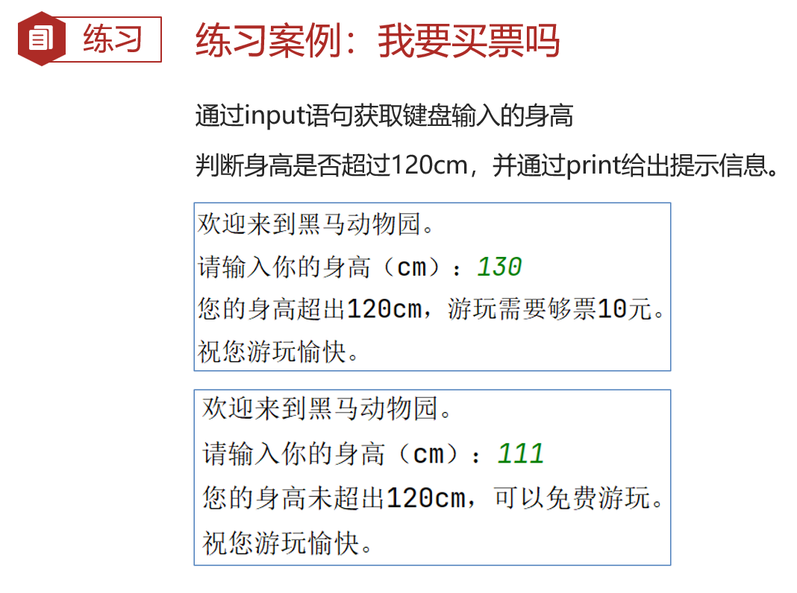
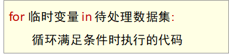
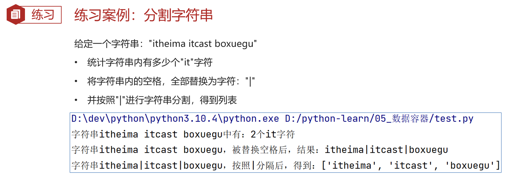
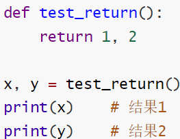
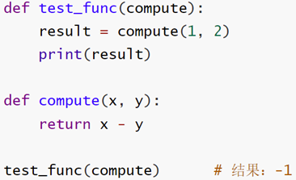

# day1

## 1、Python 软件（PyCharm）

安装：[在 Linux 环境下安装 Pycharm](https://blog.csdn.net/CNjcdyl/article/details/125158395)

插件：[汉化](https://blog.csdn.net/2301_76161259/article/details/135145727)、[翻译](https://blog.csdn.net/m0_57081622/article/details/127332289)

[设置字体大小](https://blog.csdn.net/jq_98/article/details/125266510)

常用快捷键：

- ctrl + alt + s ：打开软件设置
- ctrl + d ：复制当前行代码
- shift + alt + 上\下 ：将当前行代码上移或下移
- crtl + shift + f10 ：运行当前代码文件
- shift + f6 ：重命名文件
- ctrl + a ：全选
- ctrl + c\v\x ：复制、粘贴、剪切
- ctrl + f ：搜索


## 2、Python 流程：


# 正式开始：

## 1、字面量

字面量：在代码中，被写下来的固定的值，称之为字面量。

Python中常用的有6种值（数据）的类型：


字面量的输出程序：

```python
print(66)
print(13.14)
print("黑马程序员")
```


## 2、注释

注释：在程序代码中对程序代码进行解释说明的文字。

注释的分类

- 单行注释：以 # 开头，# 右边 的所有文字当作说明，而不是真正要执行的程序，起辅助说明作用。

	示例：

	```python
	# 写一个整数字面量
	```

	

- 多行注释：以 一对三个双引号 引起来（"""注释内容"""）来解释说明一段代码的作用使用方法.

	一般用于解释：整个PYTHON代码文件、类和方法

	示例：

	```python
	"""
	本代码演示了：
	- 各类字面量的写法
	- 通过 print 语句输出各类字面量
	"""
	```


示例程序：

```python
"""
本代码演示了：
- 各类字面量的写法
- 通过 print 语句输出各类字面量
"""

# 写一个整数字面量
666
# 写一个浮点数字面量
13.14
# 写一个字符串字面量
"黑马程序员"

# 通过 print 语句输出各类字面量
print(66)
print(13.14)
print("黑马程序员")
```


## 3、变量

变量：在程序运行时，能储存计算结果或能表示值的抽象概念。


示例：

```python
"""
本代码演示了：
- Python中变量的相关操作
"""

# 定义了一个变量，用来记录钱包余额
money = 50
# 通过 print 语句，输出变量记录的内容
print("钱包还有：", money)

# 买了一个冰淇淋，花费10元
money = money - 10
print("买了冰淇淋花费10元，还剩余：", money, "元")

# 假设，每隔一小时，输出一下钱包的余额
# ctrl+d 快速复制
print("现在是下午1点，钱包余额剩余:", money)
print("现在是下午2点，钱包余额剩余:", money)
print("现在是下午3点，钱包余额剩余:", money)
print("现在是下午4点，钱包余额剩余:", money)
```

==tips==：ctrl+d 快速复制


## 4、数据类型

我们可以通过 type() 语句来得到数据的类型

### type() 语句的使用方式


我们通过 type(变量) 可以输出类型，这==查看的是变量存储的数据的类型==。因为，变量无类型，但是它存储的数据有。

示例程序：

```python
# 方式1：使用 print 直接输出类型信息
print(type("heimachengxuyuan"))
print(type(666))
print(type(13.14))

# 方式2：使用变量存储 type() 语句的结果
string_type = type("heimachengxuyuan")
int_type = type(666)
float_type = type(13.14)
print(string_type)
print(int_type)
print(float_type)

# 方法3：使用 type() 语句，查看变量中存储的数据类型信息
name = "heimachengxuyuan"
name_type = type(name)
print(name_type)
```


### 字符串类型的三种定义方式


## 5、数据类型转换

==类型转换注意事项==

类型转换不是万能的，毕竟强扭的瓜不会甜，我们需要注意:

1. 任何类型，都可以通过str()，转换成字符串；
2. 字符串内必须真的是数字，才可以将字符串转换为数字；
3. 浮点数转为整数会丢失精度，向下丢失。

示例：

```python
# 将数字类型转换成字符串
num_str = str(11)
print(type(num_str), num_str)

float_str = str(11.345)
print(type(float_str), float_str)

# 将字符串转换成数字
num = int("11")
print(type(num), num)

num2 = float("11.345")
print(type(num2), num2)

# error
# num3 = int("heimachengxuyuan")
# print(type(num3), num3)

# 整数转浮点数
float_num = float(11)
print(type(float_num), float_num)

# 浮点数转整数
int_num = int(11.345)
print(type(int_num), int_num)
```


## 6、标识符

在 Python 程序中，我们可以给很多东西起名字，比如:

- 变量的名字
- 方法的名字
- 类的名字，等等

这些名字，我们把它统一的称之为标识符，用来做内容的标识。所以，标识符：是用户在编程的时候所使用的一系列名字，用于给变量、类、方法等命名。

### 标识符命名规则

Python中，标识符命名的规则主要有3类:

- 内容限定
- 大小写敏感
- 不可使用关键字

#### 标识符命名规则——内容限定

标识符命名中，只允许出现:

- 英文
- 中文
- 数字
- 下划线(_)

这四类元素。其余任何内容都不被允许。

==tips==：

1. 不推荐使用中文
2. 数字不可以用在开头


#### 标识符命名规则—大小写敏感

以定义变量为例：

Andy=“安迪1”；

andy=“安迪2”；

字母a的大写和小写，是完全能够区分的。


#### 标识符命名规则—不可使用关键字

Python 中有一系列单词，称之为关键字关键字；

在 Puthon 中都有特定用途，我们不可以使用它们作为标识符。


示例程序：

```python
# 规则1：内容限定，限定只能使用：中文、英文、数字、下划线，注意：不能以数字作为开头
# error
# 1_name = "张三"
# name_! = "张三"
name_ = "zhangsan"
_name = "zhangsan"
name_1 = "zhangsan"

# 规则2：大小写敏感
Itheima = "黑马"
itheima = "黑马"
print(Itheima)
print(itheima)

# 规则3：不可使用关键字
# error，错误的使用了关键字
# class = 1
# def = 1
Class = 1
Def = 1
```


### 变量命名规范

学完了标识符(变量、类、方法)的命名规则后，我们在来学习标识符的命名规范

- 变量名
- 类名
- 方法名

不同的标识符，有不同的规范。


我们目前只接触到了：变量。所以，目前学习:变量的命名规范。

- 见名知意
- 下划线命名法
- 英文字母全小写

#### 变量命名规范—见名知意

变量的命名要做到:

- 明了：尽量做到，看到名字，就知道是什么意思；
- 简洁：尽量在确保“明了”的前提下，减少名字的长度。


#### 变量命名规范—下划线命名法

多个单词组合变量名，要使用下划线做分隔。


#### 变量命名规范——英文字母全小写

命名变量中的英文字母，应全部小写。


## 7、运算符

### 算数（数学）运算符


示例：

```python
"""
演示Python的各类运算符
"""
# 算术（数学）运算符
print("1 + 1 = ", 1+1)
print("2 - 1 = ", 2-1)
print("3 * 3 = ", 3*3)
print("4 / 2 = ", 4/2)
print("11 // 2 = ", 11//2)
print("9 % 2 = ", 9%2)
print("2 ** 2 = ", 2**2)
```


### 赋值运算符


### 复合赋值运算符


示例程序：

```python
"""
演示Python的各类运算符
"""
# 算术（数学）运算符
print("1 + 1 = ", 1+1)
print("2 - 1 = ", 2-1)
print("3 * 3 = ", 3*3)
print("4 / 2 = ", 4/2)
print("11 // 2 = ", 11//2)
print("9 % 2 = ", 9%2)
print("2 ** 2 = ", 2**2)

# 赋值运算符
num = 1 + 2 + 3
# 复合复制运算符
# +=
num = 1
num += 1
print("num += 1:", num)

num -= 1
print("num -= 1:", num)

num *= 4
print("num *= 4:", num)

num /= 2
print("num /= 2:", num)

num = 3
num %= 2
print("num %= 2:", num)

num **= 2
print("num **= 2:", num)

num = 9
num //= 2
print("num //= 2:", num)
```


# day2

## 8、字符串的三种定义方式

### 字符串在Python中有多种定义形式

1. 单引号定义法：

	```python
	name = '黑马程序员'
	```

2. 双引号定义法：

	```python
	name = "黑马程序员"
	```

3. 三引号定义法：

	```python
	name = """黑马程序员"""
	```

三引号定义法，和多行注释的写法一样，同样支持换行操作。

**使用变量接收它，它就是字符串；**

**不使用变量接收它，就可以作为多行注释使用。**

```python
"""
演示字符串的三种定义方式：
- 单引号定义法
- 双引号定义法
- 三引号定义法
"""

# 单引号定义法
name = 'heima'
print(type(name))

# 双引号定义法
name = "heimachengxuyuan"
print(type(name))

# 三引号定义法，写法和多行注释是一样的
name = """
wo
shi
heima
"""
print(type(name))
```


### 字符串的引号嵌套

思考：如果我想要定义的字符串本身，是包含：单引号、双引号自身呢？如何写？

- 单引号定义法，可以内含双引号；
- 双引号定义法，可以内含单引号；
- 可以使用转移字符 \ 来将引号解除效用，变成普通字符串示例。

示例：

```python
# 在字符串内，包含双引号
name = '"heima"'
print(name)
# 在字符串内，包含单引号
name = "'chengxuyuan'"
print(name)
# 使用转义字符 \ 解除引号的作用
name = "\"heimachengxuyuan"
print(name)
name = '\'heima\''
print(name)
```


## 9、字符串的拼接

如果我们有两个字符串（文本）字面量，可以将其拼接成一个字符串，通过 + 号即可完成，如：

```python
print("学IT来黑马"+"月薪过万")
```

输出结果：学IT来黑马月薪过万

不过一般，单纯的2个字符串字面量进行拼接显得很呆，一般，==字面量和变量或变量和变量之间会使用拼接==，如：

```python
name ="黑马程序员"
print("我的名字是:"+ name +"，我可以教大家IT技能")
```

输出结果：我的名字是：黑马程序员，我可以教大家IT技能。

示例：

```python
# 字符串字面量之间的拼接
print("hello " + "world")

# 字符串字面量和字符串变量的拼接
name = "hello world"
address = "111111"
tel = 4008208820
print(name + address)
# error: can only concatenate str (not "int") to str
# print(name + address + tel)
```


## 10、字符串格式化

我们会发现，这个拼接字符串也不好用啊，==变量过多==，拼接起来实在是太麻烦了，==字符串无法和数字或其它类型完成拼接==。

我们可以通过如下语法，完成字符串和变量的快速拼接。

```python
name ="黑马程序员"
message ="学IT就来:%s" % name
print(message)
```

其中的，%s 中 % 表示：我要占位，s 表示：将==变量变成字符串==放入占位的地方，所以，综合起来的意思就是：我先占个位置，等一会有个变量过来，我把它变成字符串放到占位的位置。

那，数字类型呢?可以不可以占位?

那必须可以，我们来尝试如下代码:

```python
class_num = 57
avg_salary = 16781
message ="Python大数据学科，北京%s期，毕业平均工资:%s" %(class_num，avg_salary)
print(message)
```

输出结果：Python大数据学科，北京57期，毕业平均工资：16781

==tips==：

1. 多个变量占位
2. 变量要用括号括起来
3. 并按照占位的顺序填入


Python中，其实支持非常多的数据类型占位：


示例程序：

```python
# 通过占位的形式，完成拼接
name = "heima"
message = "hello: %s" % name
print(message)

# 通过占位的形式，完成数字和字符串的拼接
class_num = 57
avg_salary = 16781
message = "Python大数据学科，北京 %s 期，毕业平均工资: %s " % (class_num, avg_salary)
print(message)

name = "传智伯克"
setup_year = 1990
stock_price = 99.90
message = "%s, 成立于：%d, 今天的股价是：%f" % (name, setup_year, stock_price)
print(message)
```

输出：

```python
hello: heima
Python大数据学科，北京 57 期，毕业平均工资: 16781 
传智伯克, 成立于：1990, 今天的股价是：99.900000
```


## 11、格式化的精度控制

我们可以使用辅助符号"m.n"来控制数据的宽度和精度

- m，控制宽度，要求是数字(==很少使用==)，==设置的宽度小于数字自身，不生效==
- .n，控制小数点精度，要求是数字，会进行小数的四舍五入

==tips==：格式化字符串时的宽度限制（如 %5d 或 %5.3f）是指整个字段的宽度，包括数字、小数点和任何其他字符。

%5d：表示将整数的宽度控制在5位，如数字11，被设置为5d，就会变成：\[空格\]\[空格\]\[空格]11，用三个空格补足宽度。 

%5.2f：表示将宽度控制为5，将小数点精度设置为2 小数点和小数部分也算入宽度计算。如，对11.345设置了%7.2f后，结果是：\[空格\]\[空格\]11.35。2个空格补足宽度小数部分限制 2 位精度后，四舍五入为 .35

%.2f：表示不限制宽度，只设置小数点精度为2，如 11.345 设置 %.2f 后，结果是11.35

示例：

```python
num1 = 11
num2 = 11.345
print("数字11宽度限制为5，结果是：%5d " % num1)
print("数字11宽度限制为1，结果是：%1d " % num1)
print("数字11.345宽度限制为7，小数精度2，结果是：%7.2f " % num2)
print("数字11.345宽度限制为7，小数精度2，结果是：%.2f " % num2)
```

输出结果：

```python
数字11宽度限制为5，结果是：   11 
数字11宽度限制为1，结果是：11 
数字11.345宽度限制为7，小数精度2，结果是：  11.35 
数字11.345宽度限制为7，小数精度2，结果是：11.35 
```


## 12、字符串格式化的方式2

字符串格式化快速写法：

通过语法：`f"内容{变量}"` 的格式来快速格式化。

==tips==:

1. 这种写法不做精度控制
2. 也不理会类型
3. 适用于快速格式化字符串

示例：

```python
"""
演示第二种字符串格式化的方式：f"{占位}"
"""
name = "传智伯克"
setup_year = 1990
stock_price = 99.90
print(f"我是{name}，我成立于：{setup_year}年，我今天的股价是：{stock_price}")
```

输出结果：

```python
我是传智伯克，我成立于：1990年，我今天的股价是：99.9
```


## 13、对表达式进行格式化

表达式就是一个具有明确结果的代码语句，如1+1、type(“字符串”)、3*5等在变量定义的时候，如 age=11+11，等号右侧的就是表达式，也就是有具体的结果，将结果赋值给了等号左侧的变量。

如何格式化表达式?

1、`f"{表达式}"`

2、`"%s \ %d \ %f" % (表达式、表达式、表达式)`

在无需使用变量进行数据存储的时候，可以直接格式化表达式。

示例：

```python
"""
演示对表达式进行字符串格式化
"""
print("1*1 的结果是：%d" % (1*1))
print(f"1*2 的结果是：{1*2}")
print("字符串在 Python 中的类型名是：%s" % type("字符串"))
```

输出结果：

```python
1*1 的结果是：1
1*2 的结果是：2
字符串在 Python 中的类型名是：<class 'str'>
```


## 14、字符串格式化的课后练习题


示例程序：

```python
name = "chuanzhiboke"
stock_price = 19.99
stock_code = "003032"
stock_price_growth_factor = 1.2
growth_days = 7
print(f"公司：{name}，股票代码：{stock_code}，当前股价：{stock_price}")
print("每日增长系数：%2.1f, 经过 %d 天的增长,股价达到了：%5.2f" % (stock_price_growth_factor, growth_days, stock_price*(1.2**7)))
```


## 15、数据输入（ input 语句）

### input 语句（函数）

在Python中，print语句(函数)，可以完成将内容（字面量、变量等）输出到屏幕上，与之对应的还有一个input语句，用来获取键盘输入。

- 数据输出：print
- 数据输入：input

使用上也非常简单：

- 使用 input() 语句可以从键盘获取输入；
- 使用一个变量接收(存储) input 语句获取的键盘输入数据即可。

示例：

```python
"""
演示 python 中的input语句
获取键盘的输入信息
"""
print("请告诉我你是谁？")
name = input()
print("我知道了，你是: %s" % name)
```

输出结果：（绿色的为输入内容）


input()语句其实是可以在要求使用者输入内容前，输出提示内容的，方式如下:

```python
name = input("请告诉我你是谁？")
print("我知道了，你是: %s" % name)
```

输出结果：(绿色的为输入内容)


### input语句获取的数据类型

如果我们输入数字类型或其它类型，结果会如何?

可以看到，无论键盘输入何种类型的数据==最终的结果都是：字符串类型的数据==，如果需要==转换成其他类型，需要进行强制类型转换==。

示例程序：

```python
# 输入数字类型
num = input("请告诉我你的银行卡密码：")
print(type(num))
# 数据类型转换
num = int(num)
print("你的银行卡密码的类型是: ", type(num))
```

输出结果：


## 16、布尔类型和比较运算符

布尔类型的字面量：

- True 表示真(是、肯定)
- False 表示假(否、否定)

定义变量存储布尔类型数据：变量名称 = 布尔类型字面量

布尔类型不仅可以==自行定义==，同时也可以通过计算的来（也就是==使用比较运算符进行比较运算得到布尔类型的结果==。）

比较运算符：


示例：

```python
"""
演示布尔类型的定义
以及比较运算符的应用
"""
# 定义变量存储布尔类型的数据
bool_1 = True
bool_2 = False
print(f"bool_1变量的内容是:{bool_1}，类型是：{type(bool_1)}")
print(f"bool_2变量的内容是:{bool_2}，类型是：{type(bool_2)}")

# 比较运算符的使用
# ==, !=, >, <, >=, <=
# 演示进行内容的相等比较
num1 = 10
num2 = 10
print(f"10 == 10的结果是：{num1 == num2}")

num1 = 10
num2 = 15
print(f"10 != 15的结果是：{num1 != num2}")

name1 = "itcast"
name2 = "itheima"
print(f"itcast == itheima的结果是：{name1 != name2}")

# 演示大于小于，大于等于，小于等于的比较运算
num1 = 10
num2 = 5
print(f"10 > 5 的结果是：{num1 > num2}")
print(f"10 < 5 的结果是：{num1 < num2}")

num1 = 10
num2 = 11
print(f"10 >= 11的结果是：{num1 >= num2}")
print(f"10 <= 11的结果是：{num1 <= num2}")

# 数字 1 与字符串 '1' 进行比较
print(f"1 == '1'的结果是：{1 == '1'}")
```

输出结果：


## 17、if 语句的基本格式

程序中的判断

```python
if 要判断的条件:
	条件成立时，要做的事情
```

判断语句的==结果==，==必须是布尔类型True或False==

- True会执行if内的代码语句
- False则不会执行

if 语句的==注意事项==：

- 判断条件的结果一定要是布尔类型
- 不要忘记判断条件后的： 引号
- 归属于if语句的代码块，需在前方填充4个空格缩进

示例程序：

```python
"""
演示 python 判断语句：if语句的基本格式应用
"""
age = 30
if age >= 18:
    print("我已经成年了")
    print("即将步入成年生活")
print("时间过的真快阿")

age = 10
if age >= 18:
    print("我已经成年了")
    print("即将步入成年生活")
print("时间过的真快阿")
```

输出结果：


# day3

## 18、成年人判断练习


程序：

```python
print("欢迎来到游乐园")
age = int(input("请输入你的年龄："))
if age >= 18:
    print("您已成年，游玩需要补票10元")
print("祝您游玩愉快！")
```


## 19、if else 组合判断语句

基本语法格式：


==if else注意事项==：

1. else后，不需要判断条件；
2. 和 if 的代码块一样，else的代码块同样需要4个空格作为缩进。

示例程序：

```python
"""
演示 Python 中
if else 的组合判断语句
"""
age = int(input("请输入你的年龄："))
if age >= 18:
    print("您已成年，需要补票10元。")
else:
    print("您未成年，可以免费游玩。")
```


## 20、我要买票吗练习



示例程序：

```python
print("欢迎来到黑马动物园")
height = int(input("请输入你的身高(cm)："))
if height >= 120:
    print("您的身高超过120cm，游玩需要补票10元")
else:
    print("您的身高未超过120cm，可以免费游玩")
print("祝您游玩愉快。")
```


## 21、if elif else 组合使用

基本语法格式：


示例：


判断是互斥且有顺序的。

- 满足1(如图编号)将不会理会2和3；
- 满足2，将不会理会3；
- 1、2、3均不满足，进入else；
- else也可以省略不写，效果等同3个独立的if判断。

示例程序：

```python
"""
演示 if elif else 多条件判断语句的使用
"""
height = int(input("请输入你的身高(cm): "))
vip_level = int(input("请输入你的VIP等级(1-5): "))
day = int(input("请告诉我今天几号："))

# 通过 if 判断，可以使用多条件判断的语法
# 第一个条件就是 if
if height < 120:
    print("身高小于120cm，可以免费。")
elif vip_level > 3:
    print("vip级别大于3，可以免费。")
elif day == 1:
    print("今天是1号免费日，可以免费。")
else:
    print("不好意思，需要购票10元。")
print("祝您游玩愉快。")
```

输出结果：（需要统一输入所有数据，才可最终输出结果）


节省代码量的写法：

```python
# 通过 if 判断，可以使用多条件判断的语法
# 第一个条件就是 if
if int(input("请输入你的身高(cm): ")) < 120:
    print("身高小于120cm，可以免费。")
elif int(input("请输入你的VIP等级(1-5): ")) > 3:
    print("vip级别大于3，可以免费。")
elif int(input("请告诉我今天几号：")) == 1:
    print("今天是1号免费日，可以免费。")
else:
    print("不好意思，需要购票10元。")
print("祝您游玩愉快。")
```

输出结果：（一个条件满足，立即输出）


## 22、猜猜心里数字案例

对比两种写法，注意更简洁写法的整洁性

法1：

```python
num = int(input("请输入第一次猜想的数字： "))
if num == 10:
    print("猜对辣")
else:
    num_1 = int(input("不对，再猜一次： "))
    if num_1 == 10:
        print("猜对辣")
    else:
        num_2 = int(input("不对，再猜最后一次： "))
        if num_2 == 10:
            print("猜对辣")
        else:
            print("Sorry,全部猜错拉，我想的是：10")
```

法2：

```python
num = int(input("请输入第一次猜想的数字： "))
if int(input("请输入第一次猜想的数字： ")) == 10:
    print("恭喜第一次猜对辣")
elif int(input("不对，再猜一次： ")) == 10:
    print("猜对辣")
elif int(input("不对，再猜最后一次： ")) == 10:
    print("猜对辣")
else:
    print("Sorry,全部猜错拉，我想的是：10")
```


## 23、判断语句的嵌套

基础语法格式如下：


==嵌套的关键点，在于：空格缩进==

==通过空格缩进，来决定语句之间的：层次关系==

### 简单嵌套


如图：

- 判断有2层；
- 当外层 if 满足条件（图中编号1）时，才会执行内层if判断（图中编号2）；
- 当外层 if（编号1）不满足，直接执行外层 else 。


### 自由组合嵌套

自由组合嵌套，需求如下：

公司要发礼物，条件是：

1. 必须是大于等于18岁小于30岁的成年人

2. 同时入职时间需满足大于两年，或者级别大于3才可领取

示例：

```python
age = 20
year = 3
level = 1
if age >= 18:
    print("你是成年人")
    if age < 30:
        print("你的年龄达标了")
        if year > 2:
            print("恭喜你，年龄和入职时间都达标，可以领取礼物")
        elif level > 3:
            print("恭喜你，年龄和级别达标，可以领取礼物")
        else:
            print("不好意思，尽管年龄达标，但是入职时间和级别都不达标。")
    else:
        print("不好意思，年龄太大了。")
else:
    print("不好意思，小朋友不可以领取")
```


## 24、判断语句综合案例

案例需求:

定义一个数字（1~10，随机产生），通过3次判断来猜出来数字

案例要求:

1. 数字随机产生，范围1-10

2. 有3次机会猜测数字，通过3层嵌套判断实现

3. 每次猜不中，会提示大了或小了

示例程序：

```python
"""
演示判断语句的实战案例：终极猜数字
"""

# 1.构建一个随机的数字变量
import random
num = random.randint(1,10)
guess_num = int(input("输入你要猜测的数字："))

# 2.通过 if 判断语句进行数字的猜测
if guess_num == num:
    print("恭喜，第一次就猜中了。")
else:
    if guess_num > num:
        print("你猜的数字大了。")
    else:
        print("你猜的数字小了。")

    guess_num = int(input("输入你要猜测的数字："))
    if guess_num == num:
        print("恭喜，第二次猜中了。")
    else:
        if guess_num > num:
            print("你猜的数字大了。")
        else:
            print("你猜的数字小了。")

    guess_num = int(input("输入你要猜测的数字："))
    if guess_num == num:
        print("第三次猜中了。")
    else:
        print("三次机会用完了，没有猜中。")
```


## 25、while 循环的基础使用

基本语法格式：


示例程序：

```python
"""
演示 while 循环的基础应用
"""
i = 0
while i < 100:
    print("hello world")
    i += 1
```

==while循环的注意事项==：

1. 条件需提供布尔类型结果，True继续，False停止；
2. 空格缩进不能忘；
3. 请规划好循环终止条件，否则将无限循环。


## 26、求1-100的和练习

需求：通过while循环，计算从1累加到100的和：

```python
i = 1
sum = 0
while i <= 100:
    sum += i
    i += 1
print(f"sum = {sum}")
```


## 27、while 循环猜数字

设置一个范围1-100的随机整数变量，通过while循环，配合input语句，判断输入的数字是否等于随机数：

- 无限次机会，直到猜中为止
- 每一次猜不中，会提示大了或小了
- 猜完数字后，提示猜了几次

```python
import random
num = random.randint(1, 100)
count = 1
guess_num = int(input("请输入要猜测的数字: "))
while guess_num != num:
    if guess_num > num:
        print("输入的数大了")
    elif guess_num < num:
        print("输入的数小了")
    count += 1
    guess_num = int(input("请重新输入要猜测的数字: "))
print(f"一共猜了 {count} 次")
```


# day4

## 28、while 循环的嵌套应用

基本语法格式：


**注意事项**：

1. 同判断语句的嵌套一样，循环语句的嵌套，要注意空格缩进。
2. 基于空格缩进来决定层次关系
3. 注意条件的设置，避免出现无限循环（除非真的需要无限循环）

示例程序：

```python
"""
演示 while 循环的嵌套使用
"""

# 外层：表白 100 天的控制
# 内层：每天的表白都送 10 只玫瑰花的控制

i = 1
while i <= 100:
    print(f"今天是第 {i} 天，准备表白......")

    # 内层循环的控制变量
    j = 1
    while j <= 10:
        print(f"送给小美第 {j} 只玫瑰花")
        j += 1
    print("小美，我喜欢你")
    i += 1

print(f"坚持到第 {i-1} 天，表白成功。")
```


## 29、while 循环案例 — 九九乘法表

### 补充知识

1. print 输出不换行

	```python
	print("hello", end='')
	print("hello", end='')
	```

	

2. 制表符 `\t`

	```python
	print("hello\tworld")
	print("itheima\tbest")
	```


### 示例：九九乘法表

```python
i = 1
while i <= 9:
    j = 1
    while j <= i:
        print(f"{i}*{j}={i*j}\t", end='')
        j += 1
    print()
    i += 1
```

输出结果：


## 30、for 循环基本语法

### while 和 for 循环对比

- while循环的循环条件是自定义的，自行控制循环条件
- for循环是一种”轮询”机制，是对一批内容进行”逐个处理”

### for 循环


基本语法格式：



从待处理数据集中：逐个取出数据，赋值给临时变量。

### 示例

```python
"""
演示 for 循环的基础语法
"""
name = "itheima"
for x in name:
    # 将 name 的内容，挨个取出赋予 x 临时变量
    # 就可以在循环体内对 x 进行处理
    print(x)
```

for循环是将字符串的内容：**依次取出**，所以，for循环也被称之为：**遍历循环**

理论上讲，Python的for循环无法构建无限循环（**被处理的数据集不可能无限大**）


### 注意点

for循环的注意点：

- 无法定义循环条件，只能被动取出数据处理；
- 要注意，循环内的语句，需要有空格缩进。


## 31、for 循环案例—数一数有几个a


```python
name = "itheima is a brand of itcast"
count = 0
for x in name:
    if(x == 'a'):
        count += 1
print(f"itheima is a brand of itcast 中共含有：{count}个字母a")
```


## 32、range 语句


语法中的：待处理数据集，严格来说，称之为：**可迭代类型**

可迭代类型指，**其内容可以一个个依次取出的一种类型**，包括：字符串、列表、元组等。

其中，**可迭代类型可以是 range**。

1、语法1：`range(num)`

获取一个从0开始，到num结束的数字序列（不含num本身），如range(5)取得的数据是：[0, 1, 2, 3, 4]；

2、语法2：`range(num1, num2)`

获得一个从num1开始，到num2结束的数字序列(不含num2本身)，如：range(5, 10) 取得的数据是：[5, 6, 7, 8, 9]；

3、语法3：`range(num1, num2, step)`

获得一个从 num1 开始，到 num2 结束的数字序列（不含 num2 本身），数字之间的步长，以 step 为准（ step 默认为1），如，range(5, 10, 2)取得的数据是：[5, 7, 9]。

示例：

```python
"""
演示 Python 中的 range() 语句的基本使用
"""

# range 语法1：range(num)
for x in range(10):
    print(x)

# range 语法2：range(num1, num2)
for x in range(5, 10):
    # 从 5 开始，到 10 结束(不包含 10 本身)的一个数字序列
    print(x)

# range 语法3：range(num1, num2, step)
for x in range(5, 10, 2):
    # 从 5 开始，到 10 结束（不包含10本身）的一个数字序列，数字之间的间隔是2
    print(x)
```

练习：


示例程序：

```python
count = 0
num = int(input("请输入一个数:"))
for x in range(1, num):
    if(x % 2 == 0):
        count += 1
print(f"1到{num}范围内，共有{count}个偶数")
```


## 33、for 循环临时变量作用域

如果在 for 循环外部访问临时变量：

- 实际上是可以访问到的；
- 在编程规范上，是不允许、不建议这么做的。

如果**实在需要**在循环外**访问循环内的临时变量**，可以**在循环外预先定义**。


## 34、for 循环的嵌套使用

基本语法格式：


示例：

```python
"""
演示 for 循环的嵌套使用
"""
# 坚持表白 100 天，每天都送 10 朵花
for i in range(1, 101):
    print(f"今天是向小美表白的第{i}天，加油坚持。")
    # 内层循环
    for j in range(1, 11):
        print(f"给小美送的第{j}朵玫瑰花")
    print("小美我喜欢你")
print(f"第{i}天，表白成功")
```


## 35、for 循环打印九九乘法表

```python
for i in range(1, 10):
    for j in range(1, i+1):
        print(f"{i}*{j}={i*j}\t", end='')
    print()
```


## 36、continue 和 break

### continue

continue关键字用于：**中断本次循环，直接进入下一次循环**

continue可以用于：  for循环和while循环，效果一致

```python
# 演示循环中断语句 continue
for i in range(1, 6):
    print("语句1")
    continue
    print("语句2")
```

continue在循环中的嵌套使用

```python
# 演示 continue 的嵌套应用
for i in range(1, 6):
    print("语句1")
    for j in range(1, 6):
        print("语句2")
        continue
        print("语句3")
    print("语句4")
```


### break

break 关键字同样只可以控制：它所在的循环**永久中断**。

```python
# 演示循环中断语句 break
for i in range(1, 101):
    print("语句1")
    break
    print("语句2")
print("语句3")
```

break 在循环中的嵌套使用

```python
# 演示 break 的嵌套应用
for i in range(1, 6):
    print("语句1")
    for j in range(1, 6):
        print("语句2")
        break
        print("语句3")

    print("语句4")
```


## 37、循环综合案例：发工资


示例：

```python
import random
num = random.randint(1, 10)
sum = 10000
for i in range(1, 21):
    salary = 1000;
    num = random.randint(1, 10)
    if(num < 5):
        print(f"员工{i}，绩效分{num}，低于5，不发工资，下一位")
        continue
    if sum >= 1000:
        sum -= 1000
        print(f"员工{i}发放工资1000元，公司账户余额：{sum}")
    else:
        print(f"余额不足，当前余额：{sum}元，不足以发工资，下个月再来")
        break
```


# day5

## 38、函数的初体验

函数：是组织好的，**可重复使用的**，用来实现特定功能的代码段。

统计字符串的长度，不使用内置函数 len()，常规方法和函数两种方法对比：

常规方法：

```python
# 需求，统计字符串的长度，不使用内置函数 len()
str1 = "itheima"
str2 = "itcast"
str3 = "python"

# 定义一个计数变量
count = 0
for i in str1:
    count += 1
print(f"字符串{str1}的长度是:{count}")

count = 0
for i in str2:
    count += 1
print(f"字符串{str2}的长度是:{count}")

count = 0
for i in str3:
    count += 1
print(f"字符串{str3}的长度是:{count}")
```

使用函数：

```python
# 可以使用函数，来优化过程
def my_len(data):
    count = 0
    for i in data:
        count += 1
    print(f"字符串{data}的长度是{count}")

my_len(str1)
my_len(str2)
my_len(str3)
```


使用函数的好处是：

1. 将功能封装在函数内，可供随时随地重复利用；
2. 提高代码的复用性，减少重复代码，提高开发效率


## 39、函数的基础定义语法

### 函数的定义

基本语法格式：


### 函数的调用

调用格式：

```python
函数名(参数)
```


### 注意事项

1. 参数如不需要，可以省略（后续章节讲解）
2. 返回值如不需要，可以省略（后续章节讲解）
3. 函数必须先定义后使用


示例：

```python
"""
演示函数的定义语法
"""

# 定义一个函数，输出相关信息
def say_hi():
    print("Hi, hello world")

# 调用函数，让定义的函数开始工作
say_hi()
```


## 40、函数的基础定义案例练习


示例：

```python
def welcome():
    print("欢迎来到黑马程序员！")
    print("请出示你的核酸码")

welcome()
```


## 41、函数的传入参数

传入参数的功能是：在函数进行计算的时候，接受外部（调用时）提供的数据

基于函数的定义语法：


示例：

```python
"""
演示函数使用参数
"""

# 定义 2 数向家的函数，通过参数接收被计算的 2 个数字
def add(x, y):
    result = x + y
    print(f"{x} + {y}的计算结果是：{result}")
    
# 调用函数，传入被计算的 2 个数字
add(5, 6)
```


函数定义中，提供的 x 和 y，称之为：形式参数（形参），表示函数声明将要使用2个参数；

**参数之间使用逗号进行分隔**；

函数调用中，提供的5和6，称之为：实际参数（实参），表示函数执行时真正使用的参数值；

**传入的时候，按照顺序传入数据，使用逗号分隔**。


## 42、函数的传入参数案例练习——升级版自动查验核酸


```python
def check(temper):
    if temper <= 37.5:
        print(f"温度为{temper}，请进.")
    else:
        print(f"温度为{temper}，请隔离.")

check(33.6)
```


## 43、函数的返回值定义语法

​    所谓“返回值”，就是程序中函数完成事情后，最后**给调用者的结果**。

基本语法格式如下：


示例：

```python
"""
演示：定义函数返回值的语法格式
"""

# 定义一个函数，完成 2 数相加功能
def add(a, b):
    result = a + b
    # 通过返回值，将相加的结果返回给调用者
    return result

# 函数的返回值，可以通过变量去接收
r = add(5, 6)
print(r)
```

==tips==:

函数体在遇到return后就结束了，所以**写在return后的代码不会执行**。


## 44、函数返回值之None类型

Python中有一个特殊的字面量：None，其类型是：<class 'NoneType'>。

无返回值的函数，实际上就是返回了：None这个字面量。

None 表示：空的、无实际意义的意思；函数返回的 None，就表示这个函数没有返回什么有意义的内容；也就是返回了空的意思。

**None类型的应用场景**

None作为一个特殊的字面量，用于表示：空、无意义，其有非常多的应用场景。

1. 用在函数无返回值上

2. 用在 if 判断上

	- 在 if 判断中，None等同于False；
	- 一般用于在函数中主动返回 None，配合 if 判断做相关处理。

3. 用于声明无内容的变量上

	定义变量，但暂时不需要变量有具体值，可以用 **None** 来代替。

示例：

```python
"""
演示特殊字面量：None
"""

# 无 return 语句的函数返回值
def say_hi():
    print("你好呀")

result = say_hi()
print(f"无返回值函数，返回的内容是:{result}")
print(f"无返回值函数，返回的内容是:{type(result)}")

# 主动返回 None 的函数
def say_hi2():
    print("你好呀")

result = say_hi2()
print(f"无返回值函数，返回的内容是:{result}")
print(f"无返回值函数，返回的内容是:{type(result)}")

# None 用于 if 判断
def check_age(age):
    if age > 18:
        return "SUCCESS"
    else:
        return None

result = check_age(16)
if not result:
    # 进入 if 表示 result 是 None 值，也就是 False
    print("未成年，不可进入")

# None 用于声明无初始内容的变量
name = None
```


## 45、函数的说明文档

函数是纯代码语言，想要理解其含义，就需要一行行的去阅读理解代码，效率比较低。

我们可以给函数添加说明文档，辅助理解函数的作用。

语法如下：

```python
def add(x, y):
    """
    add 函数可以接受 2 个参数，进行 2 数相加的功能
    :param x: 相加的数字 1
    :param y: 相加的数字 2
    :return: 返回相加的结果
    """
    result = x + y
    print(f"2 数相加的结果是:{result}")
    return result
```

==tips==：pycharm 软件输入`""""""`，在第三个双引号后面回车，会自动补全参数注释格式。


在PyCharm编写代码时，可以通过鼠标悬停，查看调用函数的说明文档。


## 46、函数的嵌套调用

所谓函数嵌套调用指的是==一个函数里面又调用了另外一个函数==。

示例：

```python
"""
演示嵌套调用函数
"""

# 定义函数 func_b
def func_b():
    print("---2---")

# 定义函数 func_a，并在内部调用 func_b
def func_a():
    print("---1---")

    # 嵌套调用 func_b
    func_b()

    print("---3---")

# 调用函数 func_a
func_a()
```

如果函数A中，调用了另外一个函数B，那么先**把函数B中的任务都执行完毕之后才会回到上次 函数A执行的位置**


## 47、变量在函数中的作用域

变量作用域指的是变量的作用范围（变量在哪里可用，在哪里不可用）

主要分为两类：局部变量和全局变量；


1、所谓局部变量是定义在函数体内部的变量，即只在函数体内部生效

```python
# 演示局部变量
def Test_a():
    num = 100
    print(num)

Test_a()
# error: print(num)
# NameError: name 'num' is not defined
print(num)
```


变量a是定义在`testA`函数内部的变量，在函数外部访问则立即报错。

局部变量的作用：在函数体内部，临时保存数据，即当函数调用完成后，则销毁局部变量。


2、所谓全局变量，指的是在函数体内、外都能生效的变量

```python
# 演示全局变量
num = 200
def Test_a():
    print(f"test_a:{num}")

def Test_b():
    print(f"Test_b:{num}")

Test_a()
Test_b()
print(num)
```


3、函数体内修改局部变量，函数外却不能更新该变量

```python
# 在函数内修改全局变量
num = 200
def Test_a():
    print(f"test_a:{num}")

def Test_b():
    num = 500     # 局部变量
    print(f"Test_b:{num}")

Test_a()
Test_b()
print(num)
```


4、使用 global关键字 可以在函数内部声明变量为全局变量, 如下所示：

示例：

```python
# global关键字，在函数内声明变量为全局变量
num = 200
def Test_a():
    print(f"test_a:{num}")

def Test_b():
    global num      # 设置内部定义的变量为全局变量
    num = 500       # 局部变量
    print(f"Test_b:{num}")

Test_a()
Test_b()
print(num)
```


# day6

## 48、函数综合案例


示例：

```python
money = 5000000
name = input("请输入名称: ")

def check_balance():
    print("--------查询余额--------")
    print(f"{name}，你好，您的余额剩余: {money}元")

def deposit(m_money):
    print("-------- 存款 --------")
    global money
    money += m_money
    print(f"{name}，你好，您存款{m_money}元成功")
    print(f"{name}，你好，您的余额剩余: {money}元")

def withdraw(m_money):
    print("-------- 取款 --------")
    global money
    money -= m_money
    print(f"{name}，你好，您取款{m_money}元成功")
    print(f"{name}，你好，您的余额剩余: {money}元")

while name == "zhoujielun":
    print("--------主 菜单--------")
    print("查询余额 【输入1】")
    print("存款    【输入2】")
    print("取款    【输入3】")
    print("退出    【输入4】")
    choice = int(input("请输入你的选择: "))
    num = 0
    if(choice == 1):
        check_balance()
    elif(choice == 2):
        num = int(input("请输入存款的金额："))
        deposit(num)
    elif(choice == 3):
        num = int(input("请输入取款的金额："))
        withdraw(num)
    elif(choice == 4):
        break
    else:
        print("输入错误，请重新输入！")
        continue
```


## 49、数据容器入门

**学习数据容器，就是为了批量存储或批量使用多份数据**

Python中的数据容器：一种可以容纳多份数据的数据类型，容纳的每一份数据称之为1个元素。

每一个元素，可以是任意类型的数据，如字符串、数字、布尔等。

数据容器根据特点的不同，如：

- 是否支持重复元素
- 是否可以修改
- 是否有序，等

分为5类，分别是：

列表（list）、元组（tuple）、字符串（str）、集合（set）、字典（dict）


## 50、列表的定义语法

基本语法格式：


列表内的==每一个数据，称之为元素==

- 以 [] 作为标识
- 列表内每一个元素之间用, 逗号隔开


示例：

```python
"""
演示 数据容器之： list 列表
语法：[元素，元素，......]
"""

# 定义一个列表 list
my_list = ["itheima", "itcast", "python"]
print(my_list)
print(type(my_list))

my_list = ["itheima", 666, True]
print(my_list)
print(type(my_list))

# 定义一个嵌套的列表
my_list = [[1, 2, 3], [4, 5, 6]]
print(my_list)
print(type(my_list))
```


==tips==：注列表可以一次存储多个数据，且**可以为不同的数据类型**，支持嵌套


## 51、列表的下标索引

### 1、列表的下标（索引）


如图，列表中的每一个元素，都有其位置下标索引，从前向后的方向，从 0 开始，依次递增，我们只需要按照下标索引，即可取得对应位置的元素。


### 2、列表的下标（索引）— 反向

也可以反向索引，也就是从后向前：从-1开始，依次递减（-1、-2、-3......）


如图，从后向前，下标索引为：-1、-2、-3，依次递减。


### 3、嵌套列表的下标（索引）

如果列表是嵌套的列表，同样支持下标索引：


如图，下标就有2个层级了。


示例：

```python
# 通过下标索引取出对应位置的数据
my_list = ["Tom", "Lily", "Rose"]
# 列表[下标索引]，从前向后从0开始，每次+1，从后向前从-1开始，每次-1
print(my_list[0])
print(my_list[1])
print(my_list[2])
# 错误示范：通过下标索引数据，一定不要超出范围
# print(my_list[3])

# 通过下标索引取出数据（倒序输出）
print(my_list[-1])
print(my_list[-2])
print(my_list[-3])

# 取出嵌套列表的元素
my_list = [[1, 2, 3], [4, 5, 6]]
print(my_list[1][1])
```


==tips==：要注意下标索引的取值范围，超出范围无法取出元素，并且会报错


## 52、列表的常用操作方法

### 1、列表的查询功能

查找某元素的下标：

功能：查找指定元素在列表的下标，如果找不到，报错ValueError

语法：列表.index(元素)

index就是列表对象（变量）内置的方法（函数）

```python
mylist = ["itcast", "itheima", "python"]

# 1.1 查找某元素在列表内的下标索引
index = mylist.index("itheima")
print(f"itheima 在列表中的下标索引值是：{index}")

# # 1.2 如果被查找的元素不存在，会报错
# index = my_list.index("hello")
# print(f"hello 在列表中的下标索引值是：{index}")
```


### 2、列表的修改功能（方法）

#### 1、修改特定位置（索引）的元素值：

语法：列表[下标] = 值

可以使用如上语法，直接对指定下标（正向、反向下标均可）的值进行：重新赋值（修改）

```python
# 2. 修改特定位置（索引）的元素值
mylist[0] = "传智教育"
print(f"列表被修改元素之后，结果是：{mylist}")
```


#### 2、插入元素

语法：列表.insert(下标, 元素)，在指定的下标位置，插入指定的元素

```python
# 3. 在指定下标位置插入新元素
mylist.insert(1, "best")
print(f"列表插入元素后，结果是：{mylist}")
```


#### 3、追加元素

##### append

语法：列表.append(元素)，将指定元素，追加到列表的尾部

```python
# 4. 在列表尾部追加单个新元素
mylist.append("黑马程序员")
print(f"列表在追加了元素后，结果是：{mylist}")
```


##### extend

语法：列表.extend(其它数据容器)，将其它数据容器的内容取出，依次追加到列表尾部

```python
# 5. 在列表尾部追加 一批 新元素
mylist2 = [1, 2, 3]
mylist.extend(mylist2)
print(f"列表在追加了一个新的列表后，结果是：{mylist}")
```


#### 4、删除元素

##### del

语法： del 列表[下标]

```python
# 6. 删除指定下标索引的元素（2种方式）
mylist = ["itcast", "itheima", "python"]

# 6.1 方式1：del 列表[下标]
del mylist[2]
print(f"列表删除元素后，结果是：{mylist}")
```


##### pop

   语法：列表.pop(下标)

```python
# 6.2 方式2：列表.pop(下标)，可以得到被删除元素的值
mylist = ["itcast", "itheima", "python"]
element = mylist.pop(2)
print(f"通过pop方法取出元素后，列表内容：{mylist}，取出的元素是：{element}")
```


##### remove

语法：删除某元素在列表中的第一个匹配项

```python
# 7. 删除某元素在列表中的第一个匹配项
mylist = ["itcast", "itheima", "itcast", "itheima", "python"]
mylist.remove("itheima")
print(f"通过remove方法移除元素后，列表内容：{mylist}")
```


##### clear

清空列表内容，语法：列表.clear()

```python
# 8. 清空列表
mylist.clear()
print(f"列表被清空了,结果是:{mylist}")
```


##### count

统计某元素在列表内的数量，语法：列表.count(元素)

```python
# 9. 统计列表内某元素的数量
mylist = ["itcast", "itheima", "itcast", "itheima", "python"]
count = mylist.count("itheima")
print(f"列表中 itheima 的数量是: {count}")
```


### 3、列表的查询功能

统计列表内，有多少元素

语法：len(列表)

可以得到一个int数字，表示列表内的元素数量

```python
# 10. 统计列表中全部的元素数量
mylist = ["itcast", "itheima", "itcast", "itheima", "python"]
count = len(mylist)
print(f"列表的元素数量总共有: {count} 个")
```


### 方法总览

| **编号** | **使用方式**            | **作用**                                       |
| -----| ------------ | ---------------------------------------------- |
| 1      | 列表.append(元素)       | 向列表中追加一个元素                           |
| 2      | 列表.extend(容器)       | 将数据容器的内容依次取出，追加到列表尾部       |
| 3      | 列表.insert(下标, 元素) | 在指定下标处，插入指定的元素                   |
| 4      | del 列表[下标]          | 删除列表指定下标元素                           |
| 5      | 列表.pop(下标)          | 删除列表指定下标元素                           |
| 6      | 列表.remove(元素)       | 从前向后，删除此元素第一个匹配项               |
| 7      | 列表.clear()            | 清空列表                                       |
| 8      | 列表.count(元素)        | 统计此元素在列表中出现的次数                   |
| 9      | 列表.index(元素)        | 查找指定元素在列表的下标，找不到报错ValueError |
| 10     | len(列表)               | 统计容器内有多少元素                           |


示例：

```python
"""
演示数据容器之：list列表的常用操作
"""
mylist = ["itcast", "itheima", "python"]

# 1.1 查找某元素在列表内的下标索引
index = mylist.index("itheima")
print(f"itheima 在列表中的下标索引值是：{index}")

# # 1.2 如果被查找的元素不存在，会报错
# index = my_list.index("hello")
# print(f"hello 在列表中的下标索引值是：{index}")

# 2. 修改特定位置（索引）的元素值
mylist[0] = "传智教育"
print(f"列表被修改元素之后，结果是：{mylist}")

# 3. 在指定下标位置插入新元素
mylist.insert(1, "best")
print(f"列表插入元素后，结果是：{mylist}")

# 4. 在列表尾部追加单个新元素
mylist.append("黑马程序员")
print(f"列表在追加了元素后，结果是：{mylist}")

# 5. 在列表尾部追加 一批 新元素
mylist2 = [1, 2, 3]
mylist.extend(mylist2)
print(f"列表在追加了一个新的列表后，结果是：{mylist}")

# 6. 删除指定下标索引的元素（2种方式）
mylist = ["itcast", "itheima", "python"]

# 6.1 方式1：del 列表[下标]
del mylist[2]
print(f"列表删除元素后，结果是：{mylist}")

# 6.2 方式2：列表.pop(下标)，可以得到被删除元素的值
mylist = ["itcast", "itheima", "python"]
element = mylist.pop(2)
print(f"通过pop方法取出元素后，列表内容：{mylist}，取出的元素是：{element}")

# 7. 删除某元素在列表中的第一个匹配项
mylist = ["itcast", "itheima", "itcast", "itheima", "python"]
mylist.remove("itheima")
print(f"通过remove方法移除元素后，列表内容：{mylist}")

# 8. 清空列表
mylist.clear()
print(f"列表被清空了,结果是:{mylist}")

# 9. 统计列表内某元素的数量
mylist = ["itcast", "itheima", "itcast", "itheima", "python"]
count = mylist.count("itheima")
print(f"列表中 itheima 的数量是: {count}")

# 10. 统计列表中全部的元素数量
mylist = ["itcast", "itheima", "itcast", "itheima", "python"]
count = len(mylist)
print(f"列表的元素数量总共有: {count} 个")
```


# day7

## 53、列表的常用操作课后练习题

```python
# 定义这个列表，并用变量接收它
list = [21, 25, 21, 23, 22, 20]
print(f"列表为 {list}")

# 追加一个数字31，到列表的尾部
list.append(31)
print(f"追加数字 31 后，列表为: {list}")

# 追加一个新列表[29, 33, 30]，到列表的尾部
list2 = [29, 33, 30]
list.extend(list2)
print(f"追加新列表[29,33,30]后，列表为: {list}")

# 取出第一个元素（应是：21）
num1 = list[0]
print(f"第一个元素是: {num1}")

# 取出最后一个元素（应是：30）
num2 = list[-1]
print(f"最后一个元素是: {num2}")

# 查找元素31，在列表中的下标位置
index = list.index(31)
print(f"元素 31 在列表中的下标位置: {index}")
```


## 54、列表的循环遍历

### 列表的遍历—— while 循环

既然数据容器可以存储多个元素，那么，就会有需求从容器内依次取出元素进行操作。

将容器内的元素依次取出进行处理的行为，称之为：遍历、迭代。


- 如何遍历列表的元素呢？
	- 可以使用前面学过的while循环

- 如何在循环中取出列表的元素呢？
	- 使用列表[下标]的方式取出

- 循环条件如何控制？

	- 定义一个变量表示下标，从0开始

	- 循环条件为 下标值 < 列表的元素数量

基本语法格式：


示例：

```python
def list_while_func():
    """
    使用 while 循环遍历列表的演示函数
    :return: None
    """
    mylist = ["传智教育", "黑马程序员", "Python"]
    # 循环控制变量通过下标索引来控制，默认0
    # 每次循环将下标索引变量 +1
    # 循环条件：下标索引变量 < 列表的元素数量

    # 定义一个变量来标记列表的下标
    index = 0   # 初始值为 0
    while index < len(mylist):
        # 通过 index 变量取出对应下标的元素
        element = mylist[index]
        print(f"列表的元素：{element}")

        # 至关重要，将循环变量(index)每一次循环都 + 1
        index += 1
        
list_while_func()
```


### 列表的遍历—— for 循环

除了while循环外，Python中还有另外一种循环形式：for循环。

对比while，for循环更加适合对列表等数据容器进行遍历。

基本语法格式：


表示，从容器内，依次取出元素并赋值到临时变量上。

在每一次的循环中，我们可以对临时变量（元素）进行处理。

示例：

```python
def list_for_func():
    """
    使用 for 循环遍历列表的演示函数
    :return: None
    """
    mylist = [1, 2, 3, 4, 5]
    # for 临时变量 in 数据容器：
    for element in mylist:
        print(f"列表的元素有：{element}")

list_for_func()
```


### while 循环和 for 循环的对比

while循环和for循环，都是循环语句，但细节不同：

- 在循环控制上：

	- while 循环==可以自定循环条件==，并自行控制；

	- for循环==不可以自定循环条件==，只可以一个个从容器内取出数据；

- 在无限循环上：

	- while循环==可以==通过条件控制做到==无限循环==；

	- for循环==理论上不可以==，因为被遍历的容器容量不是无限的；

- 在使用场景上：

	- while 循环适用于任何想要循环的场景；

	- for循环适用于，遍历数据容器的场景或简单的固定次数循环场景。


### 练习


```python
mylist = [1, 2, 3, 4, 5, 6, 7, 8, 9, 10]

# while 循环
def while_func():
    index = 0
    mylist2 = []
    while index < len(mylist):
        if(mylist[index] % 2 == 0):
            mylist2.append(mylist[index])
        index += 1
    print(f"mylist 中的偶数为：{mylist2}")

def for_func():
    index1 = 0
    mylist2 = []
    for element in mylist:
        if element % 2 == 0:
            mylist2.append(element)
    print(f"mylist 中的偶数为：{mylist2}")

while_func()
for_func()
```


## 55、元组的定义与操作

元组同列表一样，都是可以封装多个、不同类型的元素在内。

但最大的不同点在于：

==元组一旦定义完成，就不可修改==

所以，当我们需要在程序内封装数据，又不希望封装的数据被篡改，那么元组就非常合适了

### 元组的定义

定义元组==使用小括号==，且==使用逗号隔开各个数据==，==数据可以是不同的数据类型==。


示例：

```python
# 定义元组
t1 = (1, "Hello", True)
t2 = ()
t3 = tuple()
print(f"t1 的类型是：{type(t1)}，内容是：{t1}")
print(f"t2 的类型是：{type(t2)}，内容是：{t2}")
print(f"t3 的类型是：{type(t3)}，内容是：{t3}")
```


==tips==：==元组只有一个数据，这个数据后面要添加逗号==


示例：

```python
# 定义单个元素的元组
t4 = ("hello",)
print(f"t4 的类型是: {type(t4)}, t4的内容是: {t4}")
```


==元组也支持嵌套==：


示例：

```python
# 元素的嵌套
t5 = ((1, 2, 3), (4, 5, 6))
print(f"t5 的类型是: {type(t5)}, t5的内容是: {t5}")
```


### 元组的相关操作

| **编号** | **方法**  | **作用**                                           |
| -------- | --------- | -------------------------------------------------- |
| 1        | index()   | 查找某个数据，如果数据存在返回对应的下标，否则报错 |
| 2        | count()   | 统计某个数据在当前元组出现的次数                   |
| 3        | len(元组) | 统计元组内的元素个数                               |

示例：

```python
# 下标索引取出内容
num = t5[1][2]
print(f"从嵌套元组中取出的数据是:{num}")

# 元组的操作: index 查找方法
t6 = ("传智教育", "黑马程序员", "Python")
index = t6.index("黑马程序员")
print(f"在元组 t6 中查找黑马程序员,下标是: {index}")

# 元组的操作: count 统计方法
t7 = ("传智教育", "黑马程序员", "黑马程序员", "黑马程序员", "Python")
num = t7.count("黑马程序员")
print(f"在元组 t7 中统计黑马程序员的数量有: {num}个")
# 元组的操作: len 函数统计元组元素数量
t8 = ("传智教育", "黑马程序员", "黑马程序员", "黑马程序员", "Python")
num = len(t8)
print(f"在元组 t8 中元素有: {num}个")
```


### 元组的相关操作——注意事项

- 不可以修改元组的内容，否则会直接报错；
- 可以修改元组内的 list 的内容（修改元素、增加、删除、反转等）；
- 不可以替换 list 为其它 list 或其它类型。

```python
# error: 修改元组的内容
# t8[0] = "itcast"
```


### 元组的遍历

同列表一样，元组也可以被遍历。

可以使用while循环和for循环遍历它

```python
# 元组的遍历: while
index = 0
while index < len(t8):
    print(f"1元组的元素有: {t8[index]}")
    # 至关重要
    index += 1

# 元组的遍历: for
for element in t8:
    print(f"2元组的元素有: {element}")
```


### 元组的特点

1. 可以容纳多个数据；
2. 可以容纳不同类型的数据（混装）；
3. 数据是有序存储的（下标索引）；
4. 允许重复数据存在；
5. ==不可以修改（增加或删除元素等，但是可以修改内部list的内部元素）==；
6. 支持for循环。

示例：

```python
# 定义一个元组
# 修改元组里面列表元素的内容
t9 = (1, 2, ["itheima", "itcast"])
print(f"t9 的内容是: {t9}")
t9[2][0] = "黑马程序员"
t9[2][1] = "chuanzhijiaoyu"
print(f"t9 的内容是: {t9}")
```


## 56、字符串的定义和操作

字符串是字符的容器，一个字符串可以存放任意数量的字符。

如，字符串："itheima"


### 字符串的下标（索引）

和其它容器如：列表、元组一样，字符串也可以通过下标进行访问

- 从前向后，下标从0开始
- 从后向前，下标从-1开始


示例：

```python
my_str = "itheima and itcast"
# 通过下标索引取值
value = my_str[2]
value2 = my_str[-16]
print(f"从字符串{my_str}取下标为2的元素的值是：{value},取下标为-16的元素的值是：{value2}")
```


同元组一样，字符串是一个：==无法修改==的数据容器。

所以：

- 修改指定下标的字符 （如：字符串[0] = “a”）
- 移除特定下标的字符 （如：del 字符串[0]、字符串.remove()、字符串.pop()等）
- 追加字符等 （如：字符串.append()）

==均无法完成。如果必须要做，只能得到一个新的字符串，旧的字符串是无法修改==

示例：

```python
error 修改字符串的值
my_str[2] = "H"
```


### 字符串的常用操作

1. 查找特定字符串的下标索引值

	**语法：字符串.index(字符串)**

	

	

2. 字符串的替换

	   **语法：字符串.replace(字符串1，字符串2）；**

	   功能：将字符串内的全部：字符串1，替换为字符串2；

	   注意：不是修改字符串本身，而是得到了一个新字符串；

	

	可以看到，==字符串name本身并没有发生变化，而是得到了一个新字符串对象==。

	所以结果要用新的字符串变量接收。

	

3. 字符串的分割

	   **语法：字符串.split(分隔符字符串）**；

	   功能：按照指定的分隔符字符串，将字符串划分为多个字符串，并存入列表对象中；

	   ==注意：字符串本身不变，而是得到了一个列表对象；==

	

	   可以看到，字符串按照给定的 <空格> 进行了分割，变成多个子字符串，并存入一个列表对象中。

	

4. 字符串的规整操作（去前后空格）

	**语法：字符串.strip()**

	

	

	字符串的规整操作（去前后指定字符串）

	**语法：字符串.strip(字符串)**

	

	注意，传入的是“12” 其实就是：”1”和”2”都会移除，是按照单个字符。

	

5. 统计字符串中某字符串的出现次数

	**语法：字符串.count(字符串)**

	

	

6. 统计字符串的长度

	**语法：len(字符串)**

	可以看出：

	- 数字（1、2、3...）
	- 字母（abcd、ABCD等）
	- 符号（空格、!、@、#、$等）
	- 中文

	均算作1个字符

	所以上述代码，结果20

	

### 字符串常用操作汇总

| **编号** | **操作**                             | **说明**                                                     |
| -------- | ------------------------------------ | ------------------------------------------------------------ |
| 1        | 字符串[下标]                         | 根据下标索引取出特定位置字符                                 |
| 2        | 字符串.index(字符串）                | 查找给定字符的第一个匹配项的下标                             |
| 3        | 字符串.replace(字符串1, 字符串2)     | 将字符串内的全部字符串1，替换为字符串2  不会修改原字符串，而是得到一个新的 |
| 4        | 字符串.split(字符串)                 | 按照给定字符串，对字符串进行分隔  不会修改原字符串，而是得到一个新的列表 |
| 5        | 字符串.strip()  字符串.strip(字符串) | 移除首尾的空格和换行符或指定字符串                           |
| 6        | 字符串.count(字符串)                 | 统计字符串内某字符串的出现次数                               |
| 7        | len(字符串)                          | 统计字符串的字符个数                                         |


### 字符串的遍历

#### while 循环


#### for 循环


### 字符串的特点

作为数据容器，字符串有如下特点：

- ==只可以存储字符串==
- 长度任意（取决于内存大小）
- 支持下标索引
- 允许重复字符串存在
- ==不可以修改（增加或删除元素等）==
- 支持for循环


基本和列表、元组相同

不同于列表和元组之处在于：字符串容器可以容纳的类型是单一的，只能是字符串类型。

不同于列表，相同于元组的在于：字符串不可修改


总体示例：

```python
"""
演示以数据容器的角色，学习字符串的相关操作
"""
my_str = "itheima and itcast"
# 通过下标索引取值
value = my_str[2]
value2 = my_str[-16]
print(f"从字符串{my_str}取下标为2的元素的值是：{value},取下标为-16的元素的值是：{value2}")

# error 修改字符串的值
# my_str[2] = "H"

# index 方法
value = my_str.index("and")
print(f"在字符串{my_str}中查找 and，其起始下标是：{value}")

# replace 方法
new_my_str = my_str.replace("it", "程序")
print(f"将字符串{my_str}，进行替换后得到：{new_my_str}")

# split 方法
my_str = "hello python itheima itcast"
my_str_list = my_str.split(" ")
print(f"将字符串{my_str}进行split切割后得到：{my_str_list}, 类型是：{type(my_str_list)}")

# strip 方法
my_str = "  itheima and itcast  "
new_my_str = my_str.strip()     # 不传入参数，去除首尾空格
print(f"字符串{my_str}被 strip 后，结果：{new_my_str}")

my_str = "12itheima and itcast21"
# 注意，传入的是 "12",其实就是："1" 和 "2" 都会移除，是按照单个字符。
new_my_str = my_str.strip("12")     # 不传入参数，去除首尾空格
print(f"字符串{my_str}被 strip('12') 后，结果：{new_my_str}")

# 统计字符串中某字符串的出现次数
my_str = "itheima and itcast"
count = my_str.count("it")
print(f"字符串{my_str}中 it 出现的次数是:{count}")

# 统计字符串的长度
num = len(my_str)
print(f"字符串{my_str}的长度是：{num}")
```


## 57、字符串的课后练习



```python
my_str = "itheima itcast boxuegu"
count = my_str.count("it")
print(f"{my_str}中 'it' 的出现次数为：{count}")

my_str1 = my_str.replace(" ", "|")
print(f"{my_str}中将空格换为'|'后结果为:{my_str1}")

my_str2 = my_str1.split("|")
print(f"{my_str}中按照'|'分割后结果为:{my_str2}")
```


# day8

## 58、数据容器(序列)的切片

序列是指：内容连续、有序，可使用下标索引的一类数据容器。==列表、元组、字符串，均可以可以视为序列。==


### 序列的常用操作——切片

序列支持切片，即：列表、元组、字符串，均支持进行切片操作

切片：从一个序列中，取出一个子序列

**语法：序列[起始下标:结束下标:步长]**

表示从序列中，从指定位置开始，依次取出元素，到指定位置结束，得到一个新序列：

- **起始下标**表示从何处开始，可以留空，**留空视作从头开始**
- **结束下标**（不含）表示何处结束，可以留空，留空视作截取到结尾
- 步长表示，依次取元素的间隔
- 步长 1 表示，一个个取元素；
- 步长 2 表示，每次跳过 1 个元素取；
- 步长 N 表示，每次跳过 N-1 个元素取；
- ==步长为负数表示，反向取（注意，起始下标和结束下标也要反向标记）==

注意，此操作==不会影响序列本身，而是会得到一个新的序列（列表、元组、字符串）==


示例：

```python
"""
演示对序列进行切片操作
"""

# 对 list 进行切片,从 1 开始, 4 结束,步长为 1
my_list = [0, 1, 2, 3, 4, 5, 6]
result1 = my_list[1:4]      # 步长默认是1,所以可以省略不写
print(f"结果1:{result1}")

# 对 tuple 进行切片,从头开始,到最后结束,步长为 1
my_tuple = (0, 1, 2, 3, 4, 5, 6)
result2 = my_tuple[:]     # 起始和结束不写表示从头到尾,步长为 1 可以省略
print(f"结果2:{result2}")

# 对 str 进行切片,从头开始,到最后结束,步长为 2
my_str = "01234567"
result3 = my_str[::2]
print(f"结果3:{result3}")

# 对 str 进行切片,从头开始,到最后结束,步长为 2
my_str = "01234567"
result4 = my_str[::-1]      # 等同于将序列反转了
print(f"结果4:{result4}")

# 对列表进行 my_list = [0, 1, 2, 3, 4, 5, 6] 切片,从 3 开始,到 1 结束,步长 -1
my_list = [0, 1, 2, 3, 4, 5, 6]
result5 = my_list[3:1:-1]
print(f"结果5:{result5}")

# 对元组进行切片,从头开始,到尾结束,步长 -2
my_tuple = (0, 1, 2, 3, 4, 5, 6)
result6 = my_tuple[::-2]
print(f"结果6:{result6}")
```


## 59、序列的切片课后练习


```python
# 方法1
mystr1 = "万过薪月，员序程马黑来，nohtyP学"
mystr2 = mystr1[::-1]
print(mystr2)
mystr3 = mystr2.split("，")
print(mystr3)
mystr4 = mystr3[1]
print(mystr4)
result = mystr4[1::1]
print(result)

# 方法2：
mystr1 = "万过薪月，员序程马黑来，nohtyP学"
result2 = mystr1.split("，")[1].replace("来","")[::-1]
print(result2)
```


## 60、集合的定义和操作

### 集合的定义

通过特性来分析：

- 列表**可修改**、==支持重复元素且有序==
- 元组、字符串不可修改、==支持重复元素且有序==

局限就在于：==它们都支持重复元素==。

如果场景需要对内容做去重处理，列表、元组、字符串就不方便了。

而==集合==，最主要的特点就是：==不支持元素的重复（自带去重功能）、并且内容无序==

基本语法格式：


示例：

```python
# 定义集合
my_set = {"传智教育", "黑马程序员", "itheima","传智教育", "黑马程序员", "itheima","传智教育", "黑马程序员", "itheima"}
my_set_empty = set()    # 定义空集合
print(f"my_set的内容是：{my_set},类型是：{type(my_set)}")
print(f"my_set_empty的内容是：{my_set_empty},类型是：{type(my_set_empty)}")

# 结果
my_set的内容是：{'传智教育', 'itheima', '黑马程序员'},类型是：<class 'set'>
my_set_empty的内容是：set(),类型是：<class 'set'>
```


和列表、元组、字符串等定义基本相同：

- 列表使用：[]
- 元组使用：()
- 字符串使用：""
- 集合使用：{}

### 集合的操作

因为集合是无序的，所以==集合不支持：下标索引访问==

#### 添加新元素

语法：集合.add(元素)。将指定元素，添加到集合内

结果：集合本身被修改，添加了新元素

示例：

```python
# 添加新元素
my_set = {"传智教育", "黑马程序员", "itheima"}
my_set.add("Python")
my_set.add("传智教育")
print(f"my_set添加元素后结果是：{my_set}")

# 结果
my_set添加元素后结果是：{'传智教育', 'itheima', 'Python', '黑马程序员'}
```

==tips：注意到添加已有元素，并不会重复出现在集合里==


#### 移除元素

语法：集合.remove(元素)，将指定元素，从集合内移除

结果：集合本身被修改，移除了元素

示例：

```python
# 移除元素
my_set = {"传智教育", "黑马程序员", "itheima"}
my_set.remove("黑马程序员")
print(f"my_set移除元素后结果是：{my_set}")

# 结果
my_set移除元素后结果是：{'传智教育', 'itheima'}
```


#### 从集合中随机取出元素

   语法：集合.pop()，功能，从集合中随机取出一个元素

   结果：会得到一个元素的结果。同时集合本身被修改，元素被移除

示例：

```python
# 随机取一个元素
my_set = {"传智教育", "黑马程序员", "itheima"}
element = my_set.pop()
print(f"集合被取出元素是：{element},取出元素后：{my_set}")

# 结果
集合被取出元素是：传智教育,取出元素后：{'itheima', '黑马程序员'}
```


#### 清空集合

语法：集合.clear()，功能，清空集合

结果：集合本身被清空

示例：

```python
# 清空集合
my_set = {"传智教育", "黑马程序员", "itheima"}
my_set.clear()
print(f"集合被清空啦，结果是：{my_set}")

# 结果
集合被清空啦，结果是：set()
```


#### 取出2个集合的差集

语法：集合1.difference(集合2)，功能：取出集合1和集合2的差集（集合1有而集合2没有的）

结果：得到一个新集合，集合1和集合2不变

```python
# 取 2 个集合的差集
set1 = {1, 2, 3}
set2 = {1, 5, 6}
set3 = set1.difference(set2)
print(f"取出差集后的结果是：{set3}")
print(f"取出差集后，原有的set1的内容是：{set1}")
print(f"取出差集后，原有的set3的内容是：{set2}")

# 结果
取出差集后的结果是：{2, 3}
取出差集后，原有的set1的内容是：{1, 2, 3}
取出差集后，原有的set3的内容是：{1, 5, 6}
```


#### 消除2个集合的差集

语法：集合1.difference_update(集合2)

功能：对比集合1和集合2，在集合1内，删除和集合2相同的元素。

结果：集合1被修改，集合2不变

```python
# 消除 2 个集合的差集
set1 = {1, 2, 3}
set2 = {1, 5, 6}
set1.difference_update(set2)
print(f"消除差集后，集合1结果：{set1}")
print(f"消除差集后，集合2结果：{set2}")

# 结果
消除差集后，集合1结果：{2, 3}
消除差集后，集合2结果：{1, 5, 6}
```


#### 2个集合合并

语法：集合1.union(集合2)

功能：将集合1和集合2组合成新集合

结果：得到新集合，集合1和集合2不变

```python
# 2 个集合合并为 1 个
set1 = {1, 2, 3}
set2 = {1, 5, 6}
set3 = set1.union(set2)
print(f"2集合合并结果：{set3}")
print(f"合并后集合1：{set1}")
print(f"合并后集合2：{set2}")

# 结果
2集合合并结果：{1, 2, 3, 5, 6}
合并后集合1：{1, 2, 3}
合并后集合2：{1, 5, 6}
```


#### 查看集合的元素数量

语法：len(集合)

功能：统计集合内有多少元素

结果：得到一个整数结果

````python
# 统计集合元素数量 len()
set1 = {1, 2, 3, 4, 5, 1, 2, 3, 4, 5}
num = len(set1)
print(f"集合内的元素数量有：{num}个")

# 结果
集合内的元素数量有：5个
````


#### 集合的常用操作——for循环遍历

==tips==：==集合不支持下标索引，所以也就不支持使用 while 循环==。

```python
# 集合的遍历
# 集合不支持下标索引，不能用 while 循环
# 可以用 for 循环
set1 = {1, 2, 3, 4, 5}
for element in set1:
    print(f"集合的元素有：{element}")
```


#### 集合的常用功能总结

| **编号** | **操作**                       | **说明**                                                    |
| -------- | ------------------------------ | ----------------------------------------------------------- |
| 1        | 集合.add(元素)                 | 集合内添加一个元素                                          |
| 2        | 集合.remove(元素)              | 移除集合内指定的元素                                        |
| 3        | 集合.pop()                     | 从集合中随机取出一个元素                                    |
| 4        | 集合.clear()                   | 将集合清空                                                  |
| 5        | 集合1.difference(集合2)        | 得到一个新集合，内含2个集合的差集  原有的2个集合内容不变    |
| 6        | 集合1.difference_update(集合2) | 在集合1中，删除集合2中存在的元素  集合1被修改，集合2不变    |
| 7        | 集合1.union(集合2)             | 得到1个新集合，内含2个集合的全部元素  原有的2个集合内容不变 |
| 8        | len(集合)                      | 得到一个整数，记录了集合的元素数量                          |


#### 集合的特点

1. 可以容纳多个数据；
2. 可以容纳不同类型的数据（混装）；
3. ==数据是无序存储的（不支持下标索引）==；
4. ==不允许重复数据存在==；
5. 可以修改（增加或删除元素等）；
6. 支持==for循环==。


## 61、集合的课后练习


示例：

```python
my_list = ['黑马程序员', '传智播客', '黑马程序员', '传智播客', 'itheima', 'itcast', 'itheima', 'itcast', 'best']
my_set = set()

for element in my_list:
    my_set.add(element)
print(f"存入集合后，集合结果为：{my_set}")
```


## 62、字典的定义

==字典可以实现用 key 取出 Value 的操作==

### 字典数据的获取

字典同集合一样，==不可以使用下标索引==；

但是字典可以通过 Key值 来取得对应的 Value

```python
# 定义字典
my_dict1 = {"王力宏" : 99, "周杰伦" : 88, "林俊杰" : 77}
# 定义空的字典
my_dict2 = {}   # 集合不能使用 my_set = {}, 只能使用 my_set = set()
my_dict3 = dict()
print(f"字典1的内容是：{my_dict1}，类型：{type(my_dict1)}")
print(f"字典2的内容是：{my_dict2}，类型：{type(my_dict2)}")
print(f"字典3的内容是：{my_dict3}，类型：{type(my_dict3)}")

# 定义重复 key 的字典
my_dict1 = {"王力宏" : 99, "王力宏" : 88, "林俊杰" : 77}
print(f"重复 key 的字典的内容是：{my_dict1}")

# 从字典中基于 Key 获取 Value
my_dict1 = {"王力宏" : 99, "周杰伦" : 88, "林俊杰" : 77}
score = my_dict1["王力宏"]
print(f"王力宏的考试分数是：{score}")
score = my_dict1["周杰伦"]
print(f"周杰伦的考试分数是：{score}")

# 结果
字典1的内容是：{'王力宏': 99, '周杰伦': 88, '林俊杰': 77}，类型：<class 'dict'>
字典2的内容是：{}，类型：<class 'dict'>
字典3的内容是：{}，类型：<class 'dict'>
重复 key 的字典的内容是：{'王力宏': 88, '林俊杰': 77}
王力宏的考试分数是：99
周杰伦的考试分数是：88
```

==tips：定义重复的 key，后出现的 key 所对应的 value 会覆盖掉前者的 value==


### 字典的嵌套


示例：

```python
# 定义嵌套字典
stu_score_dict = {
    "wanglihonh" : {
        "yuwen" : 77,
        "shuxue" : 66,
        "yingyu" : 33
    },
    "zhoujielun" : {
        "yuwen" : 88,
        "shuxue" : 86,
        "yingyu" : 55
    },
    "linjunjie" : {
        "yuwen" : 99,
        "shuxue" : 96,
        "yingyu" : 66
    }
}
print(f"学生的考试信息是：{stu_score_dict}")

# 结果
学生的考试信息是：{'wanglihonh': {'yuwen': 77, 'shuxue': 66, 'yingyu': 33}, 'zhoujielun': {'yuwen': 88, 'shuxue': 86, 'yingyu': 55}, 'linjunjie': {'yuwen': 99, 'shuxue': 96, 'yingyu': 66}}
```


### 嵌套字典的内容获取

```python
# 从嵌套字典中获取信息
# 看一下周杰伦的语文信息
score = stu_score_dict["zhoujielun"]["yuwen"]
print(f"zhoujielun的yuwen考试分数是：{score}")
score = stu_score_dict["linjunjie"]["yingyu"]
print(f"linjunjie的yingyu考试分数是：{score}")
```


### 字典的注意事项

1. 键值对的Key和Value可以是任意类型（==Key不可为字典==）；
2. 字典内==Key不允许重复，重复添加等同于覆盖原有数据==；
3. 字典==不可用下标索引，而是通过Key检索Value==。


## 63、字典的常用操作

### 新增元素

 语法：字典[Key] = Value，结果：字典被修改，新增了元素

```python
my_dict = {"王力宏" : 99, "周杰伦" : 88, "林俊杰" : 77}
# 新增元素
my_dict["张信哲"] = 66
print(f"字典经过新增元素后，结果：{my_dict}")

# 结果
字典经过新增元素后，结果：{'王力宏': 99, '周杰伦': 88, '林俊杰': 77, '张信哲': 66}
```


### 更新元素

 语法：字典[Key] = Value，结果：字典被修改，元素被更新

==tips==：==字典Key不可以重复，所以对已存在的Key执行上述操作，就是更新Value值==

```python
# 更新元素
my_dict["周杰伦"] = 33
print(f"字典经过更新元素后，结果：{my_dict}")

# 结果
字典经过更新元素后，结果：{'王力宏': 99, '周杰伦': 33, '林俊杰': 77, '张信哲': 66}
```


### 删除元素

 语法：字典.pop(Key)，结果：获得指定Key的Value，同时字典被修改，指定Key的数据被删除

```python
# 删除元素
score = my_dict.pop("周杰伦")
print(f"字典经过删除元素后，结果：{my_dict}，周杰伦的考试分数为：{score}")

# 结果
字典经过删除元素后，结果：{'王力宏': 99, '林俊杰': 77, '张信哲': 66}，周杰伦的考试分数为：33
```


### 清空字典

 语法：字典.clear()，结果：字典被修改，元素被清空

```python
# 清空元素
my_dict.clear()
print(f"字典被清空了，内容是：{my_dict}")

# 结果
字典被清空了，内容是：{}
```


### 获取全部的key

 语法：字典.keys()，结果：得到字典中的全部Key

```python
# 获取全部的 key
my_dict = {"王力宏" : 99, "周杰伦" : 88, "林俊杰" : 77}
keys = my_dict.keys()
print(f"字典的全部keys是：{keys}")

# 结果
字典的全部keys是：dict_keys(['王力宏', '周杰伦', '林俊杰'])
```


### 遍历字典

 语法：for key in 字典.keys()

==tips：字典不支持下标索引，所以同样不可以用 while 循环遍历==

```python
# 遍历字典
# 方式1：通过获取到全部的 key 来完成遍历
for key in keys:
    print(f"字典的key是：{key}")
    print(f"字典的value是：{my_dict[key]}")

# 方式2：直接对字典进行 for 循环，每一次循环都是直接得到 key
for key in my_dict:
    print(f"字典的key是：{key}")
    print(f"字典的value是：{my_dict[key]}")
    
# 结果
字典的key是：王力宏
字典的value是：99
字典的key是：周杰伦
字典的value是：88
字典的key是：林俊杰
字典的value是：77
字典的key是：王力宏
字典的value是：99
字典的key是：周杰伦
字典的value是：88
字典的key是：林俊杰
字典的value是：77
```


### 计算字典内的全部元素（键值对）数量

 语法：len(字典)

 结果：得到一个整数，表示字典内元素（键值对）的数量

```python
# 统计字典内的元素的数量
num = len(my_dict)
print(f"字典中的元素数量有：{num}个")

# 结果
字典中的元素数量有：3个
```


### 字典的常用操作总结

| **编号** | **操作**          | **说明**                                      |
| -------- | ----------------- | --------------------------------------------- |
| 1        | 字典[Key]         | 获取指定Key对应的Value值                      |
| 2        | 字典[Key] = Value | 添加或更新键值对                              |
| 3        | 字典.pop(Key)     | 取出Key对应的Value并在字典内删除此Key的键值对 |
| 4        | 字典.clear()      | 清空字典                                      |
| 5        | 字典.keys()       | 获取字典的全部Key，可用于for循环遍历字典      |
| 6        | len(字典)         | 计算字典内的元素数量                          |


### 字典的特点

- 可以容纳多个数据
- 可以容纳不同类型的数据
- 每一份数据是 KeyValue 键值对
- 可以通过 Key 获取到 Value，==Key不可重复（重复会覆盖）==
- ==不支持下标索引==
- 可以修改（增加或删除更新元素等）
- ==支持for循环，不支持while循环==


# day9

## 64、字典课后习题


```python
my_dict = {"王力宏" : {
            "部门" : "科技部", "工资" : 3000, "级别" : 1
            },
           "周杰伦" : {
            "部门" : "市场部", "工资" : 5000, "级别" : 2
           },
           "林俊杰" : {
            "部门": "市场部", "工资": 7000, "级别": 3
           },
           "张学友" : {
            "部门": "科技部", "工资": 4000, "级别": 1
           },
           "刘德华" : {
            "部门": "市场部", "工资": 6000, "级别": 2
           }}

print(f"全体员工当前信息如下：{my_dict}")

for element in my_dict:
    if my_dict[element]["级别"] == 1:
        my_dict[element]["工资"] += 1000
        my_dict[element]["级别"] += 1
print(f"全体员工级别为1的员工完成升职加薪操作，操作后：{my_dict}")

# 结果
全体员工当前信息如下：{'王力宏': {'部门': '科技部', '工资': 3000, '级别': 1}, '周杰伦': {'部门': '市场部', '工资': 5000, '级别': 2}, '林俊杰': {'部门': '市场部', '工资': 7000, '级别': 3}, '张学友': {'部门': '科技部', '工资': 4000, '级别': 1}, '刘德华': {'部门': '市场部', '工资': 6000, '级别': 2}}
全体员工级别为1的员工完成升职加薪操作，操作后：{'王力宏': {'部门': '科技部', '工资': 4000, '级别': 2}, '周杰伦': {'部门': '市场部', '工资': 5000, '级别': 2}, '林俊杰': {'部门': '市场部', '工资': 7000, '级别': 3}, '张学友': {'部门': '科技部', '工资': 5000, '级别': 2}, '刘德华': {'部门': '市场部', '工资': 6000, '级别': 2}}
```


## 65、5类数据容器的总结对比

### 数据容器分类

数据容器可以从以下视角进行简单的分类：

- 是否支持下标索引
	- 支持：列表、元组、字符串——序列类型
	- 不支持：集合、字典非序列类型
- 是否支持重复元素：
	- 支持：列表、元组、字符串——序列类型
	- 不支持：集合、字典——非序列类型
- 是否可以修改
	- 支持：列表、集合、字典
	- 不支持：元组、字符串


### 数据容器特点对比

|          | **列表**                         | **元组**                           | **字符串**         | **集合**               | **字典**                                           |
| -------- | -------------------------------- | ---------------------------------- | ------------------ | ---------------------- | -------------------------------------------------- |
| 元素数量 | 支持多个                         | 支持多个                           | 支持多个           | 支持多个               | 支持多个                                           |
| 元素类型 | 任意                             | 任意                               | 仅字符             | 任意                   | Key：Value  Key：除字典外任意类型  Value：任意类型 |
| 下标索引 | 支持                             | 支持                               | 支持               | 不支持                 | 不支持                                             |
| 重复元素 | 支持                             | 支持                               | 支持               | 不支持                 | 不支持                                             |
| 可修改性 | 支持                             | 不支持                             | 不支持             | 支持                   | 支持                                               |
| 数据有序 | 是                               | 是                                 | 是                 | 否                     | 否                                                 |
| 使用场景 | 可修改、可重复的一批数据记录场景 | 不可修改、可重复的一批数据记录场景 | 一串字符的记录场景 | 不可重复的数据记录场景 | 以Key检索Value的数据记录场景                       |


## 66、数据容器的通用操作

### 遍历

在遍历上：

- 5类数据容器都支持for循环遍历；
- 列表、元组、字符串支持while循环，集合、字典不支持（无法下标索引）。


### 统计

#### len、max 和 min

```python
my_list = [1, 2, 3, 4, 5]
my_tuple = (1, 2, 3, 4, 5)
my_str = "abcdefg"
my_set = {1, 2, 3, 4, 5}
my_dict = {"key1" : 1, "key2" : 2, "key3" : 3, "key4" : 4, "key5" : 5}

# len 元素个数
print(f"列表元素个数有：{len(my_list)}")
print(f"元组元素个数有：{len(my_tuple)}")
print(f"字符串元素个数有：{len(my_str)}")
print(f"集合元素个数有：{len(my_set)}")
print(f"字典元素个数有：{len(my_dict)}")

# max 最大元素max
print(f"列表最大的元素是：{max(my_list)}")
print(f"元组最大的元素是：{max(my_tuple)}")
print(f"字符串最大的元素是：{max(my_str)}")
print(f"集合最大的元素是：{max(my_set)}")
print(f"字典最大的元素是：{max(my_dict)}")

# min 最小元素min
print(f"列表最小的元素是：{min(my_list)}")
print(f"元组最小的元素是：{min(my_tuple)}")
print(f"字符串最小的元素是：{min(my_str)}")
print(f"集合最小的元素是：{min(my_set)}")
print(f"字典最小的元素是：{min(my_dict)}")

# 结果
列表元素个数有：5
元组元素个数有：5
字符串元素个数有：7
集合元素个数有：5
字典元素个数有：5
列表最大的元素是：5
元组最大的元素是：5
字符串最大的元素是：g
集合最大的元素是：5
字典最大的元素是：key5
列表最小的元素是：1
元组最小的元素是：1
字符串最小的元素是：a
集合最小的元素是：1
字典最小的元素是：key1
```


### 转换

#### list(容器)、tuple(容器)、str(容器)、set(容器)

```python
# 类型转换:容器转列表
print(f"列表转列表的结果是：{list(my_list)}")
print(f"元组转列表的结果是：{list(my_tuple)}")
print(f"字符串转列表的结果是：{list(my_str)}")
print(f"集合转列表的结果是：{list(my_set)}")
print(f"字典转列表的结果是：{list(my_dict)}")

# 类型转换:容器转元组
print(f"列表转元组的结果是：{tuple(my_list)}")
print(f"元组转元组的结果是：{tuple(my_tuple)}")
print(f"字符串转元组的结果是：{tuple(my_str)}")
print(f"集合转元组的结果是：{tuple(my_set)}")
print(f"字典转元组的结果是：{tuple(my_dict)}")

# 类型转换:容器转字符串
print(f"列表转字符串的结果是str：{str(my_list)}")  # 实际上是: "[1, 2, 3, 4, 5]"
print(f"元组转字符串字符串的结果是：{str(my_tuple)}")  # 实际上是: "(1, 2, 3, 4, 5)"
print(f"字符串转字符串的结果是：{str(my_str)}")
print(f"集合转字符串的结果是：{str(my_set)}")
print(f"字典转字符串的结果是：{str(my_dict)}")

# 类型转换:容器转集合set
print(f"列表转集合的结果是：{set(my_list)}")
print(f"元组转集合的结果是：{set(my_tuple)}")
print(f"字符串转集合的结果是：{set(my_str)}")
print(f"集合转集合的结果是：{set(my_set)}")
print(f"字典转集合的结果是：{set(my_dict)}")

# 结果
列表转列表的结果是：[1, 2, 3, 4, 5]
元组转列表的结果是：[1, 2, 3, 4, 5]
字符串转列表的结果是：['a', 'b', 'c', 'd', 'e', 'f', 'g']
集合转列表的结果是：[1, 2, 3, 4, 5]
字典转列表的结果是：['key1', 'key2', 'key3', 'key4', 'key5']
列表转元组的结果是：(1, 2, 3, 4, 5)
元组转元组的结果是：(1, 2, 3, 4, 5)
字符串转元组的结果是：('a', 'b', 'c', 'd', 'e', 'f', 'g')
集合转元组的结果是：(1, 2, 3, 4, 5)
字典转元组的结果是：('key1', 'key2', 'key3', 'key4', 'key5')
列表转字符串的结果是str：[1, 2, 3, 4, 5]
元组转字符串字符串的结果是：(1, 2, 3, 4, 5)
字符串转字符串的结果是：abcdefg
集合转字符串的结果是：{1, 2, 3, 4, 5}
字典转字符串的结果是：{'key1': 1, 'key2': 2, 'key3': 3, 'key4': 4, 'key5': 5}
列表转集合的结果是：{1, 2, 3, 4, 5}
元组转集合的结果是：{1, 2, 3, 4, 5}
字符串转集合的结果是：{'e', 'a', 'b', 'f', 'c', 'd', 'g'}
集合转集合的结果是：{1, 2, 3, 4, 5}
字典转集合的结果是：{'key4', 'key5', 'key1', 'key3', 'key2'}
```


### 排序

```python
sorted(容器, [reverse=True])
```

将给定容器进行排序

==tips：排序后都会得到列表（list）对象。==

```python
# 进行容器的排序
# 排序的结果都是存入列表中
my_list = [3, 1, 2, 5, 4]
my_tuple = (3, 1, 2, 5, 4)
my_str = "dbfgeac"
my_set = {3, 1, 2, 5, 4}
my_dict = {"key3" : 1, "key1" : 2, "key2" : 3, "key5" : 4, "key5" : 4}

print(f"列表对象的排序结果:{sorted(my_list)}")
print(f"列表对象的排序结果:{sorted(my_tuple)}")
print(f"列表对象的排序结果:{sorted(my_str)}")
print(f"列表对象的排序结果:{sorted(my_set)}")
print(f"列表对象的排序结果:{sorted(my_dict)}")

print(f"列表对象的反向排序结果:{sorted(my_list, reverse=True)}")
print(f"列表对象的反向排序结果:{sorted(my_tuple, reverse=True)}")
print(f"列表对象的反向排序结果:{sorted(my_str, reverse=True)}")
print(f"列表对象的反向排序结果:{sorted(my_set, reverse=True)}")
print(f"列表对象的反向排序结果:{sorted(my_dict, reverse=True)}")

# 结果
列表对象的排序结果:[1, 2, 3, 4, 5]
列表对象的排序结果:[1, 2, 3, 4, 5]
列表对象的排序结果:['a', 'b', 'c', 'd', 'e', 'f', 'g']
列表对象的排序结果:[1, 2, 3, 4, 5]
列表对象的排序结果:['key1', 'key2', 'key3', 'key4', 'key5']
列表对象的反向排序结果:[5, 4, 3, 2, 1]
列表对象的反向排序结果:[5, 4, 3, 2, 1]
列表对象的反向排序结果:['g', 'f', 'e', 'd', 'c', 'b', 'a']
列表对象的反向排序结果:[5, 4, 3, 2, 1]
列表对象的反向排序结果:['key5', 'key4', 'key3', 'key2', 'key1']
```


### 容器通用功能总览

| **功能**                     | **描述**                                         |
| ---------------------------- | ------------------------------------------------ |
| 通用for循环                  | 遍历容器（字典是遍历key）                        |
| max                          | 容器内最大元素                                   |
| min()                        | 容器内最小元素                                   |
| len()                        | 容器元素个数                                     |
| list()                       | 转换为列表                                       |
| tuple()                      | 转换为元组                                       |
| str()                        | 转换为字符串                                     |
| set()                        | 转换为集合                                       |
| sorted(序列, [reverse=True]) | 排序，reverse=True表示降序  得到一个排好序的列表 |


## 67、拓展——字符串的大小比较

### ASCII码表

在程序中，字符串所用的所有字符如：

- 大小写英文单词
- 数字
- 特殊符号(`!`、`\`、`|`、`@`、`#`、`空格`等）

都有其对应的ASCII码表值

每一个字符都能对应上一个：数字的码值

字符串进行比较就是基于数字的码值大小进行比较的。


### 字符串比较

字符串是按位比较，也就是一位位进行对比，只要有一位大，那么整体就大。


## 68、函数的多返回值

基本语法格式：



- 按照返回值的顺序，写对应顺序的多个变量接收即可；
- 变量之间用逗号隔开；
- 支持不同类型的数据 return。


示例：

```python
"""
演示函数的多返回值示例
"""

# 演示使用多个变量，接收多个返回值
def Test_return():
    return 1, "hello", True

x, y, z = Test_return()
print(x)
print(y)
print(z)
```


## 69、函数的多种参数使用形式

### 函数参数种类

使用方式上的不同, 函数有4中常见参数使用方式:

- 位置参数
- 关键字参数
- 缺省参数
- 不定长参数

### 位置参数

**位置参数：**调用函数时根据函数定义的参数位置来传递参数。


==tips==：传递的参数和定义的参数的顺序及个数必须一致

```python
def userinfo(name, age, gender):
    print(f"姓名是:{name}, 年龄是:{age}, 性别:{gender}")

# 位置参数 — 默认使用形式
userinfo('小明', 20, '男')

# 结果
姓名是:小明, 年龄是:20, 性别:男
```


### 关键字参数

**关键字参数**：函数调用时通过“键=值”形式传递参数；

**作用**: 可以让函数更加清晰、容易使用，同时也清除了参数的顺序需求。


==tips：函数调用时，如果有位置参数时，位置参数必须在关键字参数的前面，但关键字参数之间不存在先后顺序。==

```python
def userinfo(name, age, gender):
    print(f"姓名是:{name}, 年龄是:{age}, 性别:{gender}")
# 关键字参数
userinfo(name='小王', age=11, gender='女')
userinfo(age=10, gender='女', name='潇潇')   # 可以不按照参数的定义顺序传参
userinfo('甜甜', gender='女', age=9)

# 结果
姓名是:小王, 年龄是:11, 性别:女
姓名是:潇潇, 年龄是:10, 性别:女
姓名是:甜甜, 年龄是:9, 性别:女
```


### 缺省参数

**缺省参数：**缺省参数也叫默认参数，用于定义函数，为参数提供默认值，调用函数时可不传该默认参数的值（注意：所有位置参数必须出现在默认参数前，包括函数定义和调用）。

**作用**：当调用函数时没有传递参数, 就会使用默认是用缺省参数对应的值。


==tips：函数调用时，如果为缺省参数传值则修改默认参数值, 否则使用这个默认值。==

```python
# 缺省参数（默认值）
def userinfo(name, age, gender='男'):
    print(f"姓名是:{name}, 年龄是:{age}, 性别:{gender}")
userinfo('小天', 13)
userinfo('小天', 13, gender='女')

# 结果
姓名是:小天, 年龄是:13, 性别:男
姓名是:小天, 年龄是:13, 性别:女
```


### 不定长参数

**不定长参数：**不定长参数也叫可变参数。用于不确定调用的时候会传递多少个参数(不传参也可以)的场景。

**作用**：当调用函数时不确定参数个数时, 可以使用不定长参数。

**不定长参数的类型**:

- 位置传递
- 关键字传递

位置不定长传递以 `*` 号标记一个形式参数，以元组的形式接受参数，形式参数一般命名为 `args`；

关键字不定长传递以**号标记一个形式参数，以字典的形式接受参数，形式参数一般命名为 `kwargs`。

#### 位置传递


==tips：传进的所有参数都会被args变量收集，它会根据传进参数的位置合并为一个元组(tuple)，args是元组类型，这就是位置传递。==

```python
# 不定长 — 位置不定长，*号
# 不定长定义的形式参数会作为元组存在，接收不定长数量的参数传入
def user_info(*args):
    print(f"args参数的类型是：{type(args)},内容是：{args}")

user_info(1, 2, 3, '小明', '男孩')

# 结果
args参数的类型是：<class 'tuple'>,内容是：(1, 2, 3, '小明', '男孩')
```


#### 关键字传递


tips：参数是 "键=值" 形式的形式的情况下, 所有的 "键=值" 都会被 kwargs 接受, 同时会根据 "键=值" 组成字典。

```python
# 不定长 — 关键字不定长，**号  key-value
def user_info(**args):
    print(f"args参数的类型是：{type(args)},内容是：{args}")
user_info(name='小王', age=11, gender='男孩')

# 结果
args参数的类型是：<class 'dict'>,内容是：{'name': '小王', 'age': 11, 'gender': '男孩', 'hello': 'world'}
```


## 70、函数作为参数传递




函数compute，作为参数，传入了 test_func 函数中使用。

- test_func 需要一个函数作为参数传入，这个函数需要接收2个数字进行计算，计算逻辑由这个被传入函数决定；
- compute 函数接收 2 个数字对其进行计算，compute 函数作为参数，传递给了test_func 函数使用；
- 最终，在 test_func 函数内部，由传入的 compute 函数，完成了对数字的计算操作。

所以，这是一种，==计算逻辑的传递，而非数据的传递==。

就像上述代码那样，不仅仅是相加，相见、相除、等==任何逻辑都可以自行定义并作为函数传入==。

```python
"""
演示函数作为参数传递
"""

# 定义一个函数，接收另一个函数作为传入参数
def Test_func(compute):
    result = compute(1, 2)  # 确定 compute是函数
    print(type(compute))
    print(f"compute 参数的类型是：{type(compute)}")
    print(f"计算结果：{result}")

# 定义一个函数，准备作为参数传入另一个函数
def compute(x, y):
    return x + y

# 调用，并传入参数
Test_func(compute)

# 结果
<class 'function'>
compute 参数的类型是：<class 'function'>
计算结果：3
```


## 71、lambda 匿名函数

函数的定义中

- def 关键字，可以定义==带有名称的函数==
- lambda 关键字，可以定义==匿名函数==（无名称）

有名称的函数，可以基于名称==重复使用==。

无名称的匿名函数，只可==临时使用一次==。


匿名函数定义语法：


- lambda 是关键字，表示定义匿名函数；
- 传入参数表示匿名函数的形式参数，如：x, y 表示接收2个形式参数；
- 函数体，就是函数的执行逻辑，要注意：只能写一行，无法写多行代码。


如下图代码，我们可以：

- 通过 def 关键字，定义一个函数，并传入，如下图：


- 也可以通过 lambda 关键字，传入一个一次性使用的lambda匿名函数


使用 def 和使用 lambda，定义的函数功能完全一致，只是 lambda 关键字定义的函数是匿名的，无法二次使用。

```python
"""
演示 lambda 匿名函数
"""

# 定义一个函数，接受其他函数输入
def Test_func(compute):
    result = compute(1, 2)
    print(f"结果是：{result}")

# 通过 lambda 匿名函数的形式，将匿名函数作为参数传入
Test_func(lambda x, y: x+y)

# 对比
def add(x, y):
    return x+y
Test_func(add)

# 结果
结果是：3
结果是：3
```


## 72、文件编码概念

编码技术即：翻译的规则，记录了如何将内容翻译成二进制，以及如何将二进制翻译回可识别内容。


计算机中有许多可用编码：

- UTF-8
- GBK
- Big5
- 等

不同的编码，将内容翻译成二进制也是不同的。

编码有许多，所以要使用正确的编码， 才能对文件进行正确的读写操作呢。


如上，如果你给喜欢的女孩发送文件，使用编码A进行编码（内容转二进制）。

女孩使用编码B打开文件进行解码（二进制反转回内容）

我们可以使用Windows系统自带的记事本，打开文件后，即可看出文件的编码是什么：


UTF-8是目前全球通用的编码格式。

除非有特殊需求，否则，一律以UTF-8格式进行文件编码即可。
