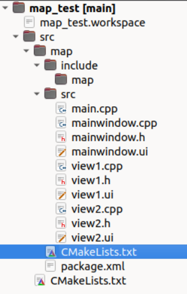

1、在对主 ui 界面进行类型提升时，遇到问题：

```
/home/yin-roc/build-test1-Desktop_Qt_6_6_2_GCC_64bit-Debug/test1_autogen/include/ui_mainwindow.h:18: error: formtest.h: No such file or directory In file included from /home/yin-roc/test1/mainwindow.cpp:2: test1_autogen/include/./ui_mainwindow.h:18:10: fatal error: formtest.h: No such file or directory   18 | #include <formtest.h>
```

找到该文件路径，并强制性包含该文件：

```
target_include_directories(map PRIVATE /home/yin-roc/1_Code/Ubuntu20.04/Workspace/map_test/src/map/src)
```

采用相对路径：

```
target_include_directories(map PRIVATE ${CMAKE_CURRENT_SOURCE_DIR}/src)
```

我的文件结构如下：



${CMAKE_CURRENT_SOURCE_DIR}是指 CMakelists.txt 文件所在路径。