Qt学习目录

[TOC]


## 快捷键

1、ctrl + sapce：在函数的括号内，快速查看该函数的各个参数定义；

2、fn+F1：在函数名中间按下该快捷键，快速打开帮助文件查看定义


## 1、Qt的几个名词和概念

Qt：一个==跨平台==的C++==图形用户界面应用程序框架==，支持Win、Mac和Unix。

Qt Creator：IDE，集成开发环境，类似于Visual Studio，包括C++编辑器、项目生成管理工具、图形界面的调试器等

Qt Designer：专门用来设计图形界面的。包含在Qt Creator里面。


## 2、视频02：创建一个Qt工程helloworld

1、选择创建 Qt Widgets Application：窗体小部件；并选择项目位置；


2、定义类信息

Dialog：对话框

生成的自定义类名为HelloDialog，是从基类QDialog派生而来。


3、项目的汇总信息：


4、项目创建完成：

helloworld.pro：整个项目的工程文件，包含了项目的基本信息；

hellodialog.h、hellodialog.cpp、main.cpp：自定义类的一些C++文件；

hellodialog.ui：设计的界面文件


## 3、视频03：项目运行发布和设置图标

### 1、配置电脑Qt环境

1、问题：编译好的exe文件打开不了？


2、原因：Qt的一些ddl环境没有加入电脑环境

3、解决方法：

我的电脑$\rightarrow$属性$\rightarrow$高级系统设置$\rightarrow$环境变量$\rightarrow$系统变量$\rightarrow$Path$\rightarrow$编辑$\rightarrow$新建$\rightarrow$浏览$\rightarrow$Qt安装位置里面的bin

设置好环境变量之后，便可以打开helloworld.exe文件

### 2、release版本与Debug版本

Debug版本：helloworld.exe占据1Mb

Release版本：helloworld.exe占据25kb

左下角选择版本为Release版本。


### 3、问题：文件打包给别人，却因为没有Qt后者没有加入相关环境而导致无法打开


因为电脑的环境变量已设置（如第一点），直接使用windeployqt.exe

使用Qt 5.6 for Desktop 打开如下：


使用Qt的工具windeployqt给可执行文件helloworld.exe添加动态链接库（动态编译、动态链接的方式）

格式：

```
windeployqt 可执行文件所在的文件路径
```


效果如下：


效果如下：


### 4、添加自动图标

1、图表样式如下图所示（要将图标放入helloworld工程里面，而不是Debug/Release版本）：


2、重新打开工程文件并在helloworld.pro文件里面添加如下所示代码：

```
RC_ICONS = myico.ico
```


3、重新运行，发现图标都变样了：


## 4、视频04：项目文件组成及分析

### 1、QWidget

​		可视界面的基类

### 2、MyFirst_Widget.pro

​		文件代码内容：

```
QT       += core gui 
// 核心图形用户界面，如果是基于控制台/命令的则不需要这行代码
// 如果有对话框，则自动添加

//QT		 += sql //如果用到数据库，则将对应模块添加

greaterThan(QT_MAJOR_VERSION, 4): QT += widgets
// 条件执行语句，如果当前QT的版本大于4，当前项目加入 widgets 模块，QT4之前用的更多的是GUI，为了兼容之前版本

TARGET = MyFirst_Widget
// 生成的可执行文件名称

TEMPLATE = app
// 生成出一般的应用程序

SOURCES += main.cpp\
        widget.cpp
        // 源文件

HEADERS  += widget.h
// 头文件

FORMS    += widget.ui
// ui文件

```


### 3、信号与槽

给对话框添加一个按钮，右下角改名为：Close，点击Close则退出当前对话框：widget


### 4、main文件解析

```
#include "widget.h"
#include <QApplication>

int main(int argc, char *argv[])
{
    QApplication a(argc, argv);
    // Qt的标准应用程序类，任何Qt Widget程序都要有一个 QApplication 对象
    
    Widget w;
    // 创建一个窗体对象
    
    w.show();
	// 展示窗体
	
    return a.exec();
    // 启动应用程序的执行
}

```


### 5、Widget.h文件解析

```
#ifndef WIDGET_H
#define WIDGET_H

#include <QWidget>

namespace Ui {
class Widget;
}
// 定义了一个名称空间 Ui，在里面使用一个类

// --------------------------------------
// 上述 Widget 类与下方的 Widget 并非同一个类
// --------------------------------------

// -------------此处 Widget 为自定义类------
// 来自于 QWidget 类
class Widget : public QWidget
{
    Q_OBJECT
    // QT中使用了信号与槽都需要使用这个宏

public:
    explicit Widget(QWidget *parent = 0);
    ~Widget();

private:
    Ui::Widget *ui;
    // 这里的 ui 指针是在 Ui 命名空间里面的 Widget类的指针
};

#endif // WIDGET_H
```


解释Ui里面 Widget 类的由来

1、下图所示 ui_widget.h 并没有出现在工程目录当中，只出现在文件夹里面


2、打开ui_widget.h


3、Ui里面Widget的来源如上图所示

4、设置的按钮操作也会显示在这里：


### 6、widget.cpp文件解析

1、代码

```
#include "widget.h"
#include "ui_widget.h"

Widget::Widget(QWidget *parent) : QWidget(parent), ui(new Ui::Widget)
    // 初始化列表，派生类的初始化要先初始化基类QWidget
{
    ui->setupUi(this);
    // setupUi用来设置窗口各种控件的属性，（在ui_widget.h文件里面）
}

Widget::~Widget()
{
    delete ui;
    // 构造函数出现了 new
}
```


ui创建了一个label和PushButton，都会出现在Ui_Widget类里面


### 7、Widget.ui文件

编译Ui界面时，会自动生成出相应代码，无需手动敲入代码


## 5、视频05：代码化UI设计

纯代码设计

### 1、创建项目工程

1)修改处1：


1-1）修改处2：


2）编写代码时借助用户帮助手册，如图所示路径：


具体操作如图所示，搜索QLabel，右边可以看到其头文件、父类为QFrame


QFrame的父类为QWidget


QFrame又是从QObject继承而来


### 2、代码编写

```c++
#include "widget.h"
#include <QLabel>
#include <QPushButton>

Widget::Widget(QWidget *parent)
    : QWidget(parent)
{
//    QLabel * label = new QLabel;
    QLabel * label = new QLabel(this); // 3.修改代码，代替注释1和2
    label->setText("I love you, Rock!"); // 标签内容填写
    label->move(150, 100); // 6.设置标签在框内的出现位置

    QPushButton * button = new QPushButton(this);
    button->setText("Close");
    button->move(150, 180);

//    label->show();  // 1.展示新建标签
//    label->setParent(this); // 2.设置标签的从属关系，防止各自成户
//    resize(400, 300); // 4.预设了大小，但是鼠标可以修改大小
    setFixedSize(400, 300); // 5.锁定大小
    setWindowTitle("My first NO UI"); // 7.修改框体名称

}

Widget::~Widget()
{
}
```


### 3、代码化UI与可视化UI的区别

1. 纯代码化UI不如可视化UI直接，效率低、过程繁琐，但是无所不能。
2. 有些组件无法在可视化UI中设计


### 4、Qt里面的Qt助手

使用命令行输入：assistant


## 6、视频06：对象树

### 1、问题：出现new却没有delete


### 2、原因

QObjects使用对象树来进行管理。


**[QObject](qobject.html)[s](qobject.html) organize themselves in object trees. When you create a [QObject](qobject.html) with another object as parent, it's added to the parent's [children()](qobject.html#children) list, and is deleted when the parent is. It turns out that this approach fits the needs of GUI objects very well. For example, a [QShortcut](../qtwidgets/qshortcut.html) (keyboard shortcut) is a child of the relevant window, so when the user closes that window, the shortcut is deleted too.**

当你创建一个QObject并指定另一个对象为其父对象时，这个QObject会被添加到父对象的children()列表中，并在父对象被删除时一并删除。这种方法非常适用于GUI对象的需求。举例来说，一个QShortcut（键盘快捷键）是相关窗口的子对象，因此当用户关闭该窗口时，快捷键也会被删除。


[QQuickItem](../qtquick/qquickitem.html), the basic visual element of the Qt Quick module, inherits from [QObject](qobject.html), but has a concept of the *visual parent* which differs from that of the [*QObject*](qobject.html) *parent*. An item's visual parent may not necessarily be the same as its object parent. See [Concepts - Visual Parent in Qt Quick](../qtquick/qtquick-visualcanvas-visualparent.html) for more details.


**[QWidget](../qtwidgets/qwidget.html), the fundamental class of the Qt Widgets module, extends the parent-child relationship. A child normally also becomes a child widget, i.e. it is displayed in its parent's coordinate system and is graphically clipped by its parent's boundaries. For example, when the application deletes a message box after it has been closed, the message box's buttons and label are also deleted, just as we'd want, because the buttons and label are children of the message box.**

QWidget则是Qt Widgets模块的基础类，它扩展了父子关系。一个子对象通常也成为一个子窗口部件，即以其父窗口部件的坐标系进行显示，并在图形上受到其父窗口部件边界的裁剪。例如，当应用程序在消息框关闭后删除它时，消息框的按钮和标签也会被删除，这正是我们期望的，因为按钮和标签是消息框的子对象。


You can also delete child objects yourself, and they will remove themselves from their parents. For example, when the user removes a toolbar it may lead to the application deleting one of its [QToolBar](../qtwidgets/qtoolbar.html) objects, in which case the tool bar's [QMainWindow](../qtwidgets/qmainwindow.html) parent would detect the change and reconfigure its screen space accordingly.

The debugging functions [QObject](qobject.html#dumpObjectTree)[::dumpObjectTree](qobject.html#dumpObjectTree)() and [QObject](qobject.html#dumpObjectInfo)[::dumpObjectInfo](qobject.html#dumpObjectInfo)() are often useful when an application looks or acts strangely. 


### 3、代码验证

1）添加一个C++类，看关闭窗体会不会自动销毁new开辟的内存


2）添加部分代码

qmyclass.h:


qmyclass.cpp:


widget.cpp:


3)输出


### 4、QDebug

1）介绍

QDebug 是 Qt 框架提供的一个调试输出类，用于在调试过程中输出信息。它类似于 C++ 的 `std::cout` 或者 `printf`，但提供了更多的功能和灵活性。QDebug 可以输出各种数据类型，如字符串、整数、浮点数、对象等，并且可以方便地输出 Qt 特有的数据类型，比如 QString、QList 等。


2）输出形式


### 5、结论

窗体上只需new，而不用使用delete

1、析构函数会自动释放new开辟的内存空间，自动delete；

2、在这个窗体上开发的其他组件，析构函数会自动调用


## 7、视频07：信号与槽

### 1、概念

两者通过connect函数相关联


### 2、代码分析

1) widget.h文件：

这里的指针ui指向的是窗体Widget


2）widget.cpp文件

这里的connect对应connect函数的格式理解；

这里的函数都是系统自带的函数，已经封装实现。


那么，想要自定义信号和槽，用一个类的信号去触发另一个类的槽

3）在现有工程中添加一个类MyClass1，作为信号，并添加


有信号和槽，要加Q_OBJECT，自定义信号，只写原型，不写实现：


4）在现有工程添加类：MyClass2，作为槽：


槽需要定义函数的实现：


实现两者的关联，仿照ui指针的写法：


5）==问题==：实例化对象，链接信号与槽后，发现控制台没有输出，说明没有执行析构函数，说明没有执行第二个connect！


==原因==：因为没有触发信号，所以需要新增一按钮，点击一次触发一次信号


6）解决方案：设置按钮的触发形式为单击


6-1）添加后出现如图所示，自动出现按钮单击代码框架：


6-2）添加代码作为验证按钮是否被单击，信号能否跳到这个槽：


验证发现，控制台能够输出槽：


7）想要显示点击的次数，修改部分代码：


最终结果如图所示：


## 8、视频08：信号与槽补充

视频7所用的方法为：通过新增一个按钮，通过点击按钮，触发与之绑定的槽函数，槽函数中存有信号1的触发函数。进而触发MySlot槽。

即：按钮点击信号$\Rightarrow$按钮槽函数$\Rightarrow$信号1$\Rightarrow$槽（MySlot）


本届新介绍的一个方法：

​												信号1$\Rightarrow$信号2$\Rightarrow$槽

其中，信号1：按钮按下的那个信号。


结果发现：应用程序有输出。


至此，信号1$\Rightarrow$信号2$\Rightarrow$槽的实现完成；接下来则是一个信号出发多个槽：例如：信号1触发槽1和槽2。

如下所示：


同样，还有取消两者的关联，例如：取消pushButton_3的关联


## 9、视频09：QMainWindow菜单栏和工具栏

### 1、介绍


QMainWindow框架：菜单栏、工具栏、悬浮窗口、中心部件和状态栏


### 2、代码实现

这里采用纯代码实现

1)创建工程项目


2）配置菜单栏


3）配置工具栏

菜单栏只有一个，所以用setMenuBar，而工具栏可以有多个，所以用addToolBar


4）分隔符设置


## 10、视频10：QMainWindow状态栏\_停靠窗口\_中心组件

### 1、状态栏

头文件：

```
#include <QStatusBar>
#include <QLabel>
```

代码：

一般只有一个状态栏，所以用set

```c++
// QStatusBar 状态栏
    QStatusBar *stbar = new QStatusBar(this);
    setStatusBar(stbar);
    QLabel * label = new QLabel(this);
    label->setText("状态栏");
    stbar->addWidget(label);
```


### 2、浮动窗口

1、头文件：

```
#include <QDockWidget>
```

2、代码：

一般可以拥有多个中心组件，所以用add

```
// QDockWidget 浮动窗口
    //    QDockWidget *dockwidget = new QDockWidget(this);
    QDockWidget *dockwidget = new QDockWidget("小窗口",this); // 给停靠窗口加个名称

    // 放在中心部件的左(Left)/右(Right)/上(Top)/下(Buttom)位置，但是若没有中心部件则无论如何规划DockWidget的位置，都无法体现出方位
    addDockWidget(Qt::LeftDockWidgetArea, dockwidget);
```


### 3、中心组件

1、头文件：

```
#include <QTextEdit>
```

2、代码：

一般只有一个中心部件，所以用set

```
 // Central Widget 中心组件
    QTextEdit * edit = new QTextEdit(this);
    setCentralWidget(edit);
```


## 11、视频11：Ui方式创建QMainWindow_添加资源文件

### 1、Ui方式创建QMainWindow窗口

#### 1.1添加菜单栏

直接输入文字；

通过在文本框类似于（&F）的格式，直接绑定快捷键。

tips：如果输入不了中文，可在右侧绿色title处修改为中文


#### 1.2添加工具栏

右击MainWindow添加工具栏


如有需要，可以直接从下方拖拽相应部件加入工具栏：


#### 1.3浮动窗口

在左侧各种部件中加入Dock Widget（浮动窗口）


右下角的allowedAreas可以选择浮动窗口可以停靠的部位：


#### 1.4中心部件

同样在左侧选择中心部件为文本编辑，可以自由编辑大小


#### 1.5运行效果图

运行后的界面如图所示：


### 2、添加资源文件

#### 2.1将相应图标文件加入源代码文件

​		这里的是Images

配置界面过程中，Ui界面可以看到图标，而运行起来没有相应图标；

一开始出现问题，Ui设计界面有图标，但运行后的界面没有图标显示：


#### 2.2解决措施

取消左侧项目栏中的Shadow build，但这会导致源码文件和编译文件混合在一起，这也就是Shadow build勾选的作用


也可以采用不使用Ui界面设计，使用纯代码设计。

恢复刚开始的无图标Ui：删除该图标，可以选择最右侧的键位


#### 2.3纯代码设计：

```c++
ui->action_N->setIcon(QIcon("/home/yin-roc/1_Code/Ubuntu20.04/Qt_Project_Code/08_QMainWindows_Ui/QMainWindows_Ui/Images/new.png"));
ui->action_O->setIcon(QIcon("/home/yin-roc/1_Code/Ubuntu20.04/Qt_Project_Code/08_QMainWindows_Ui/QMainWindows_Ui/Images/open.png"));
```

#### 2.4资源文件

但这个也带来问题，这段程序使用的照片是本电脑的路径，移植到另一台电脑则不会显示，因此需要使用资源文件这个方法

（1）新建源文件：


（2）路径放在原代码中，命名为resource，会生成resource.qrc文件


（3）创建完毕之后，右击resource.qrc选择Open in Editor


（4）添加前缀为/Image后，选择为此前缀添加文件：


（5）修改相应代码：

```C++
#include "mainwindow.h"
#include "ui_mainwindow.h"

MainWindow::MainWindow(QWidget *parent)
    : QMainWindow(parent)
    , ui(new Ui::MainWindow)
{
    ui->setupUi(this);

    // 可以用但也比较麻烦，换台电脑可能就实现不了，需要添加相应的资源文件
//    ui->action_N->setIcon(QIcon("/home/yin-roc/1_Code/Ubuntu20.04/Qt_Project_Code/08_QMainWindows_Ui/QMainWindows_Ui/Images/new.png"));
//    ui->action_O->setIcon(QIcon("/home/yin-roc/1_Code/Ubuntu20.04/Qt_Project_Code/08_QMainWindows_Ui/QMainWindows_Ui/Images/open.png"));

    //加载资源路径
    // 添加Qt资源文件是使用格式    "：+前缀+文件名"
    ui->action_N->setIcon(QIcon(":/Image/Images/new.png"));
    ui->action_O->setIcon(QIcon(":/Image/Images/open.png"));

}

MainWindow::~MainWindow()
{
    delete ui;
}
```

（6）运行结果图


## 12、视频12：模态和非模态对话框

### 1、Qt自带的标准对话框：

1. 颜色对话框
2. 文件对话框
3. 字体对话框
4. 输入对话框
5. 消息对话框
6. 进度对话框
7. 错误信息对话框
8. 向导对话框


### 2、模态和非模态对话框

模态对话框：在没有被关闭之前，用户不能与同一个应用程序的其他窗口进行交互，直到该对话框关闭。
非模态对话框：当被打开时，用户既可选择和该对话框进行交互，也可以选择同应用程序的其他窗口交互。

#### 2.1非模态对话框

代码：

```c++
#include "mainwindow.h"
#include "ui_mainwindow.h"

#include <QDialog>

MainWindow::MainWindow(QWidget *parent)
    : QMainWindow(parent)
    , ui(new Ui::MainWindow)
{
    ui->setupUi(this);

    QDialog * dialog = new QDialog(this);
    dialog->resize(200, 100);
    dialog->show();     // 非模态对话框

    //加载资源路径
    // 添加Qt资源文件是使用格式    "：+前缀+文件名"
    ui->action_N->setIcon(QIcon(":/Image/Images/new.png"));
    ui->action_O->setIcon(QIcon(":/Image/Images/open.png"));

}

MainWindow::~MainWindow()
{
    delete ui;
}
```

效果：可以在不关闭模态对话框的情况下，于mainWindow里编辑文字


####  2.2模态对话框

方式1：调用阻塞函数exec()，==关掉该窗口才会出现主窗口==。

```c++
#include "mainwindow.h"
#include "ui_mainwindow.h"

#include <QDialog>

MainWindow::MainWindow(QWidget *parent)
    : QMainWindow(parent)
    , ui(new Ui::MainWindow)
{
    ui->setupUi(this);

    QDialog * dialog = new QDialog(this);
    dialog->resize(200, 100);
//    dialog->show();     // 非模态对话框

    dialog->exec(); // exec是一个阻塞函数，关掉该窗口才会出现主窗口 // 模态对话框 方式1

    //加载资源路径
    // 添加Qt资源文件是使用格式    "：+前缀+文件名"
    ui->action_N->setIcon(QIcon(":/Image/Images/new.png"));
    ui->action_O->setIcon(QIcon(":/Image/Images/open.png"));

}

MainWindow::~MainWindow()
{
    delete ui;
}
```

方式2：==关掉该窗口才能在MainWindow里面编辑文字==

```c++
#include "mainwindow.h"
#include "ui_mainwindow.h"

#include <QDialog>

MainWindow::MainWindow(QWidget *parent)
    : QMainWindow(parent)
    , ui(new Ui::MainWindow)
{
    ui->setupUi(this);

    QDialog * dialog = new QDialog(this);
    dialog->resize(200, 100);
//    dialog->show();     // 非模态对话框

//    dialog->exec(); // exec是一个阻塞函数，关掉该窗口才会出现主窗口 // 模态对话框 方式1

    dialog->setModal(true); // 模态对话框 方式2
    dialog->show();

    //加载资源路径
    // 添加Qt资源文件是使用格式    "：+前缀+文件名"
    ui->action_N->setIcon(QIcon(":/Image/Images/new.png"));
    ui->action_O->setIcon(QIcon(":/Image/Images/open.png"));

}

MainWindow::~MainWindow()
{
    delete ui;
}
```

问题：new开辟的不需要显式的使用delete，因为窗口MainWindow一关闭就会自动调用相应的内存释放函数    但极端情况下，出现模态的模态的......，内存总会占满，此时只能等到最后一个窗口关闭才能释放内存，因此需要改进措施

解决措施：

```
dialog->setAttribute(Qt::WA_DeleteOnClose); // 只要模态窗口被关闭，就是释放内存
```


## 13、视频13：标准对话框_1

### 1、本节内容

共有四种文本框：

1. 颜色对话框
2. 文件对话框
3. 字体对话框
4. 输入对话框
5. 

### 2、Ui界面

建立在上一视频基础之上，设计如下图所示四个文本框：


并将它们与槽关联，关联信号为单击。


### 3、颜色文本框

3.1	头文件

```
#include <QColorDialog> // 颜色对话框
```

3.2	代码

使用静态成员函数来实现，即通过类名来调用相关的函数，不用再费劲创建指针来调用相关函数。

```c++
void MainWindow::on_pushButton_clicked()
{
//    QColorDialog dialog(this);

//    换一种方式来实现
    QColor color = QColorDialog::getColor(Qt::red, this);
    qDebug() << "color: " << color;
}
```


### 4、文件对话框

4.1	头文件

```
#include <QFileDialog>
```

4.2	代码

```c++
void MainWindow::on_pushButton_2_clicked()
{
    QString filename = QFileDialog::getOpenFileName(this, "Open File", "/home/yin-roc/1_Code/Ubuntu20.04/Qt_Project_Code/10_Standard_dialog_1/QMainWindows_Ui");
    
    QString filename = QFileDialog::getOpenFileName(this, "Open File", "/home/yin-roc/1_Code/Ubuntu20.04/Qt_Project_Code/10_Standard_dialog_1/QMainWindows_Ui", "图片文件(*.png *.jpg)");
    qDebug() << "filename: " << filename;
}
```

```
QFileDialog::getOpenFileName()
```

1. 参数1：父对象；
2. 参数2：对话框标题；
3. 参数3：具体地址；
4. 参数4：要检索的文件名称+文件格式

4.3	运行结果


### 5、字体对话框

5.1	头文件

```
#include <QFontDialog>
```

5.2	代码

```c++
void MainWindow::on_pushButton_3_clicked()
{
    bool ok;

    QFont font = QFontDialog::getFont(&ok, this);
    if(ok)
    {
        ui->pushButton_3->setFont(font);
    }
    else
    {
        qDebug() << "没有选择任何字体" << endl;
    }
}
```


5.3	运行结果

对比发现，字体按钮的文字发生改变。


### 6、输入对话框

6.1	头文件

```
#include <QInputDialog>
```

6.2	代码

```c++
void MainWindow::on_pushButton_4_clicked()
{
    bool ok;
    QString string = QInputDialog::getText(this, "输入字符串对话框", "请输入用户名", QLineEdit::Normal, "Hello world", &ok);
//    QLineEdit::Password 在输入密码时，显示的字符是平台依赖的密码掩码字符，而不是用户实际输入的字符
    if(ok)
        qDebug() << "string: " << string;

    int value = QInputDialog::getInt(this, "输入整数对话框", "请输入0～100的整数", 0, 0, 100, 1, &ok);
    if(ok)
        qDebug() << "Value = " << value;
}
```

函数1：

```
QInputDialog::getText()
```

1. 参数1：父对象
2. 参数2：对话框标题
3. 参数3：对话框标签
4. 参数4：对话框编辑格式分为四种QLineEdit::Normal、QLineEdit::NoEcho、QLineEdit::Password和QLineEdit::PasswordEchoOnEdit
5. 参数5：输入框内的默认字符串
6. 参数6：布尔值

函数2：

```
QInputDialog::getInt（）
```

1. 参数1：父对象
2. 参数2：对话框标题
3. 参数3：对话框标签
4. 参数4：输入框内的默认值
5. 参数5：输入框内的允许的最小值
6. 参数6：输入框内允许的最大值
7. 参数7：输入框内的数字步长
8. 参数8：布尔值

6.3	运行结果


应用程序输出：


## 14、视频14：标准对话框_2

### 1、本节内容

1. 消息对话框
2. 进度对话框

### 2、消息对话框

2.1	头文件

```
#include <QMessageBox>
```

2.2	代码

对应运行结果各个参数的意思

```c++
void MainWindow::on_pushButton_5_clicked()
{
    // 问题对话框
    int ret1 = QMessageBox::question(this, "问题对话框", "你是否使用Qt", QMessageBox::Yes, QMessageBox::No);
    if(ret1 == QMessageBox::Yes)
        qDebug() << "Great";

    // 提示对话框
    QMessageBox::information(this, "提示对话框", "你最好使用Qt", QMessageBox::Ok);

    // 警告对话框
    QMessageBox::warning(this, "警告对话框", "请停止使用其他GUI", QMessageBox::Ok);

    // 错误对话框
    QMessageBox::critical(this, "错误对话框", "重大错误", QMessageBox::Retry);

    // 关于对话框
    QMessageBox::about(this, "关于对话框", "我爱Rick");

}
```

2.3	运行结果


### 3、进度对话框

3.1	头文件

```
#include <QProgressDialog>
```

3.2	代码

```c++
void MainWindow::on_pushButton_6_clicked()
{
//    QProgressDialog * prodlg = new QProgressDialog(); // 指针存放在栈区，只要主窗口不关闭，随时可用
    QProgressDialog prodlg("复制内容", "取消", 0, 1000000, this); // 直接创建类对象，对象存放在堆，函数结束就会释放内存
    prodlg.setWindowTitle("复制文件");
    prodlg.setWindowModality(Qt::WindowModal); // 设置该进度窗口为模态，中途不可打断
    prodlg.show();

    for(int i = 0; i < 1000000; i++)
    {
        prodlg.setValue(i);

        QCoreApplication::processEvents();

        if(prodlg.wasCanceled())
            break;
    }
    prodlg.setValue(1000000); // 范围是0～49999，可能显示不了50000
    qDebug() << "拷贝完成";

}
```


```
QCoreApplication::processEvents()
```

目的是允许在进度对话框更新进度条的同时，也能够响应其他用户事件，以保持界面的交互性。


```
prodlg.setValue(i)
```

这个函数用于设置进度对话框中的进度值，即更新进度条的当前值。通过在循环中调用这个函数，并传递适当的值，可以实时更新进度条的状态，让用户了解到操作的进展情况。


3.3	运行结果


## 15、视频15：标准对话框_3

### 1、本节概要

1. 错误消息对话框
2. 向导对话框


### 2、错误对话框

2.1	头文件

```
#include <QErrorMessage>
```

2.2	代码

```c++
// 错误信息对话框(经常用消息对话框显示)
void MainWindow::on_pushButton_7_clicked()
{
//    QErrorMessage errordlg(this);
//    问题1：即便勾选了don't show again，下次还会再次显现出来，因为重新开始是一个新的对象
//    解决1：开辟一个内存空间，创建一个变量，共用该变量

//    但问题2：每点一次按钮，也会new新开辟一段内存
//    QErrorMessage * errordlg = new QErrorMessage(this);
//    解决2：将 QErrorMessage * errordlg = new QErrorMessage(this); 放在主窗口里面

//    但问题3：本函数想要使用的errordlg变量却在主窗口函数里面，MainWindow函数结束后，该变量便失去了作用,其他函数不能够调用本函数
//    解决3：定义为全局变量，将新建的变量放在类里面，在MainWindow函数里面分配内存，在槽函数里面进行具体操作
    errordlg->setWindowTitle("错误");
    errordlg->showMessage("危险");
    errordlg->exec();
}
```

2.3	运行结果

问题1：即使去掉了勾选Show this message again，下面界面关掉重新打开之后，依旧会自动被重新勾选


改正后的结果：取消勾选之后重新运行也不会再被勾选。

### 3、向导对话框

3.1	头文件

```
#include <QWizard>
```

3.2	代码

```c++
//向导对话框

QWizardPage* createPage1(void)
{
    QWizardPage *page = new QWizardPage;
    page->setTitle("第一步操作");
    return page;
}

QWizardPage* createPage2(void)
{
    QWizardPage *page = new QWizardPage;
    page->setTitle("第二步操作");
    return page;
}

void MainWindow::on_pushButton_8_clicked()
{
    QWizard wizard(this);
    wizard.setWindowTitle("向导对话框");
    wizard.addPage(createPage1());
    wizard.addPage(createPage2());
    wizard.exec();
}
```

3.3	运行结果


## 16、视频16：按钮控件组

### 1、Tool Button

1.1	介绍

用于工具栏、工具箱或其他工具集的小部件，它可以显示文本、图像或两者结合。

1.2 	测试案例

1、插入Tool Button按钮


2、插入资源文件小悟空照片


右击resources.qrc选择Open in Editor，添加前缀、添加文件：


添加资源文件：


一个突出对比度，一个使文字和图片同时出现：


3、运行结果示意图


### 2、RadioButton

2.1	介绍

QRadioButton 用于创建单选按钮。多个单选按钮可以分组在一起，形成一个单选按钮组。

2.2	测试案例

1、插入按钮Radio Button


2、但一开始没有选择默认按钮，如下代码，默认选择按钮2：

```
ui->radioButton_2->setChecked(true);
```

3、运行结果


4、但是多添加了一组成绩按钮，发现点击成绩栏后，原先默认选择的二年级按钮不再显示选中：


5、使用Group Box解决，但注意是将Tool Button移入Group Box，而不是简单用Group Box包住所有Tool Button，结果如下：


6、设计一个提示框，当分数低于60时，输出：失败

如图所示，使用connect函数连接：


7、创建一个类：MyClass，并添加槽函数：void MySlot(void)


8、connect函数

```
connect(senderObject, &SenderClass::signalName, receiverObject, &ReceiverClass::slotName);
```

- `senderObject`：是发送信号的对象，即 `ui->radioButton_5`，一个 `QRadioButton` 实例。
- `SenderClass::signalName`：代表信号的名称和类型。这里使用了新的信号与槽语法，使用 `&QRadioButton::clicked` 表示 `QRadioButton` 类的 `clicked` 信号。
- `receiverObject`：接收信号的对象，即 `mc`，一个 `MyClass` 实例。
- `ReceiverClass::slotName`：槽函数的名称。在这里，`&MyClass::MySlot` 是 `MyClass` 类中的名为 `MySlot` 的槽函数。


例子：

```
connect(ui->radioButton_5, &QRadioButton::clicked, mc, &MyClass::MySlot);
```

9、运行结果


### 3、Check Box

3.1	介绍

在Qt中，QCheckBox是一个复选框部件，允许用户在两种状态之间切换，通常用于启用或禁用一个选项。

3.2	测试案例

1、插入按钮check box，并选择三模态按钮：


2、运行结果


## 17、视频17：List Widget控件

### 1、介绍

在Qt中，List Widget是一个用于显示和管理项目列表的组件。它允许你以列表的形式显示项目，并且可以对这些项目进行操作和管理。List Widget提供了一个灵活的界面，可以用来展示文本、图像等项目，并支持用户交互。


### 2、代码

```c++
ui->listWidget->addItem("Hello world");
ui->listWidget->addItem("good morning");

QListWidgetItem * listitem = new QListWidgetItem("I love you, Rick!");
ui->listWidget->addItem(listitem);
listitem->setTextAlignment(Qt::AlignHCenter); // 居中显示

QStringList list2; // 字符串容器
list2 << "ABCD" << "EFGH" << "IJKL" << "LMNO";
ui->listWidget_2->addItems(list2);
```

### 3、运行结果


## 18、视频18：Tree Widget控件

### 1、介绍

Tree widget控件通常用于在用户界面中==显示层次结构数据==，类似于==树状图==。它允许用户展开和折叠节点，以便查看和管理复杂的数据结构。

### 2、代码

```c++
#include "widget.h"
#include "ui_widget.h"

Widget::Widget(QWidget *parent)
    : QWidget(parent)
    , ui(new Ui::Widget)
{
    ui->setupUi(this);

//    QStringList list; // 创建一个对象
//    list << "Name" << "Address";
//    ui->treeWidget->setHeaderLabels(list); // 添加一级分支

    ui->treeWidget->setHeaderLabels(QStringList() << "Name" << "Address"); // 使用构造函数创建出一个匿名的对象

    QTreeWidgetItem * treeitem1 = new QTreeWidgetItem(QStringList("Bookmarks Toolbar"));
    ui->treeWidget->addTopLevelItem(treeitem1);
    QTreeWidgetItem * treeitem2 = new QTreeWidgetItem(QStringList("Bookmarks Menu"));
    ui->treeWidget->addTopLevelItem(treeitem2);

    treeitem1->setIcon(0, QIcon(":/Image/Images/folder.png")); // 列数从第0列开始
    treeitem2->setIcon(0, QIcon(":/Image/Images/folder.png"));

    QTreeWidgetItem * childitem1 = new QTreeWidgetItem(QStringList() << "QWidget" << "Page10");
    treeitem1->addChild(childitem1);

    QTreeWidgetItem * childitem2 = new QTreeWidgetItem(QStringList() << "QMainWindow" << "Page20");
    treeitem1->addChild(childitem2);

    QTreeWidgetItem * childitem3 = new QTreeWidgetItem(QStringList() << "QPushButton" << "Page30");
    treeitem2->addChild(childitem3);

    QTreeWidgetItem * childitem4 = new QTreeWidgetItem(QStringList() << "QLabel" << "Page40");
    treeitem2->addChild(childitem4);
}

Widget::~Widget()
{
    delete ui;
}
```

### 3、运行结果


### 4、具体步骤

4.1	Ui界面添加Tree Widget

在ui界面添加相应的Tree Widget


4.2	双击该控件添加相应的内容

列为标签，项目为该列下的一级标题：


4.3	运行结果如图所示


4.4	代码实现Tree Widget

方法1：创建QStringList类的对象（list），QStringList 是 Qt 框架中常用的数据类型，用于存储字符串列表。它是 QString 类的一个特殊容器，能够有效地管理和操作字符串列表。


方法2：使用流操作符赋值

使用了 C++ 中的流操作符 `<<` 来向 `QStringList` 中添加元素。在这个上下文中，`QStringList() << "Name" << "Address"` 使用了流式操作符 `<<` 将字符串 "Name" 和 "Address" 依次添加到 `QStringList` ，结果如下所示，在Name列下添加两项：Bookmarks Toolbar、Bookmarks Menu


4.5	在标签前添加图标

列数从第0列开始，如下图所示：


4.6	给一级分支下添加二级分支


##  19、视频19：Table Widget控件

### 1、介绍

QTableWidget 是 Qt 框架提供的一个用于显示和编辑表格数据的控件。它是基于 QTableView 的高级封装，提供了更简单的接口和功能。

### 2、代码

```c++
#include "widget.h"
#include "ui_widget.h"

Widget::Widget(QWidget *parent)
    : QWidget(parent)
    , ui(new Ui::Widget)
{
    ui->setupUi(this);

    ui->tableWidget->setColumnCount(3);
    ui->tableWidget->setRowCount(3);

    ui->tableWidget->setHorizontalHeaderLabels(QStringList() << "Name" << "Sex" << "Age");

    //ui->tableWidget->setItem(0, 0, new QTableWidgetItem("Rick")); // 逐行添加太过麻烦

    QStringList NameList;
    NameList << "Rick" << "Jack" << "Nichael";

    QStringList SexList;
    SexList << "Male" << "Male" << "Male";

    QStringList AgeList;
    AgeList << "Rick" << "Jack" << "Nichael";


    for(int row = 0; row < 3; row++)
    {
        int col = 0;
        ui->tableWidget->setItem(row, col++, new QTableWidgetItem(NameList[row]));
        ui->tableWidget->setItem(row, col++, new QTableWidgetItem(SexList[row]));
        ui->tableWidget->setItem(row, col, new QTableWidgetItem(QString::number(20))); // int --> string，单纯int类型在里面是
    }
}

Widget::~Widget()
{
    delete ui;
}
```

3、运行结果


### 4、具体步骤

4.1	在Ui界面添加相应控件，设置Table的 行数与列数，并添加各自标题


4.2	在第一行第一列添加姓名

注意是从0开始计数，但这样计算效率太低：


4.3	另一种添加信息的方式


4.4	使用循环与字符串列表填充表格信息

```
QTableWidgetItem(QString::number(20))
// 不能直接填写整形数据，里面对整型数据的定义是type，使用相应的函数将整型转为字符串类型
```

9


## 20、视频20：Containers控件

### 1、Group Box控件

视频16的按钮控件组第三个控件Check Box已经介绍过

### 2、Scroll Area控件

#### 2.1	简介

在Qt中，QScrollArea是用于显示超出可视区域的内容的小部件。它允许用户在一个小部件中查看另一个小部件的全部内容，并通过滚动条来滚动显示区域。

#### 2.2	具体介绍

如图所示，可以选择垂直排列或水平排列


#### 2.3	运行结果


### 3、Tool Box控件

#### 3.1	简介

在Qt中，QToolBox是一个可以容纳多个可折叠项（可折叠小部件）的容器部件。它通常用于创建具有多个页面或选项卡的用户界面，允许用户在其中选择并显示不同的内容或工具。

#### 3.2	具体介绍

插入页：


修改当前项的标签名：


#### 3.3	运行结果


### 4、Tab Widget控件

#### 4.1	简介

在Qt中，QTabWidget是一个用于创建具有选项卡式界面的小部件。它允许用户在同一区域中查看和切换多个相关页面或面板，每个页面都与选项卡关联。

#### 4.2	具体介绍

插入页的操作和Tool Box操作一样


#### 4.3	运行结果


### 5、Stacked Widget控件

#### 5.1	简介

在Qt中，QStackedWidget是一个小部件容器，可以同时容纳多个子部件，但只显示其中一个子部件。它类似于QTabWidget，但不使用选项卡切换，而是使用索引来管理和显示子部件。

#### 5.2	具体介绍

1、通过右上角的符号可以切换当前界面：


2、但是程序运行却没有可以切换的按钮


3、解决方法：刚才的是编辑界面，因此在程序运行后无法切换屏幕。于是设计三个按钮，点击不同而按钮从而切换到不同的界面，如图所示并修改按键文本名称和对象名称；以此类推。


4、测试功能，C++11的标准


5、正式构建两者的连接

发现可以通过点击不同的按钮跳到不同的界面：

```c++
#include "widget.h"
#include "ui_widget.h"
#include <QDebug>

Widget::Widget(QWidget *parent)
    : QWidget(parent)
    , ui(new Ui::Widget)
{
    ui->setupUi(this);
    
    // 一开始弹出默认的界面
    ui->stackedWidget->setCurrentIndex(2);

//    connect(ui->pB_ScrollArea, &QPushButton::clicked, this, [](){qDebug() << "Hello World!";});
//这段代码使用了 C++11 中的 Lambda 表达式。在这里，[](){qDebug() << "Hello World!";} 是一个匿名函数，也称为 Lambda 函数。
//Lambda 表达式的一般结构是 [] (parameters) -> return_type { body }，在这个例子中，它没有参数和返回值，所以[]()是一个空的参数列表，qDebug() << "Hello World!";是函数体。

    connect(ui->pB_ScrollArea, &QPushButton::clicked, this, [&](){ui->stackedWidget->setCurrentIndex(0);});
    connect(ui->pB_ToolBox, &QPushButton::clicked, this, [&](){ui->stackedWidget->setCurrentIndex(1);});
    connect(ui->pB_TabWidget, &QPushButton::clicked, this, [&](){ui->stackedWidget->setCurrentIndex(2);});
        
//	& 表示通过引用捕获外部变量，这里意味着 Lambda 函数可以访问并修改当前作用域（可能是该类的成员函数）中的所有变量。=y
//	() 是空的参数列表，表示这个 Lambda 函数不接受任何参数。
//	{} 中是函数体，包含了要执行的操作：ui->stackedWidget->setCurrentIndex(1); 这行代码用于将 QStackedWidget 中当前显示的页面设置为索引为 1 的页面（通常是第二个页面，索引从 0 开始计数）。

}

Widget::~Widget()
{
    delete ui;
}
```


6、设置一开始弹出的默认界面

```c++
    // 一开始弹出默认的界面
    ui->stackedWidget->setCurrentIndex(2);
```


## 21、视频21：Input Widget控件

### 1、Combo Box

Ui界面：


添加下拉菜单选项：


### 2、Font Combo Box

Ui界面介绍：


设想：下拉菜单中选择字体，点击确认健，标签页中的字体会发生相应的改变：


```c++
connect(ui->pushButton, &QPushButton::clicked, this, [&](){ui->label->setFont(ui->fontComboBox->currentFont());});
```

运行结果：


### 3、Time Edit和Date/Time Edit

Ui界面介绍：


```c++
QDateTime curDateTime = QDateTime::currentDateTime(); // curDateTime里面既有日期也有时间
ui->timeEdit->setTime(curDateTime.time()); // 单独列出时间
ui->dateTimeEdit->setDateTime(curDateTime);
```

运行结果;


## 22、视频22：自定义控件

1、新建Qt设计师界面类

（==此处应该是类名为My_Custom_Controller，这里打成了My_CUstom_Widget，导致后面类名不一致，他两实际上是同一个东西==）


2、编辑my_custom_widget.ui界面


3、在widget.ui界面里面新建Widget


4、将自定义的my_custom_widget.ui界面与widget.ui界面相关联


5、运行当前程序，发现自定义的my_custom_widget.ui界面相关内容已经在widget.ui界面里面显现，但此时两个控件是独立的，两者互不影响。


6、使用connect函数，用spinBox控制horizontalSlider，如下图所示，使用assistant帮助手册来寻找信号Signals的函数表现形式，得到如下两个形式，仔细观察发现是重载函数，暂不确定选择哪一个，继续connect函数的填写

```c++
void valueChanged(const QString &text)
void valueChanged(int i)
```


7、继续填写connect函数，寻找ui->horizontalSlider对应的槽函数（slot），搜索了HorizontalSlider和QHorizontalSlider，都没有发现有这个类，于是尝试寻找QSlider类，发现存在该类，但在Contents中并未找到Slots，于是从基类QAbstractSlider中寻找。


8、在QAbstractSlider类中找到了Public Slots，有如下图所示几个函数，结合QSpinBox类中的valueChanged()函数，最终选择void setValue\(int\)，并反推QSpinBox的信号重载函数选择：void valueChanged(int i)


9、QSlider类是QAbstractSlider类的派生类，所以可以继承其公有函数setValue，又因为取函数的地址只要函数名即可，不能添加具体重载函数区分，因此创建函数指针sbp来代替

```c++
void (QSpinBox:: *sbp)(int) = &QSpinBox::valueChanged;
connect(ui->spinBox, sbp, ui->horizontalSlider, &QSlider::setValue);
```

10、运行结果如图所示，可以通过调节spinBox来调整horizontalSlider，但反过来仍不行，因为还没有构建两者的连接（即配置connect函数）


11、如图所示，horizontalSlider的valueChanged函数并没有重载，故可以直接用常规方法使用，QSpinBox的Slots函数同理。


12、运行结果如图所示


13、新想法：将当前的数值输出，设想：通过点击按钮，输出当前的数值结果到控制台


14、在my_custom_controller类中声明并添加函数定义（==自这里起，已将my_custom_widget全部替换为my_custom_controller==）

```c++
// 函数声明
int get_Current_Value();    

// 函数定义
int My_Custom_Controller::get_Current_Value()
{
    return ui->spinBox->value();
}
```


15、使用connect函数设置Ui界面的按钮（这里的按钮是在widget.ui界面添加的，因此要在widget.cpp文件里面实现）

**==Tip==**：这里的widget是一个小控件，小写的widget，而不是代表整个界面的大写Widget，如图所示，当初第3步，将my_custom_controller.ui界面作为一个widget.ui界面的一个控件Widget插入，其objectName也是小写的widget，所以==代码输出的是小写widget的当前值，若是大写的则报错==。


16、运行结果：如图所示，应用程序有相应的正确输出


## 23、视频23：Label控件

### 1、简介

在Qt中，QLabel 是用于显示文本或图像的控件。它是Qt中常用的部件之一，可以用来展示静态文本、HTML文本或者图像。QLabel 可以包含丰富的文本格式和样式，也支持基本的图像显示。

### 2、文本展示

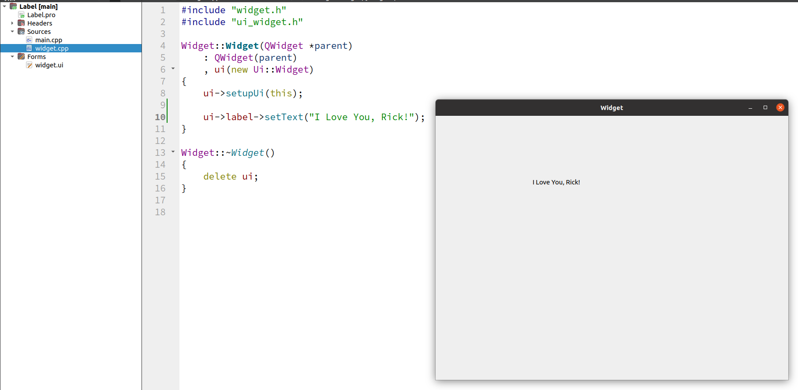

### 3、图像展示

#### 3.1	加载资源文件

#### 3.2	插入静态图片并自动调整图片大小

```c++
ui->label_2->setPixmap(QPixmap(":/Image/Image/1.jpeg")); // 插入图片
ui->label_2->setScaledContents(true);
```

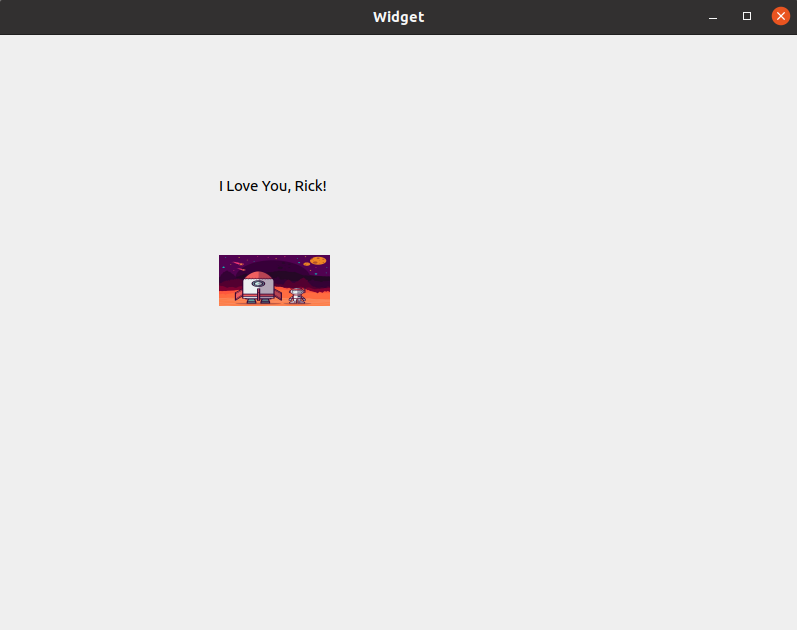


#### 3.3	插入动态GIF图片并自动调整图片大小

```
ui->label_3->setPixmap(QPixmap(":/Image/Image/2.gif"));
ui->label_3->setScaledContents(true);
```

但是最终结果显示的是静态图片，要想显示GIF：

```c++
QMovie *mv = new QMovie(":/Image/Image/2.gif");
ui->label_3->setMovie(mv); // 插入动图GIF
ui->label_3->setScaledContents(true); // 改变动图大小
mv->start(); // 显示GIF
```

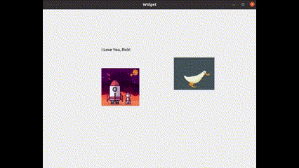


## 24、视频24：Qt事件处理——鼠标事件_1

应用程序（QApplication）对象（a）中的exec()函数检测是否有事件发生，一有事件发生，Qt会使用应用程序对象调用notify()函数，将事件发到指定的窗口中去。

捕获事件是否产生、触发，可在其中设置事件过滤、时间分发和事件处理 

事件过滤：QObject里面的eventFilter()函数

事件分发：QWidget里面的事件分发器Events有具体分类，分发给对应的事件处理函数 

事件处理：处理相应事件（可以给相应函数重新定义）（==唯一关注点==）

==只需要修改相应的事件处理函数==

### 1、widget.h文件

```c++
#ifndef WIDGET_H
#define WIDGET_H

#include <QWidget>

QT_BEGIN_NAMESPACE
namespace Ui { class Widget; }
QT_END_NAMESPACE

class Widget : public QWidget
{
    Q_OBJECT

public:
    Widget(QWidget *parent = nullptr);
    ~Widget();

protected:
    void mousePressEvent(QMouseEvent *event);

private:
    Ui::Widget *ui;
};
#endif // WIDGET_H
```

### 2、widget.cpp文件

```c++
#include "widget.h"
#include "ui_widget.h"
#include <QMouseEvent>
#include <QDebug>

Widget::Widget(QWidget *parent)
    : QWidget(parent)
    , ui(new Ui::Widget)
{
    ui->setupUi(this);
}

Widget::~Widget()
{
    delete ui;
}


void Widget::mousePressEvent(QMouseEvent *event)
{
    if(event->button() == Qt::LeftButton)
    {
        qDebug() << "Left Button is pressed.";
//        qDebug() << "x = " << event->x() << ", y = " << event->y(); // 在当前界面的局部位置
        qDebug() << "x = " << event->globalX() << ", y = " << event->globalY(); // 全局位置

    }
    else if(Qt::RightButton)
    {
        qDebug() << "Right Button is pressed.";
        qDebug() << "x = " << event->x() << ", y = " << event->y();
    }
}
```

### 3、运行结果

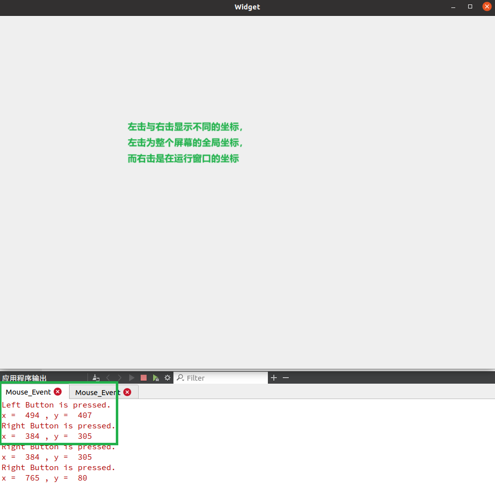


## 25、视频25：Qt事件处理——鼠标事件_2

### 1、概要

- 自定义鼠标释放事件

- 鼠标双击事件

- 鼠标移动事件

- 鼠标滚轮事件

    

### 2、自定义鼠标释放事件

QWidget下的Events

2.1	头文件

```c++
void mouseReleaseEvent(QMouseEvent *event);
```

2.2	源文件

```c++
void Widget::mouseReleaseEvent(QMouseEvent *event)
{
    qDebug() << "Button is released";
}
```

2.3	运行结果

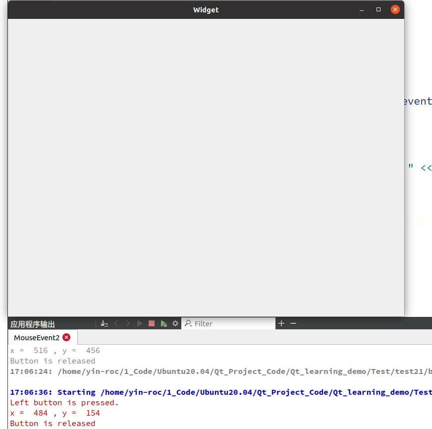


### 3、鼠标双击事件

QWidget 下的Events

3.1	头文件

```c++
void mouseDoubleClickEvent(QMouseEvent *event);
```

3.3	源文件

```c++
void Widget::mouseReleaseEvent(QMouseEvent *event)
{
    qDebug() << "Button is released";
}


void Widget::mouseDoubleClickEvent(QMouseEvent *event)
{
    if(event->button() == Qt::LeftButton)
    {
        if(windowState() != Qt::WindowFullScreen)
        {
            setWindowState(Qt::WindowFullScreen);
        }
        else
        {
            setWindowState(Qt::WindowNoState);
        }
    }
}
```


### 4、鼠标移动事件

4.1	头文件

```c++
//添加私有变量
QPoint pos;


void mouseMoveEvent(QMouseEvent *event);
```

4.2	源文件

```c++
void Widget::mouseMoveEvent(QMouseEvent *event) // 在窗体范围内，一点一拖动，窗体出现在鼠标点击的位置
{
    if(event->buttons() & Qt::LeftButton) // Button和Buttons的区别
    {
        QPoint temp;

        temp = event->globalPos() - pos; // 鼠标当前的位置 - 当前窗体的位置 = 移动了多少

        move(temp);
    }
}
```


### 5、鼠标滚轮事件

5.1	头文件

```c++
void wheelEvent(QWheelEvent *event);
```

5.2	源文件

```c++
void Widget::wheelEvent(QWheelEvent *event)
{
    if(event->delta() > 0)
    {
        ui->textEdit->zoomIn(); // 上滚变大
    }
    else
        ui->textEdit->zoomOut(); // 下滚变小
}
```


## 26、视频26：定时器

### 1、方法1

1.1	头文件

```c++
#include <QTimer>
```

1.2	源文件

```c++
#include "widget.h"
#include "ui_widget.h"
#include <QTimer>

Widget::Widget(QWidget *parent)
    : QWidget(parent)
    , ui(new Ui::Widget)
{
    ui->setupUi(this);

    // 方法一：
    QTimer * timer = new QTimer(this);
    timer->start(1000);
    connect(timer, &QTimer::timeout, [&](){
        static int num = 1; // 如果不是static静态类型，那么会一直初始化 num 为1
        ui->label->setText(QString::number(num++)); // QString 里面的方法，将数字转换成字符串
    });
}

Widget::~Widget()
{
    delete ui;
}
```


### 2、方法2

2.1	简介	

使用timerEvent事件处理函数来处理定时器事件

2.2	头文件

```c++
void timerEvent(QTimerEvent *event);
```

2.3	源文件

```c++
#include "widget.h"
#include "ui_widget.h"
#include <QTimer>

Widget::Widget(QWidget *parent)
    : QWidget(parent)
    , ui(new Ui::Widget)
{
    ui->setupUi(this);

    // 方法1
    QTimer * timer = new QTimer(this);
    timer->start(1000);
    connect(timer, &QTimer::timeout, [&](){
        static int num = 1;
        ui->label->setText(QString::number(num++));
    });

    // 方法2
    startTimer(500);

}

Widget::~Widget()
{
    delete ui;
}


void Widget::timerEvent(QTimerEvent *event)
{
    static int num = 1;
    ui->label_2->setText(QString::number(num++));
}
```

2.4	问题

方法一可以通过创建多个指针来实现多个定时器，但目前的方法二不可以

2.5	解决措施

startTimer原型：

```c++
int QObject::startTimer(int *interval*, [Qt::TimerType](qt.html#TimerType-enum) *timerType* = Qt::CoarseTimer)
```

2.6	头文件

添加了两个私有成员变量：timer_id1,timer_id2

==tips:在类中定义过就不用在主函数再次定义了，只需要赋值。==

如下述，会引发冲突！

```c++
//类中定义
int timer_id1;
int timer_id2;

//函数中定义
timer_id1 = startTimer(500); // 参数1：定时周期500ms
timer_id2 = startTimer(2000);
```

```c++
#ifndef WIDGET_H
#define WIDGET_H

#include <QWidget>

QT_BEGIN_NAMESPACE
namespace Ui { class Widget; }
QT_END_NAMESPACE

class Widget : public QWidget
{
    Q_OBJECT

public:
    Widget(QWidget *parent = nullptr);
    ~Widget();
    // 重载定时器事件处理函数
    void timerEvent(QTimerEvent *event);

private:
    Ui::Widget *ui;
    int timer_id1;
    int timer_id2;
};
#endif // WIDGET_H

```

2.7	源文件

```c++
#include "widget.h"
#include "ui_widget.h"
#include <QTimer>

Widget::Widget(QWidget *parent)
    : QWidget(parent)
    , ui(new Ui::Widget)
{
    ui->setupUi(this);

    // 方法一：
    QTimer * timer = new QTimer(this);
    timer->start(1000);
    connect(timer, &QTimer::timeout, [&](){
        static int num = 1; // 如果不是static静态类型，那么会一直初始化 num 为1
        ui->label->setText(QString::number(num++)); // QString 里面的方法，将数字转换成字符串
    });

    // 方法二：
    timer_id1 = startTimer(500); // 参数1：定时周期500ms
    timer_id2 = startTimer(2000);

    // 使用timer_id1, timer_id2进行区分，

}

Widget::~Widget()
{
    delete ui;
}


void Widget::timerEvent(QTimerEvent *event)
{
    if(event->timerId() == timer_id1) // 因为该函数中得不到WIdget函数中局部变量的值，所以将该函数的值放在类的成员中
    {
        static int num = 1;
        ui->label_2->setText(QString::number(num++));
    }
    if(event->timerId() == timer_id2)
    {
        static int num2 = 1;
        ui->label_3->setText(QString::number(num2++));
    }

}

```


2.8	运行结果：

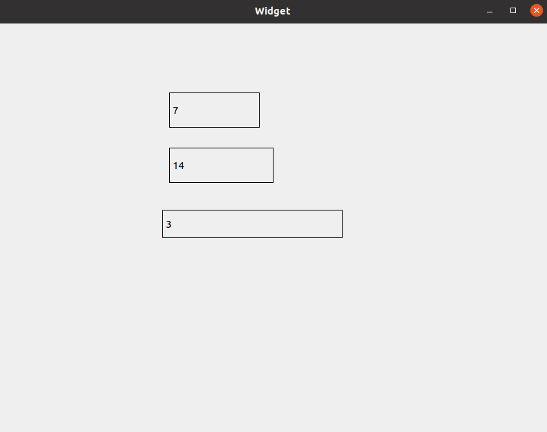

2.9	补充

给文本框添加边框以达到区分效果。

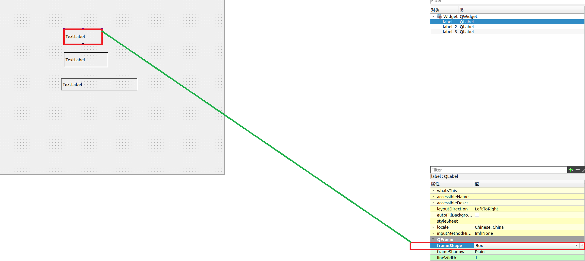

### 3、结论

==两种方法更推荐方法一！！！==


## 27、视频27：事件分发器

借助的之前所讲的Mouse事件

1、头文件

```c++
#ifndef WIDGET_H
#define WIDGET_H

#include <QWidget>

QT_BEGIN_NAMESPACE
namespace Ui { class Widget; }
QT_END_NAMESPACE

class Widget : public QWidget
{
    Q_OBJECT

public:
    Widget(QWidget *parent = nullptr);
    ~Widget();

protected:
    bool event(QEvent *event); // 添加函数，位于 QWidget 中 Reimplemented Protected Functions 的 virtual bool event(QEvent *event) override

    void mousePressEvent(QMouseEvent *event);
    void mouseReleaseEvent(QMouseEvent *event);
    void mouseDoubleClickEvent(QMouseEvent *event);
    void mouseMoveEvent(QMouseEvent *event);
    void wheelEvent(QWheelEvent *event);

private:
    Ui::Widget *ui;
    QPoint pos;
};
#endif // WIDGET_H
```

2、源文件

第一个`return true;`的作用是告诉程序该事件已经在这个函数中被处理了，不需要再传递给其他地方处理；而第二个`return QWidget::event(event);`的作用是将其他类型的事件传递给父类的事件处理函数，以便父类处理那些没有在这个函数中被处理的事件。

```c++
#include "widget.h"
#include "ui_widget.h"
#include <QMouseEvent>
#include <QDebug>

Widget::Widget(QWidget *parent)
    : QWidget(parent)
    , ui(new Ui::Widget)
{
    ui->setupUi(this);
}

Widget::~Widget()
{
    delete ui;
}


bool Widget::event(QEvent *event) // 之前的鼠标功能全部失效
{
    if(event->type() == QEvent::MouseButtonPress) // 设置鼠标被按下时的操作，下方的全部被打断
    {
        qDebug() << "鼠标按键被按下";
        return true;
    }
    return QWidget::event(event); // 其余事件交给父类事件分发函数处理
}

void Widget::mousePressEvent(QMouseEvent *event)
{
    if(event->button() == Qt::LeftButton)
    {
        qDebug() << "Left Button is pressed.";
//        qDebug() << "x = " << event->x() << ", y = " << event->y(); // 在当前界面的局部位置
        qDebug() << "x = " << event->globalX() << ", y = " << event->globalY(); // 全局位置

    }
    else if(Qt::RightButton)
    {
        qDebug() << "Right Button is pressed.";
        qDebug() << "x = " << event->x() << ", y = " << event->y();
    }
}


void Widget::mouseReleaseEvent(QMouseEvent *event)
{
    qDebug() << "Button is released";
}


void Widget::mouseDoubleClickEvent(QMouseEvent *event)
{
    if(event->button() == Qt::LeftButton)
    {
        if(windowState() != Qt::WindowFullScreen)
        {
            setWindowState(Qt::WindowFullScreen);
        }
        else
        {
            setWindowState(Qt::WindowNoState);
        }
    }
}


void Widget::mouseMoveEvent(QMouseEvent *event) // 在窗体范围内，一点一拖动，窗体出现在鼠标点击的位置
{
    if(event->buttons() & Qt::LeftButton) // Button和Buttons的区别
    {
        QPoint temp;

        temp = event->globalPos() - pos; // 鼠标当前的位置 - 当前窗体的位置 = 移动了多少

        move(temp);
    }
}


void Widget::wheelEvent(QWheelEvent *event)
{
    if(event->delta() > 0)
    {
        ui->textEdit->zoomIn(); // 上滚变大
    }
    else
        ui->textEdit->zoomOut(); // 下滚变小
}
```


## 28、视频28：串口调试助手项目_01：自动识别串口号

### 1、项目需求

希望创建一个串口调试助手项目，要求能够显示当前的已接串口端口号。

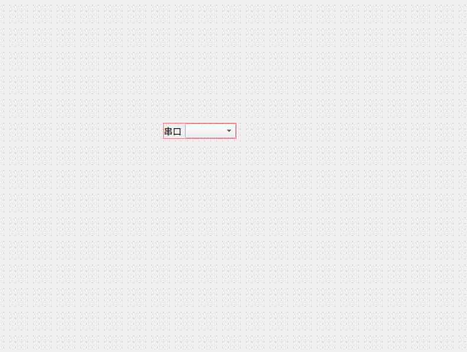

### 2、具体步骤

#### 2.1	前期准备

运行窗口大小显示、窗口标题显示

```c++
#include "widget.h"
#include "ui_widget.h"

Widget::Widget(QWidget *parent)
    : QWidget(parent)
    , ui(new Ui::Widget)
{
    ui->setupUi(this);

    resize(800, 600);
    setWindowTitle("串口调试助手");
    
}

Widget::~Widget()
{
    delete ui;
}
```

运行结果如图所示：

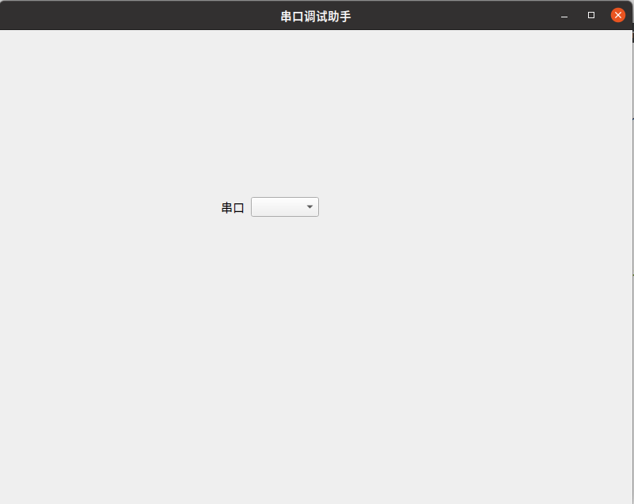


#### 2.2	定时器

需要不断扫描是否接入了外部设备，这就需要定时不断扫描接入状态。

1、创建定时器变量

```c++
#ifndef WIDGET_H
#define WIDGET_H

#include <QWidget>
#include <QTimer>   // 1

QT_BEGIN_NAMESPACE
namespace Ui { class Widget; }
QT_END_NAMESPACE

class Widget : public QWidget
{
    Q_OBJECT

public:
    Widget(QWidget *parent = nullptr);
    ~Widget();

private:
    Ui::Widget *ui;
    QTimer * timer;     // 2
};
#endif // WIDGET_H
```


2、创建自定义定时器处理函数

头文件：

```c++
#ifndef WIDGET_H
#define WIDGET_H

#include <QWidget>
#include <QTimer>  

QT_BEGIN_NAMESPACE
namespace Ui { class Widget; }
QT_END_NAMESPACE

class Widget : public QWidget
{
    Q_OBJECT

public:
    Widget(QWidget *parent = nullptr);
    ~Widget();

private:
    Ui::Widget *ui;
    QTimer * timer; 
    
private slots:
    void TimerEvent_1();	// 3
};
#endif // WIDGET_H
```

源文件：

```c++
#include "widget.h"
#include "ui_widget.h"

Widget::Widget(QWidget *parent)
    : QWidget(parent)
    , ui(new Ui::Widget)
{
    ui->setupUi(this);

    resize(800, 600);
    setWindowTitle("串口调试助手");

    timer = new QTimer(this);	// 1
    timer->start(500);	//	2
    connect(timer, &QTimer::timeout, this, &Widget::TimerEvent_1);	//	3
}

Widget::~Widget()
{
    delete ui;
}


void Widget::TimerEvent_1()
{

}
```


3、添加串口头文件并添加依赖

添加头文件：

```c++
#include <QSerialPortInfo>
#include <QSerialPort>
```


添加依赖：

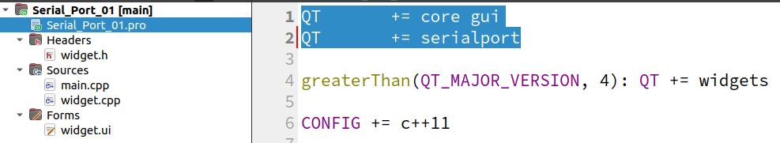


4、使用foreach函数遍历已有串口

```c++
foreach (variable, container) 
```


5、QSerialPortInfo和QSerialPort的区别

5.1	QSerialPortInfo:

- **作用：** 提供关于系统中可用串口的信息。
- **功能：** 允许你获取有关每个可用串口的详细信息，如串口名、描述、制造商、支持的波特率等。
- **用途：** 主要用于列举系统中的串口，以便用户可以选择要与之通信的串口。

```c++
#include <QtSerialPort/QSerialPortInfo>
```

5.2	QSerialPort:

- **作用：** 提供串口的访问和控制。
- **功能：** 允许打开、关闭串口，设置串口参数（如波特率、数据位、停止位、校验位等），读写串口数据等。
- **用途：** 用于实际的串口通信，发送和接收数据。

```c++
#include <QtSerialPort/QSerialPort>
```

5.3	**简要区别：**

- `QSerialPortInfo` 主要用于获取系统中可用串口的信息，而 `QSerialPort` 用于实际的串口通信。
- `QSerialPortInfo` 是一个用于检测串口的工具类，而 `QSerialPort` 是一个用于串口通信的类。

在使用串口进行通信时，通常的做法是使用 `QSerialPortInfo` 枚举可用串口，然后用户选择一个串口，最后使用 `QSerialPort` 打开选定的串口进行通信。


6、文件汇总内容

头文件

```c++
#ifndef WIDGET_H
#define WIDGET_H

#include <QWidget>
#include <QTimer>
#include <QSerialPortInfo>
#include <QSerialPort>

QT_BEGIN_NAMESPACE
namespace Ui { class Widget; }
QT_END_NAMESPACE

class Widget : public QWidget
{
    Q_OBJECT

public:
    Widget(QWidget *parent = nullptr);
    ~Widget();
    

private:
    Ui::Widget *ui;
    QTimer * timer;
    QStringList portStringList; // 1

private slots:
    void TimerEvent_1();
};
#endif // WIDGET_H
```


源文件：

```c++
#include "widget.h"
#include "ui_widget.h"

Widget::Widget(QWidget *parent)
    : QWidget(parent)
    , ui(new Ui::Widget)
{
    ui->setupUi(this);

    resize(800, 600);
    setWindowTitle("串口调试助手");

    timer = new QTimer(this);
    timer->start(500);
    connect(timer, &QTimer::timeout, this, &Widget::TimerEvent_1);

}

Widget::~Widget()
{
    delete ui;
}


void Widget::TimerEvent_1()
{
    
    QStringList newPortStringList;

    newPortStringList.clear(); // 4 清空操作，否则每次都在增加

    foreach (const QSerialPortInfo & info, QSerialPortInfo::availablePorts()) {
        newPortStringList += info.portName();
    }

    if(newPortStringList.size() != portStringList.size()) // 1 如果不加该判断，会每0.5秒加入所有串口，而没有清空之前语句
    {
        portStringList = newPortStringList; // 2 更新当前容器
        ui->comboBox->clear();  // 3 清空
        ui->comboBox->addItems(newPortStringList);
    }
}
```


### 3、运行结果

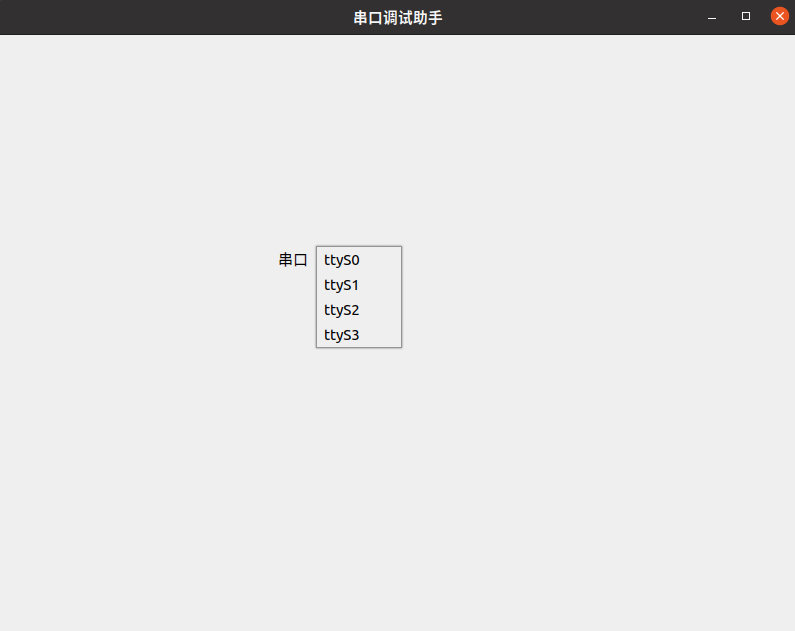


## 29、视频29：串口调试助手项目_02：设置串口参数

### 1、项目需求

在串口调试助手项目的基础上，要求能够显示当前的已接串口端口号。

可以设置串口调试助手的参数并打开串口

### 2、具体步骤

2.1	设置 Ui 界面

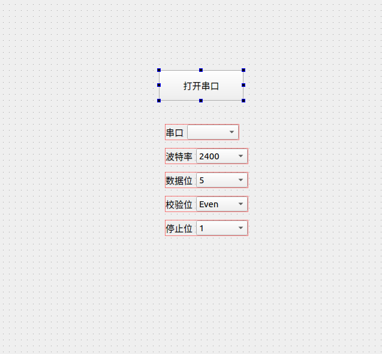


2.2	创建QSerialPort类指针

用于用于设置和控制串口的各种属性，以及执行串口的打开和关闭操作

Qt助手中搜索：QSerialPort，查看Public Functions函数

2.3	设置各个参数

1、判断是否点击“打开串口”


2、串口名设置

```c++
serial->setPortName(ui->comboBox->currentText());
```


3、波特率设置

```c++
serial->setBaudRate(ui->comboBox_2->currentText().toInt());
```

setBaudRate()函数接收qint32类型数据，而comBox里面是QString类型的，需要转换成int类型，故使用 toInt()函数。


4、数据位设置

```c++
switch(ui->comboBox_3->currentText().toInt())
{
	case 5: serial->setDataBits(QSerialPort::Data5); break;
	case 6: serial->setDataBits(QSerialPort::Data6); break;
	case 7: serial->setDataBits(QSerialPort::Data7); break;
	case 8: serial->setDataBits(QSerialPort::Data8); break;
	default: serial->setDataBits(QSerialPort::UnknownDataBits); break;   
}
```


5、校验位设置

```c++
switch(ui->comboBox_4->currentIndex())
{
	case 0: serial->setParity(QSerialPort::EvenParity); break;
	case 1: serial->setParity(QSerialPort::OddParity); break;
	case 2: serial->setParity(QSerialPort::NoParity); break;
	default: serial->setParity(QSerialPort::UnknownParity); break;
}
```


6、停止位

```c++
// 停止位
switch(ui->comboBox_5->currentIndex())
{
	case 0: serial->setStopBits(QSerialPort::OneStop); break;
	case 1: serial->setStopBits(QSerialPort::OneAndHalfStop); break;
	case 2: serial->setStopBits(QSerialPort::TwoStop); break;
	default: serial->setStopBits(QSerialPort::UnknownStopBits); break;    
}
```


7、流控

在串口通信中，流控（Flow Control）是一种用于控制数据流动的机制。设置流控的作用是定义在何时发送数据以及何时停止发送数据，以防止数据溢出或丢失。在你提到的代码中，设置流控为 `QSerialPort::NoFlowControl` 表示禁用流控。

```c++
serial->setFlowControl(QSerialPort::NoFlowControl);
```


8、设置未成功打开提示

```c++
if(!serial->open(QIODevice::ReadWrite)) // 未成功打开
{
	QMessageBox::information(this, "错误提示", "无法打开串口", QMessageBox::Ok);
	return ;
}
```


9、设置使能端

按照逻辑，当选好相应的端口时，便不再允许调用参数。

```c++
ui->comboBox->setEnabled(false);
ui->comboBox_2->setEnabled(false);
ui->comboBox_3->setEnabled(false);
ui->comboBox_4->setEnabled(false);
ui->comboBox_5->setEnabled(false);
```


10、关闭串口并重新设置使能端


### 3、currentText与currentIndex区别

1. **`currentText`:**

    - `currentText` 是 `QComboBox` 类的成员函数，返回当前选择项的文本内容（字符串）。
    - 例如，如果你有一个下拉框（`QComboBox`）并选择了其中的一个项，使用 `currentText` 可以获取该项的文本。

    ```c++
    QString text = ui->comboBox->currentText();
    ```

2. **`currentIndex`:**

    - `currentIndex` 是 `QComboBox` 类的成员函数，返回当前选择项的索引。
    - 例如，如果你有一个下拉框（`QComboBox`）并选择了其中的一个项，使用 `currentIndex` 可以获取该项在下拉框中的索引。

    ```c++
    int index = ui->comboBox->currentIndex();
    ```

关系：

- `currentText` ==返回当前选定项的文本==，是一个 `QString` 类型。
- `currentIndex` ==返回当前选定项的索引==，是一个 `int` 类型。

你可以根据需要选择使用其中一个或两者结合使用，具体取决于你对选择项的需求。如果你需要文本内容，使用 `currentText`；如果你需要索引，使用 `currentIndex`。

例如本项目中的数据位与校验位，数据位都是 QString 类型的数字，可以通过 toInt() 函数转换；而校验位虽然也是 QString 类型，但都是英文字母，因此需要按照索引来使用 switch() 函数。

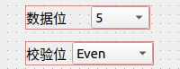

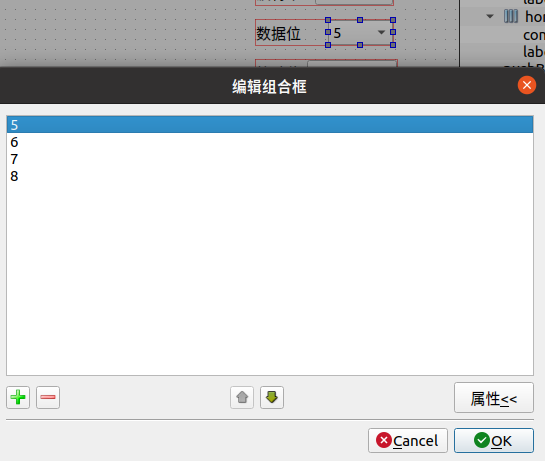

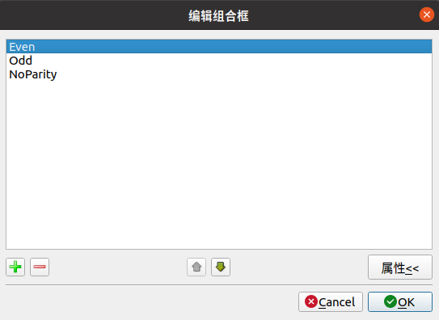


## 30、视频30：串口调试助手项目_03：接收功能

### 1、项目需求

在串口调试助手项目的基础上，要求能够显示当前的已接串口端口号。可以设置串口调试助手的参数并打开串口。

新增：能够实现串口的接收功能

### 2、具体操作

2.1、创建串口相关的信号与槽

```c++
void serialPort_readyRead();
connect(serial, &QSerialPort::readyRead, this, &Widget::serialPort_readyRead);
```

==信号readyRead为从QSerialPort类的父类QIODevice Class中继承而来。==

测试槽函数：

```c++
void Widget::serialPort_readyRead()
{
    qDebug() << "Receive data.";
}
```

如下图所示，串口读取正常！

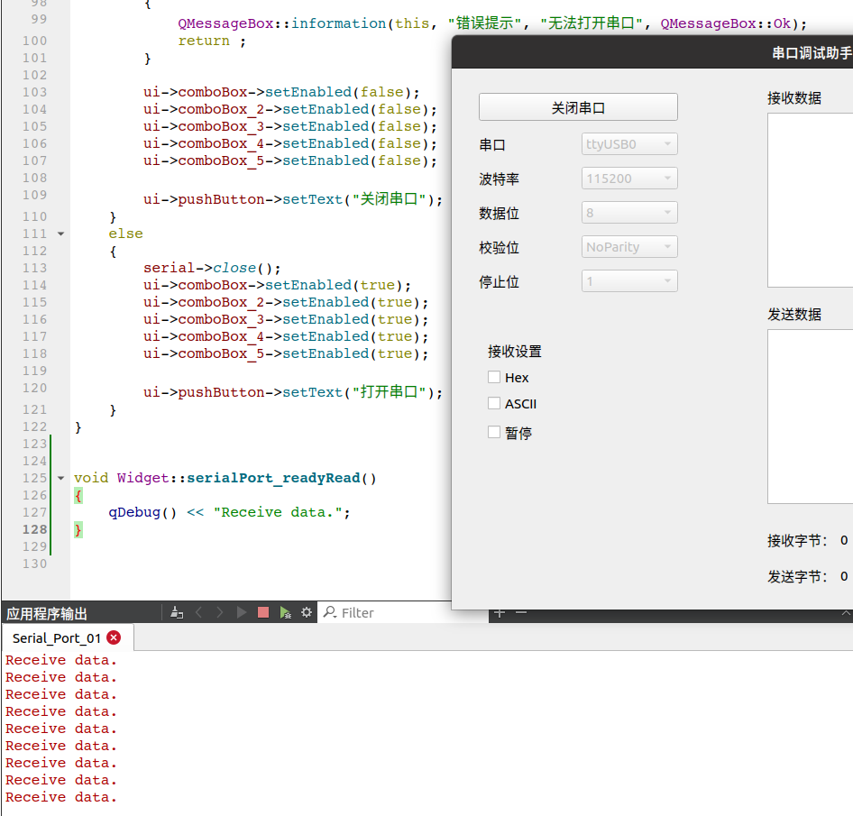

2.2、CheckBox的设置

如下图所示，要求：有且只有一个可以被选中：

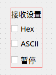

在widget.ui界面直接设置对应的槽函数，并编写槽函数相关内容：

调用QCheckBox类中的void setCheckState(Qt::CheckState *state*)函数

```c++
void Widget::on_checkBox_clicked()
{
    ui->checkBox->setCheckState(Qt::Checked);
    ui->checkBox_2->setCheckState(Qt::Unchecked);
    ui->checkBox_3->setCheckState(Qt::Unchecked);
}

void Widget::on_checkBox_2_clicked()
{
    ui->checkBox_2->setCheckState(Qt::Checked);
    ui->checkBox->setCheckState(Qt::Unchecked);
    ui->checkBox_3->setCheckState(Qt::Unchecked);
}

void Widget::on_checkBox_3_clicked()
{
    ui->checkBox_3->setCheckState(Qt::Checked);
    ui->checkBox->setCheckState(Qt::Unchecked);
    ui->checkBox_2->setCheckState(Qt::Unchecked);
}
```

如图所示：只能勾选Hex、ASCII和暂停三个其中的一个。

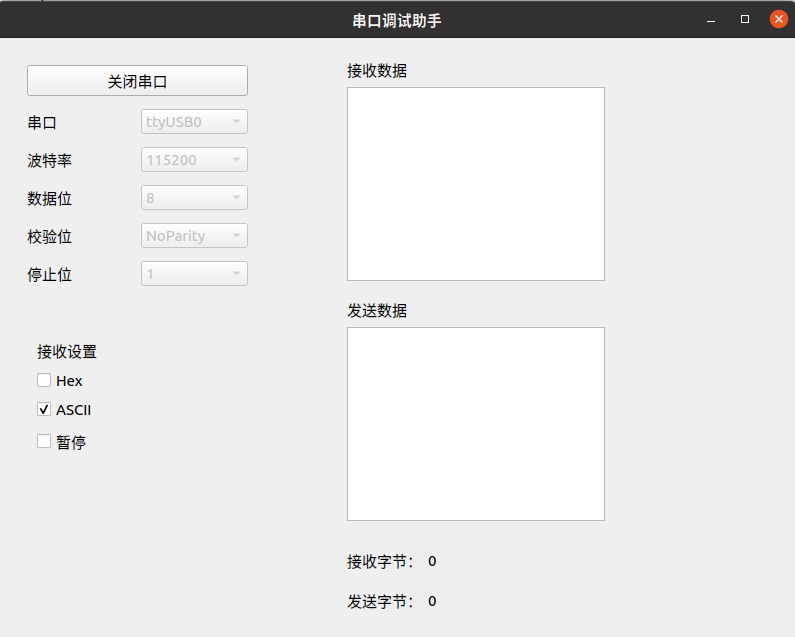


2.3	设置 CheckBox 暂停框的功能

```c++
void Widget::serialPort_readyRead()
{
//    qDebug() << "Receive data.";
    if(ui->checkBox_3->checkState() != Qt::Checked)
    {
            qDebug() << "Receive data.";

    }
}
```

输出如下：

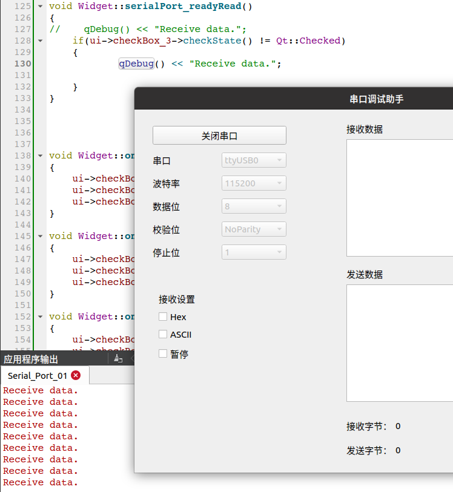


2.4	读取串口发送的数据

QByteArray readAll()函数继承自 QSerialPort类的父类QIODevice类；

QByteArray 字节数组类型，与QString类型一致。

```c++
QString Receivetext; // 表示收到的内容
long Receive_Byte; // 接收的Receivetext的长度

void Widget::serialPort_readyRead()
{
//    qDebug() << "Receive data.";
    if(ui->checkBox_3->checkState() != Qt::Checked)
    {
//        qDebug() << "Receive data.";
        Receivetext = serial->readAll(); // 读取串口数据
        Receive_Byte = Receivetext.length(); // 计算读取串口数据的长度
        ui->label_11->setText(QString::number(Receive_Byte)); // 输出 读取数据的长度
        ui->textEdit->setText(Receivetext); // 
    }
}
```

如下图所示：接收数据框输出：please enter the words，接收字节：24

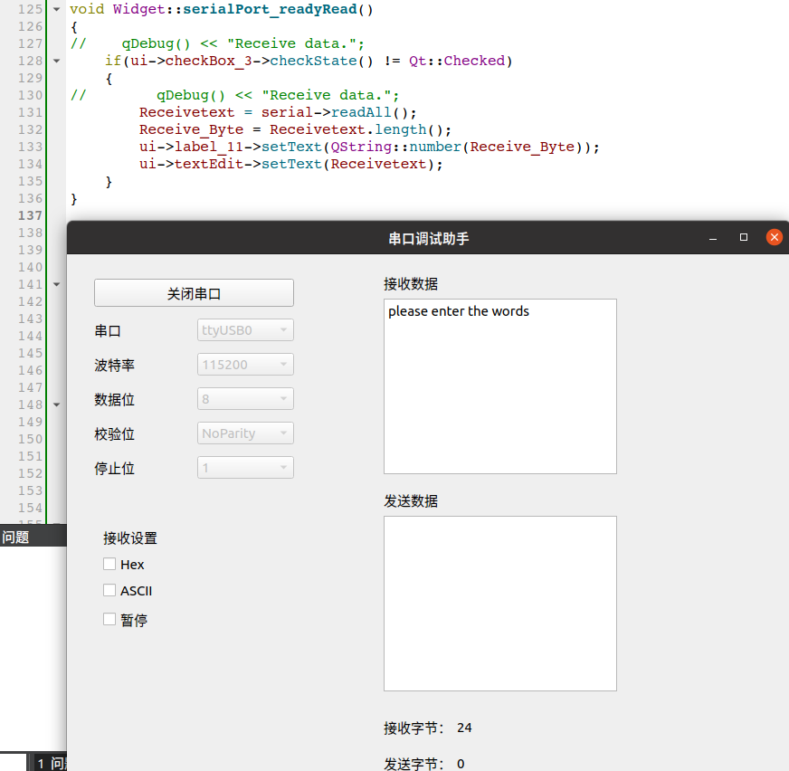


问题：只输出当前的最新数据，没有输出历史数据；只输出当前数据的长度，没有输出总共数据长度。


2.5	显示历史数据和总计输出数据长度

```c++
Widget::Widget(QWidget *parent)
    : QWidget(parent)
    , ui(new Ui::Widget)
{
    ui->setupUi(this);

    resize(800, 600);
    setWindowTitle("串口调试助手");

    timer = new QTimer(this);
    timer->start(500);
    connect(timer, &QTimer::timeout, this, &Widget::TimerEvent_1);

    serial = new QSerialPort(this);

    ui->comboBox_2->setCurrentIndex(5);
    ui->comboBox_3->setCurrentIndex(3);
    ui->comboBox_4->setCurrentIndex(2);
    ui->comboBox_5->setCurrentIndex(0);

    Receive_Byte = 0; // 6 清零z
    connect(serial, &QSerialPort::readyRead, this, &Widget::serialPort_readyRead);

}


void Widget::serialPort_readyRead()
{
    QString last_text; // 1 存放历史数据

//    qDebug() << "Receive data.";
    if(ui->checkBox_3->checkState() != Qt::Checked)
    {
//        qDebug() << "Receive data.";
        last_text = ui->textEdit->toPlainText(); // 3 读取历史数据

        Receivetext = serial->readAll(); 
        Receive_Byte += Receivetext.length(); // 2 计算累计接收字符串长度
        ui->label_11->setText(QString::number(Receive_Byte));

        last_text = last_text.append(Receivetext); // 5
        ui->textEdit->setText(last_text); // 4
    }
}
```

如图所示输出结果：

接收数据区域在不停输出数据（包含历史数据）；接收字节长度在不断累加。

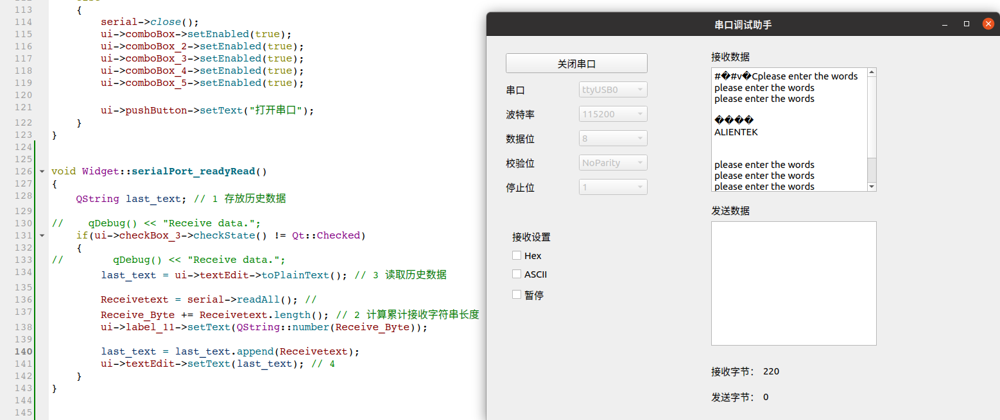


2.6 分Hex和ASCII两种输出方式

```c++
void Widget::serialPort_readyRead()
{
    QString last_text; // 1 存放历史数据
    int length; // 9
    int i; // 10

//    qDebug() << "Receive data.";
    if(ui->checkBox_3->checkState() != Qt::Checked)
    {
//        qDebug() << "Receive data.";
        last_text = ui->textEdit->toPlainText(); // 3 读取历史数据

        Receivetext = serial->readAll(); //
        Receive_Byte += Receivetext.length(); // 2 计算累计接收字符串长度
        ui->label_11->setText(QString::number(Receive_Byte));

        if(ui->checkBox->checkState() == Qt::Checked) // 7 hex
        {
            Receivetext = Receivetext.toLatin1().toHex(); // 8 拉丁字母输出转换成 16 进制
            length = Receivetext.length(); // 11
            for(i = 0; i < length / 2; i++) // 12 每两个字节插入一个空格
            {
                Receivetext.insert(2+3*i, ' ');
            }
        }
        else
        {
            Receivetext = Receivetext.toLatin1(); // 13拉丁字母输出
        }
        last_text = last_text.append(Receivetext); // 5 更新历史数据
        ui->textEdit->setText(last_text); // 4 输出历史数据
    }
}
```

如图所示：16进制每隔两个字节输出一个空格

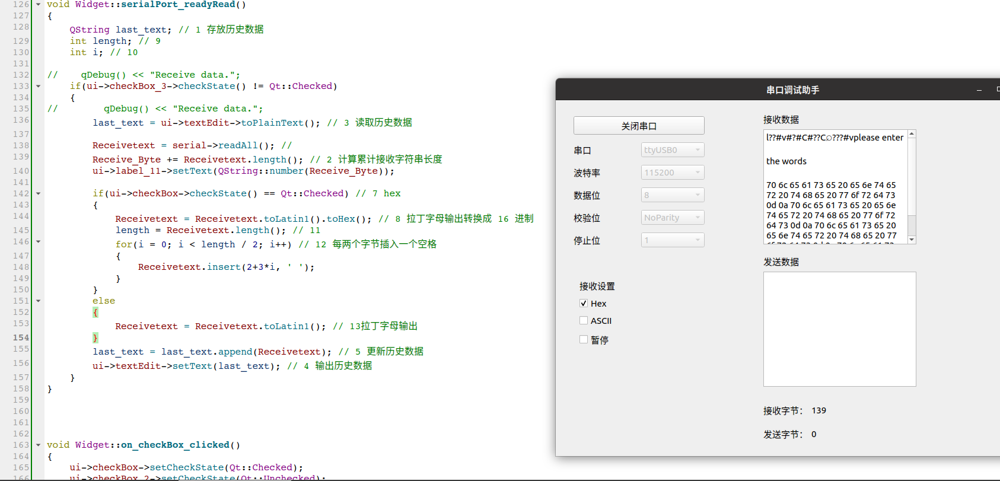

ASCII码形式输出字符串形式：

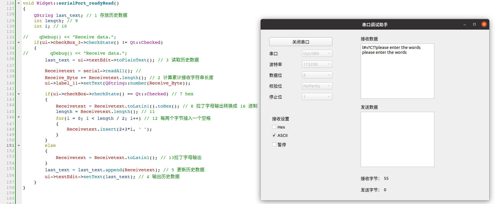


## 31、视频31：串口调试助手项目_04：发送功能

### 1、项目需求

在串口调试助手项目的基础上，要求能够显示当前的已接串口端口号。可以设置串口调试助手的参数并打开串口。能够实现串口的接收功能。

新增：实现发送功能

### 2、具体操作

2.1	设置widget.ui界面

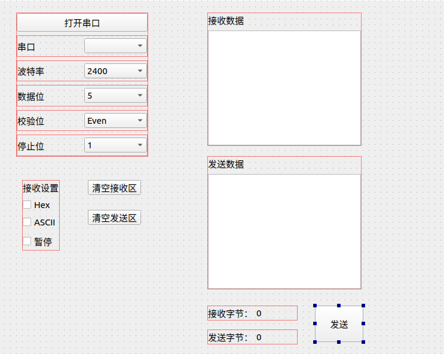

2.2	获得textEdit_2里面的内容

```c++
QString Sendtext; // 发送的内容

void Widget::on_pushButton_2_clicked()
{
    Sendtext = ui->textEdit_2->toPlainText(); 
    
}
```


2.3	写入串口

serial->write();的数据类型是QByteArray类型，而 Sendtext 是 QString 类型，因此需要将 QString 转换为 QByteArray 类型

```c++
void Widget::on_pushButton_2_clicked()
{
    QByteArray bytearray;
    
    Sendtext = ui->textEdit_2->toPlainText(); 
    
    bytearray = Sendtext.toLatin1();
    
    serial->write(bytearray);
}
```


2.4	计算长度

```c++
// 头文件中
long Send_Byte; // 接收的 Send_Byte 的长度    

// widget构造函数中
Send_Byte = 0;


void Widget::on_pushButton_2_clicked()
{
    QByteArray bytearray;
    
    Sendtext = ui->textEdit_2->toPlainText(); 
    
    bytearray = Sendtext.toLatin1();
    
    serial->write(bytearray);
    
    Send_Byte += Sendtext.length();
    
    ui->label_12->setText(QString::number(Send_Byte));
    
}
```

如下图所示：字节数在增加，但由于此时开发板没有接受处理程序，故没有相应。

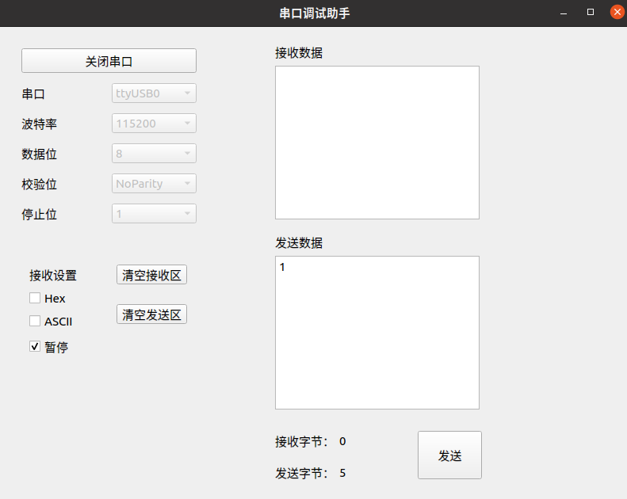


2.5	清空接收区和发送区

```c++
void Widget::on_pushButton_3_clicked()
{
    ui->textEdit->clear();
}

void Widget::on_pushButton_4_clicked()
{
    ui->textEdit_2->clear();
}
```


## 32、视频32：绘图基本操作

### 1、简介

都是由创建的QPainter类对象来实现最终的显示操作。

### 2、具体代码

```c++
void Widget::paintEvent(QPaintEvent *)
{
    QPainter painter(this);

    QPen pen(QColor (255, 0, 0)); // 创建了红色画笔对象
    pen.setWidth(3); // 设置画笔宽度为3个像素
    pen.setStyle(Qt::DashDotLine); // 设置画笔样式为虚线点线。
    painter.setPen(pen);    // 将上述配置好的画笔对象设置给painter


    painter.drawLine(QPoint (0, 0), QPoint (100, 100)); // 创建匿名对象；两个参数表示直线的起始位置；线
    painter.drawEllipse(QPoint (100, 100), 20, 20); // 圆形
    painter.drawEllipse(QPoint (100, 100), 50, 80); // 椭圆
    painter.drawRect(100, 100, 30, 30); // 正方形
    painter.drawRect(100, 100, 40, 80); // 长方形
    painter.drawText(100, 100, "I love you, Rick!"); // 显示文本


    QBrush brush(Qt::green, Qt::Dense3Pattern);
    painter.setBrush(brush);
//    painter.setPen(pen);
    painter.drawRect(200, 200, 50, 50);


    QConicalGradient conicalGradient(QPointF(200, 100), 0); // 渐变色 // 参数2：从该角度逆时针开始;这里指从三点钟方向开始
    conicalGradient.setColorAt(0.2, Qt::cyan); // 参数1：0～1，360度*0.2 = 72度，意思从0度开始，逆时针旋转72度
    conicalGradient.setColorAt(0.4, Qt::black);
    conicalGradient.setColorAt(0.7, Qt::red);
    conicalGradient.setColorAt(1, Qt::yellow);

    painter.setBrush(conicalGradient); // 不能使用上一个画刷，上一个画刷全是绿色
    painter.drawEllipse(QPointF(200, 100), 50, 50);
}
```


## 33、视频33：抗锯齿和坐标系变换

### 1、平移

```c++
void Widget::paintEvent(QPaintEvent *)
{
    QPainter painter(this);

    // 1.抗锯齿：边缘平滑 Antialiasing，translate
//    QPen pen(QColor(255, 0, 0));
    painter.setPen(QPen(Qt::red, 15));
    painter.drawEllipse(QPoint(200, 150), 100, 100);

    painter.setRenderHints(QPainter::Antialiasing); // 抗锯齿操作
    painter.translate(200, 0); // 偏移
    painter.drawEllipse(QPoint(200, 150), 100, 100); 
}
```

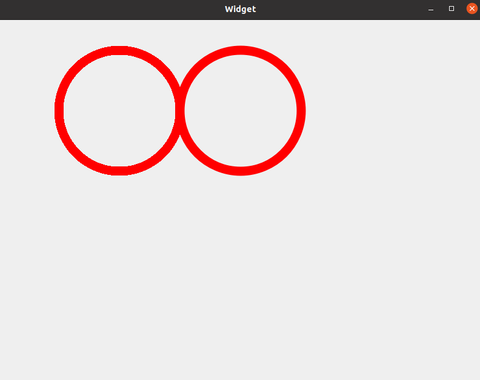


### 2、旋转

```c++
// 2.旋转 rotate
painter.setPen(QPen(Qt::red, 10));
painter.drawLine(QPoint(10, 10), QPoint(100, 100));
painter.save(); // 保存一下当前的设置
painter.translate(200, 0);
painter.rotate(90); // 顺时针旋转90度
painter.setPen(QPen(Qt::blue, 10));
painter.drawLine(QPoint(10, 10), QPoint(100, 100));
painter.restore(); // 恢复到之前的状态
```

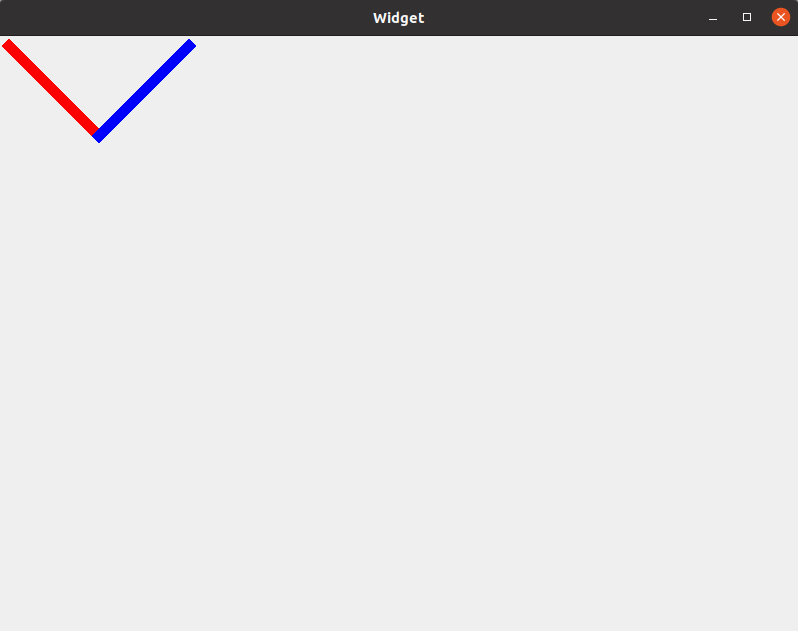


### 3、缩放

```c++
// 3.缩放 scale
painter.setPen(QPen(Qt::red));
painter.setBrush(Qt::yellow);
painter.drawRect(50, 50, 50, 50);
painter.save();
painter.scale(1.5, 2);
painter.setBrush(Qt::green);
painter.drawRect(50, 50, 50, 50);
painter.restore();
```

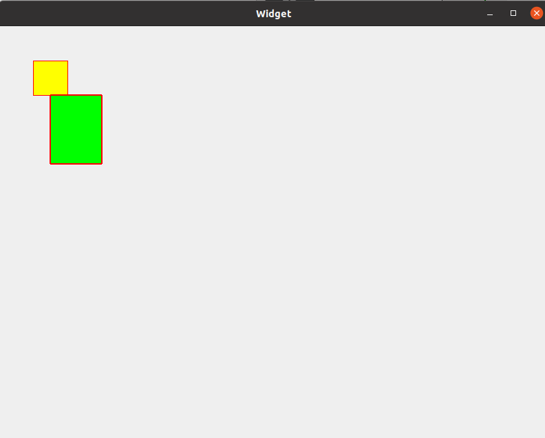


### 4、扭曲

```c++
    // 4.扭曲 shear
    painter.setPen(QPen(Qt::blue));
    painter.setBrush(Qt::yellow);
    painter.drawRect(50, 50, 50, 50);
    painter.save();
    painter.shear(0.5, 0); // 左上角 50*1.5 = 75， 右下角 100*1.5 = 150
    painter.setBrush(Qt::gray);
    painter.drawRect(50, 50, 50, 50);
    painter.restore();
```

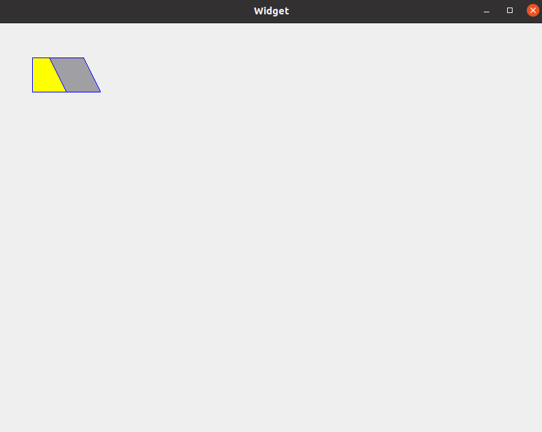


## 34、视频34：手动调用绘图事件处理函数

### 1、实现目的

手动调用绘图事件

### 2、具体步骤

2.1、前期准备

头文件公有成员

```c++
void paintEvent(QPaintEvent *);
```

源文件包含头文件

```c++
#include <QPainter>
```


2.2	绘制一个始终位于界面中心的圆

```c++
void Widget::paintEvent(QPaintEvent *)
{
    QPainter painter(this); 
    painter.setRenderHints(QPainter::Antialiasing); // 抗锯齿
    painter.translate(width()/2, height()/2); //  使坐标中心位于整个界面的中心，无论如何放大/缩小界面
    painter.drawEllipse(QPoint(0, 0), 120, 120); // 半径为120
}
```

运行结果：

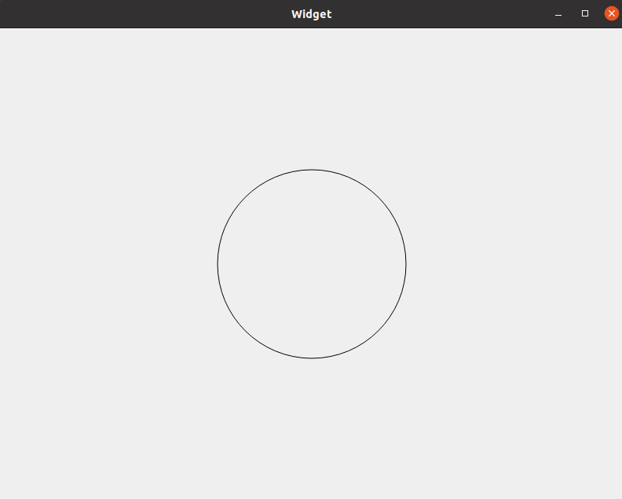


2.3 设置旋转角度

头文件私有变量

```c++
int angle;
```

源文件Widget构造函数：

```
angle = 0; // 角度初始化
```

```c++
void Widget::paintEvent(QPaintEvent *)
{
    QPainter painter(this);

    painter.setRenderHints(QPainter::Antialiasing); // 抗锯齿
    painter.translate(width()/2, height()/2); //  使坐标中心位于整个界面的中心，无论如何放大/缩小界面
    painter.drawEllipse(QPoint(0, 0), 120, 120); //
    painter.rotate(angle); // 旋转
    painter.drawLine(QPoint(0, 0), QPoint(100, 100));
}
```


2.4	设置角度变化

```c++
void Widget::paintEvent(QPaintEvent *)
{
    angle += 10;
    if(angle == 360)
        angle =0;
    
    QPainter painter(this);

    painter.setRenderHints(QPainter::Antialiasing); // 抗锯齿
    painter.translate(width()/2, height()/2); //  使坐标中心位于整个界面的中心，无论如何放大/缩小界面
    painter.drawEllipse(QPoint(0, 0), 120, 120); //
    painter.rotate(angle); // 旋转
    painter.drawLine(QPoint(0, 0), QPoint(100, 0));
}
```

但没有连续变化，如下图，与上图对比，只变化一次，因此设计一个定时器来实现连续变化

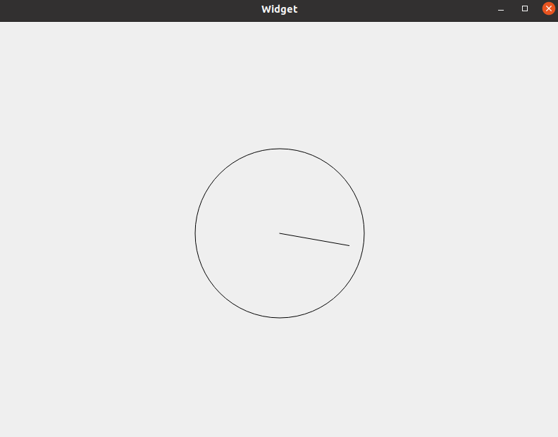


2.5	设置定时器

```c++
Widget::Widget(QWidget *parent)
    : QWidget(parent)
    , ui(new Ui::Widget)
{
    ui->setupUi(this);
    angle = 0;
    QTimer *timer = new QTimer(this);
    timer->start(1000);
    connect(timer, &QTimer::timeout, this, [&](){update();});
}
```

为什么不使用repaint()函数

重新调用 paintEvent() 以直接重新绘制小部件，除非禁用更新或小部件被隐藏。 我们建议只在需要立即重新绘制的情况下使用 repaint()，例如在动画期间。在几乎所有情况下，update() 更好，因为它允许Qt进行速度优化并最小化闪烁。 警告：如果在可能被从 paintEvent() 中调用的函数中调用 repaint()，可能会导致无限递归。update() 函数永远不会引起递归。

### 3、运行结果


## 35、视频35：绘制文字和路径

### 1、本节内容

### 2、具体步骤

2.1	前期准备

头文件：

```c++
void paintEvent(QPaintEvent *);
```

源文件：

```c++
#include <QPainter>
void Widget::paintEvent(QPaintEvent *)
{    
}
```


2.2	具体代码

```c++
void Widget::paintEvent(QPaintEvent *)
{
    QPainter painter(this);

    QFont font("Noto Sans CJK SC Black", 20, QFont::Bold, true); // 设置字体类型、大小、黑体、斜体
//    QFont font("Courier 10 Pitch", 50, QFont::Bold, true);

    font.setUnderline(true); // 设置下划线

    painter.setFont(font); // 设置画笔
    painter.setPen(Qt::blue); // 设置画笔颜色
    painter.drawText(50, 50, "I love you, Rick!");
}

```


2.3	运行结果

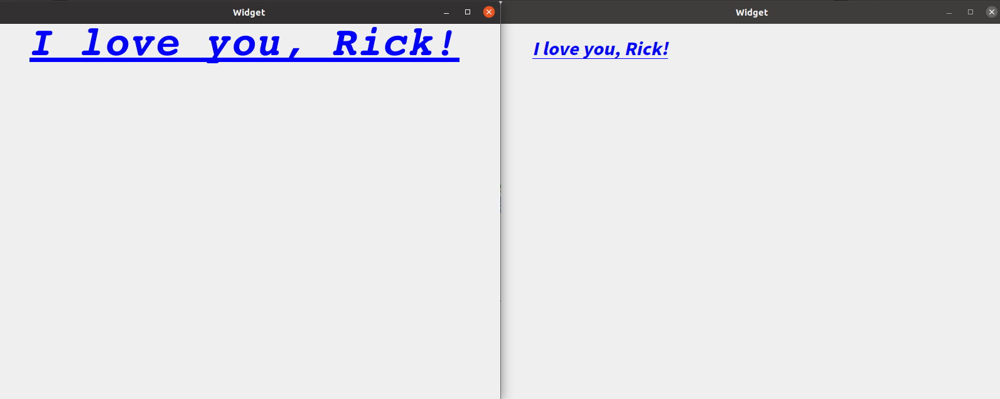


2.4	QPainterPath

QPainterPath 是  Qt  框架中的一个类，用于描述和操作 2D 图形路径。它提供了一种方便的方式来创建和管理路径，这些路径可以用于绘制、剪切和其他图形操作。

类似于容器，存储的当前的绘画设置。

```c++
void Widget::paintEvent(QPaintEvent *)
{
    QPainter painter(this);
    QPainterPath path;

    path.moveTo(50, 250);
    path.lineTo(50, 200);
    path.lineTo(100, 100);
    path.addEllipse(QPoint(100, 100), 30, 30);
    painter.setPen(Qt::red);
    painter.drawPath(path);

    path.translate(200, 0);
    painter.setPen(Qt::blue);
    painter.drawPath(path);
}
```

### 3、运行结果 

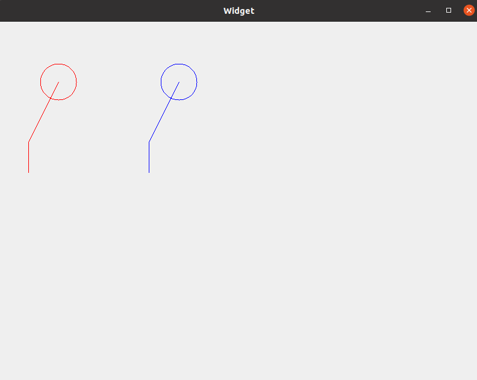


## 36、视频36：绘图设备QPixmap_QImage

QWidget

QPixmap：图片类，主要用于显示图片，对于图片的显示做了优化处理，和平台有关。

QImage：图片类，图片不依赖于平台，多用于图片的传输，可以做像素级的修改。

QBitmap

QPicture

### 1、QPixmap

```c++
#include "widget.h"
#include "ui_widget.h"
#include <QPainter>

Widget::Widget(QWidget *parent)
    : QWidget(parent)
    , ui(new Ui::Widget)
{
    ui->setupUi(this);
    
    // 绘图设备 QPixmap
    QPixmap pix(400, 300); // 设置图像像素 400 * 300
    pix.fill(Qt::white); // 背景颜色设置，默认黑色
    QPainter painter(&pix); 
    
}

Widget::~Widget()
{
    delete ui;
}
```


```
QPainter painter(&pix); 
```

原型：QPainter::QPainter([QPaintDevice](qpaintdevice.html) **device*)，其中 QPaintDevice 可以是以下类型：

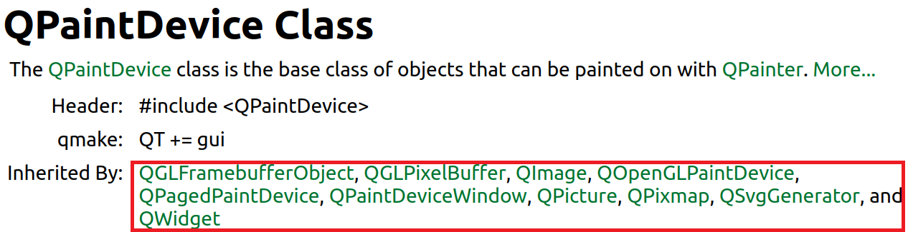

之前在Widget的构造函数中使用this，使之运行后可以在widget界面显示 。


运行结果：

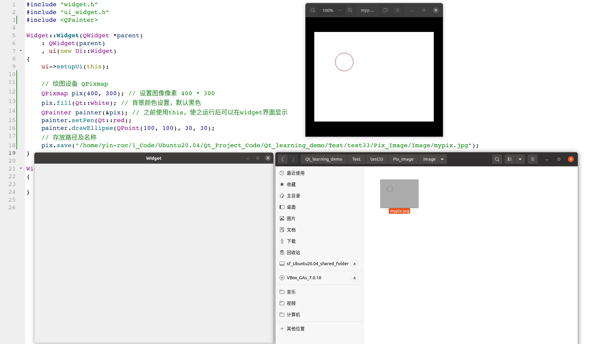


### 2、QImage

```c++
#include "widget.h"
#include "ui_widget.h"
#include <QPainter>

Widget::Widget(QWidget *parent)
    : QWidget(parent)
    , ui(new Ui::Widget)
{
    ui->setupUi(this);

    // QImage
    QImage img(400, 300, QImage::Format_RGB32);
    img.fill(Qt::white);
    QPainter painter(&img);
    painter.setPen(Qt::red);
    painter.drawEllipse(QPoint(100, 100), 50, 50);
    img.save("/home/yin-roc/1_Code/Ubuntu20.04/Qt_Project_Code/Qt_learning_demo/Test/test33/Pix_Image/Image/myImage.jpg");
}

Widget::~Widget()
{
    delete ui;
}
```

运行结果如下：

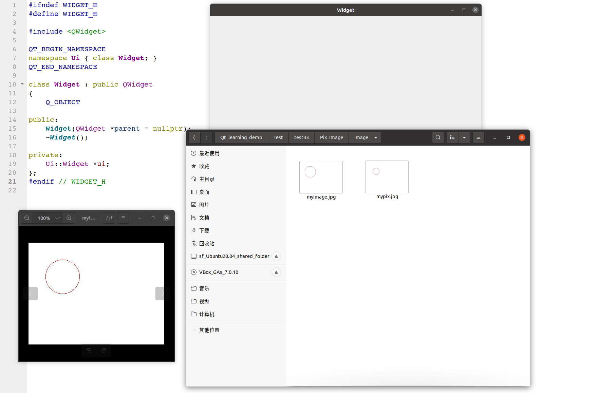


2.2	像素修改

1、导入资源图片擎天柱

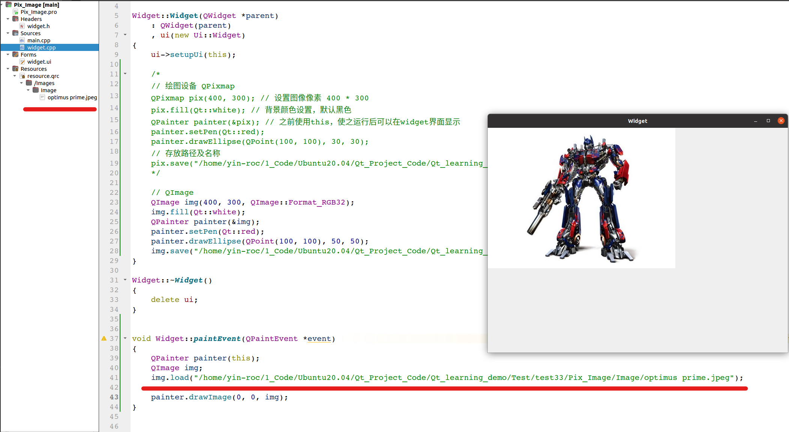

2、事件处理函数

```c++
void paintEvent(QPaintEvent *event);
```

```c++
void Widget::paintEvent(QPaintEvent *event)
{
    QPainter painter(this);
    QImage img;
    img.load("/home/yin-roc/1_Code/Ubuntu20.04/Qt_Project_Code/Qt_learning_demo/Test/test33/Pix_Image/Image/optimus prime.jpeg");
    for(int i = 50; i < 100; i++) // 50 * 50 的红方格
    {
        for(int j = 50; j < 100; j++)
        {
            QRgb rgb = qRgb(255, 0, 0);
            img.setPixel(i, j, rgb);
        }
    }
    
    painter.drawImage(0, 0, img);
}
```

 运行结果如下：

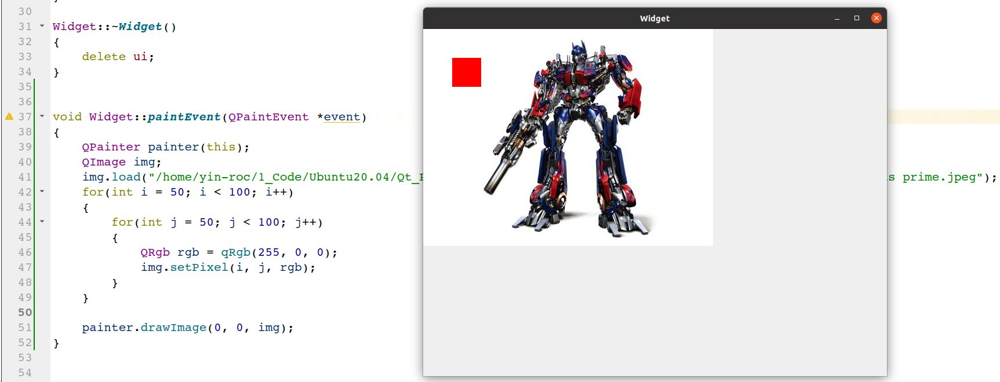


## 37、视频37：绘图设备QPicture和QBitmap

### 1、QPicture

QPicture 可以理解为是一个绘图的容器，里面保存有绘图的记录和重绘制的指令；存储的形式是二进制形式，也就是说我们无法双击打开 picture 文件。

1.1	头文件

```
#include <QPicture>
#include <QPainter>
```

1.2	代码文件

```c++
#include "widget.h"
#include "ui_widget.h"
#include <QPicture>
#include <QPainter>

Widget::Widget(QWidget *parent)
    : QWidget(parent)
    , ui(new Ui::Widget)
{
    ui->setupUi(this);

    QPicture pic;
//    QPainter painter(&pic); // 形式1
    QPainter painter;   // 形式2
    painter.begin(&pic); // 形式2
    
    painter.setPen(Qt::red);
    painter.drawEllipse(QPoint(100, 100), 50, 50);
    painter.end();
    pic.save("/home/yin-roc/1_Code/Ubuntu20.04/Qt_Project_Code/Qt_learning_demo/Test/test34/QPicture_QBitmap/Image/pic.jpg");
}

Widget::~Widget()
{
    delete ui;
}
```

1.3	painter.end() 函数

end() 的调用确实与 QPicture 有关，因为它涉及到将绘图结果保存到  QPicture  中。这种方式使得你可以在需要的时候使用 QPicture 对象进行重绘，而不必再次执行相同的绘图操作。

如果没有painter.end()这一句，则不会有图片生成


1.4	加载已经存储的图像

```c++
void Widget::paintEvent(QPaintEvent *)
{
    QPainter painter(this);
    QPicture pic;
    // 加载图片
    pic.load("/home/yin-roc/1_Code/Ubuntu20.04/Qt_Project_Code/Qt_learning_demo/Test/test34/QPicture_QBitmap/Image/pic.jpg");
    painter.drawPicture(0, 0, pic);
}
```

1.5	运行结果

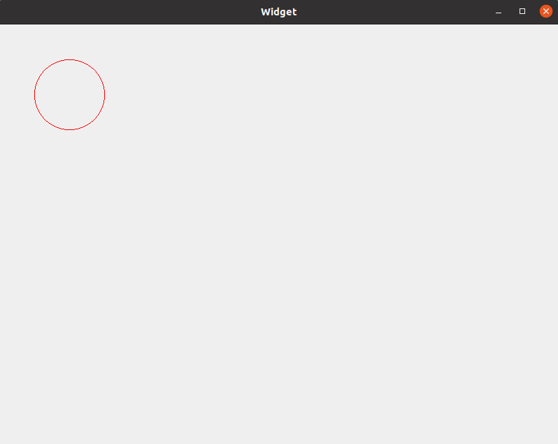


### 2、QBitmap

==QBitmap 绘制出来的是黑白的==

2.1	头文件：

```c++
#include <QBitmap>
```

2.2	代码文件

```c++
// QBitmap 绘制出来的是黑白的
    QBitmap bm(400, 300);
    QPainter painter(&bm);
    painter.setPen(Qt::red);
    painter.drawEllipse(QPoint(100, 100), 50, 50);
    bm.save("/home/yin-roc/1_Code/Ubuntu20.04/Qt_Project_Code/Qt_learning_demo/Test/test34/QPicture_QBitmap/Image/bm.jpg");
```

2.3	运行结果

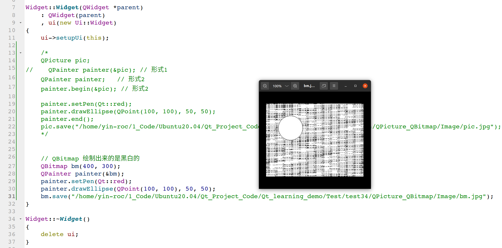

2.4	用QBitmap查看彩色图像

```c++
void Widget::paintEvent(QPaintEvent *)
{
    // QBitmap 打开彩色图片
    QPainter painter(this);
    QBitmap bm;
    // 加载图片
    bm.load("/home/yin-roc/1_Code/Ubuntu20.04/Qt_Project_Code/Qt_learning_demo/Test/test34/QPicture_QBitmap/Image/bm.jpg");
    painter.drawPixmap(0, 0, bm);
}
```

2.5	运行结果

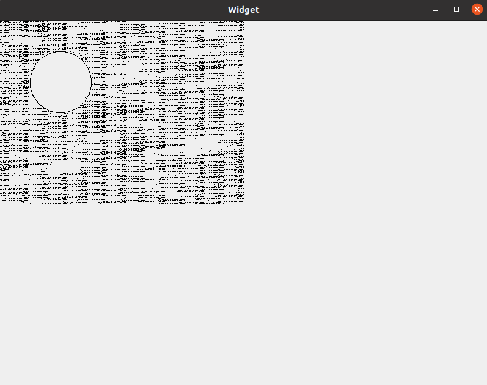


## 38、绘制弧线

### 1、本节内容

绘制一个半圆形图形。

### 2、具体步骤

2.1	前期准备

```c++
Widget::Widget(QWidget *parent)
    : QWidget(parent)
    , ui(new Ui::Widget)
{
    ui->setupUi(this);
    resize(1600, 900); // 原型this->resize(),但在widget构造函数里面，因此省略了this
    this->setStyleSheet("background-color: black"); // 背景全黑
}
```


2.2	重写事件处理函数

```c++
void Widget::paintEvent(QPaintEvent *)
{
    QPainter painter(this);
    QPen pen;

    pen.setColor(Qt::green);
    painter.setPen(pen);

    painter.drawArc(25, 25, 1550, 1550, 0 * 16, 180 * 16); // 参数5以 1/16 度为单位，参数为16，意味着16 * (1/16) = 1度 // y
    painter.drawArc(180, 180, 1240, 1240, 0 * 16, 180 * 16);
    painter.drawArc(335, 335, 930, 930, 0 * 16, 180 * 16);
    painter.drawArc(490, 490, 620, 620, 0 * 16, 180 * 16);
    painter.drawArc(645, 645, 310, 310, 0 * 16, 180 * 16);
}
```


```
void QPainter::drawArc(int *x*, int *y*, int *width*, int *height*, int *startAngle*, int *spanAngle*)
```

绘制由矩形定义的弧，该矩形始于 (x, y)，具有指定的宽度和高度，以及给定的 startAngle 和 spanAngle。

- 
- 参数5以 1/16 度为单位，参数为16，意味着16 * (1/16) = 1度


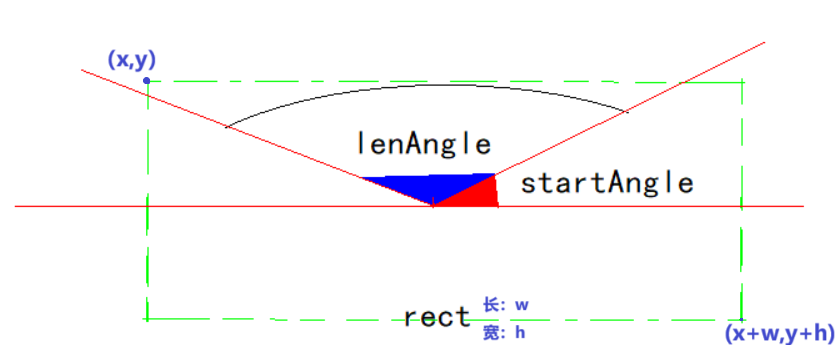

第一个drawArc计算如下图所示：

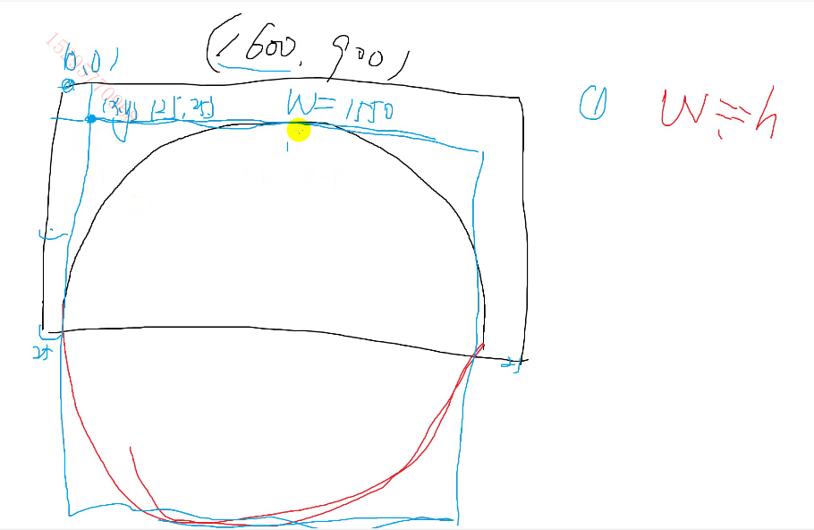

### 3、运行结果：

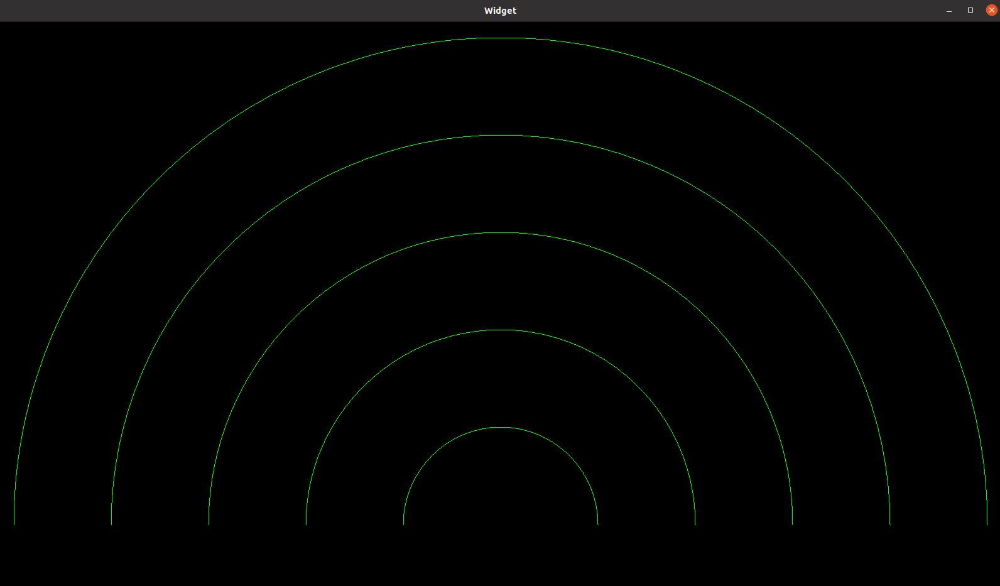


## 39、超声波雷达项目界面设计_01雷达主界面

### 1、本节内容

以上节视频的绘制曲线界面为背景，绘制雷达界面

### 2、具体步骤

2.1	全部代码

```c++
#include "widget.h"
#include "ui_widget.h"
#include <QPainter>
#include <QtMath>

Widget::Widget(QWidget *parent)
    : QWidget(parent)
    , ui(new Ui::Widget)
{
    ui->setupUi(this);

    resize(1600, 900); // 原型this->resize(),但在widget构造函数里面，因此省略了this
    this->setStyleSheet("background-color: black"); // 背景全黑

}

Widget::~Widget()
{
    delete ui;
}


void Widget::paintEvent(QPaintEvent *)
{
    QPainter painter(this);
    QPen pen;

    painter.setRenderHint(QPainter::Antialiasing); // 抗锯齿


    pen.setColor(Qt::green);
    painter.setPen(pen);

    painter.drawArc(100, 100, 1400, 1400, 0 * 16, 180 * 16); // 参数5以 1/16 度为单位，参数为16，意味着16 * (1/16) = 1度
    painter.drawArc(240, 240, 1120, 1120, 0 * 16, 180 * 16);
    painter.drawArc(380, 380, 840, 840, 0 * 16, 180 * 16);
    painter.drawArc(520, 520, 560, 560, 0 * 16, 180 * 16);
    painter.drawArc(660, 660, 280, 280, 0 * 16, 180 * 16);

    // 底部画一道线    
    painter.drawLine(0, 800, 1600, 800);

    // 每隔30度画一道线
    painter.save(); // 保存一下坐标系：原坐标系
    painter.translate(800, 800);

    for(int i = 0; i < 5; i++)
    {
        painter.rotate(-30); // 旋转坐标系30度，相对于原坐标系逆时针旋转30度
        painter.drawLine(0, 0, 720, 0);
    }
    painter.restore(); // 恢复到原坐标系

    painter.save();
    QFont font("Courier 10 Pitch", 30, QFont::Bold, true);
    painter.setFont(font);
    painter.setPen(Qt::green);
    painter.translate(800, 800); // 平移当前坐标系原点

    painter.drawText(720, 0, "0°");

    // 角度刻度
    // x = 720 * cos30, y = 720 * sin30
    painter.drawText(720 * qCos(qDegreesToRadians(30.0)), 720 * qSin(qDegreesToRadians(-30.0)), "30°"); // 坐标原点的右下方才是x正和y正
    painter.drawText(720 * qCos(qDegreesToRadians(60.0)), 720 * qSin(qDegreesToRadians(-60.0)), "60°");
    painter.drawText(720 * qCos(qDegreesToRadians(90.0))-20, 720 * qSin(qDegreesToRadians(-90.0)), "90°");
    painter.drawText(720 * qCos(qDegreesToRadians(120.0))-40, 720 * qSin(qDegreesToRadians(-120.0)), "120°");
    painter.drawText(720 * qCos(qDegreesToRadians(150.0))-80, 720 * qSin(qDegreesToRadians(-150.0)), "150°");
    painter.drawText(720 * qCos(qDegreesToRadians(180.0))-80, 720 * qSin(qDegreesToRadians(-180.0)), "180°");

    // 距离刻度
    painter.drawText(140, 30, "10cm");
    painter.drawText(280, 30, "20cm");
    painter.drawText(420, 30, "30cm");
    painter.drawText(560, 30, "40cm");
    painter.drawText(700, 30, "50cm");

}
```


2.2	Qt中 sin 和 cos 的函数使用

1. 头文件

    ```
    #include <QtMath>
    ```

2. 两个函数原型

[q](qtglobal.html#qreal-typedef)real qSin([qreal](qtglobal.html#qreal-typedef) *v*)

[q](qtglobal.html#qreal-typedef)real qCos([qreal](qtglobal.html#qreal-typedef) *v*)

这里的角度 v 使用的是==弧度制==！

但是 该头文件中同样提供了 qDegreesToRadians(float *degrees*)  来将角度转换为弧度制


### 3、运行结果

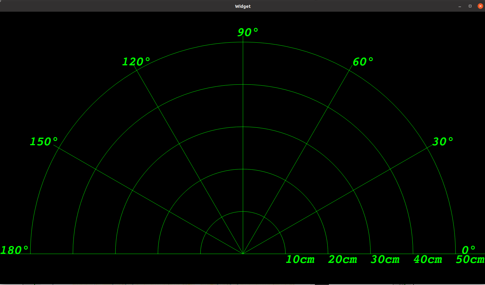


## 40、超声波雷达项目界面设计_02：绘制扫描效果

### 1、本节内容

在上一节的基础上，增加了动态扫描效果。

### 2、具体步骤

2.1	构建一条扫描线线段

```c++
// 扫描线段
pen.setWidth(12);
painter.setPen(pen);
painter.save();
painter.translate(800, 800);
int x = int(700 * qCos(qDegreesToRadians(angle)));
int y = int(-700 * qSin(qDegreesToRadians(angle)));
painter.drawLine(0, 0, x, y);
```

运行结果如图所示：

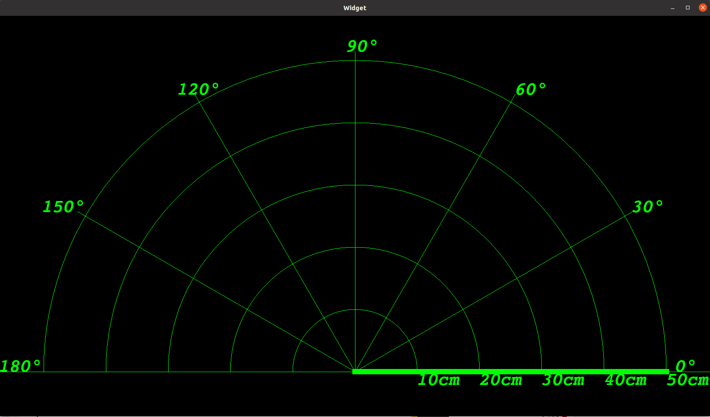


2.2	线段旋转

头文件：

```c++
public slots:
    void timerTimeout();

private:
    Ui::Widget *ui;
    double angle = 0.0;
    int flag = 0;
```

源文件：

```c++
// 定时器实现线段旋转
QTimer * timer = new QTimer(this);
timer->start(20);
connect(timer, &QTimer::timeout, this, &Widget::timerTimeout);
```

```c++
void Widget::timerTimeout()
{
//    qDebug() << "hello world!";
    if(flag == 0)
    {
        angle++;
        if(angle == 180.0)
            flag = 1;
    }
    else
    {
        angle--;
        if(angle == 0)
            flag = 0;
    }

    update(); // 刷新串口部件
}
```

效果如下：

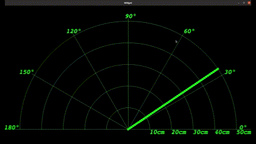


2.3	拖影（余影）设置

```c++
    // 添加余影/拖影
    double d_angle = angle;
    if(flag == 0)
    {
        for(int num = 1; num <= d_angle; num++)
        {
            painter.setOpacity(1 - num * 1.0 / ((d_angle > 30.0) ? 30.0 : d_angle));
            x = int(700 * qCos(qDegreesToRadians(d_angle - num)));
            y = int(-700 * qSin(qDegreesToRadians(d_angle - num)));
            painter.drawLine(0, 0, x, y);
            if(num == 30) // 设置最多拖影为 30 个
                break;
        }
    }
    else if(flag == 1)
    {
        for(int num =1; num <= (180 - d_angle); num++)
        {
            painter.setOpacity(1 - num * 1.0 / (((180 - d_angle) > 30.0) ? 30.0 : (180 - d_angle)));
            x = int(700 * qCos(qDegreesToRadians(d_angle + num)));
            y = int(-700 * qSin(qDegreesToRadians(d_angle + num)));
            painter.drawLine(0, 0, x, y);
            if(num == 30)
                break;
        }
    }
```

### 3、运行结果

总体代码：

头文件：

```c++
#ifndef WIDGET_H
#define WIDGET_H

#include <QWidget>

QT_BEGIN_NAMESPACE
namespace Ui { class Widget; }
QT_END_NAMESPACE

class Widget : public QWidget
{
    Q_OBJECT

public:
    Widget(QWidget *parent = nullptr);
    ~Widget();
    void paintEvent(QPaintEvent *);

public slots:
    void timerTimeOut();

private:
    Ui::Widget *ui;
    double angle = 0.0;
    int flag = 0; // 0代表逆时针转动，1代表顺时针转动
};
#endif // WIDGET_H
```

源文件：

```c++
#include "widget.h"
#include "ui_widget.h"
#include <QPainter>
#include <QtMath>
#include <QTimer>
#include <QDebug>

Widget::Widget(QWidget *parent)
    : QWidget(parent)
    , ui(new Ui::Widget)
{
    ui->setupUi(this);

    resize(1600, 900); // 原型this->resize(),但在widget构造函数里面，因此省略了this
    this->setStyleSheet("background-color: black"); // 背景全黑

    QTimer * timer = new QTimer(this);
    timer->start(20);
    connect(timer, &QTimer::timeout, this, &Widget::timerTimeOut);


}

Widget::~Widget()
{
    delete ui;
}


void Widget::paintEvent(QPaintEvent *)
{
    QPainter painter(this);
    QPen pen;

    painter.setRenderHint(QPainter::Antialiasing); // 抗锯齿


    pen.setColor(Qt::green);
    painter.setPen(pen);

    painter.drawArc(100, 100, 1400, 1400, 0 * 16, 180 * 16); // 参数5以 1/16 度为单位，参数为16，意味着16 * (1/16) = 1度
    painter.drawArc(240, 240, 1120, 1120, 0 * 16, 180 * 16);
    painter.drawArc(380, 380, 840, 840, 0 * 16, 180 * 16);
    painter.drawArc(520, 520, 560, 560, 0 * 16, 180 * 16);
    painter.drawArc(660, 660, 280, 280, 0 * 16, 180 * 16);

    // 底部画一道线
    painter.drawLine(0, 800, 1600, 800);

    // 每隔30度画一道线
    painter.save(); // 保存一下坐标系：原坐标系
    painter.translate(800, 800);

    for(int i = 0; i < 5; i++)
    {
        painter.rotate(-30); // 旋转坐标系30度，相对于原坐标系逆时针旋转30度
        painter.drawLine(0, 0, 720, 0);
    }
    painter.restore(); // 恢复到原坐标系

    painter.save();
    QFont font("Courier 10 Pitch", 30, QFont::Bold, true);
    painter.setFont(font);
    painter.setPen(Qt::green);
    painter.translate(800, 800); // 平移当前坐标系原点

    painter.drawText(720, 0, "0°");

    // 角度刻度
    // x = 720 * cos30, y = 720 * sin30
    painter.drawText(720 * qCos(qDegreesToRadians(30.0)), -720 * qSin(qDegreesToRadians(30.0)), "30°"); // 坐标原点的右下方才是x正和y正
    painter.drawText(720 * qCos(qDegreesToRadians(60.0)), -720 * qSin(qDegreesToRadians(60.0)), "60°");
    painter.drawText(720 * qCos(qDegreesToRadians(90.0))-20, -720 * qSin(qDegreesToRadians(90.0)), "90°");
    painter.drawText(720 * qCos(qDegreesToRadians(120.0))-40, -720 * qSin(qDegreesToRadians(120.0)), "120°");
    painter.drawText(720 * qCos(qDegreesToRadians(150.0))-80, -720 * qSin(qDegreesToRadians(150.0)), "150°");
    painter.drawText(720 * qCos(qDegreesToRadians(180.0))-80, -720 * qSin(qDegreesToRadians(180.0)), "180°");

    // 距离刻度
    painter.drawText(140, 30, "10cm");
    painter.drawText(280, 30, "20cm");
    painter.drawText(420, 30, "30cm");
    painter.drawText(560, 30, "40cm");
    painter.drawText(700, 30, "50cm");
    painter.restore();

    // 扫描线段
    pen.setWidth(12);
    painter.setPen(pen);
    painter.save();
    painter.translate(800, 800);
    int x = int(700 * qCos(qDegreesToRadians(angle))); // 强制类型转换
    int y = int(-700 * qSin(qDegreesToRadians(angle))); // 右下方 x 和 y 是正的，右上方 x 是正的， y 是负的。
    painter.drawLine(0, 0, x, y);

    // 添加余影
    double d_angle = angle;
    if(flag == 0)
    {
        for(int num = 1; num <= d_angle; num++)
        {
            painter.setOpacity(1 - num * 1.0 / ((d_angle > 30.0) ? 30.0 : d_angle)); // 设置透明度
            x = int(700 * qCos(qDegreesToRadians(d_angle - num)));
            y = int(-700 * qSin(qDegreesToRadians(d_angle - num)));
            painter.drawLine(0, 0 , x, y);
            if(num == 30) // 设置最多拖影为 30 个
                break;
        }
    }
    else if(flag == 1)
    {
        for(int num = 1; num <= (180 - d_angle); num++)
        {
            painter.setOpacity(1 - num * 1.0 / (((180 - d_angle) > 30.0) ? 30.0 : (180 - d_angle))); // 设置透明度
            x = int(700 * qCos(qDegreesToRadians(d_angle + num)));
            y = int(-700 * qSin(qDegreesToRadians(d_angle + num)));
            painter.drawLine(0, 0 , x, y);
            if(num == 30)
                break;
        }
    }

    painter.restore();

}


void Widget::timerTimeOut()
{
    // 更新角度
//    qDebug() << "hello world!";
    if(flag == 0)
    {
        angle++;
        if(angle == 180)
            flag = 1;
    }
    else
    {
        angle--;
        if(angle == 0)
            flag = 0;
    }

    update();
}
```

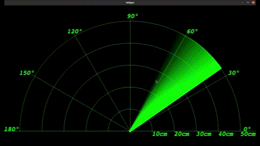


## 41、超声波雷达项目界面设计_03：Qt串口接收STM32发送的角度值


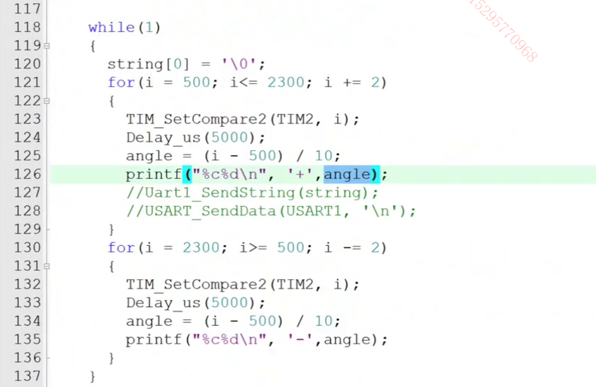


## 43、视频43：文件读写

### 1、本节内容

文件的读与写

### 2、具体步骤

2.1	创建如图所示 ui 界面

从左往右，从上往下依次为：LineEdit、PushButtonn、TextEdit。

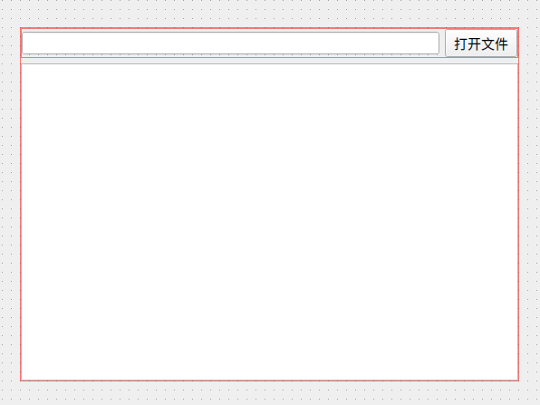

2.2	信号与槽

```c++
connect(ui->pushButton, &QPushButton::clicked, this, [&](){});
```


2.3	读操作

```c++
#include "widget.h"
#include "ui_widget.h"
#include <QFileDialog>
#include <QFile>

Widget::Widget(QWidget *parent)
    : QWidget(parent)
    , ui(new Ui::Widget)
{
    ui->setupUi(this);

    connect(ui->pushButton, &QPushButton::clicked, this, [&](){
        QString filename = QFileDialog::getOpenFileName(this, "打开文件", "/home/yin-roc/1_Code/Ubuntu20.04/Qt_Project_Code/Qt_learning_demo/Test/test40/File");
        ui->lineEdit->setText(filename);
        QFile file(filename); // 将QFile对象关联到指定文件

        // 读
        file.open(QIODevice::ReadOnly);
//        QByteArray array = file.readAll(); // 读取全部内容
        QByteArray array;
        while(!file.atEnd())
        {
            array += file.readLine(); // 一行一行的读取
        }
        ui->textEdit->setText(array); // 此处发生了隐式转换
        file.close();
    });
}

Widget::~Widget()
{
    delete ui;
}


```

```c++
QString getOpenFileName(QWidget *parent = nullptr, const QString &caption = QString(), const QString &dir = QString(), const QString &filter = QString(), QString *selectedFilter = nullptr, QFileDialog::Options options = Options())
```

parent: 指定文件对话框的**父窗口**，即文件对话框在哪个窗口上显示。默认为nullptr，表示没有父窗口。

caption: 文件**对话框的标题**，显示在对话框的顶部。默认为一个空字符串。

dir: 指定对话框打开时显示的**目录路径**。默认为一个空字符串，表示使用系统默认目录。

filter: 用于筛选文件类型的过滤器，可以限制用户只能选择特定类型的文件。例如，"Text files (.txt);;XML files (.xml)"。默认为一个空字符串，表示不使用文件类型过滤器。

selectedFilter: 用于存储用户选择的过滤器的指针。如果用户选择了特定类型的文件，该指针将被设置为相应的过滤器字符串。默认为nullptr，表示不需要存储选择的过滤器。

options: 包含文件对话框的选项，以控制对话框的行为。这是一个包含多个选项的枚举类型，可以设置多个选项的组合。默认为Options()，表示没有特殊选项。


2.4	读操作运行结果

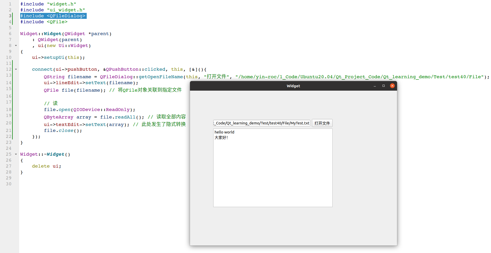


2.5	写操作

```c++
#include "widget.h"
#include "ui_widget.h"
#include <QFileDialog>
#include <QFile>

Widget::Widget(QWidget *parent)
    : QWidget(parent)
    , ui(new Ui::Widget)
{
    ui->setupUi(this);

    connect(ui->pushButton, &QPushButton::clicked, this, [&](){
        QString filename = QFileDialog::getOpenFileName(this, "打开文件", "/home/yin-roc/1_Code/Ubuntu20.04/Qt_Project_Code/Qt_learning_demo/Test/test40/File");
        ui->lineEdit->setText(filename);
        QFile file(filename); // 将QFile对象关联到指定文件

        // 读
        file.open(QIODevice::ReadOnly);
//        QByteArray array = file.readAll(); // 读取全部内容
        QByteArray array;
        while(!file.atEnd())
        {
            array += file.readLine(); // 一行一行的读取
        }
        ui->textEdit->setText(array); // 此处发生了隐式转换
        file.close();
        //-------------------------------------------------------------------------------------------------//
        // 写
        file.open(QIODevice::Append); // 单纯写入会覆盖原有内容，因此选择在原文末尾追加
        file.write("I love you, Rick!");
        file.close(); // 隐式转换
    });
}

Widget::~Widget()
{
    delete ui;
}
```

==Tips：==

1. **文件选择后立即读取**：在第一次运行时，你选择了文件后，立即读取了文件内容并显示在 textEdit 中。但由于在第一次运行时，文件末尾并没有追加内容，所以看起来好像没有写入。第二次运行时，由于上一次已经在文件末尾追加了内容，所以能够读取到并显示。
2. **文件读写位置**：在读取后，文件的读写位置（文件指针）可能已经在文件的末尾。在写入前，你没有将文件指针重新设置到文件的开头，导致追加的写入也发生在文件的末尾。在第一次运行时，这可能导致看不到之前追加的内容。

为了解决这个问题，你可以在写入前使用 file.seek(0) 将文件指针重新设置到文件的开头，确保写入操作发生在文件的开头而不是末尾。修改代码如下：

```
// 写
file.open(QIODevice::Append);
file.seek(0); // 将文件指针设置到文件开头
file.write("I love you, Rick!");
file.close();
```

2.6	运行结果

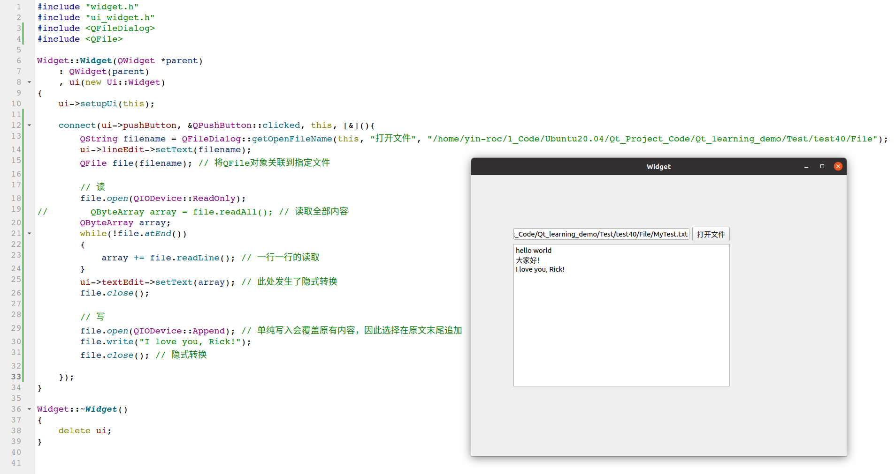


## 44、视频44：文件信息和文件定位操作

### 1、本节内容

输出文件信息和文件定位修改

### 2、具体步骤

2.1	输出文件信息

```c++
QFile file("/home/yin-roc/1_Code/Ubuntu20.04/Qt_Project_Code/Qt_learning_demo/Test/test41/File/MyTest.txt");
QFileInfo info(file);
qDebug() << "绝对路径：" << info.absoluteFilePath();
qDebug() << "文件名：" << info.fileName();
qDebug() << "后缀名：" << info.suffix();
qDebug() << "创建时间：" << info.created();
qDebug() << "文件大小：" << info.size();
```

运行结果如图所示：

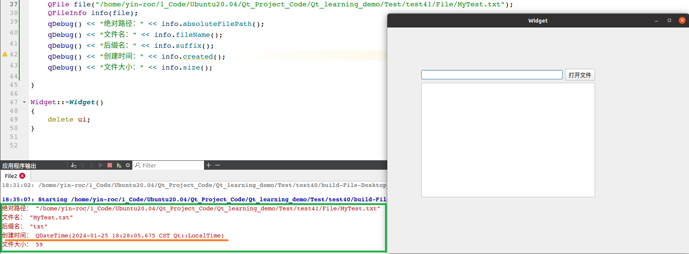


2.2	想要传统的输出时间，比如年月日等

​	修改对应语句如下：

```c++
qDebug() << "创建时间：" << info.created().toString("yyyy.MM.dd hh:mm:ss");
```

运行结果如下：

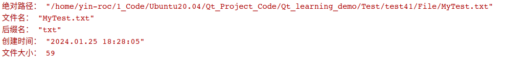

2.3	修改文件定位	

```c++
c    file.open(QIODevice::ReadOnly);
    file.seek(0); // 当前文件指针指向文件开头
    QByteArray array = file.read(5);
    qDebug() << "前 5 个字节：" << array;
    qDebug() << "当前位置：" << file.pos();
    file.seek(15); // 当前文件指针指向文件第十五个字符后面
    array = file.read(5);
    qDebug() << "第 16 ～ 20 个字节：" << array;
    file.close();
```

运行结果如图所示：

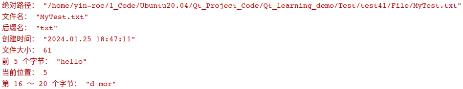


## 45、视频45：目录操作：文件系统监视器

### 1、本节内容

1. 文件目录相关操作
2. 文件系统监视器

### 2、具体步骤

2.1	使用 currentPath() 输出当前的文件路径

1. 包含头文件

	```c++
	#include <QDir>
	#include <QDebug>
	```

2. 具体代码

	```c++
	QDir myDir(QDir::currentPath());
	qDebug() << myDir;
	```

3. 输出结果

	```c++
	QDir( "/home/yin-roc/1_Code/Ubuntu20.04/Qt_Project_Code/Qt_learning_demo/Test/test42/build-Dir-Desktop_Qt_5_13_2_GCC_64bit-Debug" , nameFilters = { "*" },  QDir::SortFlags( Name | IgnoreCase ) , QDir::Filters( Dirs|Files|Drives|AllEntries ) )
	```

2.2	直接加载文件具体目录

1. 具体代码

	```c++
	QDir myDir("/home/yin-roc/1_Code/Ubuntu20.04/Qt_Project_Code/Qt_learning_demo/Test/test42/Dir");
	ui->listWidget->addItem(myDir.absolutePath()); // 返回文件的绝对路径，但不包括文件名
	```

	运行结果如下所示：

	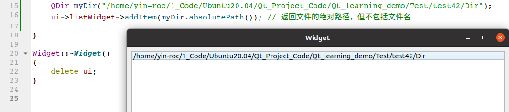

2. QFileInfo 类中的 absolutePath() 和 absoluteFilePath() 的区别

	absolutePath()：

	（1）返回文件的绝对路径，但==不包括文件名==。

	（2）如果你有一个 QFileInfo 对象表示文件，调用 absolutePath 将返回文件所在目录的绝对路径。

	absoluteFilePath():

	（1）返回==包括文件名在内的完整绝对路径==。

	（2）如果你有一个 QFileInfo 对象表示文件，调用 absoluteFilePath 将返回包括文件名在内的完整路径。

3. entiryList() 函数

	（1）包含在头文件 QDir 中；

	（2）用于获取目录中的文件和子目录的列表；

	（3）返回一个 QStringList ，其中包含目录中所有文件和子目录的名称。

	（4）运行结果如下所示：

	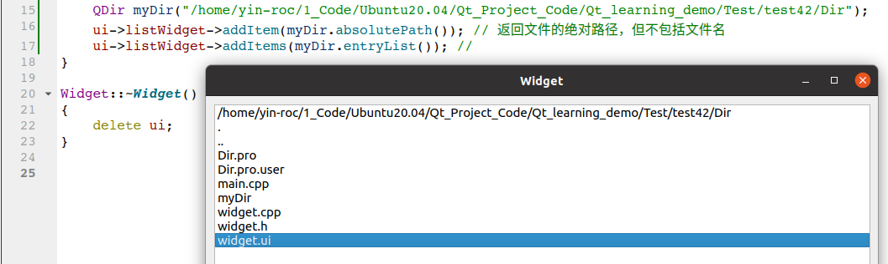

	**tips：**"."代表当前目录；".."代表父目录

2.3	设置过滤器（setNameFilters）

1. 包含在头文件 QDir 中；

2. 用于设置文件名的过滤器，可以指定只返回符合特定规则的文件；

3. void QDir::setNameFilters(const QStringList &nameFilters);

4. 具体代码如下：

	```c++
	myDir.setNameFilters(QStringList("*.cpp")); // 设置过滤器，筛选出所有的 Cpp 文件
	ui->listWidget->addItems(myDir.entryList());
	```

5. 运行结果如下：

	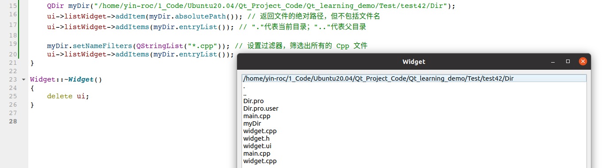


2.4	文件系统监视器

1. 创建需要监测的文件夹

	```c++
	myDir.mkdir("/home/yin-roc/1_Code/Ubuntu20.04/Qt_Project_Code/Qt_learning_demo/Test/test42/Dir/myDir");
	```

2. 创建 QFileSystemWatcher 类的对象

	主要作用是允许你在运行时获得关于指定文件或目录状态变化的通知，如文件的创建、修改、删除，或者目录的内容变化等

	```c++
	QFileSystemWatcher myWatcher;
	```

3. 创建与监测器相关联的槽函数

	```c++
	void Showmessage(const QString &path);
	```

4. 添加需要监测的文件或目录到监测器中

	```c++
	/ 添加需要监测的文件或目录到监视器中
	    myWatcher.addPath("/home/yin-roc/1_Code/Ubuntu20.04/Qt_Project_Code/Qt_learning_demo/Test/test42/Dir/myDir");
	    myWatcher.addPath("/home/yin-roc/1_Code/Ubuntu20.04/Qt_Project_Code/Qt_learning_demo/Test/test42/Dir/Mytest.txt");
	```

5. 关联监视器触发信号和槽函数

	```c++
	connect(&myWatcher, &QFileSystemWatcher::directoryChanged, this, &Widget::Showmessage);
	connect(&myWatcher, &QFileSystemWatcher::fileChanged, this, &Widget::Showmessage);
	    
	void Widget::Showmessage(const QString &path)
	{
	    if(path == "/home/yin-roc/1_Code/Ubuntu20.04/Qt_Project_Code/Qt_learning_demo/Test/test42/Dir/myDir")
	        ui->listWidget->addItem("/home/yin-roc/1_Code/Ubuntu20.04/Qt_Project_Code/Qt_learning_demo/Test/test42/Dir/myDir 目录发生改变");
	    else
	        ui->listWidget->addItem("/home/yin-roc/1_Code/Ubuntu20.04/Qt_Project_Code/Qt_learning_demo/Test/test42/Dir/Mytest.txt 文件发生改变");
	    ui->listWidget->addItem("------------------------------------------------------");
	}    
	```

	

6. 运行结果

	（1）增加目录下的文件

	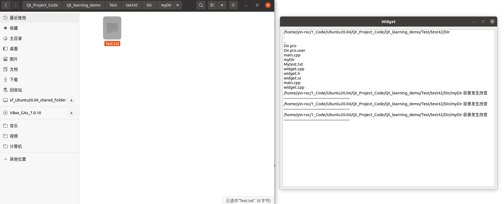

	

	（2）删减目录下的文件

	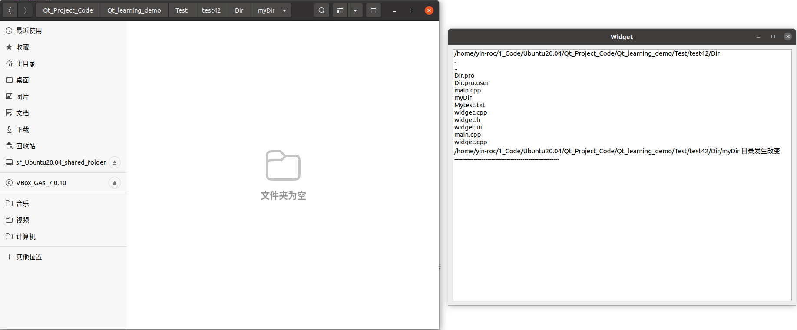

	

	（3）修改文件的内容

	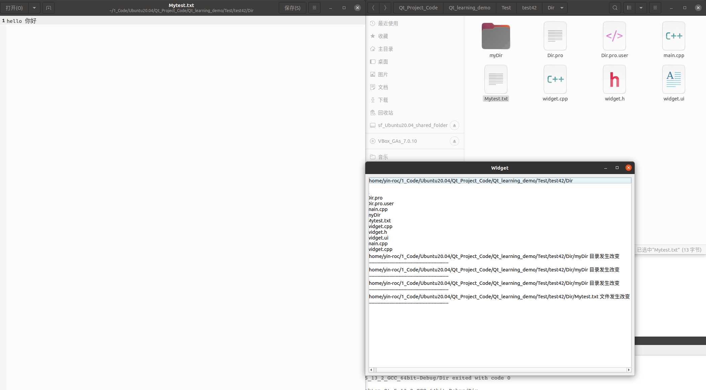


**tips：**为什么在目录下的文件新增文件会触发两次目录发生改变？

导致目录发生两次改变的原因是连接了 directoryChanged 信号和 fileChanged 信号，而这两个信号都关联到了 Widget::showMessage 槽函数。当你新建文件时，首先会触发 fileChanged 信号，然后可能会触发 directoryChanged 信号。

文件的新建可能会引发目录的改变。由于你在槽函数中没有对信号的来源进行区分，因此在文件改变时也会执行目录改变的逻辑。

为了避免重复的输出，你可以修改连接部分的代码，分别连接到不同的槽函数。

```c++
connect(&myWatcher, &QFileSystemWatcher::directoryChanged, this, &Widget::showDirectoryMessage);
connect(&myWatcher, &QFileSystemWatcher::fileChanged, this, &Widget::showFileMessage);
```

```c++
void Widget::showDirectoryMessage(const QString &path)
{
    ui->listWidget->addItem(path + " 目录发生改变");
    qDebug() << "Directory Changed: " << path;
}

void Widget::showFileMessage(const QString &path)
{
    ui->listWidget->addItem(path + " 文件发生改变");
    qDebug() << "File Changed: " << path;
}
```

  


## 46、视频46：文本流和数据流

### 1、本节内容

### 2、文本流具体步骤

2.1	头文件

```c++
#include <QTextStream>
```

2.2	具体代码

类似于 QFile 的读取方式，仿照如下代码：

```c++
/* QFile类 读
// 读
file.open(QIODevice::ReadOnly);
//        QByteArray array = file.readAll(); // 读取全部内容
QByteArray array;
while(!file.atEnd())
{
	array += file.readLine(); // 一行一行的读取
}
ui->textEdit->setText(array); // 此处发生了隐式转换
file.close();
```

对照修改如下：

```c++
// QTextStream 类读  文本流
// 读
file.open(QIODevice::ReadOnly);
QTextStream stream(&file); // QFile 类是 QIODevice 类的子类
stream.setCodec("utf-8"); // 防止中文乱码， 设置输出格式

QByteArray array;
while(!stream.atEnd())
{
	array += stream.readLine();
}

ui->textEdit->setText(array);
file.close();
```

2.3	运行结果

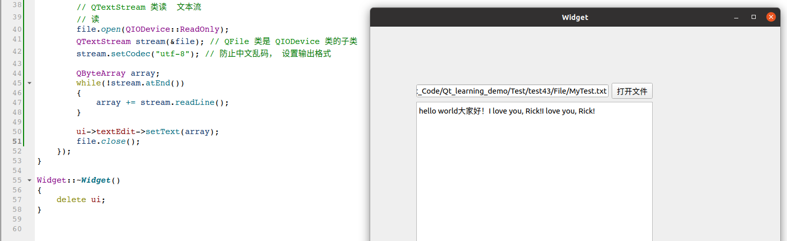

2.4	==文件流也可以写！==

### 3、数据流

3.1	头文件

```c++
#include <QDataStream>
#include <QDebug>
```

3.2 具体步骤

```c++
// 数据流
QFile file("/home/yin-roc/1_Code/Ubuntu20.04/Qt_Project_Code/Qt_learning_demo/Test/test43/File/file.dat");
file.open(QIODevice::WriteOnly);
QDataStream data_out_stream(&file);
data_out_stream << QString("Hello World") << (qint32)65;
file.close();

file.open(QIODevice::ReadOnly);
QDataStream data_in_stream(&file); // 读入文件
QString str;
qint32 n;
data_in_stream >> str >> n;
qDebug() << "str is" << str << ", n is" << n;
file.close();
```

3.3	运行结果

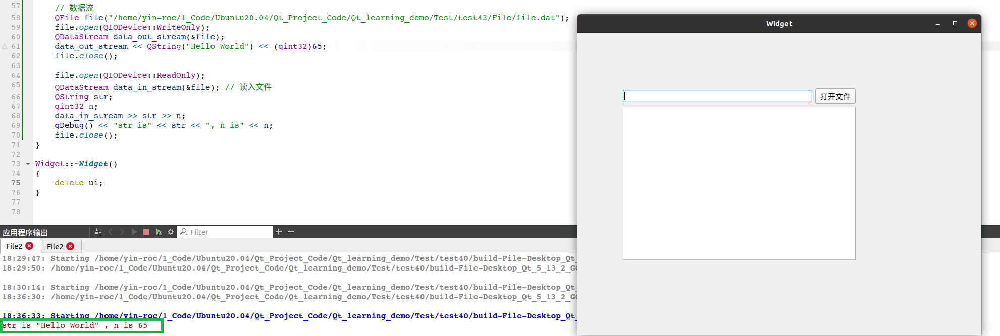

3.4	==数据流同样既可以读也可以写。==


## 47、视频47：播放音频文件

### 1、本节内容

打开项目文件夹里面文件并播放

### 2、具体步骤

assistant $\longrightarrow$ Qt Multimedia  $\longrightarrow$ Multimedia Recipes中查看：

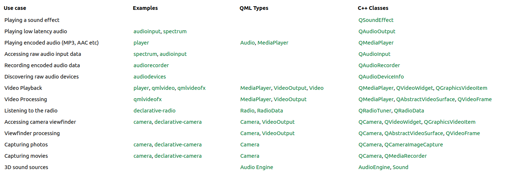

2.1	播放 mp3 文件

1. 在pro文件中加入构建工具

	```c++
	QT += multimedia
	```

2. 头文件包含

	```c++
	#include <QMediaPlayer> 
	```

3. 新建变量

	```c++
	QMediaPlayer * player;
	```

4. 具体代码

	```c++
	#include "widget.h"
	#include "ui_widget.h"
	#include <QDir>
	Widget::Widget(QWidget *parent)
	    : QWidget(parent)
	    , ui(new Ui::Widget)
	{
	    ui->setupUi(this);
	
	    player = new QMediaPlayer(this);
	    
	    // 获取当前应用程序的可执行文件所在的目录路径
	    QString appDir = QCoreApplication::applicationDirPath();
	
	    // 使用 QDir 构造函数创建一个 QDir 对象，表示应用程序目录。QDir 是 Qt 提供的处理目录和文件路径的类。
	    QDir sourceCodeDir(appDir);
	    
	    // 将当前目录切换到上一级目录，即源代码目录
	    sourceCodeDir.cdUp();
	    
	    //获取切换后的源代码目录的路径。现在，sourceCodePath 包含了源代码目录的绝对路径。
	    QString sourceCodePath = sourceCodeDir.path();
	    
	    // 构建音频文件的绝对路径
	    QString filePath_1 = sourceCodePath + "/Audio/1.mp3";
	    player->setMedia(QUrl::fromLocalFile(filePath_1));
	    player->setVolume(50);
	    player->play();
	    player->stop();
	}
	
	Widget::~Widget()
	{
	    delete ui;
	}
	```

2.2	播放 wav 文件

步骤与上面类似

1. 在pro文件中加入构建工具

	```c++
	QT += multimedia
	```

2. 头文件包含

	```c++
	#include <QSoundEffect>
	```

3. 新建变量

	```c++
	QSoundEffect * effect;
	```

4. 具体代码

	```c++
	//    打开 wav 文件
	effect = new QSoundEffect(this);
	QString filePath2 = sourceCodePath + "/Audio/2.wav"; // sourceCodePath来自 mp3 的程序
	effect->setSource(QUrl::fromLocalFile(filePath2));
	effect->setVolume(0.5); // 区别之处
	effect->play();
	effect->stop();
	```

### 3、构建ui界面

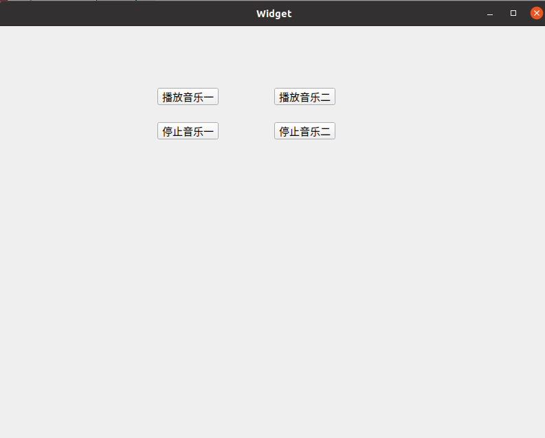

```c++
void Widget::on_pushButton_clicked()
{
    player->play();
}

void Widget::on_pushButton_2_clicked()
{
    player->stop();
}

void Widget::on_pushButton_3_clicked()
{
    effect->play();
}

void Widget::on_pushButton_4_clicked()
{
    effect->stop();
}
```


## 48、视频48：播放视频文件

### 1、本节内容

播放指定MP4和WMV文件

tips：Qt默认不支持视频播放，因此windows下的Qt给出了解决方案：安装 K-Lite_Codec_Pack_1720_Standard.exe 软件，==linux下目前可以播放MP4文件==

### 2、具体步骤

2.1	添加配置

1. Video.pro中：

	assistant $\longrightarrow$ QVideoWidget ：

	```c++
	QT       += multimediawidgets
	```

2. Widget.h 文件中：

	```c++
	#include <QMediaPlayer>
	#include <QVideoWidget>
	```

2.2	添加相关变量并初始化界面等

1. 变量

	```
	QMediaPlayer * player;
	QVideoWidget * videowidget;
	```

2. 变量初始化

	```c++
	player = new QMediaPlayer(this);
	videowidget = new QVideoWidget(this);
	```

3. 显示设置

	```c++
	videowidget->resize(800, 300);
	player->setVideoOutput(videowidget); // 设置视频显示所在
	```

2.3	设置 Ui 界面并关联相应槽函数


2.4	设置 pushButton （按钮：打开文件）关联槽函数

1. 头文件

	```c++
	QString fileName;
	```

2. 源文件

	```c++
	void Widget::on_pushButton_clicked()
	{
	//    创建一个文件对话框，允许用户选择一个文件
	//    初始目录是 "..\"(表示在当前项目文件中)，并将用户选择的文件的路径存储在 fileName 变量中
	    fileName = QFileDialog::getOpenFileName(this, "Open File", "..\\");
	    player->setMedia(QUrl::fromLocalFile(fileName));
	    player->play();    
	}
	```

3. 运行结果

	

4. 注意事项

	注意此处windows如果没有安装K-Lite_Codec_Pack_1720_Standard.exe ，则打不开该文件

2.5	设置按钮：播放、暂停和停止的功能


2.6	设置进度条可拖动播放视频

1. 获取当前视频总时长

	```c++
	void Get_Duration();
	```

	```c++
	connect(player, &QMediaPlayer::durationChanged, this, &Widget::Get_Duration);
	```

	```c++
	void Widget::Get_Duration()
	{
	    //    qDebug() << player->duration(); // 单位是毫秒
	    ui->horizontalSlider->setMaximum(player->duration());
	}
	```

2. 滑动组件horizontalSlider 与视频产生关联

	```c++
	unsigned long pos;
	```

	```
	void Slider_Changed();
	```

	```c++
	// 滑动组件horizontalSlider 与视频产生关联、
	connect(ui->horizontalSlider, &QSlider::valueChanged, this, &Widget::Slider_Changed);
	```

	```c++
	void Widget::Slider_Changed()
	{
	    pos = ui->horizontalSlider->value();
	    player->setPosition(pos);
	}
	```

3. 运行结果


### 3、具体代码

3.1	Video.pro

```c++
#-------------------------------------------------
#
# Project created by QtCreator 2024-01-29T16:55:47
#
#-------------------------------------------------

QT       += core gui
QT       += multimedia
QT       += multimediawidgets

greaterThan(QT_MAJOR_VERSION, 4): QT += widgets

TARGET = Video
TEMPLATE = app

# The following define makes your compiler emit warnings if you use
# any feature of Qt which has been marked as deprecated (the exact warnings
# depend on your compiler). Please consult the documentation of the
# deprecated API in order to know how to port your code away from it.
DEFINES += QT_DEPRECATED_WARNINGS

# You can also make your code fail to compile if you use deprecated APIs.
# In order to do so, uncomment the following line.
# You can also select to disable deprecated APIs only up to a certain version of Qt.
#DEFINES += QT_DISABLE_DEPRECATED_BEFORE=0x060000    # disables all the APIs deprecated before Qt 6.0.0

CONFIG += c++11

SOURCES += \
        main.cpp \
        widget.cpp

HEADERS += \
        widget.h

FORMS += \
        widget.ui

# Default rules for deployment.
qnx: target.path = /tmp/$${TARGET}/bin
else: unix:!android: target.path = /opt/$${TARGET}/bin
!isEmpty(target.path): INSTALLS += target
```

3.2	widget.h

```c++
#ifndef WIDGET_H
#define WIDGET_H

#include <QWidget>
#include <QMediaPlayer>
#include <QVideoWidget>

namespace Ui {
class Widget;
}

class Widget : public QWidget
{
    Q_OBJECT

public:
    explicit Widget(QWidget *parent = nullptr);
    ~Widget();

private slots:
    void on_pushButton_clicked();

    void on_pushButton_2_clicked();

    void on_pushButton_3_clicked();

    void on_pushButton_4_clicked();

    void Get_Duration();

    void Slider_Changed();


private:
    Ui::Widget *ui;
    QMediaPlayer * player;
    QVideoWidget * videowidget;
    QString fileName;
    unsigned long pos;


};

#endif // WIDGET_H
```

3.3	widget.cpp

```c++
#include "widget.h"
#include "ui_widget.h"
#include <QFileDialog>


Widget::Widget(QWidget *parent) :
    QWidget(parent),
    ui(new Ui::Widget)
{
    ui->setupUi(this);

    player = new QMediaPlayer(this);
    videowidget = new QVideoWidget(this);

    videowidget->resize(800, 300);
    player->setVideoOutput(videowidget); // 设置视频显示所在

    // 获取视频时长
    connect(player, &QMediaPlayer::durationChanged, this, &Widget::Get_Duration);

    // 滑动组件horizontalSlider 与视频产生关联、
    connect(ui->horizontalSlider, &QSlider::valueChanged, this, &Widget::Slider_Changed);

}

Widget::~Widget()
{
    delete ui;
}

void Widget::on_pushButton_clicked()
{
    fileName = QFileDialog::getOpenFileName(this, "Open File", "..\\"); // 创建对话框选择文件并设置初始目录
    player->setMedia(QUrl::fromLocalFile(fileName)); // 媒体文件路径存储
    player->play();
}

void Widget::on_pushButton_2_clicked()
{
    player->play();
}

void Widget::on_pushButton_3_clicked()
{
    player->pause();
}

void Widget::on_pushButton_4_clicked()
{
    player->stop();
}

void Widget::Get_Duration()
{
    //    qDebug() << player->duration(); // 单位是毫秒
    ui->horizontalSlider->setMaximum(player->duration());
}

void Widget::Slider_Changed()
{
    pos = ui->horizontalSlider->value();
    player->setPosition(pos);
}
```


## 49、视频49：摄像头

### 1、本节内容

打开一个摄像头，并能记录某时刻的截图。

所需头文件如下：

QCamera：用于打开摄像头设备；

QCameraInfo：和摄像头有关的信息和属性；

QCameraViewfinder：用于显示摄像头捕获的画面；

QCameraImageCapture：用于摄像头截图。

### 2、具体步骤

2.1	添加模块支持

```c++
QT       += multimedia
QT       += multimediawidgets
```

QT += multimedia：将Qt Multimedia模块包括在你的项目中，以便你可以使用它的功能，包括摄像头的访问。

QT += multimediawidgets：提供了一些用于显示和控制多媒体内容的小部件，可能对于实现摄像头预览和交互性更有用。


2.2	添加头文件

```c++
#include <QWidget>
#include <QCamera>
#include <QCameraInfo>
#include <QCameraViewfinder>
#include <QCameraImageCapture>
```

QCamera：用于打开摄像头设备；

QCameraInfo：和摄像头有关的信息和属性；

QCameraViewfinder：用于显示摄像头捕获的画面；

QCameraImageCapture：用于摄像头截图。


2.3	使用一个示例教程

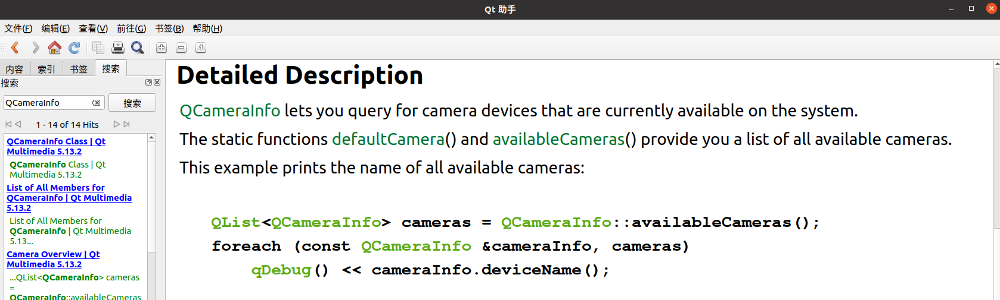

```c++
// 获取系统上可用摄像头的信息，然后将这些信息存储在QList容器中
QList<QCameraInfo> cameras = QCameraInfo::availableCameras(); 

// Qt中用于遍历容器元素的循环语法。它遍历cameras列表中的每个QCameraInfo对象，并将其赋值给cameraInfo变量。
//使用qDebug()将当前摄像头的设备名称输出到调试信息
foreach (const QCameraInfo &cameraInfo, cameras)
	qDebug() << cameraInfo.deviceName();
```


2.4	添加 QCamera 变量

```c++
QCamera * camera; // 设置摄像头参数、开始/停止预览，捕捉照片或录制视频等操作
```


2.5	绑定摄像头

```c++
camera = new QCamera(cameras.at(0)); // 从之前提到的摄像头列表中选择第一个摄像头（索引为0）
```


2.6	添加 QCameraViewfinder 变量

```c++
QCameraViewfinder * viewfinder; 
```


2.7	关联取景器与摄像头对象，并设置尺寸大小

将取景器与摄像头对象关联，从而在界面上显示摄像头的实时预览：

```c++
viewfinder = new QCameraViewfinder(this);
camera->setViewfinder(viewfinder);
```


设置尺寸大小：

```c++
viewfinder->resize(800, 350);
```


运行结果如下：

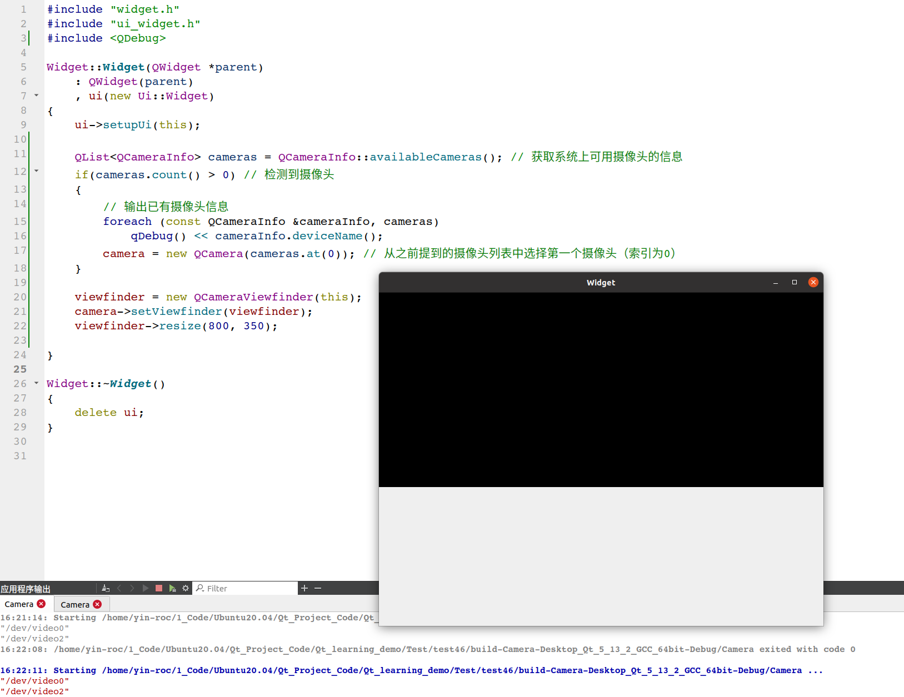


2.8	创建 QCameraImageCapture 变量

```c++
QCameraImageCapture * imageCapture; // 用于捕捉摄像头的静态图像（照片）
```


2.9	使用摄像头进行截图

```c++
imageCapture = new QCameraImageCapture(camera); // 使用摄像头进行截图
```


2.10	开启摄像头

```c++
camera->start();
```


运行结果如下：

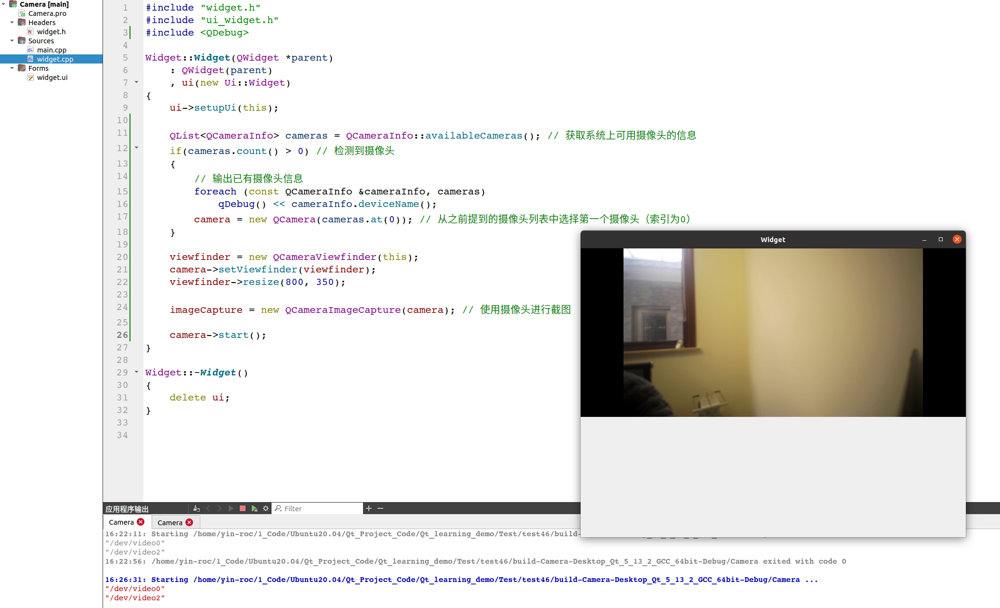


2.11	widget.ui 界面设置一个拍照按钮并编写其槽函数

```c++
void Widget::on_pushButton_clicked()
{
    camera->setCaptureMode(QCamera::CaptureStillImage); // 设置摄像头的捕捉模式为静态图像
    QString filename = QFileDialog::getSaveFileName(); // 弹出一个文件对话框，让用户选择保存图像的文件名和位置
    imageCapture->capture(filename); // 捕捉到的图像保存到用户选择的文件中，文件名由 fileName 变量指定
}
```

运行结果：

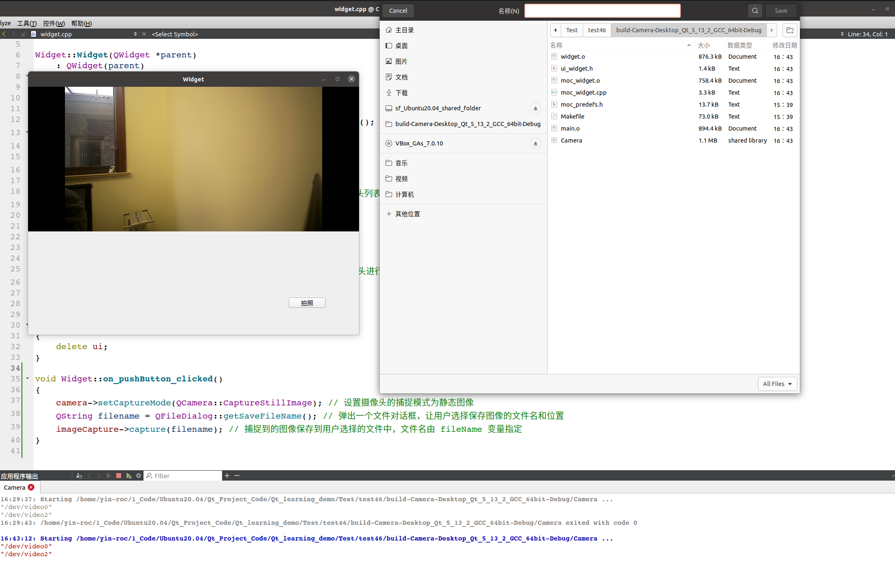

==tips：==此处在编译文件文件夹里面，如需要在源文件，要设置一下。


### 3、源代码

3.1 Camera.pro

```c++
QT       += core gui
QT       += multimedia
QT       += multimediawidgets

greaterThan(QT_MAJOR_VERSION, 4): QT += widgets

CONFIG += c++11

# The following define makes your compiler emit warnings if you use
# any Qt feature that has been marked deprecated (the exact warnings
# depend on your compiler). Please consult the documentation of the
# deprecated API in order to know how to port your code away from it.
DEFINES += QT_DEPRECATED_WARNINGS

# You can also make your code fail to compile if it uses deprecated APIs.
# In order to do so, uncomment the following line.
# You can also select to disable deprecated APIs only up to a certain version of Qt.
#DEFINES += QT_DISABLE_DEPRECATED_BEFORE=0x060000    # disables all the APIs deprecated before Qt 6.0.0

SOURCES += \
    main.cpp \
    widget.cpp

HEADERS += \
    widget.h

FORMS += \
    widget.ui

# Default rules for deployment.
qnx: target.path = /tmp/$${TARGET}/bin
else: unix:!android: target.path = /opt/$${TARGET}/bin
!isEmpty(target.path): INSTALLS += target
```

3.2	头文件

```c++
#ifndef WIDGET_H
#define WIDGET_H

#include <QWidget>
#include <QWidget>
#include <QCamera>
#include <QCameraInfo>
#include <QCameraViewfinder>
#include <QCameraImageCapture>

QT_BEGIN_NAMESPACE
namespace Ui { class Widget; }
QT_END_NAMESPACE

class Widget : public QWidget
{
    Q_OBJECT

public:
    Widget(QWidget *parent = nullptr);
    ~Widget();

private slots:
    void on_pushButton_clicked();

private:
    Ui::Widget *ui;
    QCamera * camera;
    QCameraViewfinder * viewfinder;
    QCameraImageCapture * imageCapture;
};
#endif // WIDGET_H
```

3.3	源文件

```c++
#include "widget.h"
#include "ui_widget.h"
#include <QDebug>
#include <QFileDialog>

Widget::Widget(QWidget *parent)
    : QWidget(parent)
    , ui(new Ui::Widget)
{
    ui->setupUi(this);

    QList<QCameraInfo> cameras = QCameraInfo::availableCameras(); // 获取系统上可用摄像头的信息
    if(cameras.count() > 0) // 检测到摄像头
    {
        // 输出已有摄像头信息
        foreach (const QCameraInfo &cameraInfo, cameras)
            qDebug() << cameraInfo.deviceName();
        camera = new QCamera(cameras.at(0)); // 从之前提到的摄像头列表中选择第一个摄像头（索引为0）
    }

    viewfinder = new QCameraViewfinder(this);
    camera->setViewfinder(viewfinder);
    viewfinder->resize(800, 350);

    imageCapture = new QCameraImageCapture(camera); // 使用摄像头进行截图

    camera->start();
}

Widget::~Widget()
{
    delete ui;
}

void Widget::on_pushButton_clicked()
{
    camera->setCaptureMode(QCamera::CaptureStillImage); // 设置摄像头的捕捉模式为静态图像
    QString filename = QFileDialog::getSaveFileName(); // 弹出一个文件对话框，让用户选择保存图像的文件名和位置
    imageCapture->capture(filename); // 捕捉到的图像保存到用户选择的文件中，文件名由 fileName 变量指定
}
```


## 50、视频50：创建数据库

### 1、本节内容

查看当前系统支持的数据库驱动程序列表；

创建数据库。

### 2、具体步骤

2.1	添加模块支持

```c++
QT       += core gui sql
```

2.2	查看当前系统支持的数据库驱动程序列表

1. 包含头文件

	```c++
	#include <QtSql/QSqlDatabase>
	```

2. 查看具体驱动程序

	```c++
	// 获取当前系统支持的数据库驱动程序的列表
	QStringList drivers = QSqlDatabase::drivers();
	foreach (QString driver, drivers) {
		qDebug() << driver;
	}
	```

3. 运行结果

	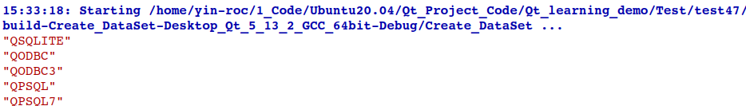

	​	

2.3	创建一个与 SQLite 数据库的连接

```c++
// 创建一个与SQLite数据库的连接
QSqlDatabase db = QSqlDatabase::addDatabase("QSQLITE");
db.setDatabaseName("dataset.db");

if(!db.open())
{
	qDebug() << "Error: Failed to connect to the database." << db.lastError();
}
else
{
	qDebug() << "Connect database successful!";
}
```

运行结果：

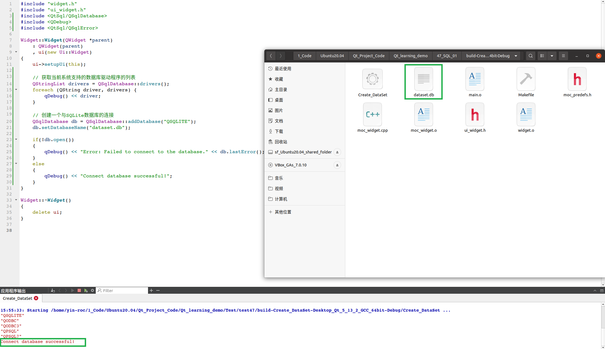


### 3、源代码

3.1	Create_DataSet.pro 文件

```c++
QT       += core gui sql

greaterThan(QT_MAJOR_VERSION, 4): QT += widgets

CONFIG += c++11

# The following define makes your compiler emit warnings if you use
# any Qt feature that has been marked deprecated (the exact warnings
# depend on your compiler). Please consult the documentation of the
# deprecated API in order to know how to port your code away from it.
DEFINES += QT_DEPRECATED_WARNINGS

# You can also make your code fail to compile if it uses deprecated APIs.
# In order to do so, uncomment the following line.
# You can also select to disable deprecated APIs only up to a certain version of Qt.
#DEFINES += QT_DISABLE_DEPRECATED_BEFORE=0x060000    # disables all the APIs deprecated before Qt 6.0.0

SOURCES += \
    main.cpp \
    widget.cpp

HEADERS += \
    widget.h

FORMS += \
    widget.ui

# Default rules for deployment.
qnx: target.path = /tmp/$${TARGET}/bin
else: unix:!android: target.path = /opt/$${TARGET}/bin
!isEmpty(target.path): INSTALLS += target
```

3.2	源文件

```c++
#include "widget.h"
#include "ui_widget.h"
#include <QtSql/QSqlDatabase>
#include <QDebug>
#include <QtSql/QSqlError>

Widget::Widget(QWidget *parent)
    : QWidget(parent)
    , ui(new Ui::Widget)
{
    ui->setupUi(this);

    // 获取当前系统支持的数据库驱动程序的列表
    QStringList drivers = QSqlDatabase::drivers();
    foreach (QString driver, drivers) {
        qDebug() << driver;
    }

    // 创建一个与SQLite数据库的连接
    QSqlDatabase db = QSqlDatabase::addDatabase("QSQLITE");
    db.setDatabaseName("dataset.db");

    if(!db.open())
    {
        qDebug() << "Error: Failed to connect to the database." << db.lastError();
    }
    else
    {
        qDebug() << "Connect database successful!";
    }
}

Widget::~Widget()
{
    delete ui;
}
```


## 51、视频51：插入数据库和遍历数据库

### 1、本节小结

本节需要了解 sqlite 语法：https://blog.csdn.net/u011555996/article/details/122792812

### 2、具体步骤

2.1	创建新表

1.语法：

```c++
create table tabname(col1 type1 [not null] [primary key],col2 type2 [not null],..)
    		 表格名称  列1  类型							 列2  类型			   
```

2.prepare语法的作用：

- **预编译查询语句：** prepare 方法将传递给它的 SQL 查询语句进行预编译。预编译的查询可以提高执行查询的性能，尤其是当相同的查询语句被多次执行时。
- **参数绑定：** 如果 SQL 查询语句中包含了占位符（例如，:id, :name, :age），那么  prepare 方法还允许在后续的步骤中绑定具体的参数值。

3.代码如下：

```c++
QString create_sql = "create table student(id int, name varchar(30), age int)";
sql_query.prepare(create_sql);
if(!sql_query.exec())
{
	qDebug() << "Error, failed to create table." << sql_query.lastError();
}
else
{
	qDebug() << "Table created.";
}
```

4.运行结果：

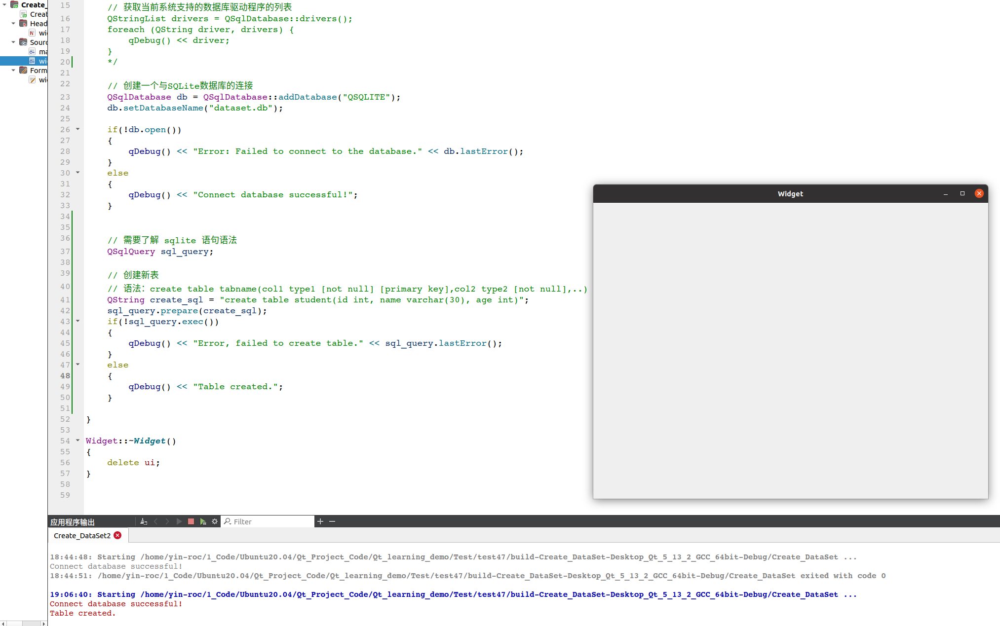

==tips：==当再次运行时，出现了错误，是因为已经创建了表格，无需再创建。因此需要将相应创建表格的代码屏蔽。

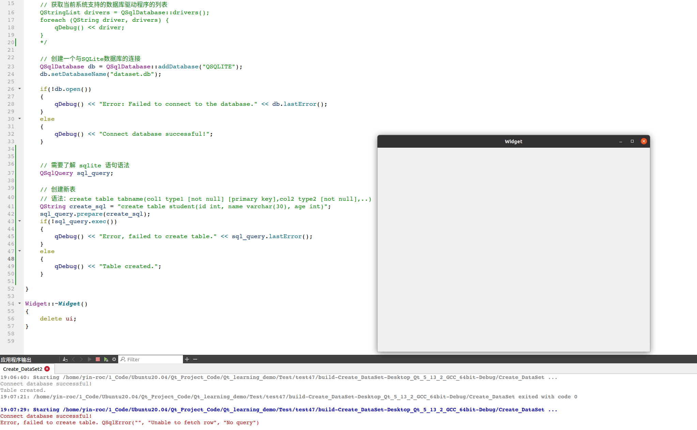

修改如下：

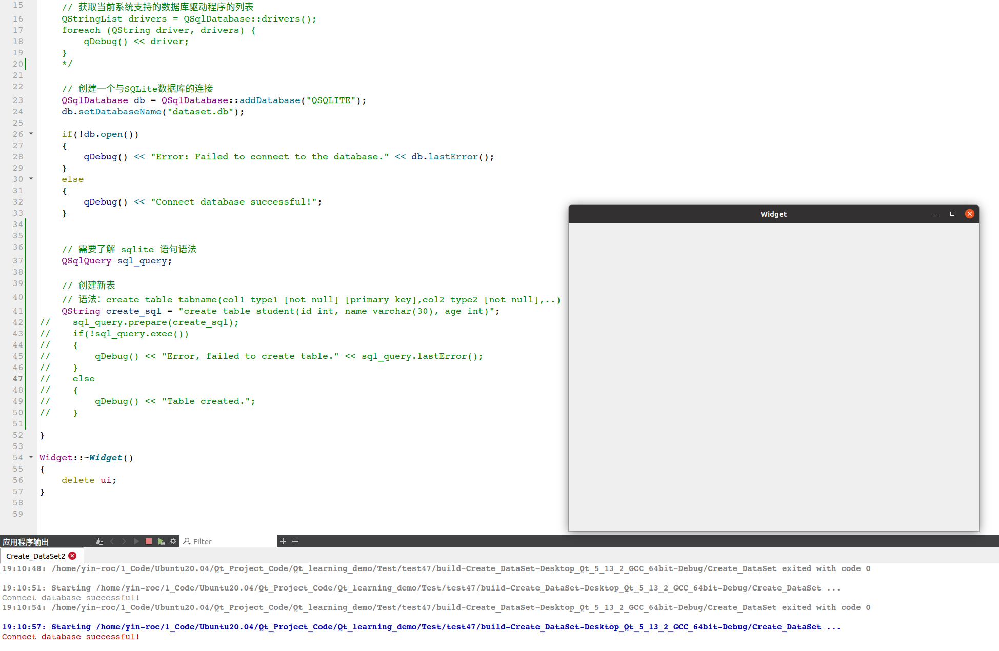

2.2	在表格中插入数据

1. 插入语法

	```c++
	insert into table1(field1,field2) values(value1,value2)
	```

	

2. 具体代码

	```c++
	// 创建 SQL 查询语句
	// 使用了占位符"?"，表示后续会通过绑定参数的方式为这些占位符提供具体的值
	QString insert_sql = "insert into student values(?, ?, ?)";
	// 使用 prepare 方法准备 SQL 查询语句
	sql_query.prepare(insert_sql); 
	// 使用 addBindValue 方法绑定具体的值
	sql_query.addBindValue(1);
	sql_query.addBindValue("Rick");
	sql_query.addBindValue(10);
	// 执行 SQL 查询
	if(!sql_query.exec())
	{
		qDebug() << sql_query.lastError();
	}
	else
	{
		qDebug() << "Insert Student NO.1!";
	}
	```

3. 同理创建第二行表格

	```c++
	sql_query.prepare(insert_sql);
	sql_query.addBindValue(2);
	sql_query.addBindValue("Jack");
	sql_query.addBindValue(11);
	if(!sql_query.exec())
	{
		qDebug() << sql_query.lastError();
	}
	else
	{
		qDebug() << "Insert Student NO.2!";
	}
	```

4. 运行结果

	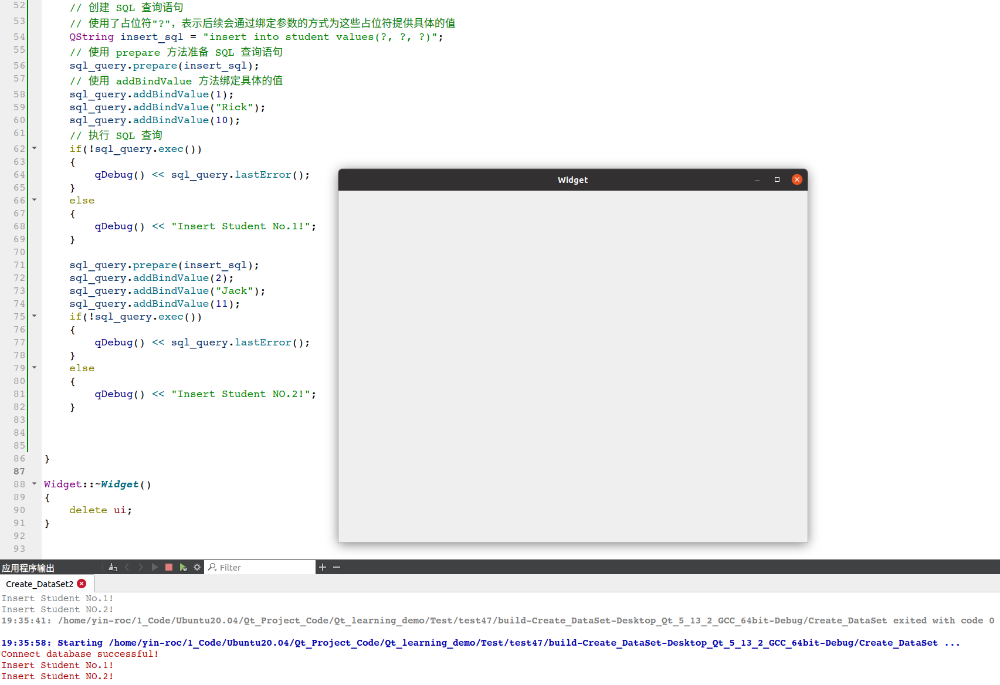


2.3	查找语法

1. 语法

	```c++
	select * from table1
	```

2. 具体代码

	```c++
	// 从名为 student 的表中检索所有的记录（* 通配符表示所有列）
	QString select_all_sql = "select * from student";
	sql_query.prepare(select_all_sql);
	if(!sql_query.exec())
	{
		qDebug() << sql_query.lastError();
	}
	else
	{
		// 通过 next 方法逐行遍历查询结果
		while(sql_query.next())
		{
			int id = sql_query.value(0).toInt();
			QString name = sql_query.value(1).toString();
			int age = sql_query.value(2).toInt();
			qDebug() << "id:" << id << "   name:" << name << "    age:" << age;
		}
	}
	```

3. 运行结果

	多次出现id1和id2的原因是插入数据时多次运行，从而导致此次结果：

	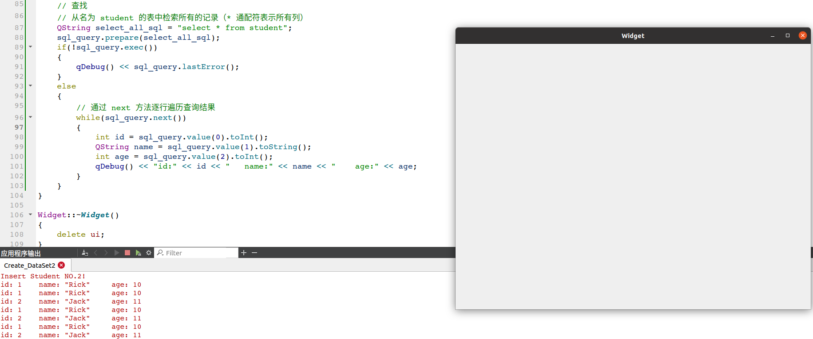


### 3、源代码

3.1	.pro文件

```c++
QT       += core gui sql
```

3.2	源文件

```c++
#include "widget.h"
#include "ui_widget.h"
#include <QtSql/QSqlDatabase>
#include <QDebug>
#include <QtSql/QSqlError>
#include <QtSql/QSqlQuery>

Widget::Widget(QWidget *parent)
    : QWidget(parent)
    , ui(new Ui::Widget)
{
    ui->setupUi(this);

    /*
    // 获取当前系统支持的数据库驱动程序的列表
    QStringList drivers = QSqlDatabase::drivers();
    foreach (QString driver, drivers) {
        qDebug() << driver;
    }
    */

    // 创建一个与SQLite数据库的连接
    QSqlDatabase db = QSqlDatabase::addDatabase("QSQLITE");
    db.setDatabaseName("dataset.db");

    if(!db.open())
    {
        qDebug() << "Error: Failed to connect to the database." << db.lastError();
    }
    else
    {
        qDebug() << "Connect database successful!";
    }


    // 需要了解 sqlite 语句语法
    QSqlQuery sql_query;

    // 创建新表
    // 语法：create table tabname(col1 type1 [not null] [primary key],col2 type2 [not null],..)
    QString create_sql = "create table student(id int, name varchar(30), age int)";
//    sql_query.prepare(create_sql);
//    if(!sql_query.exec())
//    {
//        qDebug() << "Error, failed to create table." << sql_query.lastError();
//    }
//    else
//    {
//        qDebug() << "Table created.";
//    }

    // 创建 SQL 查询语句
    // 使用了占位符"?"，表示后续会通过绑定参数的方式为这些占位符提供具体的值
    QString insert_sql = "insert into student values(?, ?, ?)";
    // 使用 prepare 方法准备 SQL 查询语句
    sql_query.prepare(insert_sql);
    // 使用 addBindValue 方法绑定具体的值
    sql_query.addBindValue(1);
    sql_query.addBindValue("Rick");
    sql_query.addBindValue(10);
    // 执行 SQL 查询
    if(!sql_query.exec())
    {
        qDebug() << sql_query.lastError();
    }
    else
    {
        qDebug() << "Insert Student No.1!";
    }

    sql_query.prepare(insert_sql);
    sql_query.addBindValue(2);
    sql_query.addBindValue("Jack");
    sql_query.addBindValue(11);
    if(!sql_query.exec())
    {
        qDebug() << sql_query.lastError();
    }
    else
    {
        qDebug() << "Insert Student NO.2!";
    }


    // 查找
    // 从名为 student 的表中检索所有的记录（* 通配符表示所有列）
    QString select_all_sql = "select * from student";
    sql_query.prepare(select_all_sql);
    if(!sql_query.exec())
    {
        qDebug() << sql_query.lastError();
    }
    else
    {
        // 通过 next 方法逐行遍历查询结果
        while(sql_query.next())
        {
            int id = sql_query.value(0).toInt();
            QString name = sql_query.value(1).toString();
            int age = sql_query.value(2).toInt();
            qDebug() << "id:" << id << "   name:" << name << "    age:" << age;
        }
    }
}

Widget::~Widget()
{
    delete ui;
}
```


## 52、视频52：更新和删除操作表格

### 1、本节小结

1.1	修改表格中的某个数据；

1.2	删除某一行数据或者删除整个表格数据。

### 2、具体步骤

2.1	更新表格

1. 语法

	```
	update table1 set field1=value1 where 范围
	```

2. 示例

	```c++
	// 更新：update table1 set field1=value1 where 范围
	QString update_sql = "update student set name = :nm where id = :n";
	sql_query.prepare(update_sql);
	sql_query.bindValue(":nm", "Michael");
	sql_query.bindValue(":n", 1);
	if(!sql_query.exec())
	{
		qDebug() << sql_query.lastError();
	}
	else
	{
		qDebug() << "Updated";
	}
	// 显示
	select_all_sql = "select * from student";
	sql_query.prepare(select_all_sql);
	if(!sql_query.exec())
	{
		qDebug() << sql_query.lastError();
	}
	else
	{
		// 遍历查询结果
		while(sql_query.next())
		{
			int id = sql_query.value(0).toInt();
			QString name = sql_query.value(1).toString();
			int age = sql_query.value(2).toInt();
			qDebug() << "id:" << id <<  "\tname:" << name << "\tage:" << age;
		}
	}
	```

3. 运行结果

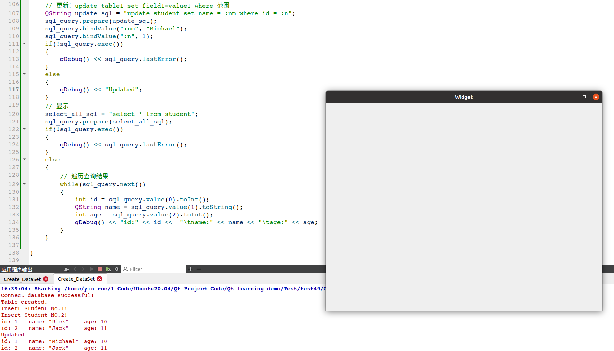

2. 2	删除某一行

1. 语法

	```c++
	delete from table1 where 范围
	```

2. 具体代码

	```c++
	// 删除某行
	    QString delete_sql = "delete from student where id = ?";
	    sql_query.prepare(delete_sql);
	    sql_query.addBindValue(1);
	    if(!sql_query.exec())
	    {
	        qDebug() << sql_query.lastError();
	    }
	    else
	    {
	        qDebug() << "Deleted";
	    }
	    // 显示
	    select_all_sql = "select * from student";
	    sql_query.prepare(select_all_sql);
	    if(!sql_query.exec())
	    {
	        qDebug() << sql_query.lastError();
	    }
	    else
	    {
	        // 通过 next 方法逐行遍历查询结果
	        while(sql_query.next())
	        {
	            int id = sql_query.value(0).toInt();
	            QString name = sql_query.value(1).toString();
	            int age = sql_query.value(2).toInt();
	            qDebug() << "id:" << id << "   name:" << name << "    age:" << age;
	        }
	    }
	```

3. 运行结果

	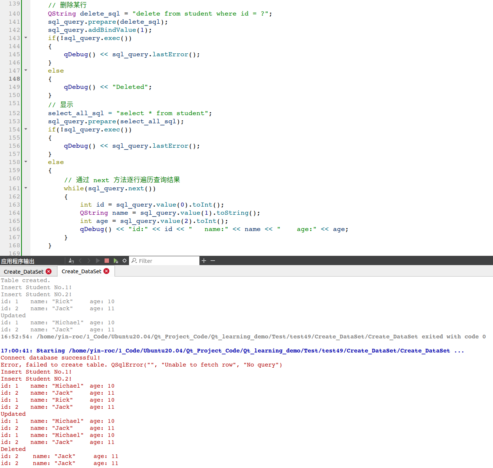

4. 注意事项

	输出结果的第二行error是因为没有屏蔽创建新表这行语句。

2.3	删除整个表格

1. 语法

	```c++
	delete from table1
	```

2. 示例

	```c++
	QString clear_sql = "delete from student";
	    sql_query.prepare(clear_sql);
	    if(!sql_query.exec())
	    {
	        qDebug() << sql_query.lastError();
	    }
	    else
	    {
	        qDebug() << "Table cleared";
	    }
	    // 显示
	    select_all_sql = "select * from student";
	    sql_query.prepare(select_all_sql);
	    if(!sql_query.exec())
	    {
	        qDebug() << sql_query.lastError();
	    }
	    else
	    {
	        // 通过 next 方法逐行遍历查询结果
	        while(sql_query.next())
	        {
	            int id = sql_query.value(0).toInt();
	            QString name = sql_query.value(1).toString();
	            int age = sql_query.value(2).toInt();
	            qDebug() << "id:" << id << "\tname:" << name << "\tage:" << age;
	        }
	    }
	```

3. 运行结果

	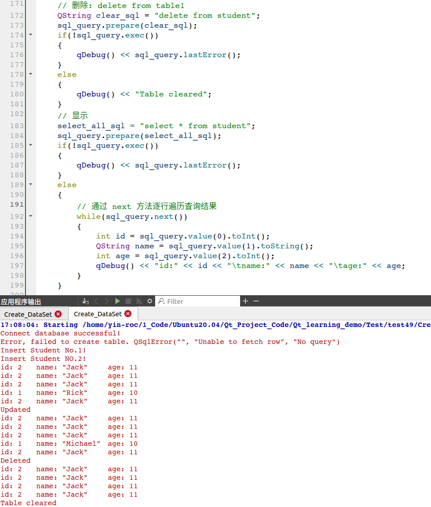


## 53、视频53：数据库数据窗体访问、修改和查找

### 1、本节小结

### 2、具体步骤

2.1	头文件

1. 核心模块头文件

	```c++
	#include <QtSql/QSqlDatabase>
	#include <QtSql/QSqlError>
	#include <QtSql/QSqlQuery>
	```

2. 用户接口层头文件

	```c++
	#include <QtSql/QSqlQueryModel>
	#include <QtSql/QSqlTableModel>
	#include <QtSql/QSqlRelationalTableModel>
	#include <QTableView>
	```

2.2	创建 QSqlTableModel 类对象

```c++
QSqlTableModel * model;    
```

在Qt应用程序中使用模型-视图架构展示数据库表的数据。QSqlTableModel 是 QtSql 模块提供的一个模型类，用于与数据库中的单个表格进行交互。

在用户接口层，QSqlTableModel 的作用是与视图部分（例如 QTableView）结合使用，将数据库表的数据呈现给用户，并提供了一些默认的编辑和更新功能。

2.3	Ui界面中新建 Table View

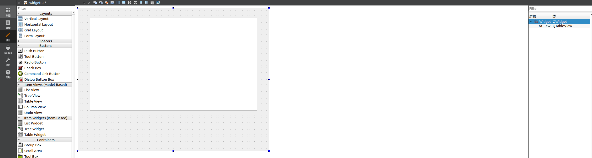

2.4	创建 QSqlTableModel 变量

```c++
QSqlTableModel * model;    
```

提供了一个可以连接到数据库表的数据模型，使得你可以在 Qt 应用程序中方便地展示和编辑数据库表的内容：

1. 连接数据库
2. 提供数据
3. 实现基本的数据操作
4. 自动更新视图
5. 支持编辑

2.5	Qt 窗口中显示

```c++
// Qt 窗口中显示
model = new QSqlTableModel(this); // 
ui->tableView->setModel(model); // 将对象与 QTableView 控件关联，TableView 将显示 model 中的数据，并在表数据发生变化时自动更新。
model->setTable("student"); // model 连接到名为 student 的数据库
model->select(); // 从数据库中检索数据并将其加载到 QSqlTableModel 中
```

2.6	设置表头信息

1. 代码

	```c++
	model->setHeaderData(0, Qt::Horizontal, "学号");
	model->setHeaderData(1, Qt::Horizontal, "姓名");
	model->setHeaderData(2, Qt::Horizontal, "年龄");
	```

2. 运行结果

	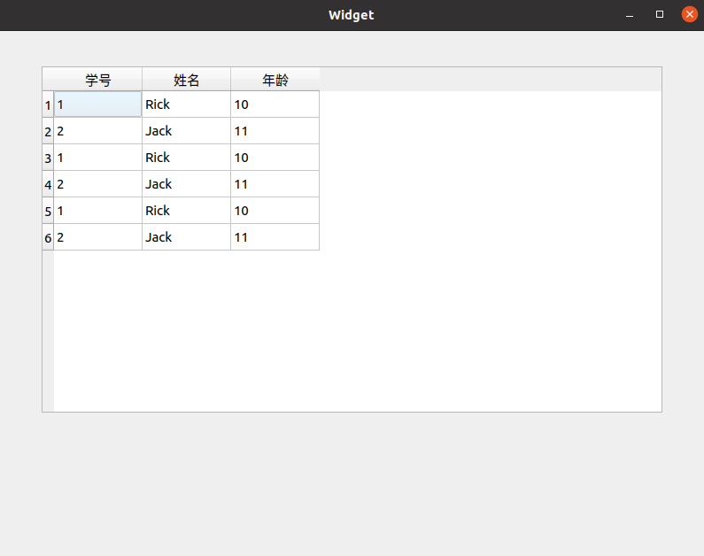

2.7	设置 QSqlTableModel 的编辑策略

```c++
model->setEditStrategy(QSqlTableModel::OnManualSubmit);
```

所有的更改将被缓存在模型中，直到调用 submitAll() 或 revertAll() 为止

2.8	调用 submitAll() 或 revertAll()

1. 代码

	```c++
	void Widget::on_pushButton_clicked()
	{
	    model->submitAll(); // 提交
	}
	
	void Widget::on_pushButton_2_clicked()
	{
	    model->revertAll(); // 撤销
	    model->submitAll();
	}
	```

2. 运行结果

	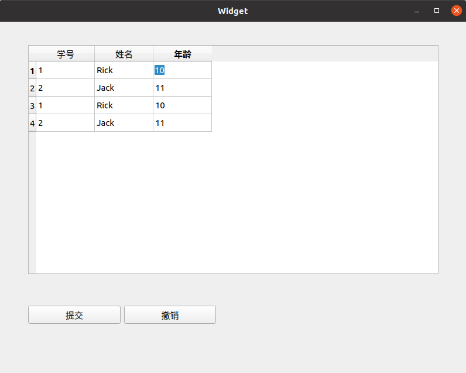

3. 修改后结果

	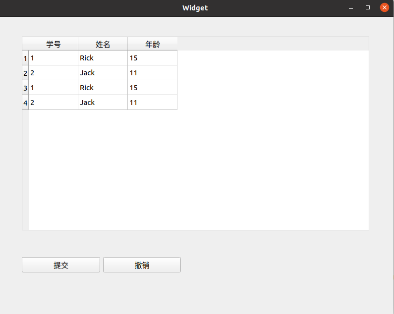

	

2.9	查找功能

1. 设置 Ui 界面

	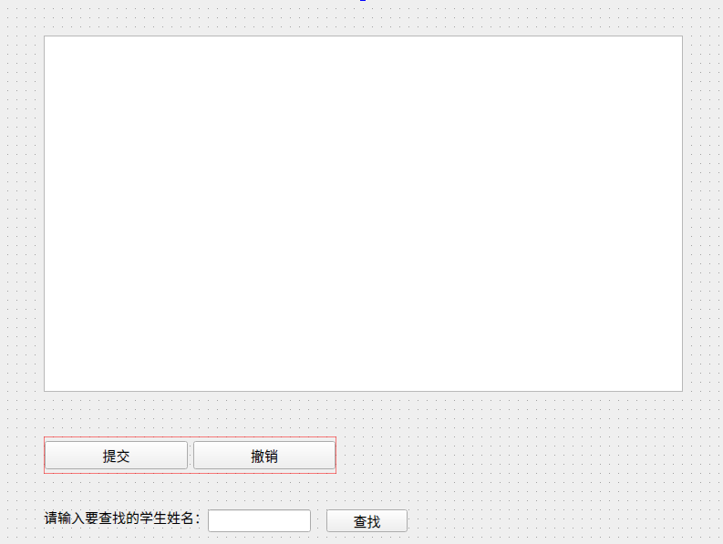

2. 代码

	```c++
	void Widget::on_pushButton_3_clicked()
	{
	    QString name = ui->lineEdit->text();
	    QString nm = QString("name = '%1'").arg(name);
	    // 使用 QString 的格式化功能，构建了一个字符串 nm。
	    // 该字符串包含了一个 SQL 查询条件，形式为 "name = '用户输入的文本'"。
	    // 其中 %1 是一个占位符，通过 arg(name) 将前面获取的用户输入文本 name 替换到占位符位置，从而形成最终的查询条件字符串
	    
	    model->setFilter(nm); // 将上述构建的查询条件字符串 nm 应用于 QSqlTableModel 的过滤器（filter）属性
	    //    name = 'Jack' （三列对应的是id、name、edge（即使使用 setHeaderData 修改了表头信息））
	    //    model->setFilter("name = 'Jack'"); // 限定死了，只能查找 Jack
	    
	    model->select(); // 执行数据库查询操作
	}
	```

3. 运行结果

	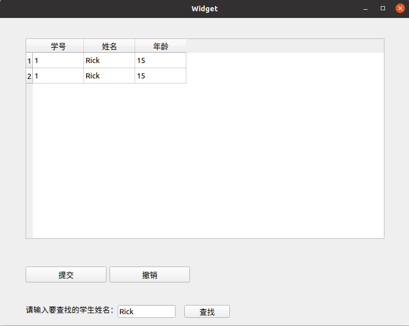

### 3、源代码

3.1	Create_DataSet.pro

```c++
QT       += core gui sql
```

3.2	widget.h

```c++
#ifndef WIDGET_H
#define WIDGET_H

#include <QWidget>

#include <QtSql/QSqlDatabase>
#include <QtSql/QSqlError>
#include <QtSql/QSqlQuery>

// 用户接口层包含的类
#include <QtSql/QSqlQueryModel>
#include <QtSql/QSqlTableModel>
#include <QtSql/QSqlRelationalTableModel>
#include <QTableView>

QT_BEGIN_NAMESPACE
namespace Ui { class Widget; }
QT_END_NAMESPACE

class Widget : public QWidget
{
    Q_OBJECT

public:
    Widget(QWidget *parent = nullptr);
    ~Widget();

private slots:
    void on_pushButton_clicked();

    void on_pushButton_2_clicked();

    void on_pushButton_3_clicked();

private:
    Ui::Widget *ui;
    QSqlTableModel * model;
};
#endif // WIDGET_H
```

3.3	widget.cpp

```c++
#include "widget.h"
#include "ui_widget.h"
#include <QDebug>

Widget::Widget(QWidget *parent)
    : QWidget(parent)
    , ui(new Ui::Widget)
{
    ui->setupUi(this);

    QSqlDatabase db = QSqlDatabase::addDatabase("QSQLITE");
    db.setDatabaseName("dataset.db");
    if(!db.open())
    {
        qDebug() << "Error: Failed to connect to the database." << db.lastError();
    }
    else
    {
        qDebug() << "Connect database successful!";
    }

    QSqlQuery sql_query;


//    QString create_sql = "create table student(id int, name varchar(30), age int)";
//    sql_query.prepare(create_sql); // 将传递给它的 SQL 查询语句进行预编译
//    if(!sql_query.exec())
//    {
//        qDebug() << "Error, Failed to create table." << sql_query.lastError();
//    }
//    else
//    {
//        qDebug() << "Table created";
//    }


//    // 插入
//    QString insert_sql = "insert into student values(?, ?, ?)";
//    // 使用 prepare 方法准备 SQL 查询语句
//    sql_query.prepare(insert_sql);
//    // 使用 addBindValue 方法绑定具体的值
//    sql_query.addBindValue(1);
//    sql_query.addBindValue("Rick");
//    sql_query.addBindValue(10);
//    // 执行 SQL 查询
//    if(!sql_query.exec())
//    {
//        qDebug() << sql_query.lastError();
//    }
//    else
//    {
//        qDebug() << "Insert Student NO.1!";
//    }

//    sql_query.prepare(insert_sql);
//    sql_query.addBindValue(2);
//    sql_query.addBindValue("Jack");
//    sql_query.addBindValue(11);
//    if(!sql_query.exec())
//    {
//        qDebug() << sql_query.lastError();
//    }
//    else
//    {
//        qDebug() << "Insert Student NO.2!";
//    }


    // Qt 窗口中显示
    model = new QSqlTableModel(this); //
    ui->tableView->setModel(model); // 将对象与 QTableView 控件关联，TableView 将显示 model 中的数据，并在表数据发生变化时自动更新。
    model->setTable("student"); // model 连接到名为 student 的数据库
    model->select(); // 从数据库中检索数据并将其加载到 QSqlTableModel 中

    // 设置表头信息
    model->setHeaderData(0, Qt::Horizontal, "学号");
    model->setHeaderData(1, Qt::Horizontal, "姓名");
    model->setHeaderData(2, Qt::Horizontal, "年龄");

    // 设置编辑策略
    // 所有的更改将被缓存在模型中，直到调用 submitAll() 或 revertAll() 为止
    model->setEditStrategy(QSqlTableModel::OnManualSubmit);

}

Widget::~Widget()
{
    delete ui;
}

void Widget::on_pushButton_clicked()
{
    model->submitAll(); // 提交
}

void Widget::on_pushButton_2_clicked()
{
    model->revertAll(); // 撤销
    model->submitAll();
}

void Widget::on_pushButton_3_clicked()
{
    QString name = ui->lineEdit->text();
    QString nm = QString("name = '%1'").arg(name);
    // 使用 QString 的格式化功能，构建了一个字符串 nm。
    // 该字符串包含了一个 SQL 查询条件，形式为 "name = '用户输入的文本'"。
    // 其中 %1 是一个占位符，通过 arg(name) 将前面获取的用户输入文本 name 替换到占位符位置，从而形成最终的查询条件字符串

    model->setFilter(nm); // 将上述构建的查询条件字符串 nm 应用于 QSqlTableModel 的过滤器（filter）属性
    //    name = 'Jack' （三列对应的是id、name、edge（即使使用 setHeaderData 修改了表头信息））
    //    model->setFilter("name = 'Jack'"); // 限定死了，只能查找 Jack

    model->select(); // 执行数据库查询操作
}
```


## 54、视频54：Qt进程启动另外一个进程

### 1、本节小结

### 2、具体步骤

2.1	包含头文件

```c++
#include <QProcess>
```

2.2	创建 QProcess 变量

```c++
QProcess myprocess;
```

2.3	设置 Ui 界面

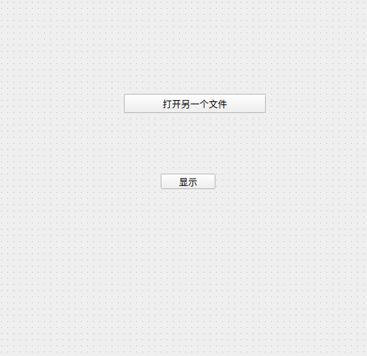

2.4	编写槽函数相应内容

```c++
void Widget::on_pushButton_clicked()
{
    myprocess.start("/home/yin-roc/Qt/install/5.13.2/gcc_64/bin/assistant");
}

void Widget::on_pushButton_2_clicked()
{
    qDebug() << "hello world";
}
```

2.5	运行结果

打开一个程序的同时还能操作另一个程序：

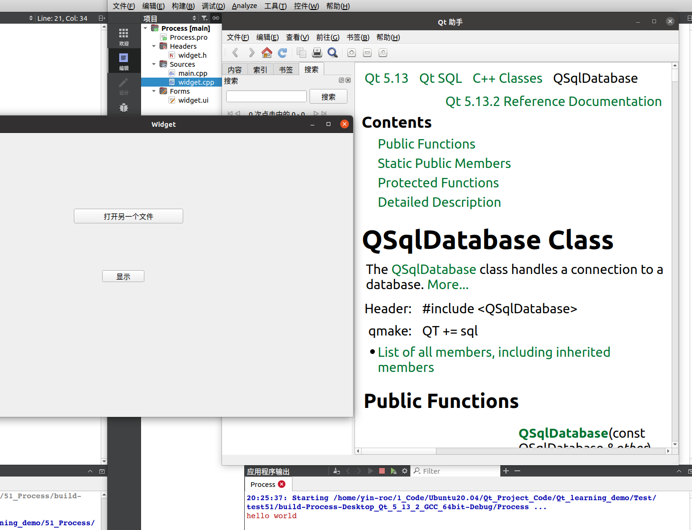

2.6	设置阻塞函数

```c++
void Widget::on_pushButton_clicked()
{
    myprocess.start("/home/yin-roc/Qt/install/5.13.2/gcc_64/bin/assistant");
    myprocess.waitForFinished();
}
```

### 3、源代码

3.1	widget.h文件

```c++
#ifndef WIDGET_H
#define WIDGET_H

#include <QWidget>
#include <QProcess>

QT_BEGIN_NAMESPACE
namespace Ui { class Widget; }
QT_END_NAMESPACE

class Widget : public QWidget
{
    Q_OBJECT

public:
    Widget(QWidget *parent = nullptr);
    ~Widget();

private slots:
    void on_pushButton_clicked();

    void on_pushButton_2_clicked();

private:
    Ui::Widget *ui;
    QProcess myprocess;
};
#endif // WIDGET_H
```


3.2	widget.cpp

```c++
#include "widget.h"
#include "ui_widget.h"
#include <QDebug>

Widget::Widget(QWidget *parent)
    : QWidget(parent)
    , ui(new Ui::Widget)
{
    ui->setupUi(this);
}

Widget::~Widget()
{
    delete ui;
}


void Widget::on_pushButton_clicked()
{
    myprocess.start("/home/yin-roc/Qt/install/5.13.2/gcc_64/bin/assistant");
    myprocess.waitForFinished();
}

void Widget::on_pushButton_2_clicked()
{
    qDebug() << "hello world";
}
```


## 55、视频55：Qt进程间通信

### 1、本节内容

### 2、具体步骤

写：

2.1	创建 QSharedMemory 类对象

```c++
#include <QSharedMemory>

QSharedMemory sharememory;
```

该类用于在多个进程之间共享内存。

2.2	为共享内存对象设置一个唯一的键（key）

```c++
sharememory.setKey("My_Shared_Memory");
```

这个键用于唯一标识共享内存对象，以便不同的进程能够通过这个键来访问相同的共享内存区域。

设置键是为了在不同的进程之间建立共享内存通信的桥梁，使它们可以通过相同的键访问相同的共享内存区域，以进行数据的读写和通信。

2.3	设置 widget.ui 界面

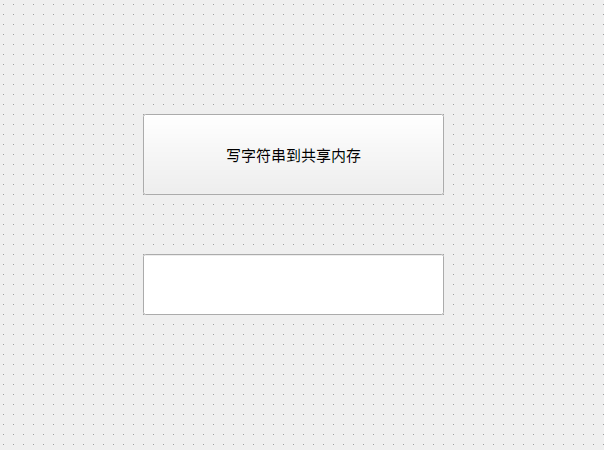

2.4	写字符串到共享内存

```c++
void Widget::on_pushButton_clicked()
{
    if(sharedmemory.isAttached()) // 是否处于被绑定状态中
    {
        sharedmemory.detach(); // 解绑
    }

    if(!sharedmemory.create(100, QSharedMemory::ReadWrite)) // 尝试创建一个新的共享内存区域
    {
        qDebug() << "Failed to create shared memory!";
        return;
    }

    sharedmemory.lock(); // 共享内存上锁,以确保在修改共享内存时不会被其他进程干扰。
    //--------临界区的内容不允许其他进程访问---------------
    QByteArray arr = ui->lineEdit->text().toLatin1();

    // memcpy(void * dst, void * src, size_t);
    // 拷贝
    memcpy(sharedmemory.data(), arr.data(), (size_t)qMin(sharedmemory.size(), ui->lineEdit->text().size()));

    //-----------------------------------------
    sharedmemory.unlock(); // 解锁共享内存，表示临界区操作结束，其他进程可以访问共享内存
}
```

2.5	memcpy语法

```c++
memcpy(void * dst, void * src, size_t);

memcpy(sharedmemory.data(), arr.data(), (size_t)qMin(sharedmemory.size(), ui->lineEdit->text().size()));
```

```
void *QSharedMemory::data()
```

返回指向共享内存段内容的指针（如果已附加）。否则，它返回空指针。在从共享内存读取或写入之前，请记得使用 lock() 锁定共享内存，并在完成后使用 unlock() 释放锁。


读：

2.6	创建 QSharedMemory 类对象

```c++
#include <QSharedMemory>

QSharedMemory sharedmemory;
```

2.7	设置 widget.ui 界面

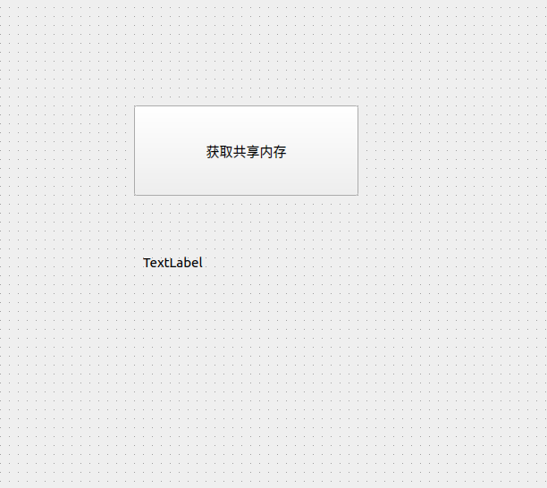

2.8	创建唯一的键

```c++
sharedmemory.setKey("My_Shared_Memory");
```

==tips：注意读写的键值要一致==

2.9	 读取槽函数

```c++
void Widget::on_pushButton_clicked()
{
    if(!sharedmemory.attach())
    {
        qDebug() << "Attach sharedmemory failed!";
        return;
    }
    
    sharedmemory.lock();
    char *arr = new char[sharedmemory.size()];
    memcpy(arr, sharedmemory.data(), (size_t)sharedmemory.size());
    ui->label->setText(QString(arr));
    sharedmemory.unlock();
    sharedmemory.detach();
}
```

解绑共享内存的操作 sharedmemory.detach() 主要是为了释放当前进程对共享内存的控制权。这样做是因为**读取操作通常是临时的，一旦读取完成，就不再需要持有对共享内存的控制。**

**写入操作通常不需要立即释放对共享内存的控制，因为可能会有其他进程在后续的时间内继续写入数据。**通常，写入操作完成后，进程会保持对共享内存的控制，以便它可以继续在需要时写入数据。

2.10	运行结果

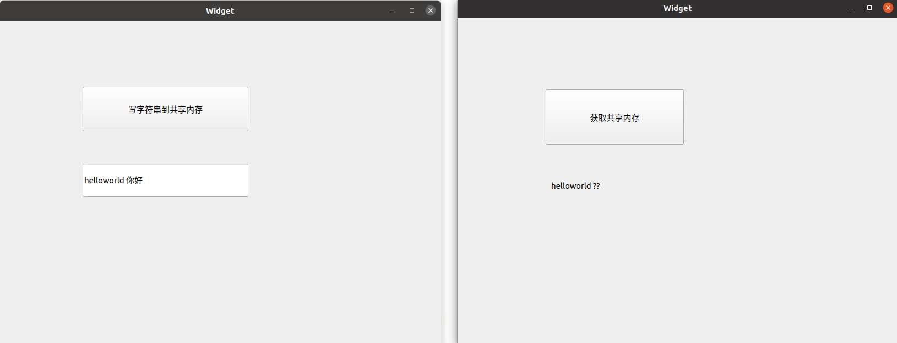

### 3、源码

见github


## 56、视频56：Qt多线程并发操作

### 1、本节小结

一个 Qt 程序界面做并行界面设计，与读写两个进程的区别。

使用 Qt 线程类： QThread

### 2、具体步骤

2.1	创建自定义类：MyThread

```c++
#include <QThread>

class MyThread : public QThread
{
public:
    MyThread() { stopped = false;}
    void stop();
    
protected:
    void run(); // 线程从 run 函数开始运行，类似于 main 函数，run 函数的调用靠的是 QThread 类里面的 start
    
private:
    bool stopped;    
};
```

2.2	定义 Mythread 类的方法

```c++
void MyThread::run()
{
    int i = 0;
    while(!stopped)
    {
        qDebug() << "MyThread: " << i;
        msleep(1000);
        i += 2;
    }
    
    stopped = false;    
}

void MyThread::stop()
{
    stopped = true;
}
```

2.3	widget.ui 界面如图所示

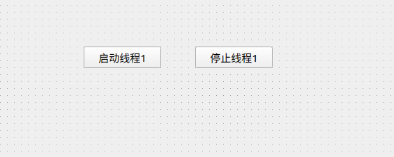

2.4	槽函数

```c++
#include "widget.h"
#include "ui_widget.h"
#include "mythread.h"

Widget::Widget(QWidget *parent)
    : QWidget(parent)
    , ui(new Ui::Widget)
{
    ui->setupUi(this);
}

Widget::~Widget()
{
    delete ui;
}

void Widget::on_pushButton_clicked()
{
    thread.start();
    ui->pushButton->setEnabled(false);
    ui->pushButton_2->setEnabled(true);
}

void Widget::on_pushButton_2_clicked()
{
    if(thread.isRunning())
    {
        thread.stop();
        ui->pushButton->setEnabled(true);
        ui->pushButton_2->setEnabled(false);
    }
}
```

2.5	运行结果

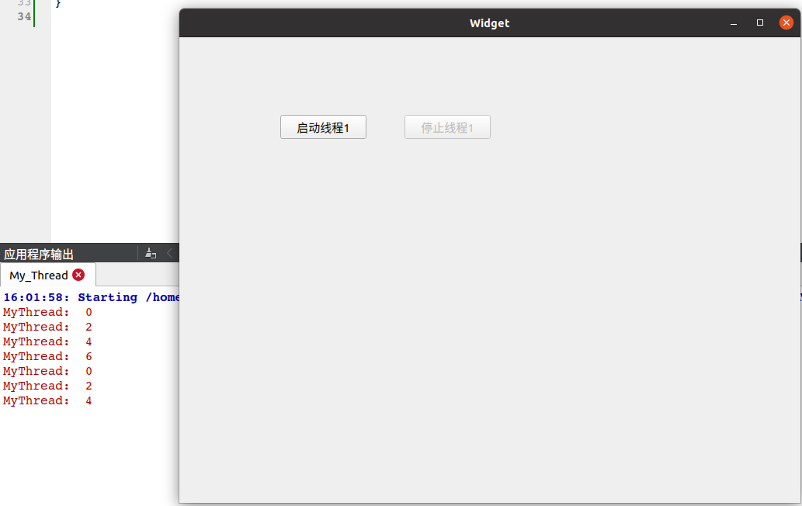

2.6 同理创建第二个类来实现奇数的输出

最终结果如图所示：

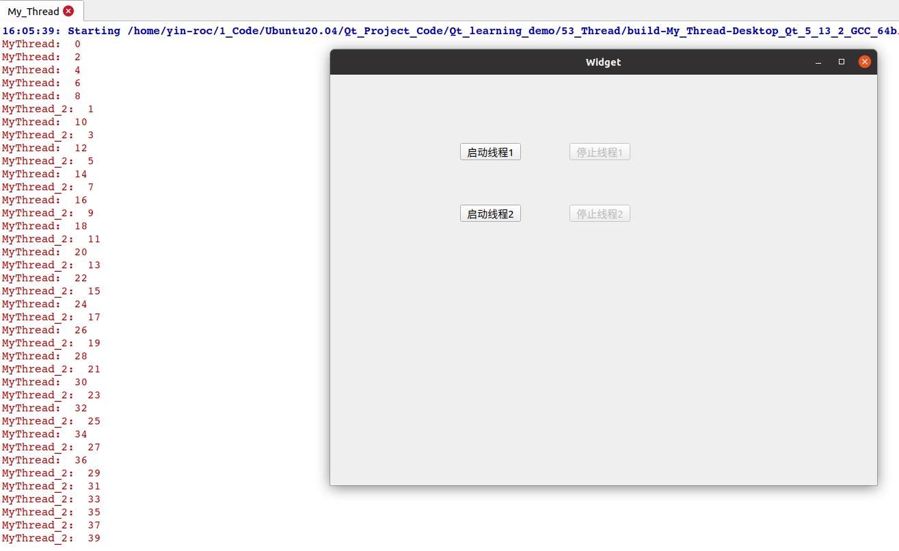

### 3、源码


## 57、视频57：Qt 线程间同步——信号量

### 1、本节小结

1.1	QSemaphore 类

`QSemaphore` 是一个用于线程同步的类，它提供了一种机制，允许一个或多个线程在共享资源上进行协调。Semaphore 是一种计数信号量，用于管理对资源的访问。

具体而言，`QSemaphore` 可以用于限制同时访问共享资源的线程数量。它通过一个计数器来实现，当线程请求访问资源时，计数器减一，当线程释放资源时，计数器加一。如果计数器的值为正，那么线程可以继续执行，否则线程需要等待。

以下是 `QSemaphore` 的一些常用方法：

- `QSemaphore(int n)`：构造函数，用于初始化计数器为 n。
- `void acquire()`：请求一个资源，如果计数器大于零，计数器减一，否则线程将被阻塞。
- `bool tryAcquire(int n = 1)`：尝试请求 n 个资源，如果成功返回 true，否则返回 false。
- `void release(int n = 1)`：释放 n 个资源，将计数器加上 n。
- `int available()`：返回当前可用的资源数量。

通过 `QSemaphore`，可以有效地管理多线程访问共享资源的情况，确保线程之间的同步和协调。

1.2	信号量

多个线程抢夺同一资源，比如没读完就往其中写入或者没写完就往外读。

信号量 > 0 运行；信号量 = 0 或者 < 0 不运行。

### 2、具体步骤

2.1	包含类

```
#include <QSemaphore> // 信号量
```

2.2	定义生产者类

```c++
class Producer : public QThread
{
    Q_OBJECT
public:
    Producer(){ stopped = false;}
    void stop();

protected:
    void run(); // 线程从 run 函数开始运行，类似于 main 函数，run 函数的调用靠的是 QThread 类里面的 start

private:
    bool stopped;

};
```

2.3	定义消费者类

```c++
class Consumer : public QThread
{
    Q_OBJECT
public:
    Consumer(){ stopped = false;}
    void stop();

protected:
    void run(); // 线程从 run 函数开始运行，类似于 main 函数，run 函数的调用靠的是 QThread 类里面的 start

private:
    bool stopped;

};
```

2.4	创建生产者和消费者对象

```c++
Producer producer;
Consumer consumer;
```

2.5	生产者方法实现

```c++
const int size = 10;
unsigned int buffer[size];
QSemaphore usedSem(0);
QSemaphore unusedSem(size);

void Producer::run()
{
    int i = 0;
    while(!stopped)
    {
        unusedSem.acquire(); // unusedSem 减 1：请求一个资源，如果计数器大于零，计数器减一，否则线程将被阻塞
        buffer[i] = i;
        msleep(1000);
        qDebug() << "Write to the shared memory";
        usedSem.release(); // usedSem 加 1
        i++;
        if(i == size)
            i = 0;
    }
    stopped = false;
}

void Producer::stop()
{
    stopped = true;
}
```

2.6	消费者方法实现

```c++
void Consumer::run()
{
    int i = 1;
    while(!stopped)
    {
        usedSem.acquire();
        qDebug() << buffer[i];
        unusedSem.release();
        i++;
        if(i == size)
            i = 0;
    }
    stopped = false;
}

void Consumer::stop()
{
    stopped = true;
}
```

2.7	现象结果

1. 当生产者开始制造时：判断 unusedSem 大于 0 则代表需要制作；执行相关操作后；usedSem 加 1代表消费者可获得新产品 + 1。
2. 当消费者开始消费时：判断 usedSem 大于 0 则代表可以消费；执行相关操作后；unusedSem 加1代表生产者可以再制作一个一个产品。
3. 类似于停车位，生产者往10个车位里面停车，消费者从车位里面拿车。unusedSem 代表剩余车位，usedSem 代表车。


## 58、视频58：TCP服务器端

### 1、本节内容

TCP：传输层协议，属于计算机网络协议。

服务端有两套套接字：监听（QTcpServer）和通信（QTcpSocket）

监听的listen函数，包含两个参数：IP（服务端） 和 Port。

1. 实例化 `QTcpServer` 对象，它将用于监听客户端的连接请求；
2. 调用 `listen` 方法开始监听连接。指定服务器应该监听的IP地址和端口号；
3. 使用 `newConnection` 信号连接槽函数，以便在有新连接时执行相应的操作；
4. 在 `NewConnection` 对应的槽函数中，使用 `nextPendingConnection` 获取新的连接套接字（通信套接字）；
5. 处理通信：为每个连接创建一个 `QTcpSocket` 对象，用于实际的数据传输。设置相关的信号槽以处理数据的接收、发送等操作。
6. 实现数据发送：使用 `QTcpSocket` 对象向客户端发送数据。


### 2、具体步骤

2.1	加入包

```c++
QT       += core gui network
```

2.2	包含头文件

分别提供了用于创建TCP服务器和TCP客户端的类：

```c++
#include <QTcpServer>
#include <QTcpSocket>
```

2.3	头文件中创建对象

```c++
QTcpServer * tcpserver; // 监听套接字
QTcpSocket * clientConnection = nullptr; // 通信套接字
```

2.4	设置 widget.ui 界面

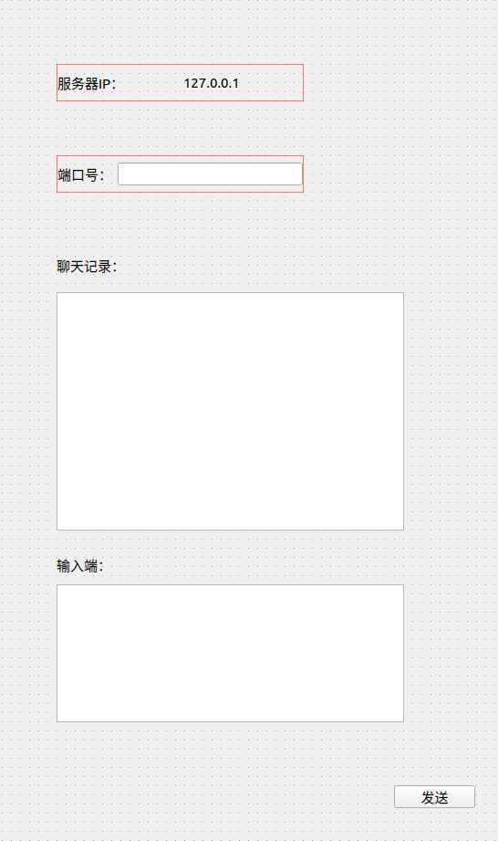

2.5	为监听套接字分配内存

```c++
tcpserver = new QTcpServer(this);
```

2.6	监听连接

调用 `listen` 方法开始监听连接。指定服务器应该监听的IP地址和端口号：

```c++
tcpserver->listen(QHostAddress::LocalHost, ui->lineEdit->text().toInt());
```

2.7	处理新连接

使用 `newConnection` 信号连接槽函数，以便在有新连接时执行相应的操作：

```c++
connect(tcpserver, &QTcpServer::newConnection, this, [&](){});
```

2.8	服务器端用于处理客户端发送的数据

```c++
connect(tcpserver, &QTcpServer::newConnection, this, [&](){
	clientConnection = tcpserver->nextPendingConnection(); // 获取新的连接套接字（通信）

	clientConnection->write("Welcome to connect to the server!"); // 向客户端发送数据

	ui->textEdit->append("New connection......");

	connect(clientConnection, &QTcpSocket::readyRead, this, [&](){ // 处理客户端发送的数据
		QByteArray array = clientConnection->readAll();
		ui->textEdit->append("客户端：" + array);
		ui->textEdit->setAlignment(Qt::AlignRight);
	});
});
```

2.9	按钮槽函数

```c++
void Widget::on_pushButton_clicked()
{
    if(!clientConnection) // 判断是否连接
    {
        qDebug() << "No connection!";
        return;
    }

    clientConnection->write(ui->textEdit_2->toPlainText().toUtf8());
    ui->textEdit->append("服务器：" + ui->textEdit_2->toPlainText());
    ui->textEdit->setAlignment(Qt::AlignLeft);
    ui->textEdit_2->clear();
}
```

### 3、源代码


## 59、视频59：TCP客户端

### 1、本节内容

客户端只需要一个套接字：QTcpSocket类的对象

1. 连接服务器
2. 接收数据
3. 发送数据

### 2、具体步骤

2.1	添加包

```c++
QT       += core gui network
```

2.2	包含头文件、创建对象

```c++
#include <QTcpServer>
#include <QTcpSocket>
```

```c++
QTcpSocket * tcpSocket; // 用于处理与服务器的TCP连接
```

2.3	为 QTcpSocket 对象分配内存

```c++
tcpSocket = new QTcpSocket(this);
```

2.4	设置 widget.ui 界面

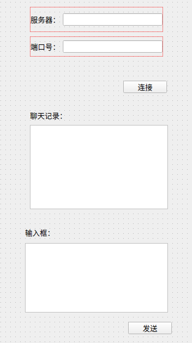

2.5	连接服务器

格式：connectToHost(serverIP, serverPort)

```c++
tcpSocket->connectToHost(ui->lineEdit->text(), ui->lineEdit_2->text().toInt());
```

2.6	接收数据

readyRead信号：信号是在套接字（socket）接收到新数据时发射的。这个信号用于通知应用程序有可用的数据可以读取。

readAll()：读取所有的可用数据

```
connect(tcpSocket, &QTcpSocket::readyRead, this, [&](){
	QByteArray array = tcpSocket->readAll();
	ui->textEdit->append("服务器：" + array);
});
```

2.7	发送数据

```c++
tcpSocket->write(ui->textEdit_2->toPlainText().toUtf8());
```

2.8	运行结果如图所示

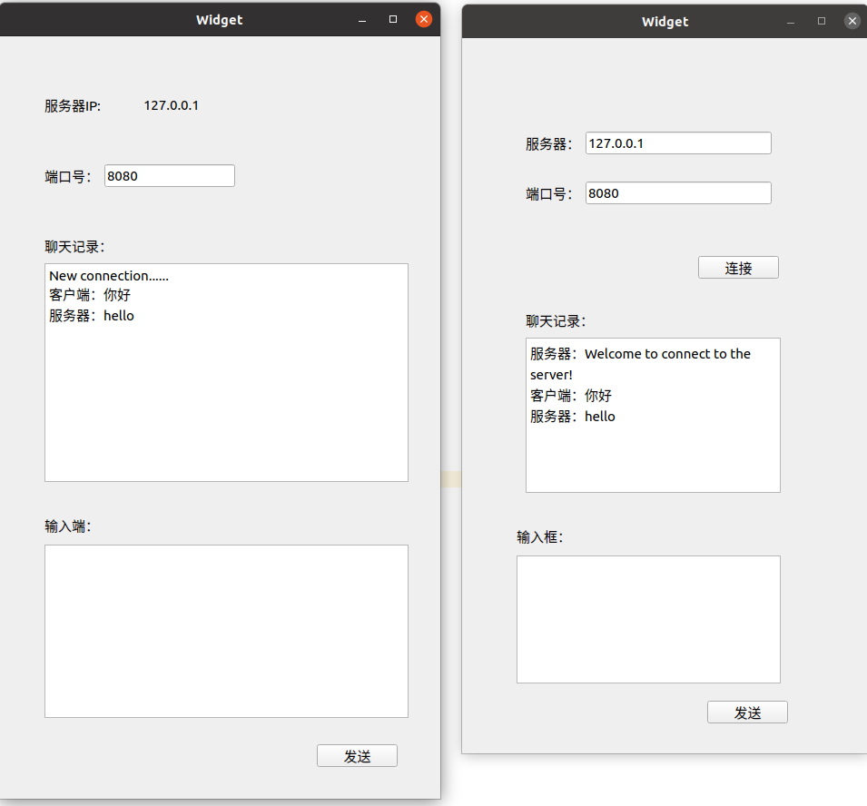

### 3、源码


## 60、视频60：UDP发送端—接收端—通信1

### 1、本节内容

TCP（Transmission Control Protocol）和UDP（User Datagram Protocol）是两种不同的传输层协议。

1. 连接导向 vs 无连接：
	- TCP： 提供面向连接的服务，通过三次握手建立可靠的连接，确保数据的可靠传输，以及数据的按序传递。有错误检测和重传机制，**确保数据的可靠性**。
	- UDP： 是一种**面向无连接的协议，不建立连接，不保证可靠性，也不保证数据的按序传递**。UDP更适用于那些对实时性要求较高、能够容忍一定数据丢失的应用场景。
2. 可靠性：
	- TCP： 提供可靠的、面向连接的服务。通过序号、确认和重传机制来确保数据的可靠性，适用于对数据完整性有严格要求的应用，如文件传输、网页浏览等。
	- UDP： 不提供可靠性保证。==适用于那些对实时性要求高，可以容忍一定数据丢失的应用==，如语音通话、视频流等。
3. 数据流模型：
	- TCP： 提供面向字节流的服务，将数据视为连续的字节流，保证数据的有序性和完整性。
	- UDP： 以数据报为单位进行传输，每个数据报独立于其他数据报，没有顺序性的要求。
4. 开销：
	- TCP： 因为提供可靠性和有序性，有较大的开销，包含了连接管理、流量控制、拥塞控制等机制。
	- UDP： 由于是无连接、不提供可靠性保证的协议，开销相对较小。
5. 适用场景：
	- TCP： 适用于要求可靠传输的应用，如文件传输、电子邮件等。
	- UDP： 适用于对实时性要求较高，能够容忍一定数据丢失的应用，如实时音视频通信、在线游戏等。

选择使用TCP还是UDP取决于==应用的需求==，例如==对数据可靠性和有序性的要求==，以及==对通信开销的容忍程度==。

### 2、具体步骤

==Receiver项目：==

2.1	添加库

```c++
QT       += core gui network
```

2.2	包头文件

```c++
#include <QUdpSocket>
```

2.3	创建对象

```c++
QUdpSocket * receiver;
```

2.4	初始化对象并做前期准备

1. 初始化对象

	```
	receiver = new QUdpSocket(this);
	```

2. 设置 widget.ui 界面

	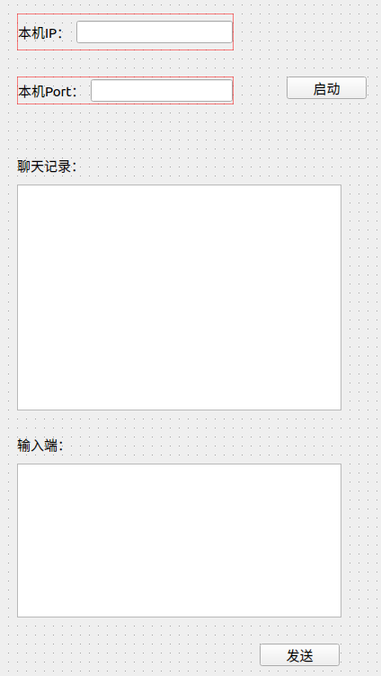

3. 设置窗体名称等

	```c++
	setWindowTitle("接收端");
	
	ui->lineEdit->setText("127.0.0.1");
	```

2.5	主要程序

```c++
void Widget::on_pushButton_2_clicked()
{
    // 绑定端口号
    receiver->bind(ui->lineEdit_2->text().toInt()); 
    
    // QUdpSocket::readyRead 信号
    connect(receiver, &QUdpSocket::readyRead, this, [&](){
        // 创建一个 QByteArray 对象 datagram，用于存储接收到的数据
        QByteArray datagram;
        datagram.resize(receiver->pendingDatagramSize()); // 使用 pendingDatagramSize 函数获取当前待处理数据报的大小
        
        // 使用 readDatagram 函数从 receiver 接收数据
        receiver->readDatagram(datagram.data(), datagram.size());
        ui->textEdit->append("对方：" + datagram);
    });

    ui->pushButton_2->setEnabled(false);
    ui->lineEdit_2->setEnabled(false);
}
```


==Sender项目：==

2.1	添加库

```c++
QT       += core gui network
```

2.2	包含头文件

```c++
#include <QUdpSocket>
```

2.3	创建 QUdpSocket 对象

```c++
QUdpSocket * sender;
```

2.4	widget.ui 界面设置

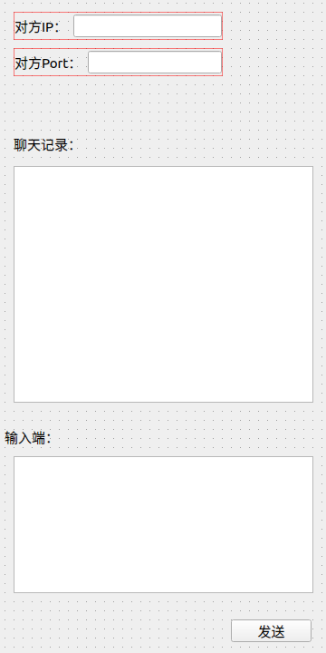

2.5	分配内存

```c++
sender = new QUdpSocket(this);
```

2.6	主要程序

```c++
void Widget::on_pushButton_clicked()
{
    QByteArray datagram = ui->textEdit_2->toPlainText().toUtf8();
    
    // 将数据报发送到指定的目标地址和端口号
    // 参数解释：
	// datagram.data(): 发送的数据的指针，这里是先前准备好的 UTF-8 编码字节数组的指针。
	// datagram.size(): 发送的数据的大小。
	// QHostAddress(ui->lineEdit->text()): 目标主机的 IP 地址，从界面的 lineEdit 中获取。
	// ui->lineEdit_2->text().toInt(): 目标主机的端口号，从界面的 lineEdit_2 中获取并转换为整数。
    sender->writeDatagram(datagram.data(), datagram.size(), QHostAddress(ui->lineEdit->text()), ui->lineEdit_2->text().toInt());
    ui->textEdit->append("本机：" + ui->textEdit_2->toPlainText());
    ui->textEdit_2->clear();

}
```

2.7	运行结果

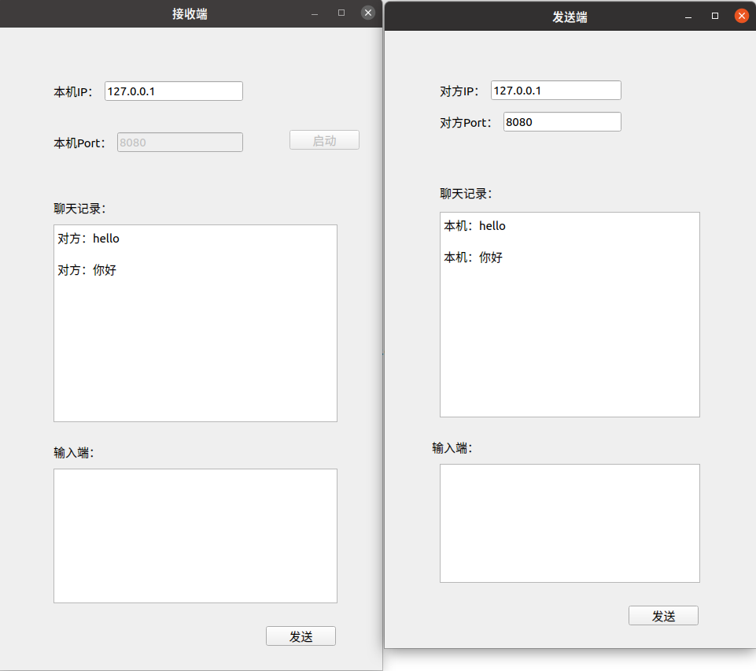

### 3、源码


## 61、视频61：UDP发送端—接收端—通信2

### 1、本节内容

视频60的通信1：发送端的输入端发出，接收端的聊天记录收到消息

本次视频的通信2：主机1的输入端发出，主机2的聊天记录中显示。

### 2、具体步骤

主机1发送按钮相关槽函数：

```c++
void Widget::on_pushButton_clicked()
{
    QByteArray datagram = ui->textEdit_2->toPlainText().toUtf8();
    receiver->writeDatagram(datagram.data(), datagram.size(), QHostAddress(ui->lineEdit->text()), ui->lineEdit_3->text().toInt());
    ui->textEdit->append("本机：" + ui->textEdit_2->toPlainText());
    ui->textEdit_2->clear();
}
```

主机2：

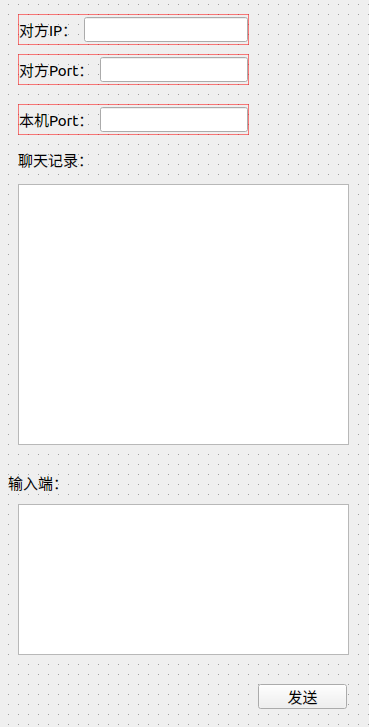

使用UDP套接字实现数据的接收和显示

```c++
Widget::Widget(QWidget *parent)
    : QWidget(parent)
    , ui(new Ui::Widget)
{
    ui->setupUi(this);

    setWindowTitle("主机2");
    sender = new QUdpSocket(this);


    ui->lineEdit_3->setText("8888");
    sender->bind(ui->lineEdit_3->text().toInt());
    connect(sender, &QUdpSocket::readyRead, this, [&](){
        QByteArray datagram;
        datagram.resize(sender->pendingDatagramSize());
        sender->readDatagram(datagram.data(), datagram.size());
        ui->textEdit->append("对方：" + datagram);
    });

}
```

### 3、源码

Receiver工程：

```
QT       += core gui network
```

```c++
#ifndef WIDGET_H
#define WIDGET_H

#include <QWidget>
#include <QUdpSocket>

QT_BEGIN_NAMESPACE
namespace Ui { class Widget; }
QT_END_NAMESPACE

class Widget : public QWidget
{
    Q_OBJECT

public:
    Widget(QWidget *parent = nullptr);
    ~Widget();

private slots:
    void on_pushButton_2_clicked();

    void on_pushButton_clicked();

private:
    Ui::Widget *ui;
    QUdpSocket * receiver;

};
#endif // WIDGET_H

```

```c++
#include "widget.h"
#include "ui_widget.h"

Widget::Widget(QWidget *parent)
    : QWidget(parent)
    , ui(new Ui::Widget)
{
    ui->setupUi(this);

    setWindowTitle("主机1");

    ui->lineEdit->setText("127.0.0.1");

    receiver = new QUdpSocket(this);
}

Widget::~Widget()
{
    delete ui;
}


void Widget::on_pushButton_2_clicked()
{
    receiver->bind(ui->lineEdit_2->text().toInt()); // 绑定端口号
    // QUdpSocket::readyRead 信号
    connect(receiver, &QUdpSocket::readyRead, this, [&](){
        // 创建一个 QByteArray 对象 datagram，用于存储接收到的数据
        QByteArray datagram;
        datagram.resize(receiver->pendingDatagramSize()); // // 使用 pendingDatagramSize 函数获取当前待处理数据报的大小
        
        // 使用 readDatagram 函数从 receiver 接收数据
        receiver->readDatagram(datagram.data(), datagram.size());
        ui->textEdit->append("对方：" + datagram);
    });

    ui->pushButton_2->setEnabled(false);
    ui->lineEdit_2->setEnabled(false);
}

void Widget::on_pushButton_clicked()
{
    QByteArray datagram = ui->textEdit_2->toPlainText().toUtf8();
    receiver->writeDatagram(datagram.data(), datagram.size(), QHostAddress(ui->lineEdit->text()), ui->lineEdit_3->text().toInt());
    ui->textEdit->append("本机：" + ui->textEdit_2->toPlainText());
    ui->textEdit_2->clear();
}

```


Sender工程：

```
QT       += core gui network
```

```c++
#ifndef WIDGET_H
#define WIDGET_H

#include <QWidget>
#include <QUdpSocket>

QT_BEGIN_NAMESPACE
namespace Ui { class Widget; }
QT_END_NAMESPACE

class Widget : public QWidget
{
    Q_OBJECT

public:
    Widget(QWidget *parent = nullptr);
    ~Widget();

private slots:
    void on_pushButton_clicked();

private:
    Ui::Widget *ui;
    QUdpSocket * sender;
};
#endif // WIDGET_H
```

```c++
#include "widget.h"
#include "ui_widget.h"

Widget::Widget(QWidget *parent)
    : QWidget(parent)
    , ui(new Ui::Widget)
{
    ui->setupUi(this);

    setWindowTitle("主机2");
    sender = new QUdpSocket(this);


    ui->lineEdit_3->setText("8888");
    sender->bind(ui->lineEdit_3->text().toInt());
    connect(sender, &QUdpSocket::readyRead, this, [&](){
        QByteArray datagram;
        datagram.resize(sender->pendingDatagramSize());
        sender->readDatagram(datagram.data(), datagram.size());
        ui->textEdit->append("对方：" + datagram);
    });

}

Widget::~Widget()
{
    delete ui;
}

void Widget::on_pushButton_clicked()
{
    QByteArray datagram = ui->textEdit_2->toPlainText().toUtf8();
    sender->writeDatagram(datagram.data(), datagram.size(), QHostAddress(ui->lineEdit->text()), ui->lineEdit_2->text().toInt());
    ui->textEdit->append("本机：" + ui->textEdit_2->toPlainText());
    ui->textEdit_2->clear();

}
```


## 62、视频62：TCP传输文件小案例—客户端

### 1、本节内容

### 2、具体步骤

2.1	添加库

```c++
QT       += core gui network
```

2.2	添加头文件和相应类对象

```c++
#ifndef WIDGET_H
#define WIDGET_H

#include <QWidget>
#include <QTcpServer>
#include <QTcpSocket>
#include <QFileDialog>
#include <QFileInfo>
#include <QTimer>

QT_BEGIN_NAMESPACE
namespace Ui { class Widget; }
QT_END_NAMESPACE

class Widget : public QWidget
{
    Q_OBJECT

public:
    Widget(QWidget *parent = nullptr);
    ~Widget();

private slots:
    void on_pushButton_clicked();

    void on_pushButton_2_clicked();

    void on_pushButton_3_clicked();

private:
    Ui::Widget *ui;
    QTcpSocket * tcpSocket;
    QString fileName;
    qint64 fileSize;
    QFile file;
    QTimer * mytimer;
};
#endif // WIDGET_H
```

2.3	客户端通信套接字通信实现

```c++
tcpSocket = new QTcpSocket(this);

    connect(tcpSocket, &QTcpSocket::readyRead, this, [&](){
        QByteArray array = tcpSocket->readAll();
        qDebug() << "服务器: " << array;
    });
```

2.4	widget.ui 界面设计

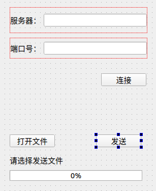

2.5	连接按钮槽函数

```c++
void Widget::on_pushButton_clicked()
{
    tcpSocket->connectToHost(ui->lineEdit->text(), ui->lineEdit_2->text().toInt());
}
```

2.6	打开文件槽函数

```c++
void Widget::on_pushButton_2_clicked()
{
    QString filePath = QFileDialog::getOpenFileName(this); // 打开文件

    QFileInfo FileData(filePath);
    fileName = FileData.fileName(); // 得到文件名称
    fileSize = FileData.size(); // 得到文件大小

    qDebug() << "文件名： " << fileName;
    qDebug() << "文件大小： " << fileSize;

    if(filePath.isEmpty())
    {
        ui->label_3->setText(filePath);
        file.setFileName(filePath);
        file.open(QIODevice::ReadOnly);

    }

    ui->progressBar->setMinimum(0);
    ui->progressBar->setMaximum(fileSize / 1024);
    ui->progressBar->setValue(0);
}
```

2.7	发送按钮槽函数

```c++
void Widget::on_pushButton_3_clicked()
{
    // 发送：“我的小苹果.mp3**313256” (先名称后文件大小)
    QString head = fileName + "**" + QString::number(fileSize);
    qint64 length = tcpSocket->write(head.toUtf8());
    if(length > 0) // 发送成功
    {
        // 延时防止粘包
        mytimer->start(20);
    }
    else // 发送失败
    {
        file.close();
    }
}
```

2.8	定时器槽函数

期间设置发送及其具体细节

```c++
mytimer = new QTimer(this);
    connect(mytimer, &QTimer::timeout, this, [&](){
        mytimer->stop();

        qint64 len;
        qint64 sendSize = 0;

        do{
            char buf[4*1024] = {0};
            len = 0;
            len = file.read(buf, sizeof(buf)); // 每次提取多少字节
            tcpSocket->write(buf, len); // 后续内容不足 4kb，所以用 len，而不用 sizeof(buf)
            sendSize += len;
            ui->progressBar->setValue(sendSize / 1024);
        }while(len > 0);
        if(sendSize == fileSize)
        {
            file.close();
            tcpSocket->disconnect();
            tcpSocket->close();
        }
    });
```

### 3、源码

3.1	.pro文件

```
QT       += core gui network
```

3.2	widget.h文件

```c++
#ifndef WIDGET_H
#define WIDGET_H

#include <QWidget>
#include <QTcpServer>
#include <QTcpSocket>
#include <QFileDialog>
#include <QFileInfo>
#include <QTimer>

QT_BEGIN_NAMESPACE
namespace Ui { class Widget; }
QT_END_NAMESPACE

class Widget : public QWidget
{
    Q_OBJECT

public:
    Widget(QWidget *parent = nullptr);
    ~Widget();

private slots:
    void on_pushButton_clicked();

    void on_pushButton_2_clicked();

    void on_pushButton_3_clicked();

private:
    Ui::Widget *ui;
    QTcpSocket * tcpSocket;
    QString fileName;
    qint64 fileSize;
    QFile file;
    QTimer * mytimer;
};
#endif // WIDGET_H

```

3.3	widget.cpp文件

```c++
#include "widget.h"
#include "ui_widget.h"
#include <QDebug>

Widget::Widget(QWidget *parent)
    : QWidget(parent)
    , ui(new Ui::Widget)
{
    ui->setupUi(this);

    tcpSocket = new QTcpSocket(this);

    connect(tcpSocket, &QTcpSocket::readyRead, this, [&](){
        QByteArray array = tcpSocket->readAll();
        qDebug() << "服务器: " << array;
    });

    mytimer = new QTimer(this);
    connect(mytimer, &QTimer::timeout, this, [&](){
        mytimer->stop();

        qint64 len;
        qint64 sendSize = 0;

        do{
            char buf[4*1024] = {0};
            len = 0;
            len = file.read(buf, sizeof(buf)); // 每次提取多少字节
            tcpSocket->write(buf, len); // 后续内容不足 4kb，所以用 len，而不用 sizeof(buf)
            sendSize += len;
            ui->progressBar->setValue(sendSize / 1024);
        }while(len > 0);
        if(sendSize == fileSize)
        {
            file.close();
            tcpSocket->disconnect();
            tcpSocket->close();
        }
    });

}

Widget::~Widget()
{
    delete ui;
}

void Widget::on_pushButton_clicked()
{
    tcpSocket->connectToHost(ui->lineEdit->text(), ui->lineEdit_2->text().toInt());
}


void Widget::on_pushButton_2_clicked()
{
    QString filePath = QFileDialog::getOpenFileName(this); // 打开文件

    QFileInfo FileData(filePath);
    fileName = FileData.fileName(); // 得到文件名称
    fileSize = FileData.size(); // 得到文件大小

    qDebug() << "文件名： " << fileName;
    qDebug() << "文件大小： " << fileSize;

    if(!filePath.isEmpty())
    {
        ui->label_3->setText(filePath);
        file.setFileName(filePath);
        file.open(QIODevice::ReadOnly);

    }

    ui->progressBar->setMinimum(0);
    ui->progressBar->setMaximum(fileSize / 1024);
    ui->progressBar->setValue(0);

}

void Widget::on_pushButton_3_clicked()
{
    // 发送：“我的小苹果.mp3**313256” (先名称后文件大小)
    QString head = fileName + "**" + QString::number(fileSize);
    qint64 length = tcpSocket->write(head.toUtf8());
    if(length > 0) // 发送成功
    {
        // 延时防止粘包
        mytimer->start(20);
    }
    else // 发送失败
    {
        file.close();
    }

}
```


## 63、视频63：TCP传输文件小案例—服务端

### 1、本节内容

### 2、具体步骤

2.1	添加库

```c++
QT       += core gui network
```

2.2	包含头文件和创建对应类对象

```c++
#ifndef WIDGET_H
#define WIDGET_H

#include <QWidget>
#include <QTcpServer>
#include <QTcpSocket>
#include <QFile>
#include <QMessageBox>

QT_BEGIN_NAMESPACE
namespace Ui { class Widget; }
QT_END_NAMESPACE

class Widget : public QWidget
{
    Q_OBJECT

public:
    Widget(QWidget *parent = nullptr);
    ~Widget();

private slots:
    void on_pushButton_clicked();

private:
    Ui::Widget *ui;
    QTcpServer * tcpserver; // 监听套接字
    QTcpSocket * clientConnection = nullptr; // 通信套接字

    bool headInfo = true;
    QString fileName;
    qint64 fileSize;
    qint64 recvSize;
    QFile file;
};
#endif // WIDGET_H

```

2.3	设置 widget.ui 界面

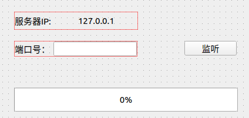

2.4	构造函数初始化设置

```c++
Widget::Widget(QWidget *parent)
    : QWidget(parent)
    , ui(new Ui::Widget)
{
    ui->setupUi(this);

    ui->lineEdit->setText("8080");

    tcpserver = new QTcpServer(this);
}
```

2.5	监听按钮槽函数设置

```c++
void Widget::on_pushButton_clicked()
{
    tcpserver->listen(QHostAddress::LocalHost, ui->lineEdit->text().toInt());

    connect(tcpserver, &QTcpServer::newConnection, this, [&](){
        clientConnection = tcpserver->nextPendingConnection(); // 获取新的连接套接字

        clientConnection->write("Welcome to connect to the server!");

        connect(clientConnection, &QTcpSocket::readyRead, this, [&](){
            QByteArray array = clientConnection->readAll();
            if(headInfo)
            {
                headInfo = false;
                recvSize = 0;

                fileName = QString(array).section("**", 0, 0);
                fileSize = QString(array).section("**", 1, 1).toInt();

                file.setFileName(fileName);
                file.open(QIODevice::WriteOnly);

                ui->progressBar->setMinimum(0);
                ui->progressBar->setMaximum(fileSize / 1024);
                ui->progressBar->setValue(0);

            }
            else
            {

                qint64 length = file.write(array);
                if(length > 0)
                    recvSize += length;
                ui->progressBar->setValue(recvSize / 1024);
                if(recvSize == fileSize)
                {
                    QMessageBox::information(this, "完成", "文件接收完成");
                    file.close();
                }
            }
        });
    });

    ui->pushButton->setEnabled(false);
}
```


### 3、源码

3.1	库添加

```c++
QT       += core gui network
```

3.2	widget.h 文件

```c++
#ifndef WIDGET_H
#define WIDGET_H

#include <QWidget>
#include <QTcpServer>
#include <QTcpSocket>
#include <QFile>
#include <QMessageBox>

QT_BEGIN_NAMESPACE
namespace Ui { class Widget; }
QT_END_NAMESPACE

class Widget : public QWidget
{
    Q_OBJECT

public:
    Widget(QWidget *parent = nullptr);
    ~Widget();

private slots:
    void on_pushButton_clicked();

private:
    Ui::Widget *ui;
    QTcpServer * tcpserver; // 监听套接字
    QTcpSocket * clientConnection = nullptr; // 通信套接字

    bool headInfo = true;
    QString fileName;
    qint64 fileSize;
    qint64 recvSize;
    QFile file;
};
#endif // WIDGET_H
```

3.3	widget.cpp文件

```c++
#include "widget.h"
#include "ui_widget.h"
#include <QDebug>

Widget::Widget(QWidget *parent)
    : QWidget(parent)
    , ui(new Ui::Widget)
{
    ui->setupUi(this);

    ui->lineEdit->setText("8080");

    tcpserver = new QTcpServer(this);


}

Widget::~Widget()
{
    delete ui;
}


void Widget::on_pushButton_clicked()
{
    tcpserver->listen(QHostAddress::LocalHost, ui->lineEdit->text().toInt());

    connect(tcpserver, &QTcpServer::newConnection, this, [&](){
        clientConnection = tcpserver->nextPendingConnection(); // 获取新的连接套接字

        clientConnection->write("Welcome to connect to the server!");

        connect(clientConnection, &QTcpSocket::readyRead, this, [&](){
            QByteArray array = clientConnection->readAll();
            if(headInfo)
            {
                headInfo = false;
                recvSize = 0;

                fileName = QString(array).section("**", 0, 0);
                fileSize = QString(array).section("**", 1, 1).toInt();

                file.setFileName(fileName);
                file.open(QIODevice::WriteOnly);

                ui->progressBar->setMinimum(0);
                ui->progressBar->setMaximum(fileSize / 1024);
                ui->progressBar->setValue(0);

            }
            else
            {

                qint64 length = file.write(array);
                if(length > 0)
                    recvSize += length;
                ui->progressBar->setValue(recvSize / 1024);
                if(recvSize == fileSize)
                {
                    QMessageBox::information(this, "完成", "文件接收完成");
                    file.close();
                }
            }
        });
    });

    ui->pushButton->setEnabled(false);
}
```
