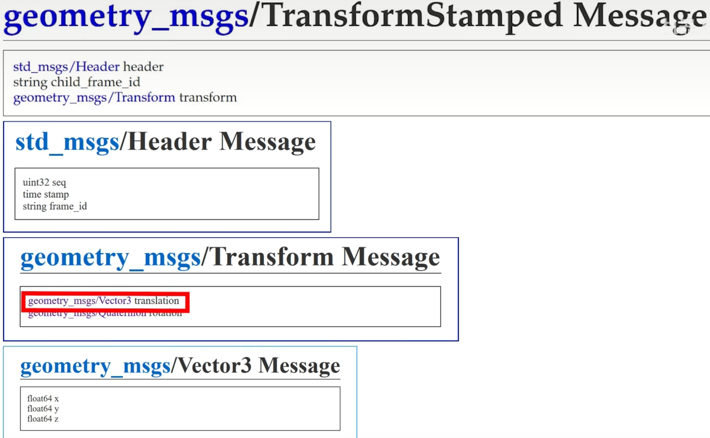
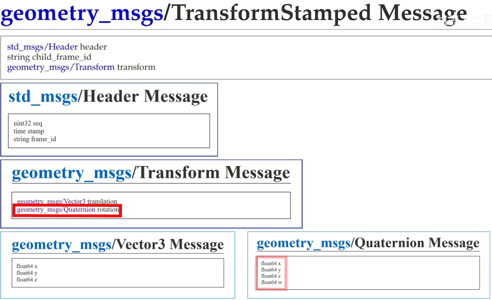
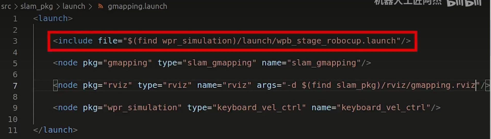
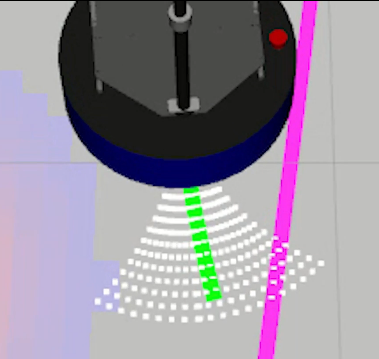

#  1、ROS 应用商店 APT 源

1、ROS应用商店 APT 源：网址：index.ros.org；

2、只有拥有闪电图标的软件包才能用 APT 去下载安装；

3、后续如果要安装，使用

```
sudo apt install ros-( ROS 版本)-(软件包名称，也就是下图中的Name)
```


4、示例：点开 rqt_robot_steering：


5、安装并测试 rqt_robot_steering


使用小乌龟来测试该功能包：

Tips：注意小乌龟的速度节点为：$/turtle1/cmd\_vel$


# 2、Github上寻找并安装ROS软件包

```
mkdir -p catkin_ws/src
cd catkin_ws/src
sudo apt install git 
git clone https://github.com/6-robot/wpr_simulation.git
```

其中 https://github.com/6-robot/wpr_simulation.git 来源于github 上的地址

在 catkin_ws 工作空间下进行编译：

```
catkin_make
```

刷新工作环境变量：

```
source devel/setup.zsh
```


# 3、寻找软件包源码

1、搜索 index.ros.org

2、输入包名

3、点击转到 github网址

4、重复 “Github上寻找并安装ROS软件包”步骤


# 4、使用 VSCode 编译代码

1、选择文件 -> 将文件夹添加到工作区

==tips：添加的是 src 文件，且是已经编译好的工作空间==


2、编译快捷键

```
ctrl + shift + B
```

选择 catkin_make build


3、编译完成后，再次选择 ctrl + shift + B，点击其旁边的齿轮，此时新建出 task.json


4、修改 group 行参数

```json
{
	"version": "2.0.0",
	"tasks": [
		{
			"type": "catkin_make",
			"args": [
				"--directory",
				"/home/yin-roc/1_Code/Ubuntu20.04/catkin_ws",
				"-DCMAKE_BUILD_TYPE=RelWithDebInfo"
			],
			"problemMatcher": [
				"$catkin-gcc"
			],
			"group": {"kind":"build","isDefault": true},
			"label": "catkin_make: build"
		}
	]
}
```

自此以后，$ctrl + shift + B$ 就直接编译了，不用再点击选择。


# 5、解决头文件出现红色波浪线问题

问题出现在 c_cpp_properties.json 文件

5.1	简单粗暴法

将 c_cpp_properties.json 文件删除，重启vscode！

神奇的一幕出现了，自动出现了工作目录！


5.2	禁用错误曲线法（自欺欺人法）

$ctrl+shift+P$ ，输入 error squiggles,禁用错误波形曲线


如要恢复错误波形曲线：

settings.json 中C_Cpp.errorSquiggles 设置为 enabled

```
{

​    "C_Cpp.errorSquiggles": "enabled"

}
```


# 6、Terminator


`crtl+shift+e`失效，无法分屏，解决方法：

```
ibus-setup
```


# 7、年轻人的第一个节点：Node

1、创建功能包

```
cd 1_Code/Ubuntu20.04/catkin_ws/src
catkin_create_pkg ssr_pkg roscpp rospy std_msgs
```


2、CmakeLists.txt

单 # ：命令指令的注释

双 #：某些指令的详细说明


3、package.xml

有 package.xml 说明这是一个软件包。


4、roscd


示例：

```
roscd roscpp
ls
code package.xml
```


5、ros 中的依赖项

ros 的软件功能包地址（都是现成的可执行文件）：

```
/opt/ros/noetic/share/roscpp
```

而自定的 `catkin_ws` 都是需要编译的。


6、步骤如下


# 8、ROS 的主要通讯方式: Topic 话题与 Message消息

Topic 话题：


Message 消息：

消息类型通过 `index.ros.org` 查找：`std_msgs`，选择相应版本，点击 website 查看 `ROS Message Types`：

1. **Raw Message Definition（原始消息定义）：**
	- 这是消息的原始、完整的定义。它包含消息类型的所有字段以及它们的数据类型。
	- 通常以一种更易读的方式呈现，包括注释和详细描述。
	- 用于了解消息的结构、字段名称和数据类型。
2. **Compact Message Definition（紧凑消息定义）：**
	- 这是消息定义的一种紧凑形式，通常用于节省空间和简化通信。
	- 可以看作是原始消息定义的精简版本，去除了注释和其他冗余信息。
	- 用于在网络上传输消息时减少数据量，提高通信效率。

例如这种 std_msgs/MultiArrayLayout layout 的是一种嵌套数据类型，可以简单粗暴地理解为结构体嵌套。


# 9、用C++编写Publisher发布者节点

9.1	发布者：

要确定

1、发布的话题名称

2、发布的消息类型


9.2	查看节点发布频率：

```
rostopic hz /kuai_sahng_che_kai_hei_qun
```

显示的 `average rate` 便是发布者每秒发布的次数。


9.3	输出中文显示

中文版 Ubuntu设置 setlocale(LC_ALL, "");

英文版 Ubuntu 设置 `setlocale(LC_ALL, "zh_CN.UTF-8");`


9.4	rqt_graph

显示节点之间的联系图


9.5 订阅者


# 10、roslaunch


# 11、ROS机器人运动控制


ros 的速度消息包格式：`index.ros.org` 搜索 `geometry_msgs` 中的 `Twist`


# 12、用 C++ 实现机器人运动控制


```c++
#include <ros/ros.h>
#include <geometry_msgs/Twist.h>

int main(int argc, char *argv[])
{
    ros::init(argc, argv, "vel_node");

    ros::NodeHandle nh;
    ros::Publisher vel_pub = nh.advertise<geometry_msgs::Twist>("/cmd_vel", 10);

    geometry_msgs::Twist vel_msg;
    
    vel_msg.linear.x = 0.1;
    vel_msg.linear.y = 0;
    vel_msg.linear.z = 0;
    vel_msg.angular.x = 0;
    vel_msg.angular.y = 0;
    vel_msg.angular.z = 0;

    ros::Rate r(30);
    while (ros::ok())
    {
        vel_pub.publish(vel_msg);
        r.sleep();
    }
    
    return 0;
}
```


# 13、激光雷达

## 1、基本介绍

按照测量维度：单线雷达和多线雷达；

按照测量原理：分为三角测距雷达和TOF雷达；

按照旋转方式：分为机械旋转雷达和固态雷达。


## 2、仿真所需工具

Gazebo 是模拟真实机器人发出传感器数据的工具；（真实环境并不存在）

Rviz 是接受传感器数据并进行显示的数据。（真实环境非必需，观察数据时才需要）

## 3、激光雷达的消息格式

网址 `index.ros.org` 搜索 `sensor_msgs`，找到 LaserScan


启动 wpr_simulation 项目，终端输入：

```
 rostopic echo /scan --noarr 
```


3.1	angle_min 和 angle_max

最小角度与最大角度


3.2	angle_increment 和 time_increment

相邻两次测距行为的角度和时间

测距行为：激光雷达发射红外激光到接受红外激光称为一个测距行为。

完成一次测距行为激光雷达会旋转一个角度。


3.3	scan_time

两次扫描的起始时间差

由于本例中起始方向和终止方向重合，也就是两次扫描的起始时间差是雷达旋转一周的时间。

用 1s / 单次扫描时间 = 雷达的扫描频率 


3.4	range_min 和 range_max

扫描最小和最大半径


3.5	ranges: "<array type: float32, length: 360>"

数组元素类型为 flaat32

数组的长度为 360

雷达旋转一周为 360 °，也就是对应每一度的测距值。

如下图所示，从起始角度开始，一个个存储距离值


有时候会有部分障碍物超出了雷达的测距范围，因此数组内置为 INF（无穷大）。


3.6	intensities: "<array type: float32, length: 360>"

与 range 数组相对应，也是360个，这个数组的数值大小表示的是每一次测距的信号强度。


## 4、用C++实现获取激光雷达数据

消息包的数据格式：`sensor_msgs::LaserScan`


```c++
#include <ros/ros.h>
#include <sensor_msgs/LaserScan.h>

void LidarCallback(const sensor_msgs::LaserScan msg)
{
    float fMidDist = msg.ranges[180];
    ROS_INFO("前方测距 ranges[180] = %f 米", fMidDist);
}

int main(int argc, char *argv[])
{   
    setlocale(LC_ALL, "");
    ros::init(argc, argv, "lidar_node");
    ros::NodeHandle nh;
    ros::Subscriber lidar_sub = nh.subscribe("/scan", 10, &LidarCallback);

    ros::spin();

    return 0;
}
```

雷达正前方的值应该是 ranges[180] 里面的数据


## 5、实现激光雷达避障


```c++
#include <ros/ros.h>
#include <sensor_msgs/LaserScan.h>
#include <geometry_msgs/Twist.h>

ros::Publisher vel_pub;

void LidarCallback(const sensor_msgs::LaserScan msg)
{
    float fMidDist = msg.ranges[180];
    ROS_INFO("前方测距 ranges[180] = %f 米", fMidDist);

    geometry_msgs::Twist vel_cmd;
    if(fMidDist < 1.5)
    {
        vel_cmd.angular.z = 0.3;
    }
    else
    {
        vel_cmd.linear.x = 0.1;
    }
    vel_pub.publish(vel_cmd);
}

int main(int argc, char *argv[])
{   
    setlocale(LC_ALL, "");
    ros::init(argc, argv, "lidar_node");
    ros::NodeHandle nh;
    ros::Subscriber lidar_sub = nh.subscribe("/scan", 10, &LidarCallback);
    
    vel_pub = nh.advertise<geometry_msgs::Twist>("/cmd_vel", 10);

    ros::spin();

    return 0;
}
```

但是出现了一些问题，那就是虽然机器人的正前方，也就是ranges[180] 没有了障碍物，但是机器人的侧前方还是会碰到障碍物。

计算可得机器人的雷达扫描频率是 11 Hz，考虑让机器人多旋转一些角度。


因此引入变量 nCount，当 障碍物进入避障范围时，进行旋转并倒计时：

```c++
#include <ros/ros.h>
#include <sensor_msgs/LaserScan.h>
#include <geometry_msgs/Twist.h>

ros::Publisher vel_pub;
int nCount = 0;

void LidarCallback(const sensor_msgs::LaserScan msg)
{
    float fMidDist = msg.ranges[180];
    ROS_INFO("前方测距 ranges[180] = %f 米", fMidDist);

    if(nCount > 0)
    {
        nCount--;
        return ;
    }

    geometry_msgs::Twist vel_cmd;
    if(fMidDist < 1.5)
    {
        vel_cmd.angular.z = 0.3;
        nCount = 50;
    }
    else
    {
        vel_cmd.linear.x = 0.1;
    }
    vel_pub.publish(vel_cmd);
}

int main(int argc, char *argv[])
{   
    setlocale(LC_ALL, "");
    ros::init(argc, argv, "lidar_node");
    ros::NodeHandle nh;
    ros::Subscriber lidar_sub = nh.subscribe("/scan", 10, &LidarCallback);
    
    vel_pub = nh.advertise<geometry_msgs::Twist>("/cmd_vel", 10);

    ros::spin();

    return 0;
}
```


# 14、IMU

## 1、基本介绍

查找：index.ros.org $\rightarrow$ sensor_msgs $\rightarrow$ website  $\rightarrow$ IMU 


此处IMU的 角速度：`geometry_msgs/Vector3 angular_velocity` 与 `Twist` 里面的 `geometry_msgs/Vector3 angular` 区别：

IMU的是输入值，Twist里面的是输出值；两者在数值上是相等的。

此处 `IMU` 的 `geometry_msgs/Vector3 linear_acceleration` 与`Twist`的 `geometry_msgs/Vector3 linear`很相似，但是区别在于：

Twist里面的 linear 描述的是 XYZ 三个坐标轴上的速度；

而IMU中的 描述的是矢量加速度 linear_acceleration 是三个坐标轴上速度的增减情况，也就是加速度。

上述的三个数据成员都各自带了如下的协方差矩阵，主要用于后期的优化和滤波。

```
float64[9] orientation_covariance # Row major about x, y, z axes
float64[9] angular_velocity_covariance # Row major about x, y, z axes
float64[9] linear_acceleration_covariance # Row major x, y z 
```

为了方便用户使用，IMU 模块还会输出一个根据上述数值融合得到的空间姿态描述，也就是上方未提到的 orientation，描述的是机器人的朝向相对于空间中 XYZ 三个坐标轴的偏移量。


当然也可以自行根据裸数据 angular_velocity 和 linear_acceleration 进行姿态信息的融合。

除了基于 XYZ 三个轴的旋转偏移量描述，也就是欧拉角描述，为了解决某些姿态下存在的一种万向锁的问题，使用四元数描述法。


实际中，四元数描述法通常只在进行旋转变换的过程中使用，旋转后得到的结果还是会转换成欧拉角来使用。

## 2、使用C++实现IMU数据获取


磁强计只有九轴IMU才会发布这个话题；

一般直接订阅 imu/data 这个话题。


需要将四元数转换成欧拉角

```c++
#include "ros/ros.h"
#include "sensor_msgs/Imu.h"
#include "tf/tf.h"

void IMUCallback(sensor_msgs::Imu msg)
{
    if(msg.orientation_covariance[0] < 0) // 协方差矩阵的第一个值如果为 -1，则代表数据不存在，不需要去读取
        return ;
    tf::Quaternion quaternion( // 将消息包里面的四元素转换成 tf 的四元数对象
        msg.orientation.x,
        msg.orientation.y,
        msg.orientation.z,
        msg.orientation.w
    );

    double roll, pitch, yaw;
    tf::Matrix3x3(quaternion).getRPY(roll, pitch, yaw); // roll：滚转，pitch：俯仰，yaw：朝向
    roll = roll * 180 / M_PI;
    pitch = pitch * 180 / M_PI;
    yaw = yaw * 180 / M_PI;
    ROS_INFO("滚转 = %.0f    俯仰 = %.0f    朝向 = %.0f", roll, pitch, yaw);

}

int main(int argc, char *argv[])
{
    setlocale(LC_ALL, "");
    ros::init(argc, argv, "imu_node");

    ros::NodeHandle nh;
    ros::Subscriber imu_sub = nh.subscribe("/imu/data", 10, IMUCallback);

    ros::spin();
    return 0;
}

```


3、用 C++ 实现 IMU 航向锁定


```
#include "ros/ros.h"
#include "sensor_msgs/Imu.h"
#include "tf/tf.h"
#include "geometry_msgs/Twist.h"

ros::Publisher vel_pub;

void IMUCallback(sensor_msgs::Imu msg)
{
    if(msg.orientation_covariance[0] < 0) // 协方差矩阵的第一个值如果为 -1，则代表数据不存在，不需要去读取
        return ;
    tf::Quaternion quaternion( // 将消息包里面的四元素转换成 tf 的四元数对象
        msg.orientation.x,
        msg.orientation.y,
        msg.orientation.z,
        msg.orientation.w
    );

    double roll, pitch, yaw;
    tf::Matrix3x3(quaternion).getRPY(roll, pitch, yaw); // roll：滚转，pitch：俯仰，yaw：朝向
    roll = roll * 180 / M_PI;
    pitch = pitch * 180 / M_PI;
    yaw = yaw * 180 / M_PI;
    ROS_INFO("滚转 = %.0f    俯仰 = %.0f    朝向 = %.0f", roll, pitch, yaw);

    double target_yaw = 90;
    double diff_angle = target_yaw - yaw;
    geometry_msgs::Twist vel_cmd;
    vel_cmd.angular.z = diff_angle * 0.01;
    vel_cmd.linear.x = 0.1;
    vel_pub.publish(vel_cmd);
}

int main(int argc, char *argv[])
{
    setlocale(LC_ALL, "");
    ros::init(argc, argv, "imu_node");

    ros::NodeHandle nh;
    ros::Subscriber imu_sub = nh.subscribe("/imu/data", 10, IMUCallback);
    vel_pub = nh.advertise<geometry_msgs::Twist>("/cmd_vel", 10);

    ros::spin();
    return 0;
}
```


# 15、ROS 的标准消息包

为了防止订阅话题错误，但是数据类型匹配上而导致的 bug 难以查找的问题，ros 大部分节点间的通讯都是使用了 common_msgs 消息包。


Duration 和 Time 都是表示时间的结构体。

Duration ：相对时间，可正可负；

Time：绝对时间，不能为负。

Header：记录了时间戳和坐标系名称的结构体，所有包含 Stamped 关键词的消息类型都会包含 header 结构体。


# 16、ROS中的几何包 geometry_msgs 和传感器包 sensor_msgs

## 1、common_msgs

actionlib_msgs：与 ROS 的 Action 通讯机制配合使用的消息类型；

diagnostic_msgs：机器人的自我诊断消息包；

geometry_msgs：几何消息包；

nav_msgs：导航消息包；

sensor_msgs： 传感器消息包。


带 stamped 关键词的消息包都是多了一个 header，也就是时间和坐标系ID，将时间量和空间量进行了绑定。

## 2、geometry_msgs


其他消息类型的使用：（参考 Twist 消息类型的使用）

1. ROS Index 里面搜索消息包的名称；（例如：geometry_msgs）；

	

	

2. 找到 wiki 页面里面的消息类型定义；

	

	

3. 按照定义的消息包结构，进行数据的装填和读取；

	

4. 发布和订阅话题，进行消息包的发送和接收；

	


## 3、sensor_msgs


传感器包的使用参考雷达和IMU实验：

1. ROS Index 里面搜索消息包的名称（例如：sensor_msgs）;

2. 在wiki界面里找到需要的消息类型；

	

3. 注释信息会解释每个含义；

	

4. 按照定义的消息包结构，进行数据的装填和读取；

	

5. 订阅和发送消息包

  


# 17、ROS 中自定义消息类型

1、概念

消息包也是一个普通的 package，不过为了便于识别，会加上 $\_msgs$ 作为结尾。

所添加的依赖：

```
roscpp rospy std_msgs message_generation message_runtime
```

2、消息包格式要求

新建 msg 文件夹，文件内容格式参照 String 消息包的格式：


3、在 msg 文件夹里创建 Carry.msg 文件：

```
string grade
int64 star
string data
```

==tips：注意千万不能用ROS消息包以外的类型==，比如说：

```
int star
```

会报错：

```
Could not find messages which
  '/home/yin-roc/catkin_ws/src/qq_msgs/msg/Carry.msg' depends on.  Did you
  forget to specify generate_messages(DEPENDENCIES ...)?
```

4、配置 CMakeLists：

```
## Generate messages in the 'msg' folder
add_message_files(
  FILES
  Carry.msg
)

# 新建的 msg 消息类型所要依赖的其他消息包
generate_messages(
  DEPENDENCIES
  std_msgs
)

# 注意 是否包含 message_generation message_runtime
catkin_package(
#  INCLUDE_DIRS include
#  LIBRARIES qq_msgs
 CATKIN_DEPENDS message_generation message_runtime roscpp rospy std_msgs
#  DEPENDS system_lib
)
```

5、查看 package.xml，确保 <build_depend> 和 <exec_depend> 都列出了 message_generation 和 message_runtime，缺失了就都补全


6、编译完成后，使用命令：

```
rosmsg show qq_msgs/Carry
```

查看新的消息类型。

7、总结


# 18、ROS中使用自定义消息类型

## 发布者：

1、在所在功能包使用其他功能包定义的消息类型，要在CMakeLists 里面添加消息包的依赖，意在告诉编译器，先去编译所需要的依赖，再来编译当前功能包，否则会报错。

2、CMakeLists：

设置该软件包编译所需要的依赖项

```
find_package(catkin REQUIRED COMPONENTS
  roscpp
  rospy
  std_msgs
  qq_msgs
)
```

==Tips==：

- add_dependencies 是 add_executable 下方的 add_dependencies ，避免混淆；

- 2、 add_dependencies 必须==位于== add_executable 与 target_link_libraries==之间==！！！

```
add_dependencies(chao_node qq_msgs_generate_messages_cpp)
```


3、Package.xml：添加 qq_msgs 到 build_depend 和 exec_depend中

```
  <buildtool_depend>catkin</buildtool_depend>
  <build_depend>roscpp</build_depend>
  <build_depend>rospy</build_depend>
  <build_depend>std_msgs</build_depend>
  <build_depend>qq_msgs</build_depend>

  <build_export_depend>roscpp</build_export_depend>
  <build_export_depend>rospy</build_export_depend>
  <build_export_depend>std_msgs</build_export_depend>
  <exec_depend>roscpp</exec_depend>
  <exec_depend>rospy</exec_depend>
  <exec_depend>std_msgs</exec_depend>
  <exec_depend>qq_msgs</exec_depend>
```

## 订阅者

1、CMakLists.txt

```
find_package(catkin REQUIRED COMPONENTS
  roscpp
  rospy
  std_msgs
  test_msgs
)

add_executable(sub_node src/sub_node.cpp)

add_dependencies(sub_node test_msgs_generate_messages_cpp)

target_link_libraries(sub_node
  ${catkin_LIBRARIES}
)
```

2、Package.xml

```
<build_depend>test_msgs</build_depend>
<exec_depend>test_msgs</exec_depend>
```

3、总结


# 19、ROS 中的栅格地图格式

1、机器人导航所使用的地图数据，来自于 map_server 节点


2、栅格地图的地图分辨率 = 栅格边长

3、自由栅格记为 0；障碍物占据的栅格记为 100。


4、数组 + 栅格的行列信息等信息，就能描述这个栅格的具体内容。


5、栅格地图的消息类型

Index.ros.org $\rightarrow$ map_server  $\rightarrow$ website   $\rightarrow$ map_server   $\rightarrow$ [nav_msgs/OccupancyGrid](http://docs.ros.org/en/api/nav_msgs/html/msg/OccupancyGrid.html) :


（0，0）的位置是地图最左下角的栅格：


6、[nav_msgs/MapMetaData](https://docs.ros.org/en/api/nav_msgs/html/msg/MapMetaData.html) 数据格式：


origin：地图中的(0,0)与真实世界的坐标原点的偏差量，包括横向和纵向的位移偏差量，以及一个角度偏差量。


# 19、使用 C++ 发布自定义地图

构建如下地图


```c++
#include <ros/ros.h>
#include <nav_msgs/OccupancyGrid.h>

int main(int argc, char *argv[])
{
    ros::init(argc, argv, "map_pub_node");
    ros::NodeHandle nh;

    ros::Publisher pub = nh.advertise<nav_msgs::OccupancyGrid>("/map", 10);
    
    nav_msgs::OccupancyGrid msg;

    ros::Rate r(1);
    while (ros::ok())
    {
        msg.header.frame_id = "map";
        msg.header.stamp = ros::Time::now();

        msg.info.resolution = 1.0;
        msg.info.width = 4;
        msg.info.height = 2;
        msg.info.origin.position.x = 1.0;
        msg.info.origin.position.y = 0;

        msg.data.resize(4*2);
        msg.data[0] = 100;
        msg.data[1] = 100;
        msg.data[2] = 0;
        msg.data[3] = -1;
        msg.data[4] = 0;
        msg.data[5] = 0;
        msg.data[6] = 0;
        msg.data[7] = 0;

        pub.publish(msg);
        r.sleep();
    }
    

    return 0;
}
```


# 20、SLAM


前期工作中：实现了激光雷达数据的获取和地图信息在 rviz 中的显示

目前：只需要实现 SLAM 节点构建地图信息

`index.ros.org` 搜索 hector_mapping

主要分为：

## 1、订阅话题：

1. sensor_msgs/LaserScan ：获取激光雷达的数据
2. std_msgs/String：主要用来接收 reset 这类重新建图的话题。

## 2、发布话题：

1. nav_msgs/MapMetaData

	地图描述信息

	```
	# This hold basic information about the characterists of the OccupancyGrid
	
	# The time at which the map was loaded
	地图加载时间
	time map_load_time
	
	# The map resolution [m/cell]
	地图的分辨率
	float32 resolution
	
	# Map width [cells]
	地图的宽
	uint32 width
	
	# Map height [cells]
	地图的高
	uint32 height
	
	# The origin of the map [m, m, rad].  This is the real-world pose of the
	# cell (0,0) in the map.
	地图的原点坐标
	geometry_msgs/Pose origin
	```

	

2. nav_msgs/OccupancyGrid

3. geometry_msgs/PoseStamped

	原始机器人定位信息

4. geometry_msgs/PoseWithCovarianceStamped

	校正后的机器人定位信息


## 3、Ubuntu 中运行

```
roslaunch wpr_simulation wpb_stage_slam.launchAborted
```

```
rosrun hector_mapping hector_mapping
```

```
rosrun rviz rviz
```

```
rosrun rqt_robot_steering rqt_robot_steering
```

## 4、使用 launch 文件运行

```xml
<launch>
    <include file="$(find wpr_simulation)/launch/wpb_stage_slam.launch"/>

    <node name="hector_mapping" pkg="hector_mapping" type="hector_mapping" output="screen"/>

    <node name="rviz" pkg="rviz" type="rviz" args="-d $(find slam_pkg)/rviz/slam.rviz"/>

    <node name="rqt_robot_steering" pkg="rqt_robot_steering" type="rqt_robot_steering" output="screen"/>
</launch>
```

==如果在实体机器人上运行，将第一句替换成 启动实体机器人激光雷达和底盘控制的 launch 文件即可。==


## 5、建图的参数设置

index.ros.org 搜索 `hector_mapping` ，进入 Wiki 界面，3.1.4 Parameters：

5.1	`~map_update_distance_thresh` (`double`, default: 0.4)


5.2	``~map_update_angle_thresh` (`double`, default: 0.9)`


5.3	``~map_pub_period` (`double`, default: 2.0)`


5.4	参数修改：

```xml
<launch>
    <include file="$(find wpr_simulation)/launch/wpb_stage_slam.launch"/>

    <node name="hector_mapping" pkg="hector_mapping" type="hector_mapping" output="screen">
        <param name="map_update_distance_thresh" value="0.1"/>
        <param name="map_update_angle_thresh" value="0.1"/>
        <param name="map_pub_period" value="0.1"/>
    </node>

    <node name="rviz" pkg="rviz" type="rviz" args="-d $(find slam_pkg)/rviz/slam.rviz"/>

    <node name="rqt_robot_steering" pkg="rqt_robot_steering" type="rqt_robot_steering" output="screen"/>
</launch>
```


5.5	参数设置不同的机器人对比

```xml
<launch>

  <!-- 第一个 Hector_Mapping 建图节点 -->
  <group ns="slam_1">
    <node pkg="hector_mapping" type="hector_mapping" name="hector_mapping_1">

      <param name="map_update_distance_thresh" value="0.4"/>
      <param name="map_update_angle_thresh" value="0.9" />
      <param name="map_pub_period" value="0.2" />
      
      <param name="map_frame" value="slam_1/map" />
      <param name="base_frame" value="slam_1/base_footprint" />
      <param name="odom_frame" value="slam_1/odom" />
    </node>
  </group>

  <!-- 第二个 Hector_Mapping 建图节点 -->
  <group ns="slam_2">
    <node pkg="hector_mapping" type="hector_mapping" name="hector_mapping_2">

      <param name="map_update_distance_thresh" value="0.1"/>
      <param name="map_update_angle_thresh" value="0.1" />
      <param name="map_pub_period" value="0.2" />

      <param name="map_frame" value="slam_2/map" />
      <param name="base_frame" value="slam_2/base_footprint" />
      <param name="odom_frame" value="slam_2/odom" />
    </node>
  </group>

  <!-- **************************** 分割线 **************************** -->

  <!-- 载入 SLAM 的仿真场景 -->
  <include file="$(find gazebo_ros)/launch/empty_world.launch">
  <arg name="world_name" value="$(find wpr_simulation)/worlds/slam_simple.world"/>
  <arg name="paused" value="false"/>
  <arg name="use_sim_time" value="true"/>
  <arg name="gui" value="true"/>
  <arg name="recording" value="false"/>
  <arg name="debug" value="false"/>
  </include>

  <!-- 载入 1号机器人 -->
  <include file="$(find wpr_simulation)/launch/wpb_slam_template.launch">
      <arg name="robot_namespace" value="slam_1" /> 
      <arg name="local_x" value="0" /> 
      <arg name="local_y" value="-0.3" /> 
      <arg name="local_yaw" value="0" /> 
  </include>

  <!-- 载入 2号机器人 -->
  <include file="$(find wpr_simulation)/launch/wpb_slam_template.launch">
      <arg name="robot_namespace" value="slam_2" /> 
      <arg name="local_x" value="0" /> 
      <arg name="local_y" value="0.3" /> 
      <arg name="local_yaw" value="0" /> 
  </include>

  <!-- 运动控制 -->
  <node pkg="rqt_robot_steering" type="rqt_robot_steering" name="rqt_robot_steering"/>

  <!-- 速度话题分流 -->
  <node pkg = "topic_tools" type = "relay" name = "relay_1" args="/cmd_vel /slam_1/cmd_vel" />
  <node pkg = "topic_tools" type = "relay" name = "relay_2" args="/cmd_vel /slam_2/cmd_vel" />

</launch>
```


## 6、TF系统

SLAM全称：同时建图和定位

上节讲述了机器人的建图，接下来便是定位：


机器人底盘投影到地面的底部中心：base_footprint（约定俗成）


运行相关 launch 文件，添加 TF 坐标变换，如图所示：


想要知道两者之间坐标系变换的具体数值：

```
rostopic list
```

找到 /tf 话题。

```
rostopic type /tf
```

得到具体数据类型为：

```
tf2_msgs/TFMessage
```

ROS Index 查询这个数据类型：


具体类型展开：






终端中：

```
rostopic echo /tf
```


但输出太乱，想要多个具体的显示：

```
rosrun rqt_tf_tree rqt_tf_tree
```


## 7、里程计

在 Hector_mapping 建图算法中，碰到下图这种大直廊设计，导致雷达只能获取这两排平行的点云，导致障碍物和点云配准的结果认为机器人没有向前移动，只是因为雷达的噪声在一个小范围内抖动。


缺少参照物的特征变化，无法估计自己的位移。

因此里程计的作用就体现出来了：

通过计算：车轮转动的圈数* 车轮的周长 = 行驶距离，并将其发送到 /tf 话题中


激光雷达 SLAM 输出的是 map 到 base_footprint 的 TF；

里程计输出的是 odom （odometry的缩写）到 base_footprint 的 TF。


通过里程计的位移信息推算机器人的当前位置，而且不会受参照物特征的误导；但实际运行过程中会出现车轮打滑的现象，这时通过数值计算得出的结果会存在偏差；

激光雷达里面通过雷达点云和参照物配准实现定位功能。

修正里程计误差方法：障碍物点云配准的定位算法。

比如下图所示：里程计的tf坐标变换是从 odom 到 base_footprint，但实际上却是还需要加上绿色这段位移才是最终的机器人坐标变换。但由于 base_footprint 已经被里程计占用。


slam节点最终要输出的是：map 到 base_footprint 的坐标变换


既然 TF 末端的 base_footprint 已经被里程计占用了，slam便把绿色这段 TF 挪到根端的 odom 之前，也就是下图右半部分的 map 到 odom 这段。


这样就实现了map 到 base_footprint 的 TF 变换：


类似于这样：先通过 里程计推算机器人的位移（odom 到 base_footprint），然后通过雷达点云贴合障碍物轮廓修正里程计误差的方法。便是 Gmapping 的核心算法。


对比之前的 hector_mapping 算法：

Gmapping算法：主要位移由里程计推算，激光雷达点云配准算法只是为了修正里程计出现的误差。

而 Hector_mapping：只使用雷达点云和障碍物配准的方法来进行定位，只不过为了 rviz 能显示地图和机器人模型，勉为其难的输出一段 map 到 odom 的 TF 去抵消 不断增长的里程计 TF，好让机器人的 scanmatcher_frame 和 base_footprint 的位置保持一致。（详细见机器人工匠阿杰：什么是里程计）

Hector_mapping 算法：

可以观察到一个反常现象，odom的这段 TF 是在不断变长的，但是 Hector_mapping 会输出一段反向增长的 TF 来抵消里程计的变化，目的是使 base_footprint 的位置始终和 scanmatcher_frame 保持一致。

而 base_footprint 是机器人底盘投影的中心，就能让机器人的模型显示在 scanmatcher_frame 的位置。

Hector_mapping 对于里程计信息，只考虑了机器人在 Rviz 中的显示，而没有考虑定位的问题。


## 8、Gmapping

#### 1、简介

index.ros.org 搜索 gmapping，选择 website。

#### 2、订阅的话题：

1. tf 坐标变换信息
2. 激光雷达的数据话题


其中， tf 坐标变换需要的信息有：

1. 雷达坐标系到底盘坐标系 base_link 的 TF

	这里的雷达坐标系没有具体名称，与雷达数据包的 header 中的 frame_id 保持一致

2. 里程计输出的 TF


需求列表如下：


#### 3、发布的话题

1、`map_metadata` ([nav_msgs/MapMetaData](http://docs.ros.org/en/api/nav_msgs/html/msg/MapMetaData.html))：地图信息

地图加载时间、地图分辨率、地图的宽和高、地图的原点坐标

2、`map` ([nav_msgs/OccupancyGrid](http://docs.ros.org/en/api/nav_msgs/html/msg/OccupancyGrid.html))：栅格地图数据

3、`~entropy` ([std_msgs/Float64](http://docs.ros.org/en/api/std_msgs/html/msg/Float64.html))：机器人定位的置信度（值越大，机器人定位的错误越大）


#### 4、Gmapping提供了 map 到 odom 的 TF信息


#### 5、实验

1. ```
	roslaunch wpr_simulation wpb_stage_robocup.launch
	```

2. ```
	rostopic echo /scan --noarr
	```

	

	

3. 存在雷达信息，并且得到雷达的坐标系为 laser：

	

	

4. ```
	rosrun rqt_tf_tree rqt_tf_tree 
	```

	可以看出两个坐标变换均存在：

	

	

5. 终端运行

	```
	roslaunch wpr_simulation wpb_stage_robocup.launch
	rosrun gmapping slam_gmapping
	rosrun rviz rviz
	rosrun wpr_simulation keyboard_vel_ctrl
	```

## 6、roslaunch 一键启动

```
<launch>
    <include file="$(find wpr_simulation)/launch/wpb_stage_robocup.launch"/>
    
    <node name="slam_gmapping" pkg="gmapping" type="slam_gmapping" output="screen"/>
    
    <node name="rviz" pkg="rviz" type="rviz" output="screen"/>

    <node name="keyboard_vel_ctrl" pkg="wpr_simulation" type="keyboard_vel_ctrl" output="screen"/>
</launch>
```


如果想要实现实体机器人上的运动，将下面红色方框内的 launch 文件替换成实体机器人驱动的 launch 文件：




## 7、Gmapping 建图的参数设置

1、每个波浪线标示出来的表示可以设置的参数名。


2、参数的类型：


3、参数的默认值：


4、参数的说明：


5、部分参数具体介绍：


6、如果机器人的 TF 采用了和下图不一样的名称，且不容易修改。


可以对下图的参数进行修改


7、性能相关参数又可以分为四种类型：

7.1	地图尺寸

地图尺寸越大，越占用内存；

地图分辨率越小，占用的内存越大。


7.2	激光雷达


Gmapping 接收到一定帧数的数据后，只处理其中的最后一帧


7.3	地图更新

第一个参数的优先级最高：例如在第一个参数的时间间隔内，移动了两次或者三次的移动距离阈值，地图信息也只会更新一次。


7.4	定位相关（算法）


粒子数越大，对算力的消耗也就越大；

重采样阈值越大，对算力的消耗也越大。


8、 参数修改


## 9、地图的保存和加载

1、ROS 有专门的 map_server 功能包来实现这两个功能：

```c++
rosrun map_server map_saver [--occ <threshold_occupied>] [--free <threshold_free>] [-f <mapname>] map:=/your/costmap/topic
```

`map_saver`检索地图数据并将其写入 **map.pgm** 和 **map.yaml**（不带任何参数的情况下，默认输出这两个文件）。使用 **-f** 选项为输出文件提供不同的基本名称。

```
rosrun map_server map_saver -f map
```

-f 后加的是自定义文件名称。


2、map.yaml 文件说明


对照：


第一行是地图图片文件；

第二行是地图分片率，单位是：米/像素；

第三行是左下角像素的坐标，相对于 TF 变换中的 map 坐标；


3、加载已有地图

```
rosrun map_server map_server mymap.yaml
```


# 21、Navigation

## 1、简介


## 2、move_base 节点

仿真环境中，sensor sources、sensor transforms 和 odometry source都会自动获得，因此只需要：


环境配置和节点运行：

1、

```
git clone https://github.com/6-robot/wpb_home.git
```

2、

```
cd wpb_home/wpb_home_bringup/scripts
```

3、

```
./install_for_noetic.sh 
```

4、

```
catkin_make
```

5、如果前面建过图，忽略下面两步： 

```
roslaunch wpr_simulation wpb_gmapping.launch
```

```
rosrun wpr_simulation keyboard_vel_ctrl
```

```
rosrun map_server map_saver -f map
```

6、建好的图，放入 wpr_simulation 功能包的 map 文件夹内：


7、编写 nav_pkg 的 nav.launch

```c++
<launch>
    <!-- move_base 导航节点-->
    <node name="move_base" pkg="move_base" type="move_base" output="screen">
        <rosparam file="$(find wpb_home_tutorials)/nav_lidar/costmap_common_params.yaml" command="load" ns="global_costmap" />
        <rosparam file="$(find wpb_home_tutorials)/nav_lidar/costmap_common_params.yaml" command="load" ns="local_costmap" />
        <rosparam file="$(find wpb_home_tutorials)/nav_lidar/global_costmap_params.yaml" command="load" />
        <rosparam file="$(find wpb_home_tutorials)/nav_lidar/local_costmap_params.yaml" command="load" />
        <param name="base_global_planner" value="global_planner/GlobalPlanner" /> 
        <param name="base_local_planner" value="wpbh_local_planner/WpbhLocalPlanner" />
    </node>
    
    <!-- map_server 地图服务节点 -->
    <node name="map_server" pkg="map_server" type="map_server" args="$(find wpr_simulation)/maps/map.yaml"/>
    
    <!-- amcl 定位节点 -->
    <node name="amcl" pkg="amcl" type="amcl"/>
    
</launch>
```

8、运行文件实现导航

1. 启动 gazebo 仿真环境

	```
	roslaunch wpr_simulation wpb_stage_robocup.launch
	```

2. 启动导航节点

	```
	roslaunch nav_pkg nav.launch
	```

3. 启动 rviz 设置目标点

	```
	rosrun rviz rviz
	```

	设置Robotmodel、map 和 path


## 3、全局规划器

### 3.1	内部算法


### 3.2	ROS 内置全局规划器


Navfn 和 Global_planner 一模一样，都包含了 A* 和 Dijkstra 算法

Navfn 里面默认使用 Dijkstra 算法，而不是内部有 bug 的  A* 算法；

Global_planner 是修改后的 Navfn ，修补了其原有 bug。


但是 Global_planner 默认使用的也是 Dijkstra 算法，想要修改，需要在 move_base 相关节点处修改如下：

但是对于现在的电脑算力来讲，Dijkstra 算法并不会消耗太多时间，所以一般不建议设置。


### 3.3	Carrot_planner

遇到障碍物就停止。

但是由于的代码简单，经常被作为自定义规划器模板修改。


### 3.4	自定义全局规划器

提供了 Plugin 插件接口，按照特定格式，将自己的路径规划算法加载到 move_base 节点中使用。


## 4、AMCL 定位算法

全称：adaptive Monte Carlo Localization（自适应蒙特卡洛定位算法），使用粒子滤波在已知地图进行定位的算法，它同时使用了里程计和激光雷达数据

RosIndex 搜索 AMCL 查看参数列表；

参照 wpb_home_tutorials 的 nav_lidar 查看 amcl_diff.launch 和 amcl_omni.launch，参考参数设置，直接复制过来用即可


amcl 输出 tf 变换为：map 到 odom；

里程计输出 tf 变换为：odom 到 base_footprint；

amcl 切换节点和分身是通过 map 到 odom 这段 tf 产生跳跃突变来实现的，所以在导航过程中经常看到机器人一蹦一蹦的。

而里程计输出的 tf 变换是连续变化的。


## 5、代价地图 Costmap

全局代价地图和局部代价地图

终端输入：

1、

```
roslaunch wpr_simulation wpb_stage_robocup.launch
```

2、

```
roslaunch nav_pkg nav.launch 
```

3、

```
rosrun rviz rviz
```

进行 rviz 相关配置：


## 6、代价地图的参数设置

### 1、主要文件

参数设置主要是以下几个文件：

```
<rosparam file="$(find wpb_home_tutorials)/nav_lidar/costmap_common_params.yaml" command="load" ns="global_costmap" />
<rosparam file="$(find wpb_home_tutorials)/nav_lidar/costmap_common_params.yaml" command="load" ns="local_costmap" />
<rosparam file="$(find wpb_home_tutorials)/nav_lidar/global_costmap_params.yaml" command="load" />
<rosparam file="$(find wpb_home_tutorials)/nav_lidar/local_costmap_params.yaml" command="load" />
```

具体文件内容如下图所示：


第一个文件 costmap_common_params.yaml 并没有区分全局和局部代价地图，但是在其后有 ns 来限定其命名空间，因此，其命名空间的作用相当于如下作用：

在开头添加 global_costmap 或者 local_costmap。

 统一描写的作用：costmap_common_params.yaml 参数文件描述的是地图的形状，用单一文件描述可以保证后续参数的修改，可以同时影响两个代价地图的形状。


### 2、具体参数含义

#### 2.1	costmap_common_params.yaml

```yaml
observation_sources: base_lidar
# 数据参数
base_lidar: {
    # 数据消息包的类型
    data_type: LaserScan,
    # 接收消息包的话题名称
    topic: /scan, 
    # 是否将扫描到的障碍物添加到代价地图
    marking: true, 
    # 是否将扫描范围内的障碍物残影清除
    clearing: true
    }
```

机器人禁止进入范围：


尽量避免进入范围：


动态障碍物观测源加入相机识别三维空间障碍物源：

```yaml
observation_sources: base_lidar head_kinect2
# 数据参数
base_lidar: {
    # 数据消息包的类型
    data_type: LaserScan,
    # 接收消息包的话题名称
    topic: /scan, 
    # 是否将扫描到的障碍物添加到代价地图
    marking: true, 
    # 是否将扫描范围内的障碍物残影清除
    clearing: true
    }
head_kinect2: {
    # 数据消息包的类型
    data_type: PointCloud2,
    # 接收消息包的话题名称
    topic: /kinect2/sd/points, 
    # 是否将扫描到的障碍物添加到代价地图
    marking: true, 
    # 是否将扫描范围内的障碍物残影清除
    clearing: true,
    max_obstacle_height: 1.5,
    min_obstacle_height: 0.2,
    }
```

对比发现，紫色区域便是头部相机探测到的障碍物特征：


#### 2.2	global_costmap_params.yaml

```yaml
global_costmap:
  # 地图坐标系名称
  global_frame: map
  # 底盘坐标系名称 
  robot_base_frame: base_footprint
  # 是否将 map_server 发过来的地图作为初始地图
  # 设置为 false 则是一张空地图，需要构建一套动态建图机制来为它提供导航依据
  static_map: true
  # 地图更新频率，将传感器检测到的障碍物添加到代价地图中
  update_frequency: 1.0
  # 地图发布频率，也就是 发送给 rviz 进行显示的频率 
  publish_frequency: 1.0
  # tf 变换容忍延迟的最大值，如果导航中出现 某段 tf 显示 timeout，将这段值调大一点
  transform_tolerance: 1.0
```


#### 2.3	local_costmap_params

```yaml
local_costmap:
  # 地图坐标系：odom
  # amcl中通过 map 到 odom 的跳变切换机器人本体和分身的位置，局部地图若以 map 为基准坐标系，跳变时会导致障碍物也跟着跳变，不利于机器人
  # 丝滑行驶，全局中以 map 为基准坐标系，只是导航路线有所偏差，是因为有避障作为保底。
  global_frame: odom
  robot_base_frame: base_footprint
  static_map: false
  # 局部代价地图的范围是否和机器人一起运动
  rolling_window: true
  # 局部代价地图的范围和尺寸，单位：米
  width: 3.0
  height: 3.0
  update_frequency: 10.0
  publish_frequency: 10.0
  transform_tolerance: 1.0
```


#### 2.5 更多参数设置

ROS Index 搜索 costmap_2d 进入 wiki 查看


## 7、恢复行为	Recovery Behaviors


保守重置：


旋转清除：


激进重置：


再次旋转清除：


放弃任务：


## 8、恢复行为的参数设置

### 1、三个主要参数类型

第三个一般不用。


恢复行为主要为全局路径规划服务，主要参数为 global_costmap_params.yaml 的 recovery_behaviors 内容

```yaml
global_costmap:
  global_frame: map
  robot_base_frame: base_footprint
  static_map: true
  update_frequency: 1.0
  publish_frequency: 1.0
  transform_tolerance: 1.0

recovery_behaviors:
  # name 是每个行为的名字，随便取；
  # type 需要从 clear_costmap_recovery/ClearCostmapRecovery、rotate_recovery/RotateRecovery 和 move_slow_and_clear/MoveSlowAndClear 中选
  - name: 'conservative_reset'
    type: 'clear_costmap_recovery/ClearCostmapRecovery'
  - name: 'rotate_recovery'
    type: 'rotate_recovery/RotateRecovery'
  - name: 'aggressive_reset'
    type: 'clear_costmap_recovery/ClearCostmapRecovery'

# 名称与上面恢复行为对应，给对应行为设置具体参数
conservative_reset:
  # 清除范围
  reset_distance: 2.0
  # 清除哪一层地图，这里是障碍层
  layer_names: ["obstacle_layer"]

aggressive_reset:
  reset_distance: 0.0
  layer_names: ["obstacle_layer"]
```


### 2、地图分层

地图分层：


障碍物地图：


膨胀地图：

将静态层与障碍层叠加，对所有障碍栅格的边缘设置一圈掉血区域


最终代价地图：三层地图合并


恢复行为中的重置行为：清除激光雷达过去探测的障碍物残影，即障碍层地图信息刷新

以机器人为中心的重置范围，边长为 reset_distance，单位为米。


默认情况下，清除正方形以外的障碍层信息：如图所示，激进重置行为的 reset_distance 却有 1.84 米，不够激进，可以改为 0.0


### 3、其余参数

旋转清除和重置清除更多参数：ROS Index 搜索 rotate_recovery 和 clear_costmap_recovery

其中：clear_costmap_recovery 的 默认参数是 obstacles


但在 costmap_2d 中：默认的障碍物层参数是 obstacle_layer


为了保证障碍物层的重置清除成功，

法1：

修改代价地图中的障碍物层名称：


法2：

将重置行为的 layer_names 的名称修改：


## 9、局部规划器

ROS 自带的 Trajectory Planner 和 DWA Planner；

第三方的 Eband Planner 和 TEB Planner；

课程使用到的 WpbhLocalplanner。


新局部规划器的修改加入：

修改对应 launch 文件的 base_local_planner 参数即可：


### DWA 规划器

Dynamic Window Approach（DWA）：动态窗口法

这里的窗口指：线路轨迹和运动速度可选择的空间

DWA算法生成如下的一系列轨迹和速度的方案


并从中挑选出最合适的一条轨迹：


涉及内容：生成轨迹和挑选轨迹

其中生成轨迹是以当前机器人的运动速度为基础，规划未来一段时间机器人的运动状态和移动线路

DWA的轨迹生成：通过对机器人运动的矢量运动和旋转运动选取不同的值并组合，使机器人走出不一样的路线

​		对速度分量的取值操作称为采样，速度的取值会综合考虑底盘加速度的限制、与障碍物保持有效的刹车距离以及尽快运动到轨迹终点这三个因素。

这种轨迹挑选的标准有三个：第一个是运动轨迹和全局导航路线的贴合程度、第二个是轨迹末端和目标点的距离、第三个是轨迹路线和障碍物之间的距离，即：过程、目标和风险这三个因素


轨迹末端和目标点的距离：


轨迹路线和障碍物之间的距离：


综合考虑:


实际运行： 

1、修改 nav_pkg 中的 nav.launch 的局部规划器选择为dwa_local_planner：

```
<param name="base_local_planner" value="dwa_local_planner/DWAPlannerROS"/>
<rosparam command="load" file="$(find wpb_home_tutorials)/nav_lidar/dwa_local_planner_params.yaml"/>
```

2、终端运行仿真环境 gazebo 和 rviz 显示

```
roslaunch wpr_simulation wpb_stage_robocup.launch
roslaunch nav_pkg nav.launch 
```

3、rviz中添加如下显示


4、开始导航

白色的即为DWA生成的备选轨迹；

绿色的才是挑选出的执行路线。



5、DWA的参数设置

真实参数设置：

​		根据机器人的真实参数设置


目标容差参数：

​		对机器人是否到达轨迹终点的判定条件：


向前模拟参数：

​		决定了生成的轨迹长度和数量。


轨迹评分参数：

​		影响最终选择的执行路线


局部规划器坐标系一般设置为里程计坐标系。

具体如下：

```yaml
DWAPlannerROS:
  # 速度参数
  max_vel_x: 0.3      # 最大x方向速度
  min_vel_x: -0.05    # 最小x方向速度（设置负数将会允许倒车）
  max_vel_y: 0.0      # 差分驱动机器人的最大y方向速度为 0.0
  min_vel_y: 0.0      # 差分驱动机器人的最小y方向速度为 0.0
  max_vel_trans: 0.3  # 最大平移速度
  min_vel_trans: 0.01 # 最小平移速度（建议不要设置为 0.0 ）
  trans_stopped_vel: 0.1  # 当平移速度小于这个值，就让机器人停止
  acc_lim_trans: 2.5      # 最大平移加速度
  acc_lim_x: 2.5          # x方向的最大加速度上限
  acc_lim_y: 0.0          # y方向的加速度上限（差分驱动机器人应该设置为 0.0 ）
  
  max_vel_theta: 1.0      # 最大旋转速度，略小于基座的功能
  min_vel_theta: -0.01    # 当平移速度可以忽略时的最小角速度
  theta_stopped_vel: 0.1  # 当旋转速度小于这个值，就让机器人停止
  acc_lim_theta: 6.0      # 旋转的加速度上限

  # 目标容差参数
  yaw_goal_tolerance: 0.1         # 目标航向容差
  xy_goal_tolerance: 0.05         # 目标xy容差
  latch_xy_goal_tolerance: false  # 到达目标容差范围后，停止移动，只旋转调整航向

  # 向前模拟参数
  sim_time: 1.7       # 模拟时间，默认值 1.7
  vx_samples: 3       # x方向速度采样数，默认值 3
  vy_samples: 1       # 差分驱动机器人y方向速度采样数，只有一个样本
  vtheta_samples: 20  # 旋转速度采样数，默认值 20

  # 轨迹评分参数
  path_distance_bias: 32.0  # 靠近全局路径的权重，默认值 32.0
  goal_distance_bias: 24.0  # 接近导航目标点的权重，默认值 24.0
  occdist_scale: 0.01       # 控制器避障的权重，默认值 0.01
  forward_point_distance: 0.325 # 从机器人到评分点的位置，默认值 0.325
  stop_time_buffer: 0.2     # 在碰撞前机器人必须停止的时间长度，留出缓冲空间，默认值 0.2
  scaling_speed: 0.25       # 缩放机器人速度的绝对值，默认值 0.25
  max_scaling_factor: 0.2   # 机器人足迹在高速时能缩放的最大系数，默认值 0.2

  # 防振动参数
  oscillation_reset_dist: 1.05 # 重置振动标志前需要行进的距离，默认值 0.05

  # 辅助调试选项
  publish_traj_pc : true      # 是否在 RViz 里发布轨迹
  publish_cost_grid_pc: true  # 是否在 RViz 里发布代价网格
  global_frame_id: odom       # 基础坐标系

  # 差分驱动机器人配置
  holonomic_robot: false # 是否全向移动机器人
```


更详细的参数查看 ROS Index：dwa_local_planner 进入wiki 查看2.2 节，对照该说明，修改上面的参数。


但是每修改一次就重启一下 launch 文件不是很方便

另起终端运行：

```
rosrun rqt_reconfigure rqt_reconfigure
```


### TEB 规划器

`Timed Elastic Band`：时间弹力带

弹力带：障碍物对路线产生斥力：


时间：机器人根据速度和加速度预测未来的连续几个时间单位机器人会运动到哪个位置，这里每个时间的间隔是相等的。


观看图中发现有类似于上面的箭头。


TEB 有更好的脱困能力

TEB在倒车时类似于如下黄色路径，走弧线倒车，而不是原地旋转，即使转弯半径为 0。更适合阿克曼。


实际运行：

1、修改 nav_pkg 中的 nav.launch 的局部规划器选择为 teb_local_planner：

```
<param name="base_local_planner" value="teb_local_planner/TebLocalPlannerROS"/>
<rosparam command="load" file="$(find wpb_home_tutorials)/nav_lidar/teb_local_planner_params.yaml"/>   
```

2、终端运行：

```
roslaunch wpr_simulation wpb_stage_robocup.launch
roslaunch nav_pkg nav.launch 
```


参数设置参考 `wpb_home/wpb_home_tutorials/nav_lidar/teb_local_planner_params.yaml`;

内容如下：

```yaml
TebLocalPlannerROS:
 odom_topic: odom

 # 策略相关
 teb_autosize: True  # 是否允许改变轨迹的时域长度，也就是改变 dt_ref
 dt_ref: 0.5         # 路径上的两个相邻姿态的默认距离
 dt_hysteresis: 0.1  # 允许改变的时域解析度的浮动范围
 global_plan_overwrite_orientation: True # 是否修正全局路径中的临时局部路径点的朝向
 max_global_plan_lookahead_dist: 2.0     # 最大向前看距离
 feasibility_check_no_poses: 2           #在判断生成的轨迹是否冲突时使用，此时设置为2，即从轨迹起点开始逐个检查轨迹上的2个点，若2个点均不发生碰撞，则认为本次轨迹有效。
    
 # 运动相关     
 max_vel_x: 0.4           # 最大速度
 max_vel_x_backwards: 0.2 # 最大倒车速度，设置为0或者负数将导致错误。减少倒车应该修改倒车权重，不改这里。
 max_vel_theta: 1.0       # 最大转向角速度，跟 min_turning_radius 相关 (r = v / omega)
 acc_lim_x: 0.5           # 最大线加速度
 acc_lim_theta: 1.0       # 最大角加速度

 # ********************** 转弯半径相关 ********************
 min_turning_radius: 0.5         # 小转弯半径。如果设为 0，表示可以原地转弯。
 wheelbase: 0.31                 # 只有在 cmd_angle_instead_rotvel为true时才有效
 cmd_angle_instead_rotvel: False # 是否将收到的角速度消息转换为操作上的角度变化。设置成 True 时，话题 vel_msg.angular.z 内的数据是转轴角度。
 # ********************************************************************

# 车体轮廓
 footprint_model: # types可选项: "point", "circular", "two_circles", "line", "polygon"
   type: "circular"
   # 对 type "circular" 有效的参数：
   radius: 0.17
   # 对 type "line" 有效的参数：        
   line_start: [0.0, 0.0] 
   line_end: [0.35, 0.0]
   # 对 type "two_circles" 有效的参数：
   front_offset: 0.35
   front_radius: 0.35
   rear_offset: 0.35
   rear_radius: 0.35
   # 对 type "polygon" 有效的参数：
   vertices: [ [0.35, 0.0], [-0.2, -0.25], [0.2, -0.25]] 

 # 到达目标点的判断容差   
 xy_goal_tolerance: 0.2
 yaw_goal_tolerance: 0.1
    
 # 障碍物相关 
 min_obstacle_dist: 0.1  # 与障碍物的最小间距
 inflation_dist: 0.4     # 障碍物膨胀距离
 include_costmap_obstacles: True          # 是否检测动态障碍物
 costmap_obstacles_behind_robot_dist: 1.0 # 身后多远距离内障碍物加入检测范围
 obstacle_poses_affected: 25              # 障碍物对附近多少个关键点产生影响
 costmap_converter_plugin: ""             # costmap_converter 插件名称，这里不使用

 # 路径优化相关
 no_inner_iterations: 3     # 图优化optimizer的迭代次数
 no_outer_iterations: 3     # 外循环迭代次数
 penalty_epsilon: 0.1       # 为所有的惩罚项增加一个小的安全余量
 weight_max_vel_x: 2        # 平移速度的优化权重
 weight_max_vel_theta: 1    # 角速度的优化权重
 weight_acc_lim_x: 1        # 平移加速度的优化权重
 weight_acc_lim_theta: 1    # 角加速度的优化重量
 weight_kinematics_nh: 1000 # 非完整运动学的优化权重
 weight_kinematics_forward_drive: 1 # 往前移动的权重
 weight_optimaltime: 1      # 耗时权重
 weight_obstacle: 50        # 与障碍物保持距离的权重

 # 多线规划
 enable_homotopy_class_planning: True # 激活多线规划
 enable_multithreading: True          # 多线程计算
 max_number_classes: 2                # 规划的路径线数上限
 selection_cost_hysteresis: 1.0       # 路径轨迹入选的评价上限
 selection_obst_cost_scale: 1.0       # 障碍物评价在入选标准中的缩放倍率
 selection_alternative_time_cost: False # 时间成本是否要进行平方计算
 roadmap_graph_no_samples: 15         # 为创建 roadmap graph 而生成的样本数
 roadmap_graph_area_width: 5          # 关键点采样的宽度，单位为米。
```


==详见 ros wiki 搜索 teb_local_planner==

调参需要看懂该网页一开始的论文；

实施调参和 DWA 工具一样：

```
rosrun rqt_reconfigure rqt_reconfigure
```

