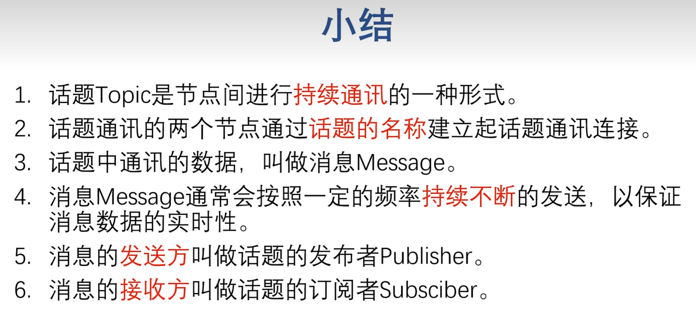
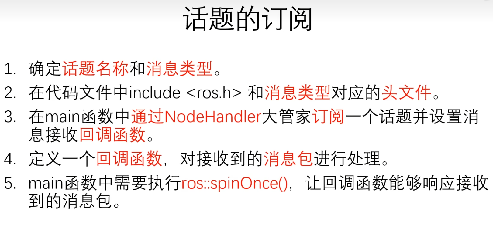

# 1、ROS 应用商店 APT 源

1、ROS应用商店 APT 源：网址：index.ros.org；

2、只有拥有闪电图标的软件包才能用 APT 去下载安装；

3、后续如果要安装，使用

```
sudo apt install ros-( ROS 版本)-(软件包名称，也就是下图中的Name)
```


4、示例：点开 rqt_robot_steering：


5、安装并测试 rqt_robot_steering


使用小乌龟来测试该功能包：

Tips：注意小乌龟的速度节点为：$/turtle1/cmd\_vel$


# 2、Github上寻找并安装ROS软件包

```
mkdir -p catkin_ws/src
cd catkin_ws/src
sudo apt install git 
git clone https://github.com/6-robot/wpr_simulation.git
```

其中 https://github.com/6-robot/wpr_simulation.git 来源于github 上的地址

在 catkin_ws 工作空间下进行编译：

```
catkin_make
```

刷新工作环境变量：

```
source devel/setup.zsh
```


# 3、寻找软件包源码

1、搜索 index.ros.org

2、输入包名

3、点击转到 github网址

4、重复 “Github上寻找并安装ROS软件包”步骤


# 4、使用 VSCode 编译代码

1、选择文件 -> 将文件夹添加到工作区

==tips：添加的是 src 文件，且是已经编译好的工作空间==


2、编译快捷键

```
ctrl + shift + B
```

选择 catkin_make build


3、编译完成后，再次选择 ctrl + shift + B，点击其旁边的齿轮，此时新建出 task.json


4、修改 group 行参数

```json
{
	"version": "2.0.0",
	"tasks": [
		{
			"type": "catkin_make",
			"args": [
				"--directory",
				"/home/yin-roc/1_Code/Ubuntu20.04/catkin_ws",
				"-DCMAKE_BUILD_TYPE=RelWithDebInfo"
			],
			"problemMatcher": [
				"$catkin-gcc"
			],
			"group": {"kind":"build","isDefault": true},
			"label": "catkin_make: build"
		}
	]
}
```

自此以后，$ctrl + shift + B$ 就直接编译了，不用再点击选择。


# 5、解决头文件出现红色波浪线问题

问题出现在 c_cpp_properties.json 文件

5.1	简单粗暴法

将 c_cpp_properties.json 文件删除，重启vscode！

神奇的一幕出现了，自动出现了工作目录！


5.2	禁用错误曲线法（自欺欺人法）

$ctrl+shift+P$ ，输入 error squiggles,禁用错误波形曲线


如要恢复错误波形曲线：

settings.json 中C_Cpp.errorSquiggles 设置为 enabled

```
{

​    "C_Cpp.errorSquiggles": "enabled"

}
```


# 6、Terminator


`crtl+shift+e`失效，无法分屏，解决方法：

```
ibus-setup
```


# 7、年轻人的第一个节点：Node

1、创建功能包

```
cd 1_Code/Ubuntu20.04/catkin_ws/src
catkin_create_pkg ssr_pkg roscpp rospy std_msgs
```


2、CmakeLists.txt

单 # ：命令指令的注释

双 #：某些指令的详细说明


3、package.xml

有 package.xml 说明这是一个软件包。


4、roscd


示例：

```
roscd roscpp
ls
code package.xml
```


5、ros 中的依赖项

ros 的软件功能包地址（都是现成的可执行文件）：

```
/opt/ros/noetic/share/roscpp
```

而自定的 `catkin_ws` 都是需要编译的。


6、步骤如下


# 8、ROS 的主要通讯方式: Topic 话题与 Message消息

Topic 话题：




Message 消息：

消息类型通过 `index.ros.org` 查找：`std_msgs`，选择相应版本，点击 website 查看 `ROS Message Types`：

1. **Raw Message Definition（原始消息定义）：**
	- 这是消息的原始、完整的定义。它包含消息类型的所有字段以及它们的数据类型。
	- 通常以一种更易读的方式呈现，包括注释和详细描述。
	- 用于了解消息的结构、字段名称和数据类型。
2. **Compact Message Definition（紧凑消息定义）：**
	- 这是消息定义的一种紧凑形式，通常用于节省空间和简化通信。
	- 可以看作是原始消息定义的精简版本，去除了注释和其他冗余信息。
	- 用于在网络上传输消息时减少数据量，提高通信效率。

例如这种 std_msgs/MultiArrayLayout layout 的是一种嵌套数据类型，可以简单粗暴地理解为结构体嵌套。


# 9、用C++编写Publisher发布者节点

9.1	发布者：

要确定

1、发布的话题名称

2、发布的消息类型


9.2	查看节点发布频率：

```
rostopic hz /kuai_sahng_che_kai_hei_qun
```

显示的 `average rate` 便是发布者每秒发布的次数。


9.3	输出中文显示

中文版 Ubuntu设置 setlocale(LC_ALL, "");

英文版 Ubuntu 设置 `setlocale(LC_ALL, "zh_CN.UTF-8");`


9.4	rqt_graph

显示节点之间的联系图


9.5 订阅者




# 10、roslaunch


# 11、ROS机器人运动控制


ros 的速度消息包格式：`index.ros.org` 搜索 `geometry_msgs` 中的 `Twist`


# 12、用 C++ 实现机器人运动控制


```c++
#include <ros/ros.h>
#include <geometry_msgs/Twist.h>

int main(int argc, char *argv[])
{
    ros::init(argc, argv, "vel_node");

    ros::NodeHandle nh;
    ros::Publisher vel_pub = nh.advertise<geometry_msgs::Twist>("/cmd_vel", 10);

    geometry_msgs::Twist vel_msg;
    
    vel_msg.linear.x = 0.1;
    vel_msg.linear.y = 0;
    vel_msg.linear.z = 0;
    vel_msg.angular.x = 0;
    vel_msg.angular.y = 0;
    vel_msg.angular.z = 0;

    ros::Rate r(30);
    while (ros::ok())
    {
        vel_pub.publish(vel_msg);
        r.sleep();
    }
    
    return 0;
}
```


# 13、激光雷达

## 1、基本介绍

按照测量维度：单线雷达和多线雷达；

按照测量原理：分为三角测距雷达和TOF雷达；

按照旋转方式：分为机械旋转雷达和固态雷达。


## 2、仿真所需工具

Gazebo 是模拟真实机器人发出传感器数据的工具；（真实环境并不存在）

Rviz 是接受传感器数据并进行显示的数据。（真实环境非必需，观察数据时才需要）

## 3、激光雷达的消息格式

网址 `index.ros.org` 搜索 `sensor_msgs`，找到 LaserScan


启动 wpr_simulation 项目，终端输入：

```
 rostopic echo /scan --noarr 
```


3.1	angle_min 和 angle_max

最小角度与最大角度


3.2	angle_increment 和 time_increment

相邻两次测距行为的角度和时间

测距行为：激光雷达发射红外激光到接受红外激光称为一个测距行为。

完成一次测距行为激光雷达会旋转一个角度。


3.3	scan_time

两次扫描的起始时间差

由于本例中起始方向和终止方向重合，也就是两次扫描的起始时间差是雷达旋转一周的时间。

用 1s / 单次扫描时间 = 雷达的扫描频率 


3.4	range_min 和 range_max

扫描最小和最大半径


3.5	ranges: "<array type: float32, length: 360>"

数组元素类型为 flaat32

数组的长度为 360

雷达旋转一周为 360 °，也就是对应每一度的测距值。

如下图所示，从起始角度开始，一个个存储距离值


有时候会有部分障碍物超出了雷达的测距范围，因此数组内置为 INF（无穷大）。


3.6	intensities: "<array type: float32, length: 360>"

与 range 数组相对应，也是360个，这个数组的数值大小表示的是每一次测距的信号强度。


## 4、用C++实现获取激光雷达数据

消息包的数据格式：`sensor_msgs::LaserScan`


```c++
#include <ros/ros.h>
#include <sensor_msgs/LaserScan.h>

void LidarCallback(const sensor_msgs::LaserScan msg)
{
    float fMidDist = msg.ranges[180];
    ROS_INFO("前方测距 ranges[180] = %f 米", fMidDist);
}

int main(int argc, char *argv[])
{   
    setlocale(LC_ALL, "");
    ros::init(argc, argv, "lidar_node");
    ros::NodeHandle nh;
    ros::Subscriber lidar_sub = nh.subscribe("/scan", 10, &LidarCallback);

    ros::spin();

    return 0;
}
```

雷达正前方的值应该是 ranges[180] 里面的数据


## 5、实现激光雷达避障


```c++
#include <ros/ros.h>
#include <sensor_msgs/LaserScan.h>
#include <geometry_msgs/Twist.h>

ros::Publisher vel_pub;

void LidarCallback(const sensor_msgs::LaserScan msg)
{
    float fMidDist = msg.ranges[180];
    ROS_INFO("前方测距 ranges[180] = %f 米", fMidDist);

    geometry_msgs::Twist vel_cmd;
    if(fMidDist < 1.5)
    {
        vel_cmd.angular.z = 0.3;
    }
    else
    {
        vel_cmd.linear.x = 0.1;
    }
    vel_pub.publish(vel_cmd);
}

int main(int argc, char *argv[])
{   
    setlocale(LC_ALL, "");
    ros::init(argc, argv, "lidar_node");
    ros::NodeHandle nh;
    ros::Subscriber lidar_sub = nh.subscribe("/scan", 10, &LidarCallback);
    
    vel_pub = nh.advertise<geometry_msgs::Twist>("/cmd_vel", 10);

    ros::spin();

    return 0;
}
```

但是出现了一些问题，那就是虽然机器人的正前方，也就是ranges[180] 没有了障碍物，但是机器人的侧前方还是会碰到障碍物。

计算可得机器人的雷达扫描频率是 11 Hz，考虑让机器人多旋转一些角度。


因此引入变量 nCount，当 障碍物进入避障范围时，进行旋转并倒计时：

```c++
#include <ros/ros.h>
#include <sensor_msgs/LaserScan.h>
#include <geometry_msgs/Twist.h>

ros::Publisher vel_pub;
int nCount = 0;

void LidarCallback(const sensor_msgs::LaserScan msg)
{
    float fMidDist = msg.ranges[180];
    ROS_INFO("前方测距 ranges[180] = %f 米", fMidDist);

    if(nCount > 0)
    {
        nCount--;
        return ;
    }

    geometry_msgs::Twist vel_cmd;
    if(fMidDist < 1.5)
    {
        vel_cmd.angular.z = 0.3;
        nCount = 50;
    }
    else
    {
        vel_cmd.linear.x = 0.1;
    }
    vel_pub.publish(vel_cmd);
}

int main(int argc, char *argv[])
{   
    setlocale(LC_ALL, "");
    ros::init(argc, argv, "lidar_node");
    ros::NodeHandle nh;
    ros::Subscriber lidar_sub = nh.subscribe("/scan", 10, &LidarCallback);
    
    vel_pub = nh.advertise<geometry_msgs::Twist>("/cmd_vel", 10);

    ros::spin();

    return 0;
}
```


# 14、IMU

## 1、基本介绍

查找：index.ros.org $\rightarrow$ sensor_msgs $\rightarrow$ website  $\rightarrow$ IMU 


此处IMU的 角速度：`geometry_msgs/Vector3 angular_velocity` 与 `Twist` 里面的 `geometry_msgs/Vector3 angular` 区别：

IMU的是输入值，Twist里面的是输出值；两者在数值上是相等的。

此处 `IMU` 的 `geometry_msgs/Vector3 linear_acceleration` 与`Twist`的 `geometry_msgs/Vector3 linear`很相似，但是区别在于：

Twist里面的 linear 描述的是 XYZ 三个坐标轴上的速度；

而IMU中的 描述的是矢量加速度 linear_acceleration 是三个坐标轴上速度的增减情况，也就是加速度。

上述的三个数据成员都各自带了如下的协方差矩阵，主要用于后期的优化和滤波。

```
float64[9] orientation_covariance # Row major about x, y, z axes
float64[9] angular_velocity_covariance # Row major about x, y, z axes
float64[9] linear_acceleration_covariance # Row major x, y z 
```

为了方便用户使用，IMU 模块还会输出一个根据上述数值融合得到的空间姿态描述，也就是上方未提到的 orientation，描述的是机器人的朝向相对于空间中 XYZ 三个坐标轴的偏移量。


当然也可以自行根据裸数据 angular_velocity 和 linear_acceleration 进行姿态信息的融合。

除了基于 XYZ 三个轴的旋转偏移量描述，也就是欧拉角描述，为了解决某些姿态下存在的一种万向锁的问题，使用四元数描述法。


实际中，四元数描述法通常只在进行旋转变换的过程中使用，旋转后得到的结果还是会转换成欧拉角来使用。

## 2、使用C++实现IMU数据获取


磁强计只有九轴IMU才会发布这个话题；

一般直接订阅 imu/data 这个话题。


需要将四元数转换成欧拉角

```c++
#include "ros/ros.h"
#include "sensor_msgs/Imu.h"
#include "tf/tf.h"

void IMUCallback(sensor_msgs::Imu msg)
{
    if(msg.orientation_covariance[0] < 0) // 协方差矩阵的第一个值如果为 -1，则代表数据不存在，不需要去读取
        return ;
    tf::Quaternion quaternion( // 将消息包里面的四元素转换成 tf 的四元数对象
        msg.orientation.x,
        msg.orientation.y,
        msg.orientation.z,
        msg.orientation.w
    );

    double roll, pitch, yaw;
    tf::Matrix3x3(quaternion).getRPY(roll, pitch, yaw); // roll：滚转，pitch：俯仰，yaw：朝向
    roll = roll * 180 / M_PI;
    pitch = pitch * 180 / M_PI;
    yaw = yaw * 180 / M_PI;
    ROS_INFO("滚转 = %.0f    俯仰 = %.0f    朝向 = %.0f", roll, pitch, yaw);

}

int main(int argc, char *argv[])
{
    setlocale(LC_ALL, "");
    ros::init(argc, argv, "imu_node");

    ros::NodeHandle nh;
    ros::Subscriber imu_sub = nh.subscribe("/imu/data", 10, IMUCallback);

    ros::spin();
    return 0;
}

```


3、用 C++ 实现 IMU 航向锁定


```
#include "ros/ros.h"
#include "sensor_msgs/Imu.h"
#include "tf/tf.h"
#include "geometry_msgs/Twist.h"

ros::Publisher vel_pub;

void IMUCallback(sensor_msgs::Imu msg)
{
    if(msg.orientation_covariance[0] < 0) // 协方差矩阵的第一个值如果为 -1，则代表数据不存在，不需要去读取
        return ;
    tf::Quaternion quaternion( // 将消息包里面的四元素转换成 tf 的四元数对象
        msg.orientation.x,
        msg.orientation.y,
        msg.orientation.z,
        msg.orientation.w
    );

    double roll, pitch, yaw;
    tf::Matrix3x3(quaternion).getRPY(roll, pitch, yaw); // roll：滚转，pitch：俯仰，yaw：朝向
    roll = roll * 180 / M_PI;
    pitch = pitch * 180 / M_PI;
    yaw = yaw * 180 / M_PI;
    ROS_INFO("滚转 = %.0f    俯仰 = %.0f    朝向 = %.0f", roll, pitch, yaw);

    double target_yaw = 90;
    double diff_angle = target_yaw - yaw;
    geometry_msgs::Twist vel_cmd;
    vel_cmd.angular.z = diff_angle * 0.01;
    vel_cmd.linear.x = 0.1;
    vel_pub.publish(vel_cmd);
}

int main(int argc, char *argv[])
{
    setlocale(LC_ALL, "");
    ros::init(argc, argv, "imu_node");

    ros::NodeHandle nh;
    ros::Subscriber imu_sub = nh.subscribe("/imu/data", 10, IMUCallback);
    vel_pub = nh.advertise<geometry_msgs::Twist>("/cmd_vel", 10);

    ros::spin();
    return 0;
}
```


# 15、ROS 的标准消息包

为了防止订阅话题错误，但是数据类型匹配上而导致的 bug 难以查找的问题，ros 大部分节点间的通讯都是使用了 common_msgs 消息包。


Duration 和 Time 都是表示时间的结构体。

Duration ：相对时间，可正可负；

Time：绝对时间，不能为负。

Header：记录了时间戳和坐标系名称的结构体，所有包含 Stamped 关键词的消息类型都会包含 header 结构体。


# 16、ROS中的几何包 geometry_msgs 和传感器包 sensor_msgs

## 1、common_msgs

actionlib_msgs：与 ROS 的 Action 通讯机制配合使用的消息类型；

diagnostic_msgs：机器人的自我诊断消息包；

geometry_msgs：几何消息包；

nav_msgs：导航消息包；

sensor_msgs： 传感器消息包。


带 stamped 关键词的消息包都是多了一个 header，也就是时间和坐标系ID，将时间量和空间量进行了绑定。

## 2、geometry_msgs


其他消息类型的使用：（参考 Twist 消息类型的使用）

1. ROS Index 里面搜索消息包的名称；（例如：geometry_msgs）；

	

	

2. 找到 wiki 页面里面的消息类型定义；

	

	

3. 按照定义的消息包结构，进行数据的装填和读取；

	

4. 发布和订阅话题，进行消息包的发送和接收；

	


## 3、sensor_msgs


传感器包的使用参考雷达和IMU实验：

1. ROS Index 里面搜索消息包的名称（例如：sensor_msgs）;

2. 在wiki界面里找到需要的消息类型；

	

3. 注释信息会解释每个含义；

	

4. 按照定义的消息包结构，进行数据的装填和读取；

	

5. 订阅和发送消息包

  


# 17、ROS 中自定义消息类型

1、概念

消息包也是一个普通的 package，不过为了便于识别，会加上 $\_msgs$ 作为结尾。

所添加的依赖：

```
roscpp rospy std_msgs message_generation message_runtime
```

2、消息包格式要求

新建 msg 文件夹，文件内容格式参照 String 消息包的格式：


3、在 msg 文件夹里创建 Carry.msg 文件：

```
string grade
int64 star
string data
```

==tips：注意千万不能用ROS消息包以外的类型==，比如说：

```
int star
```

会报错：

```
Could not find messages which
  '/home/yin-roc/catkin_ws/src/qq_msgs/msg/Carry.msg' depends on.  Did you
  forget to specify generate_messages(DEPENDENCIES ...)?
```

4、配置 CMakeLists：

```
## Generate messages in the 'msg' folder
add_message_files(
  FILES
  Carry.msg
)

# 新建的 msg 消息类型所要依赖的其他消息包
generate_messages(
  DEPENDENCIES
  std_msgs
)

# 注意 是否包含 message_generation message_runtime
catkin_package(
#  INCLUDE_DIRS include
#  LIBRARIES qq_msgs
 CATKIN_DEPENDS message_generation message_runtime roscpp rospy std_msgs
#  DEPENDS system_lib
)
```

5、查看 package.xml，确保 <build_depend> 和 <exec_depend> 都列出了 message_generation 和 message_runtime，缺失了就都补全


6、编译完成后，使用命令：

```
rosmsg show qq_msgs/Carry
```

查看新的消息类型。

7、总结


# 18、ROS中使用自定义消息类型

## 发布者：

1、在所在功能包使用其他功能包定义的消息类型，要在CMakeLists 里面添加消息包的依赖，意在告诉编译器，先去编译所需要的依赖，再来编译当前功能包，否则会报错。

2、CMakeLists：

设置该软件包编译所需要的依赖项

```
find_package(catkin REQUIRED COMPONENTS
  roscpp
  rospy
  std_msgs
  qq_msgs
)
```

==Tips==：

- add_dependencies 是 add_executable 下方的 add_dependencies ，避免混淆；

- 2、 add_dependencies 必须==位于== add_executable 与 target_link_libraries==之间==！！！

```
add_dependencies(chao_node qq_msgs_generate_messages_cpp)
```


3、Package.xml：添加 qq_msgs 到 build_depend 和 exec_depend中

```
  <buildtool_depend>catkin</buildtool_depend>
  <build_depend>roscpp</build_depend>
  <build_depend>rospy</build_depend>
  <build_depend>std_msgs</build_depend>
  <build_depend>qq_msgs</build_depend>

  <build_export_depend>roscpp</build_export_depend>
  <build_export_depend>rospy</build_export_depend>
  <build_export_depend>std_msgs</build_export_depend>
  <exec_depend>roscpp</exec_depend>
  <exec_depend>rospy</exec_depend>
  <exec_depend>std_msgs</exec_depend>
  <exec_depend>qq_msgs</exec_depend>
```

## 订阅者

1、CMakLists.txt

```
find_package(catkin REQUIRED COMPONENTS
  roscpp
  rospy
  std_msgs
  test_msgs
)

add_executable(sub_node src/sub_node.cpp)

add_dependencies(sub_node test_msgs_generate_messages_cpp)

target_link_libraries(sub_node
  ${catkin_LIBRARIES}
)
```

2、Package.xml

```
<build_depend>test_msgs</build_depend>
<exec_depend>test_msgs</exec_depend>
```

3、总结


# 19、ROS 中的栅格地图格式

1、机器人导航所使用的地图数据，来自于 map_server 节点


2、栅格地图的地图分辨率 = 栅格边长

3、自由栅格记为 0；障碍物占据的栅格记为 100。


4、数组 + 栅格的行列信息等信息，就能描述这个栅格的具体内容。


5、栅格地图的消息类型

Index.ros.org $\rightarrow$ map_server  $\rightarrow$ website   $\rightarrow$ map_server   $\rightarrow$ [nav_msgs/OccupancyGrid](http://docs.ros.org/en/api/nav_msgs/html/msg/OccupancyGrid.html) :


（0，0）的位置是地图最左下角的栅格：


6、[nav_msgs/MapMetaData](https://docs.ros.org/en/api/nav_msgs/html/msg/MapMetaData.html) 数据格式：


origin：地图中的(0,0)与真实世界的坐标原点的偏差量，包括横向和纵向的位移偏差量，以及一个角度偏差量。


# 19、使用 C++ 发布自定义地图

构建如下地图


```c++
#include <ros/ros.h>
#include <nav_msgs/OccupancyGrid.h>

int main(int argc, char *argv[])
{
    ros::init(argc, argv, "map_pub_node");
    ros::NodeHandle nh;

    ros::Publisher pub = nh.advertise<nav_msgs::OccupancyGrid>("/map", 10);
    
    nav_msgs::OccupancyGrid msg;

    ros::Rate r(1);
    while (ros::ok())
    {
        msg.header.frame_id = "map";
        msg.header.stamp = ros::Time::now();

        msg.info.resolution = 1.0;
        msg.info.width = 4;
        msg.info.height = 2;
        msg.info.origin.position.x = 1.0;
        msg.info.origin.position.y = 0;

        msg.data.resize(4*2);
        msg.data[0] = 100;
        msg.data[1] = 100;
        msg.data[2] = 0;
        msg.data[3] = -1;
        msg.data[4] = 0;
        msg.data[5] = 0;
        msg.data[6] = 0;
        msg.data[7] = 0;

        pub.publish(msg);
        r.sleep();
    }
    

    return 0;
}
```

