# 1	Shell 基础

## 01	shell 的作用

1. 解释执⾏⽤户输⼊的命令或程序等
2. ⽤户输⼊⼀条命令， shell就解释⼀条
3. 键盘输⼊命令， Linux给与响应的⽅式，称之为交互式

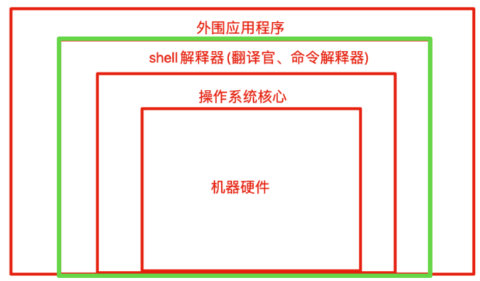

shell是⼀块包裹着系统核⼼的壳，处于操作系统的最外层，与⽤户直接对话，把⽤户的输⼊， 解释 给操作系统，然后处理操作系统的输出结果，输出到屏幕给与⽤户看到结果。

外围应用程序是用户输入的指令；将其发给 shell 解释器 翻译后传递给操作系统核心。

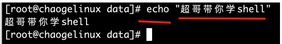

从我们登录Linux，输⼊账号密码到进⼊Linux交互式界⾯，所有的操作，都是交给shell解释并执⾏  

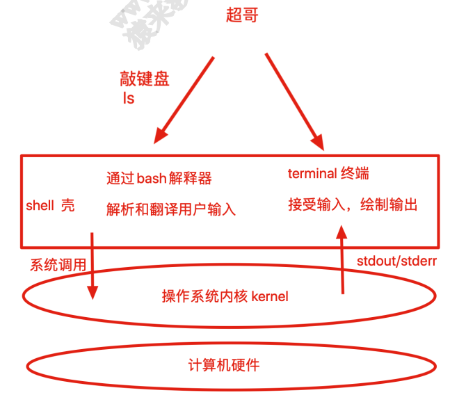

我们想要获取计算机的数据，不可能每次都编写程序，编译后，再运⾏，再得到我们想要的，例如你想找到⼀个⽂件，可以先写⼀段C语⾔的代码，然后调⽤系统函数，通过gcc编译后，运⾏程序才能找到⽂件。。。  

因此有⼤⽜开发出了shell解释器，能够让我们⽅便的使⽤ Linux，例如只要敲下 `ls -lh` 这样的字符串， shell解释器就会针对这句话翻译，解释成 `ls -l -h` 然后执⾏，通过终端输出结果，⽆论是图形化或是命令⾏界⾯。

即使我们⽤的图形化，点点点的动作，区别也只是

- 命令⾏操作， shell解释执⾏后，输出结果到⿊屏命令⾏界⾯
- 图形化操作， shell接受点击动作，输出图案数据


## 02	什么是 shell 脚本  

当命令或者程序语句写在⽂件中，我们执⾏⽂件，读取其中的代码，这个程序⽂件就称之为 shell 脚本。在shell 脚本⾥定义多条 Linux 命令以及循环控制语句，然后将这些 Linux 命令⼀次性执⾏完毕，执⾏脚本⽂件的⽅式称之为，⾮交互式⽅式。

- windows中存在 *.bat 批处理脚本
- Linux中常⽤ *.sh 脚本⽂件


shell脚本规则

在Linux系统中， shell脚本或者称之为（bash shell程序）通常都是vim编辑，由Linux命令、 bash shell指令、逻辑控制语句和注释信息组成。

## 03	Shebang

计算机程序中， shebang 指的是出现在⽂本⽂件的第⼀⾏前两个字符 #!

在Unix系统中，程序会分析 shebang 后⾯的内容，作为解释器的指令，例如

- 以 `#!/bin/sh` 开头的⽂件，程序在执⾏的时候会调⽤ /bin/sh ，也就是bash解释器

	```
	查看其软链接对象
	ls -l /bin/sh
	```

- 以 `#!/usr/bin/python` 开头的⽂件，代表指定 python 解释器去执⾏

- 以 `#!/usr/bin/env`  解释器名称 ，是⼀种在不同平台上都能正确找到解释器的办法

注意事项：

- 如果脚本**未指定 shebang** ，脚本执⾏的时候，**默认⽤当前shell去解释脚本**，即 `$SHELL`
- 如果 shebang 指定了可执⾏的解释器，如 `/bin/bash /usr/bin/python` ，脚本在执⾏时，⽂件名会作为参数传递给解释器
- 如果#!指定的解释程序没有可执⾏权限，则会报错“bad interpreter: Permission denied”。
- 如果#!指定的解释程序不是⼀个可执⾏⽂件，那么指定的解释程序会被忽略，转⽽交给当前的SHELL去执⾏这个脚本。
- 如果#!指定的解释程序不存在，那么会报错“bad interpreter: No such file or directory”。
- #!之后的解释程序，需要写其绝对路径（如： #!/bin/bash），它是不会⾃动到$PATH中寻找解释器的。
- 如果你使⽤"bash test.sh"这样的命令来执⾏脚本，那么#!这⼀⾏将会被忽略掉，解释器当然是⽤命令⾏中显式指定的bash。

脚本案例  

```
[root@chaogelinux data]# cat test.sh
#!/bin/bash
echo "超哥强呀，奥⼒给"
#!/bin/bash 这⾥就是注释的作⽤了
```

系统⾃带的bash脚本，开机启动脚本  

```
[root@chaogelinux data]# head -1 /etc/rc.d/init.d/network
#! /bin/bash
```


### 脚本注释，脚本开发规范

- 在shell脚本中， #后⾯的内容代表注释掉的内容，提供给开发者或使⽤者观看，系统会忽略此⾏
- 注释可以单独写⼀⾏，也可以跟在命令后⾯
- 尽量保持爱写注释的习惯，便于以后回顾代码的含义，尽量使⽤英⽂、⽽⾮中⽂

```
#! /bin/bash
# Date : 2019-11-28 14:59:18
# Author： created by chaoge
# Blog： www.cnblogs.com/pyyu
```

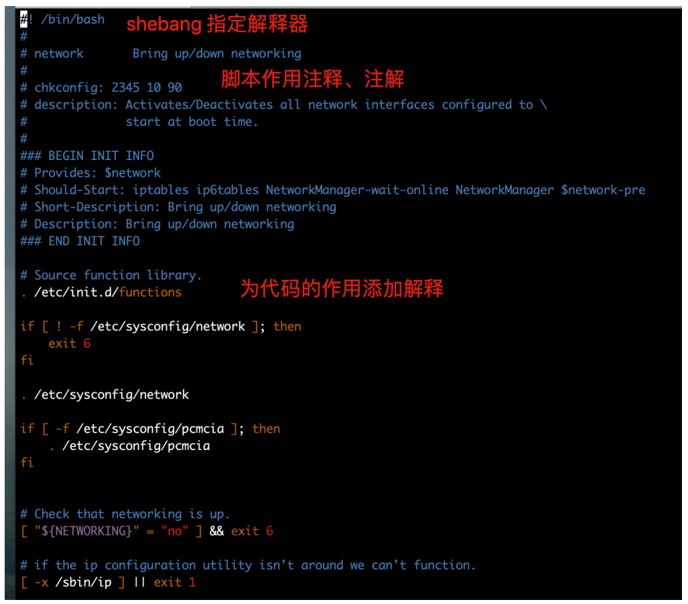


### 执⾏ shell 脚本的⽅式

- `bash script.sh` 或 `sh scripte.sh`，⽂件本身没权限执⾏，没x权限，则使⽤的⽅法，或脚本未指定`shebang` ，重点推荐的⽅式；
- 使⽤ 绝对/相对 路径执⾏脚本，需要⽂件含有x权限；
- `source script.sh` 或者 `. script.sh` ，代表 执⾏的含义， source等于点`.`
- 少见的⽤法， `sh < script.sh`

```
[root@chaogelinux data]# cat test.sh 
#!/bin/bash
echo "超哥强呀，奥⼒给"
#!/bin/bash 这⾥就是注释的作⽤了
[root@chaogelinux data]# 
[root@chaogelinux data]# 
[root@chaogelinux data]# sh < test.sh
超哥强呀，奥⼒给
[root@chaogelinux data]# sh test.sh
超哥强呀，奥⼒给
[root@chaogelinux data]# bash test.sh
超哥强呀，奥⼒给
[root@chaogelinux data]# source test.sh
超哥强呀，奥⼒给
[root@chaogelinux data]# . /data/test.sh
超哥强呀，奥⼒给
权限不⾜
[root@chaogelinux data]# ./test.sh
-bash: ./test.sh: 权限不够
[root@chaogelinux data]# chmod +x test.sh
[root@chaogelinux data]# ./test.sh
超哥强呀，奥⼒给
```


## 04	shell 和运维 shell

脚本语⾔很适合处理纯⽂本类型数据，且Linux的哲学思想就是⼀切皆⽂件，如⽇志、配置⽂件、⽂本、网页⽂件，⼤多数都是纯⽂本类型的，因此shell可以⽅便的进⾏⽂本处理，好⽐强⼤的Linux三剑客（grep、 sed、awk）

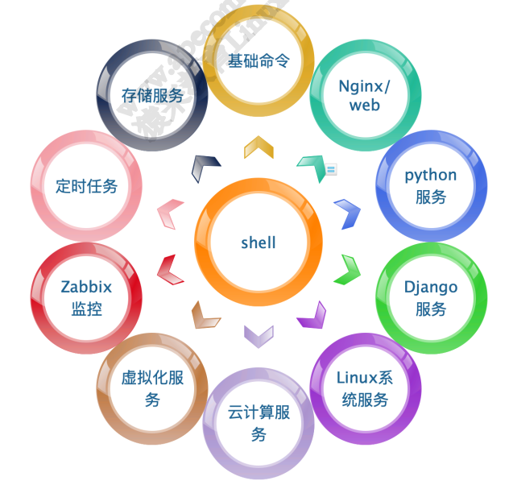


### 脚本语⾔

shell脚本语⾔属于⼀种弱类型语⾔ ⽆需声明变量类型，直接定义使⽤；

强类型语⾔，必须先定义变量类型，确定是数字、字符串等，之后再赋予同类型的值；

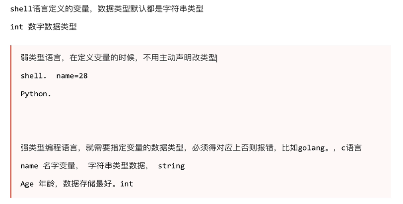

centos7系统中⽀持的shell情况，有如下种类  

```
[root@chaogelinux ~]# cat /etc/shells
/bin/sh
/bin/bash
/sbin/nologin
/usr/bin/sh
/usr/bin/bash
/usr/sbin/nologin
/bin/tcsh
/bin/csh
```

默认的sh解释器  

```
[root@chaogelinux ~]# ll /usr/bin/sh
lrwxrwxrwx 1 root root 4 11⽉ 16 10:48 /usr/bin/sh -> bash
```


### shell 的优势

虽然有诸多脚本编程语⾔，但是对于Linux操作系统内部应⽤⽽⾔， shell是最好的⼯具， Linux底层命令都⽀持shell语句，以及结合三剑客(grep、 sed、 awk)进⾏⾼级⽤法。

- 擅长系统管理脚本开发，如软件启停脚本、监控报警脚本、⽇志分析脚本

每个语⾔都有⾃⼰擅长的地⽅，扬长避短，达到⾼效运维的⽬的是最合适的。

```
#Linux默认shell
[root@chaogelinux ~]# echo $SHELL
/bin/bash
```


## 05	Bash 特性

### bash 是什么

- bash是一个命令处理器，运行在文本窗口中，并能执行用户直接输入的命令
- bash还能从文件中读取linxu命令，称之为脚本
- bash支持通配符、管道、命令替换、条件判断等逻辑控制语

bash有诸多方便的功能，有助于运维人员提升工作效率、


命令历史

Shell会保留其会话中⽤户提交执⾏的命令  

```
#命令，查看历史命令记录，注意【包含⽂件中和内存中的历史记录】
history 

#shell进程可保留的命令历史的条数
[root@chaogelinux ~]# echo $HISTSIZE 
3000

#存放历史命令的⽂件，⽤户退出登录后，持久化命令个数
[root@chaogelinux ~]# echo $HISTFILE 
/root/.bash_history

#存放历史命令的⽂件
[root@chaogelinux ~]# ls -a ~/.bash_history
/root/.bash_history
```

history命令  

```
history #命令 以及参数
-c: 清空内存中命令历史；
-r：从⽂件中恢复历史命令
数字 ：显示最近n条命令 history 10
```

调⽤历史命令  

```
#执⾏历史记录中的某n条命令
!n 

#执⾏上⼀次的命令，或者向上箭头
!! 

#执⾏名字以string开头的最近⼀次的命令
!string 
```

调⽤上⼀次命令的最后⼀个参数  

```
ESC . #快捷键
!
```

控制历史命令的环境变量  

```
变量名： HISTCONTROL
ignoredups：忽略重复的命令；
ignorespace：忽略以空⽩字符开头的命令；
ignoreboth：以上两者同时⽣效；
[root@chaogelinux ~]# HISTCONTROL=ignoreboth
[root@chaogelinux ~]# echo $HISTCONTROL
ignoreboth
[root@chaogelinux ~]# history
```


### bash特性汇总

- ⽂件路径tab键补全
- 命令补全
- 快捷键ctrl + a,e,u,k,l
- 通配符
- 命令历史
- 命令别名
- 命令⾏展开


## 06	shell 变量详解

变量是暂时存储数据的地⽅，是⼀种数据标记（房间号，标记了客⼈所在的位置），数据存储在内容空间，通过调⽤正确的变量名字，即可取出对应的值。  


### shell变量

1. 变量定义与赋值，注意变量与值之间不得有空格

	```
	name="超哥"
	
	变量名
	变量类型， bash默认把所有变量都认为是字符串
	
	bash变量是弱类型，⽆需事先声明类型，是将声明和赋值同时进⾏
	```

	

2. 变量替换/引⽤ 

	```
	[root@chaogelinux ~]# name="超哥带你学bash"
	[root@chaogelinux ~]# echo ${name}
	超哥带你学bash
	[root@chaogelinux ~]# echo $name #可以省略花括号
	超哥带你学bash
	```

	

3. 变量名规则

	1. 名称定义要做到见名知意，切按照规则来，切不得引⽤保留关键字(help检查保留字)；
	2. 只能包含数字、字母、下划线；
	3. 不能以数字开头；
	4. 不能⽤标点符号；
	5. 变量名严格区分⼤⼩写

	```
	有效的变量名：
	NAME_CHAOGE
	_chaoge
	chaoge1
	chaogE1
	Chao2_ge
	
	⽆效的变量名：
	?chaoge
	chao*ge
	chao+ge
	```

	

4. 变量的作⽤域  

	1. 作用域的解释：

		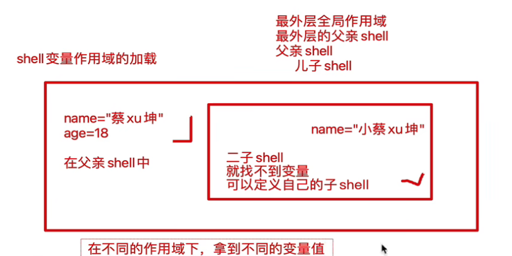

	2. 本地变量，只针对当前的shell进程  

		```
		pstree检查进程树
		```

		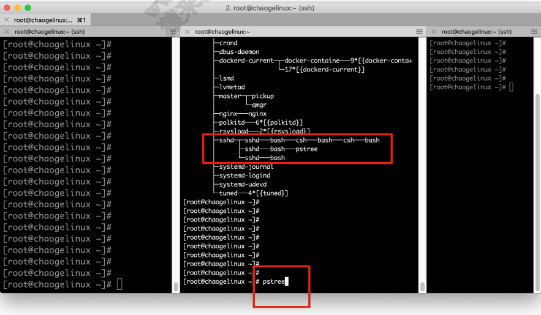

		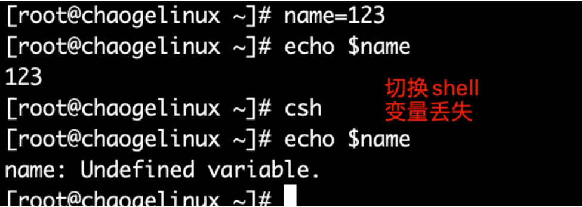

	3. 环境变量，也称为全局变量，针对当前shell以及其任意⼦进程，环境变量也分 ⾃定义 、 内置 两种环境变量。

	4. 局部变量，针对在 shell 函数 或是 shell 脚本中定义。

		

		

5. 位置参数变量：⽤于 shell脚本 中传递的参数（如下面的 `/opt`）

	```
	ls /opt
	```

	

6. 特殊变量： shell内置的特殊功效变量（判断上一行代码是否执行成功）

	1. $?

		1. 0：成功

		2. 1-255：错误码

			

7. ⾃定义变量

	1. 变量赋值： `varName=value`；

	2. 变量引⽤： `${varName}` 、 `$varName`  ;

		

		1. 双引号，变量名会替换为变量值  (**即单引号不能自动转换**)

			```
			[root@chaogelinux ~]# n1=1
			[root@chaogelinux ~]# n2=2
			[root@chaogelinux ~]#
			[root@chaogelinux ~]# n3="$n1"
			[root@chaogelinux ~]# echo $n3
			1
			[root@chaogelinux ~]# n4='$n2'
			[root@chaogelinux ~]# echo $n4
			$n2
			```

			

		2. 单引号，识别为普通字符串  

			

		3. > 单引号变量，不识别特殊语法。
			>
			> 双引号变量，能识别特殊符号

			

		

## 07	父子 shell 的面试题

不同的执⾏⽅式，不同的shell环境  

```
[root@chaogelinux data]# echo user1='超哥' > testsource.sh
[root@chaogelinux data]# echo $user1

[root@chaogelinux data]# sh testsource.sh
[root@chaogelinux data]# echo $user1

[root@chaogelinux data]# source testsource.sh
[root@chaogelinux data]# echo $user1
超哥
```


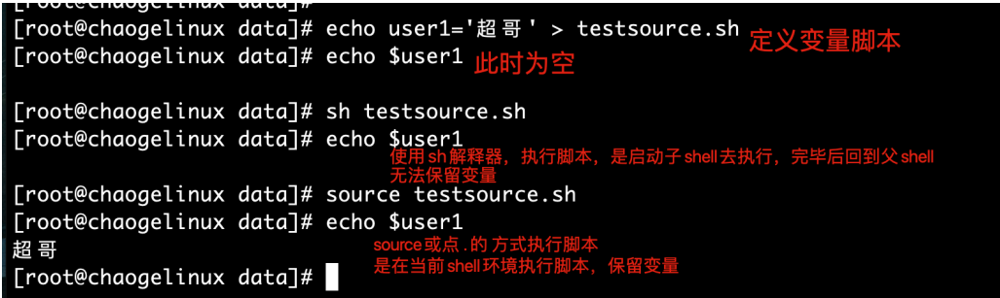


解答：

1.每次调用 bash/sh 解释器执行脚本，都会开启一个子 shell，因此不保留当前的shell变量，通过 pstree 命令检查进程树；

2.调⽤ source 或者点符号 `.` 是在当前shell环境加载脚本，因此保留变量；


```
[root@chaogelinux data]# cat test.sh
user1=`whoami`
[root@chaogelinux data]# sh test.sh
[root@chaogelinux data]# echo $user1

A.当前⽤户
B.超哥
C.空
```


linux命令

在linux中反引号，中的命令执行结果会被保留下来。

例如: 

```
name=`ls`
```

会将 `ls` 的内容赋值给 name.


## 08	通过 set 寻找父子 shell 的变量加载

环境变量⼀般指的是⽤ export 内置命令导出的变量，⽤于定义 shell 的运⾏环境、保证shell命令的正确执⾏。

shell 通过环境变量确定登录的⽤户名、 PATH 路径、⽂件系统等各种应⽤。

环境变量可以在命令⾏中临时创建，但是**⽤户退出shell终端，变量即丢失**，如要永久⽣效，需要修改 **环境变量配置⽂件**。

1. ⽤户个⼈配置⽂件 `~/.bash_profile` 、 `~/.bashrc` 远程登录⽤户特有⽂件；

	可以将所需要内容加入上述文件，用户登录后会加载这两个文件。

2.  全局配置⽂件 `/etc/profile` 、 `/etc/bashrc` ，且系统建议最好创建在 `/etc/profile.d/` ，⽽⾮直接修改主⽂件，修改全局配置⽂件，影响所有登录系统的⽤户 。

> 每个用户都有自己的环境变量配置文件，`~/.bash_profile  ` `~/.bashrc`，且以个人配置文件，优先加载变量，读取，以个人的优先生效;
>
> 当你需要给所有用户都使用某个变量，写入全局即可`/etc/profile` 

### 检查系统环境变量的命令

1. set，输出所有变量，包括全局变量、局部变量（**不能找到子 shell 中的变量**）；

  set 命令能够找到当前的 shell 环境中的所有变量，以及包括局部变量(sh脚本文件中定义的变量)

  ```
  set |wc -l
  ```

  例如：

  ```
  set |grep ^name
  ```

  其中，`^`表示以 name 开头。

  

  ## 09	Shell 变量学习与加载顺序

  

2. env，只显示全局变量；

	```
	env |wc -l
	```

3. declare，输出所有的变量，如同set 

	```
	declare |wc -l
	```

4. export，显示和设置环境变量值

	```
	export |wc -l
	```

`wc -l` 在这两个命令中的作用是统计其前面命令输出的行数。


```
export |grep PATH 中|grep的作用
```


### 撤销环境变量

- unset 变量名，删除变量或函数

	```
	name=123
	echo $name
	unset name
	echo $name
	```

	

### 设置只读变量

- readonly ，只有shell结束，只读变量失效

	```
	直接 readonly 显示当前系统只读变量
	[root@chaogelinux ~]# readonly name="超哥" 
	[root@chaogelinux ~]# name="chaochao" 
	-bash: name: 只读变量
	```


### 系统保留环境变量关键字

bash内嵌了诸多环境变量，⽤于定义bash的⼯作环境

输出所有环境变量的名字：

```
[root@chaogelinux ~]# export |awk -F '[ :=]' '{print $3}'
```


### bash多命令执⾏  

```
[root@chaogelinux home]# ls /data/;cd /tmp/;cd /home;cd /data
```


### 环境变量初始化与加载顺序  

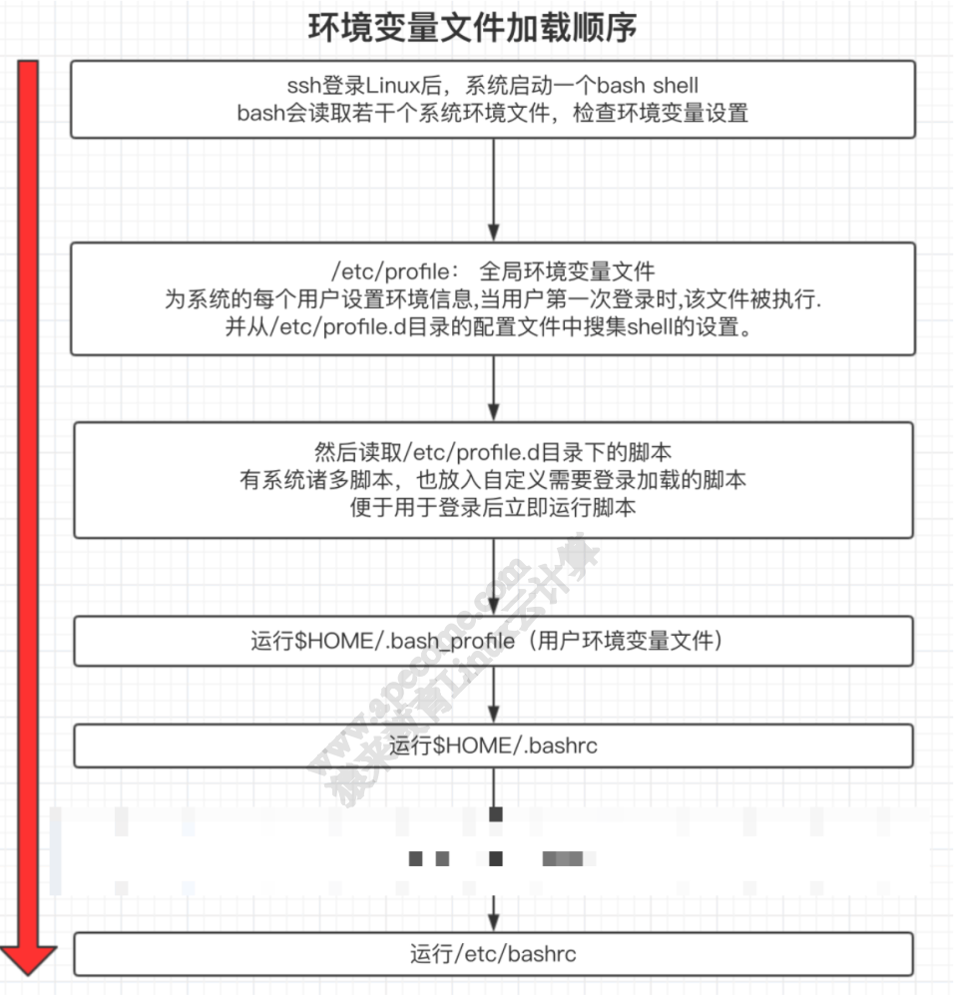


# 2	Shell变量

## 01	趣谈 Shell 特殊参数变量

### 取出变量值

- 单引号，所见即所得，强引⽤；
- 双引号，输出引号⾥所有内容，识别特殊符号，弱引⽤；
- ⽆引号，连续的符号可以不加引号，有空格则有歧义，最好使⽤双引号；
- 反引号，引⽤命令执⾏结果，等于 `$()` ⽤法。


### 特殊变量

参数传递

```
例如：ls -l 参数

test1.sh

# 参数的理解
bash test1.sh 参数1 参数2 参数3
```


shell 的特殊变量，⽤在如脚本，函数传递参数使⽤，有如下特殊的，位置参数变量  

```
$0	获取 shell 脚本⽂件名，以及脚本路径
$n	获取 shell 脚本的第 n 个参数, n 在 1~9 之间，如 $1 , $2 , $9 ，⼤于9则需要写， ${10} ，参数空格隔开
$#	获取执⾏的 shell 脚本后⾯的参数总个数
$*	获取 shell 脚本所有参数，不加引号等同于 $@ 作⽤，加上引号 "$*" 作⽤是 接收所有参数为单个字符串， "$1 $2.."

$@	不加引号，效果同上，加引号，是接收所有参数为独⽴字符串，如 "$1" "$2" "$3" ...，空格保留
```


> 特殊变量实践

```sh
# 脚本内容
#! /bin/bash
echo '---特殊变量 $0 $1 $2 ..的实践'
echo '结果： ' $0 $1 $2

echo '#####################'
echo '---特殊变量$# 获取参数总个数'
echo '结果： ' $#

echo '#####################'
echo '---特殊变量$* 实践'
echo '结果： ' $*

echo '#####################'

echo '---特殊变量$@ 实践'
echo '结果： ' $@
```

终端执行：

```bash
bash special_var.sh yu chao 180 180 180 180
```

执行结果：

```bash
---特殊变量 $0 $1 $2 ..的实践
结果：  special_var.sh yu chao
#####################
---特殊变量$# 获取参数总个数
结果：  6
#####################
---特殊变量$* 实践
结果：  yu chao 180 180 180 180
#####################
---特殊变量$@ 实践
结果：  yu chao 180 180 180 180
```


> \$* 和 $@ 都表示传递给函数或脚本的所有参数
>
> 当 \$* 和 \$@ 不被双引号" "包围时，它们之间没有任何区别，都是将接收到的每个参数看做⼀份数据，彼此之间以空格来分隔。
>
> 但是当它们被双引号" "包含时，就会有区别了：
>
> "\$\*"会将所有的参数从整体上看做⼀份数据，⽽不是把每个参数都看做⼀份数据。
>
> 输出："yu chao 180 180 180 180"
>
> "\$@"仍然将每个参数都看作⼀份数据，彼此之间是独⽴的。
>
> 输出：
>
> "yu" 
>
> "chao" 
>
> "180" 
>
> "180" 
>
> "180" 
>
> "180"
>
> ⽐如传递了 5 个参数，那么对于"\$\*"来说，这 5 个参数会合并到⼀起形成⼀份数据，它们之间是⽆法分割的；⽽对于"\$@"来说，这 5 个参数是相互独⽴的，它们是 5 份数据。
>
> 如果使⽤ echo 直接输出"\$*"和"\$@"做对⽐，是看不出区别的；但如果使⽤ for 循环来逐个输出数据，⽴即就能看出区别来。


实践面试题区别：

反斜杠：是转义符号的概念

脚本 different.sh 内容：

```sh
#!/bin/bash
echo "print each param from \"\$*\""
for var in "$*"
do
echo "$var"
done
echo "print each param from \"\$@\""
for var in "$@"
do
echo "$var"
done
```

终端输入：

```bash
./different.sh yu chao 180 180
```

输出结果：

```bash
print each param from "$*"
yu chao 180 180
print each param from "$@"
yu
chao
180
180
```

