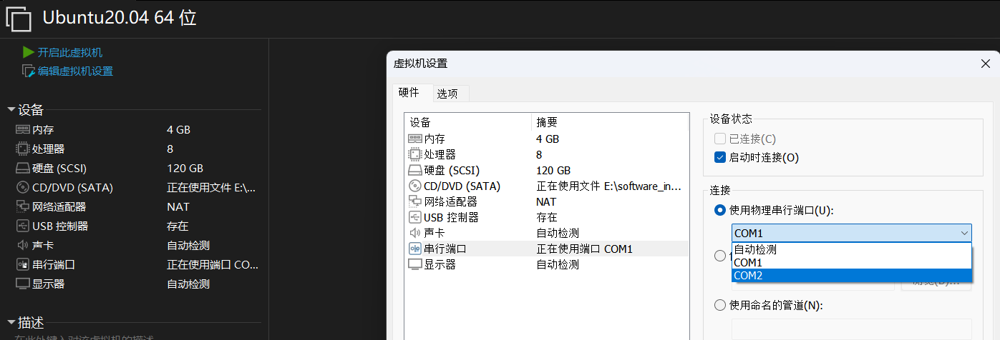

[VSPD虚拟串口软件安装及使用](https://blog.csdn.net/qq_41839588/article/details/131936554)

一、软件安装

1、Configure Virtual Serial Port Driver(VSPD)

1.1	首先下载 Configure Virtual Serial Port Driver(VSPD) 软件

链接：https://pan.baidu.com/s/11aGc2aHGUew5QZ0XhaWXJw

提取码：rmd7

1.2	安装时注意将路径选在 D 盘里，其他步骤都选择 next 即可。

1.3	破解：将 Cracked 目录下的 vspdconfig.exe 和 vspdctl.dll 拷贝到 VSPD 软件安装目录下进行替换即可

2、串口调试助手

3、VSPD创建一对虚拟串口，比如：COM1和COM2；

​		COM1连接 Windows 的串口调试助手；

​		COM2连接 Linux 的 串口调试助手 cutecom 或者 minicom；

​		tips：注意再打开虚拟机之前要设置串行端口的物理接口，使用物理串行端口改为 COM2：

	