起因：virtualbox备份过的虚拟机，上传过云盘，再经过下载之后，ova文件变得不可用！

# ==写在最前：先备份你的 ova 文件在进行本教程！！！==

导入虚拟机出现：

```
virtualbox：E_INVALIDARG (0X80070057)
```

解决措施：

## 1、下载 7zip 对 ova 文件进行解压缩：

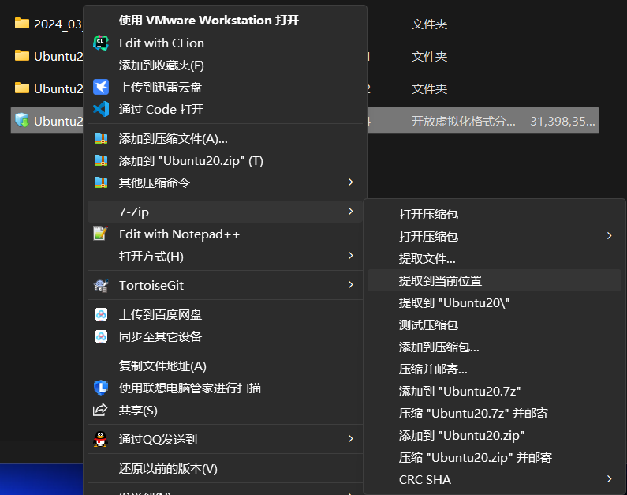

tips：7zip 解压缩时会报错：该文件末端错误，无需在意，只要解压缩进度条到达 100 % 即可，此时由于错误的存在 7

zip 并不会自动退出，需要我们手动点击关闭。


## 2、打开 virtualbox，点击新建：

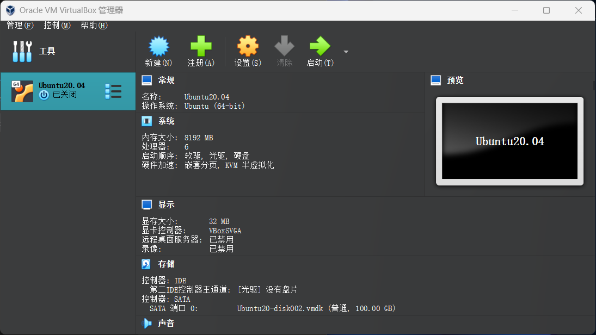


## 3、设置虚拟机的名称，并点击下一步：

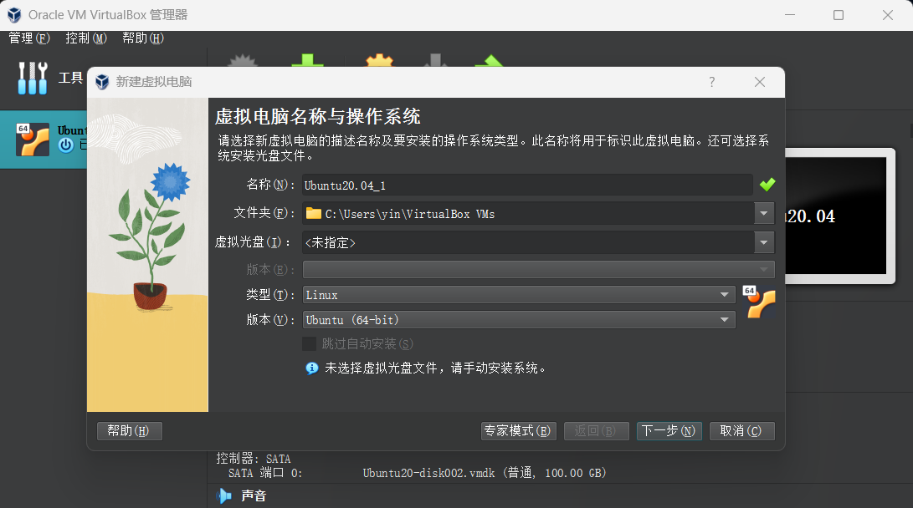


## 4、这里的硬件按个人所需设置：

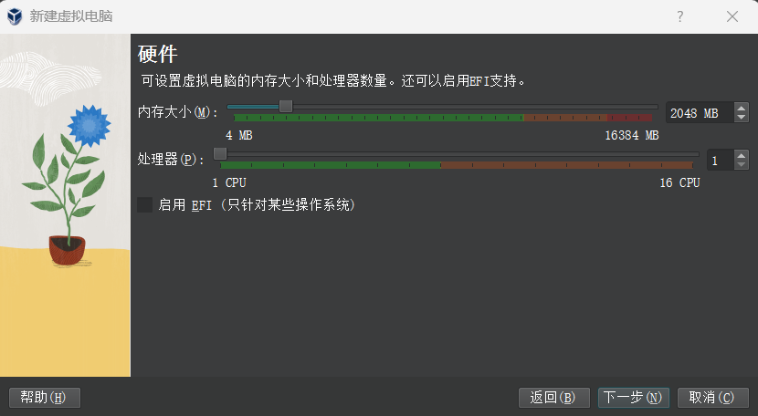


## 5、这里注意：选择“使用已有的虚拟硬盘文件”：

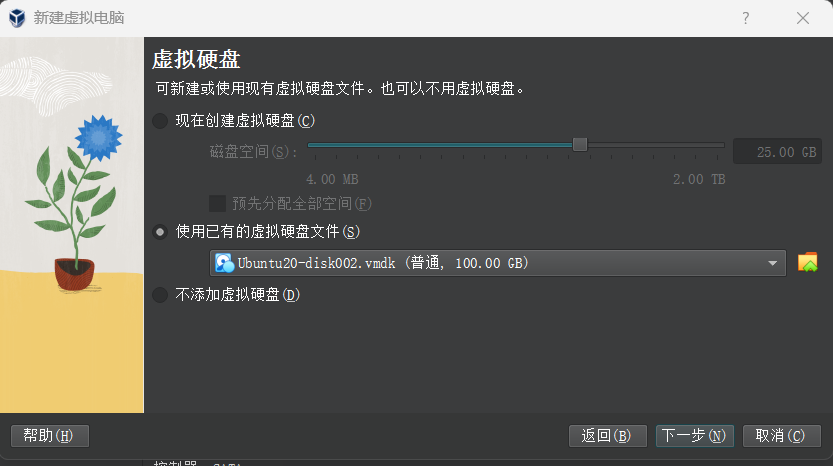


## 6、此时大家这里应该是啥也没有

我所显示的是自己之前创建的虚拟机，点击注册，进入刚才解压的 ova 文件的所在路径，选择 vmdk文件打开：

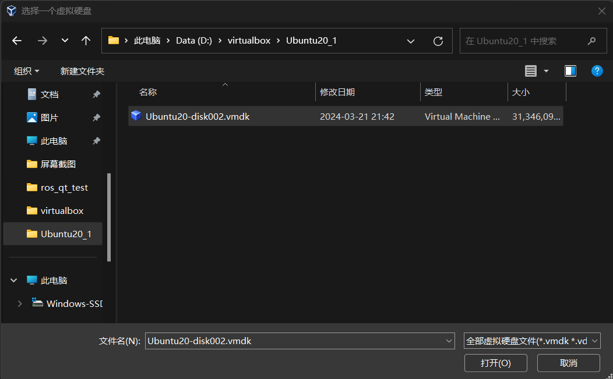


## 7、添加时，出现如下图所示问题：

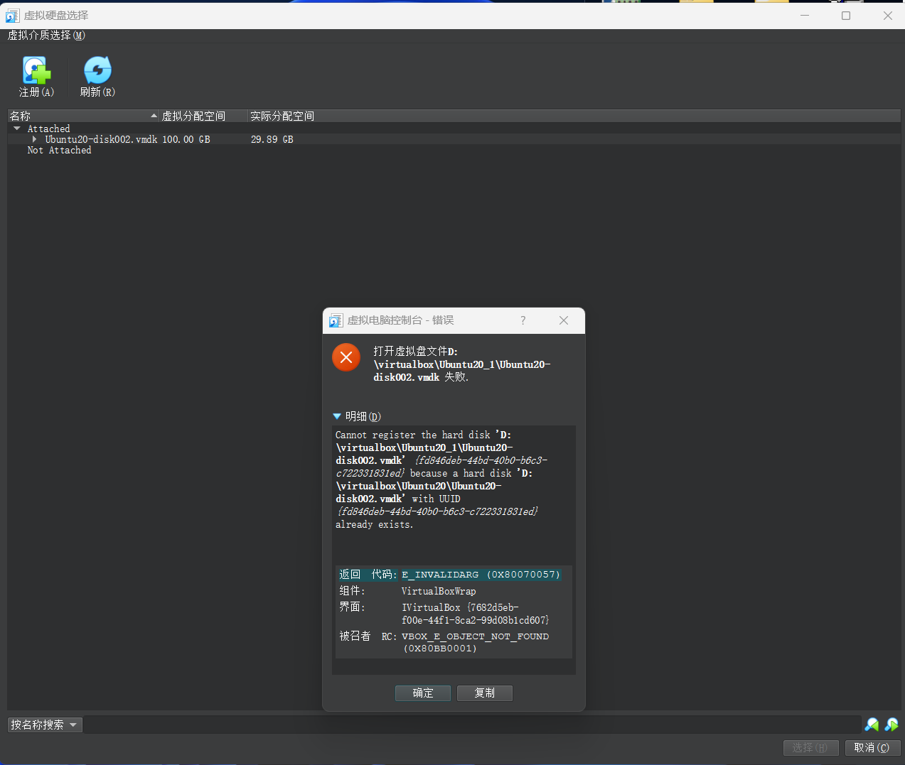

可能是你的虚拟介质出现问题：

参考这篇博客：[删除多余的虚拟介质](https://blog.csdn.net/qq_46078139/article/details/121350694)

并将多的不用的 ova 文件全部移除该盘！

博主也曾操作过，但是现在没有这个错误具体展示了。

解决后重新导入：Not Attached 便是新导入的，选择该介质；上方的 Attached 是我电脑上已有虚拟机的 虚拟介质，无需在意。

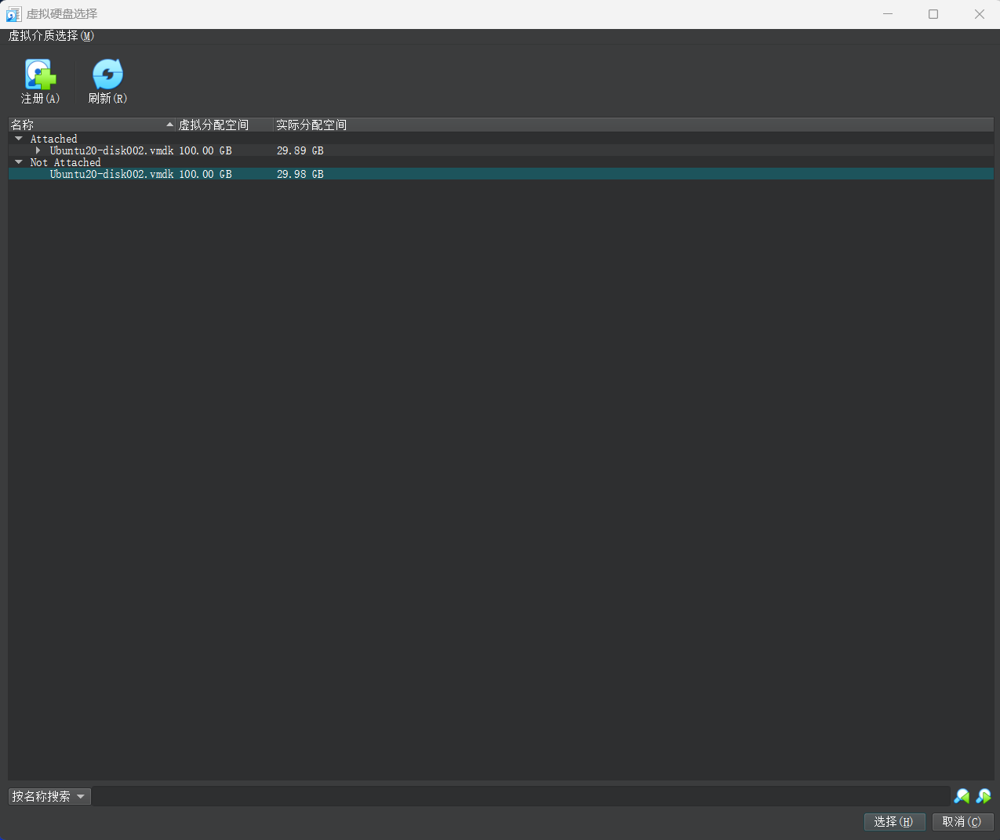


## 8、点击下一步，确认虚拟机的设置，没有问题选择完成！

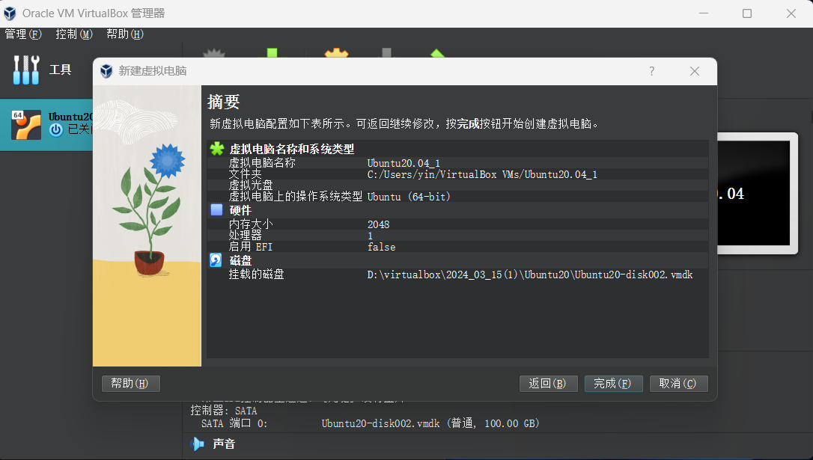


## 9、虚拟机导入成功，打开 Ubuntu20.04_1

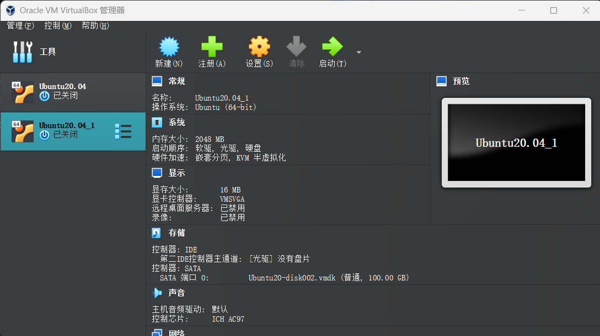


## 10、打开出现了个错误并直接进入黑屏，强制退出！

错误如下：

```
Failed to mount /mnt/Windows Share
Dependency failed for Local File Systems
```

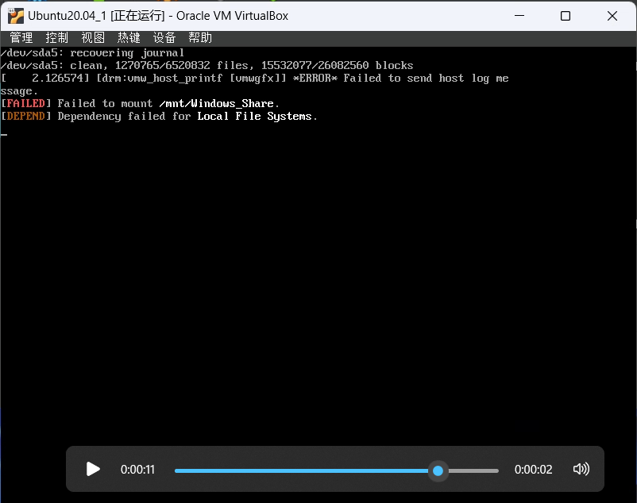

原因是之前这个虚拟机挂载过共享文件夹与 windows 进行文件传输，但博主好像把这个 windows下的文件夹删了，导致虚拟机找不到这个文件夹了，环境出现错误。

着手解决：

其实就是进入当初设置挂载的文件，把这个挂载点给注释了，也就是取消这个共享文件夹路径！

1. 强制退出虚拟机

2. 重启虚拟机，狂按 ESc

3. 进入如下界面，选择 Ubuntu 的高级选项

	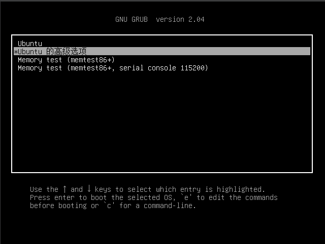

	

4. 选择

	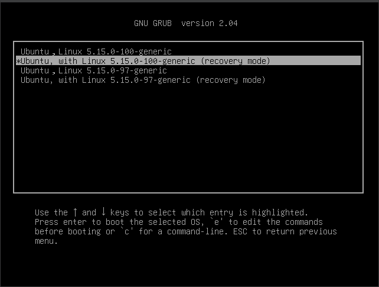

	

5. 进入如下界面，我这个乱码了，但可以通过上下键选择 network，选择“Yes”

	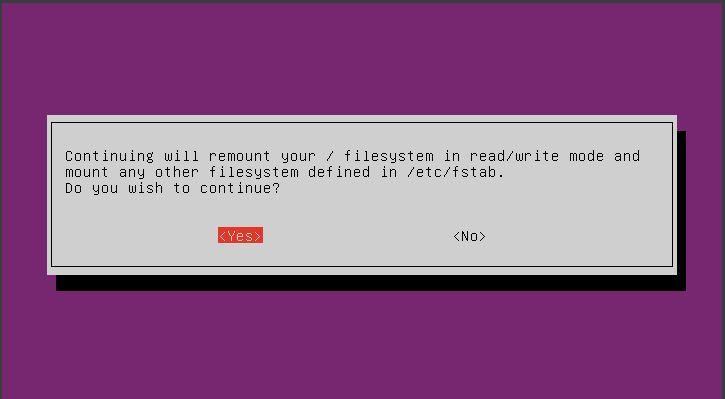

	

6. 选择root，并输入管理员密码：

	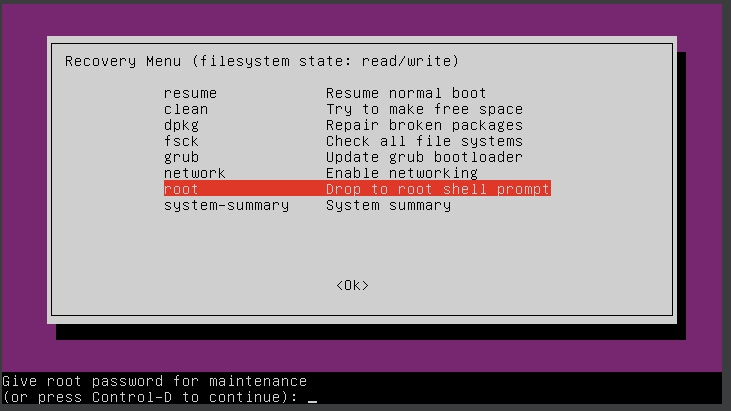

	

7. 输入

	```
	sudo vim /etc/fstab
	```

	

8. 注释掉你的共享文件夹挂载点

	编辑前要先点一下 i 键，表示插入文字，方能移动光标进行插入；在前面添加 # 号即可，我的是最后一行。

	注释完毕后，输入：`:wq`。（表示强制保存并退出）

	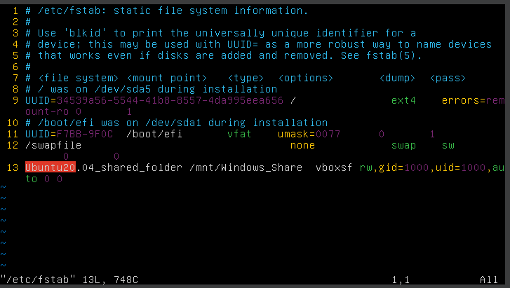

	

9. 命令行输入 reboot 重启


## 11、进入后还是黑屏，但是不报错误了

1. 强制退出该虚拟机

2. 选中该虚拟机，点击设置 $\rightarrow$ 显示  $\rightarrow$ 显卡控制器   $\rightarrow$ VBoxSVGA

	  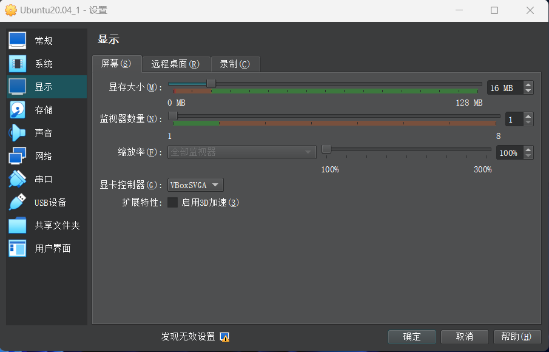

	

## 12、重启后，还是黑屏（并没有用，可跳过）

1.  ctrl + alt + F5

2. 输入账号（你的用户名，就是你虚拟机好的时候一开始进入是那个界面的名字），以及管理员密码

3. ........尝试了很多方法并没有用

	

## 13、网上找到的神方法！

[【最新】用VirtualBox安装Ubuntu，启动后黑屏的解决办法【更新时间2020年11月4日】](https://blog.csdn.net/qq_42438843/article/details/109487507)

1. 关闭虚拟机
2. 打开该虚拟机的设置 $\rightarrow$ 显示 $\rightarrow$ 屏幕  $\rightarrow$ 显存大小
3. 显存大小拉满

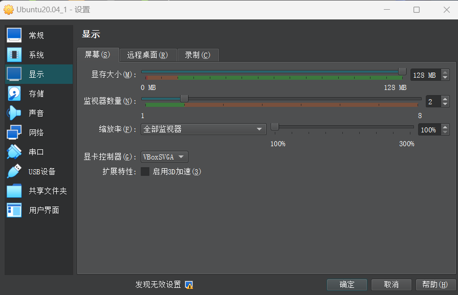

14、启动虚拟机

进入成功！！！！！！！！！！！！！！！！！！！！！！！！！！！！！！！！！

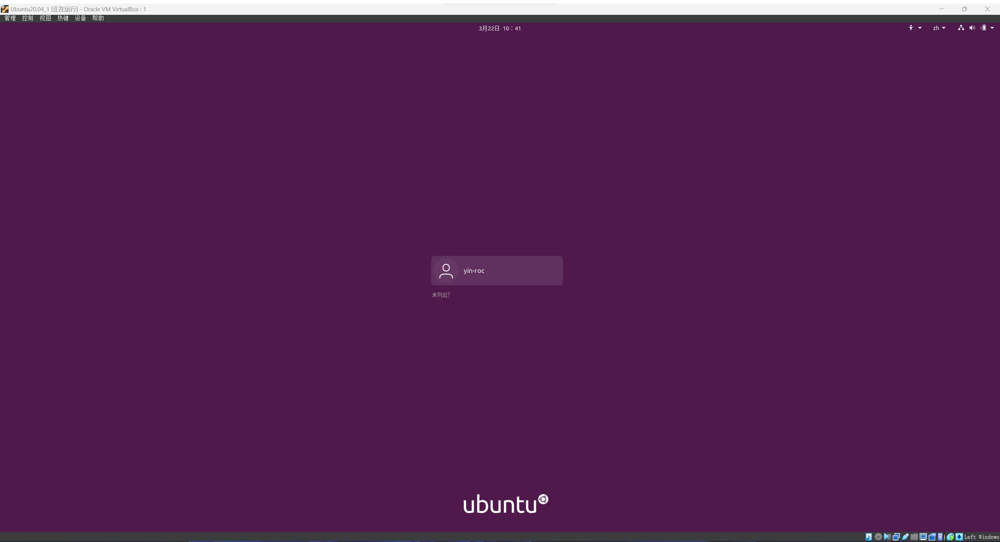


