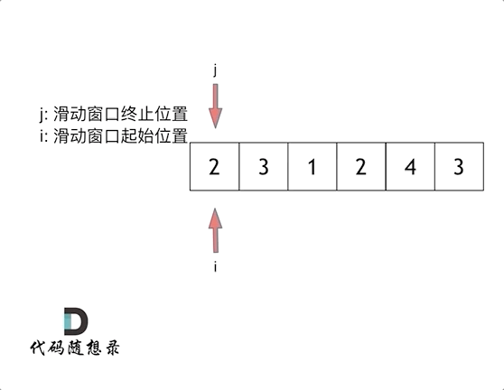

# 代码随想录

## 数组

### 1、二分查找	leetcode704

leetcode704：给定一个 n 个元素有序的（升序）整型数组 nums 和一个目标值 target  ，写一个函数搜索 nums 中的 target，如果目标值存在返回下标，否则返回 -1。

示例 1:

```text
输入: nums = [-1,0,3,5,9,12], target = 9     
输出: 4       
解释: 9 出现在 nums 中并且下标为 4     
```

示例 2:

```text
输入: nums = [-1,0,3,5,9,12], target = 2     
输出: -1        
解释: 2 不存在 nums 中因此返回 -1        
```

解析：

第一次使用了一个while循环，复杂度为O(N);

第二次：学习视频教程：利用二分法。

这里讲到了两种区间：左闭右闭和左闭右开两种不同的注意之处：

1. 左闭右闭

	区间的定义这就决定了二分法的代码应该如何写，因为定义 target 在 [left, right] 区间，所以有如下两点：

	- while (left <= right) 要使用 <= ，因为 left == right 是有意义的，所以使用 <=
	- if (nums[middle] > target) right 要赋值为 middle - 1，因为当前这个 nums[middle] 一定不是 target，那么接下来要查找的左区间结束下标位置就是 middle - 1

2. 左闭右开

	- while (left < right)，这里使用 < ,因为 left == right 在区间 [left, right) 是没有意义的
	- if (nums[middle] > target) right 更新为 middle，因为当前 nums[middle] 不等于 target，去左区间继续寻找，而寻找区间是左闭右开区间，所以right更新为 middle，即：下一个查询区间不会去比较 nums[middle]

tips：主要是看区间的值能不能取到！和值有没有比较过！！

```c++
class Solution {
public:
    int search(vector<int>& nums, int target) {
        int left = 0;
        int right = nums.size() - 1;
        int middle = 0;
        while(left <= right)
        {
            middle = (left + right) / 2;
            if(target < nums[middle])
                right = middle - 1;
            else if(target > nums[middle])
                left = middle + 1;
            else
                return middle;
        }
        return -1;
    }
};
```

### 2、移除元素	leetcode27

leetcode27：给你一个数组 `nums` 和一个值 `val`，你需要原地移除所有数值等于 `val` 的元素，并返回移除后数组的新长度。不要使用额外的数组空间，你必须仅使用 `O(1)` 额外空间并 原地修改输入数组。元素的顺序可以改变。你不需要考虑数组中超出新长度后面的元素。

==TIPS：数组的元素只能覆盖，不能删除==

**示例 1：**

```
输入：nums = [3,2,2,3], val = 3
输出：2, nums = [2,2]
解释：函数应该返回新的长度 2, 并且 nums 中的前两个元素均为 2。你不需要考虑数组中超出新长度后面的元素。例如，函数返回的新长度为 2 ，而 nums = [2,2,3,3] 或 nums = [2,2,0,0]，也会被视作正确答案。
```

**示例 2：**

```
输入：nums = [0,1,2,2,3,0,4,2], val = 2
输出：5, nums = [0,1,3,0,4]
解释：函数应该返回新的长度 5, 并且 nums 中的前五个元素为 0, 1, 3, 0, 4。注意这五个元素可为任意顺序。你不需要考虑数组中超出新长度后面的元素。
```

错误答案：

```c++
class Solution {
public:
    int removeElement(vector<int>& nums, int val) {
        // sort(nums.begin(), nums.end());
        int temp = 0;
        int length = nums.size();
        for(int i = 0; i < length; i++)
        {
            if(nums[i] == val)
            {
                length--;
                for(int j = 0; j < length; j++)
                {
                    // temp = nums[i];
                    nums[i] = nums[i+1];
                    // nums[i+1] = temp;
                }    
            }
        }
        return length;
    }
};
```

修改后：没有考虑到数组越界问题，以及删除一个数，指针应该向前挪一位。但复杂度是$O(N^2)$

```c++
class Solution {
public:
    int removeElement(vector<int>& nums, int val) {
        int length = nums.size();
        for(int i = 0; i < length; i++)
        {
            if(nums[i] == val)
            {
                for(int j = i + 1; j < length; j++)
                {
                    nums[j - 1] = nums[j];
                }    
                i--;
                length--;
            }
        }
        return length;
    }
};
```

最优解：双指针法（快慢指针法）复杂度$O(N)$

快指针：筛选出应该留在数组内正确的元素；

慢指针：更新数组的元素。

```c++
class Solution {
public:
    int removeElement(vector<int>& nums, int val) {
        int slowIndex = 0;
        for (int fastIndex = 0; fastIndex < nums.size(); fastIndex++) {
            if (val != nums[fastIndex]) {
                nums[slowIndex++] = nums[fastIndex];
            }
        }
        return slowIndex;
    }
};
```

### 3、有序数组的平方	leetcode977

leetcode977：给你一个按 非递减顺序 排序的整数数组 nums，返回 每个数字的平方 组成的新数组，要求也按 非递减顺序 排序。

示例 1：

- 输入：nums = [-4,-1,0,3,10]
- 输出：[0,1,9,16,100]
- 解释：平方后，数组变为 [16,1,0,9,100]，排序后，数组变为 [0,1,9,16,100]

示例 2：

- 输入：nums = [-7,-3,2,3,11]
- 输出：[4,9,9,49,121]

自身答案：复杂度$O(N^2)$

```c++
class Solution {
public:
    vector<int> sortedSquares(vector<int>& nums) {
        int size = nums.size();
        for(int i = 0; i < size; i++)
        {
            nums[i] = nums[i] * nums[i];
        }
        for(int j = 0; j < size; j++)
        {
            for(int m = j+1; m < size; m++)
            {
                if(nums[j] > nums[m])
                {
                    int temp = 0;
                    temp = nums[j];
                    nums[j] = nums[m];
                    nums[m] = temp;
                }          
            }
        }
        return nums;
    }
};
```

代码随想录答案1：暴力排序（借助了 sort 函数）；时间复杂度$O(nlogn)$

```c++
class Solution {
public:
    vector<int> sortedSquares(vector<int>& A) {
        for (int i = 0; i < A.size(); i++) {
            A[i] *= A[i];
        }
        sort(A.begin(), A.end()); // 快速排序
        return A;
    }
};
```

代码随想录答案2：双指针法；复杂度为$O(logN)$

如动画所示：


```c++
class Solution {
public:
    vector<int> sortedSquares(vector<int>& A) {
        int k = A.size() - 1;
        vector<int> result(A.size(), 0);
        for (int i = 0, j = A.size() - 1; i <= j;) { // 注意这里要i <= j，因为最后要处理两个元素
            if (A[i] * A[i] < A[j] * A[j])  {
                result[k--] = A[j] * A[j];
                j--;
            }
            else {
                result[k--] = A[i] * A[i];
                i++;
            }
        }
        return result;
    }
};
```

==Tips:==

在C++中，你不能在循环的初始化部分同时定义两个变量，如下面的代码所示：

```c++
for(int k = 0, int m = length; k <= m; )
```

应该将定义分开写，如下所示：

```c++
for(int k = 0, m = length; k <= m; )
```

或者在循环外部分别定义它们，然后再在循环中初始化：

```c++
int k = 0;
int m = length;
for(; k <= m; )
```


### 4、长度最小的子数组	leetcode 209

leetcode 209：给定一个含有 `n` 个正整数的数组和一个正整数 `target` 。找出该数组中满足其总和大于等于 `target` 的长度最小的 **连续子数组** `[numsl, numsl+1, ..., numsr-1, numsr]` ，并返回其长度。如果不存在符合条件的子数组，返回 `0` 。

**示例 1：**

```
输入：target = 7, nums = [2,3,1,2,4,3]
输出：2
解释：子数组 [4,3] 是该条件下的长度最小的子数组。
```

**示例 2：**

```
输入：target = 4, nums = [1,4,4]
输出：1
```

**示例 3：**

```
输入：target = 11, nums = [1,1,1,1,1,1,1,1]
输出：0
```

自身答案：两个 for 循环；复杂度为 $O(N^2)$ ；但力扣提交超出了时间限制。

```c++
class Solution {
public:
    int minSubArrayLen(int target, vector<int>& nums) {
        int i;
        int size = nums.size();
        int length = size + 1;

        for(i = 0; i < size; i++)
        {
            int sum = 0;
            int times = 0;
            for(int j = i; j < size; j++)
            {
                sum += nums[j];
                times++;
                if(sum >= target)
                {
                    if(length > times)
                    {
                        length = times;
                    }
                    break;
                }
            }
        }
        if(length == (size + 1))
            return 0;
        else
            return length;
    }
};
```


最优解：滑动窗口法

所谓滑动窗口，**就是不断的调节子序列的起始位置和终止位置，从而得出我们要想的结果**。

在暴力解法中，是一个for循环滑动窗口的起始位置，一个for循环为滑动窗口的终止位置，用两个for循环 完成了一个不断搜索区间的过程。

那么滑动窗口如何用一个for循环来完成这个操作呢。

首先要思考 如果用一个for循环，那么应该表示 滑动窗口的起始位置，还是终止位置。

如果只用一个for循环来表示 滑动窗口的起始位置，那么如何遍历剩下的终止位置？

此时难免再次陷入 暴力解法的怪圈。

所以 只用一个for循环，那么这个循环的索引，一定是表示 滑动窗口的终止位置。

那么问题来了， 滑动窗口的起始位置如何移动呢？

这里还是以题目中的示例来举例，s=7， 数组是 2，3，1，2，4，3，来看一下查找的过程：



最后找到 4，3 是最短距离。

其实从动画中可以发现滑动窗口也可以理解为双指针法的一种！只不过这种解法更像是一个窗口的移动，所以叫做滑动窗口更适合一些。

在本题中实现滑动窗口，主要确定如下三点：

- 窗口内是什么？
- 如何移动窗口的起始位置？
- 如何移动窗口的结束位置？

窗口就是 满足其和 ≥ s 的长度最小的 连续 子数组。

窗口的起始位置如何移动：如果当前窗口的值大于s了，窗口就要向前移动了（也就是该缩小了）。

窗口的结束位置如何移动：窗口的结束位置就是遍历数组的指针，也就是for循环里的索引。

解题的关键在于 窗口的起始位置如何移动，如图所示：


可以发现**滑动窗口的精妙之处在于根据当前子序列和大小的情况，不断调节子序列的起始位置。从而将O(n^2)暴力解法降为O(n)。**

```c++
class Solution {
public:
    int minSubArrayLen(int s, vector<int>& nums) {
        int result = INT32_MAX;
        int sum = 0; // 滑动窗口数值之和
        int i = 0; // 滑动窗口起始位置
        int subLength = 0; // 滑动窗口的长度
        for (int j = 0; j < nums.size(); j++) {
            sum += nums[j];
            // 注意这里使用while，每次更新 i（起始位置），并不断比较子序列是否符合条件
            while (sum >= s) {
                subLength = (j - i + 1); // 取子序列的长度
                result = result < subLength ? result : subLength;
                sum -= nums[i++]; // 这里体现出滑动窗口的精髓之处，不断变更i（子序列的起始位置）
            }
        }
        // 如果result没有被赋值的话，就返回0，说明没有符合条件的子序列
        return result == INT32_MAX ? 0 : result;
    }
};
```


### 5、螺旋矩阵 leetcode 59

给定一个正整数 n，生成一个包含 1 到 n^2 所有元素，且元素按顺时针顺序螺旋排列的正方形矩阵。

示例:

输入: 3 

输出: [ [ 1, 2, 3 ], [ 8, 9, 4 ], [ 7, 6, 5 ] ]


题解：完全没有思路

思路：一圈一圈的算，每一圈不算最后一个节点，这样每条边的长度都一样

```c++
class Solution {
public:
    vector<vector<int>> generateMatrix(int n) {
        vector<vector<int>> arr(n, vector<int>(n, 0));
        int start_x = 0;
        int start_y = 0;
        int offset = 1;
        int count = 1;
        int m = 0;
        int l = 0;
        int i = 0;
        int j = 0;
        int loop = n/2;
        while(loop--)
        {
            for(i = start_x, j = start_y; j < n - offset; j++)
                arr[i][j] = count++;
            for( ; i < n - offset; i++)
                arr[i][j] = count++;
            for( ; j > start_x; j--)
                arr[i][j] = count++;
            for( ; i > start_y; i--)
                arr[i][j] = count++;
            start_x++;
            start_y++;
            offset++;
        }

        if(n % 2 == 1)
        {
            arr[n/2][n/2] = count++;
        }

        return arr;
    };
};
```


## 链表

### 1、移除链表元素 leetcode 203

给你一个链表的头节点 `head` 和一个整数 `val` ，请你删除链表中所有满足 `Node.val == val` 的节点，并返回 **新的头节点** 。

 

**示例 1：**


```
输入：head = [1,2,6,3,4,5,6], val = 6
输出：[1,2,3,4,5]
```

解法1：单链表

```c++
/**
 * Definition for singly-linked list.
 * struct ListNode {
 *     int val;
 *     ListNode *next;
 *     ListNode() : val(0), next(nullptr) {}
 *     ListNode(int x) : val(x), next(nullptr) {}
 *     ListNode(int x, ListNode *next) : val(x), next(next) {}
 * };
 */
class Solution {
public:
    ListNode* removeElements(ListNode* head, int val) {
        while(head != NULL && head->val == val)
        {
            head = head->next;
        }

        ListNode* cur = head;
        while(cur != nullptr && cur->next != nullptr)
        {
            if(cur->next->val != val)
            {
                cur = cur->next;
            }
            else
            {
                cur->next = cur->next->next;
            }
        }
        return head;

    }
};
```


解法二：虚拟头节点

```c++
class Solution {
public:
    ListNode* removeElements(ListNode* head, int val) {
        ListNode* dummyHead = new ListNode(0); // 设置一个虚拟头结点
        dummyHead->next = head; // 将虚拟头结点指向head，这样方便后面做删除操作
        ListNode* cur = dummyHead;
        while (cur->next != NULL) {
            if(cur->next->val == val) {
                ListNode* tmp = cur->next;
                cur->next = cur->next->next;
                delete tmp;
            } else {
                cur = cur->next;
            }
        }
        head = dummyHead->next;
        delete dummyHead;
        return head;
    }
};
```


### 2、设计链表 leetcode 707

你可以选择使用单链表或者双链表，设计并实现自己的链表。

单链表中的节点应该具备两个属性：`val` 和 `next` 。`val` 是当前节点的值，`next` 是指向下一个节点的指针/引用。

如果是双向链表，则还需要属性 `prev` 以指示链表中的上一个节点。假设链表中的所有节点下标从 **0** 开始。

实现 `MyLinkedList` 类：

- `MyLinkedList()` 初始化 `MyLinkedList` 对象。
- `int get(int index)` 获取链表中下标为 `index` 的节点的值。如果下标无效，则返回 `-1` 。
- `void addAtHead(int val)` 将一个值为 `val` 的节点插入到链表中第一个元素之前。在插入完成后，新节点会成为链表的第一个节点。
- `void addAtTail(int val)` 将一个值为 `val` 的节点追加到链表中作为链表的最后一个元素。
- `void addAtIndex(int index, int val)` 将一个值为 `val` 的节点插入到链表中下标为 `index` 的节点之前。如果 `index` 等于链表的长度，那么该节点会被追加到链表的末尾。如果 `index` 比长度更大，该节点将 **不会插入** 到链表中。
- `void deleteAtIndex(int index)` 如果下标有效，则删除链表中下标为 `index` 的节点。


```c++
class MyLinkedList {
public:
struct ListNode{
    int val;
    ListNode* next;
    ListNode(int val) : val(val), next(nullptr){}
};
    MyLinkedList() {
        dummy_head = new ListNode(0);
        size = 0;
    }
    
    int get(int index) {
        if(index < 0 || index > (size - 1))
            return -1;
        ListNode* cur = dummy_head->next;

        while(index--)
        {
            cur = cur->next;
            
        }
        return cur->val;
    }
    
    void addAtHead(int val) {
        ListNode* cur = dummy_head->next;
        ListNode* newnode = new ListNode(val);
        newnode->next = cur;
        dummy_head->next = newnode;
        size++;
    }
    
    void addAtTail(int val) {
        ListNode* cur = dummy_head; // dummy_head->next
        ListNode* newnode = new ListNode(val);
        while(cur->next != nullptr)
        {
            cur = cur->next;
        }
        cur->next = newnode;
        size++;
    }
    
    void addAtIndex(int index, int val) {
        ListNode* cur = dummy_head; // dummy_head->next
        ListNode* newnode = new ListNode(val);
        if(index > size) return;
        if(index < 0) index = 0;
        
            while(index--)
            {
                cur = cur->next;
            }
            newnode->next = cur->next;
            cur->next = newnode;
            size++;        
    }
    
    void deleteAtIndex(int index) {
        ListNode* cur = dummy_head; // dummy_head->next
        if (index >= size || index < 0) {
            return;
        }
        
            while(index--)
            {
                cur = cur->next;
            }
            ListNode* tmp = cur->next;
            cur->next = cur->next->next; 
            delete tmp;
            tmp = nullptr;
            size--;
        
    }        
    
private:
    int size;
    ListNode* dummy_head;
};
```


### 3、翻转链表 leetcode206

给你单链表的头节点 `head` ，请你反转链表，并返回反转后的链表。

 

**示例 1：**


```
输入：head = [1,2,3,4,5]
输出：[5,4,3,2,1]
```

**示例 2：**


```
输入：head = [1,2]
输出：[2,1]
```

**示例 3：**

```
输入：head = []
输出：[]
```

自解：

```c++
/**
 * Definition for singly-linked list.
 * struct ListNode {
 *     int val;
 *     ListNode *next;
 *     ListNode() : val(0), next(nullptr) {}
 *     ListNode(int x) : val(x), next(nullptr) {}
 *     ListNode(int x, ListNode *next) : val(x), next(next) {}
 * };
 */
class Solution {
public:
    ListNode* reverseList(ListNode* head) {
        ListNode* dummy_head = new ListNode(0);
        ListNode* cur = head;
        ListNode* tmp1;
        ListNode* tmp2 = dummy_head;
        ListNode* tmp3 = new ListNode(0);
        if(cur == nullptr)
            return head;
        

        while(cur != nullptr && cur->next != nullptr)
        {
            tmp1 = cur->next;
            tmp3 = cur;
            cur->next = tmp2;
            tmp2 = tmp3;
            cur = tmp1;
        }
        cur->next = tmp3;
        head->next = nullptr;
        head = cur;
    return head;c
        
    }
};
```

题解1：双指针法

```cpp
class Solution {
public:
    ListNode* reverseList(ListNode* head) {
        ListNode* temp; // 保存cur的下一个节点
        ListNode* cur = head;
        ListNode* pre = NULL;
        while(cur) {
            temp = cur->next;  // 保存一下 cur的下一个节点，因为接下来要改变cur->next
            cur->next = pre; // 翻转操作
            // 更新pre 和 cur指针
            pre = cur;
            cur = temp;
        }
        return pre;
    }
};
```

题解2：递归法

```c++
class Solution {
public:
    ListNode* reverse(ListNode* pre,ListNode* cur){
        if(cur == NULL) return pre;
        ListNode* temp = cur->next;
        cur->next = pre;
        // 可以和双指针法的代码进行对比，如下递归的写法，其实就是做了这两步
        // pre = cur;
        // cur = temp;
        return reverse(cur,temp);
    }
    ListNode* reverseList(ListNode* head) {
        // 和双指针法初始化是一样的逻辑
        // ListNode* cur = head;
        // ListNode* pre = NULL;
        return reverse(NULL, head);
    }

};
```


### 4、两两交换链表中的节点 leetcode24

- 两两交换链表中的节点

	[力扣题目链接(opens new window)](https://leetcode.cn/problems/swap-nodes-in-pairs/)

	给定一个链表，两两交换其中相邻的节点，并返回交换后的链表。

	你不能只是单纯的改变节点内部的值，而是需要实际的进行节点交换。

	


自解：思路基本一致，但变量设置太多，参考题解的虚拟头节点用法

```c++
/**
 * Definition for singly-linked list.
 * struct ListNode {
 *     int val;
 *     ListNode *next;
 *     ListNode() : val(0), next(nullptr) {}
 *     ListNode(int x) : val(x), next(nullptr) {}
 *     ListNode(int x, ListNode *next) : val(x), next(next) {}
 * };
 */
class Solution {
public:
    ListNode* swapPairs(ListNode* head) {
        ListNode* cur = head;
        ListNode* temp = new ListNode(0);
        ListNode* pre = new ListNode(0);
        ListNode* mod = new ListNode(0);
        ListNode* reverse = head;

        int count = 1;
        if(head == nullptr || head->next == nullptr)
            return head;
        
      
        reverse = head->next;

        while(cur != nullptr){
            if(count % 2 == 0){
                temp = cur->next;
                pre->next = temp;
                cur->next = pre;
                mod->next = cur;
                cur = temp;
                mod = pre;
            }
            else{
                pre =cur;
                cur = cur->next;
            }
            count++;
        }
        return reverse;
    }
};
```

题解：

```c++
class Solution {
public:
    ListNode* swapPairs(ListNode* head) {
        ListNode* dummyHead = new ListNode(0); // 设置一个虚拟头结点
        dummyHead->next = head; // 将虚拟头结点指向head，这样方便后面做删除操作
        ListNode* cur = dummyHead;
        while(cur->next != nullptr && cur->next->next != nullptr) {
            ListNode* tmp = cur->next; // 记录临时节点
            ListNode* tmp1 = cur->next->next->next; // 记录临时节点

            cur->next = cur->next->next;    // 步骤一
            cur->next->next = tmp;          // 步骤二
            cur->next->next->next = tmp1;   // 步骤三

            cur = cur->next->next; // cur移动两位，准备下一轮交换
        }
        return dummyHead->next;
    }
};
```


### 5、删除链表的倒数第N个节点 leetcode19

给你一个链表，删除链表的倒数第 `n` 个结点，并且返回链表的头结点。

 

**示例 1：**


```
输入：head = [1,2,3,4,5], n = 2
输出：[1,2,3,5]
```

**示例 2：**

```
输入：head = [1], n = 1
输出：[]
```

**示例 3：**

```
输入：head = [1,2], n = 1
输出：[1]
```

 

**提示：**

- 链表中结点的数目为 `sz`
- `1 <= sz <= 30`
- `0 <= Node.val <= 100`
- `1 <= n <= sz`

自解：

```c++
/**
 * Definition for singly-linked list.
 * struct ListNode {
 *     int val;
 *     ListNode *next;
 *     ListNode() : val(0), next(nullptr) {}
 *     ListNode(int x) : val(x), next(nullptr) {}
 *     ListNode(int x, ListNode *next) : val(x), next(next) {}
 * };
 */
class Solution {
private:
    int sz = 0;    
public:
    ListNode* removeNthFromEnd(ListNode* head, int n) {
        ListNode* dummy_head = new ListNode(0);
        dummy_head->next = head;
        ListNode* cur = dummy_head;
        ListNode* pre = dummy_head;
        while(cur->next != nullptr)
        {
            cur = cur->next;
            sz++;
        }
        cur = dummy_head;

        int count = sz - n + 1;
        if(n < 1 || n > sz){
            return head;
        }
        while(count){
            pre = cur;
            cur = cur->next;
            count--;
        }
        pre->next = cur->next;
        delete cur;
        return dummy_head->next;
    }

};
```

题解：

```c++
class Solution {
public:
    ListNode* removeNthFromEnd(ListNode* head, int n) {
        ListNode* dummyHead = new ListNode(0);
        dummyHead->next = head;
        ListNode* slow = dummyHead;
        ListNode* fast = dummyHead;
        while(n-- && fast != NULL) {
            fast = fast->next;
        }
        fast = fast->next; // fast再提前走一步，因为需要让slow指向删除节点的上一个节点
        while (fast != NULL) {
            fast = fast->next;
            slow = slow->next;
        }
        slow->next = slow->next->next; 
        
        // ListNode *tmp = slow->next;  C++释放内存的逻辑
        // slow->next = tmp->next;
        // delete nth;
        
        return dummyHead->next;
    }
};
```


## 哈希表

### 容器相关知识

C++标准库中的容器类（如vector、map、set等）提供了一组公有的方法（也称为成员函数），用于对容器中的元素进行访问、插入、删除、查找等操作。以下是其中一些常见的公有方法：

1. **构造和析构：**

	- 构造函数：用于创建容器对象。
	- 析构函数：用于销毁容器对象，释放内存。

2. **访问元素：**

	- `operator[]`：访问指定位置的元素。
	- `at()`：访问指定位置的元素，提供边界检查。
	- `front()`：返回第一个元素。
	- `back()`：返回最后一个元素。

3. **迭代器相关：**

	- `begin()`：返回指向第一个元素的迭代器。
	- `end()`：返回指向最后一个元素的下一个位置的迭代器。
	- `rbegin()`：返回指向最后一个元素的逆向迭代器。
	- `rend()`：返回指向第一个元素的前一个位置的逆向迭代器。

4. **修改容器：**

	- `insert()`：在指定位置插入元素。

		无序容器，随机插入；

		有序容器，插入后自动按大小排序；

		序列容器可指定插入位置。

	- `erase()`：删除指定位置或者范围内的元素。

	- `push_back()`：在末尾添加元素。

	- `pop_back()`：移除末尾元素。

	- `clear()`：清空容器中的所有元素。

5. **容器大小和容量：**

	- `size()`：返回容器中元素的个数。
	- `empty()`：判断容器是否为空。
	- `capacity()`：返回容器能够容纳的元素的个数（对于动态增长的容器有效）。

6. **查找元素：**

	- `find()`：在容器中查找指定元素，返回指向该元素的迭代器；若未查找到，返回末尾迭代器。
	- `count()`：计算容器中等于指定元素的个数。
	- `lower_bound()`：返回一个迭代器，指向第一个大于或等于给定值的元素。
	- `upper_bound()`：返回一个迭代器，指向第一个大于给定值的元素。

### 常见的三种哈希结构

当我们想使用哈希法来解决问题的时候，我们一般会选择如下三种数据结构。

- 数组
- set （集合）
- map(映射)

这里数组就没啥可说的了，我们来看一下set。

在C++中，set 和 map 分别提供以下三种数据结构，其底层实现以及优劣如下表所示：

| 集合               | 底层实现 | 是否有序 | 数值是否可以重复 | 能否更改数值 | 查询效率 | 增删效率 |
| ------------------ | -------- | -------- | ---------------- | ------------ | -------- | -------- |
| std::set           | 红黑树   | 有序     | 否               | 否           | O(log n) | O(log n) |
| std::multiset      | 红黑树   | 有序     | 是               | 否           | O(logn)  | O(logn)  |
| std::unordered_set | 哈希表   | 无序     | 否               | 否           | O(1)     | O(1)     |

std::unordered_set底层实现为==哈希表==，std::set 和std::multiset 的底层实现是红黑树，红黑树是一种平衡二叉搜索树，所以key值是有序的，但key不可以修改，改动key值会导致整棵树的错乱，所以只能删除和增加。

| 映射               | 底层实现 | 是否有序 | 数值是否可以重复 | 能否更改数值 | 查询效率 | 增删效率 |
| ------------------ | -------- | -------- | ---------------- | ------------ | -------- | -------- |
| std::map           | 红黑树   | key有序  | key不可重复      | key不可修改  | O(logn)  | O(logn)  |
| std::multimap      | 红黑树   | key有序  | key可重复        | key不可修改  | O(log n) | O(log n) |
| std::unordered_map | 哈希表   | key无序  | key不可重复      | key不可修改  | O(1)     | O(1)     |

std::unordered_map 底层实现为哈希表，std::map 和std::multimap 的底层实现是红黑树。同理，std::map 和std::multimap 的key也是有序的（这个问题也经常作为面试题，考察对语言容器底层的理解）。

当我们要==使用集合来解决哈希问题的时候，优先使用unordered_set，因为它的查询和增删效率是最优的==，如果需要集合是有序的，那么就用set，如果==要求不仅有序还要有重复数据的话，那么就用multiset==。

那么再来看一下map ，在map 是一个key value 的数据结构，map中，对key是有限制，对value没有限制的，因为key的存储方式使用红黑树实现的。

其他语言例如：java里的HashMap ，TreeMap 都是一样的原理。可以灵活贯通。

虽然std::set、std::multiset 的底层实现是红黑树，不是哈希表，std::set、std::multiset 使用红黑树来索引和存储，不过给我们的使用方式，还是哈希法的使用方式，即key和value。所以使用这些数据结构来解决映射问题的方法，我们依然称之为哈希法。 map也是一样的道理。

这里在说一下，一些C++的经典书籍上 例如STL源码剖析，说到了hash_set hash_map，这个与unordered_set，unordered_map又有什么关系呢？

实际上功能都是一样一样的， 但是unordered_set在C++11的时候被引入标准库了，而hash_set并没有，所以建议还是使用unordered_set比较好，这就好比一个是官方认证的，hash_set，hash_map 是C++11标准之前民间高手自发造的轮子。


### 总结

总结一下，**当我们遇到了要快速判断一个元素是否出现集合里的时候，就要考虑哈希法**。

但是哈希法也是**牺牲了空间换取了时间**，因为我们要使用额外的数组，set或者是map来存放数据，才能实现快速的查找。


1、适合给定一个元素，判断这个元素有没有在这个集合里面出现过。

2、哈希表有三种实现方式：数组、set 和 map

1. 元素太多不用数组实现；
2. 元素分布比较分散，比如：0、5、100万，考虑使用 set 实现

3、常用 unorder_set 解决问题，主要使用 find() 和 insert() 函数查找有无该元素（返回迭代器是否处于尾部）和插入元素

4、find() 函数

4、容器 vector 的赋值操作：在 C++ 中，`vector` 的构造函数可以接受两个迭代器，这种构造方式会==将指定范围内的元素复制到新的 `vector` 中==。具体地说，构造函数会复制从第一个迭代器指向的元素开始，到第二个迭代器指向的元素（不包括第二个迭代器指向的元素）结束的所有元素。

5、键值对的 key 不一定是数组下标，还可以是数组元素。具体情况分析，要确定查找的是什么。

6、需要使用 ==key value ==结构来存放，key来存元素，value来存下标，那么使用 ==map== 正合适。


