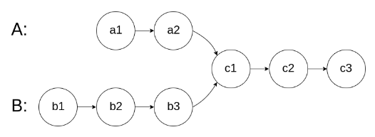

## C++ 一些函数的使用

### 1、sort 函数

```
sort(nums.begin(), nums.end());
```


### 2、string 类型的 resize 函数：扩充原有字符串的长度

```
void resize(size_type n)：将字符串的大小调整为 n，如果 n 比原来的大小小，则字符串被截断；如果n比原来的大小大，则在末尾填充足够数量的默认初始化字符（对于std::string，是'\0'）。

void resize(size_type n, char c)：将字符串的大小调整为n，如果n比原来的大小小，则字符串被截断；如果n比原来的大小大，则在末尾填充足够数量的字符c。
```


### 3、reverse函数

`reverse()` 函数用于反转指定范围内的元素。它接受两个迭代器参数，指定了要反转的范围。

```
#include <algorithm>

template< class BidirectionalIterator >
void reverse( BidirectionalIterator first, BidirectionalIterator last );
```

- `first`：表示要反转的范围的起始位置的迭代器。
- `last`：表示要反转的范围的结束位置的迭代器（不包含在范围内）。

函数会反转 `[first, last)` 范围内的元素，即从 `first` 到 `last - 1` 之间的元素顺序会被反转。


### 4、erase函数

==erase 的 复杂度为 O(n)==

std::string类提供了多个重载版本的erase函数，用于删除字符串中的字符或子串，返回删除后的字符串。

以下是erase函数的常用格式：

4.1	删除单个字符：

```
string& erase (size_t pos, size_t len = 1);
```

pos：要删除的字符的位置索引。
		len：要删除的字符的数量，默认为1。


4.2	删除子串：

```
string& erase (size_t pos = 0, size_t len = npos);
```

pos：要删除的子串的起始位置索引。
		len：要删除的子串的长度，默认为npos，表示删除从起始位置到末尾的所有字符。


### 5、vector

vector<int> result(A.size(), 0);		result 是一个大小与 `A` 相同的 `vector`，并且所有元素的初始值都是 `0

vector<int> result(A.size());		参数 `A.size()` 表示要创建的 `vector` 的大小。这种情况下，`vector` 的元素没有被显式初始化，它们的值是未定义的	


### 6、push_back() 和 pop_back()

`push_back` 是一个用于向容器末尾添加元素的操作。当你想要向容器中添加一个新的元素时，可以使用 `push_back` 方法将该元素插入到容器的末尾：

```
std::vector<int> vec;
vec.push_back(10); // 向向量末尾添加元素 10
```

`pop_back` 是用于从容器末尾移除元素的操作。当你需要移除容器中最后一个元素时，可以使用 `pop_back` 方法：

```
std::vector<int> vec = {1, 2, 3, 4};
vec.pop_back(); // 移除向量末尾的元素 4
```


## 数组

### 题1：二分查找

二分查找的思想比较简单，但主要在于边界条件的确定：

如果选择左闭右闭区间，那么条件判定 left <= right 是有意义的，根据 mid （（left+right）/2）进行判断时，同样 right 要更新为 mid - 1，因为是右闭区间；

如果选择左闭右开区间，那么条件判定 left < right 是有意义的，根据 mid （（left+right）/2）进行判断时， right 要更新为 mid ，因为是右开区间；

思考：本题采用了双指针法，为一头一尾，通过条件判定来修改位置，使得复杂度变为 O(logN)


### 题2：移除元素

[27.移除元素](https://leetcode.cn/problems/remove-element/)

给你一个数组 nums 和一个值 val，你需要 原地 移除所有数值等于 val 的元素，并返回移除后数组的新长度。

不要使用额外的数组空间，你必须仅使用 O(1) 额外空间并**原地**修改输入数组。

元素的顺序可以改变。你不需要考虑数组中超出新长度后面的元素。

示例 1: 给定 nums = [3,2,2,3], val = 3, 函数应该返回新的长度 2, 并且 nums 中的前两个元素均为 2。 你不需要考虑数组中超出新长度后面的元素。

示例 2: 给定 nums = [0,1,2,2,3,0,4,2], val = 2, 函数应该返回新的长度 5, 并且 nums 中的前五个元素为 0, 1, 3, 0, 4。


思考：本题也是采用了双指针法，但此处的双指针法初始位置为一起，通过快慢指针来筛选出不合格的元素。


### 题4：209.长度最小的子数组

[209.长度最小的子数组](https://leetcode.cn/problems/minimum-size-subarray-sum/)

给定一个含有 n 个正整数的数组和一个正整数 s ，找出该数组中满足其和 ≥ s 的长度最小的 连续 子数组，并返回其长度。如果不存在符合条件的子数组，返回 0。

示例：

- 输入：s = 7, nums = [2,3,1,2,4,3]
- 输出：2
- 解释：子数组 [4,3] 是该条件下的长度最小的子数组。

提示：

- 1 <= target <= 10^9
- 1 <= nums.length <= 10^5
- 1 <= nums[i] <= 10^5


思考：使用滑动窗法，首先双指针这个应用没有想到。

其次：

本人代码如下，问题在于剪枝处理不够彻底，每次都让 j 等于 i，但是仔细推到发现，滑动窗口已经把 j 从 i 开始的情况考虑进去了，所以本人代码重复了一些情况；其次 应该是 sum 大于等于 target，考虑到都是正整数，进入循环之后再进行判断，必定要 - 1，所以觉得 大于就可以，但没有考虑起始情况。

```cpp
class Solution {
public:
    int minSubArrayLen(int target, vector<int>& nums) {
        int sublength = 0;
        int result = INT32_MAX;
        int sum = 0;
        for(int i = 0, j = i; i < nums.size(); i++){
            sum += nums[i];
            while(sum > target){
                sublength = i - j + 1;
                sum -= nums[j++];
                result = result < sublength ? result : sublength;
            }
        }
        return result == INT32_MAX ? INT32_MAX : result;

    }
};
```

正确代码如下：

```cpp
class Solution {
public:
    int minSubArrayLen(int target, vector<int>& nums) {
        int sublength = 0;
        int result = INT32_MAX;
        int sum = 0;
        int j = 0;
        for(int i = 0; i < nums.size(); i++){
            sum += nums[i];
            while(sum >= target){
                sublength = i - j + 1;
                sum -= nums[j++];
                result = result < sublength ? result : sublength;
            }
        }
        return result == INT32_MAX ? 0 : result;

    }
};
```


### 题5：59.螺旋矩阵II

[59.螺旋矩阵II](https://leetcode.cn/problems/spiral-matrix-ii/)

给定一个正整数 n，生成一个包含 1 到 n^2 所有元素，且元素按顺时针顺序螺旋排列的正方形矩阵。

示例:

输入: 3 输出: [ [ 1, 2, 3 ], [ 8, 9, 4 ], [ 7, 6, 5 ] ]

思考：方法没找对，一圈一圈连续涡轮状的去写，但发现难以找到规律；答案是一圈圈的分开去写，重新定位起始点，每条边的长度一样，比较容易编程。


仔细对比：

发现：(==ChatGPT解释，可能 第二个方法没有显式声明i和j的赋值，导致出错==)

```c++
while (loop --) {
	i = startx;
    j = starty;

// 下面开始的四个for就是模拟转了一圈
// 模拟填充上行从左到右(左闭右开)
    for (j; j < n - offset; j++) {
    	res[i][j] = count++;
    }
// 模拟填充右列从上到下(左闭右开)
    for (i; i < n - offset; i++) {
        res[i][j] = count++;
    }
......
}

while(loop--){
	for(j = start_y; j < n- offset; j++){
		nums[i][j] = count++;
	}
	for(i = start_x; i < n- offset; i++){
		nums[i][j] = count++;
	}
	for(; j > start_y; j--){
		nums[i][j] = count++;
	}
......
}
```

代码1：

```c++
class Solution {
public:
    vector<vector<int>> generateMatrix(int n) {
            vector<vector<int>> nums(n, vector<int>(n, 0));
            int start_x = 0;
            int start_y = 0;
            int count = 1;
            int offset = 1;
            int i= 0;
            int j= 0;
            int mid = n/2;
            int loop = n/2;
            while(loop--){
                for(j = start_y; j < n- offset; j++){
                    nums[i][j] = count++;
                }
                for(i = start_x; i < n- offset; i++){
                    nums[i][j] = count++;
                }
                for(; j > start_y; j--){
                    nums[i][j] = count++;
                }
                for(; i > start_x; i--){
                    nums[i][j] = count++;
                }
                start_x++;
                start_y++;
                offset += 1;
            }
            if(n % 2)
                nums[mid][mid] = count;
            
            return nums;
    }
};
```


代码2：

```c++
class Solution {
public:
    vector<vector<int>> generateMatrix(int n) {
        vector<vector<int>> res(n, vector<int>(n, 0)); // 使用vector定义一个二维数组
        int startx = 0, starty = 0; // 定义每循环一个圈的起始位置
        int loop = n / 2; // 每个圈循环几次，例如n为奇数3，那么loop = 1 只是循环一圈，矩阵中间的值需要单独处理
        int mid = n / 2; // 矩阵中间的位置，例如：n为3， 中间的位置就是(1，1)，n为5，中间位置为(2, 2)
        int count = 1; // 用来给矩阵中每一个空格赋值
        int offset = 1; // 需要控制每一条边遍历的长度，每次循环右边界收缩一位
        int i,j;
        while (loop --) {
            i = startx;
            j = starty;

            // 下面开始的四个for就是模拟转了一圈
            // 模拟填充上行从左到右(左闭右开)
            for (j; j < n - offset; j++) {
                res[i][j] = count++;
            }
            // 模拟填充右列从上到下(左闭右开)
            for (i; i < n - offset; i++) {
                res[i][j] = count++;
            }
            // 模拟填充下行从右到左(左闭右开)
            for (; j > starty; j--) {
                res[i][j] = count++;
            }
            // 模拟填充左列从下到上(左闭右开)
            for (; i > startx; i--) {
                res[i][j] = count++;
            }

            // 第二圈开始的时候，起始位置要各自加1， 例如：第一圈起始位置是(0, 0)，第二圈起始位置是(1, 1)
            startx++;
            starty++;

            // offset 控制每一圈里每一条边遍历的长度
            offset += 1;
        }

        // 如果n为奇数的话，需要单独给矩阵最中间的位置赋值
        if (n % 2) {
            res[mid][mid] = count;
        }
        return res;
    }
};
```


## 链表

### 题1：203.移除链表元素

[203.移除链表元素](https://leetcode.cn/problems/remove-linked-list-elements/)

题意：删除链表中等于给定值 val 的所有节点。

示例 1： 输入：head = [1,2,6,3,4,5,6], val = 6 输出：[1,2,3,4,5]

示例 2： 输入：head = [], val = 1 输出：[]

示例 3： 输入：head = [7,7,7,7], val = 7 输出：[]

==tips：==

虚拟头节点的初始化：

```
ListNode* dummy_head = new ListNode(0);
```


## 哈希表

### 题7：三数之和

[15. 三数之和](https://leetcode.cn/problems/3sum/)

给你一个整数数组 `nums` ，判断是否存在三元组 `[nums[i], nums[j], nums[k]]` 满足 `i != j`、`i != k` 且 `j != k` ，同时还满足 `nums[i] + nums[j] + nums[k] == 0` 。请

你返回所有和为 `0` 且不重复的三元组。

**注意：**答案中不可以包含重复的三元组。

**示例 1：**

```
输入：nums = [-1,0,1,2,-1,-4]
输出：[[-1,-1,2],[-1,0,1]]
解释：
nums[0] + nums[1] + nums[2] = (-1) + 0 + 1 = 0 。
nums[1] + nums[2] + nums[4] = 0 + 1 + (-1) = 0 。
nums[0] + nums[3] + nums[4] = (-1) + 2 + (-1) = 0 。
不同的三元组是 [-1,0,1] 和 [-1,-1,2] 。
注意，输出的顺序和三元组的顺序并不重要。
```

**示例 2：**

```
输入：nums = [0,1,1]
输出：[]
解释：唯一可能的三元组和不为 0 。
```

**示例 3：**

```
输入：nums = [0,0,0]
输出：[[0,0,0]]
解释：唯一可能的三元组和为 0 。
```

解答：

这道题的难处在于去重，要满足三个数都不相等，而且返回的数组不能重复。（尤其是特殊数组{0， 0， 0}）

其次，虽然位于哈希表中，但用双指针法更容易解题。

去重思想：

去重1：

注意与nums[i] == nums[i + 1])的区别，这种判定会导致漏解，比如数组{-1， -1，-1， 2}；

而采用下述方法，

```cpp
 if (i > 0 && nums[i] == nums[i - 1]) {
                continue;
 }
```

则先保存了一个可行的解，再进行去重！


去重2：

先取出一例结果保存再进行去重，避免丢失部分数据：

```
while (right > left && nums[right] == nums[right - 1]) right--;
while (right > left && nums[left] == nums[left + 1]) left++;
```


### 题8：四数之和

第18题. [四数之和](https://leetcode.cn/problems/4sum/)

题意：给定一个包含 n 个整数的数组 nums 和一个目标值 target，判断 nums 中是否存在四个元素 a，b，c 和 d ，使得 a + b + c + d 的值与 target 相等？找出所有满足条件且不重复的四元组。

**注意：**

答案中不可以包含重复的四元组。

示例： 给定数组 nums = [1, 0, -1, 0, -2, 2]，和 target = 0。 满足要求的四元组集合为： [ [-1, 0, 0, 1], [-2, -1, 1, 2], [-2, 0, 0, 2] ]

本人答案：超出内存限制

```cpp
class Solution {
public:
    vector<vector<int>> fourSum(vector<int>& nums, int target) {
        vector<vector<int>> result;
        sort(nums.begin(), nums.end());
        int left;
        int right;
        for(int a = 0; a < nums.size(); a++){
            for(int b = a + 1; b < nums.size(); b++){
                if(nums[a] > target || nums[a] + nums[b] > target)
                    return result;
                    if(a > 0 && nums[a] == nums[a-1] && nums[b] == nums[b-1])
                        continue;
                    left = b + 1;
                    right = nums.size() - 1;
                    while(left < right){
                        if(nums[a] + nums[b] + nums[left] + nums[right] > target)
                            right--;
                        else if(nums[a] + nums[b] + nums[left] + nums[right] < target)
                            left++;
                        else
                            result.push_back({nums[a], nums[b], nums[left], nums[right]});
                        while(right > left && nums[right] == nums[right - 1])
                            right--;
                        while(right > left && nums[left] == nums[left + 1])
                            left++;
                    }
            }
        }
    return result;

    }
};
```

正确答案：

对比：

1、==忽略了剪枝处理，认为两个数一定越加越大，不会等于 一开始就小于第一个数的 target，但是没有考虑到负数，例如：[-4, -3, -2, -1]，target 是 -10；==

2、剪枝应该分开进行，合在一起重复计算了一些情况；

3、去重处理时，统一去重，且用的 && ，应该是 两种分开，去重也丢失使用了一些情况；

```cpp
class Solution {
public:
    vector<vector<int>> fourSum(vector<int>& nums, int target) {
        vector<vector<int>> result;
        sort(nums.begin(), nums.end());
        int left;
        int right;
        for(int a = 0; a < nums.size(); a++){
            if(nums[a] > target && nums[a]>=0)
                break;
            if(a > 0 && nums[a] == nums[a-1])
                continue;
            for(int b = a + 1; b < nums.size(); b++){
                if(nums[a] + nums[b] > target && nums[a] + nums[b]>=0)
                    break;
                if(b > a + 1 && nums[b] == nums[b-1])
                    continue;
                    left = b + 1;
                    right = nums.size() - 1;
                    while(left < right){
                        if((long)nums[a] + nums[b] + nums[left] + nums[right] > target)
                            right--;
                        else if((long)nums[a] + nums[b] + nums[left] + nums[right] < target)
                            left++;
                        else{
                            result.push_back({nums[a], nums[b], nums[left], nums[right]});
                        while(right > left && nums[right] == nums[right - 1])
                            right--;
                        while(right > left && nums[left] == nums[left + 1])
                            left++;
                        right--;
                        left++;
                        }
                            
                    }
            }
        }
    return result;

    }
};
```


## 字符串

### 题3：替换数字

[卡码网题目链接](https://kamacoder.com/problempage.php?pid=1064)

给定一个字符串 s，它包含小写字母和数字字符，请编写一个函数，将字符串中的字母字符保持不变，而将每个数字字符替换为number。

例如，对于输入字符串 "a1b2c3"，函数应该将其转换为 "anumberbnumbercnumber"。

对于输入字符串 "a5b"，函数应该将其转换为 "anumberb"

输入：一个字符串 s,s 仅包含小写字母和数字字符。

输出：打印一个新的字符串，其中每个数字字符都被替换为了number

样例输入：a1b2c3

样例输出：anumberbnumbercnumber

数据范围：1 <= s.length < 10000。


1、string 类型的 resize 函数：扩充原有字符串的长度

```
void resize(size_type n)：将字符串的大小调整为n，如果n比原来的大小小，则字符串被截断；如果n比原来的大小大，则在末尾填充足够数量的默认初始化字符（对于std::string，是'\0'）。

void resize(size_type n, char c)：将字符串的大小调整为n，如果n比原来的大小小，则字符串被截断；如果n比原来的大小大，则在末尾填充足够数量的字符c。
```

2、双指针法的应用

==从后往前填充==（多次涉及双指针的这个用法）

从前向后填充就是O(n^2)的算法了，因为每次添加元素都要将添加元素之后的所有元素整体向后移动。


### 题4：翻转字符串里的单词

[翻转字符串里的单词](https://leetcode.cn/problems/reverse-words-in-a-string/)


思考：

该题想到了双指针法，但是想法太简单，没找对正确的双指针法。

思路：

移去多余空格；翻转整个字符串；翻转每个单词

重点理解，移去多余空格的操作：特别是 slow 指针的处理。

```
void removeExtraSpaces(string& s) {//去除所有空格并在相邻单词之间添加空格, 快慢指针。
    int slow = 0;   //整体思想参考https://programmercarl.com/0027.移除元素.html
    for (int i = 0; i < s.size(); ++i) { //
        if (s[i] != ' ') { //遇到非空格就处理，即删除所有空格。
            if (slow != 0) s[slow++] = ' '; //手动控制空格，给单词之间添加空格。slow != 0说明不是第一个单词，需要在单词前添加空格。
            while (i < s.size() && s[i] != ' ') { //补上该单词，遇到空格说明单词结束。
                s[slow++] = s[i++];
            }
        }
    }
    s.resize(slow); //slow的大小即为去除多余空格后的大小。
}
```


### 题5：右转字符串

[右旋字符串](https://kamacoder.com/problempage.php?pid=1065)

字符串的右旋转操作是把字符串尾部的若干个字符转移到字符串的前面。给定一个字符串 s 和一个正整数 k，请编写一个函数，将字符串中的后面 k 个字符移到字符串的前面，实现字符串的右旋转操作。

例如，对于输入字符串 "abcdefg" 和整数 2，函数应该将其转换为 "fgabcde"。

输入：输入共包含两行，第一行为一个正整数 k，代表右旋转的位数。第二行为字符串 s，代表需要旋转的字符串。

输出：输出共一行，为进行了右旋转操作后的字符串。

样例输入：

```text
2
abcdefg 
```

样例输出：

```text
fgabcde
```

数据范围：1 <= k < 10000, 1 <= s.length < 10000;

思考：这里采用了使用==整体反转+局部反转==就可以实现反转单词顺序的目的。


### 题6：实现strStr()

[28. 实现 strStr()](https://leetcode.cn/problems/find-the-index-of-the-first-occurrence-in-a-string/)

实现 strStr() 函数。

给定一个 haystack 字符串和一个 needle 字符串，在 haystack 字符串中找出 needle 字符串出现的第一个位置 (从0开始)。如果不存在，则返回 -1。

示例 1: 输入: haystack = "hello", needle = "ll" 输出: 2

示例 2: 输入: haystack = "aaaaa", needle = "bba" 输出: -1

说明: 当 needle 是空字符串时，我们应当返回什么值呢？这是一个在面试中很好的问题。 对于本题而言，当 needle 是空字符串时我们应当返回 0 。这与C语言的 strstr() 以及 Java的 indexOf() 定义相符。

思考：首先是KMP算法的应用场景，在一个字符串里找另一个字符串是否出现过。

主要在于next数组的构建：

j 不仅代表下标，也代表当前（包括i对应的数）之前，最长相等前后缀。

```c++
void getNext(int *next, const string &s){
    int j = 0;
    next[0] = 0;
    for(int i = 1; i < s.size(); i++){
        while(j > 0 && s[i] != s[j])
            j = next[j-1];
        if(s[i] == s[j])
            j++;
        next[i] = j;
    }
}
```

KMP的经典思想就是：==当出现字符串不匹配时，可以记录一部分之前已经匹配的文本内容，利用这些信息避免从头再去做匹配。==

next 数组里面的值含义：最大公共前后缀字符串的长度 


### 题7：重复的子字符串

[459.重复的子字符串](https://leetcode.cn/problems/repeated-substring-pattern/)

给定一个非空的字符串，判断它是否可以由它的一个子串重复多次构成。给定的字符串只含有小写英文字母，并且长度不超过10000。

示例 1:

- 输入: "abab"
- 输出: True
- 解释: 可由子字符串 "ab" 重复两次构成。

示例 2:

- 输入: "aba"
- 输出: False

示例 3:

- 输入: "abcabcabcabc"
- 输出: True
- 解释: 可由子字符串 "abc" 重复四次构成。 (或者子字符串 "abcabc" 重复两次构成。)


## 双指针法

### 题3：替换数字

[替换数字](https://kamacoder.com/problempage.php?pid=1064)

给定一个字符串 s，它包含小写字母和数字字符，请编写一个函数，将字符串中的字母字符保持不变，而将每个数字字符替换为number。

例如，对于输入字符串 "a1b2c3"，函数应该将其转换为 "anumberbnumbercnumber"。

对于输入字符串 "a5b"，函数应该将其转换为 "anumberb"

输入：一个字符串 s,s 仅包含小写字母和数字字符。

输出：打印一个新的字符串，其中每个数字字符都被替换为了number

样例输入：a1b2c3

样例输出：anumberbnumbercnumber

数据范围：1 <= s.length < 10000。


思考：已刷题理解不够深刻，双指针法运用不够熟练，想到了扩展字符串长度，但是虽然用 number 替换数字，但实际扩增的应该是5 倍的 number


### 题4：151.翻转字符串里的单词

[151.翻转字符串里的单词](https://leetcode.cn/problems/reverse-words-in-a-string/)

给定一个字符串，逐个翻转字符串中的每个单词。

示例 1：
					输入: "the sky is blue"
					输出: "blue is sky the"

示例 2：
					输入: "  hello world!  "
					输出: "world! hello"
					解释: 输入字符串可以在前面或者后面包含多余的空格，但是反转后的字符不能包括。

示例 3：
					输入: "a good  example"
					输出: "example good a"
					解释: 如果两个单词间有多余的空格，将反转后单词间的空格减少到只含一个。


思考：思路是正确的：先去掉多余空格，再全部反转，最后每个单词局部反转。

去掉多余空格中：

while循环写的 if 导致出错，原因在于，如果用 if 语句，进入该语句后， 会经历两次 i 值增加，会导致错误

```cpp
void removeExtraSpaces(string& s) {//去除所有空格并在相邻单词之间添加空格, 快慢指针。
        int slow = 0;   //整体思想参考https://programmercarl.com/0027.移除元素.html
        for (int i = 0; i < s.size(); ++i) { //
            if (s[i] != ' ') { //遇到非空格就处理，即删除所有空格。
                if (slow != 0) s[slow++] = ' '; //手动控制空格，给单词之间添加空格。slow != 0说明不是第一个单词，需要在单词前添加空格。
                while (i < s.size() && s[i] != ' ') { //补上该单词，遇到空格说明单词结束。
                    s[slow++] = s[i++];
                }
            }
        }
        s.resize(slow); //slow的大小即为去除多余空格后的大小。
    }
```

每个单词局部反转中：判断条件漏了：i == s.size()

```cpp
reverse(s, 0, s.size() - 1);
        int start = 0; //removeExtraSpaces后保证第一个单词的开始下标一定是0。
        for (int i = 0; i <= s.size(); ++i) {
            if (i == s.size() || s[i] == ' ') { //到达空格或者串尾，说明一个单词结束。进行翻转。
                reverse(s, start, i - 1); //翻转，注意是左闭右闭 []的翻转。
                start = i + 1; //更新下一个单词的开始下标start
            }
        }
        return s;
    }
```


使用迭代器实现：

```
string reverseWords(string s) {
        removeExtraSpaces(s);
        std::reverse(s.begin(), s.end()); // 使用全局限定形式的std::reverse函数
        auto start = s.begin();
        for (auto i = s.begin(); i <= s.end(); ++i) {
            if (i == s.end() || *i == ' ') {
                std::reverse(start, i); // 使用全局限定形式的std::reverse函数
                start = i + 1;
            }
        }
        return s;
    }
```


### 题5：19.删除链表的倒数第N个节点

[19.删除链表的倒数第N个节点](https://leetcode.cn/problems/remove-nth-node-from-end-of-list/)

给你一个链表，删除链表的倒数第 n 个结点，并且返回链表的头结点。

进阶：你能尝试使用一趟扫描实现吗？

示例 1：


输入：head = [1,2,3,4,5], n = 2 输出：[1,2,3,5] 

示例 2：

输入：head = [1], n = 1 输出：[] 

示例 3：

输入：head = [1,2], n = 1 输出：[1]


个人思路：

1、先反转链表；

2、删除正数第 n 个；

3、再反转链表。


更简洁思路：双指针法：

先让快指针领先 ==n+1== 步，随后快慢指针一起运动，当快指针到达链表尾部，慢指针刚好指向要被删除元素的前一个元素。


### 题6：链表相交

[链表相交](https://leetcode.cn/problems/intersection-of-two-linked-lists-lcci/)

给你两个单链表的头节点 headA 和 headB ，请你找出并返回两个单链表相交的起始节点。如果两个链表没有交点，返回 null 。

图示两个链表在节点 c1 开始相交：



题目数据 保证 整个链式结构中不存在环。

注意，函数返回结果后，链表必须 保持其原始结构 。


思考：首先是方法没想到，拆开变成两个链表，尾部对齐后，较长链表走完差值路程，与较短链表从距离各自尾部相同的距离出发，当两指针相同时，代表找到了相交点，否则则返回 NULL。

再弄清原理后，代码编写仍然出错，原因是：在使用指针 curA 和 curB 遍历各自链表长度后，需要及时将两链表重新指向头节点，否则会耽误后续遍历。 


正确答案：

```cpp
class Solution {
public:
    ListNode *getIntersectionNode(ListNode *headA, ListNode *headB) {
        ListNode* curA = headA;
        ListNode* curB = headB;
        int lenA = 0, lenB = 0;
        while(curA != NULL){
            lenA++;
            curA = curA->next;
        }
        while(curB != NULL){
            lenB++;
            curB = curB->next;
        }
        curA = headA;
        curB = headB;
        if(lenA < lenB){
            swap(lenA, lenB);
            swap(curA, curB);
        }
        int gap = lenA - lenB;
        while(gap--)
            curA = curA->next;
        while(curA != NULL){
            if(curA == curB)
                return curA;
            curA = curA->next;
            curB = curB->next;
        }
        return NULL;
    }
};
```


### 题7：环形链表 II

[142.环形链表II](https://leetcode.cn/problems/linked-list-cycle-ii/)

题意： 给定一个链表，返回链表开始入环的第一个节点。 如果链表无环，则返回 null。

为了表示给定链表中的环，使用整数 pos 来表示链表尾连接到链表中的位置（索引从 0 开始）。 如果 pos 是 -1，则在该链表中没有环。

**说明**：不允许修改给定的链表。


思考：本题的方法比较巧妙，需要涉及到数学推导：


因此，思路为：==先找到相遇点，最后由 x = z ，分别从出发点与相遇点出发两指针，两指针相遇即为链表入口点。==


### 题8：第15题. 三数之和

[第15题. 三数之和](https://leetcode.cn/problems/3sum/)

给你一个包含 n 个整数的数组 nums，判断 nums 中是否存在三个元素 a，b，c ，使得 a + b + c = 0 ？请你找出所有满足条件且不重复的三元组。

**注意：** 答案中不可以包含重复的三元组。

示例：

给定数组 nums = [-1, 0, 1, 2, -1, -4]，

满足要求的三元组集合为： [ [-1, 0, 1], [-1, -1, 2]]


思考：想到使用哈希表来解决问题，但是剪枝问题不够全

双指针法比较好理解

1、思路比较简单，从头到尾遍历 i 的值，其中双指针中 left 指向 i 的下一位，right 指向数组末尾，当三者之和大于 0 时，左移 right（默认数组已经排序）；当三者之和小于 0 时，右移 left；

2、去重思想：

2.1	i 的剪枝

```cpp
if (i > 0 && nums[i] == nums[i - 1]) {
    continue;c
}
```

2.2	遗忘的剪枝，这里对 left 和 right 也要去重，会影响输出结果（导致相同序列出现）

```cpp
while (right > left && nums[right] == nums[right - 1]) right--;
while (right > left && nums[left] == nums[left + 1]) left++;
```


### 题9：第18题. 四数之和

[第18题. 四数之和](https://leetcode.cn/problems/4sum/)

题意：给定一个包含 n 个整数的数组 nums 和一个目标值 target，判断 nums 中是否存在四个元素 a，b，c 和 d ，使得 a + b + c + d 的值与 target 相等？找出所有满足条件且不重复的四元组。

**注意：**

答案中不可以包含重复的四元组。

示例： 给定数组 nums = [1, 0, -1, 0, -2, 2]，和 target = 0。 满足要求的四元组集合为： [ [-1, 0, 0, 1], [-2, -1, 1, 2], [-2, 0, 0, 2] ]

思考：混淆了与前面求四数相加II 的方法，借鉴三数之和的想法

但这里要注意的是不是单纯的 `if(nums[i] > target`，因为 target 可能为正也可能为负，所以需要进行判定

```
if(nums[i] > target && target >= 0)
```

或者

```
if(nums[i] > target && nums[i] >= 0)
```


## 栈与队列

### 1、基础概念

#### 栈：

C++中，STL（Standard Template Library）提供了一个模板类`std::stack`，它是在`<stack>`头文件中定义的。这个模板类允许你使用任何类型的数据来创建栈。

1. **常用操作：**
	- `push(val)`: 将元素压入栈顶。
	- `pop()`: 弹出栈顶元素。
	- `top()`: 返回栈顶元素的引用，但不移除该元素。
	- `empty()`: 判断栈是否为空，返回布尔值。
	- `size()`: 返回栈中元素的数量。
2. `std::stack`模板类的实现基于其他STL容器，==默认情况下使用`std::deque`作为其底层容器==。但你也可以通过额外的模板参数来指定其他容器，例如`std::stack<int, std::vector<int>>`将使用`std::vector`作为其底层容器。


#### 队列：

C++中，队列（Queue）是一种常用的数据结构，C++中的 std::queue 模板类提供了以下常用函数和操作：

- push(element): 将元素 element 入队，即将元素添加到队列的末尾。

- pop(): 将队列头部的元素出队，即移除队列中的第一个元素。

- front(): 返回队列头部的元素，即访问队列中的第一个元素，但不会将其移除。

- back(): 返回队列尾部的元素，即访问队列中的最后一个元素，但不会将其移除。

- empty(): 检查队列是否为空，返回一个布尔值，true表示队列为空，false表示队列不为空。

- size(): 返回队列中元素的个数


### 题1：232.用栈实现队列

[232.用栈实现队列](https://leetcode.cn/problems/implement-queue-using-stacks/)

使用栈实现队列的下列操作：

push(x) -- 将一个元素放入队列的尾部。

pop() -- 从队列首部移除元素。

peek() -- 返回队列首部的元素。

empty() -- 返回队列是否为空。

示例:

```cpp
MyQueue queue = new MyQueue();
queue.push(1);
queue.push(2);
queue.peek();  // 返回 1
queue.pop();   // 返回 1
queue.empty(); // 返回 false
```

说明:

- 你只能使用标准的栈操作 -- 也就是只有 push to top, peek/pop from top, size, 和 is empty 操作是合法的。
- 你所使用的语言也许不支持栈。你可以使用 list 或者 deque（双端队列）来模拟一个栈，只要是标准的栈操作即可。
- 假设所有操作都是有效的 （例如，一个空的队列不会调用 pop 或者 peek 操作）。


思路：这里的思路比较关键，==使用栈来模仿队列，需要两个栈一个输入栈，一个输出栈==，通过两次先进后出，将队列的先进先出功能实现  。

在push数据的时候，只要数据放进输入栈就好，**但在pop的时候，操作就复杂一些，输出栈如果为空，就把进栈数据全部导入进来（注意是全部导入）**，再从出栈弹出数据，如果输出栈不为空，则直接从出栈弹出数据就可以了。


### 题2：用队列实现栈

思路：

1. 使用队列的 push 功能实现栈的 push；
2. 使用队列的 push 先将队列元素重新存入 size() -1 次，相当于最后进的现在放在最前面位置，使用队列的 pop() 弹出最开头元素；
3. 使用队列的 back 功能实现栈的 top；
4. 使用队列的 empty 函数实现栈的 empty；


### 题3：20. 有效的括号

[20. 有效的括号](https://leetcode.cn/problems/valid-parentheses/)

给定一个只包括 `'('，')'，'{'，'}'，'['，']'` 的字符串，判断字符串是否有效。

有效字符串需满足：

- 左括号必须用相同类型的右括号闭合。
- 左括号必须以正确的顺序闭合。
- 注意空字符串可被认为是有效字符串。

示例 1:

- 输入: "()"
- 输出: true

示例 2:

- 输入: "()[]{}"
- 输出: true

示例 3:

- 输入: "(]"
- 输出: false

示例 4:

- 输入: "([)]"
- 输出: false

示例 5:

- 输入: "{[]}"
- 输出: true


思考：情况的考虑尤为重要：


