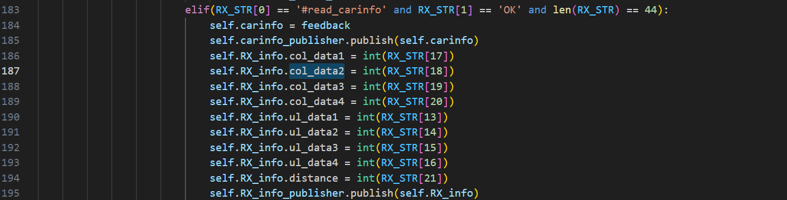

## 1、hfserial.py 文件

主要涉及：

实现了上位机和下位机之间的状态控制和数据交互。上位机发送启动指令后，下位机根据串口反馈进行状态切换，将当前状态以数字标识发布至特定话题。在自动工作阶段，下位机实时发送传感器信息到话题，上位机订阅并更新信息，根据接收的数据生成控制指令并通过串口发送给下位机速度，实现车辆的自动化控制和运行。

上位机发送程序启动指令，在准备阶段：下位机的反馈来进行状态切换，并且将当前状态转化为对应数字标识发送至特定话题中；在进入自动工作阶段时：时刻接收下位机传输而来的传感器信息并发送至话题，进行更新、订阅来自速度话题的信息，并写入到串口，传送给下位机。

- 根据从话题 `TX_num` 接收到的内容选择发送给下位机的内容；
- 根据从话题 `ctrl_command` 接收到的速度信息，由上位机从串口发送给下位机；
- 根据上位机检测到下位机从串口发上来的状态反馈信息，发送对应编码至话题：`RX_num`（`auto_work\n` $\rightarrow$ 1、`work_start\n` $\rightarrow$ 2、`work_stop\n` $\rightarrow$ 3、`#set_mode,OK*\n` $\rightarrow$ 4、`#distance_reset,OK*\n` $\rightarrow$ 5）；
- 空闲指令；
- 持续检测串口反馈信息并根据不同状态（AUTOState）执行相应的操作

1. 串口初始化函数：

	1. RX_num_publisher 发布 Int8 类型数据至话题：`RX_num`；
	2. RX_info_publisher 发布 SensorValue 类型数据：`RX_info`；
	3. carinfo_publisher 发布 String 类型数据：`car_info`；
	4. TX_num_subscriber 订阅来自话题 `TX_num` 的 Int8 类型数据，回调函数：TXHandler；
	5. ctrl_subscriber 订阅来自话题 `ctrl_command` 的 CtrlCommand 类型数据，回调函数：CtrlCommandHandler；

2. 发送状态命令：TXHandler 回调函数：

	1. 主要是上位机向串口写入当前的机器工作状态信息至下位机；

	2. 写入内容为：

		```python
		"#camera,ERROR*\n", 
		"#jeston_check,OK*\n", 
		"set_mode TS\n",
		"set_mode VT\n",
		"alignment_ready\n",
		"alignment_error\n",
		"read_carinfo\n",
		"#work_start,OK*\n",
		"distance_reset\n",
		"#work_stop,OK*\n",
		"#work_warning,OK*\n",
		"#work_continue,OK*\n"
		```

		

3. 发送速度命令：CtrlCommandHandler 回调函数：

	1. 主要是上位机向串口写入当前的机器速度信息（speed，angle）至下位机；
	2. 格式为：`move <speed> <angle>\n`；

4. 自定义命令接收 RxCommand 函数：

	1. 更新类中的 RX_num 参数值
	2. 使用 RX_num_publisher 发布函数接收到的参数至话题 `RX_num`；

5. 自定义发送空闲指令 FreeCLITxCommand 函数：

	1. 主要用于控制串口设备的通信，确保在一定时间间隔内发送空闲指令 `CLI_free\n`，以保持通信连接的活跃状态；

6. 主函数：

	1. 初始化成功（当前自动控制状态被设置为 `START`（程序启动））：

		1. 上位机向串口写入：`program_started\n`；
		2. 如果下位机成功接收到该信息会返回：`#program_started,OK*\n`：
			1. 当前自动控制状态被设置为 `WAITING`（等待自动工作））；

	2. 当前自动控制状态被设置为 `WAITING`（等待自动工作指令））：

		1. 如果上位机在串口中检测到了下位机发送的信息：`auto_work\n'`（==下位机发送的这些消息有什么含义，代表什么动作？==）：
			1. 使用自定义命令接收 RxCommand 函数，并传入参数：`1`：
				1. 更新类中的 RX_num 参数值；
				2. RX_num_publisher 发送 `1`  至话题 `RX_num`；
			2. 当前自动控制状态被设置为 `ALIGNMENT`（对齐））；

	3. 当前自动控制状态被设置为 `ALIGNMENT`（对齐））：

		1. 如果上位机在串口中检测到了下位机发送的信息：`work_start\n`（==下位机发送的这些消息有什么含义，代表什么动作？==）：
			1. 使用自定义命令接收 RxCommand 函数，并传入参数：`2`：
				1. 更新类中的 RX_num 参数值；
				2. RX_num_publisher 发送 `2`  至话题 `RX_num`；
			2. 当前自动控制状态被设置为 `WORK`（工作））；
		2. 如果上位机在串口中检测到了下位机发送的信息：`work_stop\n`（==下位机发送的这些消息有什么含义，代表什么动作？==）：
			1. 使用自定义命令接收 RxCommand 函数，并传入参数：`3`：
				1. 更新类中的 RX_num 参数值；
				2. RX_num_publisher 发送 `3`  至话题 `RX_num`；
			2. 当前自动控制状态被设置为 `WAITING`（等待自动工作））；

	4. 当前自动控制状态被设置为 `WORK`（工作））：

		1. 如果上位机在串口中检测到了下位机发送的信息：`work_stop\n`（==下位机发送的这些消息有什么含义，代表什么动作？==）：

			1. 使用自定义命令接收 RxCommand 函数，并传入参数：`3`：
				1. 更新类中的 RX_num 参数值；
				2. RX_num_publisher 发送 `3`  至话题 `RX_num`；
			2. 当前自动控制状态被设置为 `WAITING`（等待自动工作））；

		2. 如果上位机在串口中检测到了下位机发送的信息：`#set_mode,OK*\n`（==下位机发送的这些消息有什么含义，代表什么动作？==）：

			1. 使用自定义命令接收 RxCommand 函数，并传入参数：`4`：
				1. 更新类中的 RX_num 参数值；
				2. RX_num_publisher 发送 `4`  至话题 `RX_num`；

		3. 如果上位机在串口中检测到了下位机发送的信息：`#distance_reset,OK*\n`（==下位机发送的这些消息有什么含义，代表什么动作？==）：

			1. 使用自定义命令接收 RxCommand 函数，并传入参数：`5`：
				1. 更新类中的 RX_num 参数值；
				2. RX_num_publisher 发送 `5`  至话题 `RX_num`；

		4. 否则，收到的数据内容为：

			1. `#move,OK,speed,angle*\n`（为下位机发给上位机的速度设置成功指令）：

				1. 使用发布者 RX_info_publisher 发送接收到的传感器信息：`ul_data1`、`ul_data2`（==查看了通讯指令集，只有`#move,OK,speed,angle*\n`，没有后面在跟其他信息的指令，该信息从何而来==）至话题 `RX_info`；

			2. `#read_carinfo,OK`（为下位机发给上位机的小车信息指令）（==具体含义不明，通讯指令集里面没有相应的指令==）：

				

	5. 空闲指令 FreeCLITxCommand 函数执行，保持串口通讯；

	


## 2、lining_ctrl.py

主要涉及：实现了基于 PID 路径跟踪控制器，通过订阅和处理来自视觉系统的信息，实现机器人根据当前状态进行不同的路径跟踪、转向或切换路线的控制逻辑。

### 2.1	PD 控制器类

1. PD 控制器类 初始化构造函数：
	1. 初始化比例控制（Kp）、微分控制（Kd）系数和最大输出（output_max）；
	2. 初始化存储误差历史的列表：$[0, 0, 0]$；
2. PD 控制器类 清除误差函数：
	1. 清除控制器的误差值、反馈值和参考值；
3. PD 控制器类 计算误差函数：
	1. 更新误差列表中的值：将上一时刻的误差存入 `error[1]`，将当前的误差存入 `error[0]`；
4. PD 控制器类 计算输出函数：
	1. 根据当前误差和误差变化率，通过比例和微分控制来计算控制器的输出，从而实现对控制系统的调节和稳定控制；
	2. 使用公式：$K_p*e_k+K_d[e_k-e_{k-1}]$ 计算控制器的输出：`output`;
	3. 同时，根据设定的最大输出值 `output_max` 对输出值进行限制；


### 2.2	LiningState 路径跟踪控制器的不同状态类

1. 等待、跟踪路线、离开路线、切换路线和路线跟踪错误


### 2.3	LiningController 路径跟踪控制器类

1. 初始化函数：
	1. 初始化比例增益、微分增益、地点长度、地点宽度、路径跟踪速度；
	2. 初始化 PD 控制器类，传入比例增益和微分增益；
	3. 初始化当前跟踪状态为 WAITING （等待）；
	4. ctrl_publisher 发布 CtrlCommand 类型数据至话题：`ctrl_command`；
	5. mode_publisher 发布 ModeSwitch 类型数据至话题：`mode_switch`；
	6. tx_command_publisher 发布 Int8 类型数据至话题：`tx_command`；
	7. twist_subscriber 订阅来自话题 `duihang` 的 Twist 类型数据，回调函数：LiningMsgHandler；
	8. sub_mode_fb 订阅来自话题 `mode_fb_num` 的 Int8 类型数据，回调函数：ModeFbHandler；
	9. sub_rx_command 订阅来自话题 `rx_command` 的 Int8 类型数据，回调函数：RxCommandHandler；
	10. sub_distance 订阅来自话题 `distance` 的 Float32 类型数据，回调函数：GetDistanceHandler；
2. 订阅对行速度信息命令：LiningMsgHandler 回调函数：
	1. 当正在进行路径跟踪时：
		1. 接收到的速度消息不为0，则计算加权角度，并将其结果作为 PD_controller 控制器的反馈值传入，同时设置当前速度为 0.7 m/s；
		2. 接收到的速度消息为 0，说明机器人停止移动，清除 PD 控制器的状态，记录当前距离信息并将速度设为 0.7m/s，供下次启动时继续进行路线跟踪；（==为什么这里在进行路线跟踪状态会遇到速度为 0 的情况？==）
	2. 当位于等待状态时：
		1. 接收到的速度消息不为0，切换至路径跟踪状态，并计算加权角度作为 PD 控制器的返回值，速度设为 0.7m/s；
		2. 否则报错：传入参数 `5` 给自定义函数 `TxCommand`，并通过发布者 tx_command_publisher 发布该数据；
3. 订阅模式：ModeFbHandler，回调函数：
	1. 传递该参数的值给变量（mode_change_value）状态变化值；
4. 订阅命令接收：RxCommandHandler，回调函数：
	1. 传递该参数的值给变量（rx_command_num）；
5. 订阅接收距离信息命令：GetDistanceHandler，回调函数：
	1. 保存距离信息的参数值给到类中；
6. 执行一次线路控制的操作：ControlOnce 函数（==代码极乱，需要重新梳理逻辑，比如未在if中判断的变量，为什么凭空出现在 elseif的判断语句里面？==）：
	1. 根据当前的路线跟踪标志 `lining_flag` （初始为 `WAITING`）来执行不同的线路逻辑：
	2. 当前状态为 `LINING`：根据当前状态执行路径跟踪动作：
		1. 模式切换值（mode_change_value）为1，执行路径跟踪；
		2. 模式切换值（mode_change_value）为0，执行转向；
		3. 。。。。。
	3. 当前状态为 `LEAVE `：根据当前状态执行离开线路的动作：
		1. 
	4. 当前状态为 `SWITCHING`：根据当前状态执行线路切换的动作；
	5. 其他状态下：停止移动；
7. 自定义速度控制 MoveCtrl 函数：
	1. 通过 ctrl_publisher 发布当前的速度值：线速度和角速度；
8. 自定义发送指令 TxCommand 函数：
	1. 通过 tx_command_publisher 发布参数 tx_command 值；
9. 自定义切换模式 SwitchModeCtrl 函数：
	1. 通过 mode_publisher 发布模式切换命令；
10. 自定义启动关闭视觉导航 Startvisual 函数：
11. 主函数：
	1. 连接摄像头；
	2. 成功后，执行一次路径控制的操作


## 3、motion_ctrl.py

主要涉及：
			通过与硬件进行串行通信，接收和处理硬件反馈，并根据反馈信息发布相应的ROS消息。系统的主要功能包括启动程序、自动工作模式、停止工作模式、模式设置、距离重置和读取车辆信息等。它通过订阅不同话题来处理控制命令和模式切换命令，并将处理结果通过串行端口发送给硬件，实现对机器人的实时控制和状态监控

### 2.1	MotionController 控制器类

1. 初始化函数

	1. 打开指定串口：`/dev/ttyTHS1`
	2. mode_fb_int8_publisher 发布 Int8 类型数据至话题：`mode_fb_num`；
	3. rx_command_publisher 发布 Int8 类型数据至话题：`rx_command`；
	4. distance_publisher 发布 Float32 类型数据至话题：`distance`；
	5. carinfo_publisher 发布 String 类型数据至话题：`car_info`；
	6. ctrl_subscriber 订阅来自话题 `ctrl_command` 的 CtrlCommand 类型数据，回调函数：CtrlCommandHandler；
	7. mode_subscriber 订阅来自话题 `mode_switch` 的 ModeSwitch 类型数据，回调函数：ModeSwitchHandler；
	8. ctrl_subscriber 订阅来自话题 `tx_command` 的 Int8 类型数据，回调函数：TxCommandHandler；

2. SerialCtrlOnce 函数

	1. 记录日志信息

3. 控制命令：CtrlCommandHandler 回调函数：

	1. 更新当前的速度（线速度、角速度）值，并写入到 ctrl_command_str 中；
	2. 以 `move {driving_speed} {steering_angle}` 的格式（即：ctrl_command_str 的内容）写入到串口之中；

4. 发送命令：TxCommandHandler 回调函数：

	1. 根据接收到的命令写入对应的字符串信息到串口：

		`#camera,ERROR*\n`、 `#jeston_check,OK*\n`、`get_distance\n`、`distance_reset\n`、`alignment_error\n"`

5. 模式切换：ModeSwitchHandler 回调函数：

	1. 根据接收到的模式信息转化为相应的数字，与 `ST`、`TL`、`RT` 相对应；
	2. 以 `set_mode `+  `ST`/`TL`/`RT` 的格式写入到串口当中；

6. 主函数：

	1. 当 `autoflag` 标志为 0时，上位机通过串口向下位机发送：`program_started\n`；
	2. 逐行读取串口的数据；
	3. 如果读取信息为：`#program_started,OK*\n`，`autoflag`标志置1；
	4. 如果读取信息为：`auto_work\n`，`rx_command`标志置1，并通过发布者rx_command_publisher 发布数字 `1`；
	5. 如果读取信息为：`#distance_reset,OK*\n`，`rx_command`标志置 2，并通过发布者rx_command_publisher 发布数字 `2`；
	6. 如果读取信息为：`stop_work\n`，`rx_command`标志置3，并通过发布者rx_command_publisher 发布数字 `3`；
	7. 如果读取信息为：`#set_mode,OK*\n`，`mode_fb_int8`标志置1，并通过发布者mode_fb_int8_publisher 发布数字 `1`；
	8. 否则：
		1. 通过分割字符串，得出当前的里程信息：`distance`，并通过发布者 distance_publisher 发布该信息；
		2. 或者通过分割字符串，得出当前的速度信息，存储并打印；
		3. 或者通过分割字符串，得出当前的机器人信息（carinfo），并通过发布者carinfo_publisher 发布当前信息；
	9. 如果程序已启动（`autoflag`为1），每隔一段时间发送`"read_carinfo\n"`命令以读取车辆信息。通过`infocnt`计数器实现定期发送（每15次循环发送一次）。
