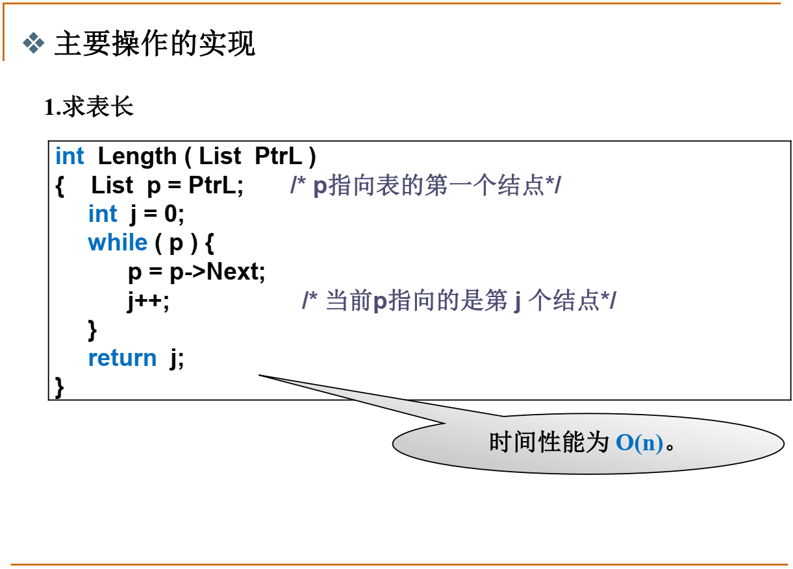
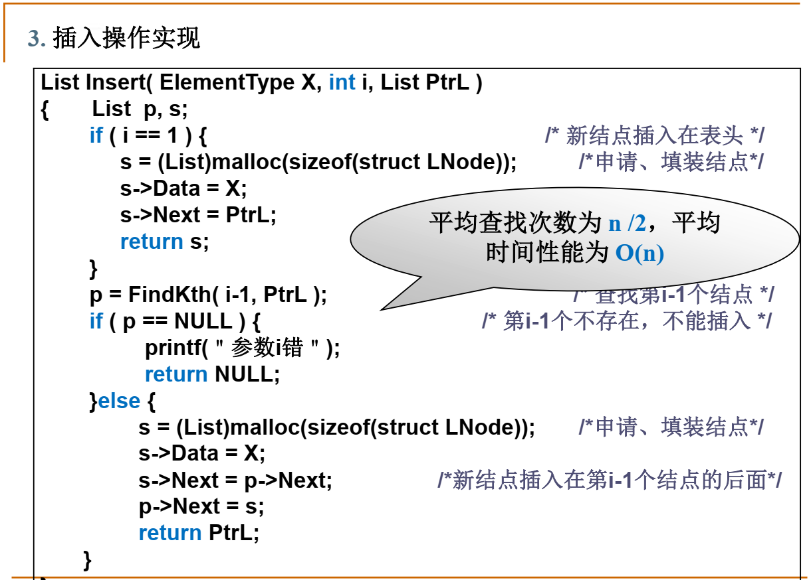
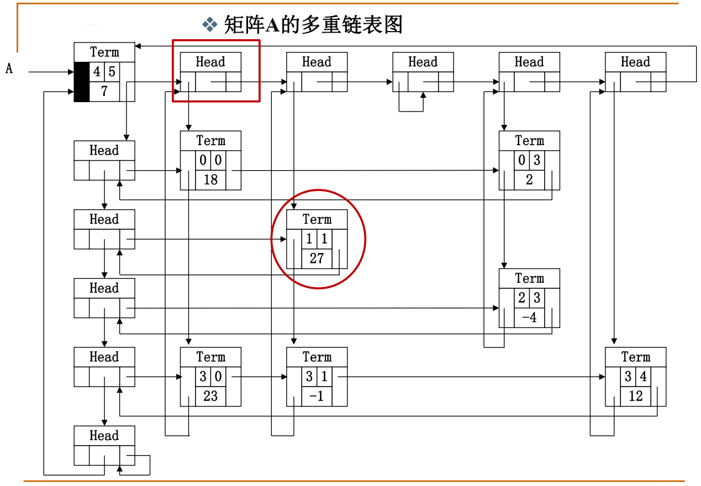
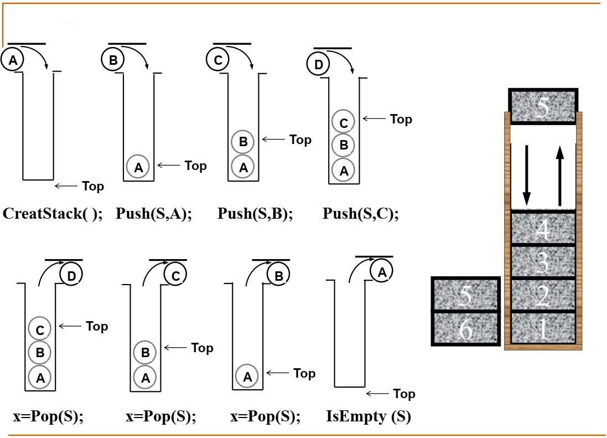

[TOC]

# 前言

1、测试程序的效率（用时长短）

2、 若时间不够一个tick，即输出时间为0，可以设置循环执行或者修改运行截止条件。如下所示：

# 什么是数据结构？？？

1、数据对象在计算机中的组织方式  

1. 逻辑结构  
2. 物理存储结构  

2、数据对象必定与一系列加在其上的操作相关联  

3、完成这些操作所用的方法就是算法  

------

#  第一章	算法基本概念

## 1、定义

## 2、什么是好的算法？  

==空间复杂度S(n)== —— 根据算法写成的程序在执行时==占用存储单元的长度==。这个长度往往与输入数据的规模有关。空间复杂度过高的算法可能导致使用的
内存超限，造成程序非正常中断。

==时间复杂度T(n)== —— 根据算法写成的程序在执行时==耗费时间的长度==。这个长度往往也与输入数据的规模有关。时间复杂度过高的低效算法可能导致我们
在有生之年都等不到运行结果。  

### 2.1	示例：Print（N）函数空间复杂度

假设每个 Print() 函数占用空间复杂度为 C ，那么 N 个便占用 C * N。

### 2.2	示例：double f(int n, double a[], double x) 时间复杂度

 计算乘法的次数：

第一个函数：$pow(x, i)$ 函数是 x 的 i 次方，执行乘法一共 $i-1$ 次，加上 $a[i] * pow(x, i)$ ，一共是 i 次乘法。for循环中 i 从 1 到 n，所以一共是（1+2+···+n）；

第二个函数：该函数每次循环只执行一次乘法，那么循环结束一共执行n次。

## 3、最坏情况复杂度和平均复杂度

最坏情况复杂度与平均复杂度：

## 4、复杂度的渐进表示

### 4.1	定义

$f(n)$ ：代表复杂度的上界；

$g(n)$ ：复杂度的下界；

$h(n)$：既是上界也是下界。

但并不是上界越大越好，下界越低越好。希望能够符合真实情况。因此，希望找到能力范围内的最小的上界、最大的下界。

### 4.2	常见函数随 n 增加而发生的变化：

输入 n 从1、2、4···32，不同函数的变化：

$log n$ ：看起来这个表格中的 $log$ 是以 2 为底，但这里并不是漏写，而是不管以何数为底，都是==只差一个常数倍！==

### 4.3	复杂度直观表示图：

### 4.4	复杂度的计算机运行时间表

值得一提的是：复杂度在 $2^n$ 时，当 $n = 100$ 便算不出结果。

### 4.5	复杂度分析小窍门

------

## 5、应用实例：最大子列和问题

更准确来讲：最大连续子列和问题

问题：

### 5.1	算法1

算出所有可能的连续子列和进行比较，复杂度计算：

内置的两个 for 循环复杂度：$(N-i)(j-i)$，其中 $i \leqslant j \leqslant N$，因此$0\leqslant (N-i)(j-i) \leqslant(N-i)(N-i)$，加上外层的 for 循环复杂度N，总复杂度为$O(N^3)$。

### 5.2	算法2

经过观察发现，算法1中最内层的for循环累加得到的 $ThisSum$，实际上等于上一次的 $ThisSum$再加上一个 $A[j]$，此算法的复杂度为：$O(N^2)$。

### 5.3	算法3

分而治之法基本思想：将原问题拆分为若干小型问题，分别解决后再将结果合而治之，用递归实现非常方便。

就此题而言：把原始序列一分为二，那么最大子列或者在左半边、或者在右半边、或者是横跨中线的一段。

举例：假设有如下数组：4	-3	5	-2	-1	2	6	-2，求max{0，最大连续子列和}

一分为二： 4	-3	5	-2	|||	-1	2	6	-2

再分为二：4	-3||5	-2	|||	-1	2||6	-2

最后再分：4 | -3 || 5 | -2 ||| -1 |2||6|-2

1、单看4 | -3，求max，左边最大子列和为4，右边最大子列和为0，横跨结果为-1，很显然最大子列和为4，而无需包括 -3；

2、单看5 | -2，求max，左边最大子列和为5，右边最大子列和为-2，横跨结果为3，很显然最大子列和为5，而无需包括 -2；

3、单看4	-3||5	-2，求max，根据上一步结果，左边最大子列和为4，右边最大子列和为5，横跨最大子列和为 $4+(-3)+5=6$，（为什么到-2之前停止，而加上了-3：因为加-3的目的是为了带上4，$4+(-3)=1>0$，所以能对最大子列和做出贡献，因而可以加上；但-2在右侧，只会给最大连续子列和带来负面效果，因此无需加上；

4、单看-1	2||6	-2，同理可以得出最大连续子列和为8；

5、在左半边的最大连续子列和为6、在右半边的最大连续子列和为8、横跨中线的一段为11；

6、因此最大连续子列和为11。

7、复杂度计算：

1. 整个过程复杂度为 $T(N)$，那么左半部分和右半部分则分别为 $T(N/2)$，横跨中线的一段左右遍历的复杂度为 $O(N)$；
2. $T(N) = 2T(N/2) + O(N)$
3. 将$N=N/2$代入得：$T(N/2) = 2T(N/2^2) + O(N/2)$
4. 将步骤三带入步骤二：$T(N) = 2T(N/2) + O(N)= 2^2T(N/2^2) + 2O(N/2)+O(N)=2^2T(N/2^2)+2*c*N/2+cN=2^2T(N/2^2)+2cN=……=2^kT(N/2^k)+ckN=2^kO(1)+ckN$
5. 根据$N/2^k=1$可得$k=log_2N$最终复杂度为$O(NlogN)$

​		

### 5.4	算法4

假设有如下序列：-1	3 	-2	4	-6	1	6	-1

1、预设 ThisSum 和 MaxSum 为 0；

2、从 -1 开始，当前 ThisSum 为 -1 < 0，则判断 -1 不可能使后续结果变大，舍去（置 0 ）；

3、 加上 3 ，当前 ThisSum 为 3 > MaxSum，更新 MaxSum 值为 3；

4、加上 -2，当前 ThisSum 为 1 < MaxSum，不更新 MaxSum 值，但ThisSum > 0，仍保留 -2；

5、加上 4， 当前 ThisSum 为 5 > MaxSum，更新 MaxSum 值为5；

6、加上 -6，当前 ThisSum 为 -1 < 0，则判断 -1 不可能使后续结果变大，舍去（置 0）；

7、从 1 重新开始，当前 ThisSum 为 1 < MaxSum，不更新 MaxSum 值，但ThisSum > 0，保留1；

8、加上6，当前 ThisSum 为 7 > MaxSum，更新 MaxSum 值为7；

9、加上-1，当前 ThisSum 为 6 < MaxSum，不更新 MaxSum 值，但ThisSum > 0，仍保留 -1······

10、复杂度为$O(N)$

# 第二章	线性结构

## 1、线性表及其实现

### 1.1	问题提出：如何表示多项式

### 1.2	顺序存储结构直接表示

但出现问题：如果一个个的表示，但是存在众多零项，浪费内存！

### 1.3	顺序存储结构表示非零项

#### 1.3.1	用结构数组存储非零项

#### 1.3.2	练习

两个多项式相加的前提是：相加的两个多项式==按指数大小有序存储==

### 1.4	链表结构存储非零项

### 1.5	线性表概念引出

#### 1.5.1	线性表的定义

#### 1.5.2	线性表的抽象数据类型描述

#### 1.5.3	线性表的顺序存储实现

#### 1.5.4	线性表的顺序表主要操作的实现

1、初始化顺序表和查找功能

2、插入操作实现

从链表的最后一个元素开始，依次往后移一位，直至空出指定位置为止。

3、删除

#### 1.5.5	线性表的链式存储实现

#### 1.5.6	线性表的链式存储主要操作实现

1、求表长

2、查找

3、插入

4、删除

#### 1.5.7	广义表

#### 1.5.8	多重链表

## 2、堆栈

### 前言

本篇总结了数据结构里有关堆栈的知识点。

### 1.1	堆栈的概念

堆栈是一种线性结构，也是一个特殊的线性表。堆栈在计算机学科领域里面有广泛的用途，比如函数调用,递归,表达式求值，不要用到堆栈。那么到底什么是堆栈呢?下面让我们来看一个例子。

### 1.2	后缀表达式

### 1.3	堆栈的抽象数据类型描述

==不能输出CAB这个序列！！！==

### 1.4	栈的顺序存储实现

### 1.5	堆栈的链式存储实现

### 1.6	堆栈应用：表达式求值

详情参考文章：https://blog.csdn.net/Amentos/article/details/127182926

原理：

从左至右依次遍历中缀表达式各个字符（需要准备一个字符栈存储操作符和括号）

1、字符为 **运算数** ：

直接送入后缀表达式（注：需要先分析出完整的运算数）。

2、字符为 **左括号** ：

直接入栈（注：左括号入栈后优先级降至最低）。

3、字符为 **右括号** ：

直接出栈，并将出栈字符依次送入后缀表达式，直到栈顶字符为左括号（左括号也要出栈，但不送入后缀表达式）。

总结：只要满足 栈顶为左括号 即可进行最后一次出栈。

4、字符为 **操作符** ：

若栈空，直接入栈。

若栈非空，判断栈顶操作符，若栈顶操作符优先级低于该操作符，该操作符入栈；否则一直出栈，并将出栈字符依次送入后缀表达式，直到栈空或栈顶操作符优先级低于该操作符，该操作符再入栈。

==总结：只要满足 栈空 或者 优先级高于栈顶操作符 即可停止出栈，并将该操作符入栈。==

5、重复以上步骤直至遍历完成中缀表达式，接着判断字符栈是否为空，非空则直接出栈，并将出栈字符依次送入后缀表达式。

注：中缀表达式遍历完成，栈中可能还有字符未输出，故需要判断栈空。

### 1.7	堆栈的其他应用

