## 1、ROS中的导航框架

以百度地图为例：

Goal：百度地图输入目的地

AMCL：通过手机GPS定位当前位置

Path Planner：根据百度地图内嵌的静态地图规划出一条最优路径（全局规划）

move_base： 本地规划；但在ROS中move_base是一个功能包（包含了本地规划和全局规划）

/cmd_vel + odom：本地规划规划器发送速度值

Base Controller：将给定速度发给底盘控制器

Motor Speeds：控制电机速度


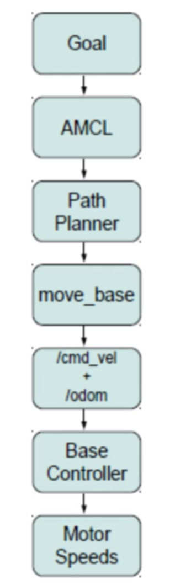

基于 move_base 的导航框架：

白色和灰色不需要关注。主要关注蓝色部分，是我们需要通过算法实现的。 

recovery_behaviors：机器人被卡死时的恢复机制。

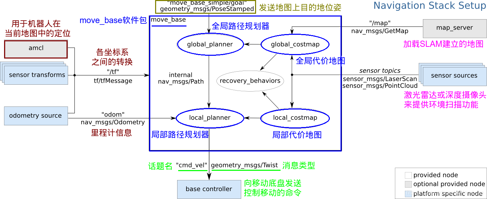


odom：ROS 中有两种含义，一种是TF坐标变换中的 odom 坐标系；另一种在话题中指的是机器人的实时位置。

所需要求：

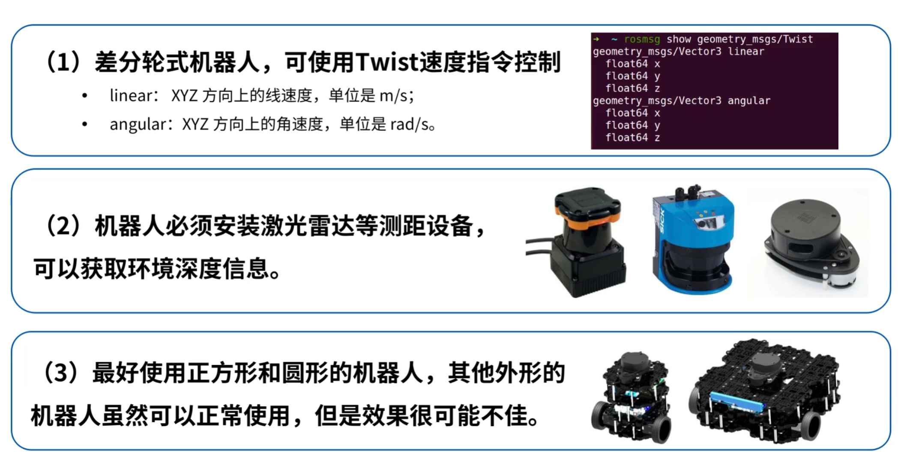


## 2、导航框架中的关键功能包

Dijkstra：路径最优

A*：路径不一定最优，但是时间最短

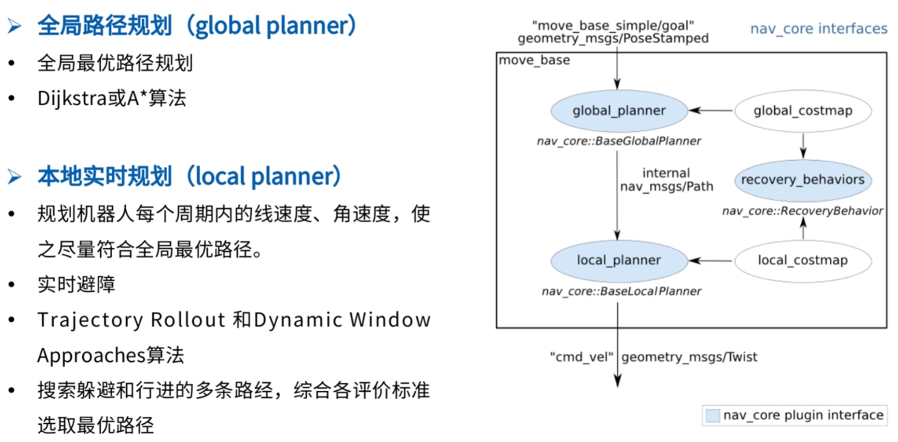


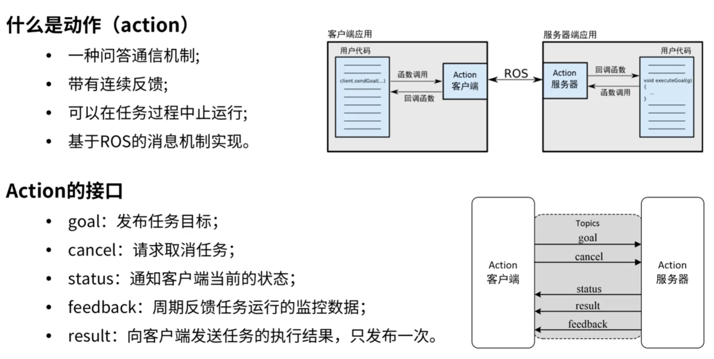

下方Action的五个接口对应上图。

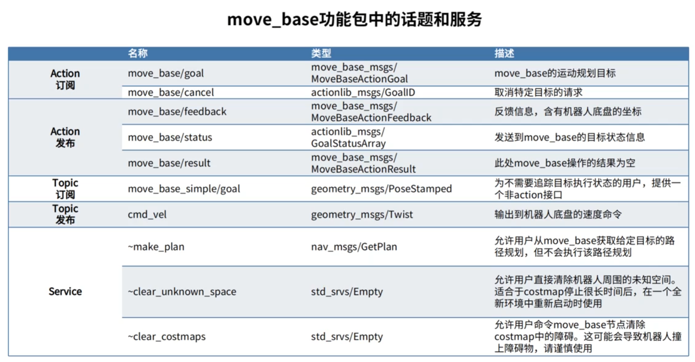


==具体参数介绍参照move_base 在 wiki 中的介绍或者 ros 机器人开发实践==

==先去看 ros wiki 中 move_base 的算法含义再看参数！==

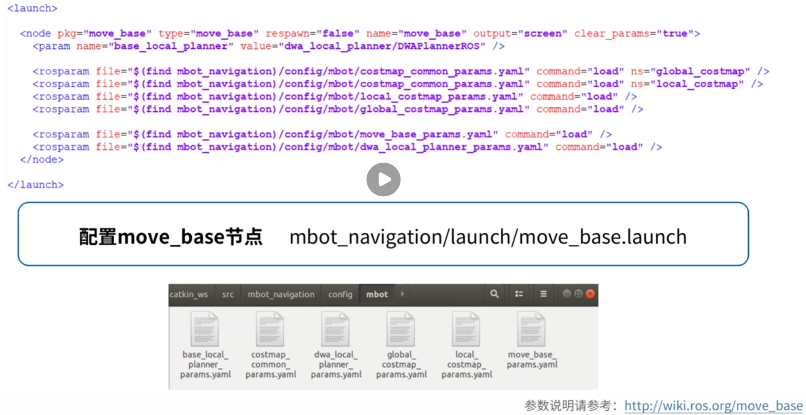


本地规划器的算法：base_local_planner_params.yaml 与 dwa_local_planner_params.yaml 两个二选一


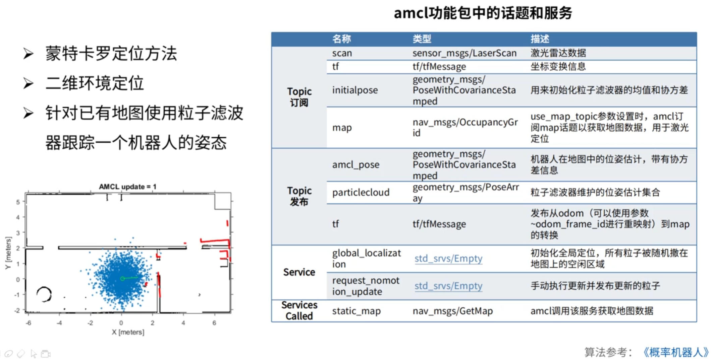


map_frame：雷达信息，会发生突变

odom_frame：里程计信息，不会发生突变

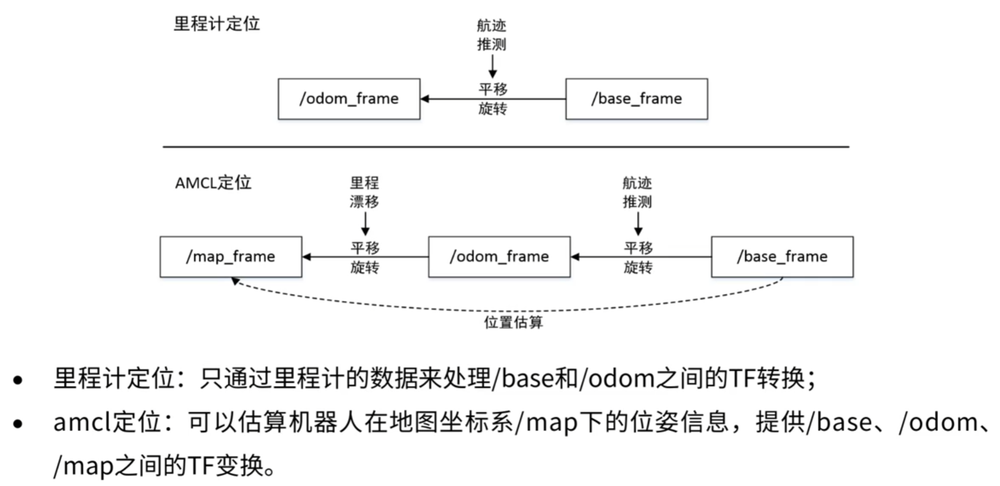


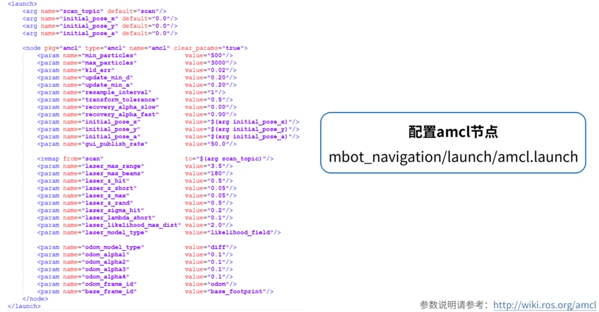


## 3、机器人自主导航案例

### 3.1	实现导航

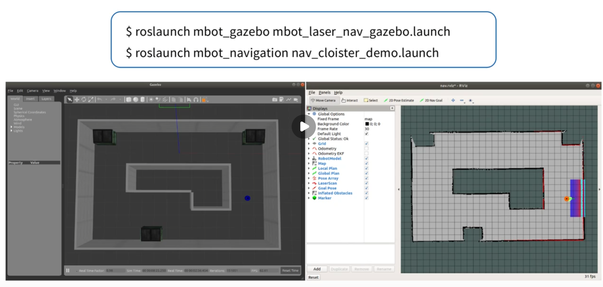


### 3.2	在此基础上：使用py文件或者cpp文件设置目标点

运行

```
rosrun mbot_navigation move_test.py
```

可以使机器人自动到达目标点。（也有cpp实现）

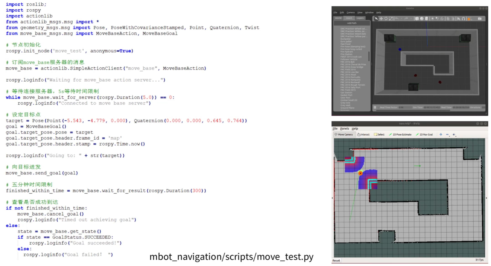

### 3.3	试验随机目标点

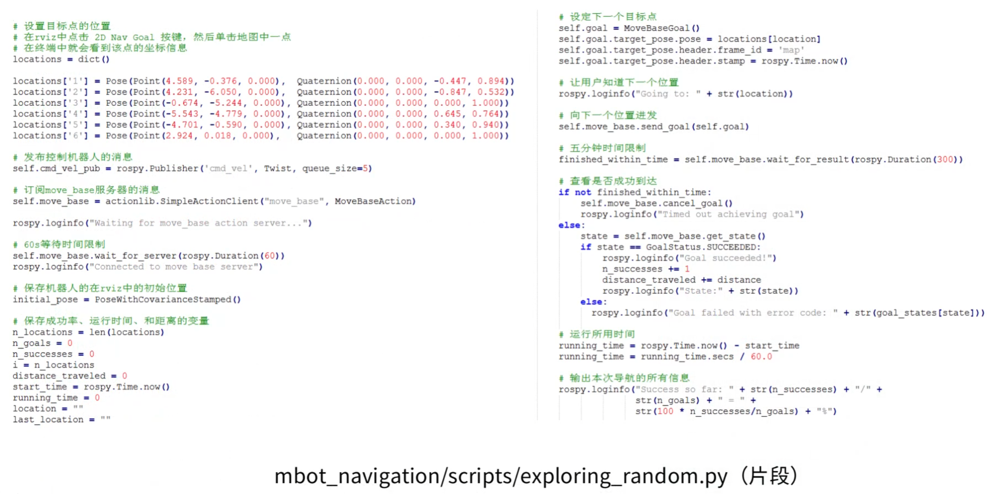


### 3.4	机器人自主完成建图（边建图边路径规划）


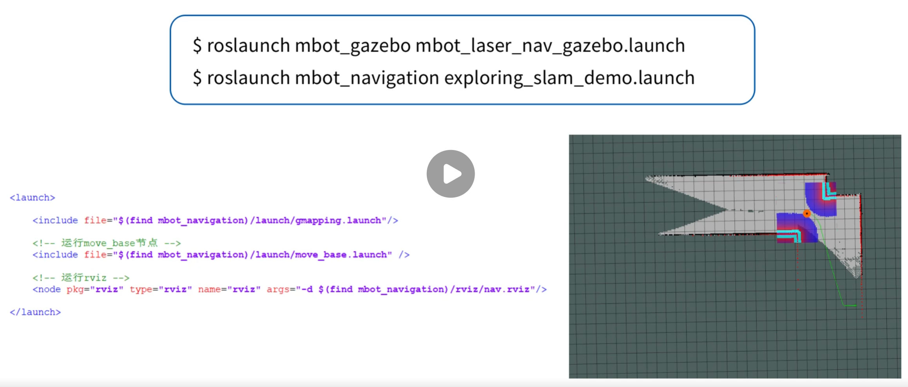


### 3.5	结合随机点来探索地图

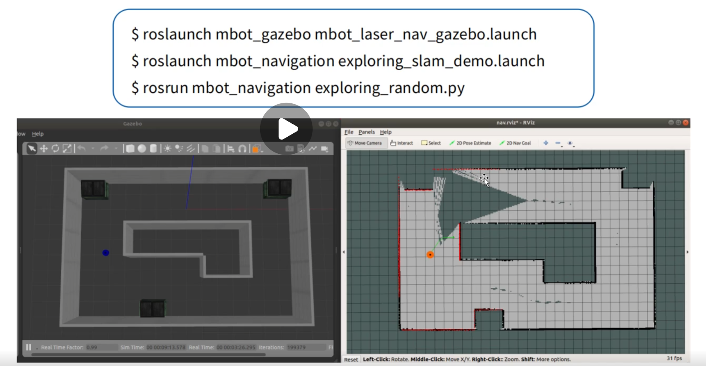
